# Глава 1

**ВВЕДЕНИЕ В РЕВЕРСИНГ С НУЛЯ ИСПОЛЬЗУЯ IDA PRO**

Идея этой серии туториалов состоит в том, чтобы обновить наш оригинальный курс крэкинга и ревериснга по **OLLYDBG** ([YouTube](https://www.youtube.com/playlist?list=PL59fvn5FIiQG0CrnALLgXzdpDTOk0hrz2), [gitbook](https://github.com/yutewiy0f/intro-cracking-with-ollydbg). На этот раз мы будем использовать **IDA PRO**. Мы научимся использовать **IDA** с нуля, а также будем работать на более обновленной системе **WINDOWS**. В этом случае мы будем использовать **WINDOWS 10 X64 ANNIVERSARY UPDATE** со всеми патчами вплотьдо **29** октября **2016** года.

**ПОЧЕМУ ЖЕ IDA PRO**

Потому что, пока, **OllyDbg** ограничивает нас в работе, так как он всего лишь **32**-х битный отладчик пользовательского режима **WINDOWS**. **IDA PRO** же является законченным инструментом для реверсинга, который можно использовать в **32**-х и **64**-х битных системах как дизассемблер и отладчик. Она допускает статический реверсинг, чего нельзя сделать с помощью **OllyDbg**. А также тот, кто научится её использовать, несмотря на повышенную сложность при обучении, получит возможность работать нативно в **WINDOWS**, **LINUX** или **MAC OS X** и удаленно в следующих операционных системах.

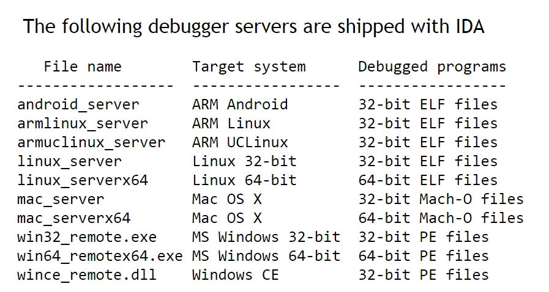

Чтобы иметь представление о поддерживаемых процессорах, ниже представлен ихсписок:

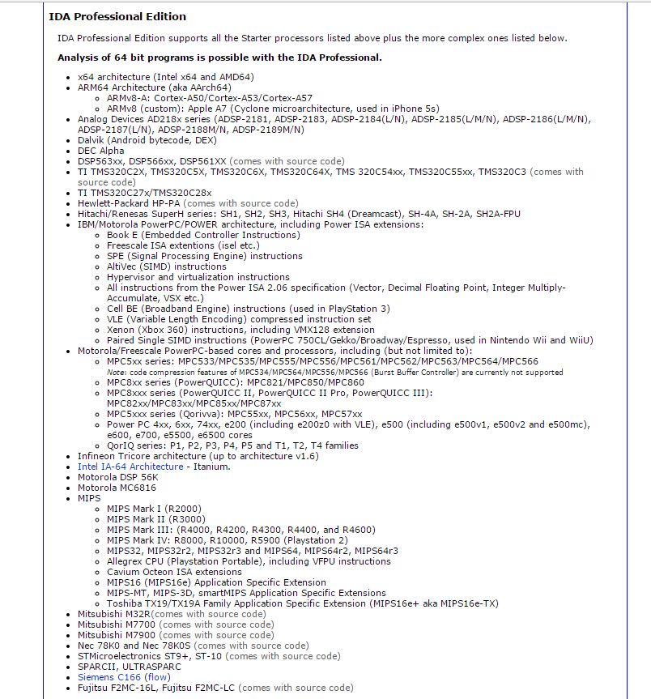

Как мы видим, обучение использованию **IDA** позволит нам расширить наше рабочее пространство. Хотя в этом курсе мы будем сосредотачиваться на **32**-х и **64**-х битной **WINDOWS** в пользовательском режиме, но иногда мы будем работать и в режиме ядра. Сам факт знакомства с инструментом позволит нам легко адаптироваться к любому её использованию.

Идея этих руководств состоит в том, чтобы начать с нуля. Другими словами, многие вещи, которые мы видели во [**"ВВЕДЕНИИ В ОТЛАДКУ С НУЛЯ С ИСПОЛЬЗОВАНИЕМ OllyDbg"**](https://github.com/yutewiy0f/intro-cracking-with-ollydbg), будут видны здесь снова, но в **IDA** я постараюсь объяснить больше.

Если кто-то видит, что то, что он читает является слишком сложным, то сначала будет правильным прочитать курс [**"ВВЕДЕНИИ В ОТЛАДКУ С НУЛЯ С ИСПОЛЬЗОВАНИЕМ OllyDbg"**](https://github.com/yutewiy0f/intro-cracking-with-ollydbg), который немного проще. В этом курсе будет все: статический и динамический реверсинг, крэкинг, эксплоитинг, распаковка. Мы будем стараться охватить как можно больше тем, начиная с нуля.

**ОБО ВСЁМ ПО ПОРЯДКУ**

Первым делом нужно получить **IDA PRO**. Проблема в том, что это платная программа и мы не можем получить её просто так, не заплатив хороших песо, которых она стоит.

Также мы не можем распространять её. Но мы ищем через **GOOGLE** программу по такому запросу - "**IDA PRO 6.8 + HEXRAYS".** И это та версия, с которой мы будем работать и это последняя доступная версия(была на тот момент, прим. Яши). Вы можете скачать ее без проблем с интернета.

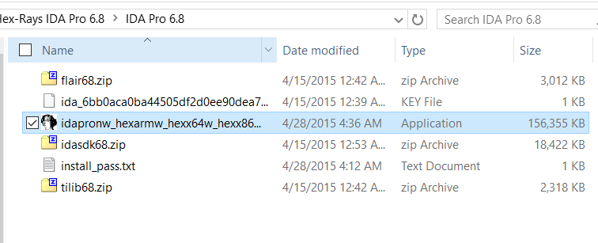

Здесь мы видим файлы и **ZIP**-архивы, которые мы скачали. Сам установщик называется

**idapronw\_hexarmw\_hexx64w\_hexx86w\_150413\_cb5d8b3937caf856aaae75 0455d2b4ae**

При установке программа запросит пароль, который находится в файле **INSTALL\_PASS.TXT

Также при установке **IDA** нам установится **PYTHON 2.7.6**. Очень удобно работать с версией **PYTHON**, включенной в **IDA** и не иметь проблем с совместимостью, поэтому перед установкой **IDA** рекомендуется удалить другой **PYTHON**, который уже установлен в системе, чтобы не было конфликтов.

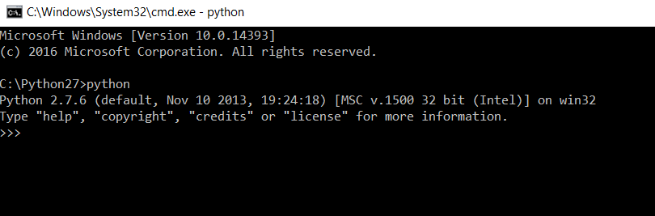

После установки мы можем запустить **IDA** впервые. И, как всегда, мы будем открывать, как и в любом другом нашем курсе, которым мы гордимся, крэкми **CRUEHEAD**, который будет приложен к этой главе.

Поскольку это **32**-х битный исполняемый файл, мы открываем его **32**-х битной версией **IDA**, которая запускается с этого ярлыка.

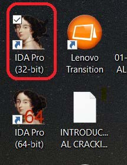

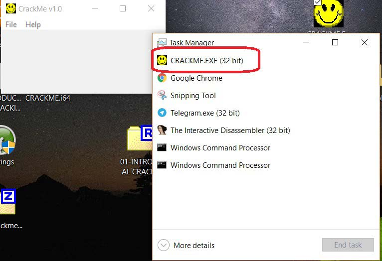

Если мы запустим крэкми вне **IDA**, в диспетчере задач **WINDOWS** мы увидим, что это **32**-х битный процесс. Если мы хотим увидеть, является ли крэкми **32**-х битным или **64**-х битным без запуска, мы можем использовать шестнадцатеричный редактор.

Например такой.

[**https://mh-nexus.de/en/downloads.php?product=HxD**](https://mh-nexus.de/en/downloads.php?product=HxD)​

Отсюда можно загрузить и установить **HXD**.

[**http://mh-nexus.de/downloads/HxDSetupES.zip**](http://mh-nexus.de/downloads/HxDSetupES.zip)​

Это ссылка на испанскую версия.

Один из быстрых способом узнать, является ли файл **32**-х битным или **64**-х битным это открыть файл в шестнадцатеричном редакторе.

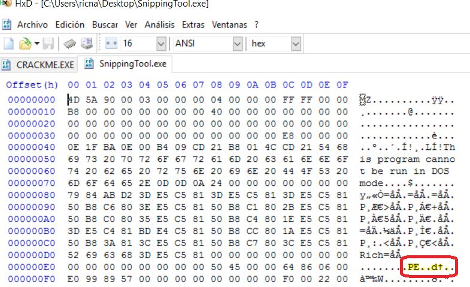

Это **64**-х битный нативный исполняемый файл. **SNIPPING TOOL** включен в новые версии **WINDOWS**  и мы видим, что после слова **PE** идут следующие символы.

```
PE..d†
```

В то время как крэкми **CRUEHEAD**, который является **32**-х битным после **PE** имеет другие символы:

```
PE..L
```

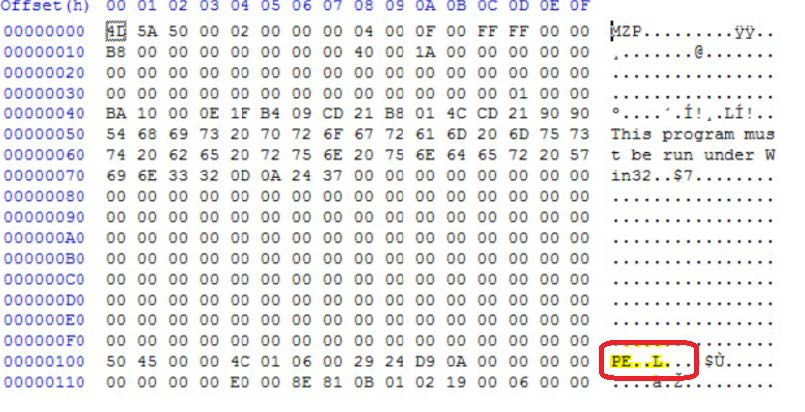

Итак, мы уже знаем, что мы должны открыть крэкми с помощью **32**-х битной версией **IDA**. Мы используем вышеупомянутый ярлык. Когда нам покажется окно **IDA QUICK START**, мы выбираем **NEW**, чтобы открыть новый файл, ищем файл крэкми и открываем его.

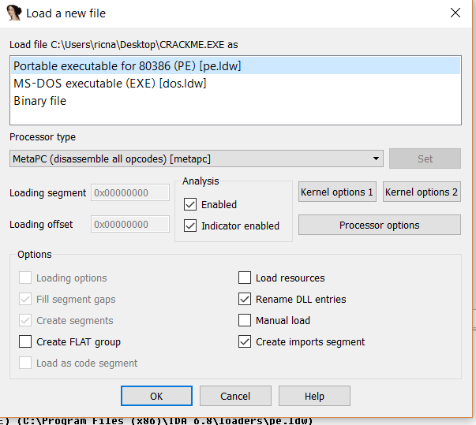

Сейчас мы оставляем все настройки как есть, так как **IDA** обнаруживает верно, что это исполняемый файл **PE** и мы нажимаем **ОК**.

Если мы согласимся с режимом **PROXIMITY VIEW** с помощью кнопки **YES**, мы увидим дерево функций программы как на скриншоте.

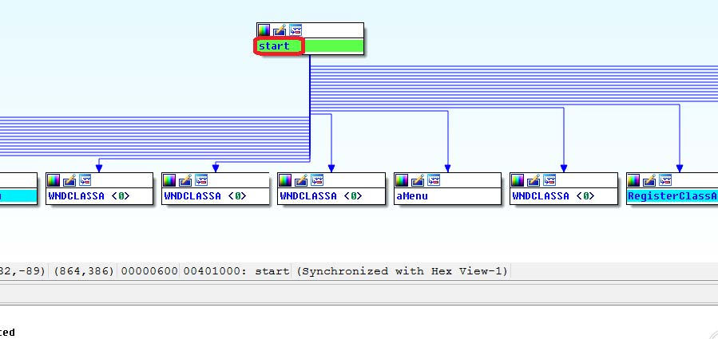

Чтобы перейти в графический режим или в список инструкций, мы можем сделать это нажимая пробел.

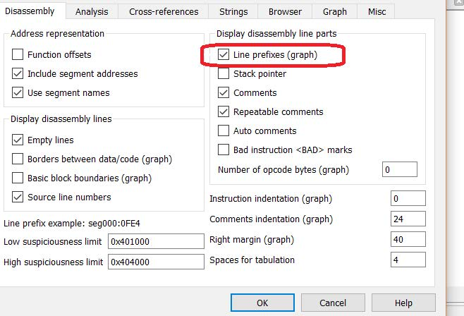

Также в **OPTIONS → GENERAL → LINE PREFIXES** мы можем добавить адреса перед графическим представлением, а в **NUMBER OF OPCODE BYTES**, если мы изменим значение на **10**, мы увидим коды операций или байты, которые составляют каждую инструкцию.

При открытии исполняемого файла первое, что открывается в этом же окне это представление дизассемблера (то, что разработчики назвали **ЗАГРУЗЧИК**), и которое не выполняет программу, а только анализирует её в целях реверсинга, создавая файл **IDB** или базу данных **IDA**.

Для отладки мы должны выбрать между различными возможными отладчиками, которые включены в **IDA**, и запустить **IDA** в режиме **DEBUGGER**, который мы рассмотрим позже.

Мы видим, что у программы есть много опций. Они выглядят как вкладки, и при переходе в меню **VIEW → OPEN SUBVIEW** мы можем открывать вкладки по своему вкусу и необходимости, чтобы не было слишком много открытых.


Одно из возможных недоразумений или неудобств заключается в том, что при использовании **IDA** до тех пор, пока она не станет нам привычным инструментом, есть части окна, где есть несколько упоминаний одного и того же адреса как например в начале функции адрес повторяется по несколько раз. Это происходит, потому что начиная с этого адреса много информации и она не помещается в одной строке и идет перенос на новую строку.

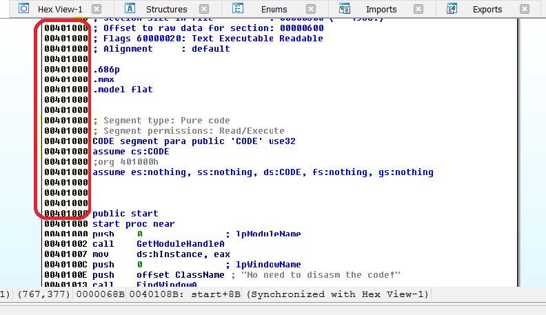

То же самое, произойдет когда мы достигнем конца файла и увидим, что повторяется тот же адрес. Здесь мы находим начало дизассемблированного списка. В этом случае инструкция соответствующая адресу **0x00401000**, равна **PUSH 0**.

**IDA** имеет возможность настройки интерфейса по умолчанию отдельно для **ЗАГРУЗЧИКА** и **ОТЛАДЧИКА**.

После того, как мы установим например в **ЗАГРУЗЧИКЕ** окна и вкладки, которые мы больше всего используем по своему вкусу, мы идем в **WINDOWS → SAVE DESKTOP** и устанавливаем галочку по умолчанию, сохраняя конфигурацию по умолчанию. Тоже самое мы можем сделать для настроек, когда мы запускаем **IDA** в режиме отладчика и меняем в конфигурации по умолчанию, отличную от **ЗАГРУЗЧИКА**.

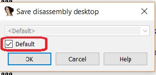

На любой из вкладок **IDA**, где есть списки, как например **FUNCTIONS**, **STRINGS**, **NAMES** и т.д.,

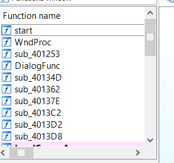

Мы можем искать данные с помощью **CTRL+F**. Так нам открывается поисковая система, которая фильтрует вывод в соответствии с тем, что мы печатаем.

Через **VIEW → OPEN SUBVIEW → STRINGS** как в этом случае, мне покажутся строки, которые содержат слово **"TRY"**.

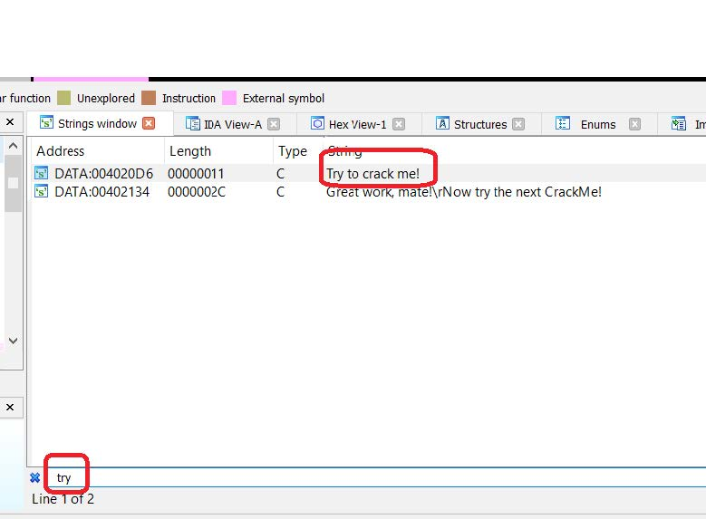

Также если мы пойдем в **VIEW → OPEN SUBVIEW → DISASSEMBLY**, я могу открыть второе окно дизассемблера, которое может показать функцию, отличную от первой, и, таким образом, у меня есть возможность видеть много функций одновременно.

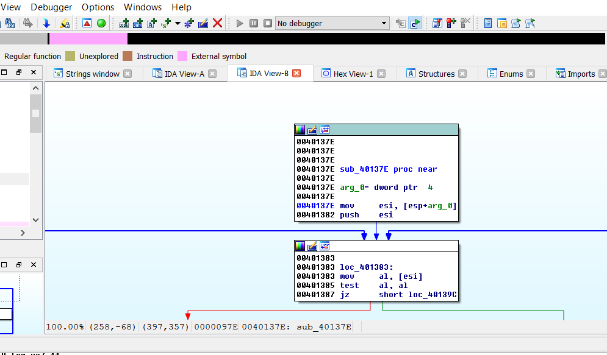

**VIEW → OPEN SUBVIEW → HEX DUMP** - для открытия вкладки с шестнадцатеричным представлением.


**VIEW → OPEN SUBVIEW → IMPORTS** - вкладка импортированных функций.


В **VIEW** активирован пункт **GRAPH OVERVIEW**, который представляет собой навигатор по графике видимой функции. Мы можем перемещать и изменять часть, которая в данный момент отображается на экране.


Также у **IDA** есть вкладки, посвященные **СТРУКТУРАМ**, **ЭКСПОРТУ**, **ИМЕНАМ(SHIFT+F4)**, **СЕГМЕНТАМ(SHIFT+F7)** и т.д. которые мы объясним по мере их использования.

Верхняя панель навигатора показывает разные части исполняемого файла разными цветами.


Чуть ниже нам поясняется, что означает каждый цвет. Например, серый - это секция данных, и если мы нажмем на панель в этой серой части, курсор переместится в ту секцию, адреса которые серые. На рисунке мы видим, что розовая часть соответствует внешним функциям или секции **IDATA**, а синяя часть соответствует части, в которой определены функции в секции кода.

Конечно, в нашей первой главе мы сделали быстрый обзор программы. В последующих главах мы будем двигаться быстрее.

Автор оригинального текста — Рикардо Нарваха.

Перевод и адаптация на английский  язык — IvinsonCLS.

Перевод и адаптация на русский язык — Яша Яшечкин.

30.07.19

Источник:
[**http://ricardonarvaja.info/WEB/INTRODUCCION AL REVERSING CON IDA PRO DESDE CERO/EN INGLES/**](http://ricardonarvaja.info/WEB/INTRODUCCION%20AL%20REVERSING%20CON%20IDA%20PRO%20DESDE%20CERO/EN%20INGLES/)

Помочь текущему проекту и будущим можно через домашнюю страничку

http://yasha.su или через сеть биткоина 18Tgk6ynZw3hvoe7NdGxigmSi9qSc89dQ1

[**https://www.youtube.com/watch?v=GgG9r6ZFDBM**](https://www.youtube.com/watch?v=GgG9r6ZFDBM)
