# Часть 2

Так как этот курс называется введение с нуля, есть вещи про которые многие уже знают, если Вы один из них, пропустите эту главу если хотите, но большинству они не знакомы, я верю, что это важно, поэтому я добавил эту информацию.

**СИСТЕМЫ СЧИСЛЕНИЯ**

Три наиболее часто используемые системы счисления это двоичная, десятичная и шестнадцатеричная.

Базовые концепции каждой из системы рассмотрим ниже:

ДВОИЧНАЯ: Числа представляются двумя символами **0** и **1**, вот почему она называется ДВОИЧНАЯ.

ДЕСЯТИЧНАЯ: Все числа представляются с помощью **10** символов\(от **0** до **9**\), вот почему она называется ДЕСЯТИЧНАЯ.

ШЕСТНАДЦАТЕРИЧНАЯ: Все числа представляются с помощью символов от 0 до F \( от 0 до 9, далее A, B, C, D, E и F, или 16 символов в итоге\).

Мы видим, что в нижней части **IDA** есть один коммандбар, чтобы исполнять команды **PYTHON**, он поможет переводить числа из одной системы в другую быстрее и проще.

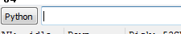

Если я введу, например **0x45,** он интерпретирует это как 16-ное число, т.к. в начале стоят символы **0x**, мы можем конвертировать из 16-ной в десятичную, одиночным нажатием **ENTER**.


Нажимаем

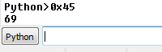

Это даёт нам **69,** что есть **0x45** в 16-ной системе.

Если мы хотим сделать обратное преобразование, то будем использовать функцию **hex\(\)**


Чтобы получить двоичное представление, будем использовать **bin\(\)**

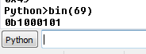


Результат равен **1000101,** **0b** в начале означает двоичный, также панель может конвертировать из двоичной в десятичную или в 16-ную.


Любое число введенное непосредственно в окно, после нажатия **ENTER,** покажет результат в десятичной системе, чтобы получить числа в **HEX** или **BIN,** будем использовать функции **Python** **hex\(\)** или **bin\(\).**

Для управления такими преобразованиями в **IDA** есть интегрированный калькулятор, в **VIEW - CALCULATOR**, он позволяет увидеть преобразованное число во всех системах счисления сразу, и, кроме того, показывает его соответствие символу, если оно есть, в случае c **0x45** – это **E**.


**ОТРИЦАТЕЛЬНЫЕ ЧИСЛА В 16-НОМ ПРЕДСТАВЛЕНИИ**

Почти всегда, в любой момент времени, мы будем работать в **HEX’e**, но сейчас вопрос таков, как представляются отрицательные 16-ные числа в 32-битной системе?

В 32-битных двоичных числах мы будем использовать первый бит, который означает следующее, если он равен 0, то число положительное и если равен 1, то число отрицательное.

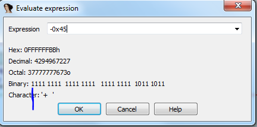

Мы видим, что значение для примера **-0x45** в 16-ном виде может быть представлено как **0xffffffbb** и что его первый байт равен 1 в двоичной системе.

Таким образом минимальное положительное значение очевидно 0, но какое должно быть наибольшее положительное значение, которое мы можем представить?

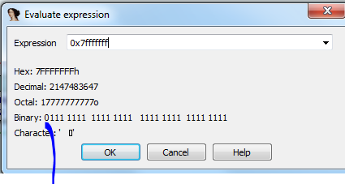

Мы видим, что **0x7fffffff** наибольшее положительное, если мы рассмотрим знак, как только мы добавим единицу все остальные биты кроме первого станут равны единице.

Если мы добавим один


Видим, что первый бит изменился на **1** и все остальные стали равным **0**.

Анализатор рассматриваем все числа как положительные, до тех пор, пока мы не добавим знак минус, например.

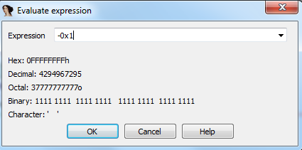

Мы видим, что минимальное отрицательное значение **-1** соответствует **0xFFFFFFFF** и максимальное отрицательное значение будет **0x80000000**.

Или, когда в операции мы не рассматриваем знак, то все значения будут положительными от **0 до** **0xFFFFFFFF**.

В то время, если мы рассматриваем в операции знак, то положительные будут от **0x0** до **0x7FFFFFFF** и отрицательные будут от **0xFFFFFFFF** до **0x80000000**.

**ПОЛОЖИТЕЛЬНЫЕ**

```
000000000 эквивалентно 0 в десятичной
000000001 эквивалентно 1 в десятичной
………………………………
………………………………
7FFFFFFF эквивалентно 2147483647 в десятичной (это будет максимальное положительное число)
```
**ОТРИЦАТЕЛЬНЫЕ**

```
FFFFFFFF эквивалентно -1 в десятичной
FFFFFFFE эквивалентно -2 в десятичной
………………………………
………………………………
80000000 будет равно -2147483648 в десятичной (это будет наибольшее отрицательное число)
```


**СИМВОЛЫ ASCII**

Один из вопросов, с которыми мы должны ознакомиться, это вид, в котором система выводит данные на экран, для этого она присваивает каждому символу шестнадцатеричное значение, так что их можно интерпретировать, как если бы это были буквы, цифры, символы и т.д.

Далее, в первом столбце мы видим десятичное значение, во втором столбце - шестнадцатеричное значение, и в третьем – символ; если, например, нужно вставить пробел, то следует использовать **0x20** или десятичное **32** и любой необходимый символ, будь то буква или число, который можно увидеть в этой табличке.

Как видим, в калькуляторе, который оценивает выражения, **IDA** показывает соответствующие символы, как мы видели в случае **0x45** – **E.**


Также в строке для **Python** можно использовать функцию **chr\(\)**


В окне **HEX DUMP** есть колонка, которая показывает все символы.


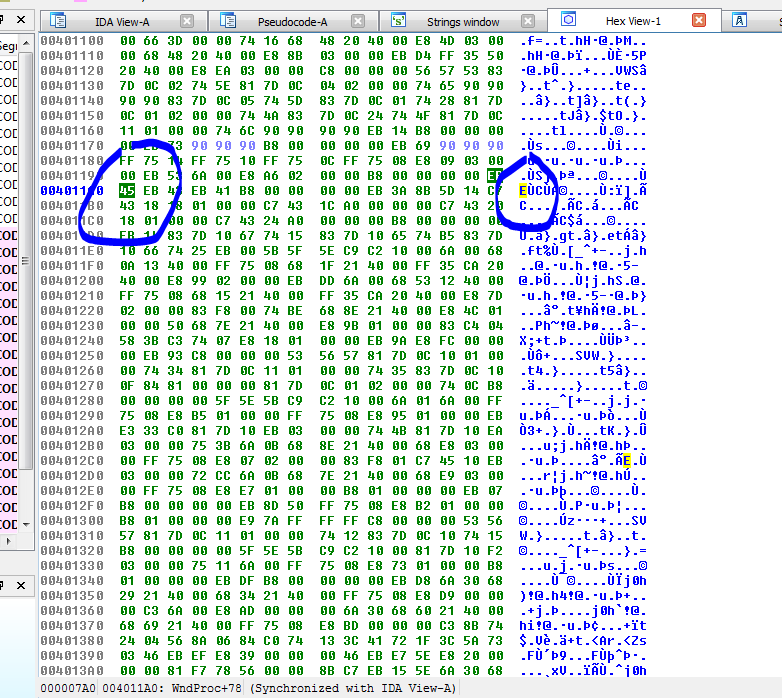

Здесь мы видим число **45,** которое в правой колонке соответствует символу **E**.

**ВОЗМОЖНОСТИ ПОИСКА**

Мы видим, пункт **SEARCH** в меню и если мы в дизассемблере или вкладке **IDA-VIEW**, мы имеем много опций поиска, которые легко интерпретировать.

Если мы переключимся в окно дизассемблера и окно **SEARCH** не доступно, мы должны кликнуть на любой инструкции, чтобы изменить фокус и оно должно появиться.

Некоторые опции в следующих рисунках соотв. плагинам добавленных в мою **IDA** вручную и поэтому Вы не увидите их в загруженном с интернета стандартном установщике .

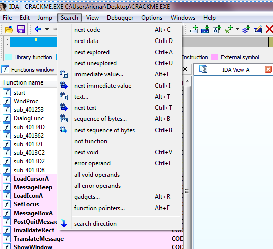

**СЛЕДУЮЩИЙ КОД**

Будет искать следующую инструкцию, которая интерпретируется как **CODE**, если эта часть не будет найдена как код, то пропустит её

```
Search completed. Found at 004011A1.
Search completed. Found at 004011A3.
Search completed. Found at 004011A5.
Search completed. Found at 004011AA.
Search completed. Found at 004011AC.
Search completed. Found at 004011AF.
Search completed. Found at 004011B6.
```

**СЛЕДУЮЩИЕ ДАННЫЕ**

Программа будет осуществлять поиск следующих данных, где были обнаружены **данные** или обработка **данных** в любом разделе.


Как в том случае я ищу двойное слово **dword \(dd\)** в адресе, который не соответствует ни одной команде, очевидно, что если мы будем продолжать искать, мы найдем следующие данные, в этом случае они будут под данным разделом, если возобновить поиск.


Вижу, что поиск останавливается на адресе, где справа имеется ссылка, соответственно это то место, где ведется работа с данными.

И так дальше, пропуская адреса, содержащие только нули и где нет ссылок, поиск показывает нам, где есть данные, которые программа, возможно, использует.

**Search completed. Found at 00402004.
Search completed. Found at 00402048.**


Итак, пропускается все, что не обнаруживается как данные, используемые программой, и поиск продолжается.

**ПОИСК РАСПОЗНАННОГО И НЕ РАСПОЗНАННОГО**

Первый пропустит для кода или обнаруженных данных и второй для зон не обнаруженный как допустимый код или данные.


Область с нулями, которая находится в **0x402000**, найдена с помощью **SEARCH UNEXPLORED**.

```
Search completed. Found at 00402000.
Search completed. Found at 00402000.
Search completed. Found at 00402001.
Search completed. Found at 00402001.
Search completed. Found at 00402002.
Search completed. Found at 00402003.
Search completed. Found at 00402008
```

Повторяя, видим, что поиск охватывает данные **0x40200**4, так что они считаются обнаруженными \(**EXPLORED**\).

**ПОИСК** **НЕПОСРЕДСТВЕННОГО ЗНАЧЕНИЯ –** **ПОИСК СЛЕДУЮЩЕГО НЕПОСРЕДСТВЕННОГО ЗНАЧЕНИЯ**

Мы будем искать константу, которую мы писали между инструкциями и данными.


Если мы выберем **FIND ALL OCURRENCES** мы будем искать всё и для того, чтобы не просматривать их один за другим, можно использовать **SEARCH NEXT INMEDIATE VALUE**


**ПОИСК ТЕКСТА – ПОИСК СЛЕДУЮЩЕГО ВХОЖДЕНИЯ ТЕКСТА**

Программа будет искать текст, который мы введем или регулярные выражения, если хотим.


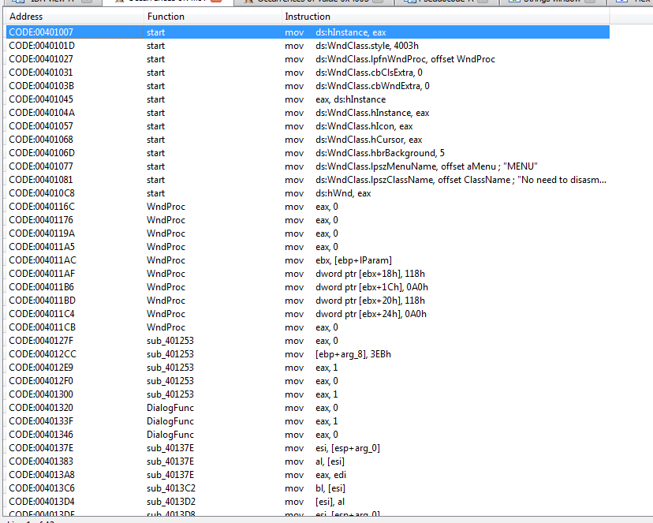

Если нужно найти только одно, то используем **SEARCH NEXT TEXT,** чтобы найти конкретный текст.

**ПОИСК ПОСЛЕДОВАТЕЛЬНОСТИ БАЙТ**

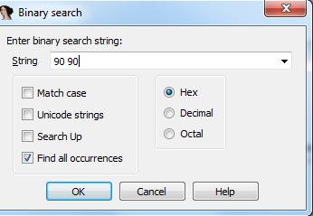

Будет искать последовательность байтов, которые мы ввели между байт в исполняемом файле.

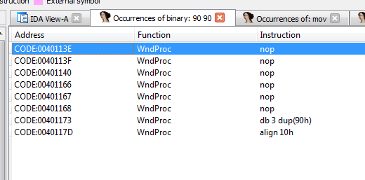

Если мы сделаем двойной щелчок на первом из них, для примера.

В опциях IDA отметим **6** для того, чтобы отобразилось, например, максимум только **6** байт соответствующих каждой команде.

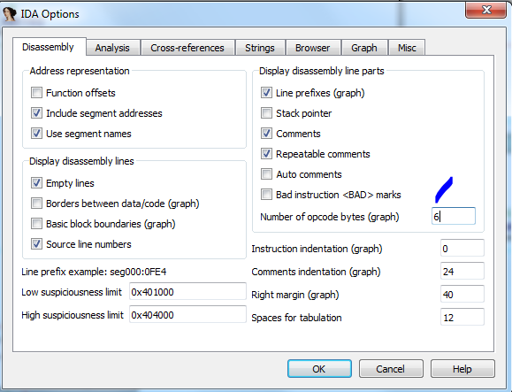

Мы видим, что нашлись байты **90 90,** чего мы и хотели.


**ПОИСК НЕ СОВСЕМ ФУНКЦИЙ**

Он ищет до следующего адреса, где находит что-то неразобранное как выполненная функция.

**Search completed. Found at 004013D7**.


Там имеется **RET**, обычно не интерпретируемый как функция, поэтому поиск его находит. Иногда встречаются функции, которые **IDA** не удается определить как функции, но они являются действительными кодами.

Это наиболее важные функции поиска в меню **IDA**, конечно, когда есть возможность работать со скриптами **Python**, всегда можно увеличить возможности с помощью нескольких строк кода.

Мы видим, что каждый поиск, который мы осуществляем, не теряется – открывается новая вкладка с результатом и всегда остается там до того момента, пока мы сами ее не закроем.

Мы продвигаемся шаг за шагом, не торопясь, чтобы никому не было сложно, и у нас еще много всего впереди.

* * *

Автор оригинального текста — Рикардо Нарваха.

Перевод и адаптация на английский  язык — IvinsonCLS.

Перевод и адаптация на русский язык — Яша Яшечкин.

Перевод специально для форума системного и низкоуровневого программирования - **WASM.IN**

17.02.2017
