# Часть 3

[\[Используемые материалы\]](.gitbook/assets/files/03.zip)

**Загрузчик**

Мы уже видели, что когда в **IDA** мы открываем исполняемый файл, тот же самый файл открывается в **ЗАГРУЗЧИКЕ**, который является статическим анализатором того же самого файла.

Мы будем анализировать его части и характеристики, большая часть того, что мы видели до настоящего времени, будут применимы и к **ЗАГРУЗЧИКУ** и для **ОТЛАДЧИКА**. В случае, если что-то будет отличаться или не похоже на общий случай, я упомяну это.

Очевидно, то, что в **ЗАГРУЗЧИКЕ** программа абсолютно не выполняется, но она анализируется, и создаётся база данных с информацией этого файла, и это значительное отличие относительно **ОТЛАДЧИКА**.

В **ЗАГРУЗЧИКЕ** нет ни окна **РЕГИСТРОВ**, ни окна **СТЕКА**, ни списка модулей, которые загружены в память. Это вещи, существуют при выполнении и отладке программы.

После загрузки **Cruehead Crackme \(CRACKME.EXE\)**, если мы посмотрим на список процессов , то увидим, что он не работает и никогда не выполняется, пока мы не откроем отладчик **IDA**.

Это очень полезно для определенного использования, например как анализ вредоноса, эксплоита и т.д. , потому что мы не всегда сможем получить доступ к некоторой функции, для этого мы должны изучить отладку, в то время как в **ЗАГРУЗЧИКЕ** мы можем проанализировать любую из функций программы, это не имеет значения, если мы не знаем как её вызывать и пользоваться ей.

Конечно, чтобы говорить о функциональном анализе, мы должны знать как используются регистры и инструкции, потому что несмотря на то, что мы не находимся под отладкой и не имеем окна с регистрами со значениями в каждый момент времени, инструкции используют их и мы должны понять их, чтобы знать то, что делает программа.

**Что же такое регистры и для чего они используются?**

Хорошему процессору нужны помощники в его задаче по выполнению программ.

Регистры помогают ему в этом. Когда мы видем ассемблерные инструкции, мы видем, например, что они не могут сложить содержимое двух ячеек памяти напрямую. Процессор должен переместить одну из них в регистр, а затем сложить с другой ячейкой памяти. Это пример, но, конечно, у некоторых регистров есть более определенное использование. Давайте посмотрим.

**32**-разрядные регистры, которые используются - это: **EAX**, **ECX**, **EDX**, **EBX**, **ESP**, **EBP**, **ESI**, **EDI** и **EIP** . В конце курса будет часть, посвященная **64**-битным.

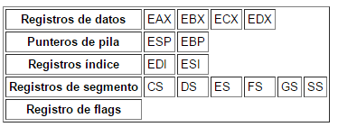

**Регистры общего назначения**

**EAX** \(Аккумулятор\): Аккумулятор используется для таких инструкций как деление, умножение и некоторых инструкций формата, и также как регистр общего назначения.

**EBX** \(База\): Он может непосредственно работать с памятью, используется как база и также как регистр общего назначения.

**ECX** \(Счетчик\): **ECX** регистр общего назначения, который может использоваться в качестве счетчика для различных инструкций. Он также может иметь адрес смещения данных в памяти. Инструкции, которые используют счетчик, являются - цепочечные инструкции, инструкции смещения, **ROR** инструкции\(циклические\) и **LOOP/LOOPD**.

**EDX** \(Данные\): Это регистр общего назначения, который содержит часть результата умножения или деления. Он может также работать непосредственной с данными памяти.

**EBP** \(Указатель на базу стека\): **EBP** указывает на место в памяти. Почти всегда как база для аргументов и переменных функции, кроме того, он также регистр общего назначения.

**EDI** \(Указатель на назначение\): Часто, он указывает на адрес назначение результата в строковых цепочечных инструкциях. Он также регистр общего назначения.

**ESI** \(Указатель на источник\): Часто, он указывает на адрес источника в строковых цепочечных инструкциях. Как и **EDI**, **ESI** также работает как регистр общего назначения.

**EIP**: Указатель, который указывает на следующую инструкцию, которая будет выполнена.

**ESP**: Указатель, который указывает на верхушку части стека или пачку.

Подведём итог того, что я сказал.

Восемь регистров - **EAX** \(аккумулятор\), **EBX** \(база\), **ECX** \(счетчик\), **EDX** \(данные\), **ESP** \(указатель на вершину стек\), **EBP** \(указатель на базу стека\), **ESI** \(указатель на источник данных \) и **EDI**\(указатель на назначение данных\).

Также там существуют **16**-битные и **8**-битные регистры , которые являются частями предыдущих регистров.

Если **EAX** равно **12345678**

**AX** это последние четыре цифры \(**16** бит\)

**AH** это **5-я** и **6-я** цифра и **AL** две последние цифры \(**8** бит каждая\)

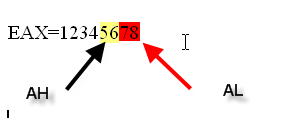

Есть **16**-разрядный регистр для младшей части регистра **EAX** называющийся **AX** и два **8**-разрядных регистра называющихся **AH** и **AL**. Не существует специальных регистров для старшей части .

Эти регистры существуют в той же формы для **EBX** \(**BX**, **BH** и **BL**\), для **ECX** \(**CX**, **CH** и **CL**\) и это применимо почти ко всем регистрам \(только у **ESP** есть 16-бит **SP**, но не **SL** из 8 битов\)

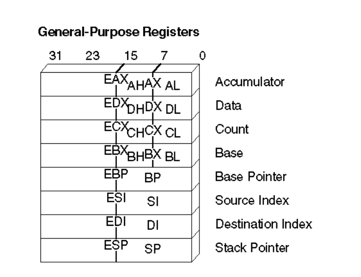

Здесь Вы можете видеть регистры, такие как **EAX**, **EDX, ECX**, и **EBX**, которые имеют регистры из **16** и **8** битов и **EBP**, **ESI**, **EDI** и **ESP**, которые имеют **16-**битные подрегистры.

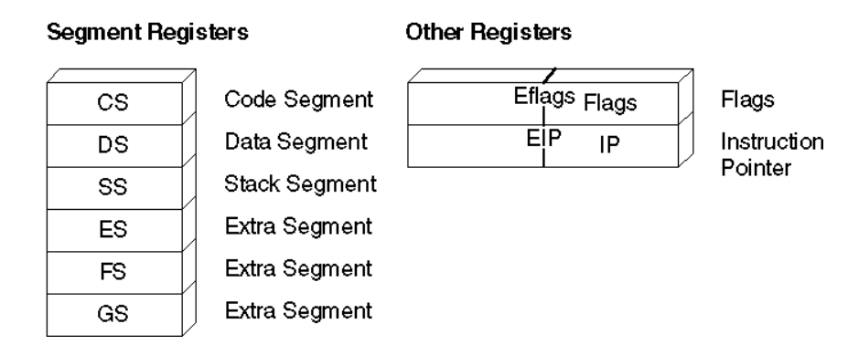

Мы будем рассматривать и другие регистры, один из них важный вспомогательный регистр **EFLAGS**, который активирует свои флаги, которые принимают значения на основе решений в разные моменты выполнения программы, которые мы рассмотрим позже, сегментные регистры указывают на другие части исполняемого файла, такие как **CS=CODE**, **DS=DATA** и т.д.

Другая важная деталь, это размеры большинства используемых типов данных.

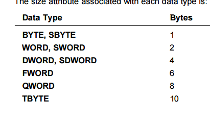

**IDA** управляет большим количеством данных, которые мы будем видеть постепенно, чтобы не усложнять обучение, важная вещь состоит в том, чтобы знать, что **BYTE** равен 1 байту в памяти, **WORD** 2 байтам и **DWORD** составляет 4 байта.

**ИНСТРУКЦИИ**

**IDA** работает с синтаксисом инструкций, который не является самым простым в мире, большинство же людей используют дизассемблер **OLLYDBG**, который более прост и без кофеина \(проще понять\), несмотря на то, что **OLLYDBG** дает нам меньше информации.

**Инструкции перемещения данных**

**MOV**

**MOV dest,src: Она копирует содержимое источника операнда \(src\) в место назначения \(dest\)**.

**Операция: dest ← src**

Здесь есть несколько возможностей. Например, нам может понравиться первая возможность переместить значение одного регистра в другой.

**MOV EAX, EDI**

В целом, мы можем перемещать из или в регистр непосредственно, принимая во внимание это **EIP** не может быть **МЕСТОМ НАЗНАЧЕНИЯ** или **ИСТОЧНИКОМ** в любой операции. Мы не можем сделать так

**MOV EIP , EAX**

Это не допустимо.

Другая возможность состоит в том, чтобы переместить константу в регистр, например.

**MOV EAX, 1**

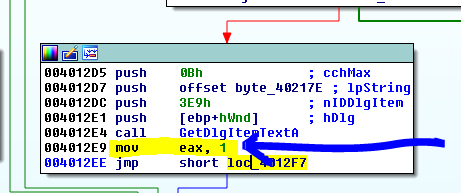

Другая возможность состоит в том, чтобы переместить значение адреса памяти, а не ее содержимое \(Эти инструкции в изображении принадлежат другой программе, не **CRACKME.exe**, потому что они не были там, но есть в **VEViewer.exe**, файл приложен к этой части 3\)

В этом случае, когда значение будет перемещено, оно является адресом памяти, слово **OFFSET**, указывает нам, что мы должны использовать адрес, но не его содержание.

Или если нажмём **Q** , оно становится таким

**MOV EAX, 46f038**

Эта ещё одна инструкция как в **OLLY**, но она не дает нам информации о содержимом этого адреса. Если мы щелкаем правой кнопкой по адресу **46F038**, мы можем вернуться к исходной инструкции.

И она станет как прежде.

Что говорит мне эта дополнительная информация? Что **IDA** говорит мне о вышеупомянутом адресе памяти?

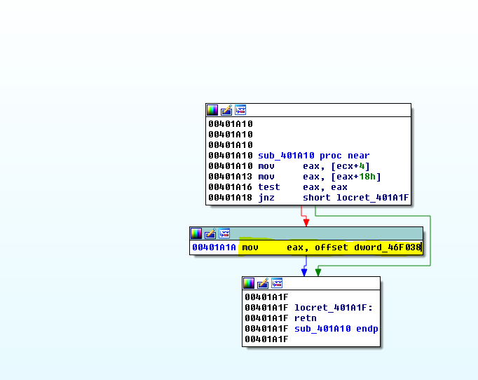

Если я открываю окно **HEX DUMP** и поищу упомянутый выше адрес, я вижу, что первично он равен нулю. Я знаю, что это **DWORD**, но я действительно не знаю что это, потому что он зависит от того, где он использует это значение в программе, что определяет тип этой переменной.

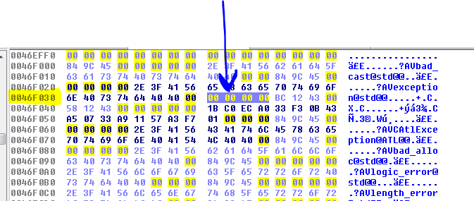

Если я вернусь к списку и дважды щелкну в этом адресе.

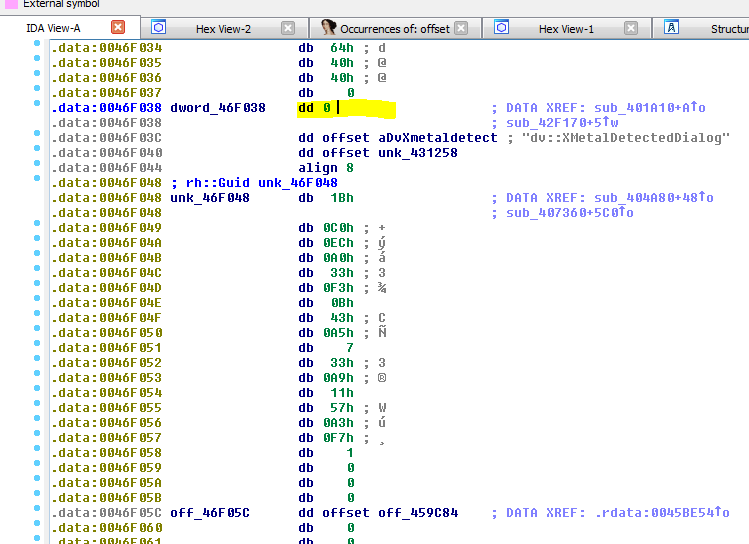

Здесь я буду видеть, что **IDA** говорит мне, что содержимое вышеупомянутого адреса **DWORD**, в окне дизассемблера **IDA**, когда мы видим область памяти, которая не является кодом, поскольку в этом случае принадлежит секции данных, конечно, первая колонка это адреса.

**IDA** говорит мне **dword\_46F038**, это означает, что содержимое ячейки памяти равно **DWORD**, это похоже на разъяснения адреса слева, здесь есть тип данных **dd**, который является знакомым нам **DWORD** и потом значение, которое содержит вышеупомянутая ячейка памяти, является нулём.

**IDA** говорит мне, что программа использует этот адрес как **DWORD** и на правой стороне я вижу ссылки, где этот **DWORD** будет использоваться.

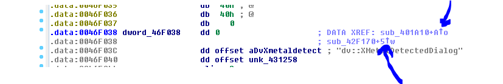

Там есть две ссылки, каждая стрелка, это одна из них и подведя курсор мыши над ней я могу видеть код, также если я нажму **X** на этом адресе, я увижу откуда сюда ссылается программа.

Первая, где читается адрес, где мы были ранее, вторая, записывает **DWORD** по адресу **0x46F038**, вот почему **IDA** в первой инструкции говорит нам, что тот адрес указывает на **DWORD**, потому что тут была другая ссылка, которая получает доступ к ней и записывает этот **DWORD** и сейчас все чисто.

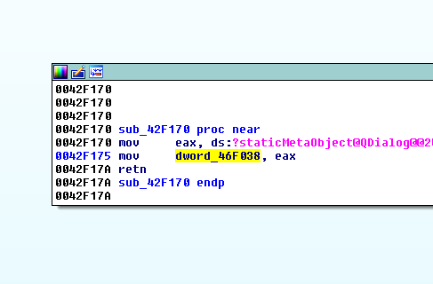

Так что, **IDA** в первоначальной инструкции не только сообщила мне, что собирается поместить адрес в регистр, но она также сказала мне, что этот адрес содержит **DWORD**, это что-то вроде бонуса.

Так что, когда мы видим, что говорится о числовых адресах, **IDA** помечает адрес как **OFFSET** и когда мы будем искать его содержимое, как в этом случае, оно будет равно нулю, она не использует квадратные скобки, если это числовой адрес.

Как ранее мы видели.

**mov eax, offset dword\_46F908**

Эта инструкция поместит адрес **0x46F908** в **EAX**

**mov eax, dword\_46F908**

Эта инструкция поместит содержимое или значение, которое расположено в вышеупомянутой памяти.

Эта инструкция, которую помним по **OLLY** с квадратными скобками для, тех кто привык к этому отладчику.

**MOV EAX,DWORD PTR DS:\[46f908\]**

Или когда адрес имеет впереди слово **OFFSET**, он ссылается на этот самый адрес, а когда этого слова нет, то ссылается на значение полученное по этому адресу.

Это просто случается, когда мы обращаемся к числовым адресам, если мы работает только с регистрами.

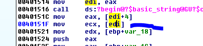

Здесь, инструкция использует квадратные скобки, потому что, очевидно, она не знает статически какое значение содержит регистр в этот момент, и она не знает на какой адрес будет указывать, чтобы получить больше информации.

Конечно, в этом случае, если **EDI** указывает например на **0x10000**, упомянутая выше инструкция будет искать содержимое адреса памяти и оно будет скопировано в **ECX**.

Очень важно понимать, что когда **IDA** использует слово **OFFSET** перед адресом памяти она ссылается на это же числовое значение, а не на его содержимое, давайте рассмотрим ещё один пример.

Тут мы видим, что в **EAX** помещается значение **0x45f4d0**, потому что впереди есть слово **OFFSET** и также она говорит мне, что упомянутый выше адрес содержит **stru\_**, который является структурой.

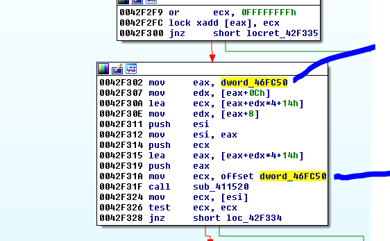

В другом случае, в первой помеченной инструкции, перемещается содержимое **0x46fc50**, которое **DWORD** ,а во второй, просто адрес, который равен числу **0x46FC50**.

Мы видим, что значение вышеупомянутого адреса будет помещено в **0x42f302**, если мы кликнем в **0x46fc50**, давайте посмотрим, что там есть.

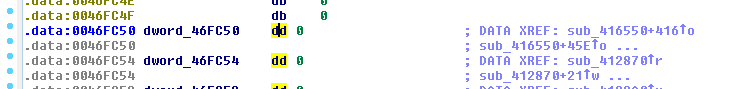

Мы видим, что инструкция помещает ноль, если другая инструкция не выполнилась и сохранила значение, которое я изменил, поскольку она показывает нам ссылки.

С помощью нажатия на **X** на ссылки, мы видим все ссылки, видим, что инструкция сохраняет **DWORD** по адресу.

Инструкция, которая выделена желтым цветом, сохраняет **DWORD** в вышеупомянутый адрес памяти, все другие или читают адрес смещения или читает само значение по адресу, там где нет слова смещение.

Конечно, константы можно также поместить в **16-ные** и **8-ные** регистры, которые мы видели ранее.

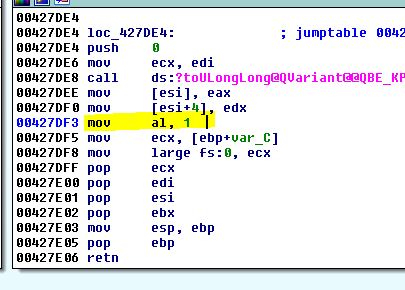

Эта инструкция помещает **1** в **AL**, оставляя остальную часть **EAX** со значением, которое было прежде. Тут просто изменяется самый младший байт.

Здесь, инструкция перемещает содержимое адреса памяти **0x459C24** в **AX** и говорит нам, что это **WORD**.

И мы видим, что первично здесь ноль, возможно, далее при выполнении программы он может быть изменен.

Здесь **AX** помещается в содержимое **EBX**, т. к. это регистр, то не знаем какое значение имеет регистр **AX**, **IDA** не может сказать больше, она использует квадратные скобки, чтобы указать что, записывается в содержимое адреса **EBX**.

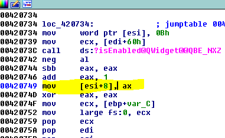

Здесь, инструкция запишет значение **AX** в содержимое **ESI+8**.

Другой пример

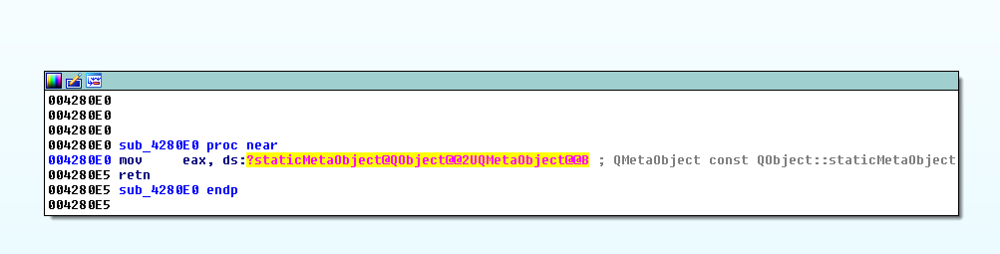

Если я щелкну на страшное имя, оно приведет меня сюда

Мы знаем, что это **IAT** \(таблица, которая сохраняет импортированные адреса функции, когда запускается программа\), она почти всегда находится в разделе **idata**.

Если я ищу этот адрес в окне **HEX DUMP**, у него всё еще нет указателя на функции, потому что **IAT** заполняется, когда процесс запускается, а тут он ещё не запустился.

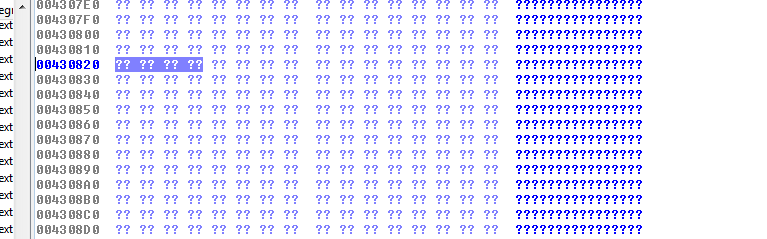

Если я пойду в **OPTIONS-&gt;DEMANGLE NAMES** и выберу **NAMES** будет намного лучше.

Префикс **EXTRN** подразумевает, что это **ВНЕШНЯЯ** импортированная функция.

Если мы прокрутим выше, мы видим, что программа говорит, что есть импортированные функции, которые принадлежат модулю **DVCORE.dll** и выше есть другие, которые принадлежат различным функциям.

Мы видели различные примеры **MOV**, которые Вы можете практиковать и видеть в **IDA** , в той программе, которую я приложил к уроку.

В 4-той части, мы продолжим и разберём больше инструкций.

* * *

Автор оригинального текста — Рикардо Нарваха.

Перевод и адаптация на английский  язык — IvinsonCLS.

Перевод и адаптация на русский язык — Яша Яшечкин.

Перевод специально для форума системного и низкоуровневого программирования - **WASM.IN**

18.02.2017

[**Источник: ricardonarvaja.info**](http://ricardonarvaja.info/WEB/IDA%20DESDE%20CERO/CURSO%20DE%20IDA%20TUTES/3-INTRODUCCION%20AL%20REVERSING%20CON%20IDA%20PRO%20DESDE%20CERO.docx)
