# Часть 4

[\[Используемые материалы\]](.gitbook/assets/files/04.zip)

Мы продолжаем рассматривать инструкции обмена данными в **IDA**.

**XCHG A, B**

Эта инструкция обменивает значение **A** со значением **B**, давайте рассмотрим пример.

В файле **VEVIEWER** нет такой инструкции, поэтому я загружаю **СRACKME.EXE Cruehead**, и меняю инструкцию по адресу **0x4013D8**.

Я помещаю курсор на строку адреса и перехожу в меню **EDIT-&gt;PATCH PROGRAM-&gt;ASSEMBLE**.

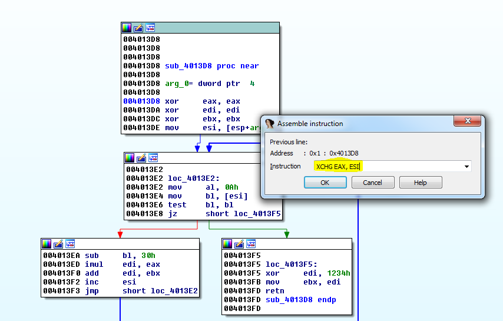

Мы видим, что функция была повреждена, так как я работаю сейчас с ней.

Мы уже видели, что, если инструкция не существует, эта область показывается, как область данных. В этом случае тут один байт, поскольку нет никаких ссылок ни в какую часть программы, то и нет никакой информации на правой стороне окна. Затем тип данных, становится **DB**, здесь только один байт и его значением является **0xC0**.

Таким образом, если мы запишем инструкцию **NOP**, что означает **NO OPERATION** или инструкция заполнения, которая ничего не делает, то так заменим байт **0xC0**.

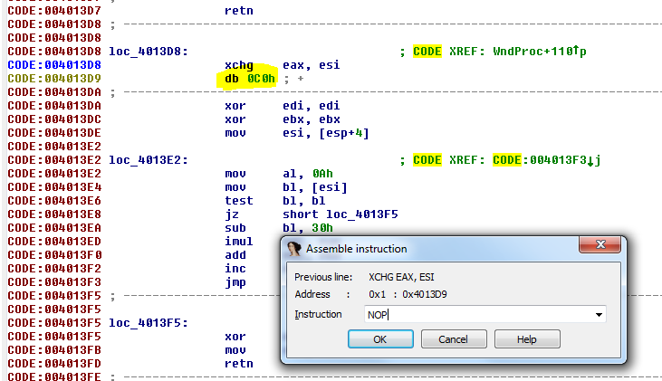

Поставим по этому адресу **NOP**.

Вполне очень симпатично, но функция повреждена. Если есть не распознанные части, подобно коду ниже, и **IDA** не распознаёт его, но когда с кодом всё **ОК**, мы щелкаем правой кнопкой мыши, где было начало функции **0x4013D8**, и выбираем там пункт **CREATE FUNCTION**.

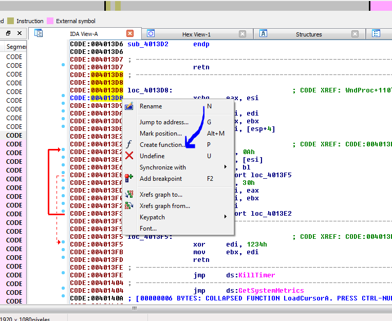

И это меняет префикс **loc\_**, который означает "локальная метка" на префикс **sub\_**, который означает, "начало подпрограммы или функции".

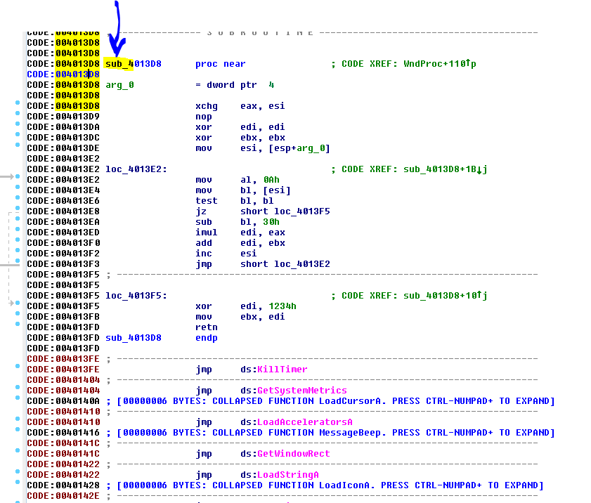

Теперь, это функция, и если мы не находимся в графическом режиме, то нажимаем пробел, чтобы переключиться в него.

Теперь намного лучше и сейчас здесь есть наш **XCHG**.

Мы видели, что если **EAX** равняется **12345678** и **ESI** равняется **55**, то когда выполняется **XCHG**, регистр **EAX** будет равняться **55** и **ESI** будет равняться **12345678**.

Мы видим, что в меню **PATCH** есть элемент под названием **PATCHED BYTES**, который показывает изменения, и он может вернуть к исходному неизменному коду.

**XCHG** также может обменивать значения между регистром и содержимом регистра, который указывает на ячейку памяти.

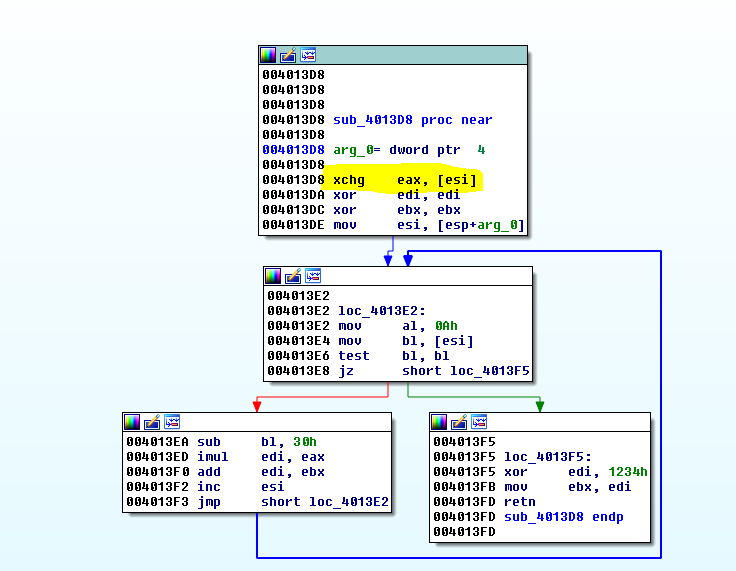

В этом случае, значение **ESI** будет искать содержимое по этому адресу памяти и оно будет обмениваться со значением **EAX**, которое будет сохранено в той же ячейке памяти, если есть разрешение на запись.

Например, если значение **EAX** равно **55** и значение **ESI** равно **0x10000**.

Инструкция будет проверять, что находится здесь, в этой ячейке памяти и если она доступна на запись, она сохранит туда значение **55** и прочитает значение по адресу памяти **0x10000** и сохранит его в **EAX**.

Что произойдет, если мы сделаем то же самое, но вместо того, чтобы использовать регистр мы используем адрес в памяти, как мы сделали в **MOV** ?

Поскольку команда **ASSEMBLE** не работает полноценно для всех инструкций, мы должны изменить байты в меню где написано **PATCH BYTES**, но лучше загрузить плагин, такой как **Keystone**, который позволяет нам записать все инструкции намного проще.

[https://github.com/keystone-engine/keypatch](https://github.com/keystone-engine/keypatch)
[https://drive.google.com/file/d/0B13TW0I0f8O2eU1VdUJzVjdYTWs/view?usp=sharing](https://drive.google.com/file/d/0B13TW0I0f8O2eU1VdUJzVjdYTWs/view?usp=sharing)

Во второй ссылке находится файл **keypatch.py**, который мы должны скопировать в каталог плагинов **IDA** и затем можно установить **keystone-0.9.1-python-win32.msi**.

Кроме того, необходимо установить **Microsoft VC ++**, библиотеку времени исполнения.

[http://www.keystone-engine.org/keypatch/](http://www.keystone-engine.org/keypatch/)

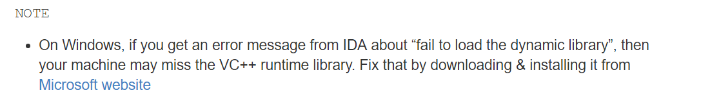

В **Keypatch** выберите **PATCHER**.

Когда мы выбираем **PATCHER**, мы видим что, если запишем инструкцию в простой форме и со скобками, он запишет её и преобразует в синтаксис **IDA**.

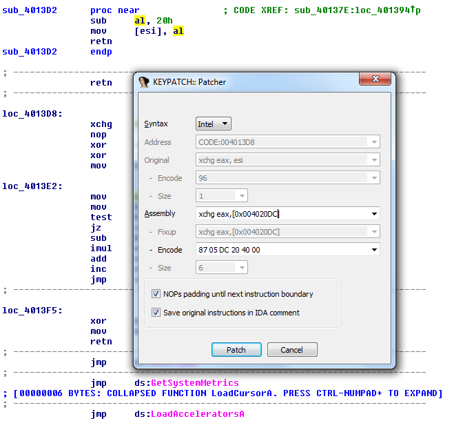

И я получаю такой результат.

Как и в **MOV**, когда показывается префикс **dword\_** без **СМЕЩЕНИЯ** в начале****, это будет означать, что обменивается содержимое **0x4020DC** со значением **EAX**.

**СПЕЦИАЛЬНЫЕ ИНСТРУКЦИИ ПЕРЕСЫЛКИ ОСНОВАННЫЕ НА РАБОТЕ СО СТЕКОМ**

**ЧТО ТАКОЕ СТЭК?**

Стэк, это область в памяти, которая работает по принципу **LIFO**.

Для обработки данных предоставляется две основные операции: положить или **PUSH**, которая помещает объект в стек и обратная операция, чтобы забрать последнее значение или **POP**.

В каждый момент времени, есть доступ только к верхушке стека, то есть к последнему сохраненному объекту. Операция **POP** получает обратно этот элемент, который вытолкнут со стека, разрешая доступа к тому, который находится ниже \(положен ранее\) и он становится последним доступным объектом.

В **CRACKME.EXE** мы видим примеры обеих инструкций.

Обычно, в **32**-битных приложениях, **PUSH** используется, чтобы передать аргументы функции в стек, прежде, чем вызвать функцию с помощью **CALL**, на картинке выше мы видим это по адресу **0x40104F**.

**PUSH 64** кладет **dword 64** в верхнюю часть стека, затем **PUSH EAX** кладет значение **EAX**, на предыдущее значение в стеке, оставляя внизу это предыдущее значение, и поэтому оно будет последним на верхушке стэка.

**ESP -&gt;значение EAX
-&gt; 0x64**

Ниже мы видим другой вид **PUSH**, мы можем также сохранять константы, но и также мы можем сохранить адрес памяти, как в этом случае.

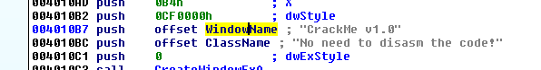

Мы видим слово **СМЕЩЕНИЕ** перед символьным **ТЭГОМ**, соответствующее строке символов, здесь будет положен в стэк адрес начала строки или строковый массив.

Если мы дважды щёлкнем на этот тэг, который представляет название строки **WindowName**.

В исходнике на **C** увидим массив символов, который может быть определен таким образом:

**char mystring\[\] = "Hello WASM.IN";**

Мы видим, что в этом случае используются строчки для описания переменной.

Здесь записано **char WindowName\[\]**, потому что **IDA** обнаружила функцию **API CreateWindow**.

В любом случае, это массив символов или байтов, только **IDA** добавляет немного полезной информации, которая получена от **API** функции, мы видим, что после адреса **0x4020E7** следующий адрес в списке **0x4020F4**, здесь есть некоторая последовательность байт, которые принадлежат символам строки **"Crackme v1.0"** и ноль, который говорит о конце строки.

Если мы нажмём кнопку **D**, чтобы изменить тип данных на **WindowName**.

Мы видим, что мы можем заставить **IDA** прекратить обнаруживать эту строку как символьный массив, и оставить её как **DB** или то же самое, что и байт.

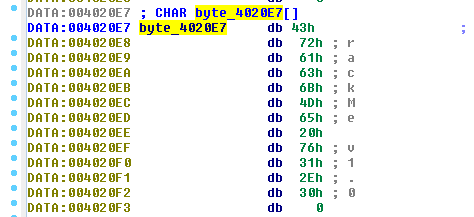

Это те же самые байты, которые соответствуют последовательности **crackme v1.0**.

Мы видим, что оригинальная инструкция изменилась, очевидно слово **offset** впереди говорит о том, что будет заталкиваться значение **0x4020E7**, но сейчас, содержимое прекратило быть символьным массивом и теперь стало байтом и инструкция изменилась на

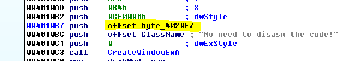

**push offset byte\_4020e7**

Нажмём кнопку **A** и последовательности станет снова как и раньше строкой **ASCII** символов.

Также, когда мы работаем, мы можем видеть некоторую последовательность, такую как нулевые байты.

Передвигаемся в начало последовательности байт и нажимаем **A**, теперь смотрится намного лучше.

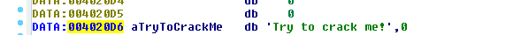

В этом случае, мы видим, что эта строка не определена в двух строчках, как предыдущая, **IDA** даже не говорит, что она **CHAR\[\]**, но она определена с помощью тэга, который начинается с буквы **a**, для того, чтобы быть **ASCII** строкой, в предыдущем случае **IDA** показывает дополнительную информацию, потому что **IDA** обнаружила, что это был аргумент **API** или функция системы и **IDA**предупредила, что аргумент должен быть **CHAR\[\]** и вот почему она добавил это там, но нормальная строка будет похожа на эту последнюю строку.

Здесь мы видим другую строку.

По адресу **0x402110** начинается первый байт строки, она может быть расщеплёна на байты, чтобы их видеть отдельно, просто нажатием клавиши **D** на строке **aMenu**.

Если мы нажмём **A**, мы отменим сделанные изменения.

Если я нажму **X**, чтобы искать ссылки, то я буду видеть где используются эти строки.

Мы видим, что тут сохраняется адрес **0x402110**, потому что стоит слово **СМЕЩЕНИЕ**.

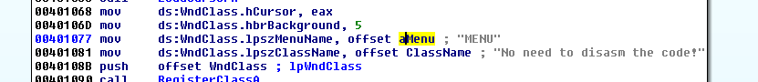

Обычно, когда аргументы передаются к функциям, мы всегда будем видеть **PUSH offset xxxxx**, потому что ищется адрес строки, чтобы передать его функции, если инструкция не имеет слово **OFFSET**,мы бы заталкивали содержимое адреса **0x402110**, байты **55 4E 45 4D** которого являются той же строкой и API не будет работает, API всегда передаётся указатель на начало или адрес где начинается строка.

В этом случае, в этой инструкции, которую мы видим выше, префикс **DS:TAG** указывает, что она собирается сохранить его в адрес памяти секции данных \(**DS=DATA**\), когда мы будем рассматривать структуры, мы изучим этот случай, сейчас важно запомнить, что инструкция сохраняет адрес начала строки в секции **DATA**.

**POP**

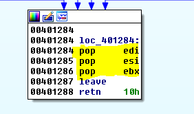

Эта операция, которая читает вершину стэка и перемещает значение с этой вершины в регистр назначения, в этом случае мы видим, что **POP EDI** будет читать первое значение или **ВЕРШИНУ СТЭКА** и скопирует его в **EDI**, а затем **ESP** будет указывать на значение, которое было ниже и теперь оно станет **ВЕРШИНОЙ** стэка.

Если мы ищем текст, а именно слово **POP**, мы видим, что вариантов используется не так много, несмотря на то, что там есть возможность вытолкунуть **POPEAR\(wtf amigos???\)** в адрес памяти вместо регистра, эта опция не является очень используемой.

Мы продолжим с другими инструкциями в пятой главе, чтобы быть готовыми изучать функционирование **ЗАГРУЗЧИКА**.

Пока пока.

* * *

Автор оригинального текста — Рикардо Нарваха.

Перевод и адаптация на английский  язык — IvinsonCLS.

Перевод и адаптация на русский язык — Яша Яшечкин.

Перевод специально для форума системного и низкоуровневого программирования - WASM.IN

24.02.2017

Источник:

[**http://ricardonarvaja.info/WEB/INTRODUCCION%20AL%20REVERSING%20CON%20IDA%20PRO%20DESDE%20CERO/4-INTRODUCCION%20AL%20REVERSING%20CON%20IDA%20PRO%20DESDE%20CERO%20PARTE%204.7z**](http://ricardonarvaja.info/WEB/INTRODUCCION%20AL%20REVERSING%20CON%20IDA%20PRO%20DESDE%20CERO/4-INTRODUCCION%20AL%20REVERSING%20CON%20IDA%20PRO%20DESDE%20CERO%20PARTE%204.7z)
