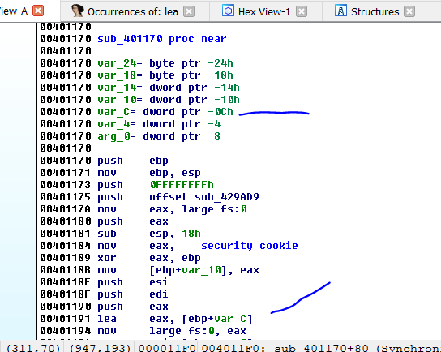
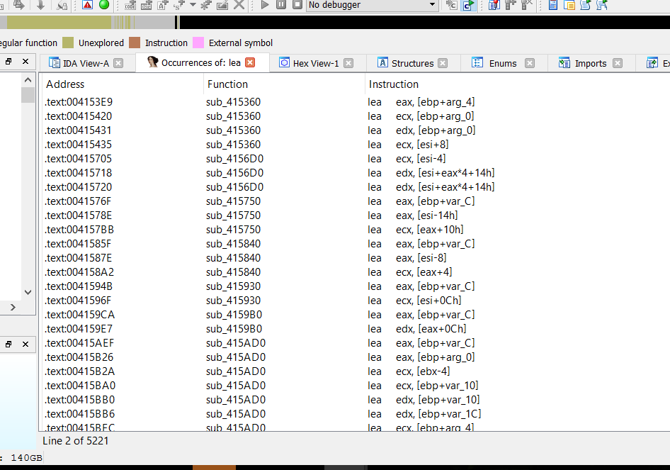
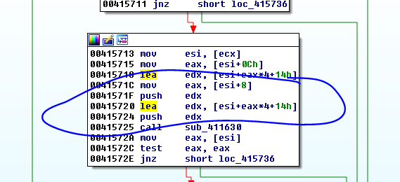
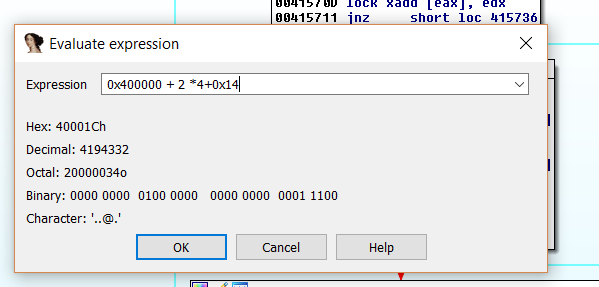

# Часть 5

Мы продолжаем рассматривать основные инструкции и их использование в коде, когда мы дойдем до части где используется отладчик, мы будем видеть больше примеров, где рассматриваются результаты применения каждой из этих инструкций на реальном примере.

**LEA \(LOAD EFFECTIVE ADDRESS\)**

**LEA A, B**

Инструкция **LEA** помещает указанный адрес из **B** в **A**. Она никогда не получает доступ к содержимому **B**, это всегда будет адрес или результат работы операции между квадратными скобками во втором операнде. Инструкция используется, чтобы получить адреса переменных в памяти или параметров.

Давайте рассмотрим несколько примеров, чтобы было ясно.

Обычно в функциях, обнаруженных **IDА**, существуют параметры, которые передаются ей, в большинстве случаев через **PUSH**, который стоит прежде, чем вызов функции.

**PUSH**, сохраняет эти значения в стеке, вышеупомянутые значения называются параметрами.

Мы видим список переменных и аргументов в заголовке каждой функции, у этой функции есть только один аргумент в стеке, т.к. в списке есть только одно слово arg, в этом случае это **arg\_0**.

Мы видим также, что у функции есть локальные переменные, для которых она выделяет место в стеке выше параметров.

Далее, я разъясню подробнее, точное расположение аргументов и переменных в стэке. Сейчас же просто важно знать, что у каждого аргумента или переменной, которые использует функция есть адрес, где она расположена и значение переменной в любой части памяти.

Поэтому на этом изображении, мы видим что, когда программа находится по адресу **0x401191** она использует инструкцию **LEA**, которая просто переместит адрес со стека, где расположенна эта вышеупомянутая переменная, если бы это была инструкция **MOV**, она переместила бы содержимое или значение, сохраненное в вышеупомянутой переменной.

**LEA** несмотря на использование квадратных скобок, перемещает адрес без доступа к содержимому, потому что она на самом деле решает операции внутри квадратных скобок без доступа к содержимому и **EBP** обычно используется как база для переменных и аргументов стэка в каждой функции, то, что она действительно делает, это добавляет или отнимает константу к значению **EBP**, которое указывает на адрес стэка взятого как, база для вышеупомянутой функции.

Если мы сделаем правый щелчок мышью, на этой переменной, мы увидим, что форму математической записи можно менять, с использованием клавиши **Q**, будет равно **\[EBP – 0C\]**.

В действительности же **LEA**, просто решает операцию **EBP – 0C** т.к. **EBP** имеет адрес стэка, который будет базой в этой функции, вычитая из неё **0C**, получим адрес вышеупомянутой переменной.

В этом месте, многие задаются вопросом, не проще ли, чтобы **IDA** использовала чистую математическую нотацию для переменных и аргументов, вместо **EBP +** или **-** тэг.

В реверсинге, очень важно для нас, чтобы была возможность переименовывать переменные и аргументы в реальном времени, чтобы знать, что они делают и иметь лучшую ориентацию.

Это не то же самое, что использовать переменную названую **EBP-0C**, чем переменную которую я могу переименовать в **EBP+SIZE**, для примера. \(Используйте клавишу **N**. Попробуй сделать это\) если я знаю, что она сохранит размер. Если мне нужно увидеть исходное значение, я делаю правый щелчок мышкой на ней.

Вот почему **LEA** используется также, чтобы решать операции, который находятся внутри квадратных скобках, помещая результат в регистр назначения, без получения доступа к содержимому.

Например, инструкция

**LEA EAX, \[4 + 5\]**

поместит **9** в **EAX**, а не содержимое адреса **0x9**, как это делает инструкция **MOV**.

**MOV EAX, \[4 + 5\]**

Вот почему инструкция

**LEA EAX, \[EBP - 0C\]**

Поместит результат **EBP - 0C**, который является результатом адреса памяти, полученный при решении выражения **EBP - 0C** и помещает его в **EAX**.

**MOV EAX, \[EBP - 0C\]**

После решения выражения **EBP - 0C** и получения того-же самого адреса, инструкция ищет содержимое или сохранённое значение в вышеупомянутой переменной и помещает его в **EAX**.

Очень важно, чтобы Вы понимали различие между **LEA** и **MOV** и как они используются, первая получает адрес переменной, а вторая получает значения сохранённое в этой переменной.

Мы видим, что в результате поиска текста **LEA** в **VEWIEVER**, показываются инструкции, которые большую часть времени используются, чтобы получить адреса переменных или аргументов стэка. \(Есть больше инструкций использующих **EBP +** что-то\)

Остальные инструкции, это комбинации операций между регистрами и константами, чей результат помещается в первый операнд, который может давать числовые результаты или различные адреса, в зависимости от значения регистров.

В момент решения операции, если **ESI** равно, для примера **400000** и **EAX** равно **2**, результат будет помещен в **EDX**.

**0x400000 + 2 \* 4 + 0x14**

Это означает, что инструкция переместит значение **0x40001С**.

До встрече в **6**-й главе.

* * *

Автор оригинального текста — Рикардо Нарваха.

Перевод и адаптация на английский  язык — IvinsonCLS.

Перевод и адаптация на русский язык — Яша Яшечкин.

Перевод специально для форума системного и низкоуровневого программирования - WASM.IN

08.03.2017

Источник:

[**http://ricardonarvaja.info/WEB/INTRODUCCION%20AL%20REVERSING%20CON%20IDA%20PRO%20DESDE%20CERO/5-INTRODUCCION%20AL%20REVERSING%20CON%20IDA%20PRO%20DESDE%20CERO%20PARTE%205.7z**](http://ricardonarvaja.info/WEB/INTRODUCCION%20AL%20REVERSING%20CON%20IDA%20PRO%20DESDE%20CERO/5-INTRODUCCION%20AL%20REVERSING%20CON%20IDA%20PRO%20DESDE%20CERO%20PARTE%205.7z)
