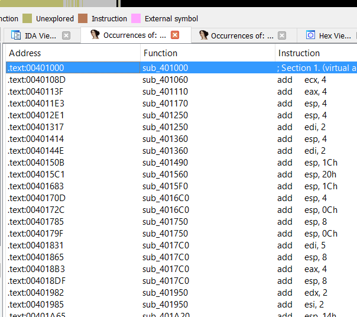
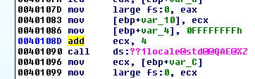
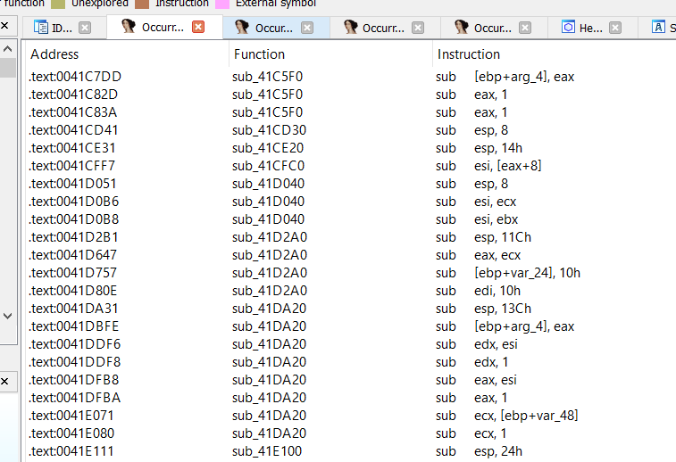
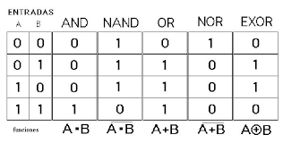
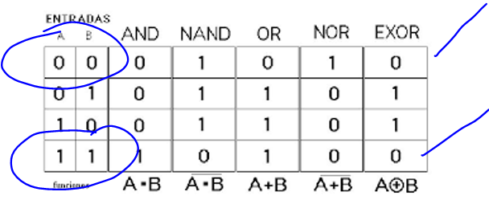
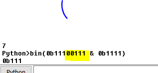
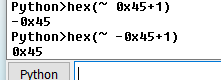
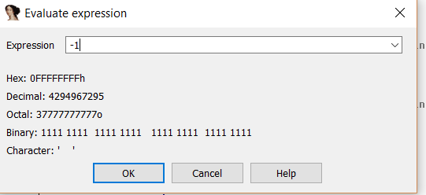

# Часть 6

Давайте продолжим с арифметическими и логическими инструкциями.

**ADD A, B**

Инструкция складывает значение **B** и **A**, и помещает результат в **A**.

**A** может быть регистром или содержимым ячейки памяти, **B** может быть регистром, константой или содержимым ячейки памяти \(**A** и **B** не должны быть в памяти в одно и то же время, в одной и той же инструкции\)

Рассмотрим несколько примеров инструкции **ADD** ища текст **ADD** через **VEVIEWER**.

Здесь мы видим много примеров сложений, где первый член регистр, а второй - константа, как мы знаем, инструкция будет складывать значения регистра в этот момент, со значением константы и будет сохранять результат в регистр.

В этом примере, если **ECX** равно **10000,** то константа **4** складывается с ним и результат **10004** сохраняется в тот же **ECX**.

В этом случае, инструкция добавит **0xFFFFFFFF** к значению **ECX**, которое получено на предыдущем шаге, т.е. содержимое адреса будет указывать сейчас на **ECX + 30**, если этот адрес имеет разрешение на запись, инструкция сложит значения и будет сохранять результат там.

Если содержимое **ECX**, для примера, равно **0x10000,** то по адресу **0x10030** содержимое этого адреса равно значению **1** и когда мы прибавляем к этому значению **0xFFFFFFFF,** что то же самое, что и **-1**, следовательно, результат был бы равен нулю и будет сохраняться по адресу **0x10030**.

В нашем **CRACKME.EXE** есть несколько примеров суммы двух регистров.

В этом случае, оба регистра будут сложены и сохранены в **EDI**.

Конечно, мы можем также складывать **16-**битные и **8-**битные регистры.

> ADD AL, 8
>
> ADD AX, 8
>
> ADD BX, AX
>
> ADD BYTE PTR DS: \[EAX\], 7

Инструкция будет складывать байт содержимого на которое указывает **EAX,** и значение **7,** и будет сохранять результат в то же самое место.

И все возможные комбинации сумм между регистрами, содержимым ячеек памяти и константами, как мы видели все комбинации действительны, если только **EAX** не является константой и содержимым адреса памяти в одно и то же время в той же инструкции.

**SUB A, B**

Эта инструкция действует так же как и **ADD** за исключением того, что вместо операции сложения в данном случае вычитается целое число и сохранит результат в **A**, возможные комбинации те же самые.

**INC A и DEC A**

Инструкция увеличивает или уменьшает регистр, или содержимое ячейки памяти на **1**, на самом деле это частный случай сложения и вычитания.

Оба используются для примера, чтобы увеличить или уменьшить счётчик на **1**.

**IMUL**

Это инструкция умножения со знаком и существует две её формы.

> IMUL A, B
>
>IMUL A, B, C

Первая инструкция выполняет целочисленное умножение **A** на **B**, и результат сохраняется в **A**, а вторая инструкция выполняет умножение **B** на **C**, и результат сохраняется в **A**.

В обоих случаях **A** может быть только регистром, **B** может быть регистром или содержимым ячейки памяти и **C** может быть только константой.

> IMUL EAX, \[ECX\]
>
> IMUL ESI, EDI, 25

Давайте рассмотрим пример в **VEVIEWER**

Мы видим, что есть только примеры для первой инструкции, в обоих случаях будет производиться целочисленное умножение обоих членов и будет сохраняться результат в первый член - **ECX**.

Для второго случая примеров нет.

**IMUL EAX, EDI, 25**

Здесь инструкция умножает **EDI** на **25** и сохраняет результат в **EAX,** это очень легко.

**IDIV A**

В этом случае **A** определяет только **ДЕЛИТЕЛЬ** операции, делимое же как и частное не определяются, потому что они всегда используют одинаковые регистры.

Эта операция создаёт большое **64**-битное число, старшая часть которого находится в **EDX**, а младшая часть в **EAX**. Инструкция делит значение на **A** и сохраняет результат в **EAX**, а остаток значение в **EDX**.

Если **EAX** для примера равно **5**, **EDX** равно нулю и **ECX** равно **2** инструкция выполнит целочисленное деление, результат деления **5** на **2** будет равен **2** и он будет сохранён в **EAX**, а остаток сохранён в **EDX**.

То же самое произойдёт, если **A** - это содержимое ячейки памяти, **EDX:EAX** будет разделено на это значение и результат сохранится в **EAX**, а остаток в **EDX**.

### **ЛОГИЧЕСКИЕ ОПЕРАЦИИ**

**AND**, **OR** или **XOR**

**AND A, B**

Инструкция выполняет логическую операцию **И** между двумя значениями и будет сохранять результат в **A**, то же самое происходит с инструкциями **ИЛИ** или **XOR**, каждая инструкция имеет свою таблицу истинности, которая применяется к каждому члену и результат будет сохранён в **A**.

**A** и **B** могут быть регистрами или содержимым ячеек памяти, но запрещено, чтобы оба были содержимым ячейки памяти в одной и той же инструкции.

Самые используемые случаи - это применение **XOR** к одному и тому же регистру, чтобы легко и быстро изменить его в ноль.

**XOR EAX, EAX** для примера при любом значение **EAX** поместит в результате ноль, так как таблица истинности для **XOR** такая.

В этом случае результат - это последняя колонка и мы видим, что если **XOR**им число против себя , это может случиться только, когда в двочином виде оба биты равны нулю или оба бита равны единице, так как это то же самое число, **A** и **B** равны и побитовый результат всегда даёт ноль в обоих случаях.

Записывая значения как бинарные данные в **PYTHON** строке и используя символ **^,** который является операцией **XOR** в **PYTHON**, я вижу, что применяя операцию **XOR** два одинаковых числа всегда дают **0**.

Конечно, можно использовать десятичные и шестнадцатеричные значения, я просто использовал двоичный режим чтобы увидеть как бит влияет на бит.

Другое простое использование для примера.

**AND EAX, 0F**

**0F** это **1111** в двоичной системе счисления.

Мы видим, что второй член равен **1,** результат не изменится, он останется равным как был первоначально, в то время как все другие биты станут равны нулю.

Таким образом, я легко поместил нули во все биты числа и оставил последние **4** бита нетронутыми.

Там мы видим, что **AND** в **PYTHON** записывается символом **&** и результатом является **0B0111**, а это последние четыре первоначальные биты.

В случае **OR** в **PYTHON** он записывается как вертикальная черта.

Всегда, с использованием научного калькулятора или с помощью **PYTHON** мы можем решать операцию без перевода значений в двоичный вид и видя процесс перевода бит к биту, что является немного тяжелым процессом, когда решаем сами.

**NOT A**

Инструкция инвертирует все биты **A** и сохраняется затем в **A**.

Инструкция **NOT** не существует в **PYTHON**, но это очень просто, если Вы имеете число **0101** и Вы применяете к нему операцию **NOT**.

Результатом будет инверсия каждого бита.

Мы видим, что все нули изменились в один и наоборот.

**NEG A**

**NEG A** превращает **A** в **-A.**

Это не то же, что операция **~** в **PYTHON,** потому что тут ещё вычитается единица.

Чтобы получить **NEG** в **Python** мы должны добавить к результату **1**.

> SHL, SHR
>
> SHL A, B
>
> SHR A, B

**A** может быть регистром или ячейкой в памяти, а **B** константой или **8-бит.** регистром.

Эти инструкции сдвигают байты влево\(**SHL**\) и вправо \(**SHR**\), байты которые исчезают с одной стороны, заменяются нулями с другой стороны, давайте рассмотрим пример.

Предположим, что у нас есть **-1**, для примера.

И если я сделал **SHL 2,** я получу.

При перемещении битов влево два бита исчезли в левой части, и теперь заполнены двумя нулями биты в правой части.

То же самое произойдёт, если мы используем **SHR**, биты сдвинутся к правой стороне. Те биты которые исчезнут с правой стороны, будут заменены на **0** с левой стороны.

Существуют также инструкции **ROL** и **ROR**, которые похожи, они вращают определенное количество бит, но в этом случае те биты, которые исчезают с одной стороны, возвращаются с другой стороны с теми же значениями, это пример чистого вращения битов, так как не меняется ни один бит, они просто крутятся.

До встрече в **7**-й главе.

* * *

Автор оригинального текста — Рикардо Нарваха.

Перевод и адаптация на английский  язык — IvinsonCLS.

Перевод и адаптация на русский язык — Яша Яшечкин.

Источник:

[**http://ricardonarvaja.info/WEB/INTRODUCCION%20AL%20REVERSING%20CON%20IDA%20PRO%20DESDE%20CERO/6-INTRODUCCION%20AL%20REVERSING%20CON%20IDA%20PRO%20DESDE%20CERO%20PARTE%206.7z**](http://ricardonarvaja.info/WEB/INTRODUCCION%20AL%20REVERSING%20CON%20IDA%20PRO%20DESDE%20CERO/6-INTRODUCCION%20AL%20REVERSING%20CON%20IDA%20PRO%20DESDE%20CERO%20PARTE%206.7z)
