# Часть 7

##  **ИНСТРУКЦИИ УПРАВЛЕНИЯ ПОТОКОМ ВЫПОЛНЕНИЯ ПРОГРАММЫ**

Давайте закончим с инструкциями, которые всегда являются самой сложной частью, проглотите эту жесткую таблетку, потому что дальше будет лучше.

Следующие инструкции управляют потоком выполнения программы. Мы знаем, что **EIP** указывает на следующую инструкцию, которая будет выполнена, и когда это произойдёт, **EIP** будет указывать снова на следующую инструкцию.

Но сама программа имеет в себе инструкции, которые управляют её потоком и могут перенести выполнение к желаемой инструкции, мы также увидим эти случаи.

**JMP A**

**A** будет адресом памяти, куда мы хотим, чтобы программа совершила безусловный переход.

**JMP SHORT** - это короткий переход, который состоит их двух байт и он имеет возможность переходить вперед и назад, направление задаётся значением второго байта, первый байт это **ОПКОД** перехода, мы не можем переходить очень далеко.

Если мы установим в **IDA** опцию, чтобы видеть байты, из которых состоят инструкции, мы увидим опкод **0xEB,** который соответствует инструкции **JMP** и которая будет совершать переход на **5** байт вперед от места, где заканчивается инструкция, адрес назначения может быть рассчитан следующим образом.

Начальный адрес инструкции + **2**, что является количеством байт, которые составляют инструкцию и затем добавляется число **5**, что является вторым байтом.

Очевидно, что переход вперёд и назад с использованием одного лишь байта не даст нам большой диапазон для перехода, максимальный положительный переход вперёд будет равен **0x7F** байт, мы увидим такой пример.

Поскольку мы будем делать некоторые изменения, которые будут изменять функцию, рекомендуется делать снимок базы данных, который позволит нам вернуться в предыдущее состояние, всегда, если мы имеем сомнения, что мы делаем что-то, что можем испортить любую функцию и мы не знаем как её восстановить, рекомендуется делать снимок.

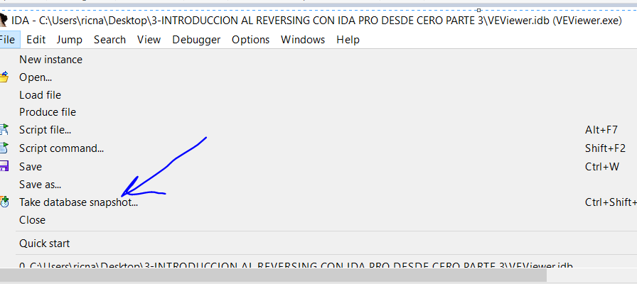

Здесь нас спросят имя.

В **VIEW-&gt;DATABASE SNAPSHOT MANAGER**

Это позволит нам увидеть список всех снимков и дату, когда они были сделаны и с помощью кнопки **RESTORE,** мы можем вернуться к состоянию, которое мы хотим, которое мы сохранили ранее.

Давайте посмотрим, что произойдёт, если поменять байт **0x05** на **0x7F**.

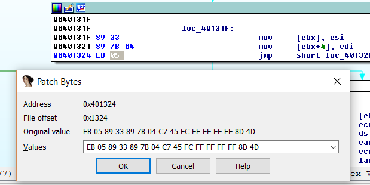

Используя **PATCH BYTE** в **IDA**, я меняю байт **0x05** на **0x7F**.

Переход стал немного длиннее и он выходит из функции, если нажать пробел для выхода из графического режима…

Мы видим, что всё нормально и этот переход ведёт к адресу **0x4013A5** вперёд, давайте посмотрим, что произойдёт, если мы изменим байт **0x7F** на **0x80**.

Вернёмся в графический режим с помощью пробела и изменим байт на **0x80**.

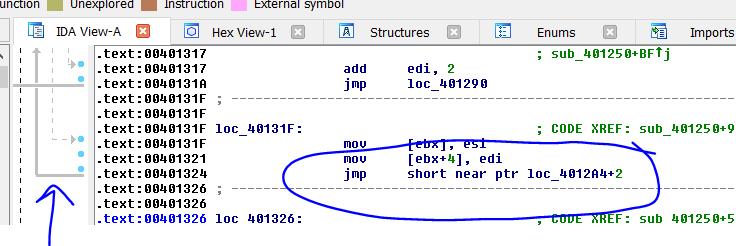

Мы видим, что сейчас мы делаем самый большой переход назад, здесь изменяя значение **0x7F** на **+1**, что является самым большим переходом вперёд, мы изменили его на **0x80**, что является теперь самым большим переходом назад.

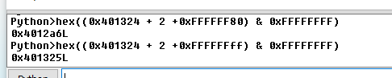

В этом случае, когда мы возвращаемся назад, чтобы подогнать всё под формулу и только для математических целей, потому что **PYTHON** не знает, что переходы могут идти вперед или назад от инструкции, мы должны записывать **-0x80** в его **16**-ное значение, в **DWORD**, что равно значению **0xFFFFFF80**, а затем, как мы видели при выполнении инструкции, применить логическое **AND0xFFFFFFFF** к результату, этим мы очищаем все биты, большие, чем необходимо для **32**-битного числа, и у нас получается тот же самый адрес **0x4012A6**.

Если я использую **0xFF** в качестве второго байта, это будет минимальный переход, который равен **-1** в **16**-том представлении. Я добавляю к нему **0xFFFFFFFF**, чтобы соответствовать нужной разрядности. Помните, что мы всегда добавляем размер инструкции, в данном случае, два байта. Это позволит нам совершить переход назад, потому что **2 байта**, которые мы добавили, заставляют считать это как начало вычисления. Инструкция будет переходить по адресу **0x401325**.

Если мы продолжим переходить назад ещё на одну позицию, то вторым байтом будет **0xFE**, что означает переход назад на **-2** байта от конца инструкции, в формуле это будет добавление значения **0xFFFFFFFE**.

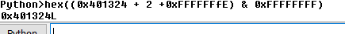

Этот переход к той же самой начальной инструкции, которая именуется **БЕСКОНЕЧНЫМ ЦИКЛОМ**, она всегда возвращается к повторению и Вы не можете вырваться из него.

И так далее, переход на **-3** где заканчивается инструкция перехода назад, будет равен **0xFD** и он совершит переход по адресу **0x401323**.

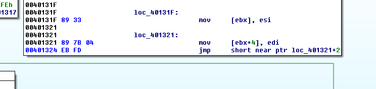

Очевидно, с помощью коротких переходом, мы не можем переходить ко всем адресам, потому что мы ограничены несколькими байтами вокруг инструкции, где мы находимся, поэтому мы используем длинные переходы.

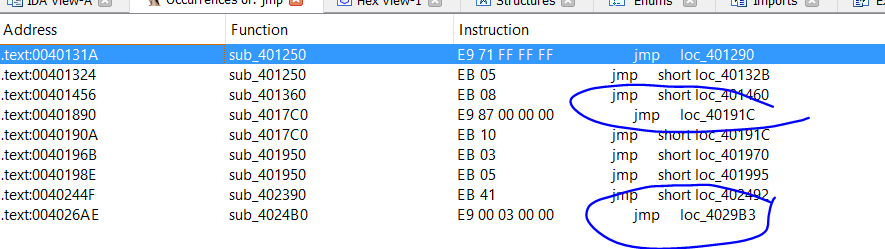

Здесь, мы видим пару длинных переходов, помните, что **loc\_** говорит нам, что эта инструкция является локальной\(любой, основной\) инструкцией.

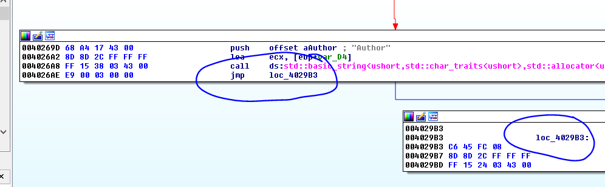

Здесь мы видим длинный переход, расстояние между адресами **0x4026AE** и **0x4029B3** намного больше, чем мы можем достичь с помощью короткого перехода.

Здесь мы видим, что расстояние вычисляется с помощью следующей формулы: **конечный адрес - начальный адрес – 5. 5** - это размер инструкции. Это даёт мне результат **0x300,** что является **DWORD** и он стоит рядом с опкодом длинного перехода **0xE9**.

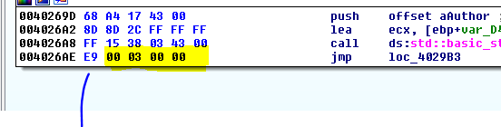

Если с помощью **KEYPATCH** я изменяю адрес назначения этого перехода на адрес перехода назад, например на адрес **0x400000**, мы видим ...

Хотя он помечен мной в красный, потому что он не является действительным адресом в данный момент, Я буду видеть, смогу ли я сделать формулу в **PYTHON,** чтобы сделать переход назад.

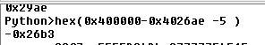

Это даёт мне расстояние равное **-0x26B3**, используя ту же самую предыдущую формулу.

Эти байты в **16**-ном представлении равны **0xFFFFD94D**, которые стоят рядом с опкодом **0xE9**, но только инвертированы справа налево.

### **УСЛОВНЫЕ ПЕРЕХОДЫ**

Как правило, программы должны принимать решения и в соответствии со сравнением некоторых значений, они могут переназначать выполнение программы в то или иное место программы.

Давайте возьмём например инструкцию **CMP A, B**.

Я могу сделать, чтобы программа сравнила **A** и **B** и в соответствии с отношениями между ними, программа сделает что-то, если не сделает что-то другое.

Так что, обычно, после сравнения, которое изменяет важные **ФЛАГИ**, в зависимости от их состояния, инструкция условного перехода решит что делать.

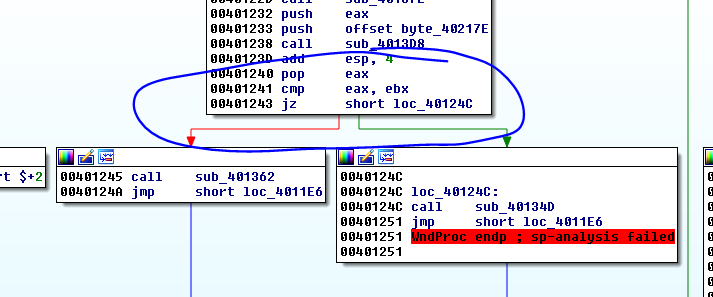

Здесь мы видим, пример условного перехода **JZ,** он также совершает переход, если флаг **Z** или нуль активирован. Это происходит, когда в предыдущем примере **CMP** **EAX** и **EBX** равны, так как **CMP**похожа на инструкцию **SUB,** но она без сохранения результата.

**CMP** вычитает оба регистра и если они равны, результатом будет **0,** что активирует **ФЛАГ Z** или нуль, который проверяет переход **JZ**, чтобы совершить переход, если **ФЛАГ Z** активирован, программа переходит к зелёной стрелке и если нет, то переходит к красной стрелке, если они разные.

При использовании отладчика, мы будем видеть несколько примеров срабатывания флагов. К настоящему моменту важно знать, что если есть сравнение после него, вы можете увидеть эти разные переходы.

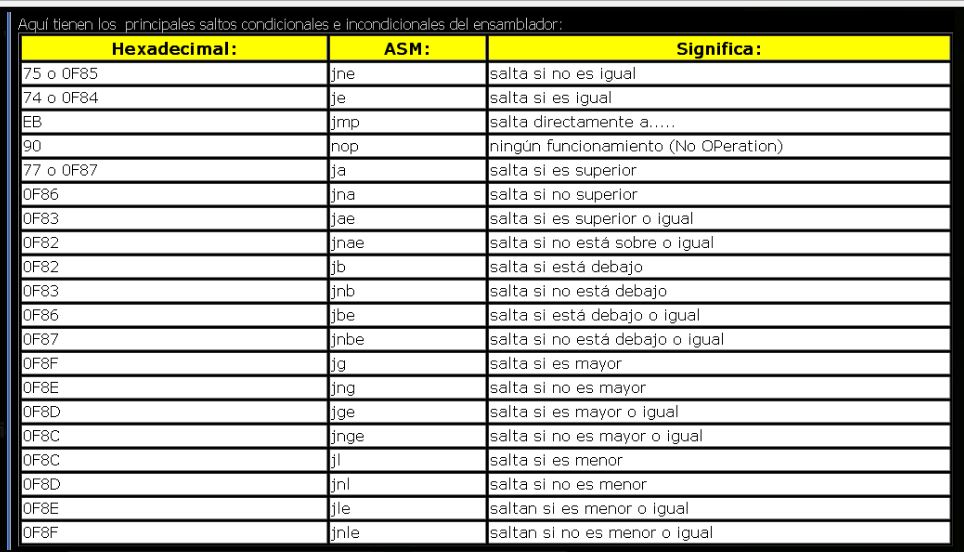

Хорошо, за исключением **JMP** и **NOP,** которые не принадлежат таблице, остальные - это условные переходы, которые оценивают различные состояния сравнения, если первый аргумент из них больше, или если больше или равен, или если меньше и т.д., есть несколько возможностей работы с ними, которые мы увидим позже более подробно, когда будем рассматривать **ОТЛАДЧИК**.

### **ИНСТРУКЦИИ CALL И RET**

Другие инструкции, которые мы должны упомянуть, это **CALL**, она используется для вызова функции и **RET**, используется для возврата из функции к инструкции слeдующей за тем, где был вызов **CALL**.

Здесь мы видим пример инструкции **CALL**, который переходит по адресу **0x4013D8** для выполнения этой функция \(мы видим приставку **sub\_** перед адресом **0x4013D8**, которая говорит нам об этом\).

Инструкция **CALL** сохраняет на **ВЕРШИНЕ** стэка значение, куда будет возвращаться выполнение или адрес возврата, в нашем случае это адрес **0x40123D**, я могу войти во внутрь этой функции просто нажав **ENTER** на инструкции **CALL**.

После того, как эта функция завершится, она также достигнет инструкции **RET**, который берёт адрес возврата сохранённый в стэке,а именно адрес **0x40123D** и перейдёт туда, продолжая выполнение после **CALL**.

Хорошо, с этим мы закончили обзор основных инструкций, если нам понадобиться больше поговорить о некоторых инструкциях, мы сделаем это с более подробной информацией далее.

До встрече в **8**-й части.

* * *

Автор оригинального текста — Рикардо Нарваха.

Перевод и адаптация на английский  язык — IvinsonCLS.

Перевод и адаптация на русский язык — Яша Яшечкин.

Перевод специально для форума системного и низкоуровневого программирования - WASM.IN

Источник:

[**http://ricardonarvaja.info/WEB/INTRODUCCION%20AL%20REVERSING%20CON%20IDA%20PRO%20DESDE%20CERO/7-INTRODUCCION%20AL%20REVERSING%20CON%20IDA%20PRO%20DESDE%20CERO%20PARTE%207.7z**](http://ricardonarvaja.info/WEB/INTRODUCCION%20AL%20REVERSING%20CON%20IDA%20PRO%20DESDE%20CERO/7-INTRODUCCION%20AL%20REVERSING%20CON%20IDA%20PRO%20DESDE%20CERO%20PARTE%207.7z)
