# Часть 9

[\[Используемые материалы\]](.gitbook/assets/files/09.zip)

Мы разбираемся понемногу как нужно работать с **ЗАГРУЗЧИКОМ**, мы оставили некоторые вещи на потом, чтобы наблюдать за ними позже в **ОТЛАДЧИКЕ**, например, как меняются флаги в зависимости от используемых инструкций.

Мы будем практиковаться на очень простых примерах, в нашем случае это очень простые крэкми, которые скомпилированы в **VISUAL STUDIO 2015** для нашей практики. Очевидно, для того, чтобы крэкми заработал, у Вас должны быть установлены последние версия библиотек **VISUAL STUDIO 2015 C++**.

[https://www.microsoft.com/es-ar/download/details.aspx?id=48145](https://www.microsoft.com/es-ar/download/details.aspx?id=48145)

Пакеты **Visual C++ Redistributable** устанавливают компоненты среды выполнения, которые необходимы для запуска приложений написанных на языке **C++** и скомпилированные в **Visual Studio 2015**.

Выберите нужный для своей операционной системы пакет, согласно вашему языку, загрузите и установите библиотеки.

Присоединенный файл - это исполняемый файл, который называется **HOLA\_REVERSER.EXE**([крэкми находится в архиве с оригиналом](http://ricardonarvaja.info/WEB/INTRODUCCION%20AL%20REVERSING%20CON%20IDA%20PRO%20DESDE%20CERO/9-INTRODUCCION%20AL%20REVERSING%20CON%20IDA%20PRO%20DESDE%20CERO%20PARTE%209.7z)) и который запускается под **WINDOWS 7**.

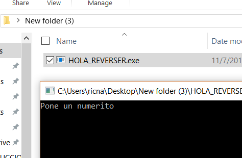

При вводе номера крэкми будет говорить, насколько я хороший или плохой реверсер.

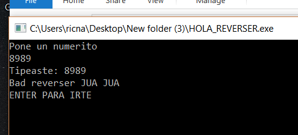

Мы видим, что это очень простой крэкми, если я открою его в **IDA** и только в **ЗАГРУЗЧИКЕ** без отладчика, увидим следующее.

В моём случае \(не в Вашем\) функция **MAIN** появляется среди других функций, поэтому я могу найти её с помощью комбинации **CTRL+F** здесь на этой вкладке или там, где у меня открыта вкладка с функциями, но это происходит, потому что я скомпилировал программу с помощью **VISUAL STUDIO** и создал **PDB** файл с символами, который обнаруживает **IDA** и загружает оттуда имена функций и имена переменных, мы видим, что в моём листинге равно как и в моём исходном коде, появляется функция **MAIN**, а ниже функция **PRINTF**, мы будем смотреть, что будет происходить в Вашем случае.

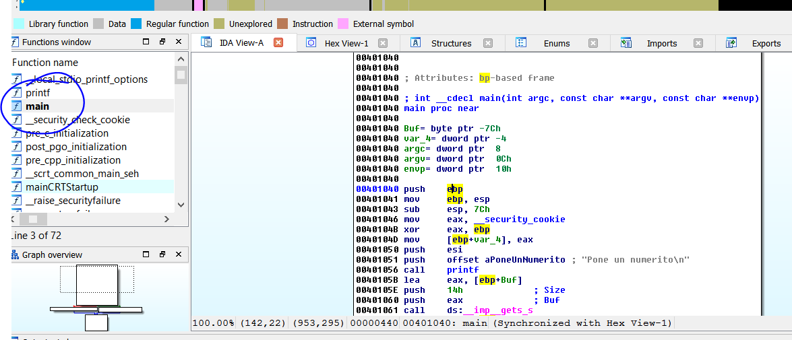

В Вашем случае, **IDA** не скажет, что это за функция, потому что у **IDA'**ы нет символов.

Вероятно, это потому, что никто не распространяет программу с символами.

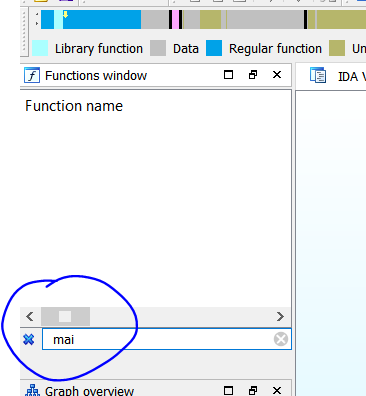

Обычно у нас будут символы для системных модулей, за исключением очень редких случаев, в этом случае этот косяк с программой под моей ответственностью, поэтому у меня есть символы, но мы будем анализировать крэкми без символов как любую обычную программу.

Мы видим, что здесь у нас нет символов.

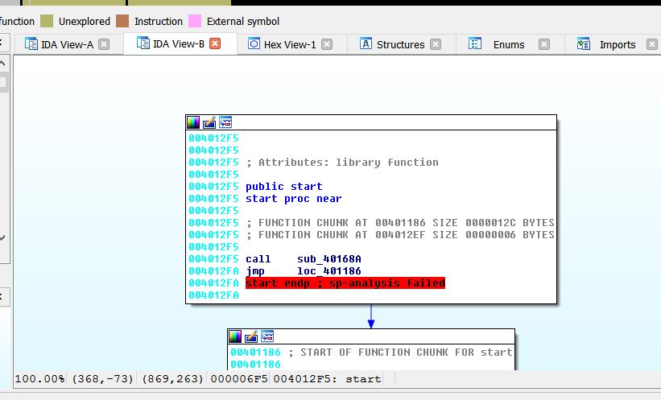

Мы имеем очень мало информации, но хорошо то, что мы можем видеть строки.

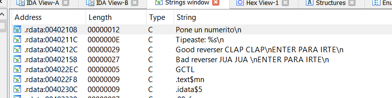

У нас есть строки в поле зрения, те, что использует крэкми, чтобы сказать нам, что мы ошибаемся при вводе недопустимого серийного номера.

Мы можем сделать двойной щелчок на строке **"Pone un numerito\n"**.

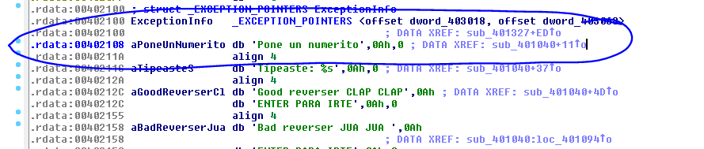

Здесь мы видим, что **0x402108** это адрес строки, а рядом с адресом мы видим **ТЭГ**, который помещен рядом и всегда начинается с буквы "**a**" если это строка **ASCII**, а оставшиеся символы принадлежат к той же строки, поэтому её очень легко распознать, в нашем случае тэг называется **aPoneUnNumerito**, а затем идут символы **DB**, потому что строка - это последовательность байт.

Строку можно рассыпать на байты с помощью клавиши **D**, теперь мы видим те же самые символы только по вертикали и по одному.

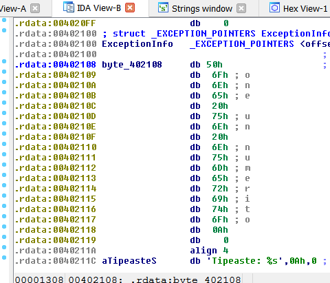

Сейчас, когда мы убеждаемся, что это та же строка, мы вновь создаем строку с помощью клавиши **A** и собираем её по горизонтали.

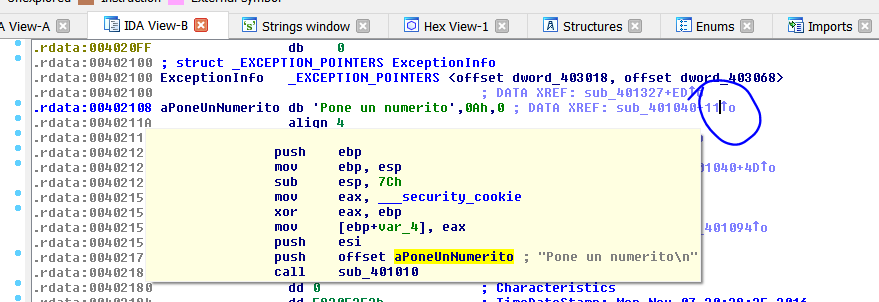

Поместив курсор мыши на ссылку в виде маленькой стрелки, мы видим откуда вызывается эта строка, но будет лучше, если мы нажмем клавишу **X**, чтобы увидеть список ссылок и перейдём туда.

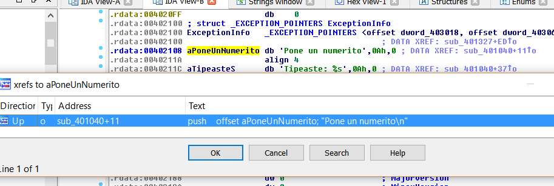

Хорошо, мы находимся в главной функции, здесь она не называется главной, хотя имя буфера, который является общим помечен как **BUF**.

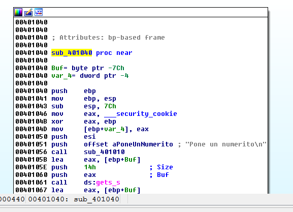

Предполагается, что мы не знаем исходный код программы, но я Вам его покажу.

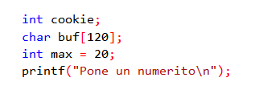

Я понимаю, что переменные, которые Вы создаете, становятся оптимизированными, например такие как **COOKIE** и **MAX**, которые заменены константами и остаётся только мой буфер, который в моём коде составлял **120** байт в десятичной системе.

Буфер - это пространство памяти зарезервированное, чтобы хранить данные, в нашем случае резервируется **120** байтов.

Как мы можем узнать в **IDA** размер буфера в стеке, если у нас нет исходного кода?

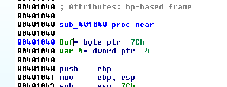

Здесь в верхней части функции мы видим список переменных и аргументов, двойной щелчок по любому из них переводит нас к статическому представлению стека в котором видны позиции переменных, буферы аргументов и т. д., в статической форме конечно, и расстояние, которое существует между ними.

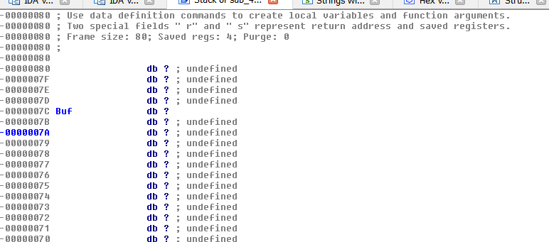

Здесь мы видим буфер **BUF**, но он определен как последовательность байт **DB** \(**IDA** если нет символов не может обнаружить буфер\). Чтобы собрать его в массив символов или пустой массив, щелкните правой кнопкой мыши на слове **BUF** и выберите параметр **ARRAY**.

-= Примечание от **Яши** — Можно также нажать символ **\*** на цифровой клавиатуре=-

Здесь мы видим, что до следующей переменной или того, что находится ниже в стеке, **IDA** обнаружила **120** десятичных **DB**, а элемент массива равен длине каждого поля, так как размер поля равен **1**байту, то это массив символов или байтов и его сумма рассчитывается так **120\*1** байт или просто **120** байт.

Если согласимся с этим, то получится так.

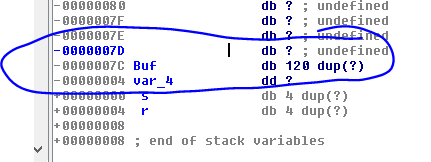

Я вижу, что буфер состоит из **120** байт, что соответствует моему исходному коду, хотя компилятор может сделать его больше, пока он минимум равен **120** байт, то всё хорошо, в этом случае они равны. **DUP** - означает дубликат \(на самом деле он должен быть умножен\) **120** раз на символ "**?"**, потому что значение ещё не определено и это соответствует пустому статическому буферу.

Я буду прояснять представление статического стека позже, но ниже **BUF** есть переменная **DWORD** \(**DW**\) называемая **VAR\_4**. **S** и **R** - это сохраненный **EBP** родительской функции, которая вызвала эту функцию и **АДРЕС ВОЗВРАТА**, как мы видели при входе в первую функцию - сначала кладутся аргументы с помощью **PUSH**, а затем делается **CALL**, чтобы войти в функцию, которая сохранит **АДРЕС ВОЗВРАТА** в стек, и локальные переменные будут выше **S**.

> **ПЕРЕМЕННЫЕ**
>
> …
>
> …
>
> **S** \(Сохраненный **EBP** - как правило, происходит от **PUSH EBP**, которая является первой инструкцией функции\)
>
> **R** \(Адрес возврата\)
>
> **АРГУМЕНТЫ**

Поскольку аргументы помещаются в стек перед **CALL**, который помещает адрес возврата в стек, они будут ниже него, затем будет идти адрес возврата, а выше него **СОХРАНЕННЙ EBP** порожденный инструкцией **PUSH EBP**, которая как правило первая инструкция в функции, а затем выше идет пространство локальных переменных, мы увидим их более подробно позже.

Если я нажму **X**, чтобы увидеть откуда вызывается эта функция, то увижу:

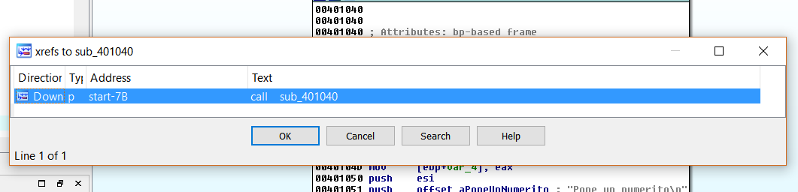

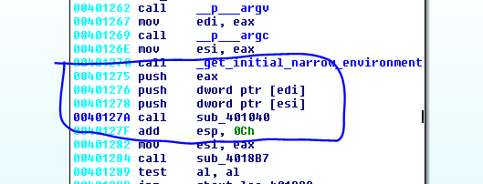

И я иду туда и вижу, что у нас есть инструкции **PUSH**, которые передают аргументы функции, имя которой я видел, когда работал с **СИМВОЛАМИ**, а сейчас её здесь нет, 3 аргумента ниже пропущены, ниже есть изображение с символами.

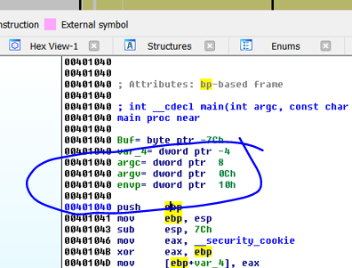

**IDA** обнаружила, что никогда не используются такие аргументы как **ARGC**, **ARGV** и **ENVP**, они присутствуют по умолчанию в функции **MAIN**, но так как там не было никаких ссылок на них или их использование в функции, **IDA** избавилась от них.

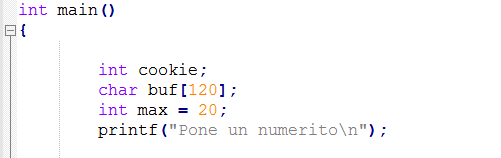

Кроме того, в моём коде даже не передаются переменные как аргументы к функции **MAIN**, так что все хорошо - функция без аргументов.

Когда мы хотим увидеть из какого места получается доступ к переменной, мы отмечаем её и нажимаем **X**.

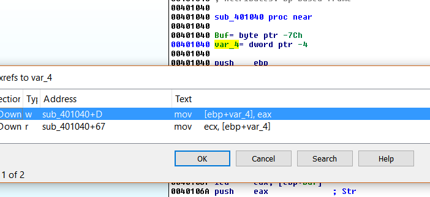

Мы видим, что **VAR\_4** используется в двух местах, для тех кто не знает, это переменная **COOKIE**, которую я не программировал, это защита от переполнения стека, программа сохраняет их в начале при запуске функции, проверяет их на целостность при выходе из функции, теперь мы можем переименовать их в **COOKIE\_DE\_SEGURIDAD** или **CANARY**.

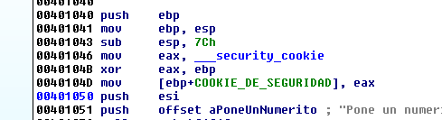

Мы видим, что когда функция хочет напечатать строки она вызывает **CALL** в которой в конечном итоге будет вызвана функция **PRINTF** для печати строк.

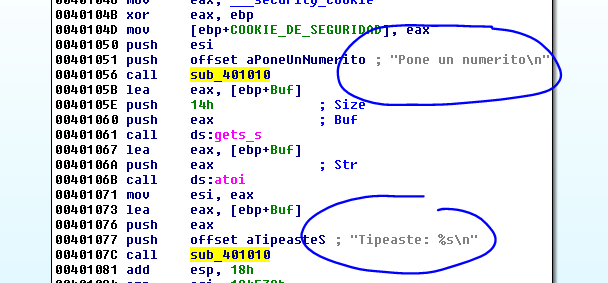

Мы видим, что в версии с символами **IDA** обнаружила её непосредственно как функцию **PRINTF**.

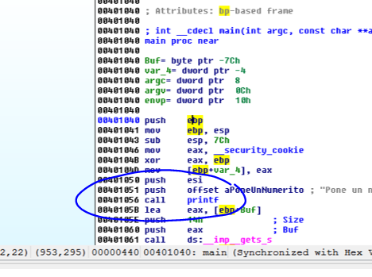

Но только если мы посмотрим внутрь **CALL** то узнаем, что аргументы, это строки, которые печатаются в консоли и мы делаем вывод, что это функция **PRINTF**.

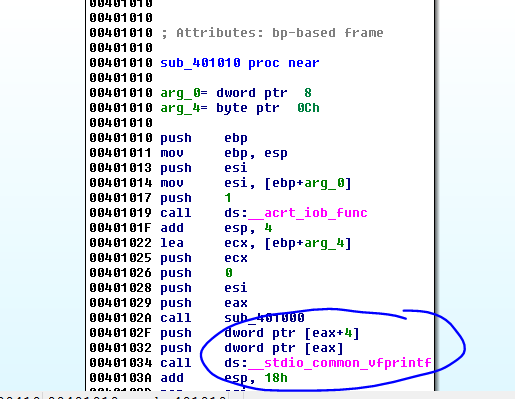

Мы видим, что внутри эта функция заканчивается вызовом **VFPRINTF**, так что, это то, что нам нужно переименовать.

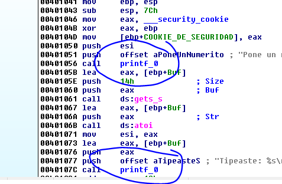

У нас остаётся только буфер из **120** байт, давайте посмотрим, что будет с ним происходить.

Мы видим, что буфер идет как аргумент к функции **GETS\_S** - эта функция, которая получает то, что мы вводим в консоли.

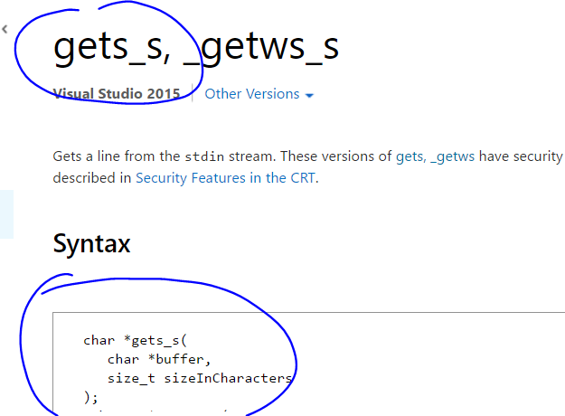

Мы видим, что есть два аргумента - указатель на буфер и его максимальный размер, в который позволено нам печатать, давайте посмотрим, что будет в нашем случае.

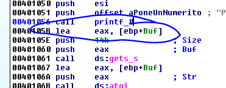

Ранее мы сказали, что **LEA** вычисляет адрес переменной, в этом случае **LEA** является указателем на буфер **BUF**, который передаётся с помощью инструкции **PUSH EAX**, а затем идёт **PUSH 0x14**,который указывает максимальное количество символов, которое можно ввести в консоли.

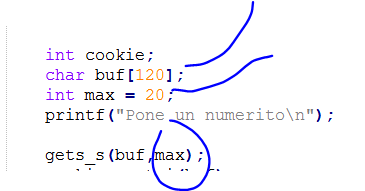

В моём исходном, мы видим тот же самый вызов **GET\_S** с двумя аргументами - **БУФЕР** и его максимальное значение, который я обозвал как переменную **MAX** из **20** элементов, но компилятор, чтобы сохранить пространство поместил именно **20** в десятичной или **0x14** в **HEX** в этот аргумент, так как не нужно использовать больше.

Следовательно, не выполняя этот вызов, я знаю, что в буфере у меня есть символы, которые я набираю в консоли.

Позже, тот же указатель на буфер помещается как аргумент к функции **ATOI**.

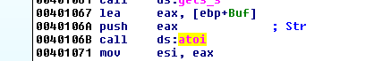

Она делает то же самое.

Эта функция конвертирует строку в целое число и если она не может это сделать, потому что происходит переполнение \(выход за максимально возможное значение\), нам будет показываться ошибка и вернётся ноль, тоже самое происходит и с отрицательным числом, но идея состоит в том, что всё что я буду вводить будет конвертироваться в число, если я введу значение **41424344** оно будет конвертироваться в десятичное значение **41424344**, а так как в ассемблере мы работаем с **HEX** значениями, оно будет возвращено в **HEX** через регистр **EAX**.

Каждая функция возвращает генерируемое значение **INT**, она интерпретирует входные символы как число. Функция возвращает значение **0** для **ATOI** и **\_WTOI**, если ввод не может быть преобразован в значение этого типа.

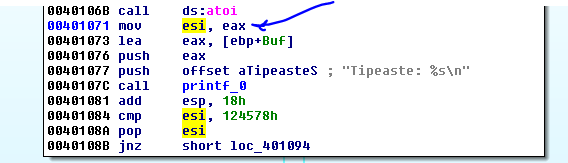

Мы видим, что значение возращенное из **EAX** переносится в **ESI** и после печати первоначальной строки, которая была введена, сравнивает **ESI** с числом **0x124578**.

Так что, то, что набрано интерпретируется как строка в десятичном формате, которая возвращается в **HEX** виде и это число сравнивается с этой константой, передавая десятичное значение этой константы.

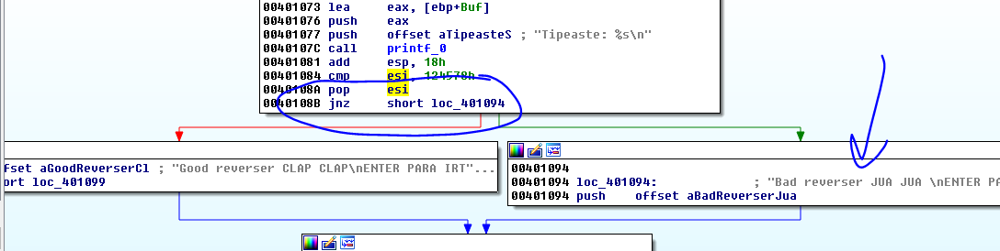

Мы видим, что если сравнение не равно \(**JNZ**\) оно переносит меня к **BAD REVERSER**, а если равно, то переносит к **GOOD REVERSER**, давайте попробуем в консоли **PYTHON** увидеть десятичное значение числа **0x124578**.

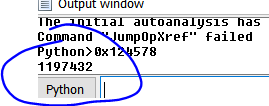

Мы вводим это значение в наш **CRACKME**.

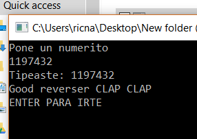

Хорошо, это простой пример статического реверсинга, далее также продолжим работу с ЗАГРУЗЧИКОМ

До встрече в **10**-й главе.

* * *

Автор оригинального текста — Рикардо Нарваха.

Перевод и адаптация на английский  язык — IvinsonCLS.

Перевод и адаптация на русский язык — Яша Яшечкин.

Перевод специально для форума системного и низкоуровневого программирования - WASM.IN

[**Источник: ricardonarvaja.info**](http://ricardonarvaja.info/WEB/IDA%20DESDE%20CERO/CURSO%20DE%20IDA%20TUTES/9-INTRODUCCION%20AL%20REVERSING%20CON%20IDA%20PRO%20DESDE%20CERO.docx)
