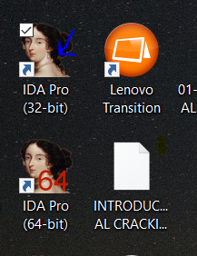
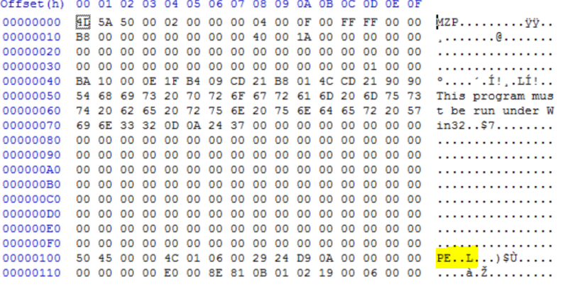
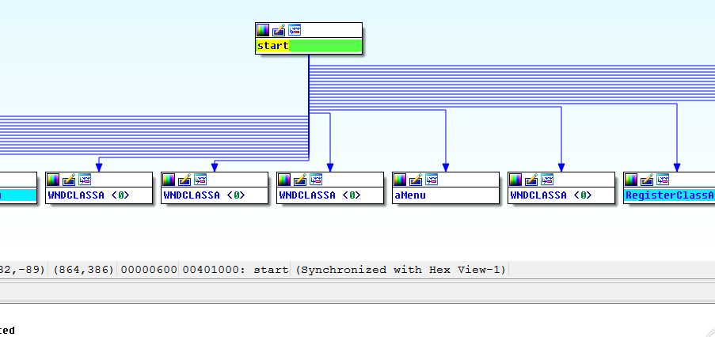
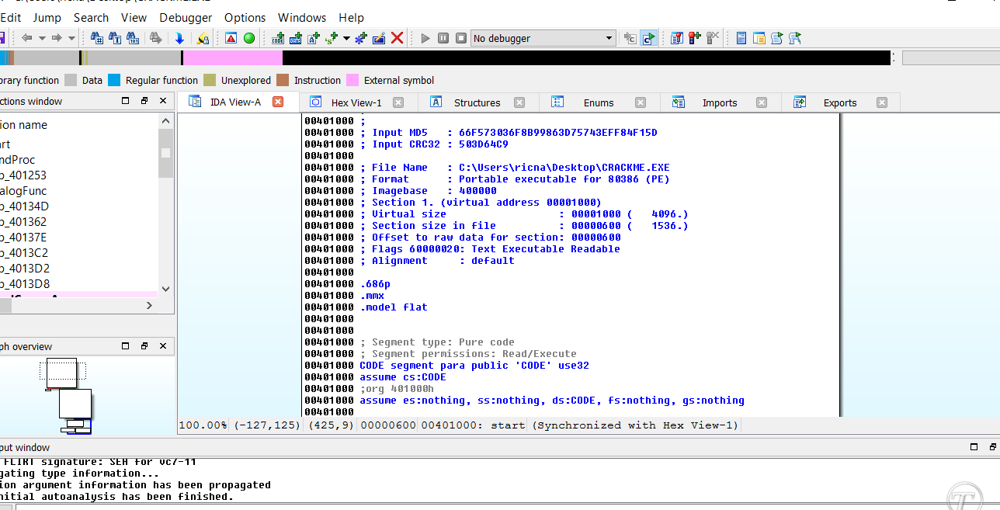
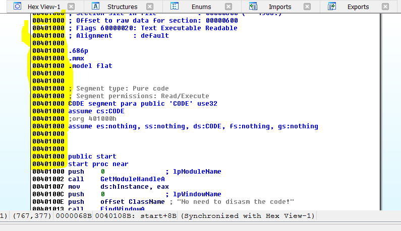
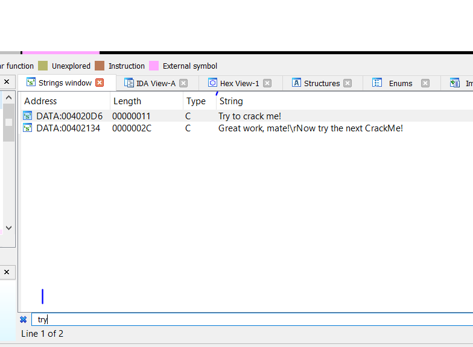
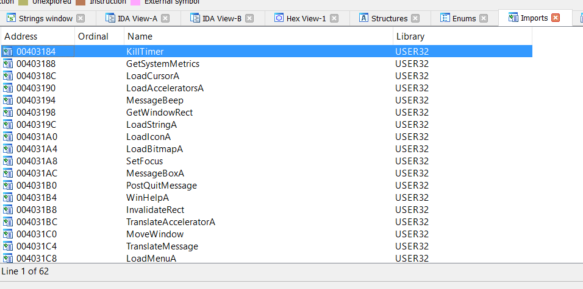
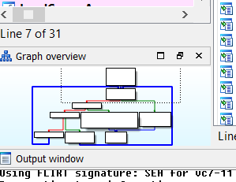
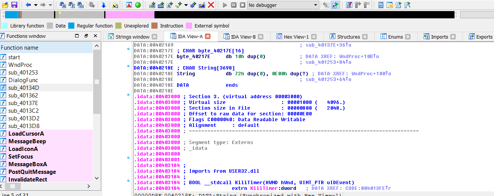

# Часть 1

 **ВВЕДЕНИЕ В РЕВЕРСИНГ С НУЛЯ ИСПОЛЬЗУЯ IDA PRO**  
  
Идея этих серий учебных пособий является обновить наш оригинальный курс по реверсингу, но используя IDA PRO. Будем обучаться использовать ее с нуля и работать будем с последней версией Windows. В моем случае, я использую Windows 10 Anniversary Update x64 со всеми патчами, вплоть до 29 октября 2016.  
  
**ПОЧЕМУ ИМЕННО IDA PRO**   
  
Потому что, пока OllyDBG просто 32-х битный отладчик режима пользователя, а IDA PRO целая программа для реверсинга, которая может быть использована в 32/64 системах, как и отладчик и как дизассемблер. Она позволяет делать статический реверс, который не может быть выполнен в OllyDBG и которая обучает как использовать ее, не смотря на сложный процесс обучения, она позволяет работать в Windows, Linux или Mac как внутри системы, так и удаленно в следующих операционных системах.

Для того, чтобы иметь представление о поддерживаемых процессорах, здесь есть список.

Как мы можем видеть, обучение как использовать IDA позволяет нам улучшить рабочее окружение, мы сфокусируемся на 32/64 разрядной Windows в пользовательском режиме и иногда в режиме ядра. Это позволит нам легче адаптироваться к любому использованию .

Здесь мы увидим большинство вещей, которые мы видели в Введение в отладку с нуля с использованием OllyDBG, но сейчас будет IDA. Попытаемся идти дальше с самого начала.

В этом курсе будет всё: статический и динамический реверс, крякме, будем учиться исследовать эксплоиты и распаковку. Я постараюсь писать о какой-нибудь важной детали с нуля.

**НАЧАЛО**

Нам нужна IDA PRO. Проблема в том, что это коммерческая программа и мы должны платить за нее и она того стоит. Мы не можем и не будем распространять её, но вы можете поискать утекшие в сеть версии через Гугл по такому запросу: IDA PRO 6.8 + HEXRAYS. Эта версия с которой мы будем работать. Последняя же версия - IDA 6.95.160808 \( 08 Августа 2016\).

Когда мы скачали, можем увидеть zip файлы и такой установщик

**idapronw\_hexarmw\_hexx64w\_hexx86w\_150413\_cb5d8b3937caf856aaae75 0455d2b4ae**

Пароль на установку хранится в файле install\_pass.txt.

Также будет установлен Python 2.7.6. Он используется, чтобы избежать проблем используя другие версии IDA. Если вы установили Питон самостоятельно отдельно, он должен быть той же версии, что использует IDA.

После установки, загрузим крэкме Cruehead, он идет вместе с этим туториалом.

Так как это 32-х битный исполняемый файл, мы загрузим его в IDA для 32-х битных  
файлов напрямую.

Если мы запустим крэкме вне IDA, мы увидим через Диспетчер Задач, что это 32-х битный процесс. Если мы хотим знать 32-х битный это или 64-х битный файл, без запуска, мы можем использовать 16-тиричный редактор. Например такой.  
[**https://mh-nexus.de/en/downloads.php?product=HxD**](https://mh-nexus.de/en/downloads.php?product=HxD)​ Загрузите и установите английскую версию [**http://mh-nexus.de/downloads/HxDSetupES.zip**](http://mh-nexus.de/downloads/HxDSetupES.zip)​  
Самый простой способ - это открыть файл в хекс-редакторе, чтобы узнать какой он

То, что мы видим - это Snipping Tools. И это 64-х битное приложение. Мы видим, что после слова PE есть следующие значения -&gt; PE..d†

Наш крэкми - 32-х битный, после слова PE видим -&gt; PE..L

Поэтому мы уже знаем какой мы файл имеем, чтобы загрузить его с использованием IDA 32. Когда IDA покажет окно QUICK START, мы выберем NEW, чтобы открыть новый файл, найдем наш крэкми и выберем его.

Сейчас не будем трогать настройки, потому что IDA правильно определила версию файла и мы можем нажать OK.

Если дальше нажмем YES на PROXIMITY VIEW, отобразиться дерево просмотра программы.

Чтобы перейти к графическому режиму или неграфическому - режиму инструкций нужно нажать пробел.

Также в OPTIONS - DEBUGGING OPTIONS - LINE PREFIXES мы можем добавить адреса в переднюю часть при графическом представлении.

Когда вы открываете исполняемый файл, первое, что открывается, это окно дизассемблера, которое называется LOADER, оно не запускает программу, а только ее анализирует для реверсинга и создает файл idb или базу данных \(database\).

Чтобы отладить программу мы должны выбрать среди всех доступных отладчиков включенных в IDA и запустить его в Режиме отладки, который мы разберем позже

Мы видим, что многие опции программы представлены в виде вкладок, в меню VIEW - OPEN SUBVIEW можно выбрать те вкладки, которые вам нравятся или нужны, чтобы не были открыты все.

Одной из возможных трудностей или неудобств при использовании IDA, пока к ней не привыкнешь, может быть то, что есть части графа, в которых для одного и того же адреса используются разные ссылки, как например, в начале работы - адрес повторяется несколько раз.

То же происходит и в конце, там мы находим начало дизасма, в этом случае инструкция соответствующая 401000 - PUSH 0

В IDA есть возможность настроить интерфейс по умолчанию отдельно для LOADER и для DEBUGGER.

Как только вы привыкнете, например, в LOADER, наиболее часто используемые окна и вкладки можно сохранить, перейдя в WINDOWS-SAVE DESKTOP и отметив «по умолчанию», то же самое можно сделать для режима дебаггера и изменить настройку по умолчанию.

В любой из вкладок IDA, где есть такие списки, как FUNCTIONS, STRINGS, NAMES можно с помощью CTRL+F открыть поисковую систему, которая фильтрует информацию, в соответствии с тем, что мы набираем.

В VIEW-OPEN SUBVIEW-STRINGS точно также будут показываться строки, содержащие "try".

Через VIEW-OPEN SUBVIEW-DISASSEMBLY можно открыть второе дизасм окно, показывающее и выполняющее другие функции.

В OPEN SUBVIEW в LOADER есть hex представление или через вкладку HEX DUMP.

В OPEN SUBVIEW я могу показать импортируемые функции или вкладка IMPORTS.

Во VIEW можно активировать GRAPH OVERVIEW, он выполняет поиск по графику видимых функций и может двигать и изменять ту часть, которая отображается в данный момент на экране

Также имеются вкладки STRUCTURES, EXPORTS, NAMES, SEGMENTS и другие, которые я объясню позже, когда мы их будем использовать

Верхняя панель навигации с помощью различных цветов отображает разные части исполняемого файла.

Ниже поясняется, что обозначает каждый цвет, например, серый - .data, и если на него кликнуть, график сдвинется в секцию, соответствующую серому цвету. На рисунке можно увидеть, что розовая часть соответствует внешнему символу или секции .idata, синяя часть – тому, что определяется как функция в кодовой секции.

В первой части мы сделали лишь первые шаги, в следующих частях мы будем понемногу углубляться в тему.

До встречи во второй части.  
Ricardo Narvaja

Источник:  
[**http://ricardonarvaja.info/WEB/INTRODUCCION AL REVERSING CON IDA PRO DESDE CERO/EN INGLES/**](http://ricardonarvaja.info/WEB/INTRODUCCION%20AL%20REVERSING%20CON%20IDA%20PRO%20DESDE%20CERO/EN%20INGLES/)

Перевод на английский: IvinsonCLS  
Перевод на русский: Яша\_Добрый\_Хакер.

