# Часть 10

Хорошо, мы узнали кое-что о **ЗАГРУЗЧИКЕ** и будем продолжать его разбирать в дальнейшем, но сейчас мы познакомимся с некоторые особенностями **ОТЛАДЧИКА**, которые дополняют друг друга.

**IDA** поддерживает множество **ОТЛАДЧИКОВ**, чтобы увидеть их, мы открываем оригинальный файл **КРЭКМИ CRUEHEAD** без патча в **IDA**.

Очевидно, мы выбираем **OVERWRITE**, если **IDA** спросит нас, хотим ли мы создать новую базу данных и затереть старую, чтобы сделать новый анализ, если у нас уже была в том же месте предыдущая база данных или файл **IDB** пропатченой программы.

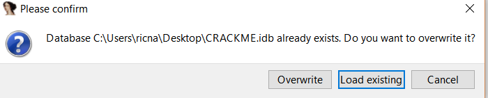

Мы не будем устанавливать режим **РУЧНАЯ ЗАГРУЗКА**, потому что не хотим соглашаться на все окна, которые появляются до тех пор, пока они все не загрузятся.

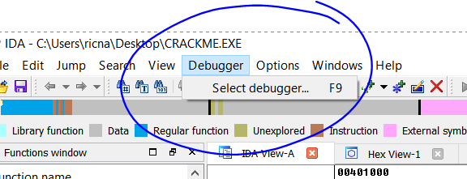

Очевидно, чтобы начать с самого начала между различными возможностями **ОТЛАДЧИКОВ**, мы будем выбирать для начала **LOCAL WIN32 DEBUGGER**, который будет служить отправной точкой, позже мы рассмотрим и другие отладчики.

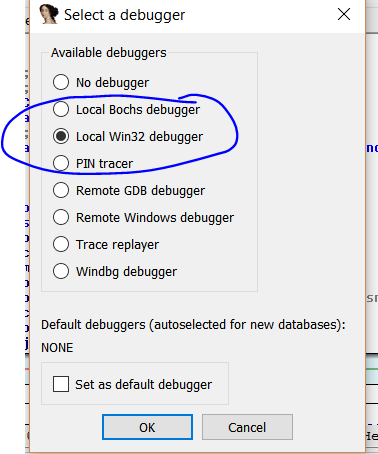

Мы увидим некоторые возможности **ОТЛАДЧИКА** включенного в **IDA**, который имеет свои особенности и если не научиться использовать его, так как он немного отличается от остальных отладчиков, то в дальнейшем Вам будет сложно.

Я думаю, что различия возникают, потому что **IDA** начинала свой жизненный путь просто как так называемый **ЗАГРУЗЧИК** или очень хороший статический дизассемблер и с большими возможностями интерактивности для реверсинга, затем в неё был добавлен **ОТЛАДЧИК**, который принёс свои проблемы, которые были решены, но способы работать с ним иногда немного отличается от других **ОТЛАДЧИКОВ**, таких как **OLLYDBG**.

В **DEBUGGERS → DEBUGGERS OPTIONS** у нас есть опции для **ОТЛАДЧИКА**.

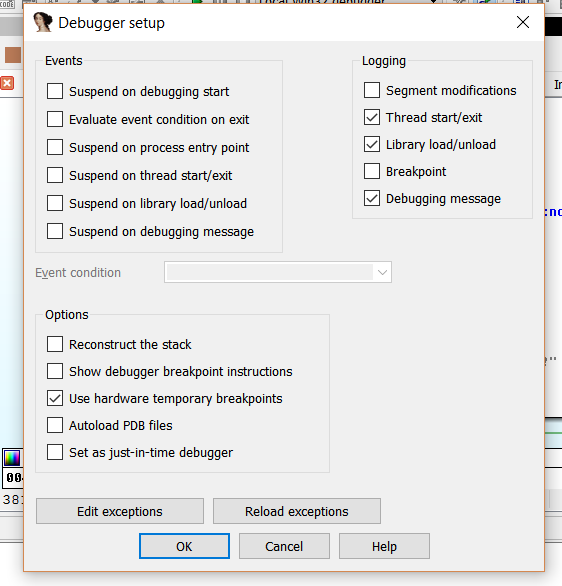

Мы будем устанавливать галочку **SUSPEND ON PROCESS ENTRY POINT** для того, чтобы останавливаться на точке входа.

Мы будем делать изменения в анализе, как мы это делали и раньше, мы будем **ПЕРЕКРАШИВАТЬ** и **ПЕРЕИМЕНОВЫВАТЬ** зоны условных переходов.

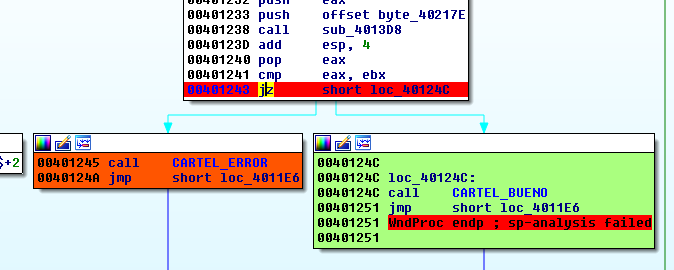

Здесь мы установим **BP** с помощью **F2** на переход, который принимает решение по адресу **0x401243** и мы идём к другому переходу, который мы пропатчили и также нажимаем **F2**.

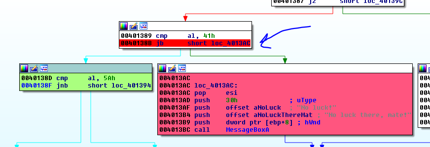

Сейчас мы можем запустить **ОТЛАДЧИК** с помощью **DEBUGGER → START PROCESS**.

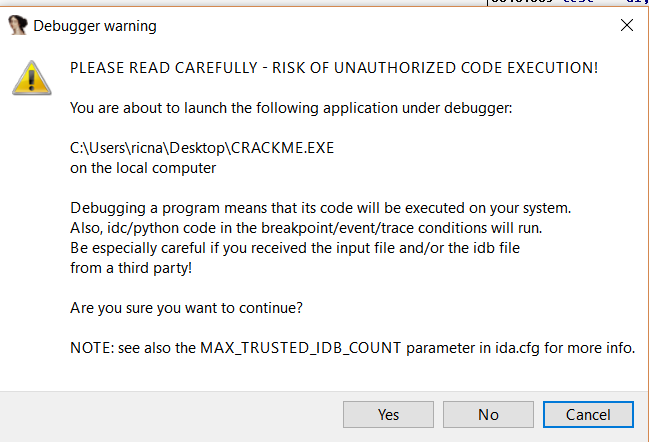

Это окно всегда будет появляться у нас, когда мы идём в **ОТЛАДЧИК**, чтобы отлаживать наш исполняемый файл на нашей локальной машине, так как пока мы анализируем его в **ЗАГРУЗЧИКЕ**, он никогда не выполнится на нашей машине, но сейчас если он будет выполняться в отладчике, нам всегда нужно быть осторожным выполняя такой файл, если это **ВИРУС** или что-то потенциально опасное, нужно использовать **УДАЛЕННЫЙ ОТЛАДЧИК** и выполнять его код в виртуальной машине, мы увидим это в своё время.

Поскольку изучение **КРЭКМИ CRUHEAD** более интересное занятие, чем лечение **ЛЕССИ**, мы нажимаем **YES**.

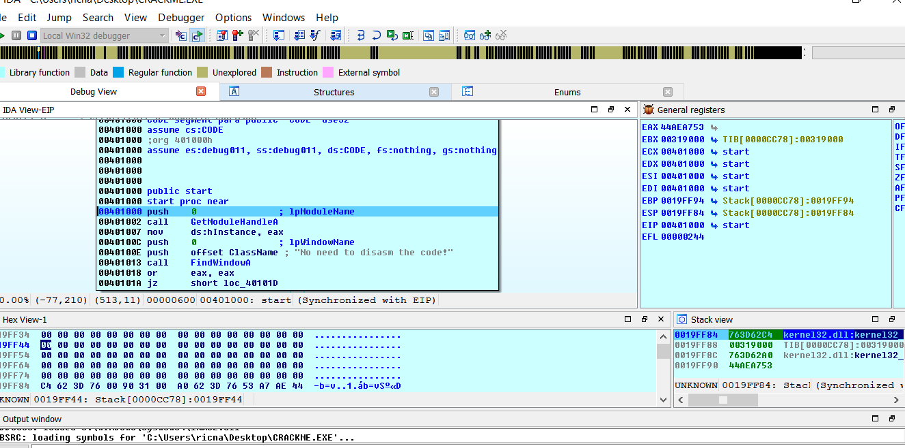

Выше мы попросили отладчик остановиться на **ТОЧКЕ ВХОДА**, так это и произойдёт, отладчик остановится по адресу **0x401000**, если я нажму пробел то перейдём в графический режим прям как в **ЗАГРУЗЧИКЕ**.

Небесный цвет фона блоков говорит мне, что я нахожусь в **ОТЛАДЧИКЕ**, в **ЗАГРУЗЧИКЕ** же блоки белые по умолчанию.

Я перемещаю окна, прежде всего уменьшая немного часть окна **OUTPUT WINDOW**, перетаскивая его за край вниз, расширяю немного стек, чтобы видеть регистры, которые находятся выше, и слева, и нужные нам флаги.

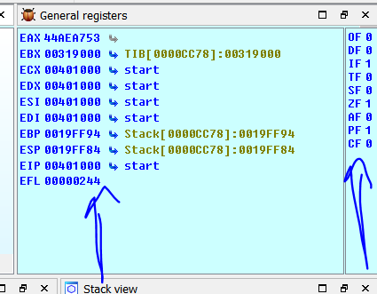

Здесь мы видим **РЕГИСТРЫ** и **ФЛАГИ**.

После того, как я добился для себя удобного вида, я буду сохранять его по умолчанию для ОТЛАДЧИКА через меню WINDOWS → SAVE DESKTOP выбирая галочку в DEFAULT, всегда, когда мы запускаем ОТЛАДЧИК он будет загружаться с теми настройками, которые мы сохранили и если мы хотим изменить их снова, мы можем сделать это без проблем.

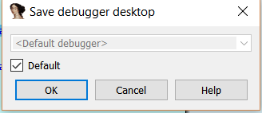

Под регистрами мы видим **СТЕК**.

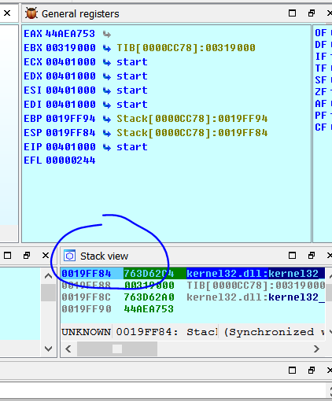

Также у нас есть дизассемблированный листинг инструкций - **IDA → VIEW EIP**, а ниже **HEX VIEW** или, что то же самое, что и **HEX DUMP** в **HEX** формате.

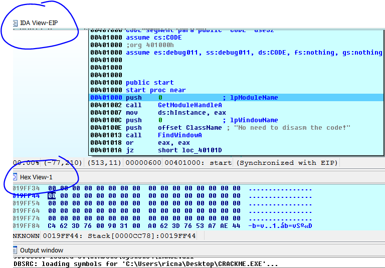

В нижней части дизассемблированного листинга мы видим:

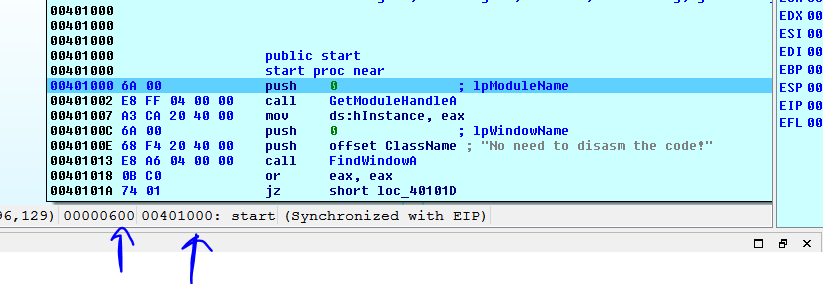

Мы всегда будем иметь адрес памяти и **ФАЙЛОВОЕ СМЕЩЕНИЕ**, или просто **СМЕЩЕНИЕ** в исполняемом файле, если мы откроем его в **HEX** редакторе, например таком как **HXD**, то увидим

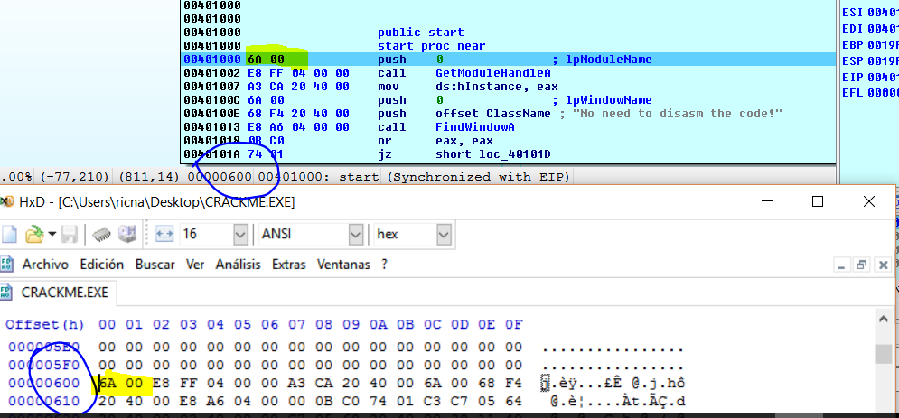

Мы видим, что в **ПО СМЕЩЕНИЮ 0x600** находятся те же самые байты.

Мы уже знаем, что **ПО УМОЛЧАНИЮ** в **ЗАГРУЗЧИКЕ** и **ОТЛАДЧИКЕ** горячая клавиша **G** сконфигурирована так, что при нажатии на неё происходит переход к адресу памяти, если я нажму **G** и введу **0x401389**.

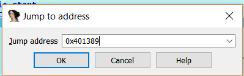

Я иду в область, где был **BP**, мы видим цвета, я делаю так, чтобы байты не были видны, чтобы не загрязнять наш внешний вид программы, и я вижу, что внешний вид стал таким как мы оставили его **ЗАГРУЗЧИКЕ**, если мы реверсим, изменяем имена и так далее, здесь в **ОТЛАДЧИКЕ** все изменения сохраняются, также изменения, которые мы сделали здесь появятся в **ЗАГРУЗЧИКЕ**, так как это модуль помеченный как те, которые загружаются в **ЗАГРУЗЧИК**.

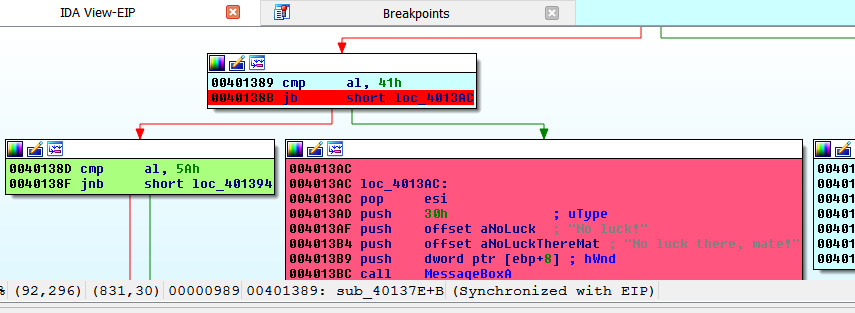

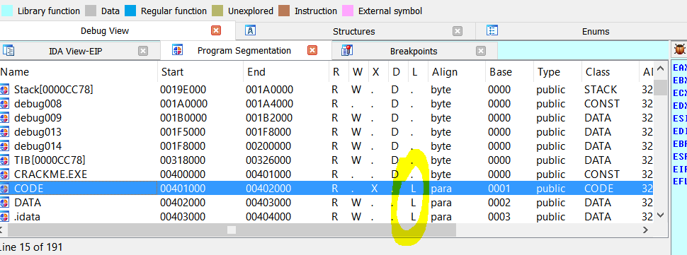

В **VIEW → OPEN SUBVIEW → SEGMENTS** мы видим сейчас три сегмента, которые загружает **ЗАГРУЗЧИК**, когда не активирован режим **РУЧНОЙ ЗАГРУЗКИ**, **КОД**, который загружается по адресу **0x401000**, **ДАННЫЕ \(DATA\)** и **ДАННЫЕ ИМПОРТА \(IDATA\)**, любые изменения, которые, мы сделаем с этими тремя сегментами, будут оставаться, так как они загружены в **ЗАГРУЗЧИК**, но изменения в других сегментах будут потеряны, потому что они являются модулями загруженными **ОТЛАДЧИКОМ** и они не будут сохранены в базу данных.

=&gt;

Одна из панелей, которую я всегда считаю очень полезной.

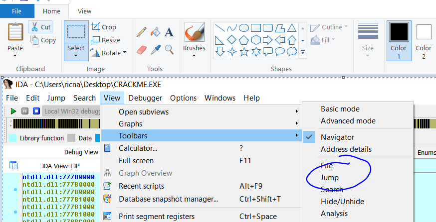

Я добавляю её и сохраняю снова с помощью **SAVE DESKTOP**, чтобы использовать её по умолчанию.

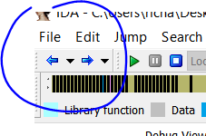

Возможность возвращаться назад в место, где Вы были раньше и вперед очень удобна.

Нажав стрелку назад, я возвращаюсь к точке входа, где я был раньше.

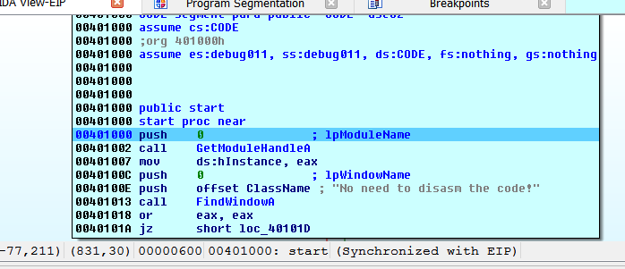

Также в меню **DEBUGGER**.

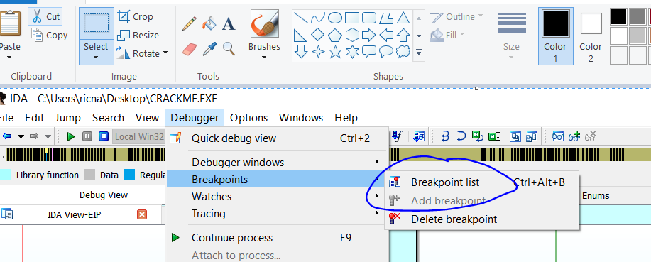

Я могу видеть список **BP** и идти туда, куда я хочу, кликнув на **BP** два раза.

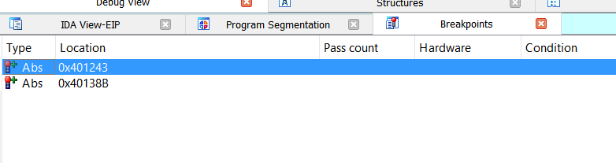

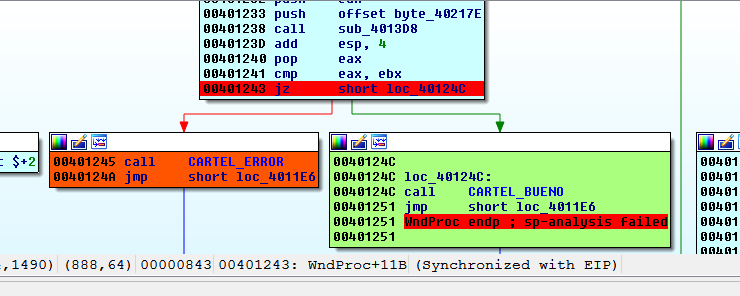

Так что я нахожусь сейчас на **EP** и у меня есть две установленных **BP**, так что я могу нажать клавишу **F9** для запуска программы.

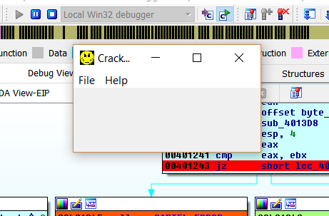

Мы идём в **HELP → REGISTER** и давайте введём ключ.

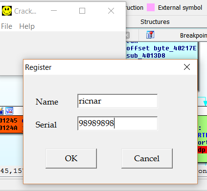

Нажимаем **OK**.

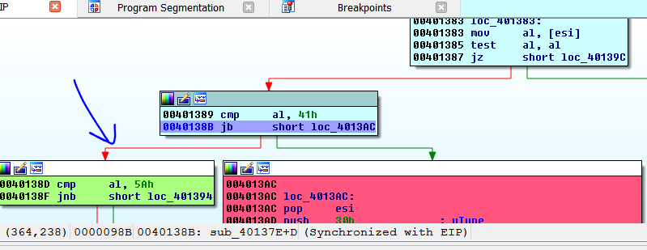

Стрелка с левой стороны где будет продолжено выполнение начинает мигать, мы видим, что регистр **EAX** равен **0x72**.

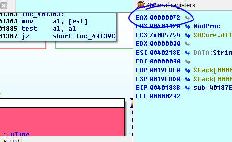

Если я наберу в панели **PYTHON CHR\(0x72\)**, я увижу, что это буква **r** слова **ricnar**.

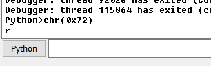

И она будет сравниваться с числом **0x41**, чтобы узнать ниже ли она.

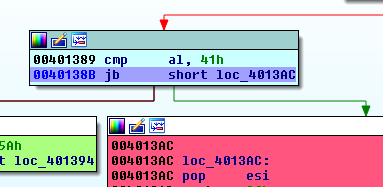

Мы можем также видеть с помощью функции **CHR\(0x41\)** в панели **PYTHON**, что это буква **A**.

Но мы также можем сделать это более легким методом, для этого нужно сделать правый щелчок на числе **41H** и в списке между настройками, которые мы можем выбрать для отображения и у меня появляется символ **A**.

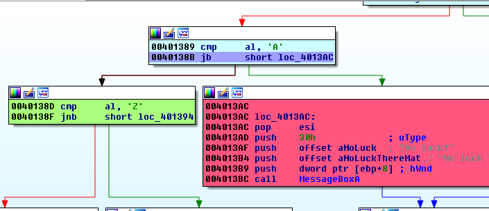

Мы видим, что сейчас идёт сравнение с символами от **A** и до **Z**, на данный момент мы не решим полностью этот крэкми, но мы видим, что **0x72** больше чем **0x41**, следовательно, **IDA** не перейдет в красный блок сообщения об ошибке. Очевидно **IDA** будет переходить в красный блок, если число будет ниже, но также его можно оценить просто увидев флаги.

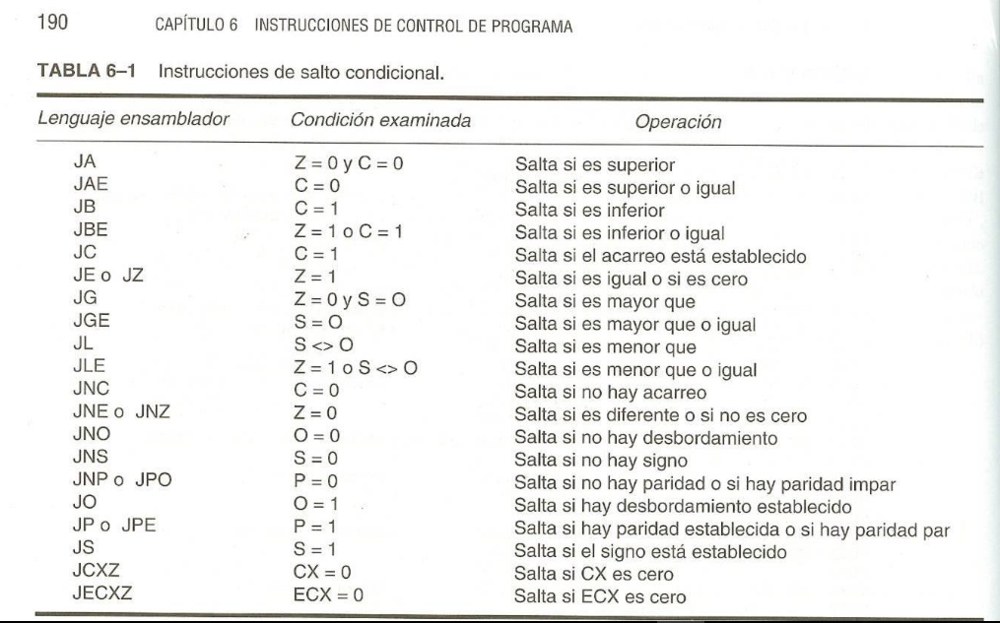

Здесь мы видим переход **JB**, который переходит или следует за зеленой стрелкой в **IDA**, если первое число ниже, но при этом также активируется флаг **C** \(также называемый как флаг **CF** или **C**\) , здесь он говорит, что переход будет осуществлен, если **C = 1**, если мы посмотрим в **IDA** на наши флаги.

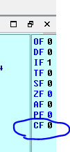

Флаг **C** = **0**, поэтому переход не будет сделан и произойдет переход к красной стрелке.

Каково сейчас математическое условие, при котором активируется **ФЛАГ CARRY**?

Флаг **CARRY** даёт нам информацию о том, что что-то пошло не так в операции сравнения между беззнаковыми целыми числами, если я делаю вычитание, так как **CMP** это вычитание без сохранения результата, т.е. **0x72 - 0x41**, то результат будет равен **0x31**, что есть положительное число и там нет проблем, однако если моё значение было бы **0x30**, например уменьшив его на **0x41**, он даст мне результат -**0x11**.

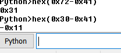

Это отрицательное значение и оно не принимается как результат операции с положительными числами, поэтому значение продолжает работать с ним в режиме **HEX**.

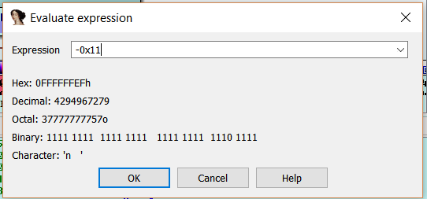

Оно будет равно числу **0xFFFFFFFEF** и считая его как положительное, это очень большое значение равное **4294967279** и \( in no way subtracting \) **0x30 – 0x41** равно отрицательному числу **0xFFFFFFEF**.

Как мы узнаем, учитывается знак в операции или нет?

Это зависит от вида инструкции перехода, в этом случае **JB** - это переход, который используется после **БЕЗЗНАКОВОГО** сравнения****, для операций с числами **СО ЗНАКОМИ** будет использоваться переход **JL**.

Если я сравниваю **0xFFFFFFFF** с числом **0x40** в беззнаковом переходе, очевидно, что оно больше, так как это максимальное положительное число, но если это переход, где учитываются знаки, это число будет равно **-1** и оно будет меньше значения **0x40**.

Чтобы оценить, является ли сравнением знаковым или нет, мы должны рассмотреть следующие условные переход.

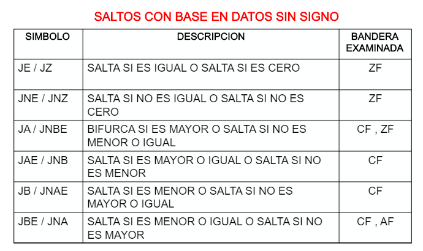

Если переход какой-либо из этой таблицы, он оценивается **БЕЗ ЗНАКА**, в то время как каждый из них имеет свой аналог как **JL** для **JB** в таблице переходов **СО ЗНАКОМ**.

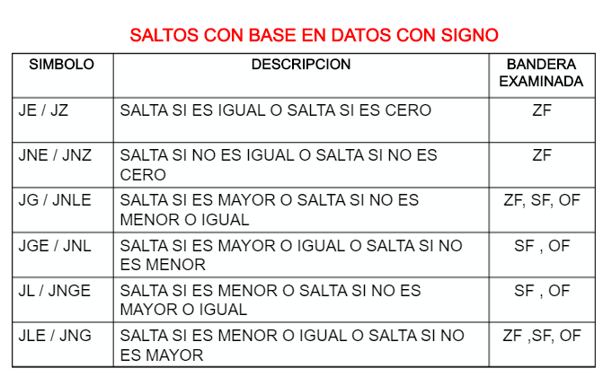

Мы видим, что **JE** оценивает равны ли числа в обеих таблицах, потому что в этом случае знак не имеет значения, если они равны, флаг **ZF** будет активирован и в него будет помещена единица.

Мы также видим, что **JG** означает переход, если число больше, **JG** в таблице со знаком имеет свой аналог - **JA**, который совершает переход если число выше в таблице **БЕЗ ЗНАКА**.

В ежедневном анализе мы видим слишком много флагов, видим переходы **JB** и знаем, что это сравнение между положительными числами или числами **БЕЗ ЗНАКА** и что если первое число меньше второго, то будет осуществлен переход, но хорошо то, что можно видеть, что находится ниже.

Если я продолжу останавливаться на всех **BP**, я буду видеть, что я нахожусь в цикле, который читает один за одним символы моего имени и сравнивает затем их с числом **0x41**, если есть символ ниже этого числа, то покажется сообщение об ошибке, так как я ввел только буквы \(**ricnar**\) у нас не будет этого случая, но давайте перезагрузим процесс с помощью **TERMINATE PROCESS** и запустим с помощью **START PROCESS** снова и сейчас введем имя **22ricnar**, а ключ **98989898**.

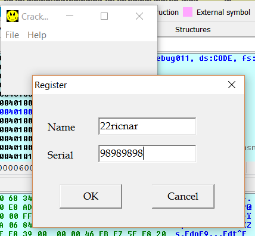

Нажмём **ОК** и остановимся на **BP**.

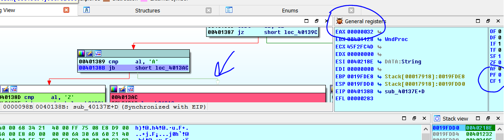

Мы видим, что сейчас мой первый символ равен **0x32**, что соответствует символу **2** слова **22ricnar**.

Я вижу, что **0x22** – меньше, чем **0x41**, зеленая стрелка активируется и это означает что переход будет выполнен и мы увидим, что флаг **C** – активирован, потому что **0x32** минус **0x41** - вычитание без учета знака, результат вычитания отрицательный и это - ошибка, которая активирует флаг **C**.

Если я сделаю правый щелчок на **ФЛАГЕ C**.

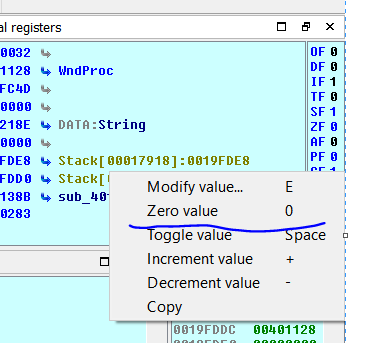

Мы можем установить его в ноль.

В этот самый момент, когда мы изменили переход, красная стрелка начинает мигать, потому что мы инвертировали переход.

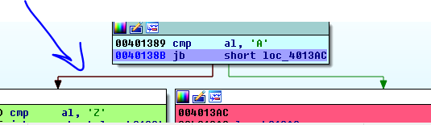

Если мы нажмём **RUN** отладчик снова остановится, когда сравнит следующие символ **2** из слова **22ricnar** и направится в мигающую зеленую стрелку, что приведет нас к сообщению об ошибке, мы инвертируем снова флаг **CF** помещая в него **0**.

В следующий раз он остановится в этом переходе, что соответствует буквам **ricnar**, которые больше чем **0x41** и которые не активируют флаг **CF** и они продолжают до красной стрелке.

После обмана проверки каждого символа моего имени мы переходим к финальному переходу.

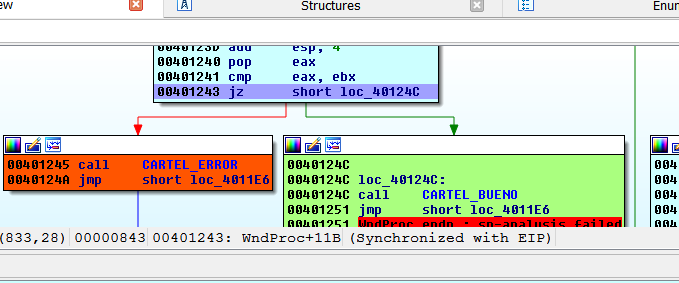

Здесь он сравнивает **EAX** и **EBX**, чтобы узнать равны ли они, но это не имеет значения, отладчик включил красную стрелку, потому что они разные и меня отправляют к сообщению об ошибке.

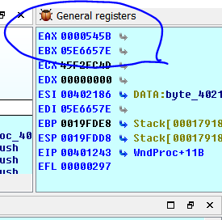

Здесь я вижу, что они не равны, и флаг **Z** неактивный.

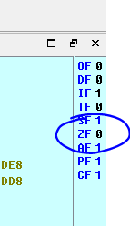

Если мы активируем его, он будет менять переход и идти на зеленую стрелку в сообщение **GOOD BOY**, делаем правый щелчок на флаге **ZF** и выбираем **INCREMENT VALUE**.

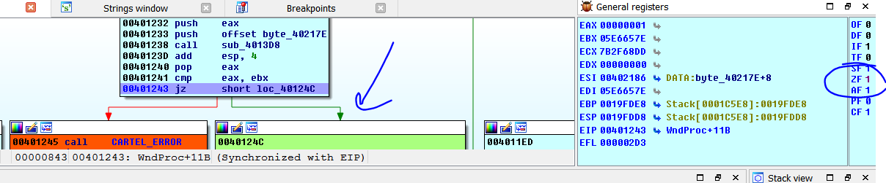

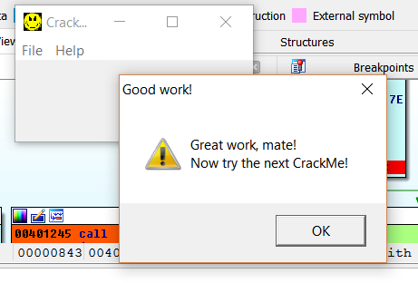

Мы сделали то же самое, что и когда мы пропатчили код, но не делая никаких изменений, а просто только меняя флаги в **ОТЛАДЧИКЕ**.

Каждый раз, когда мы не хотим инвертировать переходы напрямую, мы идём в хороший блок где мы хотим продолжать и помещаем там курсор и делаем правый клик, хотя в **IDA 6.8** присутствует **БАГ**, которая был устранён в версии **6.9**, который возникает при правый клике рушится **IDA** если это случится с вами, найдите ярлык который вам нужен по следующей ссылке:

[https://www.hex-rays.com/products/ida/support/freefiles/IDA\_Pro\_Shortcuts.pdf](https://www.hex-rays.com/products/ida/support/freefiles/IDA_Pro_Shortcuts.pdf)

А в самой **IDA** идём в **OPTIONS → SHORTCUTS**.

Если у нас есть проблемы, когда мы щелкаем правой кнопкой мыши, чтобы установить **EIP** поместите курсор туда, куда Вы хотите перейти, например **0x40124C** и нажмите сочетание **CTRL + N** что является командой **SET IP**.

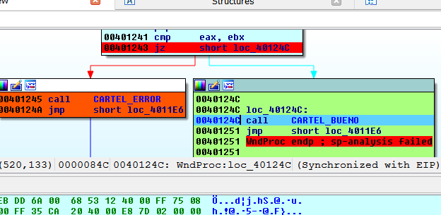

И программа будет продолжена с адреса **0x40124C**, что является тем же самым, что и инвертирование флага.

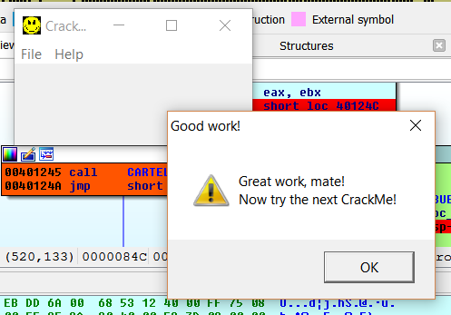

До встрече в **11**-й главе.

* * *

Автор оригинального текста — Рикардо Нарваха.

Перевод и адаптация на английский  язык — IvinsonCLS.

Перевод и адаптация на русский язык — Яша Яшечкин.

Перевод специально для форума системного и низкоуровневого программирования - WASM.IN

Источник:

[**http://ricardonarvaja.info/WEB/INTRODUCCION%20AL%20REVERSING%20CON%20IDA%20PRO%20DESDE%20CERO/10-INTRODUCCION%20AL%20REVERSING%20CON%20IDA%20PRO%20DESDE%20CERO%20PARTE%2010.7z**](http://ricardonarvaja.info/WEB/INTRODUCCION%20AL%20REVERSING%20CON%20IDA%20PRO%20DESDE%20CERO/10-INTRODUCCION%20AL%20REVERSING%20CON%20IDA%20PRO%20DESDE%20CERO%20PARTE%2010.7z)
