# Часть 13

Перед тем как продолжать с упражнениями углубляться в использование **IDA**, мы рассмотрим эту главу **№13** в расслабленном режиме\(**RELAX MODE WASM**\), чтобы изучить плагин, который достаточно удобный и который даёт нам возможность управлять лучше **PYTHON**, **Шадди** предложил использовать эту включенную, интересную панельку и я ему очень благодарен.

Плагин называется **IPYIDA** и он устанавливается простым копированием и вставкой следующей строки в панель **PYTHON**.

Код \(C++\):

1. import urllib2; exec urllib2.urlopen\('https://github.com/eset/ipyida/raw/stable/install\_from\_ida.py'\).read\(\)

Это одно-строчная команда, которую можно скопировать и вставить отсюда, если что-то пойдёт не так, то ссылка на неё находится ниже.

[https://github.com/eset/ipyida](https://github.com/eset/ipyida)

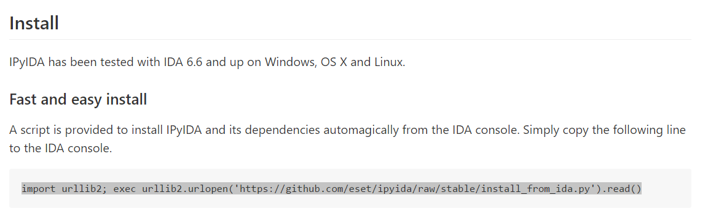

Плагин будет установлен автоматически через пару минут, не обращайте внимания на предупреждения о версии **PYTHON**, он будет работать в любом случае. \(В конце главы я собрал некоторые другие проблемы, которые возникали у меня при установке на другие машины, если кто-то имеет такие проблемы смотрите решение там.\)

После установки и запуска его из **EDIT → PLUGINS → IPYIDA** внизу мне покажется маленькое окно без нужного места для записи, но перетаскивая его, я могу сделать его как вкладку, чтобы получить больше места и стало работать более комфортно.

Хорошо будет прояснить, что, хотя у нас и есть **PYTHON** на нашей машине, установленный для **IDA**, то, если мы хотим много раз запускать нативный скрипт **PYTHONа**, мы должны делать это вне **IDA.**

Аналогично в **PYTHONе**, который включен в **IDA**, многие вещи работают так же как и снаружи, но некоторые нет, и про это хорошо упомянуть, что это может случится.

То есть, внутренний **PYTHON** **IDA** очень похож на **OLLYDBG** скрипт, чтобы можно было заскриптовать функциональность **IDA**, больше чем для нативных скриптов **PYTHONа**, которые запускаются в более совместимой форме вне **IDA**.

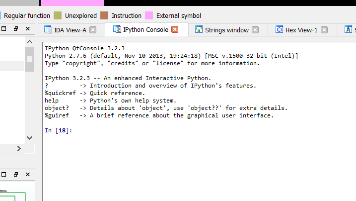

Очевидно он гораздо мощнее чем панелька **PYTHON**, если мы нажмём клавишу **?** то увидим быструю справку.

**IPython** - расширенный интерактивный **Python**
=========================================

IPython предлагает сочетание удобных функций оболочки, специальных команд и механизма истории для ввода \(история команд\) и вывода \(кэширование результатов, аналогично программе Mathematica\). Он предназначен для полностью совместимой замены стандартного интерпретатора Python, предлагая значительно улучшенные функциональные возможности и гибкость.

В вашей системной командной строке введите "ipython -h", чтобы увидеть доступные параметры командной строки. В этом документе описываются только интерактивные функции.

ОСНОВНЫЕ ХАРАКТЕРИСТИКИ
----------------------------------------

\* Доступ к стандартной справке Python. С версии Python 2.1, доступна справочная система с доступом к объекту docstrings и руководствам Python. Просто введите 'help' \(без кавычек\) чтобы получить доступ к справке.

\* Магические команды: просто введите %magic для получения информации по магической подсистеме.

\* Системные псевдонимы команд, доступны через команду %alias или файл\(ы\) конфигурации.

\* Информация о динамических объектах:

Введите ?word или word? печатающее подробную информацию об объекте. Если некоторые строчки в объекте слишком длинные \(docstrings, код и т.д.\), они становятся сокращенными в центре для краткости.

Ввод ??word или word?? дает доступ к полной информации, без сокращения длинных строк. Длинные строки отправляются на экран через экранный пейджер, если они длиннее чем экран, иначе печатается.

? / ?? система предоставляет доступ ко всему исходному коду для любого объекта \(если доступно\), показывает прототипы функций и другую полезную информацию.

Если вы просто хотите видеть docstring объекта, введите '%pdoc object' \(без кавычек и без %, если у вас включена опция automagic\).

\* Завершение в локальном пространстве имен, для этого введите TAB в командной строке.

В любой момент, нажатие на вкладку завершит любые доступные python команды или имена переменных и покажет вам список возможных завершений, если нет однозначностей. Он также будет заполнять имена файлов в текущем каталоге.

Для этой функции требуются модули readline и rlcomplete, иначе она не будет работать, если вашему Python не хватает поддержки readline \(например, в Windows\).

\* Поиск предыдущей истории команд двумя способами \(также требует чтения\):

- Начните вводить текст, а затем используйте Ctrl-p \(предыдущий, вверх\) и Ctrl-n \(далее, вниз\) для поиска только элементов истории, соответствующих тому, что вы набрали. Если вы используете Ctrl-p / Ctrl-n в пустой строке, они просто ведут себя как обычные клавиши со стрелками.

- Нажатие Ctrl-r: откроет запрос на поиск. Начните печатать, и система ищет вашу историю для строк, которые соответствуют тому, что вы набрали до сих пор, завершая как можно больше.

- % hist: история поиска по индексу \(это \* не \* требует readline\).

\* Постоянная история команд в сеансах.

\* Регистрация ввода с возможностью сохранения и восстановления рабочего сеанса.

\* Выход из системы с помощью !. Ввод !ls будет запускать 'ls' в текущем каталоге.

\* Команда reload выполняет 'глубокую' перезагрузку модуля: изменения, внесенные в модуль, поскольку вы импортировали, будут действительно доступны без выхода.

\* Режим verbose и цветные исключения трассировки. Смотрите функции magic xmod и xcolor для деталей \(просто введите %magic\).

\* Cистема кэширования для ввода:

IPython предлагает пронумерованные подсказки \(In / Out\) с кэшированием ввода и вывода. Все входные данные сохраняются и могут быть получены в виде переменных \(кроме обычного вызова клавиши со стрелкой\).

Следующие ГЛОБАЛЬНЫЕ переменные всегда существуют \(поэтому не перезаписывайте их!\):
\_i: хранит предыдущий ввод.
\_ii: следующий после предыдущего.
\_iii: следующий-следующий после предыдущего.

Кроме того, динамически создаются глобальные переменные с именем \_i&lt;n&gt; \(&lt;n&gt; - счетчик подсказок\), поэтому \_i&lt;n&gt; == \_ih\[&lt;n&gt;\]

Например, то, что вы набрали в строке 14, доступно как \_i14 и \_ih\[14\].

Вы можете создавать макросы, которые содержат несколько строк ввода из этой истории, для последующего повторного выполнения с помощью функции макроса %.

История функции %hist позволяет Вам видеть любую часть вашей истории ввода, печатая диапазон переменных \_i. Обратите внимание, что введенные данные, содержащие магические функции \(%\), отображаются в истории с добавленным комментарием. Это потому, что они не являются по-настоящему действительным кодом Python, поэтому Вы не можете их выполнить.

\* Выходная система кеширования:

Для вывода, возвращаемого из действий, существует система, аналогичная входному кешу, но использующая \_ вместо \_i. Кэшируются только действия, которые приводят к результату \(НЕ присваивания, например\). Если вы знакомы с Mathematica, переменные IPython ведут себя точно так же, как и переменные % Mathematica.

Следующие ГЛОБАЛЬНЫЕ переменные всегда существуют \(поэтому не перезаписывайте их!\):
\_ \(один знак подчеркивания\): хранит предыдущий вывод.
\_\_ \(два подчеркивания\): следующий после предыдущего.
\_\_\_ \(три подчеркивания\): следующий-следующий после предыдущего.

Глобальные переменные с именем \_&lt;n&gt; создаются динамически\(&lt;n&gt; является счетчиком подсказок\), так что результат вывода &lt;n&gt; всегда доступен как \_ &lt;n&gt;.

Наконец, глобальный словарь с именем \_oh существует с записями для всех строк, которые генерируют вывод.

\* История каталогов:

Ваша история посещенных каталогов хранится в глобальном списке \_dh, и команда magic% cd может использоваться для перехода к любой записи в этом списке.

\* Автоматические скобки и кавычки \(адаптированные из LazyPython от Nathan Grey\)

1. Автоматические скобки
Вызываемые объекты \(т.е. Функции, методы и т.д.\) могут быть вызваны так \(обратите внимание на запятые между аргументами\) ::
В \[1\]: callable\_ob arg1, arg2, arg3 и ввод будет переведен в это::
callable\_ob\(arg1, arg2, arg3\)
Эта функция отключена по умолчанию \(в редких случаях она может создавать нежелательные побочные эффекты\), но вы можете активировать ее в командной строке, запустив IPython с помощью \`--autocall 1\`, установить её навсегда в своем файле конфигурации или включить во время выполнения с \`% autocall 1\`.

Вы можете принудительно скопировать скобки, используя "/" в качестве первого символа строки.
В \[1\]: /globals \# получится 'globals\(\)'
Обратите внимание, что знак '/' ДОЛЖЕН быть первым символом в строке! Это не сработает ::
В \[2\]: print /globals \# синтаксическая ошибка

В большинстве случаев автоматический алгоритм должен работать, поэтому вам редко нужно явно вызывать /. Одним из примечательных исключений является то, что вы пытаетесь вызвать функцию со списком кортежей в качестве аргументов \(скобки будут путать IPython\) ::
В \[1\]: zip \(1,2,3\),\(4,5,6\) \# не будет работать
но это будет работать::
В \[2\]: /zip \(1,2,3\),\(4,5,6\)
------&gt; zip \(\(1,2,3\),\(4,5,6\)\)
Out\[2\]= \[\(1, 4\), \(2, 5\), \(3, 6\)\]

IPython сообщает вам, что он изменил вашу командную строку, показывая новую командную строку, которой предшествует -&gt;. например. ::
В \[18\]: callable list
-------&gt; callable \(list\)

2. Авто-Цитирование
Вы можете заставить авто-цитировать аргументы функции, используя "," в качестве первого символа строки. Например::
В \[1\]: ,my\_function /home/me \# получится my\_function\("/home/me"\)

Если вы используете ';' вместо этого весь аргумент цитируется как одна строка \(в то время как "," разбивается на пробелы\) ::
В \[2\]: ,my\_function a b c \# получится my\_function\("a","b","c"\)
В \[3\]: ;my\_function a b c \# получится my\_function\("a b c"\)

Обратите внимание, что ',' ДОЛЖЕН быть первым символом в строке линии! Это не будет работать ::
В \[4\]: x = ,my\_function /home/me \# syntax error

\_\_\_\_\_\_\_\_\_\_\_\_\_\_\_\_\_\_\_\_\_\_\_\_\_\_\_\_\_\_\_\_\_\_\_\_\_\_\_\_\_\_\_\_\_\_\_\_\_\_\_\_\_\_\_\_\_\_\_\_\_\_\_\_\_\_\_\_\_
Хорошо, очевидно у него есть много возможностей, я удаляю то, что он показывал нам недавно с помощью **ESC**.

Опция автозавершения с помощью клавиши **TAB**, которая не имеет панели включенной в **PYTHON**, очень ценна и мы должны её за это благодарить.

Мы видим, что если я введу **IMP** и нажму **TAB** он автозавершит моё слово **IMPORT** и если я нажму **TAB** снова.

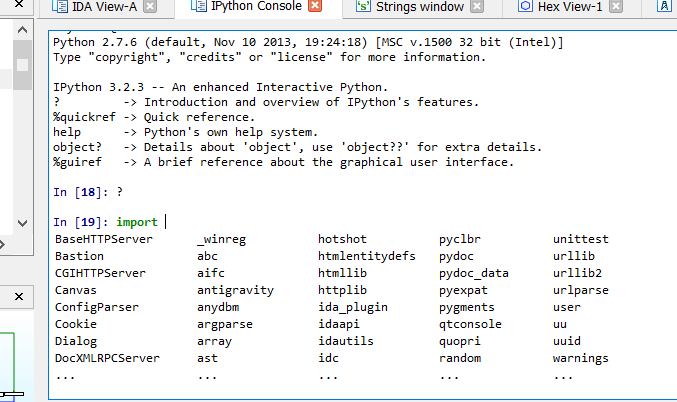

Я вижу возможности команды **IMPORT**, где я могу перемещаться вверх и вниз с помощью стрелок и я выхожу отсюда с помощью клавиши **ESC**.

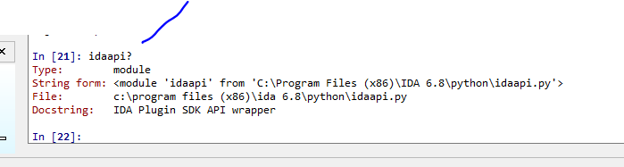

Поместив знак вопроса один раз, программа даст мне быструю справку, а если я введу его два раза, она покажет мне код, эта операция длится немного дольше.

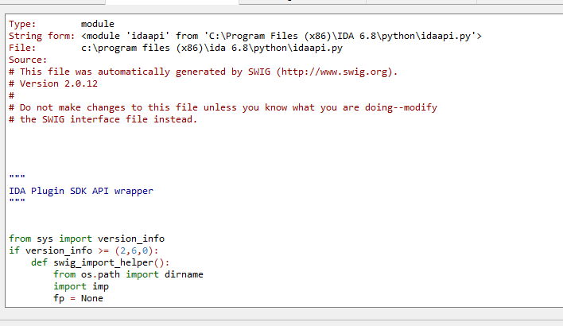

Когда я выхожу с помощью **ESC**, то возвращаюсь туда где я был раньше.

Также с помощью стрелок вверх и вниз я могу вернуть предыдущие команды, которые я использовал.

**%hist** показывает историю команд, которые я использовал.

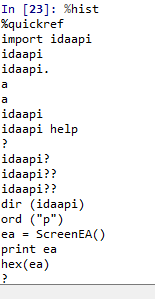

**%edit** открывает блокнот.

И **%edit x-y** открывает блокнот на строчках в этом промежутке.

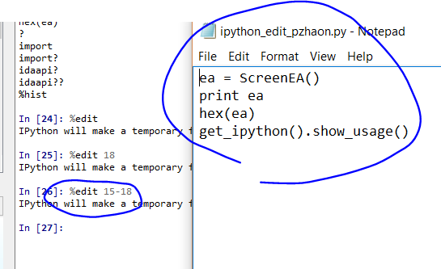

**%history** **-n** добавляет номера строк, чтобы хорошо знать, если нам нужно открыть диапазон, чтобы создать скрипт с помощью редактирования.

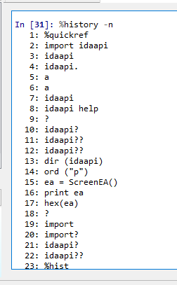

Очевидно **IPYTHON** достаточно мощный и у него есть тысячи команд, которые могут быть завершены здесь.

[http://ipython.org/ipython-doc/3/index.html](http://ipython.org/ipython-doc/3/index.html)

Мы будем делать пару простых примеров с использованием **API** включенного в **IDAPYTHON** используя этот новый плагин.

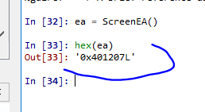

Текущий адрес курсора.

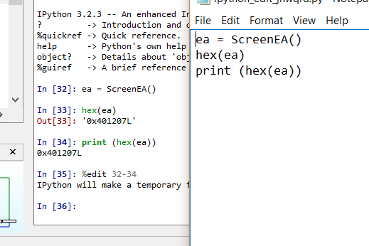

Если я сделаю скрипт и сохраню его.

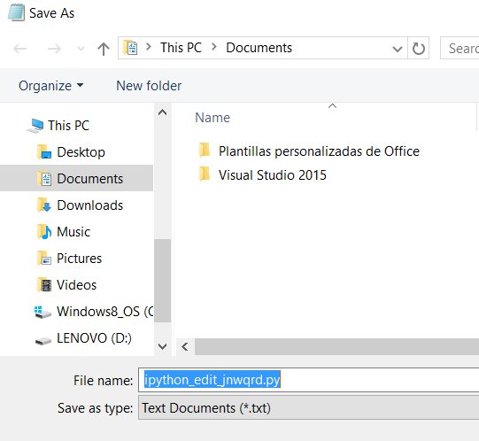

Если мы выполним скрипт через меню **IDA**, **FILE → SCRIPT** **FILE** он будет работать.

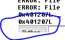

Также команда **idc.GetDisasm\(ea\)** будут давать нам инструкции где помещен курсор.

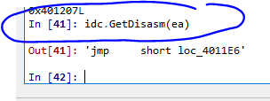

Если я изменю курсор на другую инструкцию, я буду должен ввести снова **EA**.

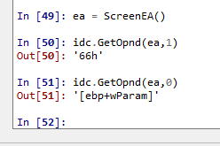

С помощью **idc.GetOpnd** я могу получить первый или второй операнд инструкции.

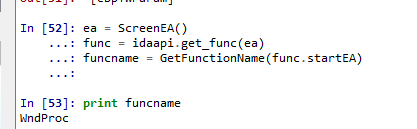

Имя текущей функции.

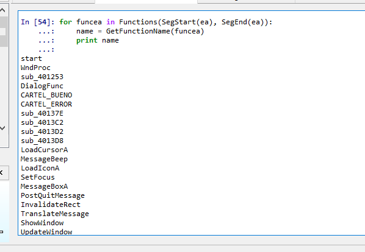

Имена всех функций сегмента.

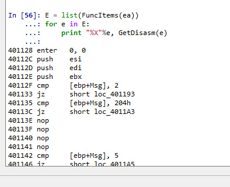

Инструкции функций.

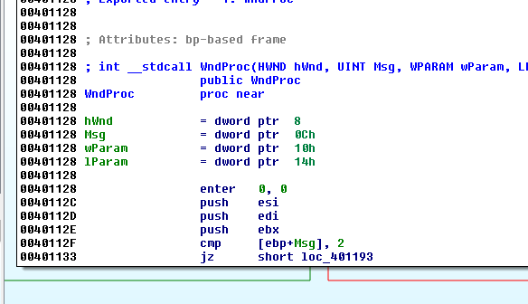

Ссылки на функцию, если мы установим курсор в начале функции, которая имела ссылки и мы найдём снова **EA**.

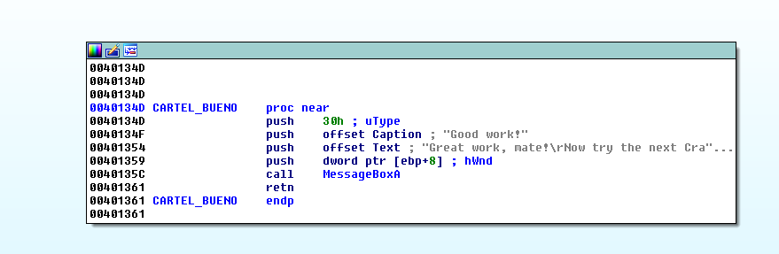

Я вижу ссылку.

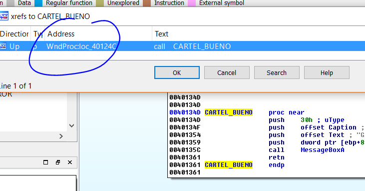

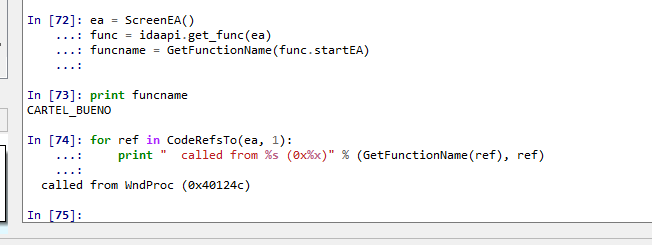

Плагин даёт нам много удобства и **IDAPYTHON** имеет тысячи инструкций, которые служат для установки **BP**, логирования, запуска отладчика и т.д.

Хорошо, пора немного отдохнуть, увидимся в **14-той** главе.

**ПРОБЛЕМЫ УСТАНОВКИ**
Обычно существуют проблемы установки, если у нас уже есть установленный до этого момента **pip** в **PYTHON**, это можно легко проверить в **IDA** набрав перед установкой в панели **PYTHON**.

**import pip**

Если он не вернет ошибку, это значит, что у Вас уже есть установленный **pip** и не получится установить его ещё раз, что нужно тогда сделать для установки - это открыть консоль **Windows** и ввести.

**python -m pip uninstall pip setuptools**

и перезапустите **IDA**, это поможет установить плагин правильно.

Если после перезапуска **IDA** плагин не запускается, он долен быть загружен со страницы и скопирован вручную **ipyida\_plugin\_stub.py** в папку плагинов **IDA**.

[https://github.com/eset/ipyida](https://github.com/eset/ipyida)

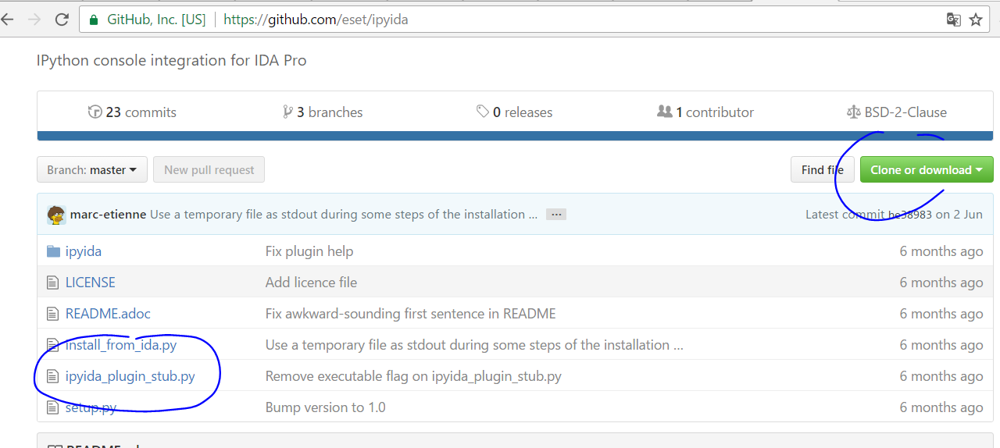

====================================================================
При установке может появиться такая ошибка:

**urllib2.URLError: &lt;urlopen error \[SSL: CERTIFICATE\_VERIFY\_FAILED\] certificate verify failed \(\_ssl.c:661\)&gt;**

Она устраняется, изменением скриптв на такой:

**import urllib2; import ssl; ssl.\_create\_default\_https\_context = ssl.\_create\_unverified\_context; exec urllib2.urlopen\('**[**https://github.com/eset/ipyida/raw/stable/install\_from\_ida.py'\).read**](https://github.com/eset/ipyida/raw/stable/install_from_ida.py'%29.read)**\(\)**

Решение любезно предоставил ВАСМовчанин - [loonydev](https://wasm.in/members/loonydev.22857/)
