# Часть 14

Это курс будет смешанным, и он будет включать в себя разные темы связанные с реверсингом \(мы уже говорили о статическом реверсинге, а также будем говорить об отладке, распаковке, эксплоитинге\).

В этой главе мы будем распаковывать файл **CRACKME.EXE** упакованный последним **UPX**. Это не означает, что мы собираемся посвятить много глав только распаковке, мы будем менять темы разговора, и перемешивать различные темы, для того, чтобы никто не скучал, так что у нас будут уроки по распаковке, смешанные с другими темами.

## Упакованные файлы

Определение упакованного файла - это файл, который скрывает исполняемый код программы, сохраняя этот код с помощью какого-либо типа сжатия или шифрования, для того, чтобы его не смогли быстро отреверсить, он также добавляет **СТАБ** или секцию, откуда он запускается, который во время исполнения запускает упакованный код, распаковывает его в память в какую-либо другую секцию или в туже самую, для того, чтобы была возможность его выполнить и затем переходит туда.

Существует тысяча видов упаковщиков и большинство из них являются протекторами, которые изменяют **IAT** или таблицу импорта, а также изменяют **ЗАГОЛОВОК**, они добавляют анти-отладочный код, чтобы предотвратить распаковку и восстановление исходного файла.

Самый простой случай упаковщика - это **UPX**, который не имеет анти-отладочных трюков, никаких грязных штучек, но поможет нам начать обучение, как всегда с самого простого, к туториалу будет приложен файл **PACKED\_CRACKME.EXE**.

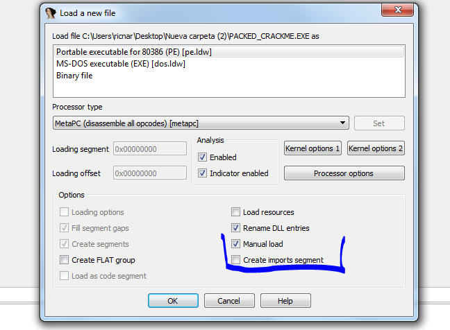

Мы отмечаем **MANUAL LOAD** и снимаем с пункта **CREATE IMPORTS SEGMENT** так как нам необходимо, чтобы у нас были загружены все секции программы, и если она может влиять на опцию  **CREATE IMPORTS SEGMENTS**, то я про это не знаю, но **IDA** советует снять эту галочку при работе с упакованными файлами.

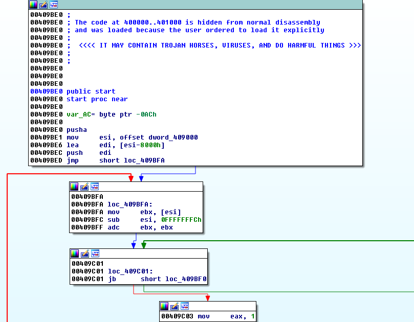

Это начало или **EP** файла **PACKED\_CRACKME.EXE**, мы видим, что она находится по адресу **0x409BE0**, в то время как оригинальная **EP** находилась по адресу **0x401000**, как мы видим ниже.

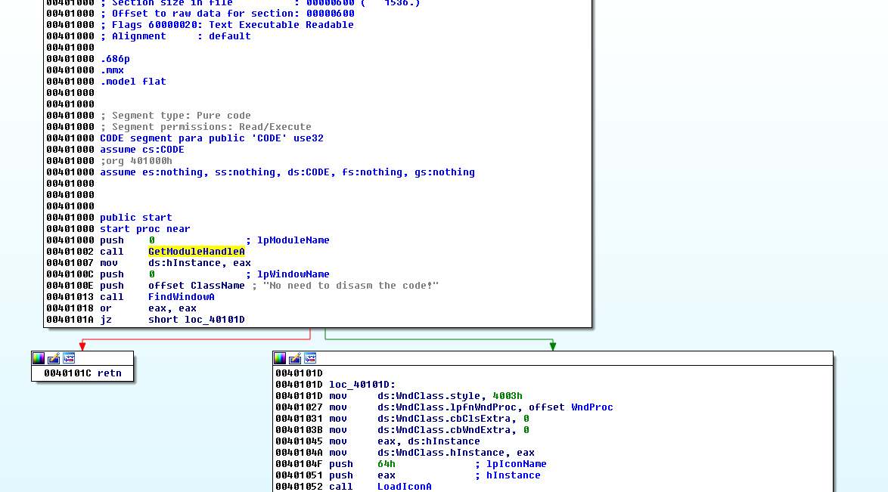

Также сравнивая сегменты обоих файлов, мы видим, что упаковщик после заголовка имеет сегмент под названием **UPX0**, у которого размер в памяти больше, чем у сегмента в исходной программе.

**OРИГИНАЛЬНЫЙ**

**УПАКОВАННЫЙ**

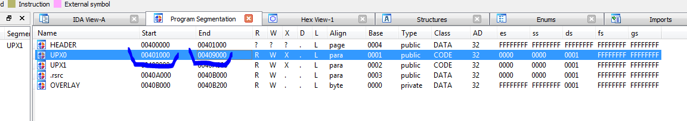

Мы видим, что секция **UPX0** упаковщика заканчивается по адресу **0x409000**, в то время как в исходном файле все секции расположены в памяти начиная с адреса **0x401000** и заканчиваются по адресу **0x408200**.

Здесь мы начинаем говорить о виртуальной памяти, т.е. когда программа запускается, она может иметь **1 килобайт** на жестком диске, а резервировать **20 килобайт** или сколько она пожелает в памяти.

Это возможно видеть в **IDA**, например, по адресу начала секции исходного файла **0x401000** мы видим.

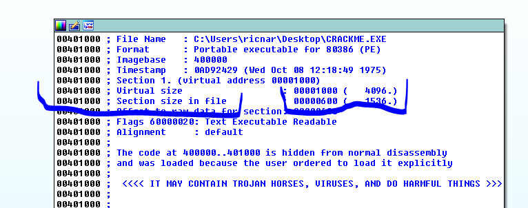

Вышеупомянутая секция \(**SECTION SIZE IN FILE**\) занимает **0x600** байт в файле, в то время как в памяти \(**VIRTUAL SIZE**\) она занимает **0x1000** байт.

В то время, как у упакованного файла, если мы идём по адресу **0x401000**, который является началом секции **UPX0**, мы видим.

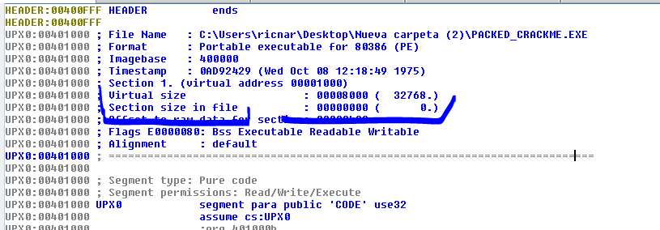

Мы видим, что есть одна секция размером **0** байтов на диске, но в памяти она будет занимать **0x8000** байт, т. е. это означает, что резервируется пустое пространство, для создания здесь исходного кода программы и затем программа переходит туда, чтобы выполнить этот код, так как есть достаточно пространства, чтобы сделать это.

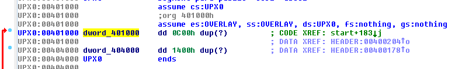

Также мы видим, что адрес **0x401000** имеет впереди префикс **DWORD\_**, который означает, что его содержимым является данные типа **DWORD**.

Знак \(**?**\) означает, что место только зарезервировано, т.е. оно не имеет содержимого и **DUP** или умножитель, означает, что этот **DWORD** умножается на **0xC00** и в итоге получится **0x3000**зарезервированных байт.

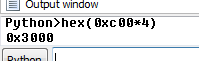

Затем по адресу **0x404000** есть **0x1400 DWORD** символов \(**?**\), это место тоже зарезервировано.

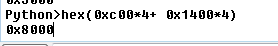

То есть, в памяти резервируется **0x8000** байт, чтобы загрузить туда программу.

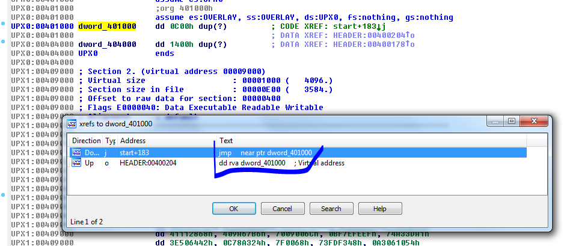

Также мы видим, что по адресу **0x401000** есть ссылка на исполняемый код, позже мы увидим, что это он и что он делает.

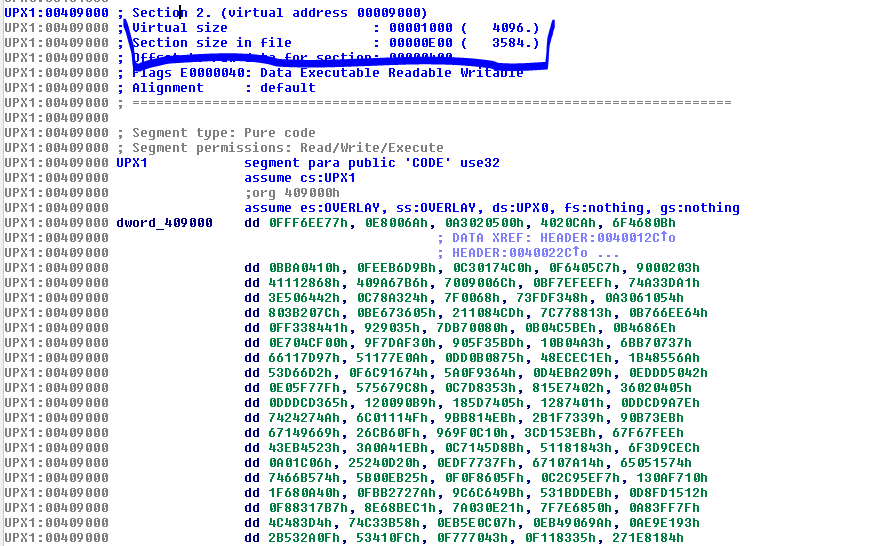

Также упакованный файл имеет вторую секцию, размер которой, на диске равен **0xE00** байт, а в памяти **0x1000** байт и в которой, возможно, будет первоначальная программа, сохраненная с помощью некоторого метода простого шифрования, для того, чтобы не было возможности видеть первичный код.

Если мы видим ссылки по адресу начала секции **0x409000**.

Мы видим, что ниже \(**DOWN**\) есть ссылка в исполняемой части, если мы щелкнем на неё.

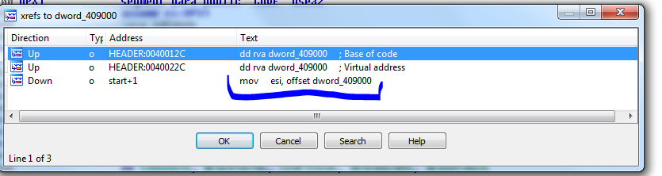

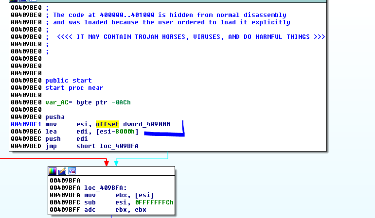

Мы видим, что в **СТАБЕ** после **EP** загружается адрес **0x409000** \(запомните **СМЕЩЕНИЕ** впереди\).

**Если мы нажмём на пробел, мы увидим там**

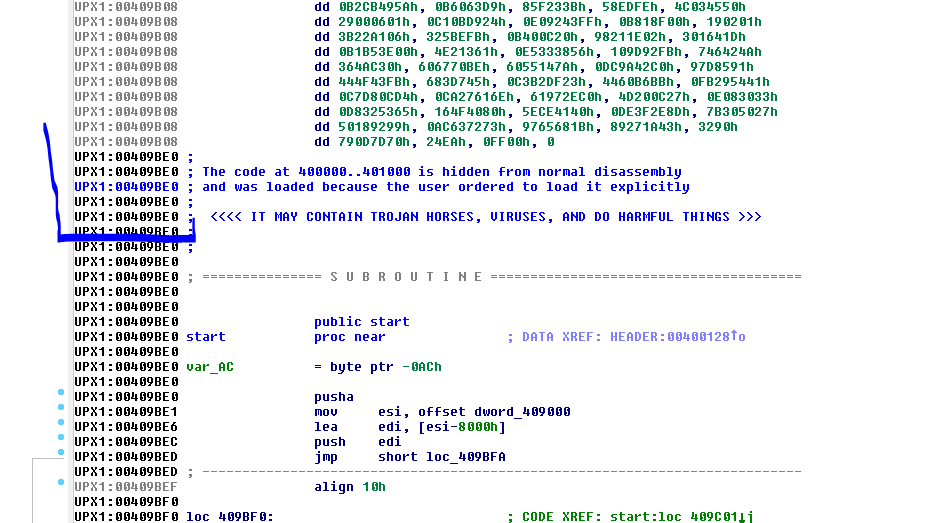

Что код **СТАБА** находится в той же секции **UPX1** под упакованным кодом исходной программы, в секции **UPX1** у нас есть сохраненные байты исходной зашифрованной программы и код **СТАБА**находящийся по адресу **0x409BE0**.

Нам не нужно быть гением, чтобы знать, что он будет читать байты по адресу начиная с адреса **0x409000**, он применит некоторые операции над ними и сохранит их по адресу **0x401000**. **EDI = ESI - 0x8000**.

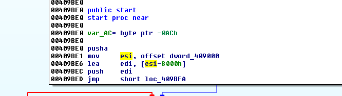

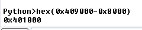

Другими словами, видно, что он будет использовать содержимое **ESI** как **ИСТОЧНИК** откуда он будет читать данные, он будет применять к ним некоторые операции и сохранять их в содержимое **EDI**, для создания программы.

Ранее мы сказали, что по адресу **0x401000** есть ссылка на исполняемый код, если мы сделаем двойной щелчок по этой ссылке.

Мы видим, что есть переход в **0x401000**.

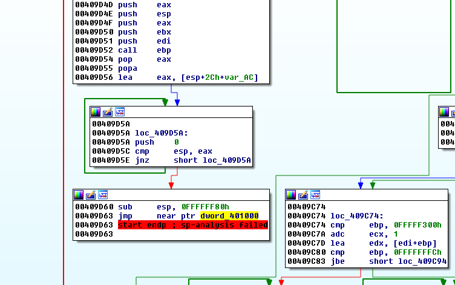

**JMP NEAR** это прямой переход по адресу, который находится рядом с ним, т.е. он будет переходить по адресу **0x401000**, очевидно, здесь, позже, выполнится весь **СТАБ** и создастся исходный код, он будет переходить в **OEP** по адресу **0x401000**, что будет **OEP**, которая отличается от **EP СТАБА** тем, что находится по адресу **0x00409BE0**.

Мы будем вызывать **OEP** или **ORIGINAL ENTRY POINT** в **ENTRY POINT** исходной программы, очевидно, так как это упакованная программа, то мы не знаем где она находится и только поскольку мы у нас есть исходная программа, мы можем знать, что **OEP** была по адресу **0x401000**.

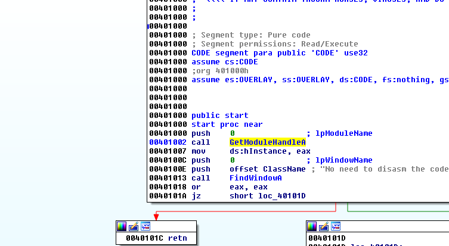

Очевидно, когда у нас есть упакованная программа, то мы не знаем её **OEP**, потому что мы не имеем исходной программы, поэтому нам нужно научиться её находить, следовательно, когда **СТАБ**закончит выполнять все свои трюки и закончит создавать исходный код, он будет переходить туда для выполнения программы, почти всегда первая инструкция кода, которую он выполняет в созданной секции, будет **OEP**.

Мы могли бы установить **BP** в этот **JMP** на **OEP**, чтобы увидеть есть ли там оригинальная программа, которая уже создана, давайте попробуем.

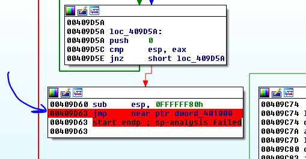

Давайте выберем отладчик **LOCAL WIN32 DEBUGGER** и давайте нажмём **START DEBUGGER**.

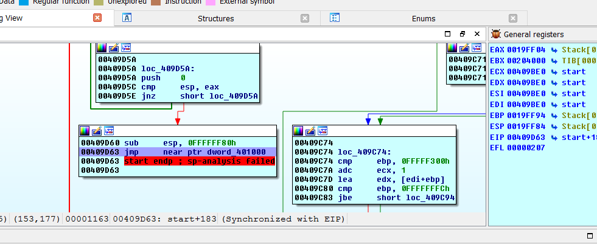

Здесь я останавливаюсь на переходе в **OEP**, мы трассируем его с помощью **F8**.

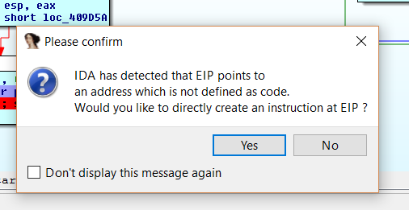

Мы нажимаем **YES** для того, чтобы отладчик интерпретировал как **КОД** первую секцию **UPX0**, которая была определена как **ДАННЫЕ**.

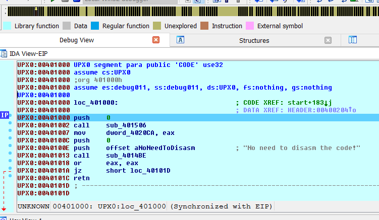

Мы видим, что отладчик уже распаковал код и теперь переходим туда, чтобы выполнить его. Код очень похож на код оригинальной программы по адресу **0x401000**, хотя, мы видим, что если мы захотим перейти в графический режим, у нас ничего не получится, потому что код не определен как функция \(**loc\_401000**\), но мы сделаем это автоматически.

Здесь есть скрытое меню в левом нижнем углу, делая правый щелчок, я выбираю **REANALYZE PROGRAM**.

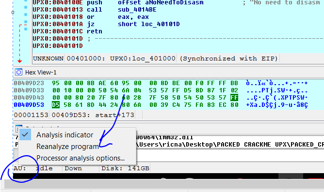

Мы видим, что кликнув по адресу **loc\_401000** отладчик меняет на тэг на **sub\_401000**, который показывает, что сейчас это функция, так что теперь мы можем переключить его в графический режим с помощью пробела.

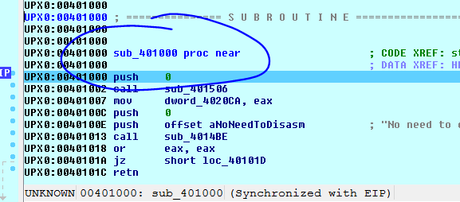

Сейчас это выглядит намного лучше.

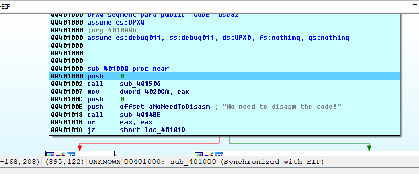

Различие, которое мы видим состоит в том, что оригинальный файл показывает по адресу **0x401002** вызов **CALL GetModuleHandleA**, в то время как запакованный показывает **CALL sub\_401056**, давайте посмотрим, что есть внутри этого **CALL**.

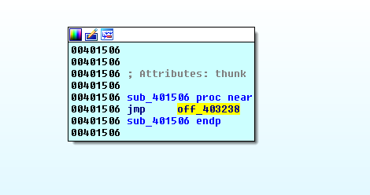

Давайте посмотрим различия с исходным файлом, если мы войдём в **CALL GetModuleHandleA** в исходном файле.

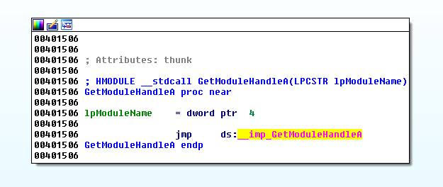

Также существует косвенный переход, но здесь, **IDA** обнаруживает, что это переход к **API**, а в упакованном такого нет, но где тогда переход в упакованном файлe?

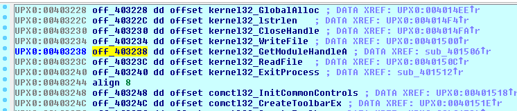

Содержимым по адресу **0x403028** является смещение\(**OFF\_\)**, т. е. адрес **API** функции **GetModuleHandleA** и в исходной программе это тот же самый адрес в секции **IDATA** и он содержит также адрес той же самой **API**.

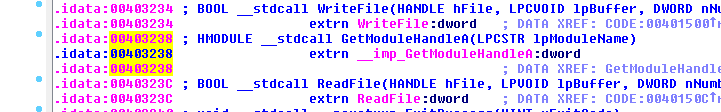

Несмотря на то, что они в конечном итоге переходят в одно и то же место, существует одна очень важная разница, которую мы увидим позже.

У меня есть код распакованной программы, хотя он ещё пока не является функциональным и если мне нужно просто проанализировать статически код программы, который создан в первой секции, я делаю следующее.

Сначала в **СЕГМЕНТАХ**

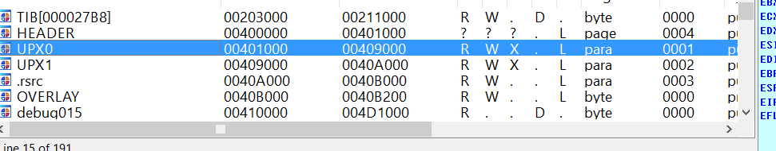

Я проверяю, что все секции упаковщика имеют букву **L**, что означает, что они будут загружены в **ЗАГРУЗЧИК**, как мы видим в образе, я могу даже добавить какую-либо **DLL** или сегмент, который я хочу, чтобы он был в в статическом анализе, для этого делаем **ПРАВЫЙ ЩЕЛЧОК → EDIT SEGMENT** на строке, которую мы хотим добавить в **ЗАГРУЗЧИК**.

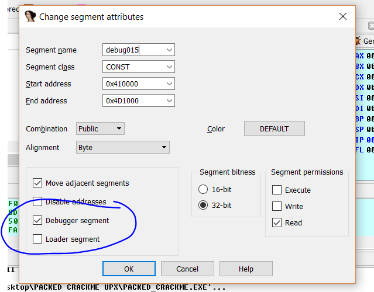

На сегментах, которые мы хотим, чтобы они добавились, мы ставим галочку в **LOADER SEGMENT**, в этом случае мы оставим только сегменты **УПАКОВЩИКА**, но про это хорошо знать, что мы можем добавить и другие.

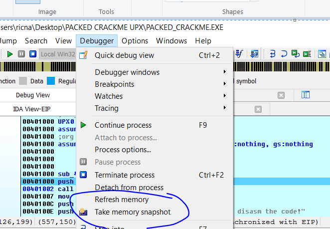

Затем опция **TAKE MEMORY SNAPSHOT** будет сохранять сегменты, которые мы пометили как **ЗАГРУЖАЕМЫМИ** как код, который они имеют. \(**НЕ ПУТАЙТЕ ЭТО С ДРУГОЙ ОПЦИЕЙ FILE → TAKE DATABASE SNAPSHOT**, которую мы изучали ранее\)

Мы видим, что если я останавливаю **ОТЛАДЧИК**, и конечно я остаюсь в **ЗАГРУЗЧИКЕ**, и я иду по адресу **0x401000** вместо того, чтобы быть пустым как раньше, сейчас появляется код, который мы скопировали, когда мы были в **OEP** и который сейчас доступен для того, чтобы сделать статический реверсинг как и все сегменты, которые имеют букву **L**, конечно, если мы снова запустим **ОТЛАДЧИК**, код исчезнет, потому что он будет перезаписываться байтами, которые будут там, когда секция инициализируется в **ОТЛАДЧИКЕ**, поэтому, если нам нужна база данных со статическим анализом, мы должны скопировать ее в другую папку и открыть ее в другой копии **IDA** для комфортной работы.

Если я запущу снова отладчик и остановлюсь в той же **EP** до выполнения **СТАБА**, я увижу, что область по адресу **0x401000** снова пустая.

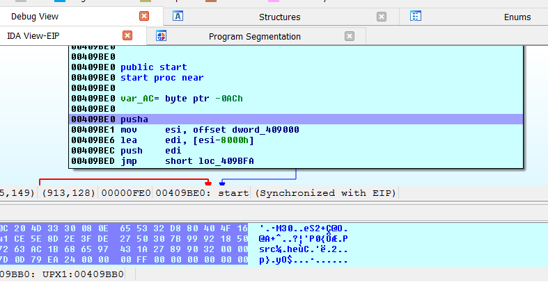

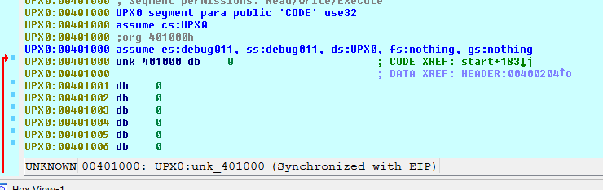

То, что мы сохранили в базе данных теперь потеряно, потому что в **ОТЛАДЧИКЕ** информация **ЗАГРУЗЧИКА** была перезаписана байтами, которые инициализировала секция **UPX0**, поэтому, если это информация необходима для статического реверсинга, как я уже говорил ранее, после нажатия **TAKE MEMORY SNAPSHOT** её нужно скопировать в другой каталог, перед тем как снова запускать отладчик.

Поскольку, я очень надоедливый\(Это **Рикардо** про себя  \), то я буду искать второй способ получит **OEP**, который ищет первую инструкцию, которая выполняется в первой секции, это другой метод, который иногда может работать.

Я запускаю снова **УПАКОВАННЫЙ ФАЙЛ** в **ОТЛАДЧИКЕ**, останавливаюсь в его **EP**.

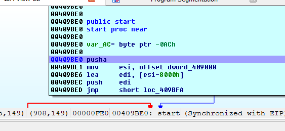

Я иду в первую секцию, где она начинается по адресу **0x401000**.

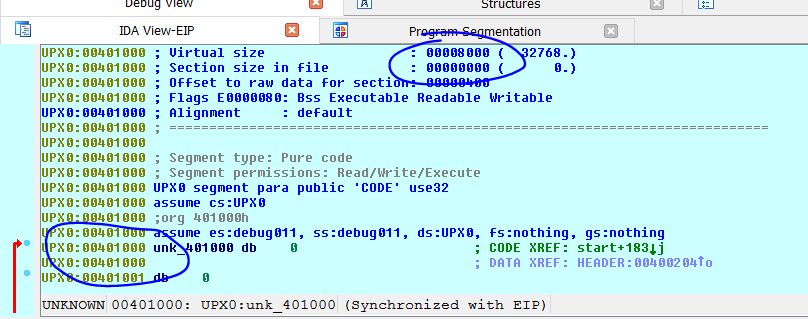

Я установил **BP** с помощью **F2**. Я установил его для остановки по исполнению или **EXECUTE**. Отладчик будет останавливаться только при выполнении, а не при чтении или записи. Поскольку он будет останавливаться при копировании кода и его создании, я не хочу этого. Я просто хочу, чтобы он перешел, когда код уже создан, отладчик остановится на первой инструкции, которую он выполняет, и поскольку я не знаю, где это место, я устанавливаю **BP** на **ВЫПОЛНЕНИЕ**, который охватывает всю секцию \(**0x8000** байт\).

Он пометил все инструкции в красный цвет.

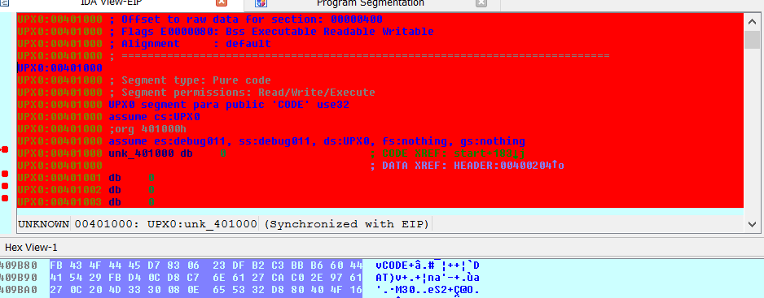

Я выключаю два других **BP** через **DEBUGGER → BREAKPOINT → BREAKPOINT LIST**.

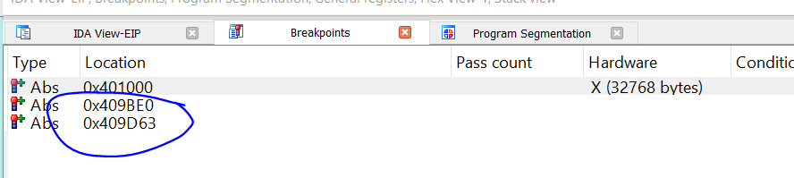

ДЕЛАЕМ ЩЕЛЧОК ПРАВОЙ КНОПКОЙ И ВЫБИРАЕМ **DISABLE**.

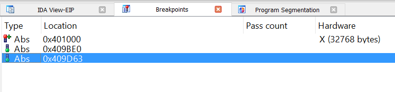

И сейчас, если я нажму **RUN**.

И я вижу, что первая инструкция, на которой остановился отладчик, находится в секции созданной недавно, т.е. в этом случае по адресу **0x401000** находится моя найденная **OEP**.

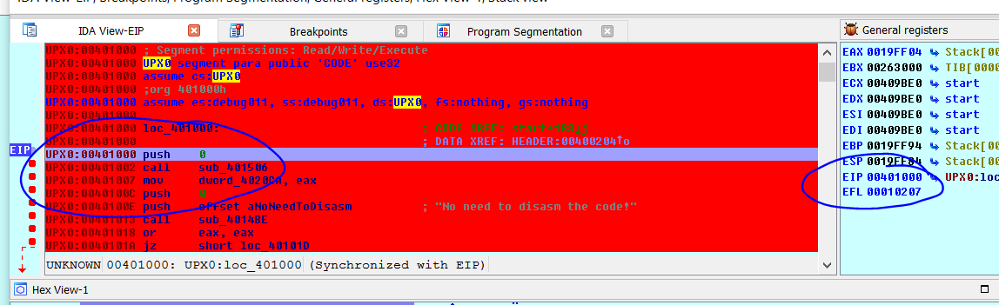

Таким образом, использую этот метод и мы находим **OEP**, адрес которой равен **0x401000**, теперь я удаляю **BP**.

После повторного анализа у меня снова есть эта функция.

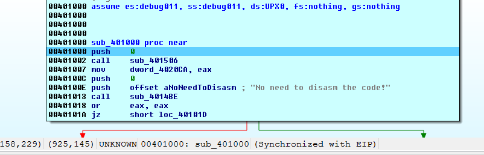

Т.е. до сих пор мы получали **OEP** и останавливались на ней, используя два разных метода, мы могли бы сделать **СНИМОК** созданного-загруженного кода, единственное, что нам для этого не хватает, так это сделать **ДАМП** и **ВОССТАНОВИТЬ IAT**, чтобы получить распакованный исполняемый и функциональный файл.

До **15**-й главе, где мы закончим с этим.

* * *

Автор оригинального текста — Рикардо Нарваха.

Перевод и адаптация на английский  язык — IvinsonCLS.

Перевод и адаптация на русский язык — Яша Яшечкин.

Перевод специально для форума системного и низкоуровневого программирования - WASM.IN

14.09.2017

Источник:

[**http://ricardonarvaja.info/WEB/INTRODUCCION%20AL%20REVERSING%20CON%20IDA%20PRO%20DESDE%20CERO/14-INTRODUCCION%20AL%20REVERSING%20CON%20IDA%20PRO%20DESDE%20CERO%20PARTE%2014.7z**](http://ricardonarvaja.info/WEB/INTRODUCCION%20AL%20REVERSING%20CON%20IDA%20PRO%20DESDE%20CERO/14-INTRODUCCION%20AL%20REVERSING%20CON%20IDA%20PRO%20DESDE%20CERO%20PARTE%2014.7z)
