# Часть 15

В предыдущей части, мы увидели несколько из многих методов, которые существуют для обнаружения и получения **OEP** в упакованном файле. Сейчас, вернёмся к двум пропущенными шагам: это **ДАМП** и **ВОССТАНОВЛЕНИЕ** **IAT**, стараясь объяснить их в этой главе.

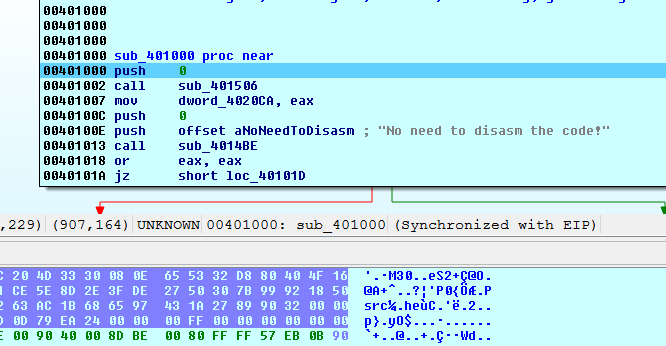

Мы снова попадаем в **OEP** программы и делаем её **ПОВТОРНЫЙ АНАЛИЗ**. Теперь у нас уже есть всё, чтобы сделать **ДАМП**.

Сейчас будем использовать **IDC** скрипт, а не **PYTHON**.

```cpp
Static main()
{
    auto fp, ea;
    fp = fopen("pepe.bin","wb");
    for(ea = 0x400000; ea < 0x40B200; ea++)
        fputc(Byte(ea), fp);
}
```

В скрипте введём **IMAGEBASE\(БАЗА\_ОБРАЗА\)**, адрес, которой равен **0x400000** и наибольший адрес последней секции исполняемого файла, который мы видим в **IDA** на вкладке **SEGMENTS**, который нужно **СДАМПИТЬ**. В этом случае секция **OVERLAY**, которая является последней секцией исполняемого файла, заканчивается по адресу **0x40B200**.

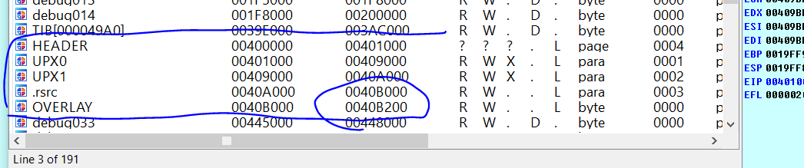

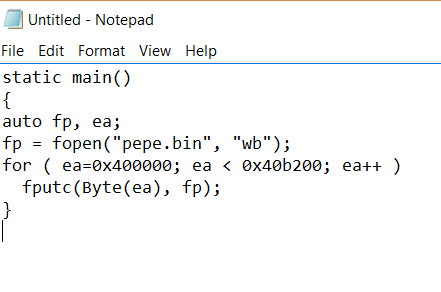

Сохраним этот скрипт под каким-нибудь именем, например **DUMPER.IDC**

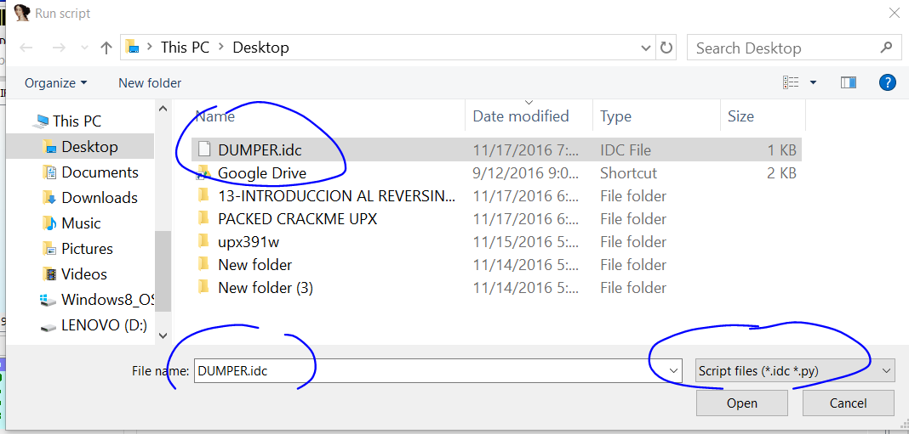

И запускаем его через **FILE → SCRIPT** **FILE**. Можно видеть, что **IDA** принимает скрипты как **PYTHON** так и свои родные **IDC**, поэтому тут с этим нет проблем.

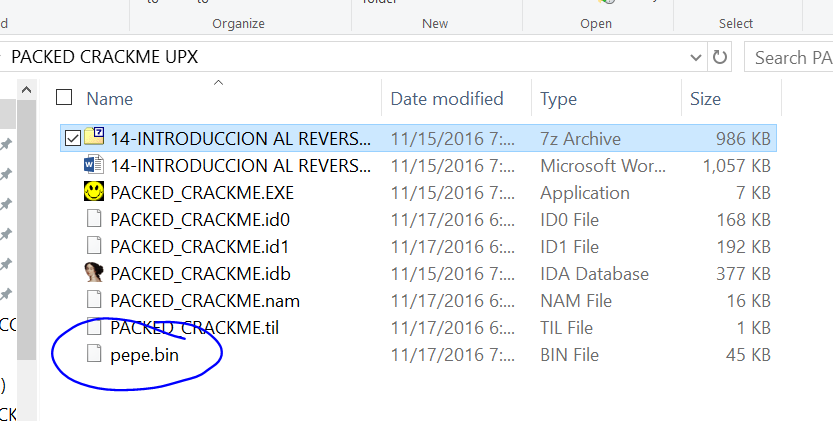

Я делаю копию созданного файла и переименовываю его расширение в **EXE**. \(Если Вы не видите расширения файлов, Вы должны изменить соответствующую опцию в **НАСТРОЙКАХ** **ПРОВОДНИКА**\)

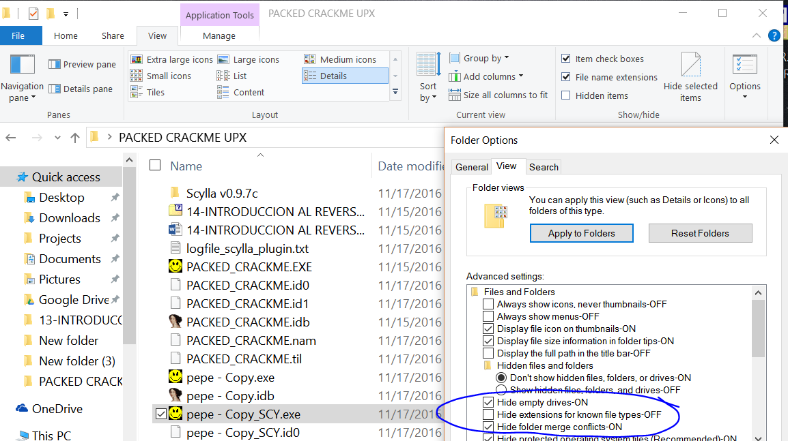

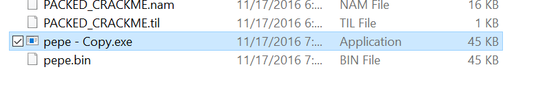

Видим, что у файла нет иконки, потому что некоторые шаги пропущены.

Во вложении приложен **PE** **EDITOR 1.7**, распакуем и запустим его.

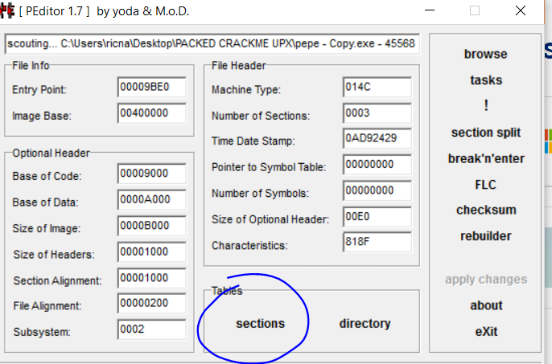

Теперь идём в **СЕКЦИИ**.

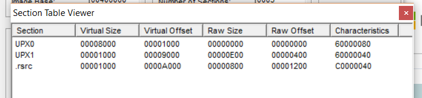

Здесь делаем правый щелчок в каждой из секций и выбираем пункт **DUMPFIXER**.

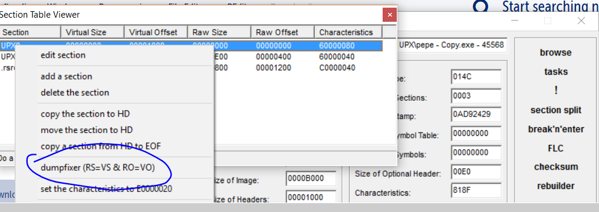

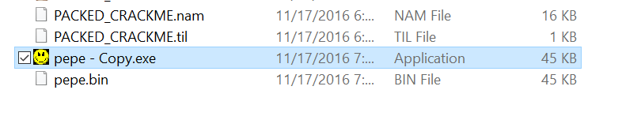

Видим, что мы уже ближе к победе. По крайней мере, теперь, выводится иконка, хотя программа ещё не запускается, потому что необходимо отремонтировать **IAT**.

**ЧТО ТАКОЕ IAT?**

**IAT** или **IMPORT** **ADDRESS** **TABLE** - это таблица, находящаяся в исполняемом файле, она используется, когда запускается программа. В ней программа сохраняет адреса импортируемых функций, которые она использует, для того, чтобы программа смогла запуститься на любом компьютере.

Если **IAT** верная и если мы дадим исполняемый файл другому человеку, **IAT** будет заполнена значениями, соответствующими конкретному компьютеру, независимо от версии **WINDOWS**, который он имеет, и будет оставаться совместимым, и хорошо работать.

**IAT** будет находиться в определенном месте, в каждом исполняемом файле, и она будет иметь фиксированные позиции для каждой функции, чтобы заполнять их.

Мы помним из предыдущей части, что я хотел объяснить различие между верхним изображением, которое принадлежит упакованному файлу, когда он был в **OEP** перед **ДАМПОМ** и исходного файла.

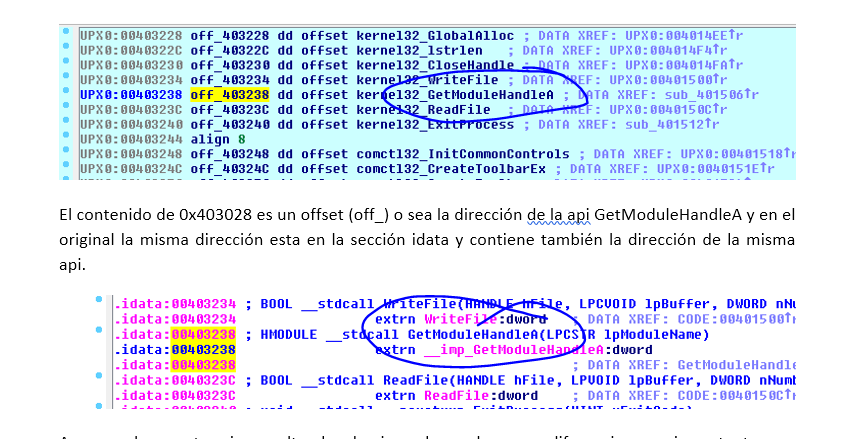

Оба изображения показывают адрес **0x403238** и похоже, что они имеют одинаковое содержимое. Сейчас, давайте откроем оригинальный файл.

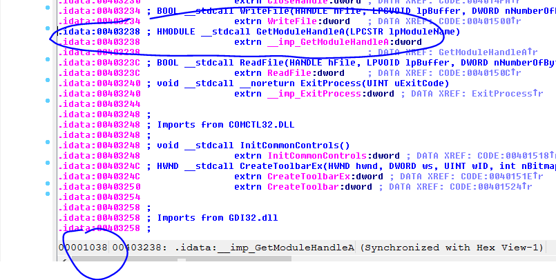

Здесь можно видеть **ФАЙЛОВОЕ СМЕЩЕНИЕ**, которое равно **0x1038**, чтобы иметь возможность искать данные в **HXD** в исходном исполняемом файле.

Давайте откроем с помощью **HXD** оригинальный файл.

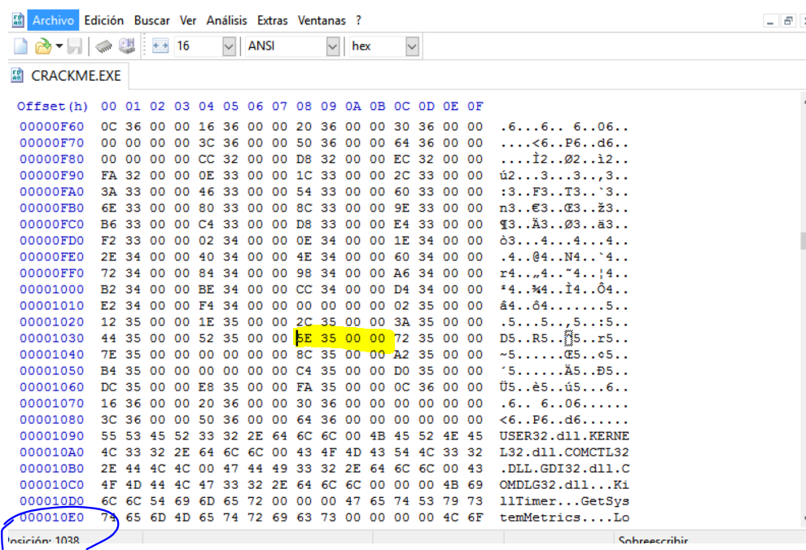

Видим, что содержимое памяти по смещению **0x1038** равно **0x355E**.

Если я прибавлю значение **0x355E** к **IMAGEBASE**, которое равно **0x400000**, то получу результат **0x40355E**. Что существует по этому адресу?

Чтобы увидеть что там находиться, нужно загрузить исходный файл с помощью опции **MANUAL** **LOAD**, для того, чтобы **IDA** загрузила все секции исполняемого файла.

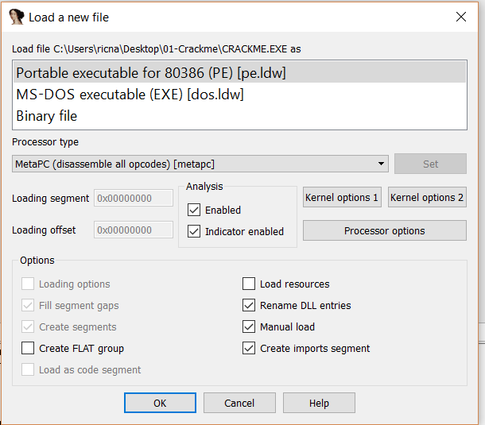

Соглашаемся со всеми секциями для загрузки и когда файл загрузится, идём по адресу **0x40355E** и видим в правой стороне имя **API** функции, оно равно **GetModuleHandleA**.

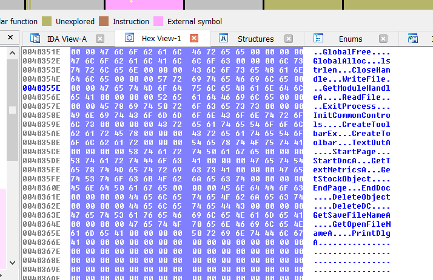

Итак, когда система загружает файл, программа начинает работать со всеми этими блоками. \(**1** блок — это одна **API** функция. Прим. Яши\) Их можно увидеть ниже на изображении.

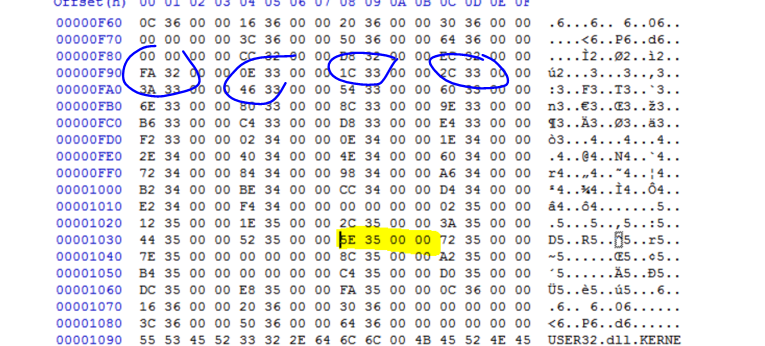

И каждый блок складывается с содержимым **IMAGEBASE** и ищет соответствующую функции строку. И из этой строки рассчитывается во время выполнения адрес для нашего компьютера. Как например в нашем случае ищется адрес **API** функции **GetModuleHandleA** на нашем компьютере и изменяется значение **5E** **35** на адреса **API**.

Вот почему исполняемый файл работает на любом компьютере, потому что он всегда будет находить в каждой записи **IAT** имя соответcтвующей **API** функции и рассчитывать её адрес при загрузке программы. Таким образом всегда содержащийся в нём адрес будет действительным, хотя и будет отличаться от компьютера к компьютеру. Однако адрес блока **GetModuleHandleA** на всех компьютерах будет одинаковым во всех исполняемых файлах без рандомизации. Изменится только его содержимое.

Вот почему на любом компьютере, если я сделаю:

**CALL \[0x403238\]**

Это всегда будет работать, потому что адрес **0x403238** - это запись **IAT** для функции **GetModuleHandleA**. Что будет меняться - это содержимое, которое система будет сохранять, изменив исходное значение **5E** **35**, которое указывает на строку, если мы сложим её с базой.

Не закрывая две других **IDA** с упакованным файлом, который остановлен в **OEP** и исходным файлом, в третьей **IDA** я открываю **ДАМП**, который мы только что сделали. Это файл **PEPE** - **COPY**.**EXE**.

В этом файле идём в **IAT** по адресу **0x403238**.

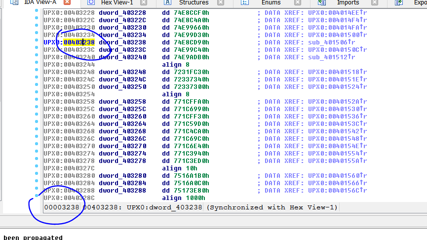

Видим, что здесь смещение файла равно **0x3238** и оно не соответствует исходному файлу, потому что **DUMPFIXER** который исправлял **RAWSIZE** и **VIRTUALSIZE**, также изменил смещения, и запись **IAT** **API** **GMHA\(**GMHA = GetModuleHandleA прим. Яши**\)**.

Если откроем этот файл в **HXD** и перейдём по адресу **0x3238**.

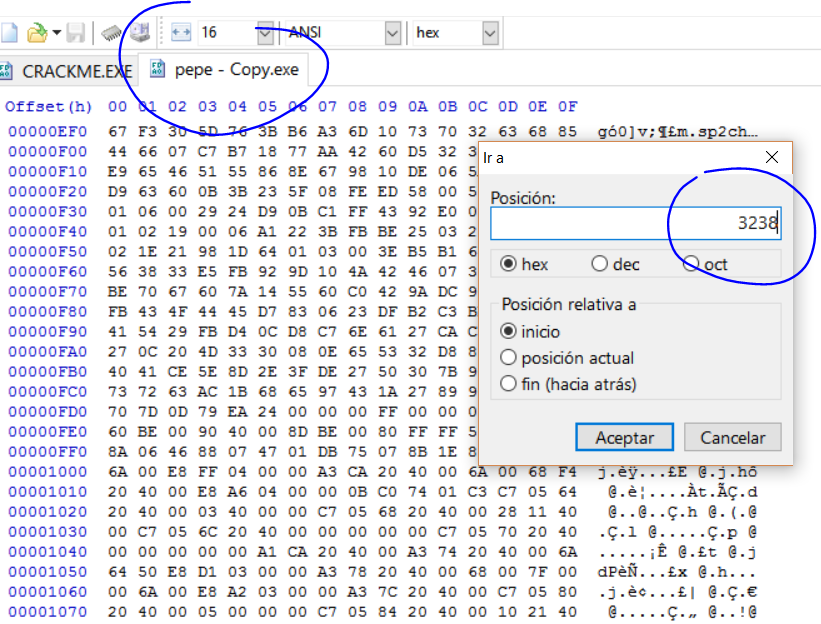

То по этому адресу увидим:

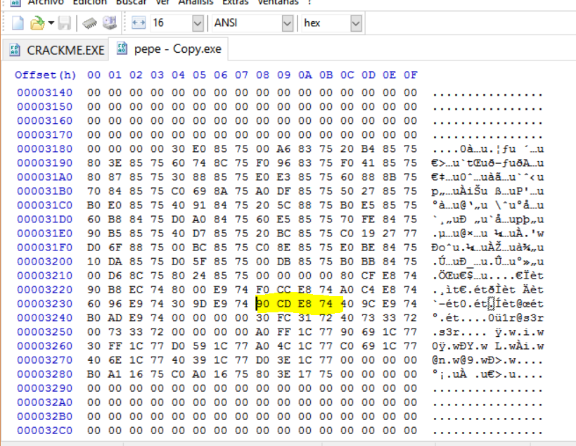

Видим, что здесь у нас есть адрес **API** функции, а не смещение, которое нужно сложить с **IMAGEBASE,** чтобы получился адрес **API**.

Когда система запускает упакованный файл, то рассчитываются адреса **API** функций и сохраняются в таблице. При дампинге эти адреса остаются также в этой таблице.

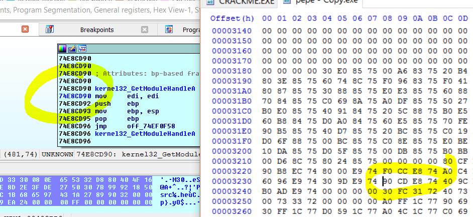

Так в чём же проблема?

Когда программа запускается, она ищет в записи **IAT** значение, чтобы сложить его с **IMAGEBASE** и найти строку, чтобы рассчитать адрес, но сейчас значение поломано, потому что при дампинге был сохранен итоговый адрес, и программа будет "падать" при запуске, и будет неспособна правильно заполнить **IAT**.

Хорошо, чтобы закончить с этой темой, давайте подведём итог. Идея состоит в том, чтобы исправить **IAT** и восстановить все эти смещения, которые указывали на строки с именами **API**. Это не надо делать вручную, так как так будет очень долго. Чтобы сделать это быстрее, будем использовать утилиту под названием **SCYLLA**.

Забрать её можно здесь.

[https://tuts4yoututs4you.com/download.php?view.3503](https://tuts4yoututs4you.com/download.php?view.3503)

Пароль на архив **RAR** равен **tuts4you**

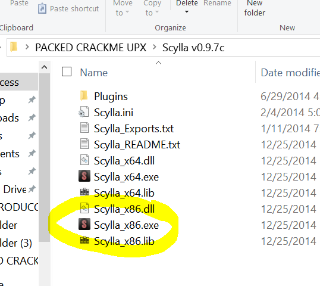

Я запускаю нашу распакованную **SCYLLA**.

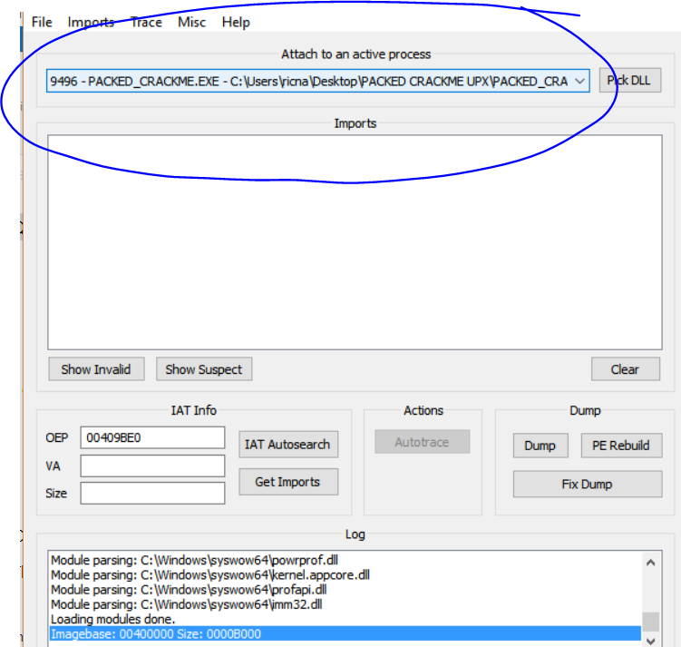

В пункте **ATTACH** **TO** **ACTIVE** **PROCESS** из выпадающего меню я выбираю процесс упакованного файла, который остановлен в **IDA** на **OEP**.

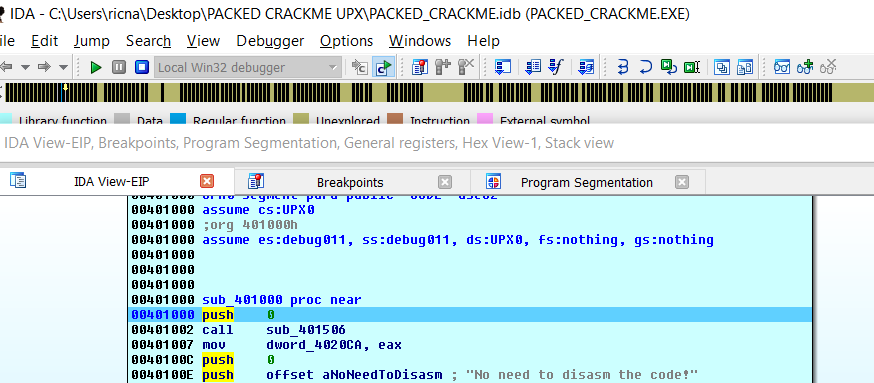

Теперь меняем в программе **OEP** на значение **401000.**

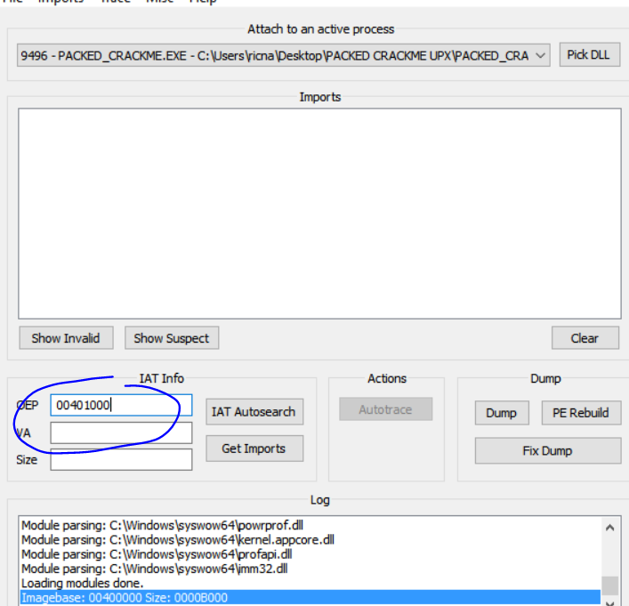

И нажимаем кнопку **IAT AUTOSEARCH.**

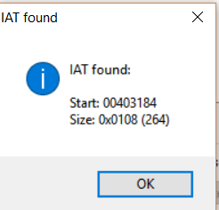

Программа говорит нам, что таблица **IAT** начинается по адресу **0x403184** и её размер равен **0x108**.

После этого, давайте нажмём кнопку **GET IMPORTS**.

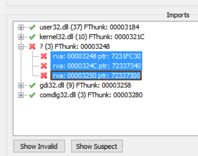

Видим, что **SCYLLA** нашла все адреса, за исключением трёх вхождений. Она показывает плохие записи после нажатия кнопки **SHOW INVALID.**

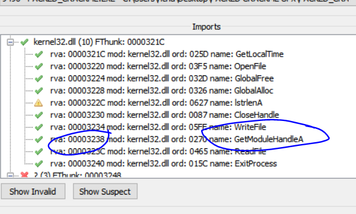

С другой стороны, видим, что смещение **3238** в упакованном файле принадлежало, соответственно, функции **GetModuleHandleA** и мы знали про это. Программа очень правильно рассчитало значение. Мы можем посмотреть в упакованном файле недействительные адреса записи **0x403248** в дальнейшем, чтобы увидеть, что они собой представляют.

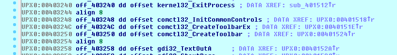

Видим, что эта запись принадлежит библиотеке **COMCTRL32**.

И если я сделаю правый щелчок на неправильных записях в **SCYLLA** и выберу **SCYLLA** **PLUGIN →** **PE** **COMPACT**, она исправит эти ошибки.

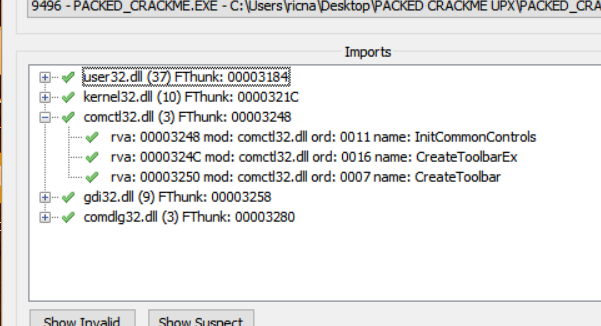

Теперь записи совпадают с теми, которые мы только что видели.

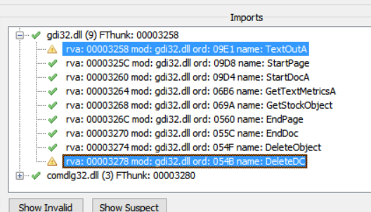

Если нажмём кнопку **SHOW** **SUSPECT**, можем увидеть, верны ли эти два подозрительных вызова по адресам **0x403258** и **0x403278**.

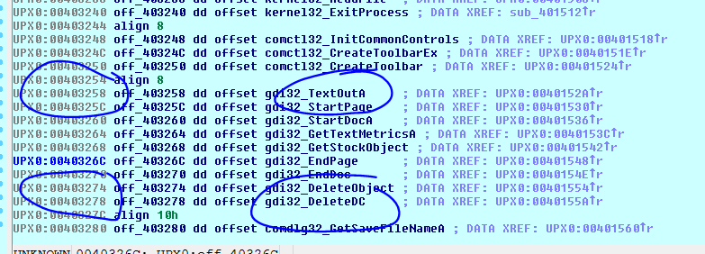

Да, они получаются правильными. Так что, теперь, можем нажать кнопку **FIX DUMP.**

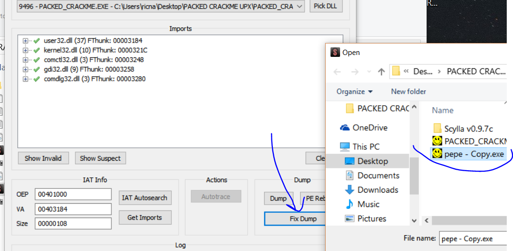

**SCYLLA** сохранит записи в починенный файл **PEPE-COPY\_SCY.EXE**, и теперь видно, что он работает.

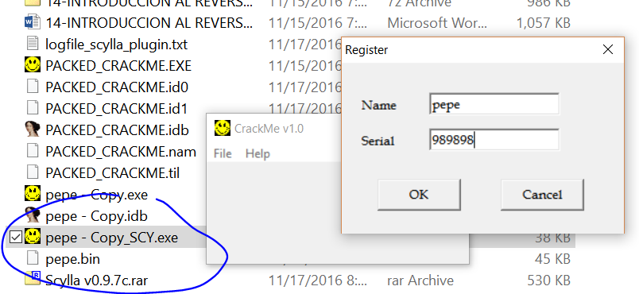

Открыв этот распакованный файл в **IDA**, видим, что теперь **OEP** начинается по адресу **0x401000** и что имена похожи на имена **API** как в исходном файле, так что всё рассчитались правильно.

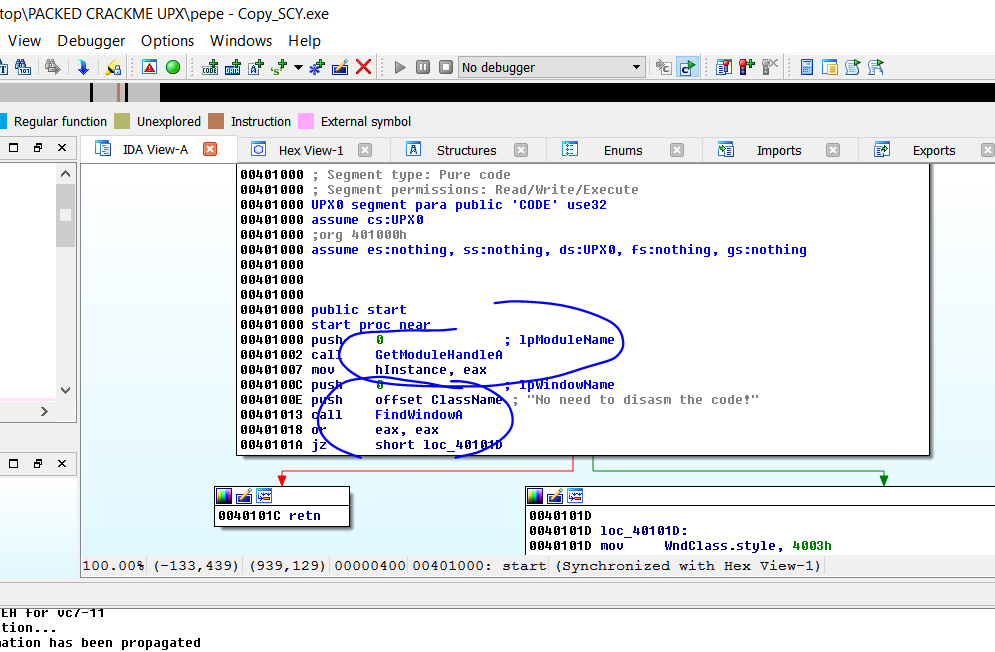

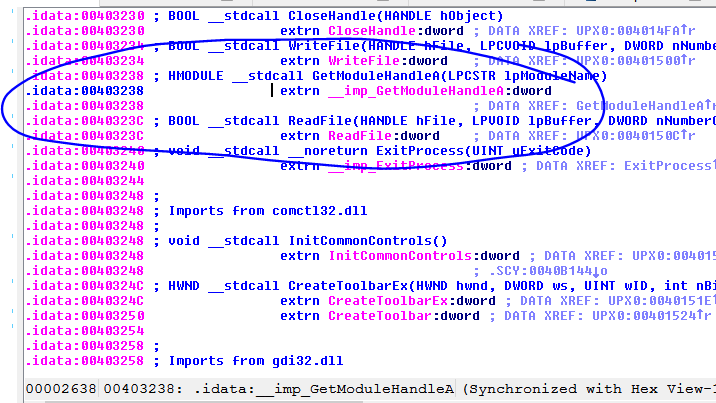

Таблица **IAT** выглядит также хорошо, как и у исходного файла.

Хорошо, мы распаковали наш первый и простой упаковщик. Позже мы увидим другие, более сложные упаковщики.

До встречи в **16**-й главе.

* * *

Автор оригинального текста — Рикардо Нарваха.

Перевод и адаптация на английский  язык — IvinsonCLS.

Перевод и адаптация на русский язык — Яша Яшечкин.

Перевод специально для форума системного и низкоуровневого программирования - WASM.IN

22.09.2017

Источник:

[**http://ricardonarvaja.info/WEB/INTRODUCCION%20AL%20REVERSING%20CON%20IDA%20PRO%20DESDE%20CERO/15-INTRODUCCION%20AL%20REVERSING%20CON%20IDA%20PRO%20DESDE%20CERO%20PARTE%2015.7z**](http://ricardonarvaja.info/WEB/INTRODUCCION%20AL%20REVERSING%20CON%20IDA%20PRO%20DESDE%20CERO/15-INTRODUCCION%20AL%20REVERSING%20CON%20IDA%20PRO%20DESDE%20CERO%20PARTE%2015.7z)
