# Часть 17

[\[Используемые материалы\]](.gitbook/assets/files/17.zip)

Мы добрались до **17**-й главы и предполагается, что, по крайней мере, Вы должны были попробовать решить это упражнение.

[http://ricardonarvaja.info/WEB/INTRODUCCION AL REVERSING CON IDA PRO DESDE CERO/EJERCICIOS/](http://ricardonarvaja.info/WEB/INTRODUCCION%20AL%20REVERSING%20CON%20IDA%20PRO%20DESDE%20CERO/EJERCICIOS/)

Оно очень простое. Мы должны распаковать файл из примера, как мы делали это в предыдущих частях, а затем, отреверсить его, чтобы найти для него решение, и, если это возможно, сделать кейген в **PYTHON**.

В этой главе мы будем действовать немного по другому. Я буду распаковывать файл удаленно на виртуальную машину **VMWARE WORKSTATION** с установленной системой **WINDOWS 10**.

Главная машина для удаленной отладки, это та, где запущенна **IDA**. В данном случае, это машина с **WINDOWS 7**. Но это могут быть любые системы, а не только **WINDOWS**. Например **LINUX**, **IOS** и т.д. где есть установленная **IDA**.

Все ограничения, которые произойдут при удаленной распаковке, будут такими же, как если бы программа отлаживалась напрямую в **WINDOWS 10**, так как оттуда запускается упакованный файл, который в этой части называется **PACKED\_PRACTICA\_1.EXE**.

Чтобы было быстрее читать и понимать, отсюда и далее, главную машину, где установлена **IDA**, я буду называть "**ОСНОВНОЙ**", а образ системы **WINDOWS 10**, который запускаю в **VMWARE** буду называть "**ЦЕЛЕВОЙ**".

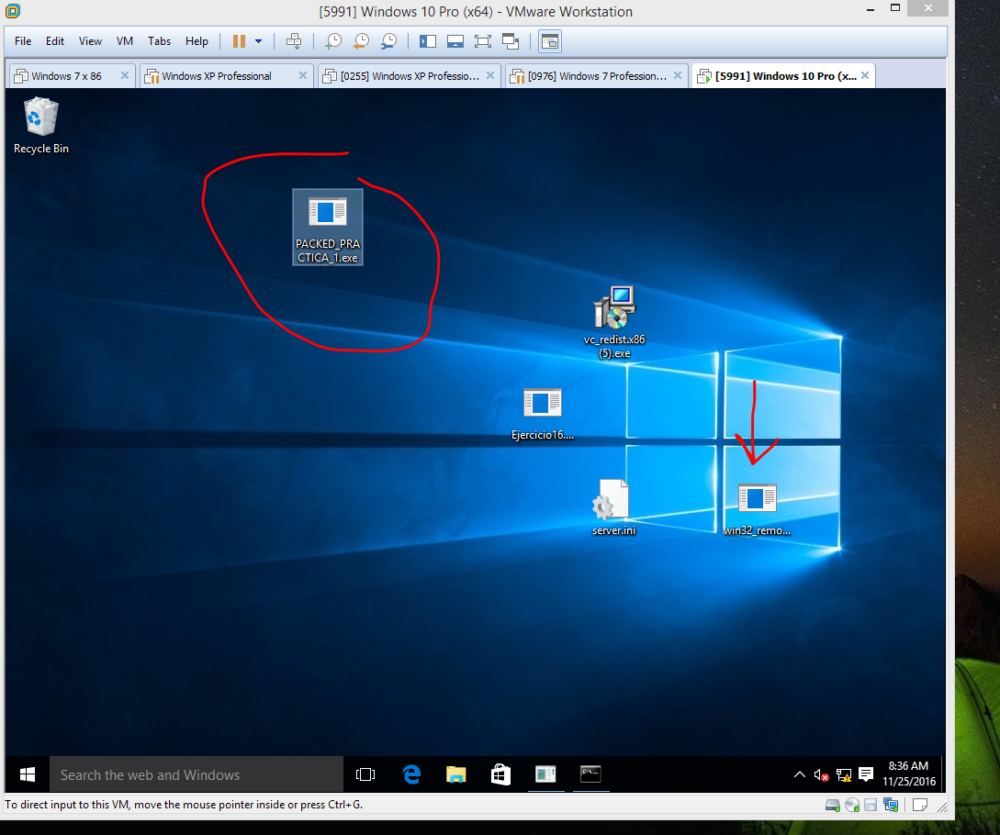

В **ЦЕЛЕВОЙ** системе находится упакованный файл. Я также должен скопировать из каталога, где у меня установленна **IDA** в **ОСНОВНОЙ** системе, сам сервер. Так как моя система **WINDOWS 10** - **64**-битная, а упакованная программа – **32**-битная, то я должен запустить **32**-битый сервер. Он называется **WIN32\_REMOTE.EXE**.

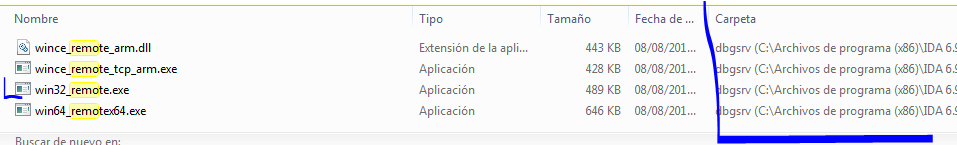

Копируем также исполняемый файл **PACKED\_PRACTICA\_1.EXE** в **ОСНОВНУЮ** систему, чтобы выполнить **ЛОКАЛЬНЫЙ** анализ и открываем этот файл в **ЗАГРУЗЧИКЕ**. Я устанавливаю галочку в **MANUAL LOAD**, для того, чтобы **IDA** проанализировала файл и загрузила все его секции.

Сейчас мы находимся в **ЗАГРУЗЧИКЕ**, который показывает мне **EP** упакованной программы. Пока мы ещё не запускали **ОТЛАДЧИК**.

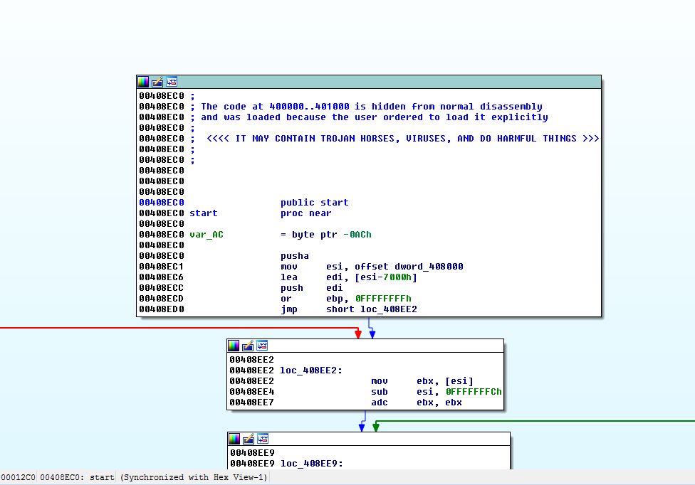

Очень важно не переименовывать **IDB** файл. Другими словами, это означает, что если исполняемый файл называется **PACKED\_PRACTICA\_1.EXE** в **ОСНОВНОЙ** системе, то при анализе он будет сохранять **IDB** файл в ту же самую папку, и он должен называться **PACKED\_PRACTICA\_1.IDB**, и никак по другому, потому что так начнутся проблемы с распознаванием какой удаленный процесс принадлежит исполняемому файлу анализируемого локально.

Сейчас, давайте запустим удаленный сервер **WIN32\_REMOTE.EXE** в **ЦЕЛЕВОЙ** системе.

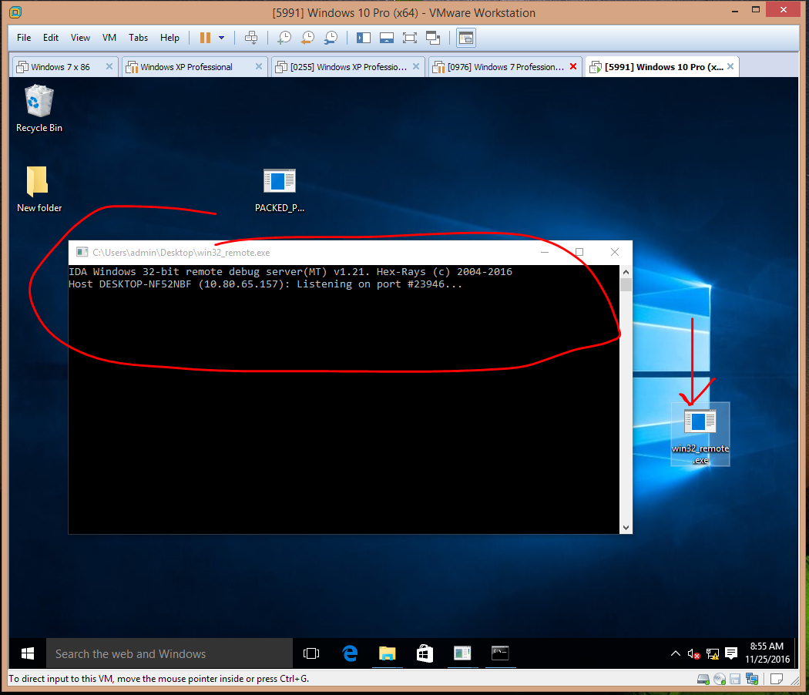

Этот файл запускает удаленный сервер **IDA** и будет слушать **IP** адрес и порт, который мы ему назначим. В моём случае, **IP** равен **10.80.65.157**, а порт **23946**. Скопируйте данные, которые сервер показывает для Вас.

Теперь поменяем тип отладчика на **REMOTE WINDOWS DEBUGGER**.

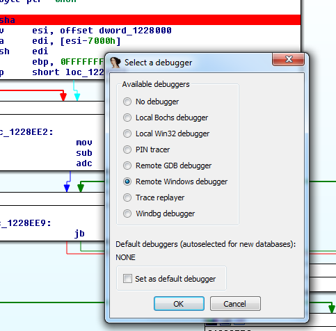

В **PROCESS OPTIONS** я устанавливаю **IP** адрес и **ПОРТ** сервера **IDA**. Т.к. процесс ещё не создан, то мы не сможет подсоединиться к нему с помощью отладчика. Также, нам нужно отлаживать файл с самого начала. Мы должны исправить пути, которые **IDA** показывает здесь, чтобы они совпадали с расположением исполняемого файла в **ЦЕЛЕВОЙ** системе.

В моём случае, распакованный файл в **ЦЕЛЕВОЙ** системе находится на **РАБОЧЕМ СТОЛЕ** и полный путь для моей системы будет - **C:\USERS\ADMIN\DESKTOP\PACKED\_PRACTICA\_1.EXE**

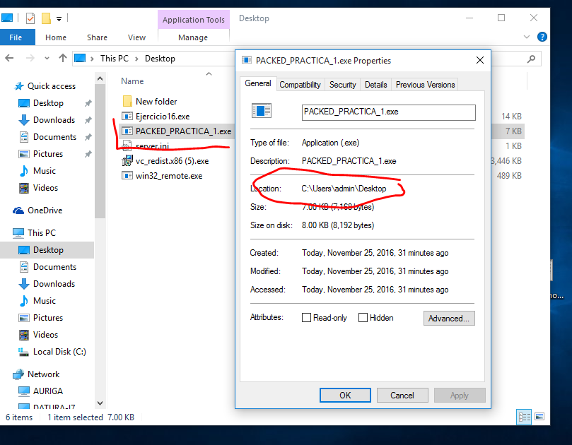

Поэтому давайте отредактируем эти три поля для ввода пути.

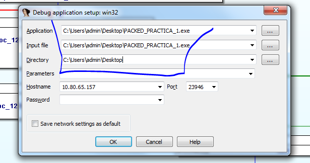
Сейчас, если нажмём кнопку **START PROCESS**, то **IDA** остановится на **EP** упакованного файла в **РЕЖИМЕ ОТЛАДЧИКА**.

Исполняемый файл имеет рандомизацию, поэтому адреса меняются при каждом запуске. Таким образом, это очень важно для нас, поскольку мы запускаем файл, затем его дампим и исправляем **IAT** в этом же процессе, не закрывая файл, чтобы адреса не менялись.

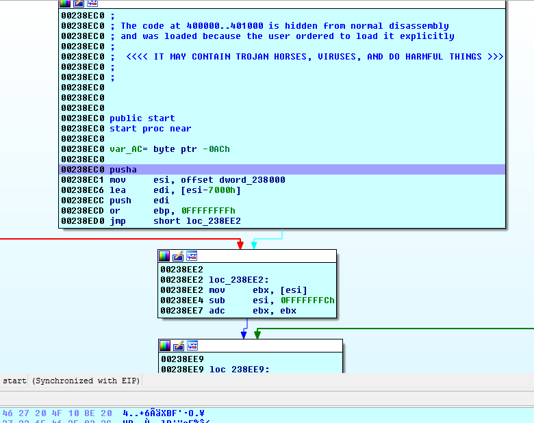

Сейчас, в **СЕГМЕНТАХ** давайте посмотрим на первую секцию кода после заголовка.

В моём случае, я вижу, что она начинается по адресу **0x231000** и заканчивается по адресу **0x238000**.

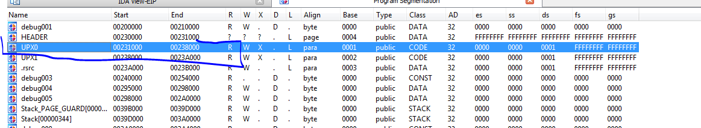

Если мы просто сделаем **SEARCH FOR TEXT**, чтобы найти инструкцию **POPAD** или **POPA**, в этом случае, найдём ту инструкцию, которая выполняется до перехода в **OEP**.

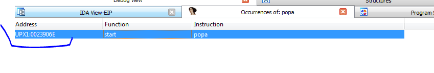
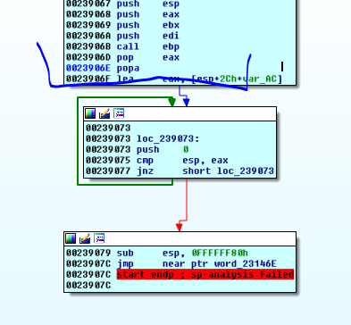

Здесь, мы уже знаем, что **OEP** находится по адресу **0x23146E**, но я могу найти её по другому. Я устанавливаю **BP** на **ВЫПОЛНЕНИЕ**, который охватывает всю первую секцию.

Теперь иду в начало секции по адресу **0x231000**.

Здесь я вижу данные, которые принадлежат заголовку. Очевидно, адреса не совпадают из-за рандомизации. **IB** не равна **0x400000**, но **VIRTUAL SIZE** такой же, как и был, и равен **0x7000** байт, т.е. размер секции в памяти совпадает, так как она начинается по адресу **0x231000**, а заканчивается по адресу **0x238000**. Это разница и составляет **0x7000** байт.

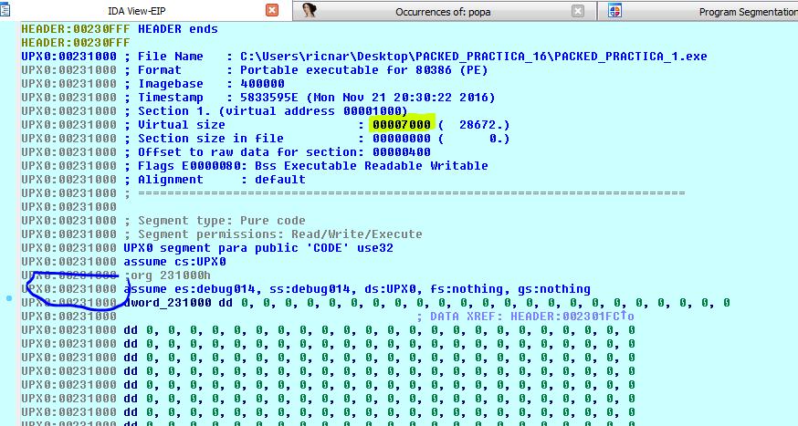

Теперь, в начале секции, я устанавливаю **BP** с помощью **F2**. В моём случае, это адрес **0x231000** или соответствующий адрес, который на Вашем компьютере имеет размер **0x7000**.

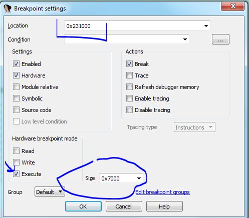

Я удаляю все другие **BP**. Но оставляю только один этот и нажимая **F9**, для того, чтобы запустился отладчик.

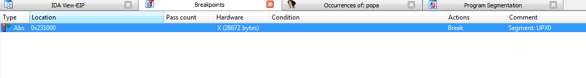

Отладчик останавливается здесь и совпадает с адресом, который мы видели ранее, который принадлежит **OEP**. Сейчас удаляю **BP**, чтобы исчез красный фон.

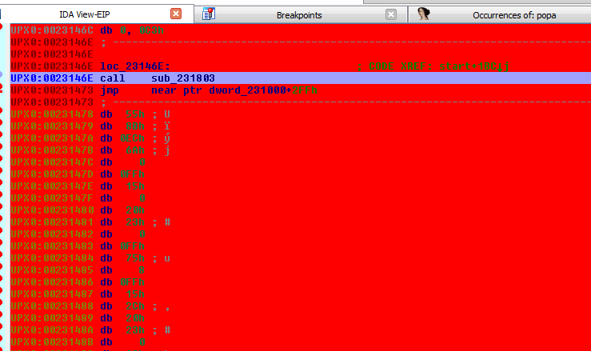

Теперь, делаю правый щелчок в левом нижнем\(верхнем?\) углу, чтобы **ПОВТОРИТЬ АНАЛИЗ**.

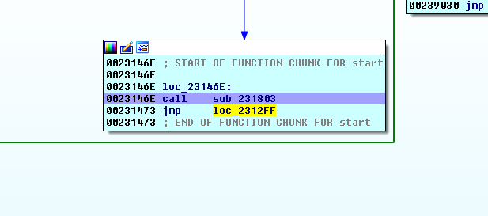

В этом случае, отладчик оставляет этот блок таким, как будто это блок того же **СТАБА**. Поэтому отладчик не поместил префикс **SUB\_**, а оставил префикс как **LOC\_**.

Сейчас, я исправляю скрипт для дампа в **PYTHON**, для того, чтобы он показывал мне мою настоящую **IB** и конец файла.

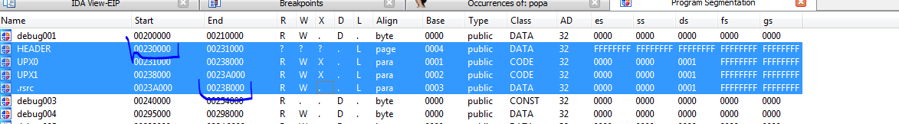

Другими словами, **IB** в моём случае, находится по адресу **0x230000**, а её конец **0x23B000**.

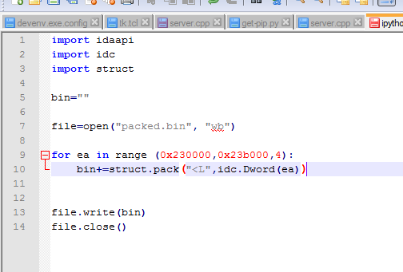

Здесь, я меняю значения в скрипте и запускаю его через **FILE → SCRIPT → FILE**.

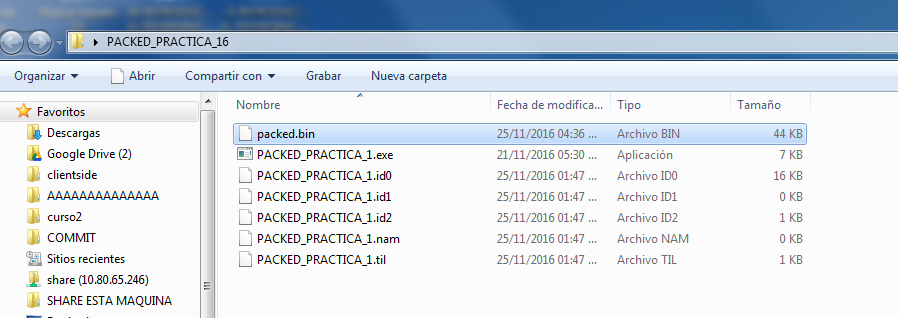

Отладчик сохраняет дамп в этой папке, так как скрипт запускается на **ОСНОВНОЙ** машине.

Я открываю этот файл с помощью **PEEDITOR** и выбираю пункт **DUMPFIXER**.

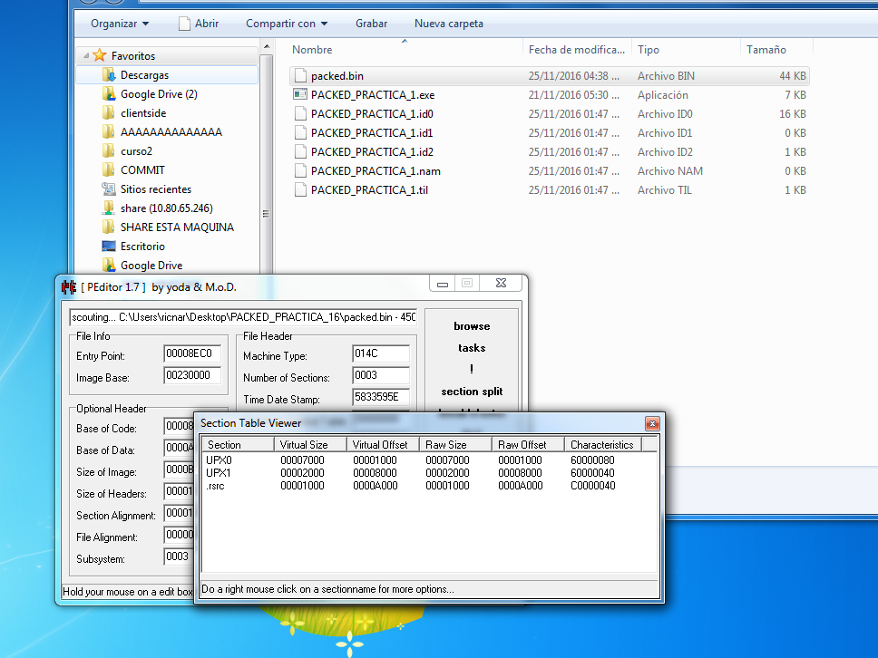

Теперь меняю расширение файла на **EXE**.

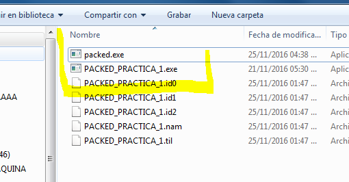

Вот у него появляется такая же иконка, как и у сжатого файла. Сейчас, открываю **SCYLLA** в **ЦЕЛЕВОЙ** системе и копирую туда сдампленный файл **PACKED.EXE**.

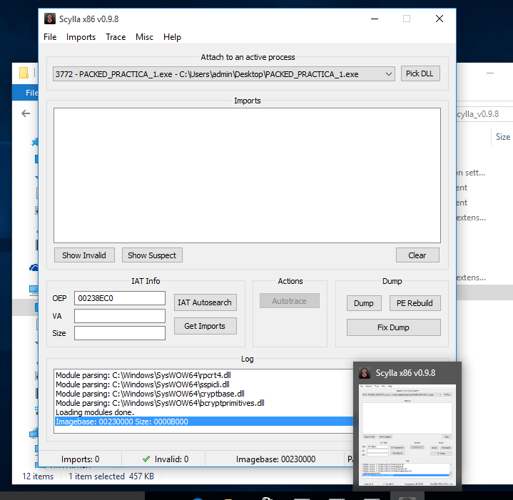

Пришло время нажать на кнопку **IAT AUTOSEARCH**.

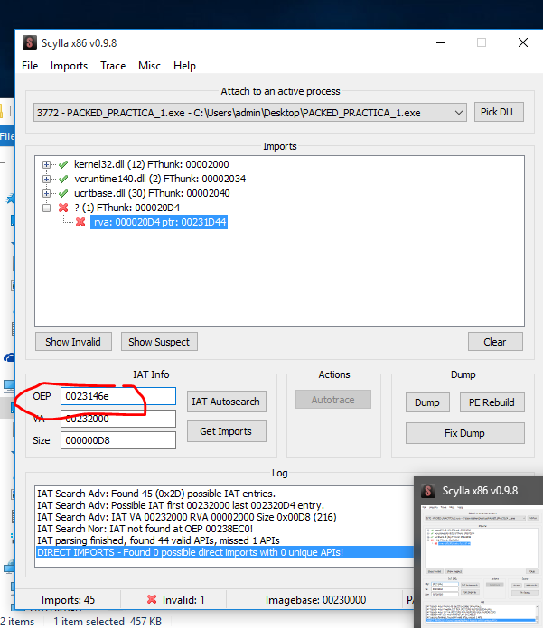

Я меняю поле **OEP** на значение **0x23146E**, которое мы нашли.

И вижу, что после нажатия **IAT AUTOSEARCH** и **GET IMPORTS**, остаётся только одна **НЕДЕЙСТВИТЕЛЬНАЯ** запись.

Складывая **IB** с адресом недействительной записи, получаю

**Python&gt;hex\(0x230000+0x20D4\)
0x2320D4**

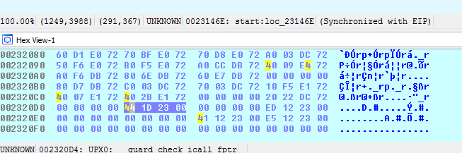

Вроде, это запись похожа на шум. Я не думаю, что это часть **IAT**. Давайте проверим это, смотря в дизассемблерный листинг, есть ли у этого адреса перекрёстные ссылки?

Видим, что этот указатель имеет ссылки.

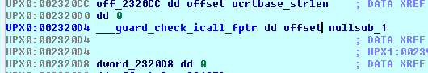

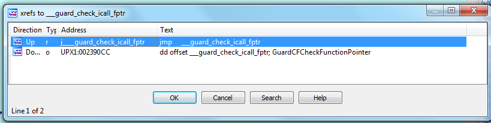

Теперь посмотрим куда он ведёт.

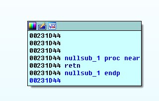

Видим, что он заканчивается тем, что приходит в блок с инструкцией **RET**.

Для нас, настоящих хакеров, это не проблема. Так как указатель ведёт в фиксированное значение программы, которое равно **RET**, то это не **API** функция, поэтому на неправильной записи делаю **ПРАВЫЙ ЩЕЛЧОК → CUT THUNK** для удаления записи из **IAT**.

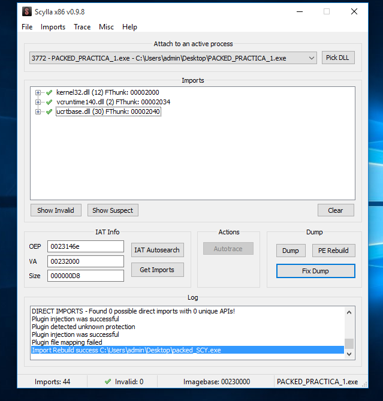

Сейчас, я нажимаю **FIX DUMP** на **PACKED.EXE** и у меня получается файл **PACKED**\_**SCY.EXE**, однако он не запускается. Это происходит потому, что в дампе не перераспределены адреса, которые были созданы во время выполнения, которые не принадлежат **IAT** и всегда меняются при запуске. Поэтому, я буду удалять рандомизацию. Я открываю **PACKED**\_**SCY.EXE** в **IDA** с помощью **MANUAL LOAD**, загружаю заголовок и перехожу в него.

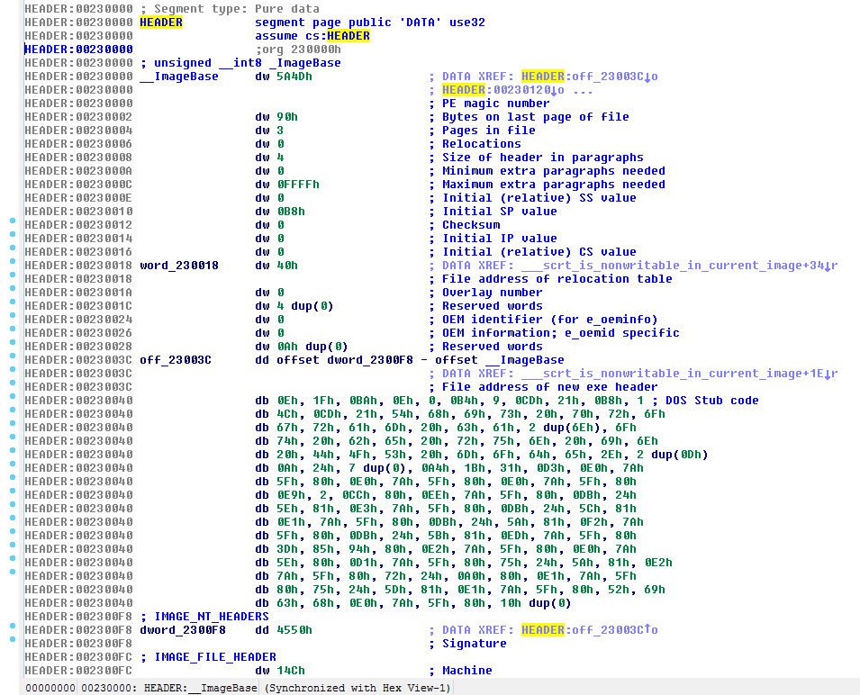

В заголовке есть поле **DLL CHARACTERISTICS**. У Вас значение будет отличаться от нуля, потому что я уже изменил его.

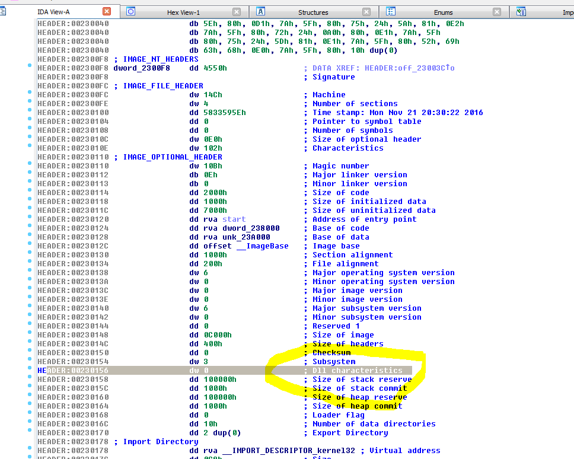

Из меню **EDIT → PATCH PROGRAM → CHANGE WORD** меняем этот байт на нуль.

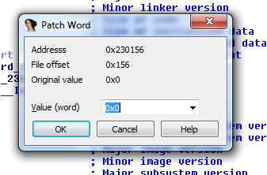

И потом сохраняем изменения с помощью **APPLY PATCHES TO INPUT FILE**.

Вот и всё ребята.

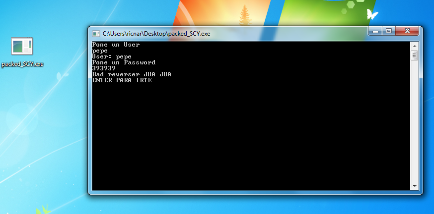

Наш файл из примера теперь распакован. В **18**-той главе мы начнём его реверсить.

До встрече в **18**-й главе.

* * *

Автор оригинального текста — Рикардо Нарваха.

Перевод и адаптация на английский  язык — IvinsonCLS.

Перевод и адаптация на русский язык — Яша Яшечкин.

Перевод специально для форума системного и низкоуровневого программирования - WASM.IN

08.10.2017

[**Источник: ricardonarvaja.info**](http://ricardonarvaja.info/WEB/IDA%20DESDE%20CERO/CURSO%20DE%20IDA%20TUTES/17-INTRODUCCION%20AL%20REVERSING%20CON%20IDA%20PRO%20DESDE%20CERO.docx)
