# Часть 18

В предыдущей части, мы распаковали исполняемый файл упражнения и сделали его рабочим. В этой части, мы будем его реверсить, чтобы увидеть, можно ли сделать для него кейген в **PYTHON**.

Хорошо помнить, что для статического анализа нет необходимости распаковывать файл. Нам просто нужно получить **OEP** и сделать **TAKE** **MEMORY** **SNAPSHOT**. Затем, нужно скопировать файл .**IDB** в другое место и открыть его там. Этого бы хватило, чтобы анализировать его статически, но хорошо иметь распакованный файл, это позволит отлаживать файл и может иногда помогать.

Я открываю распакованный файл в **IDA**, и первое, на что я обращаю внимание - это строки.

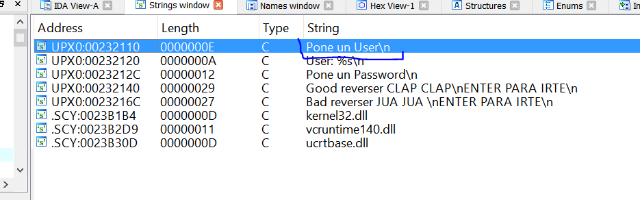

Хорошо, мы знаем, что первое, что делаем программа после запуска - это печатает строку “**Pone un user”**.

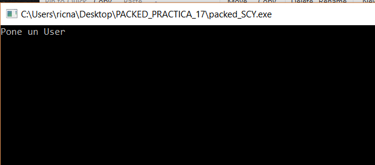

Поэтому, я делаю двойной щелчок на этой строке в **IDA** и попадаю сюда.

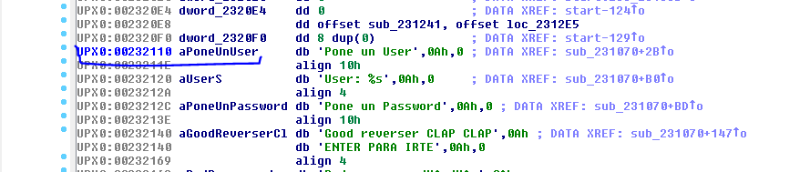

И ищу перекрёстную ссылку с помощью клавиши **X**.

Видно, что ссылка нашлась. Теперь можно перейти по ней.

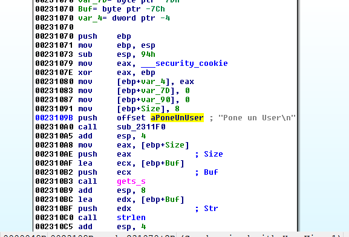

Давайте будем статически реверсить начинаю отсюда.

В функциях, основанных на **EBP**, мы сказали, что сначала, в стек, с помощью инструкции **PUSH** **EBP** сохраняется **EBP** функции, которую я вызвал, и, затем, исполняется инструкция **MOV** **EBP**, **ESP** для установки **EBP** как опорного значения для этой функции, откуда будут вычисляться позиции изменяемых аргументов и буферов.

Видно, что программа резервирует **0x94** байта для локальных переменных и буферов, начиная с базового значения **EBP**.

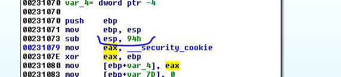

Хорошо, делая двойной щелчок на любой переменной или аргументе, **ЗАГРУЗЧИК** показывает статическое представление стека.

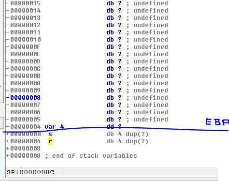

Здесь видим, что эта функция без аргументов, потому что сначала в стек помещаются аргументы с помощью инструкции **PUSH** перед вызовом функции и они были бы ниже адреса возврата **R**. В нашем случае, ниже **R** ничего такого нет, поэтому это функция без аргументов.

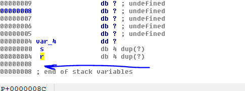

Это тот же самый случай, как и в прошлый раз. Это функция **MAIN** и она имеет такие аргументы: **ARGV** и **ARGC** и т.д. Но, так как она не использует их внутри функции, то **IDA** не учитывает эти аргументы.

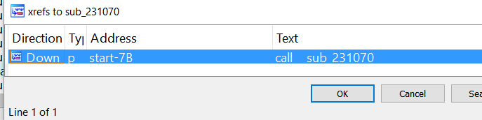
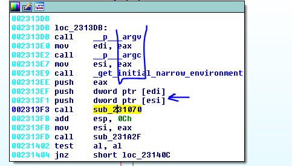

Давайте переименуем эту функцию в **MAIN**, и **IDA** добавит мне автоматически три аргумента.

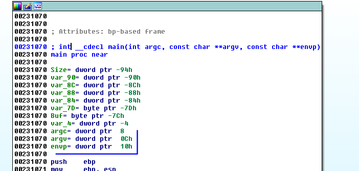

Также, если мы нажмём клавишу **X** на любом из трёх аргументов.

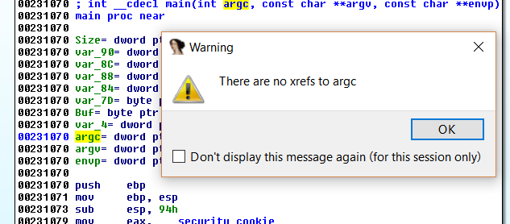

Увидим, что аргументы не используются, так что они не очень важны для нас.

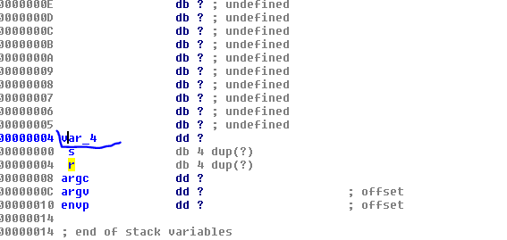

Возвращаясь к статическому представлению стека, видим, что ниже адреса возврата, как и положено, есть аргументы. Затем идёт буква **S**, что означает **STORED** **EBP.** Как мы сказали, это значение хранит **EBP** предыдущей функции, которое помещается в стек с помощью инструкции **PUSH** **EBP** и выше есть место для переменных, которое обычно имеет переменную **VAR\_4**, которая нужна для защиты стека от переполнения буфера.

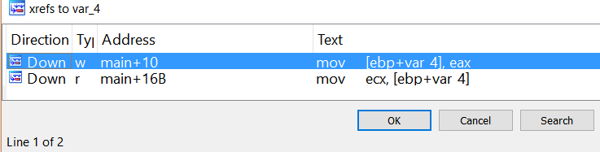

Эта переменная имеет две перекрёстные ссылки. Одну в начале функции, когда программа сохраняет значение **SECURITY** **COOKIE\(Печеньки безопасности. Прим. Яши\)** в стек.

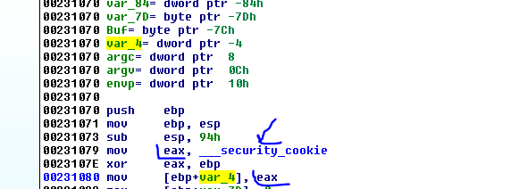

Вышеупомянутое значение - это случайное значение, которое **XOR**ится с помощью **EBP** и сохраняется в переменную **VAR\_4** в начале функции. А другая ссылка находиться здесь.

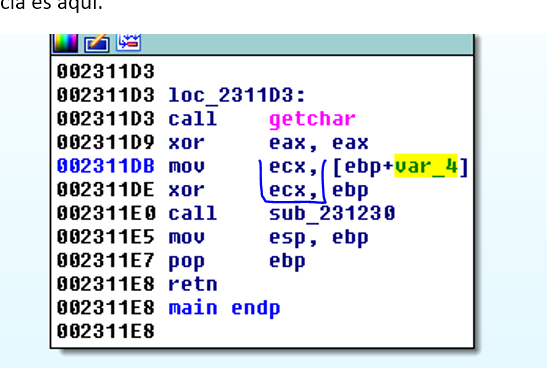

Где программа восстанавливает исходное сохраненное значение и **XOR**ит его с помощью **EBP** для восстановления исходного значение в **ECX**, и внутри этого **CALL**, программа проверяет это значение.

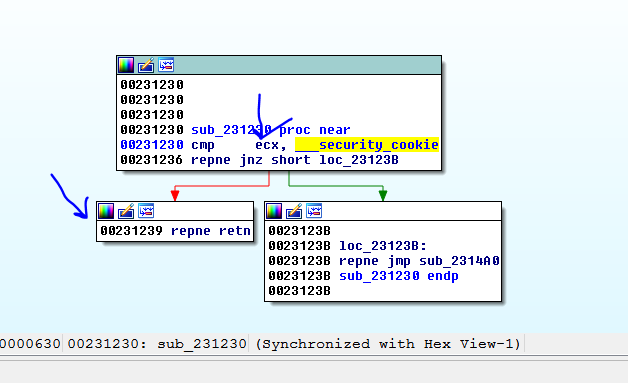

Если всё нормально, программа будет возвращаться, но если **ECX** не имеет первоначального значения **\_\_SECURITY\_COOKIE**, программа перейдёт в **JMP**, который ведёт на **ВЫХОД** и не позволит Вам достигнуть **RET** функции.

Плохой вариант может случиться и программа пойдёт на **ВЫХОД**, если произойдёт **ПЕРЕПОЛНЕНИЕ**, которое перезаписывает значение **VAR\_4** внутри функции. Сейчас давай переименуем **VAR\_4** в **CANARY\(КАНАРЕЙКА\)** или **SECURITY** **COOKIE**.

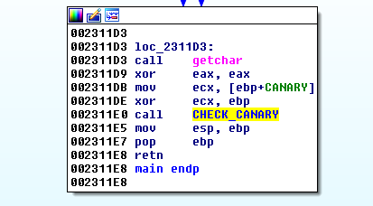

Сейчас, листинг выглядит более красиво и читаемо.

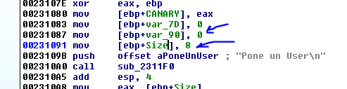

Затем, видим две переменные, о которых мы ещё ничего не знаем и о которых мы ещё не говорили, как они используются. Они инициализируются нулями. Также есть переменная, которая уже имеет имя **SIZE** и инициализируется числом **8**.

Если посмотрим перекрёстные ссылки для переменной **VAR\_7D**, увидим, что она используется здесь.

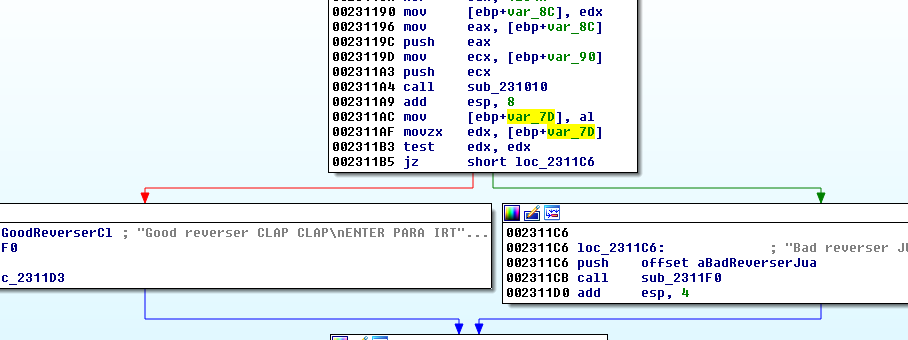

Программа сохраняет значение **AL** в эту переменную при возврате из **CALL** и затем перемещает этот байт в регистр **EDX**, для того, чтобы проверить равен он нулю или нет, чтобы сделать вывод о том, хорошие мы реверсеры или плохие. Так что, это переменная одного байта или флаг. Следовательно, мы можем переименовать её в **FLAG**\_**EXITO**.

Мы проверяем в статическом представлении стека, что **IDA** определила переменную как байт.

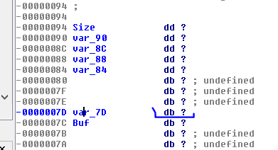

Нужно поменять ей имя с помощью клавиши **N**.

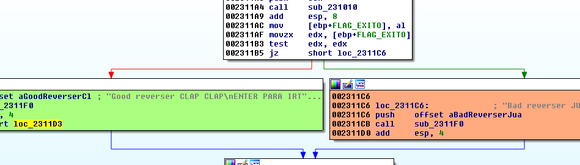

Теперь выглядит намного лучше. Я закрашиваю хорошее сообщение в зеленый цвет, а красным или оранжевым помечаю плохие сообщения.

Очевидно, если бы нам нужно было просто пропатчить этот переход **JZ**, это было бы то место, где нужно было это сделать, но мы будем стараться решить этот крекми правильным способом.

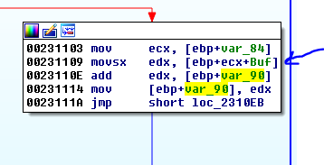

Мы видим, что другая переменная **VAR\_90**, которая тоже обнуляется в начале, складывает байты, которые читаются из буфера **BUF** один за другим и помещает их в регистр **EDX** по адресу **0x231109**, а затем прибавляет его к нулю в первом цикле, и **EDX** всегда накапливает сумму всех байтов. Мы увидим, что он содержит буфера **BUF**, который он читает. Давайте продолжать расследование.

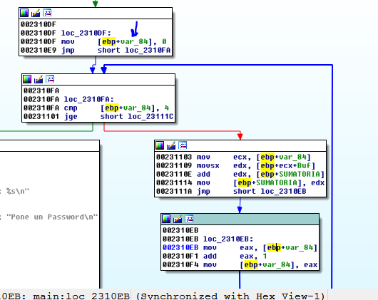

Видно, что **VAR\_84** - это счетчик этого **ЦИКЛА**, который складывает значения. Но видно, что цикл складывает только первые четыре байта, потому что он выходит, когда это значение больше или равно **4**.

Здесь видно этот **СЧЁТЧИК** и как он увеличивается.

Очевидно, этот счётчик также присутствует по адресу **0x231109** для чтения буфера **BUF** с самого начала и нужен для сложения его следующих байтов.

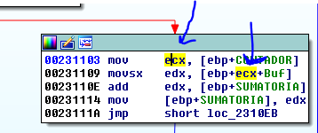

Хорошо, мы уже видели, что этот **ЦИКЛ** читает байты из буфера **BUF**, затем суммирует их и сохраняет эту сумму в **SUMATORIA**. Теперь давайте посмотрим, что находится в **BUF**.

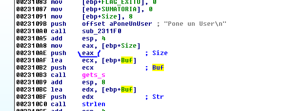

Видно, что размер **BUF** равен **8** байтами и это максимальная длина для имени пользователя. Функция **GETS\_S** используется для получения данных с клавиатуры.

Нам нужно поменять функцию по адресу **0x002310A0** на **PRINTF**.

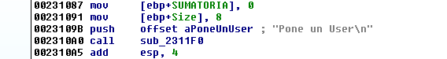

Готово.

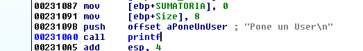

Также, в статическом представлении стека мы видим длину буфера **BUF** с помощью правого щелчка и выбора пункта **ARRAY**.

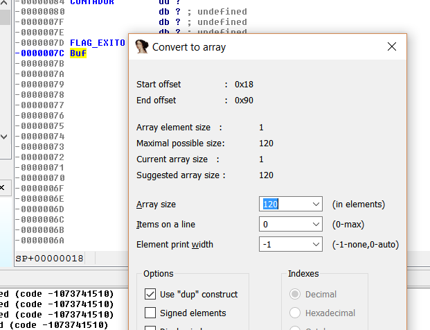

Размер совпадает с исходным кодом.

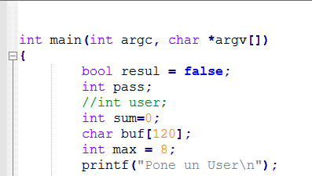

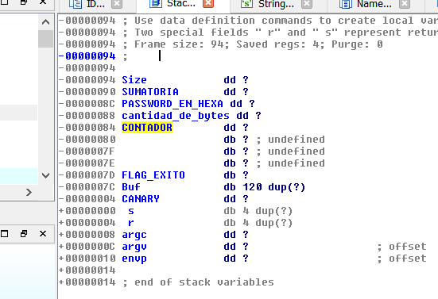

Представление стек становится для нас более ясным.

После получения данных в буфер **BUF**, программа передаёт их в функцию **STRLEN**, чтобы узнать длину данных, которые были введены.

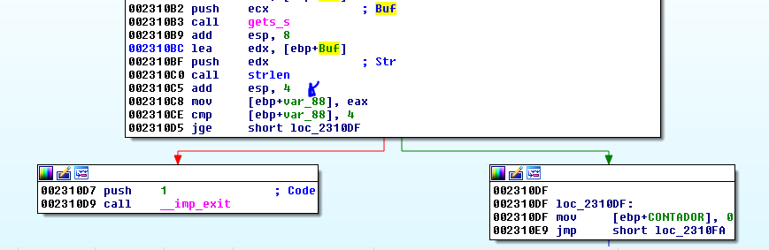

Следовательно, **VAR**\_**88** это количество байт, которые мы вводим.

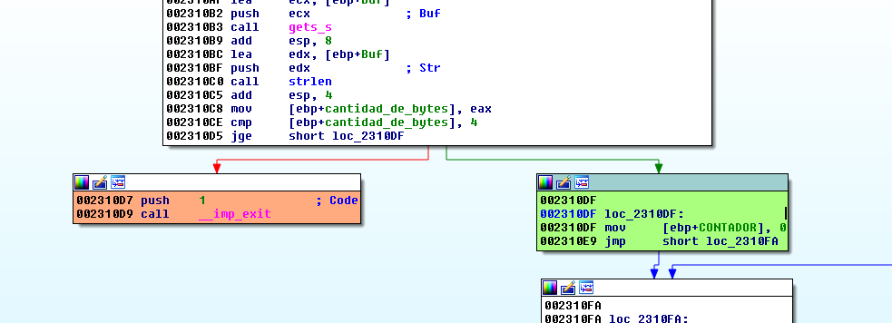

И если длина буфера меньше чем **4,** программа идет на **ВЫХОД**.

Из всего этого, уже можно сделать вывод, что этот **ЦИКЛ** складывает первые четыре байта пользователя, которые мы ввели. Поэтому давайте перегруппируем блоки, для того чтобы они не мешались и смотрелись лучше. Щелкаем в панели каждого блока зажав **CTRL**.

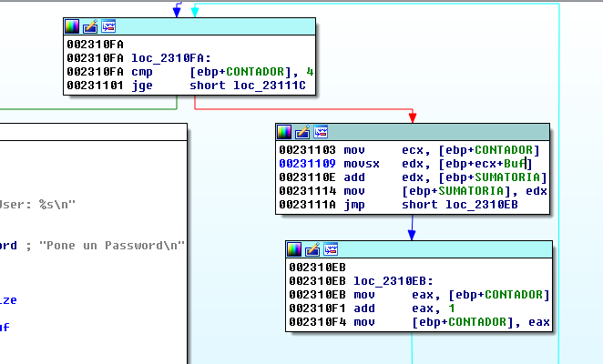

Сейчас выглядит намного лучше. С помощью правого щелчка **GROUP** **NODES** и выбора пункта **UNGROUP** я могу разгруппировать блоки, если нам это понадобится.

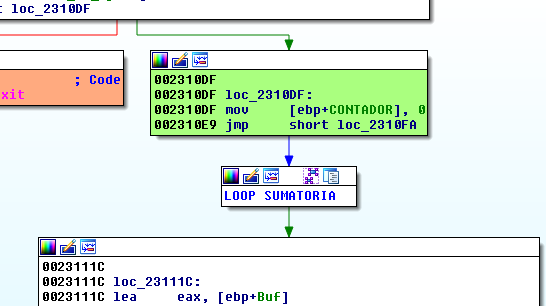

Видно, что цикл снова использует тот же буфер **BUF**, чтобы получить пароль, поскольку он уже сохранил сумму первых **4** байт пользователя.

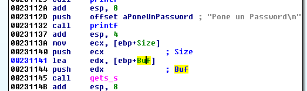

Снова программа использует функцию **STRLEN,** чтобы узнать размер буфера и если он меньше чем **4**, программа отправляет нас на **ВЫХОД**.

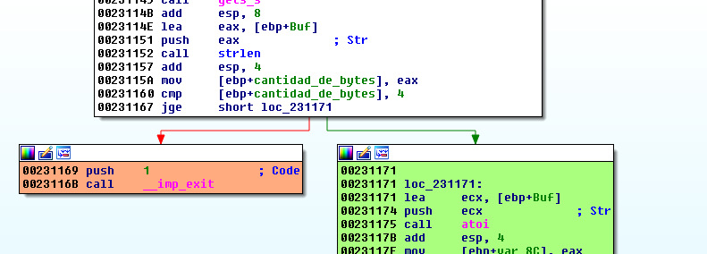

Если размер буфера равен или больше **4**, программа продолжит выполнение с зеленого блока.

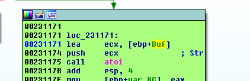

Затем, она берет пароль и конвертирует его в **HEX** значение с помощью функции **ATOI**. В **PYTHON** для этой же цели можно использовать функцию **HEX**.

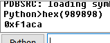

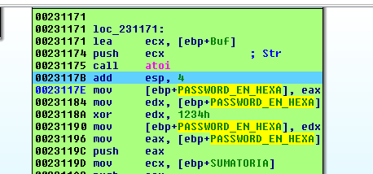

Здесь видно, что пароль **XOR**ится в **HEX** представление с помощью ключа **0x1234** и программа сохраняет его снова в ту же переменную.

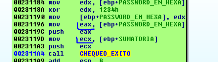

Мы видим, что программа будет сравнивать сумму первых **4** байт пользователя и **HEX** значение пароля обработанное операцией **XOR** с ключом **0x1234** в этой функции, которую мы назовём **CHEQUEO\_EXITO**. Результат функции определит переход программы в хорошее сообщение или плохое.

Здесь, мы видим два аргумента. **ARG\_4** будет тем, который помещается первым.

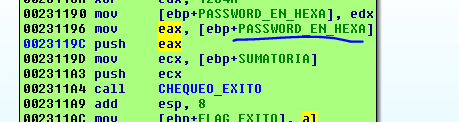

Так что давайте переименуем внутри функции оба этих аргумента.

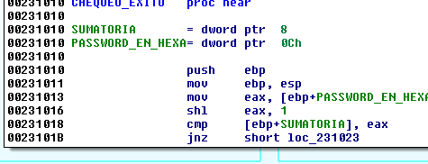

Пришло время правильно настроить аргументы для этой функции, для этого делаем правый щелчок и выбираем **SET** **TYPE**.

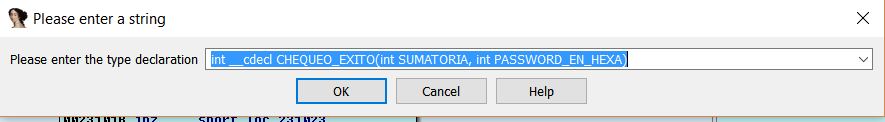

Смотрим на результат после проделанной операции.

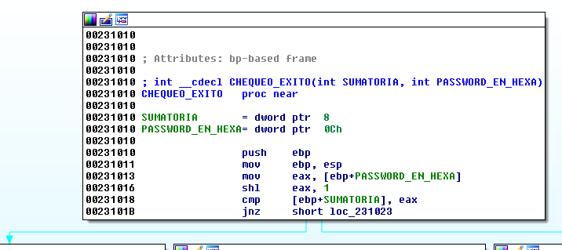

Смотрим, распространились ли теперь ссылки?

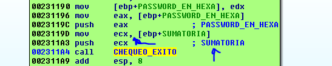

Видно, что синие сообщения, которые появились при распространении имён, соответствуют именам в ссылке, так что всё сработало правильно.

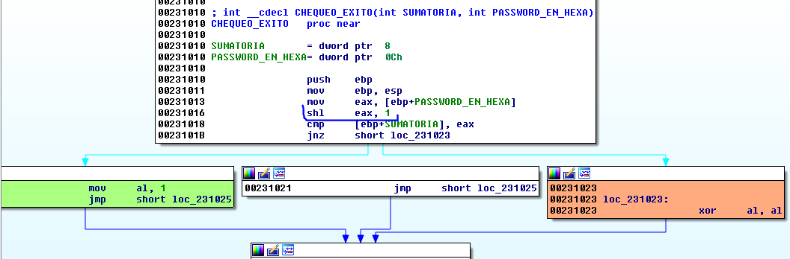

Я вижу, что перед сравнением значений, программа делает **SHL** **EAX**, **1** что равносильно умножению аргумента на **2**.

Значит, если они равны, программа перейдёт в зеленый блок, где она поместит **1** в регистр **AL**, и она будет возвращать значение как флаг **FLAG\_EXITO**, который должен определить, хорошие мы реверсеры или плохие.

Обобщим всё это.

Программа берет первые **4** байта имени **ПОЛЬЗОВАТЕЛЯ** и складывает их.

**ПАРОЛЬ** переводится в **HEX** и он **XOR**ится с помощью ключа **0x1234** и затем умножается на **2**.

Теперь будем делать формулу, предполагая, что мы знаем имя **ПОЛЬЗОВАТЕЛЯ**, так как кейген основан на знании этого имени. С помощью определённого имени **ПОЛЬЗОВАТЕЛЯ**, кейген будет находить соответствующий пароль.

**X** **=** **ПАРОЛЬ** конвертируется в **HEX

\(X** **^** **0x1234\)** **\* 2** **=** **СУММА**

Если поделим на **2

X ^ 0x1234= \(СУММА/2\),** то получится так

**X = \(СУММА/2\) ^ 0x1234**

Функция **XOR** обратима и она работает с членами так:

**A ^ B = C

A = B ^ C**

Хорошо, значение **X**, которое нужно найти, рассчитывается по следующей формуле

**X = \(СУММА/2\) ^ 0x1234**

Если моё имя было бы например **pepe**, которое действительно, потому что оно меньше чем **8** байт, сумма байтов рассчитывалась бы так.

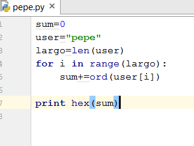

Здесь, мы получили сумму для моего пользователя **pepe**.

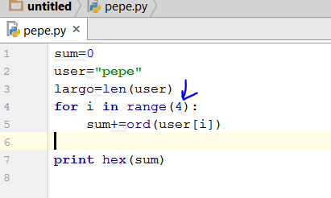

Но мы помним, что не все байты суммируются, а только первые четыре. Подправим наш скрипт.

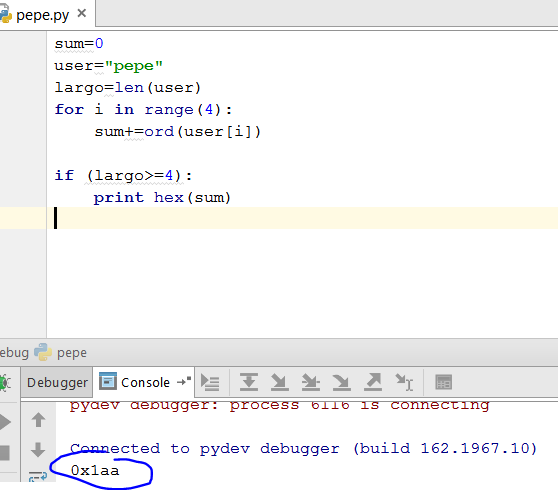

Скрипт теперь выглядит лучше, потому что он проверяет, что имя больше или равно **4** как того просит программа.

Мы можем сделать общий кейген для любого пользователя, имя которого я буду вводить.

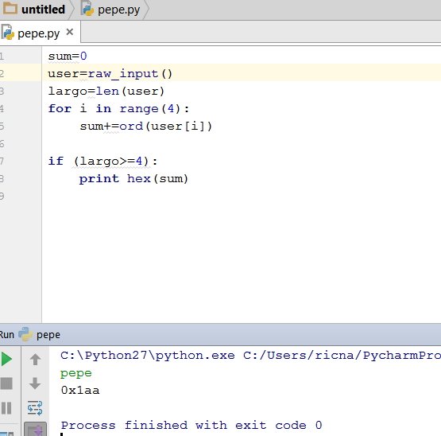

Видно, что используя **RAW**\_**INPUT\(Считывает и возвращает строку входных данных. Прим. Яши\)** мы получаем всё, что мы печатаем через консоль.

Результат для **pepe** схожий. Сумма равна **0x1AA**. Но я могу получить её и для любого пользователя, например **fiaca**.

Мы получаем такую формулу:

**X = \(СУММА/2\) ^ 0x1234**

Поэтому сумма должна делиться на **2** и **XOR**иться с помощью ключа **0x1234**, чтобы находить пароль в **HEX** виде.

Если я пробую это значение, которое подсчитал нам скрипт.

Теперь у нас есть кейген. Сейчас, нам не нужно делать преобразование пароля из **HEX** в десятичное значение, потому что **PYTHON** всегда печатает в десятичном формате по умолчанию.

Мы видим, что скрипт складывает только первые **4** символа имени пользователя. Имя не имеет значения, если пароль больше, но **4** начальных символа похожи.

Поэтому приложение падает при вводе **8** символов, так как имя должно состоять из **8** символов, включая завершающий нуль в конце строки.

До **7** символов программа функционирует хорошо.

Только в ней есть одна проблема, когда сумма получается нечётной.

Уравнение не имеет решения, так как пароль заканчивается умножением на **2** и является умножением целочисленных целых чисел, он никогда не будет нечетным, так что мы добавляем эту проверку в скрипт.

Здесь, мы проверяем остаток от деления на два. Если он равен нулю, это пара не имеет решения.

Я думаю, что наш кейген уже очень хорош. Так что мы можем закончить эту часть и увидимся теперь в следующей.

До встрече в **19**-той части.

Автор текста: **Рикардо Нарваха** - **Ricardo** **Narvaja** \(**@ricnar456**\)
Перевод на английский: **IvinsonCLS \(@IvinsonCLS\)**
Перевод на русский с испанского+английского: **Яша\_Добрый\_Хакер\(Ростовский фанат Нарвахи\).**
Перевод специально для форума системного и низкоуровневого программирования — **WASM.IN
15.10.2017
Версия 1.0**
