# Часть 19

В этой главе, у нас уже достаточно знаний и умений, чтобы реверсить оригинальный крекми **CRUEHEAD**а. Поэтому открываем его в **ЗАГРУЗЧИКЕ**, выключая опцию **MANUAL LOAD**. Исходный файл не упакован, так что нет необходимости загружать его вручную.


Загрузчик остановился здесь. В нашем случае, поскольку это не консольное приложение, то нужно не только анализировать функцию **MAIN**. Мы знаем, что в оконных приложениях существует **ЦИКЛ**сообщений, который обрабатывает взаимодействие пользователя с окном, его выполненные щелчки, нажатия клавиш, движения мыши и т.д. и согласно каждому действию пользователя, цикл запрограммирован для выполнения различных действий с помощью этого кода.

Уже знаем, что первую вещь, которую мы должны сделать - это попробовать найти строки. Если из этого ничего не выйдет, мы должны искать **API** функции или функции, которые использует программа. В нашем случае, строки хорошо видны. Так что будем следовать этому пути.

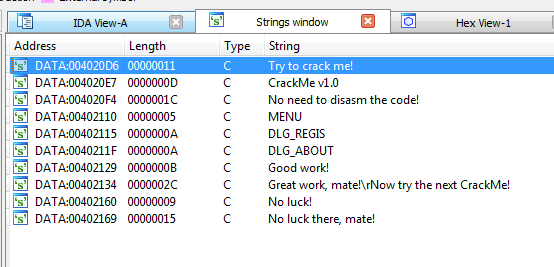

Переходя в строку **NO LUCK**, мы попадаем в область, где программа принимает какое-то решение. Для этого делаем двойной щелчок по этой строке и попадаем в это место.

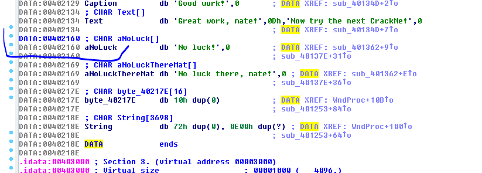

Я могу видеть перекрёстные ссылки с помощью нажатия на клавишу **X** или **CTRL + X**

После нажатия на эту клавишу, видно, что существует две перекрестные ссылки на эту строку.

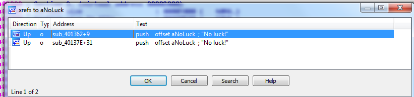

Давайте посмотрим первую из них.

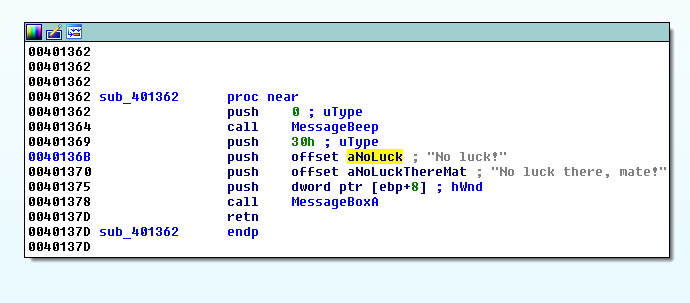

Я закрашиваю этот блок в красный цвет, так как из-за этих инструкций происходит ошибка или плохое сообщение.

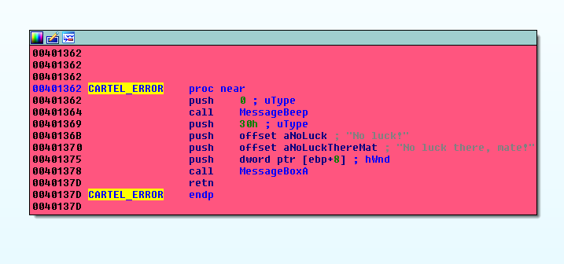

Давайте посмотрим, как в него можно попасть из программы.

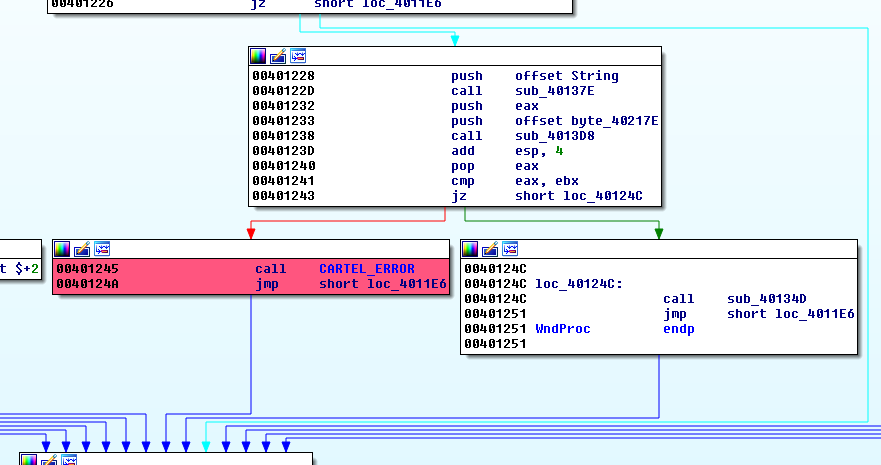

Из этой картинки видно, что соседний блок должен вести в хорошее сообщение. Давайте посмотрим, что внутри этой функции по адресу **0x40134D**.

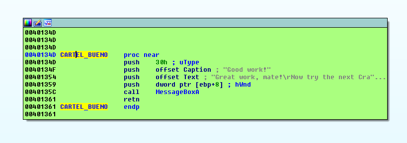

После закрашивания, листинг будет выглядеть так.


Другая перекрёстная ссылка на строку **NO LUCK** указывает сюда.

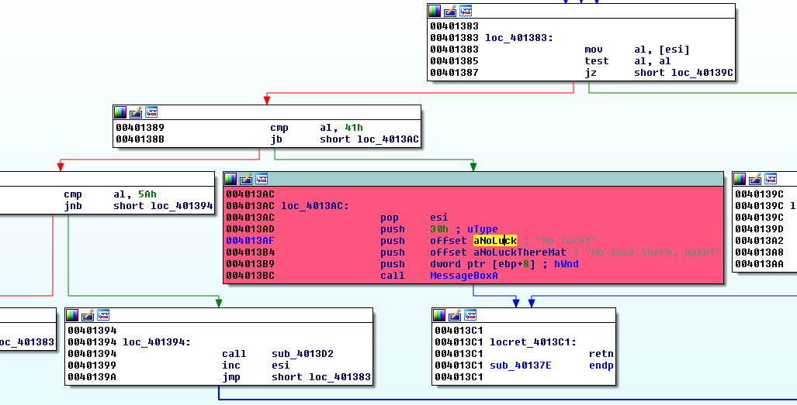

В другое плохое сообщение можно попасть отсюда.

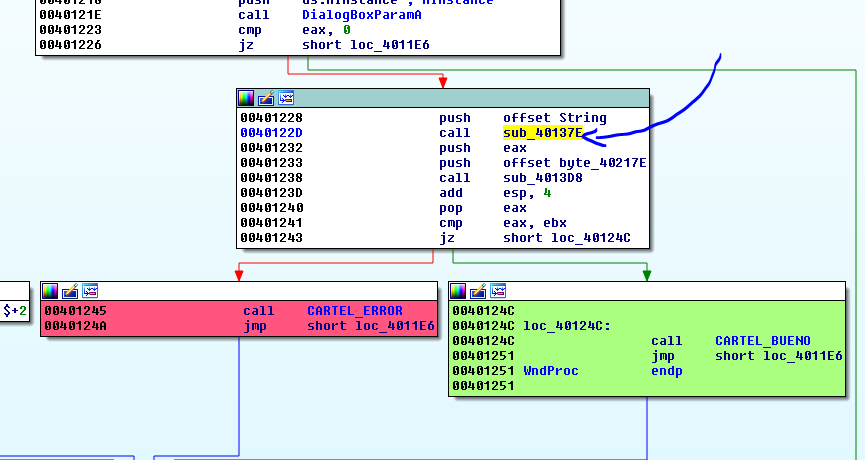
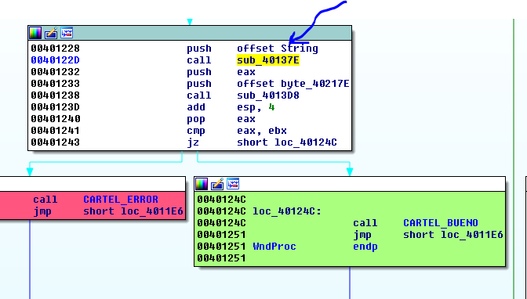

Видим, что аргумент, который передаётся в эту функцию, это адрес \(**OFFSET, СМЕЩЕНИЕ, прим. Яши**\) глобальной переменной, которую мы будем называть **STRING**. Если сделаем щелчок по этой переменной, то перейдём к адресу где она размещена в программе.

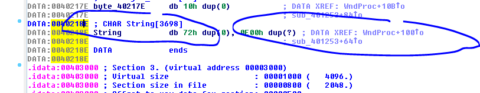

Видно, что это буфер длиной **3698** байт расположенный по адресу **0x40218E** находящийся в секции **DATA**.

Он имеет две ссылки. Чтобы увидеть, где в коде идёт работа с этой переменной, нажимаем **X**.

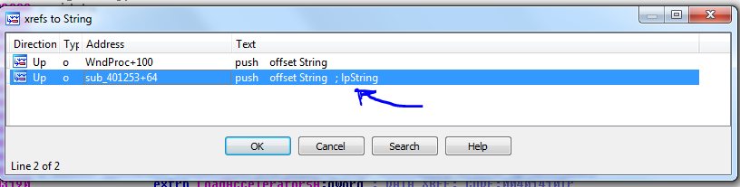

Видим, что существует перекрёстная ссылка, которая ведёт сюда.

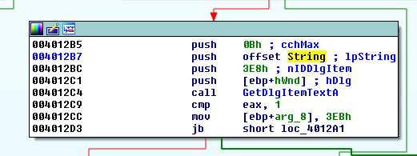

**API** Функция **GetDlgItemTextA** используется для ввода каких либо данных в программу. Давайте посмотрим информацию про неё в **MSDN**.

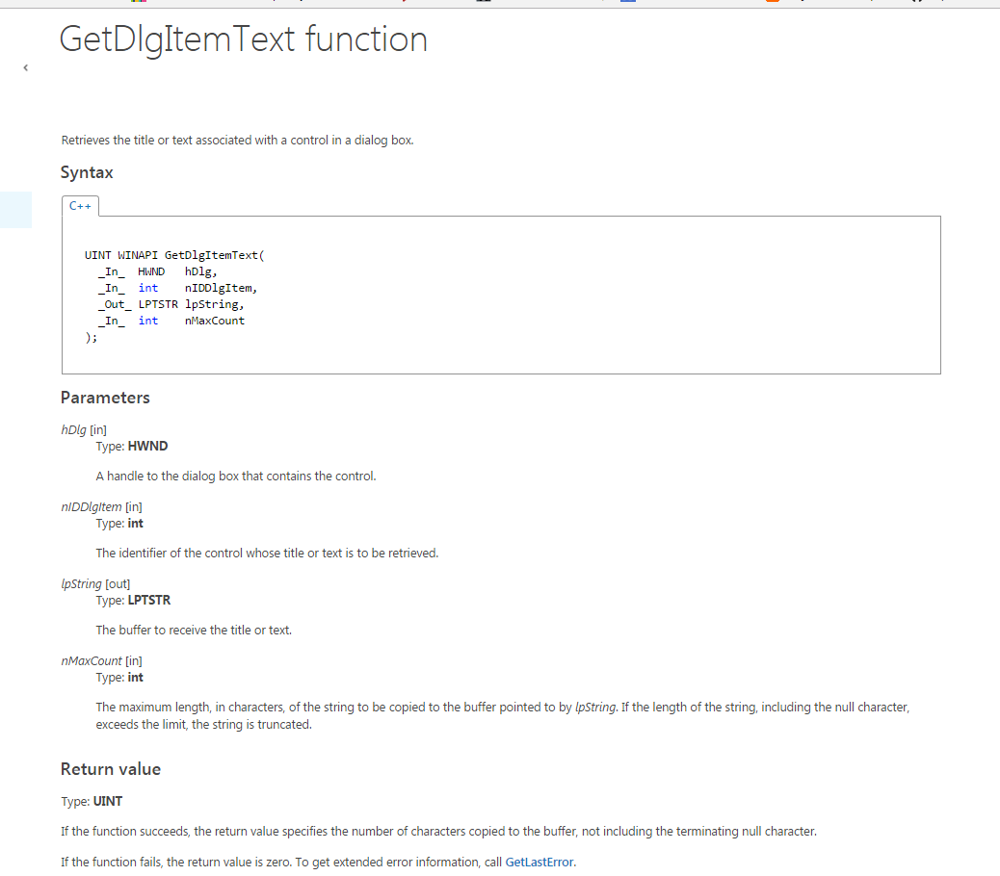

Из описания понимаем, что функция помещает в буфер некоторый текст, который введён в контрол с помощью клавиатуры.

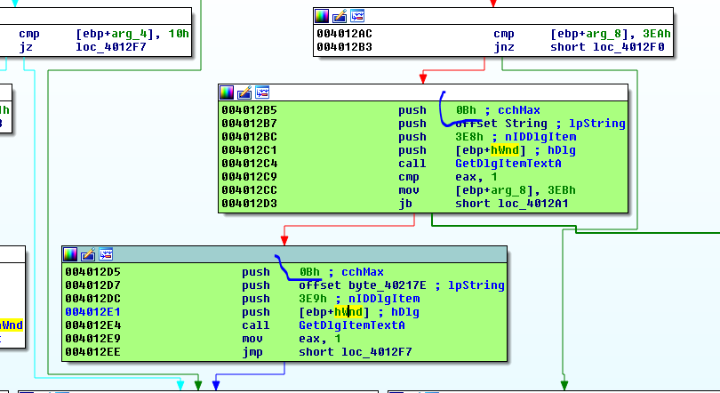

Видно, что существует две записи с тем же дескриптором **HWND**. Следовательно, я предполагаю, что они должны быть полями для ввода имени пользователя и пароля, которые поступают в крэкми, когда мы нажимаем кнопку в окне **REGISTER**.

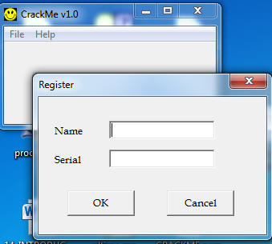

Также, видно, что они имеют такие номера контрола **nIDDlgItem** : **0x3E8** и **0x3E9**.

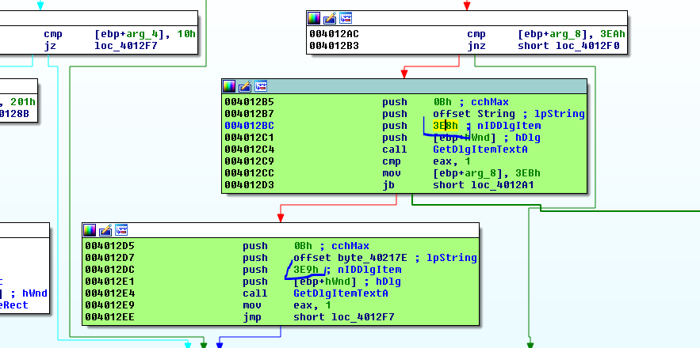

Используя программу **GREATIS WINDOWSE**, можно получить информацию о тех окнах, над которыми находится курсор. Взять её можно здесь.

[http://www.greatis.com/wdsetup.exe](http://www.greatis.com/wdsetup.exe)

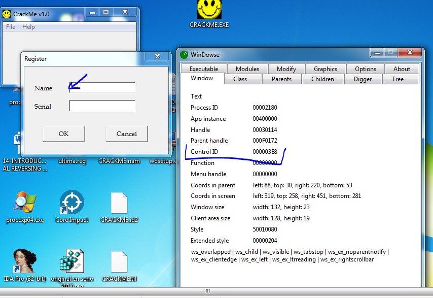

Я вижу, что верхний **EDIT BOX CONTROL** равен **0x3E8**, а нижний - **0x3E9**.

Также, я могу переименовать буферы, в которые попадают введённые строки. Первый будет называться **STRING\_USER**, а второй **STRING\_PASSWORD**. Оба допускают только максимум **0x0B**символов, несмотря на то, что имеют буферы намного больше.

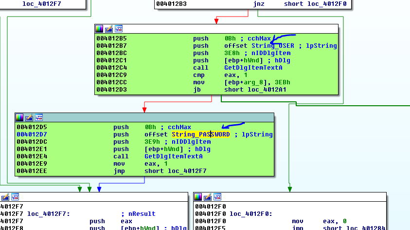

Хорошо, мы уже знаем где программа сохраняет введенный аккаунт, который я вводил. Посмотрим, что она будет с ним делать.

Мы уже видели, что программа обрабатывает буфер **STRING\_USER** здесь.

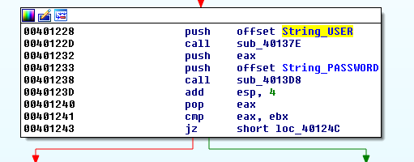

Давайте анализировать, что программа делает здесь с этим буфером, но прежде, мы можем изменить имена функций, так как по-видимому первая обрабатывает буфер **STRING\_USER**, а вторая функция обрабатывает буфер **STRING\_PASSWORD**.

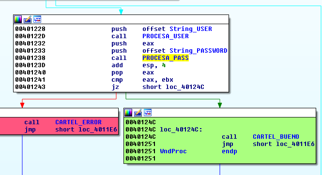

Сейчас давайте анализировать функцию **PROCESA\_USER**.

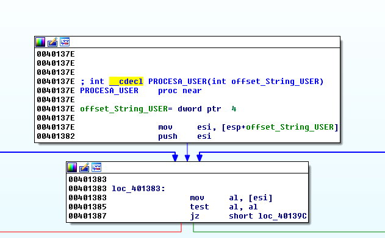

При переименовании переменной, я использую то же самое имя, которое выбрала **IDA**, хотя я мог бы написать **P**\_**STRING**\_**USER**, так как это также указатель на буфер.

С помощью **SET TYPE** я меняю тип функции и её аргументы и обращаю внимание, чтобы аргументы распространились в комментарии.

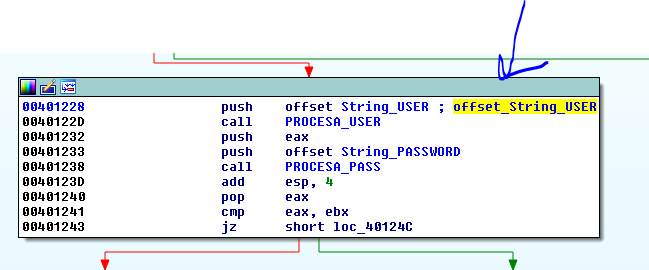

Видим, что пояснение, которое я добавил, совпадает с именем аргумента.

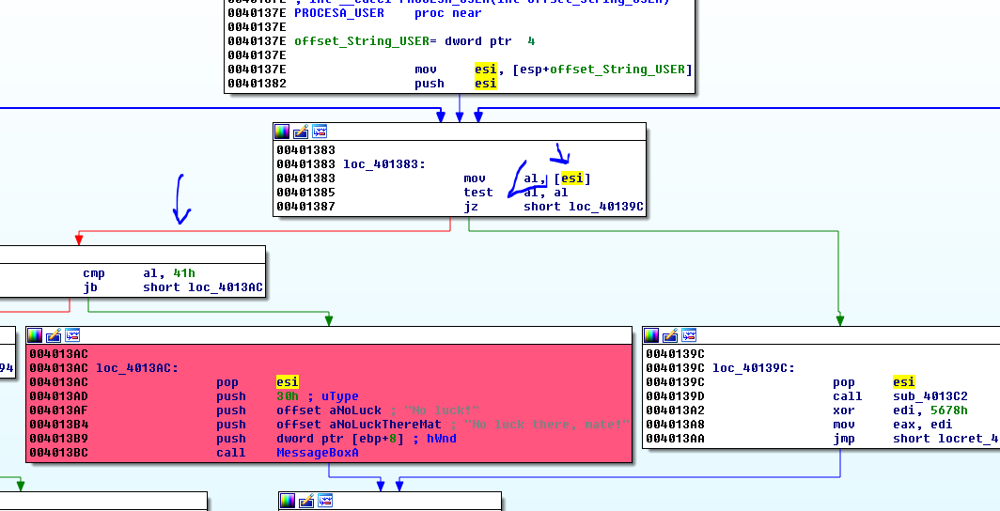

Видно, что существует **ЦИКЛ**, который будет читать **БАЙТЫ** буфера **STRING\_USER**. **ЦИКЛ** будет повторяться, пока он не будет равен нулю, т.е. пока не закончится строка и тогда программа сможет перейти на **ЗЕЛЁНУЮ** стрелку.

Здесь Вы видите **ЦИКЛ**. Он увеличивает **ESI**, чтобы читать побайтно каждый символ буфера **STRING\_USER**, и сравнивает каждый из них с числом **0x41**.

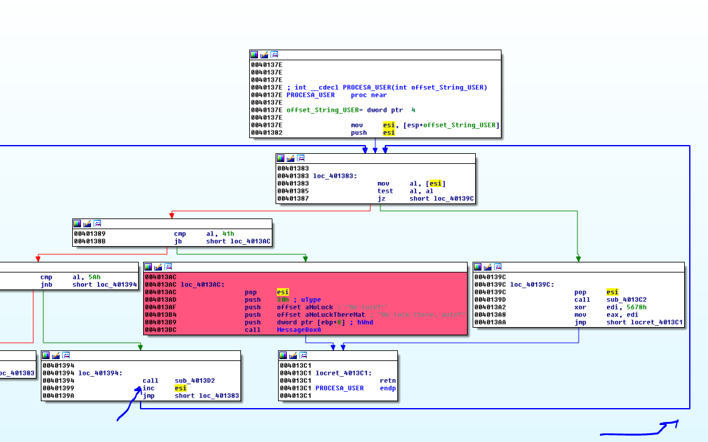

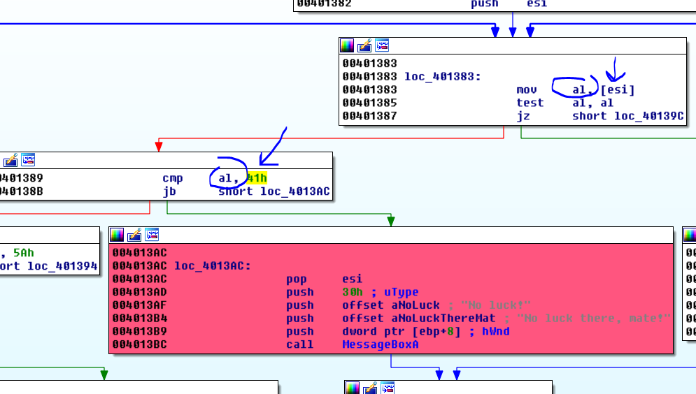

Мы можем сделать правый щелчок по числу **0x41** и изменить его на символ **A**, который является символом **ASCII** для этого значения.

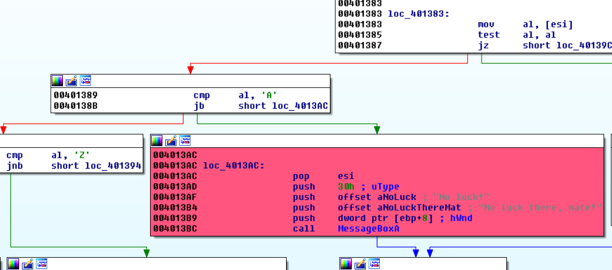

Если значение в **AL** ниже, чем символ **A**, программа перебросит нас в зону **NO LUCK**. Если мы посмотрим в таблицу **ASCII**, увидим, что программа не принимает числа в имени **ПОЛЬЗОВАТЕЛЯ**, а только буквы, так как они больше или равны **A**.

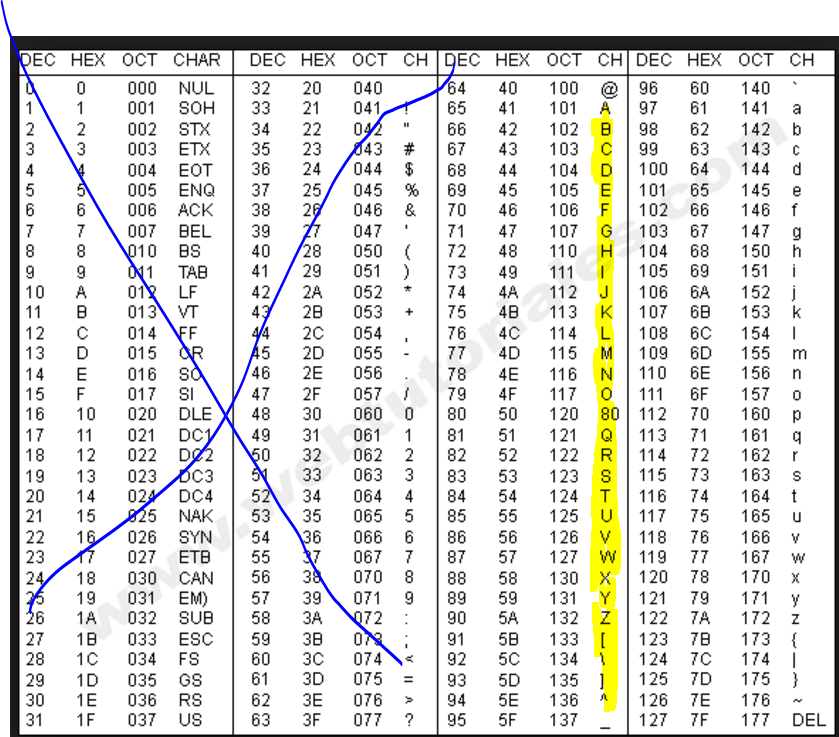

Так что, программа проверяет, чтобы все символы буфера **STRING\_USER** были больше чем **0x41**, т.е. больше или равны символу **A**.

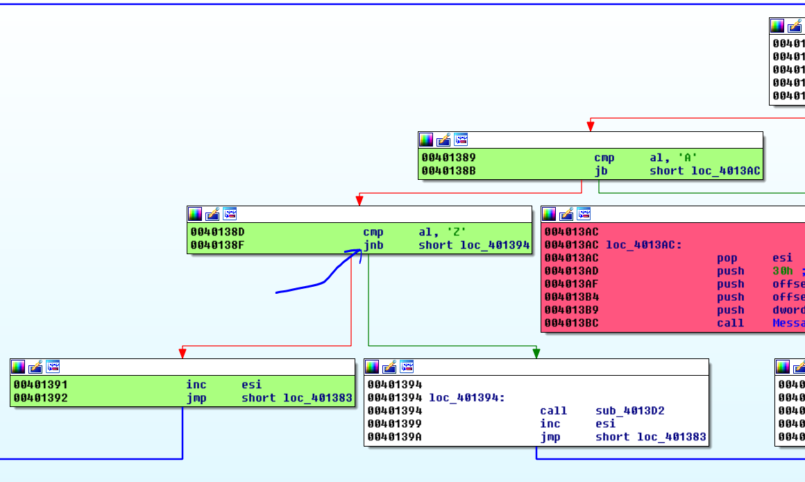

Программа, также, с помощью инструкции **JNB** проверяет, чтобы символ был не ниже символа **Z** и если это так передаёт управление на **БЛОК** по адресу **0x401394**. А если иначе, берет следующий символ и повторяет цикл.

Таким образом, программа обрабатывает все заглавные символы за исключением **Z**. Если символ больше или равен **Z**, то программа переходят в блок по адресу **0x401394**. Давайте посмотрим, что там делает программа.

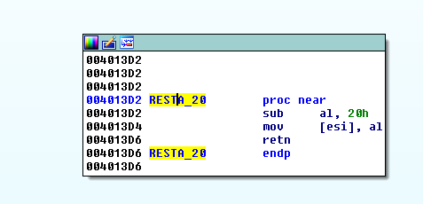

Я назвал эту функцию **RESTA\_20**, потому что это то, что она делает. Если символ больше символа **Z**, программа вычитает из него число, сохраняет результат и выходит из функции.

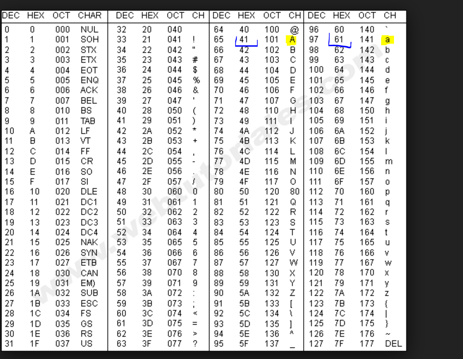

Другими словами, если вы введете символ с кодом **0x61**, что является маленькой буквой "**a**", программа вычтет из значения **0x20**, и получится значение **0x41**, что является большой буквой "**A**".
Программа делает то же самое со всеми символами, которые больше или равны **Z**.

Если символ равен **Z**, то вычитая из него значение **0x20**, получим результат **0x3A**, что является символом двух точек "**:**"

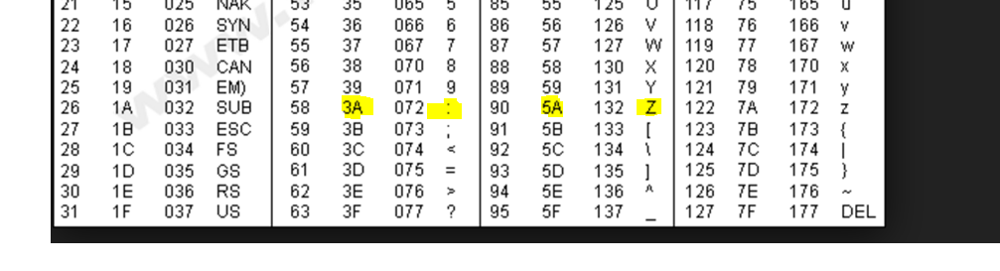

Вопрос таков. Можем ли мы уже создать скрипт для **PYTHON**, чтобы получить кейген?

```python
user=raw_input()
largo=len(user)

if (largo > 0xB):
    exit()

USERMAY=""
for i in range(largo):
    if (ord(user[i]) < 0x41):
        print "CARACTER INVALIDO"
        exit()
    if (ord(user[i]) >= 0x5A):
        USERMAY+= chr(ord(user[i])-0x20)
    else:
        USERMAY+= chr(ord(user[i]))

print "USER",USERMAY
```

Мы видим, что скрипт делает то же самое, что и программа. Он берет по одному символы строки **ПОЛЬЗОВАТЕЛЯ** и сравниваем их с кодом **0x41**. Если символ меньше, он говорит нам, что это недопустимый символ и переносит нас на **ВЫХОД**. Но если он больше или равен **0x5A**, то программа вычитает из него **0x20** и добавляет его к строке **USERMAY**.

Мы видим, что если я введу имя **pePP**, программа транслирует его в имя **PEPP**.

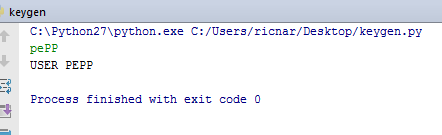

А если я ввожу символ **Z**, скрипт преобразовывает его в символ **":"** как мы и говорили выше.

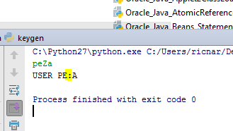

До этого момента, скрипт делает то же самое, что и программа. Посмотрим, что делает программа после выхода из **ЦИКЛА**. Она продолжает выполняться здесь.

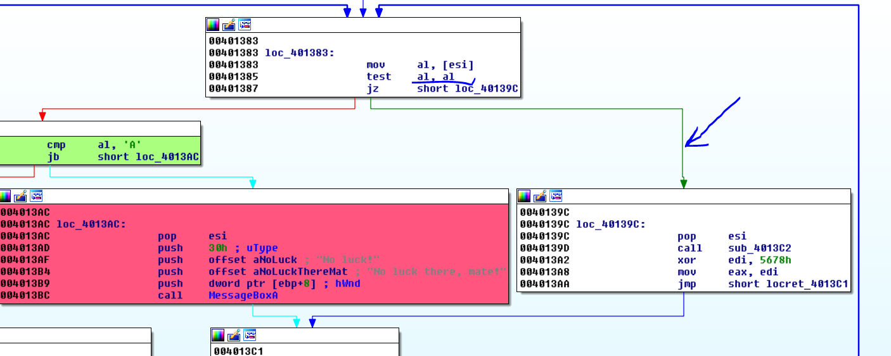

Когда крекми найдёт символ, который равен нулю, он покинет **ЦИКЛ** и перейдёт к блоку по адресу **0x40139C**.

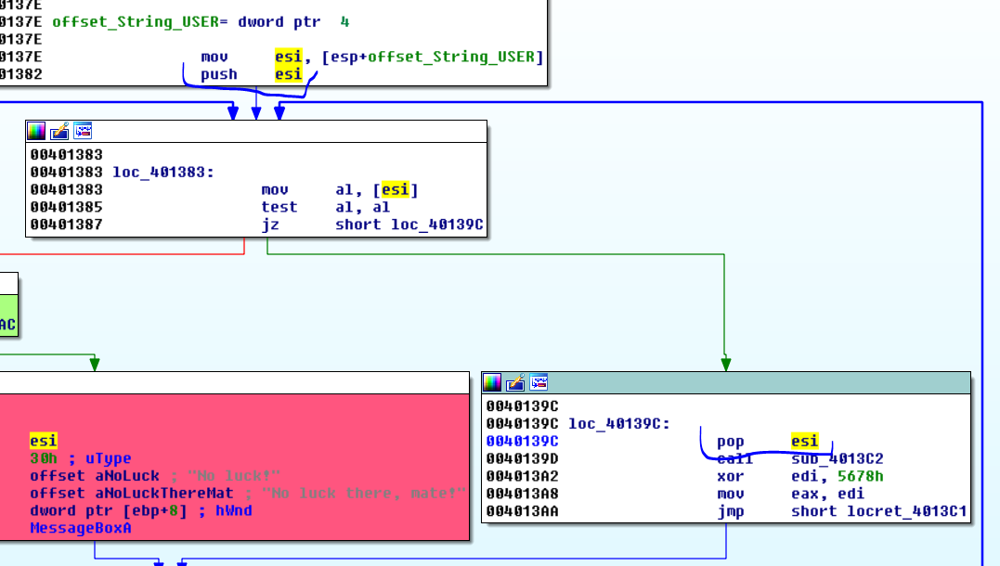

Видим, что перед увеличением **ESI**, крекми **КЛАДЕТ** его в стек, чтобы сохранить исходное значение, которое указывает на начало строки, и затем с помощью инструкции **POP ESI** программа восстанавливает регистр **ESI**, перед тем как войти в функцию по адресу **0x4013С2**.

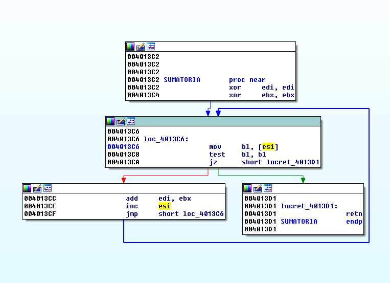

Мы видим, что это **ЦИКЛ**, который складывает все байты, поэтому я буду называть его **SUMATORIA**\(**СУММА**\), так что мы можем добавить этот блок в наш скрипт.

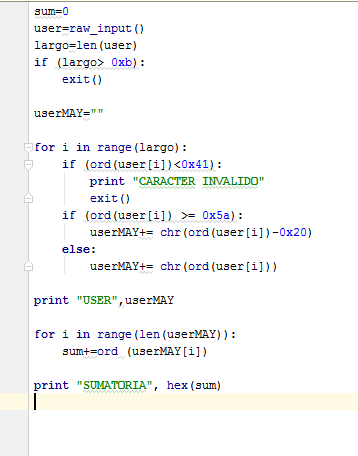

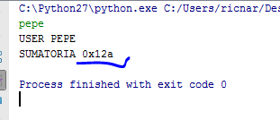

Скрипт суммирует все байты и печатает сумму.

Чтобы проверить правилен ли скрипт, я помещаю **BP** на следующей строке после вызова функции **SUMATORIA** и ввожу **pepe** в поле **user** и **989898** в поле **password**.

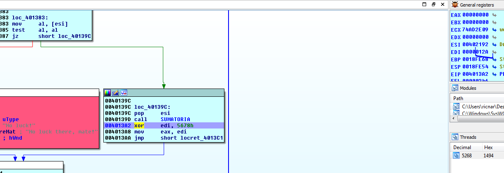

И вижу, что получается сумма равная **0x12A**, так что всё работает правильно.

В этой строке, сумма **XOR**ится с помощью ключа **0x5678**, поэтому я добавляю это выражение также в скрипт.


Если я выполню эту строчку, скрипт про**XOR**ит сумму и результат будет такой же, как и в программе.

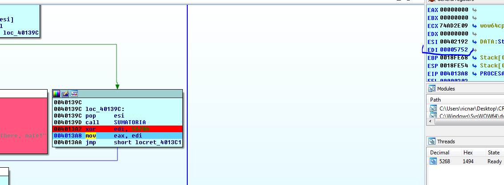

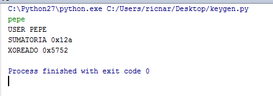

Затем крекми переносит результат из **EDI** в регистр **EAX** и выходит из этого блока.

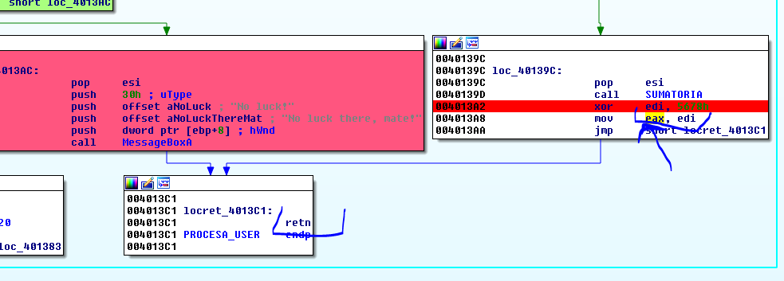

Затем программа **ПОМЕЩАЕТ** регистр **EAX** в стек и восстанавливает его с помощью инструкции **POP EAX** перед окончательным сравнением. Другими словами в инструкции **CMP EAX**, **EBX**, первым членом будет это значение, которое поступает из функции **PROCESA\_USER**.

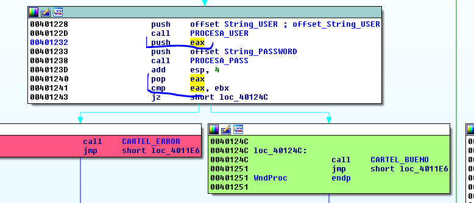

Сейчас давайте посмотрим, что программа будет делать с паролем в функции **PROCESA\_PASS**.

Войдя в неё, мы увидим такой код.

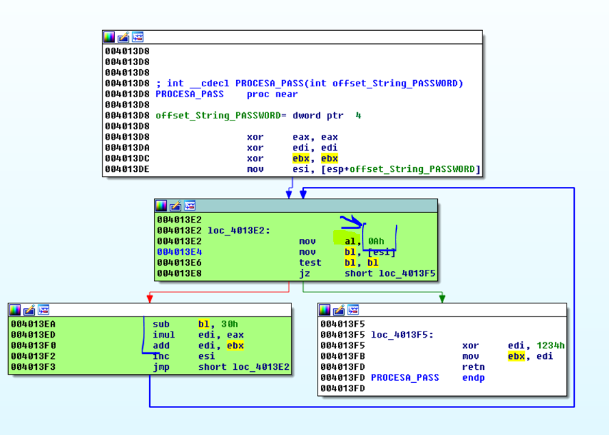

Здесь программа считывает каждый байт и помещает его в регистр **BL** и вычитает из этого значения число **0x30**, которое остается в регистре в **EBX**, затем умножает **EDI** на **0x0A** и суммирует полученное значение с **EBX**.

Я дополняю следующую часть скрипта с помощью этого кода.

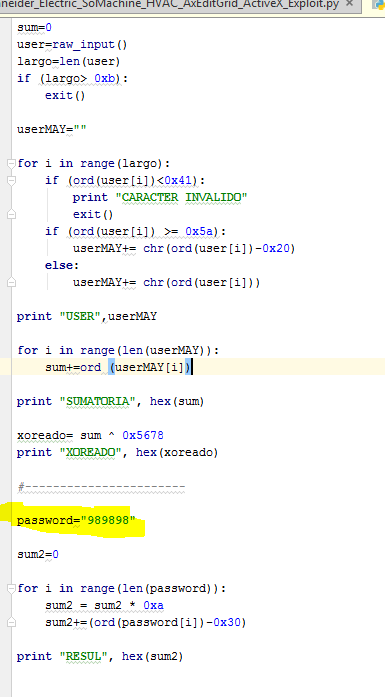

Я не ввожу пароль с клавиатуры. Я просто так его тестирую, потому что в кейгене, мы просто вводим пользователя, но я вижу, что если мой пароль равен например числу **989898**.

**SUM2**, это переменная, в которой хранится сумма умноженная на **0xA** и затем к ней прибавляется очередной байт, из которого вычитается значение **0x30**.

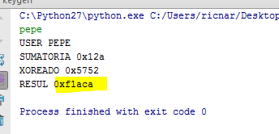

Выполнив скрипт, я вижу, что для пароля **989898** у меня получается результат **f1aca**, что является **HEX** значением строки **989898**.

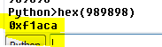

Всё это в нашем скрипте может сводиться в конвертирование строки в **HEX** с помощью функции **HEX\(\)**.

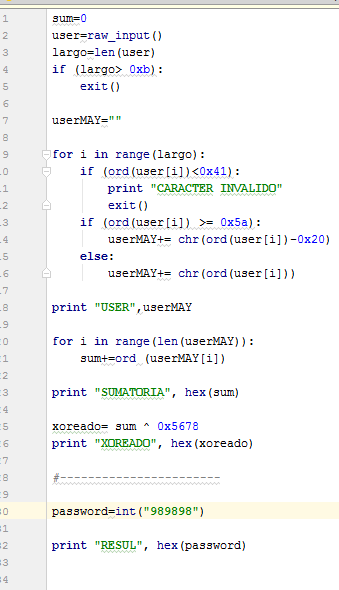

Скрипт даёт мне точно такой же результат.

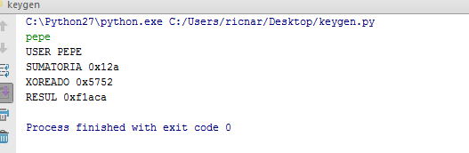

Наконец, скрипт **XOR**ит этот результат с помощью ключа **0x1234** и выходит из блока, чтобы сравнить результат со значением, которое возвратила функция **PROCESA\_USER** в **EAX**.

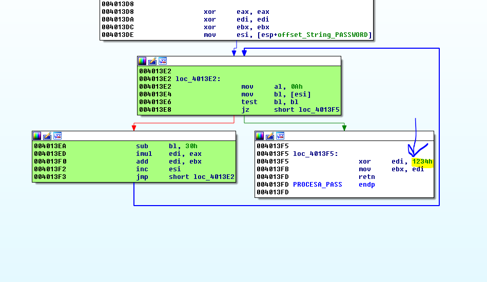

Так что общая формула будет такой:

**HEX\(пароль\) ^ 0x1234 = XOR**

Где **XOR** - это результат, который вернула функция **PROCESA\_USER**.

Немного изменим уравнение:

**HEX\(пароль\) = XOR ^ 0x1234**

Другими словами, если я **XOR**ю результат ключом **0x1234**, я уже почти получаю ответ.

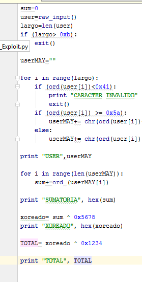

Если запустим скрипт со строкой **PEPE**.

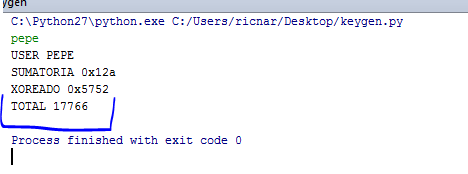

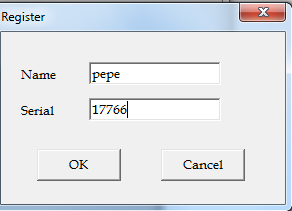


Теперь, у нас уже есть кейген. И нет необходимости преобразовывать результат в десятичную форму, потому что **PYTHON** уже сделал это преобразование.

Здесь я копирую код в кейген.

```python
sum = 0
user = raw_input()
largo = len(user)
if (largo > 0xB):
    exit()
USERMAY = ""
for i in range(largo):
    if (ord(user) < 0x41):
        print "CARACTER INVALIDO"
        exit()
    if (ord(user) >= 0x5A):
        userMAY += chr(ord(user) - 0x20)
    else:
        USERMAY += chr(ord(user))

print "USER",USERMAY

for i in range(len(userMAY)):
    sum += ord (userMAY)

print "SUMATORIA", hex(sum)

xoreado= sum ^ 0x5678

print "XOREADO", hex(xoreado)

TOTAL= xoreado ^ 0x1234

print "PASSWORD", TOTAL
```


Даже в редких случаях с символом **Z**, получаем такой результат:

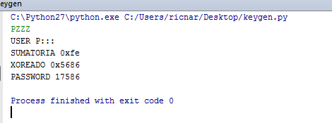

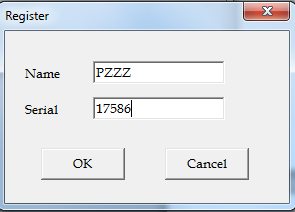

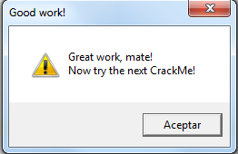

Таким образом, мы отреверсили и сделали кейген для крекми **CRUEHEAD**. Теперь мы увидимся с Вами в **20**-й главе.

До следующей главы, друзья.

* * *

Автор оригинального текста — Рикардо Нарваха.

Перевод и адаптация на английский  язык — IvinsonCLS.

Перевод и адаптация на русский язык — Яша Яшечкин.

Перевод специально для форума системного и низкоуровневого программирования - WASM.IN

22.10.2017

Источник:

[**http://ricardonarvaja.info/WEB/INTRODUCCION%20AL%20REVERSING%20CON%20IDA%20PRO%20DESDE%20CERO/19-INTRODUCCION%20AL%20REVERSING%20CON%20IDA%20PRO%20DESDE%20CERO%20PARTE%2019.7z**](http://ricardonarvaja.info/WEB/INTRODUCCION%20AL%20REVERSING%20CON%20IDA%20PRO%20DESDE%20CERO/19-INTRODUCCION%20AL%20REVERSING%20CON%20IDA%20PRO%20DESDE%20CERO%20PARTE%2019.7z)
