# Часть 21

В **20**-той части, мы оставили упражнение, чтобы проанализировать его позже и узнать было ли оно уязвимым или нет. В списке рассылки **CRACKSLATINOS** было много мнений, я не отвечал там и позволил единомышленникам обсуждать эту тему, оставив решение упражнения и анализ на потом, чтобы дать ответ в этой **21**-ой части.

У нас есть исходный код программы, который может помочь нам при исследовании, **IDB** файл и сам исполняемый файл, который мы можем реверсить в **IDA** и отлаживать, если это необходимо.

Исходный код программы представлен ниже.

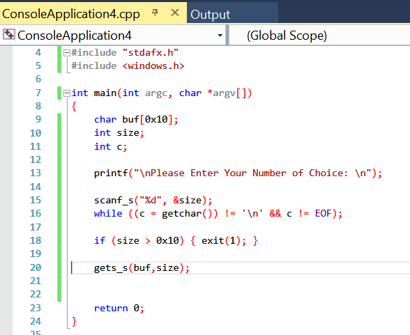

Сначала, мы будем анализировать исполняемый файл в **IDA** статически.

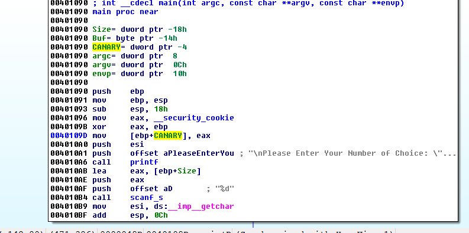

Здесь, у нас есть переменная **CANARY**, которую мы переименуем, как и всегда.

Также, у нас есть буфер **BUF**. Мы видим его размер в статическом представлении стека.

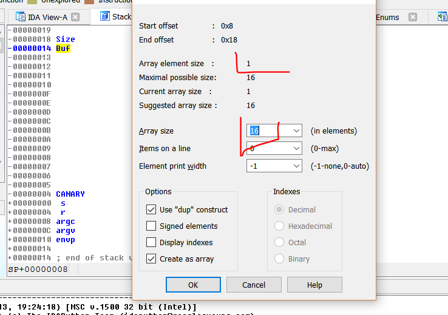

Длина этого буфера равна **16** \* **1**, \(**1** - это размер каждого элемента\) или **16** байт в десятичной системе.

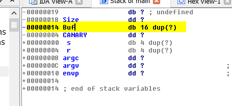

Другими словами, если бы мы могли записать больше **16** байт в этот **БУФЕР**, программа стала бы уязвимой.

**НЕ** путайте основные ошибки или аварийный отказ с уязвимостями. Не всё то, из-за чего падает программа является уязвимостью. Если я выполню такие инструкции:

**XOR** **ECX**, **ECX
DIV** **ECX**

Это будет ошибкой, инструкции будут обнулять **ECX,** делить регистр на этот нуль и вызывать исключение, которое, если не будет обработано, будет вызывать аварийное завершение программы.

Это простой пример аварийного отказа. Существуют несколько типов уязвимостей. Пока же мы рассмотрим самую простую из них, она называется **ПЕРЕПОЛНЕНИЕ** **БУФЕРА В СТЕКЕ**.

Если существует переполнение **БУФЕРА**, способное писать за пределы того места, где заканчивается зарезервированное пространство для данных, то программа будет **УЯЗВИМОЙ**, потому что может случиться **ПЕРЕПОЛНЕНИЕ** **БУФЕРА.** Позже мы увидим, что помимо того, что существует **УЯЗВИМОСТЬ,** она может быть **ЭКСПЛУАТИРУЕМОЙ** или **НЕЭКСПЛУАТИРУЕМОЙ.** Программа может иметь уязвимость и которая, например, **НЕ** **ЭКСПЛУАТИРУЕТСЯ** из-за каких либо программных или системных ограничений, таких как, например, переменная **CANARY**, которая предотвращает эксплуатацию уязвимости, но это тема для следующих частей.

Так что идея состоит в том, чтобы проанализировать может ли этот **БУФЕР** из **16** десятичных байт быть переполнен. Поскольку в нашем случае, чуть ниже **BUF** находится переменная **CANARY** и если мы перезапишем переменную **CANARY** при копировании в буфер данных, очевидно, что существует **ПЕРЕПОЛНЕНИЕ** **БУФЕРА**.

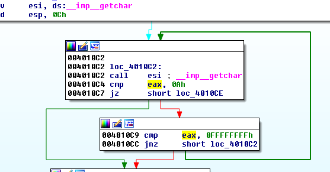

Этот код соответствует такой строке исходного кода.

**while \(\(c = getchar\(\)\) != '\n' && c != EOF\);**

Это строка исходного кода, которая выполняется после функции **SCANF\_S**, чтобы прочитать символ **0xA** из стандартного потока ввода, который является разрывом строки, поэтому программа не беспокоится о последующем его чтении, потому что он остается и не фильтруется. В следующем вызове чтения символов с клавиатуры он не будет работать.

Видим, что программа крутится в цикле, до тех пор, пока она не находит символ **0xA,** который соответствует **ПЕРЕВОДУ** **СТРОКИ** или **LF**.

Непечатаемые управляющие символы:

ASCII код 00 = NULL \(Символ нуля\)
ASCII код 01 = SOH \(Начало заголовка\)
ASCII код 02 = STX \(Начало текста\)
ASCII код 03 = ETX \(Конец текста\)
ASCII код 04 = EOT \(Конец передачи\)
ASCII код 05 = ENQ \(Прошу подтверждения\)
ASCII код 06 = ACK \(Подтверждаю!\)
ASCII код 07 = BEL \(Звонок\)
ASCII код 08 = BS \(Возврат на один символ\)
ASCII код 09 = HT \(Горизонтальная табуляция\)
**ASCII код 10 = LF \(Перевод строки\)**
ASCII код 11 = VT \(Вертикальная табуляция\)
ASCII код 12 = FF \(Прогон страницы, Новая страница\)
ASCII код 13 = CR \(ENTER, Возврат каретки\)

Я думаю, что это происходит, если я не ошибаюсь, потому что в **WINDOWS** при нажатии клавиши **ENTER,** которая имеет код **13** в десятичной системе или **0x0D** в **HEX**, Вы тем заканчиваете ввод символов, но всегда этот символ **0xA** в стандартном потоке ввода, который **???** при следующем вводе с клавиатуры, так как перевод строки также отменяет ввод.

Здесь мы видим скрипт на **PYTHON**, который мы запустим, чтобы проверить это упражнение.

**from** subprocess **import** \*
**import** time
p = Popen\(\[**r'VULNERABLE\_o\_NO.exe'**,**'f'**\], stdout=PIPE, stdin=PIPE, stderr=STDOUT\)

**print "ATACHEA EL DEBUGGER Y APRETA ENTER\n"**
raw\_input\(\)

primera=**"10\n"**
p.stdin.write\(primera\)

time.sleep\(0.5\)

segunda=**"AAAA\n"**
p.stdin.write\(segunda\)

testresult = p.communicate\(\)\[0\]
time.sleep\(0.5\)

**print**\(testresult\)
**print** primera
**print** segunda

Видно, что это скрипт, который использует подпроцесс, чтобы запустить процесс.

p = Popen\(\[**r'VULNERABLE\_o\_NO.exe'**,**'f'**\], stdout=PIPE, stdin=PIPE, stderr=STDOUT\)

Он перенаправляет стандартный поток ввода и вывода, для того, чтобы мы могли посылать ему символы, как если бы я их печатал.

primera=**"10\n"**
p.stdin.write\(primera\)

time.sleep\(0.5\)

segunda=**"AAAA\n"**
p.stdin.write\(segunda\)

Из кода видно, что существует два приглашения для ввода в нашу программу. Первый, это **РАЗМЕР**, который спрашивается у меня. Я ввожу **10** для того, чтобы попробовать c этим значением и затем данные, которые я ввожу с помощью функции **GETS\_S** с **РАЗМЕРОМ**, который мы поместили только что. Я могу ввести меньше чем **10**.

Кроме того, я добавил **RAW\_INPUT**, так что, как только процесс будет запущен, скрипт **PYTHON** остановится, пока не будет нажата клавиша **ENTER**, что позволяет мне присоединить **IDA** к процессу, который будет запускаться и ждать ввода из **STDIN**.

Давайте проверим, работает ли скрипт, как мы задумали?

Запустим его.

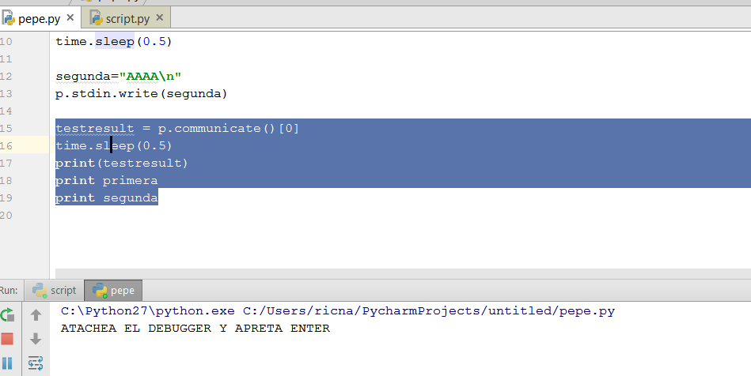

Скрипт останавливается здесь, ожидая, чтобы мы нажали **ENTER**, давая нам возможность присоединить к нему **IDA**.

В **IDA** я открываю файл **VULNERABLE\_O\_NO.EXE** для того, чтобы она проанализировала его в **ЗАГРУЗЧИКЕ** не запуская его в **ОТЛАДЧИКЕ** и затем я выбираю **LOCAL** **WIN32** **DEBUGGER** и иду в пункт **DEBUGGER →** **ATTACH** **TO** **PROCESS**.

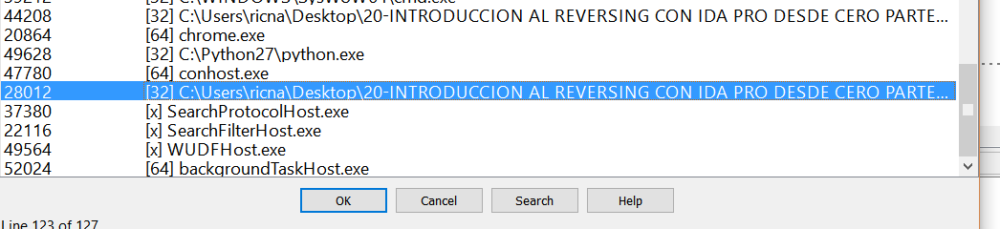

Здесь Вы не видите имя исполняемого файла, потому что имя папки очень длинное, но это он. Я нажимаю **OK** и когда отладчик остановится, я нажимаю **F9** для того, чтобы он **ЗАПУСТИЛСЯ**.

Затем, перед тем как нажать **ENTER** в **PYTHON**, я устанавливаю **BP** после первого ввода с клавиатуры, так как там я буду ожидать процесс и смогу остановиться только того, как он вернётся назад из этого ввода.

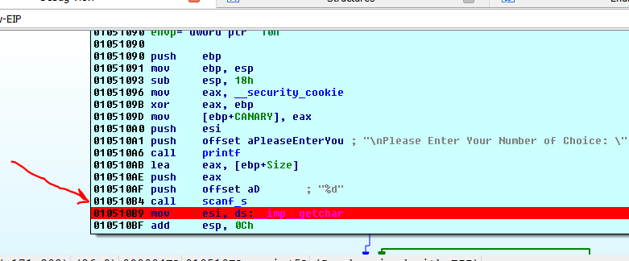

Здесь я устанавливаю **BP** и затем в **PYTHON** я нажимаю клавишу **ENTER**.

Видно, что отладчик остановился на нашем **BP**.

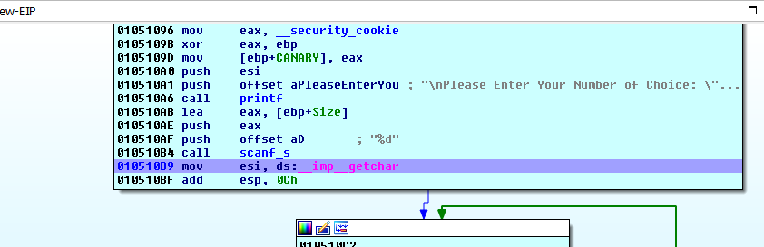

Если Вы поместите курсор над переменной **SIZE**, которая является переменной в которую мы вводим значение через функцию **SCANF\_S.**

Здесь, в переменной **SIZE** находится значение **10** \(**0xA**\), которое я ввёл через скрипт.

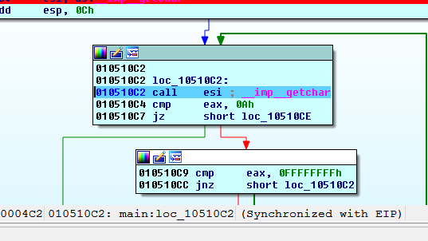

Если я пойду в функцию **GETCHAR**, то узнаю, что на самом деле, что я не передавал никакой символ **0xA** в скрипт.

primera=**"10\n"**
p.stdin.write\(primera\)
time.sleep\(0.5\)

segunda=**"AAAA\n"**
p.stdin.write\(segunda\)

так как символ **”\n”** это то же самое что и **ENTER \(0x0D\)**.

Но если я трассирую функцию **GETCHAR** с помощью **F8**, чтобы пропустить этот **CALL** и не захожу в эту функцию.

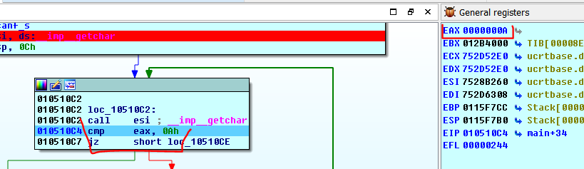

В регистре остался символ **0xA**, который я не вводил и который при чтении символа удаляется из **STDIN** и очищает **STDIN** для следующего ввода с клавиатуры.

Видим, что программа сравнивает мой размер буфера **0xA** с максимальным возможным размером **0x10** и поскольку моё значение меньше, то программа идёт сюда.

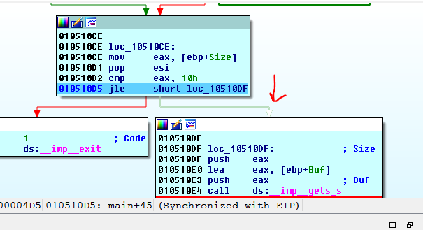

Когда я трассирую функцию **GETS\_S** с помощью **F8.**

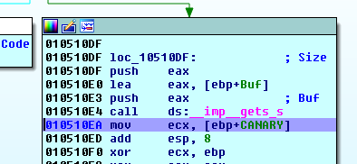

Если я помещаю курсор мыши над буфером **BUF**.

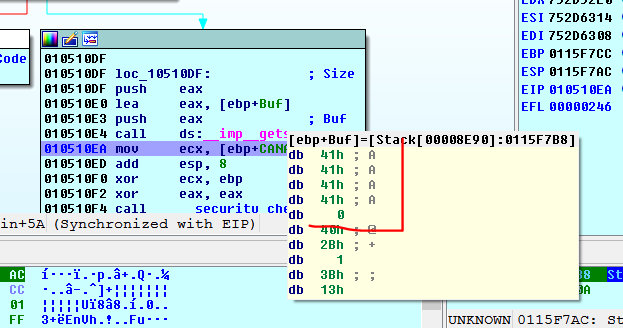

Я вижу, что cледующие символы **A**, которые я передал в скрипт присутствуют, так что скрипт работает и позволяет мне тестировать и отлаживать то, что происходит.

Если я запущу скрипт снова и когда я дойду до функции **GETCHAR**, я пропущу эту функцию, изменяя **EIP** для того, чтобы не читать символ **0xA**.

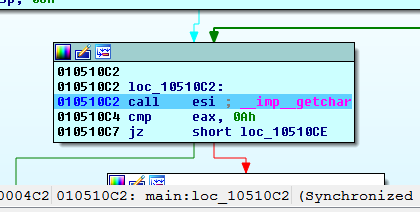
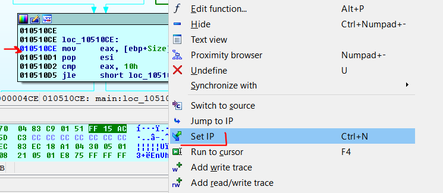

Мы меняем **EIP** на этот адрес, чтобы скрипт не фильтровал символ **0xA**, чтобы видеть что происходит.

Когда я трассирую функцию **GETS\_S,** я вижу, что сейчас я ничего не ввожу.

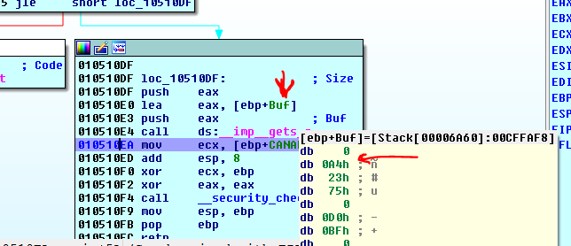

Это означает, что символ **0xA**, который остался в **STDIN**, должен быть отфильтрован после определенных записей, чтобы он не влиял на последующие записи, вот почему строка кода верна.

**while \(\(c = getchar\(\)\) != '\n' && c != EOF\);**

Также, сейчас, когда у нас есть скрипт, мы можем анализировать аварийный отказ программы, который возникает в функции **GETS\_S**, когда я ввожу максимальный размер, чтобы увидеть, если ещё что-то произойдёт или это просто сбой.

primera=**"16\n"**
p.stdin.write\(primera\)
time.sleep\(0.5\)

segunda=**"A"** \*16 + **"\n"**
p.stdin.write\(segunda\)

Я буду смотреть, что случится в этом случае с такими данными.

С этими введёнными данными я прибываю сюда.

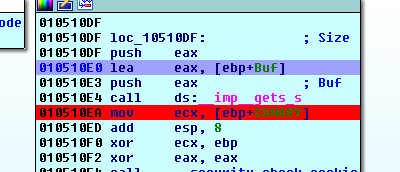

После исполнения инструкции **LEA**, я получаю адрес где начинается буфер, в моём случае это адрес **0x0115FDD8**.

Я сделаю двойной щелчок на переменной **CANARY** и буду нажимать **D** до тех пор пока тип переменной не станет **DWORD** \(**DD**\). Также я могу отметить адрес, в моём случае он равен **0x0115FDE8** и значение **CANARY** в этом случае будет равно **0x965FA1F4**.

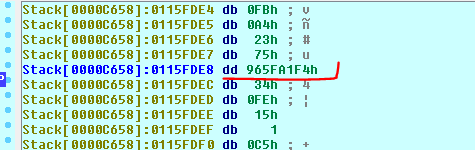

Теперь нажимаем **F9**.

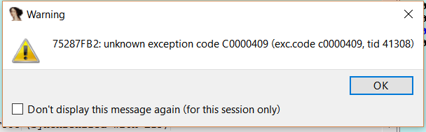

Происходит исключение, которое создаётся **API** функцией **WINDOWS**, я нажимаю **OK**.

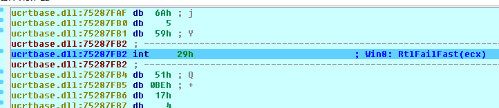

Вот оно. Давайте пойдём с помощью **G** и введем адрес буфера и затем адрес **CANARY**, чтобы увидеть, что произошло.

Видно, что переменная **CANARY** не повреждена.

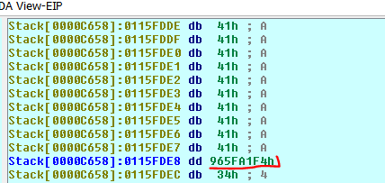

И буфер был заполнен. Так что ввод максимального значения не вызывает переполнение. Верно то, что буфер был заполнен полностью и не остаётся конечного нуля строки, который может вызвать проблемы, если программа продолжит выполняться. Но в этом случае исключение не обрабатывается и программа закрывается. Так что это просто крэш.\(также я думаю, что программа помещает нуль в начале буфера, для того чтобы аннулировать строку\)

Если программа обрабатывает исключение и продолжает выполняться, она должна отбрасывать данные из буфера, потому что, если она возьмет эти данные и будет использовать их как строку, которая не имеет завершающий нуль, программа смогла бы добавлять данные, которые находятся ниже в стеке и вызвать проблемы. Но путём установки нуля в начале буфера программа аннулирует также данные.

Хорошо, уже зная, что здесь нет переполнения, вернемся в статический анализ.

Давайте сосредоточимся на этой части.

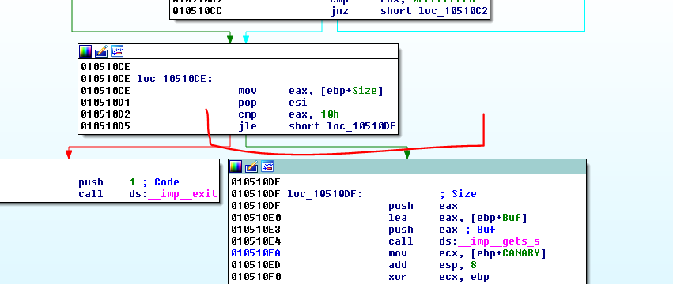

Мы сказали, что переход **JL** или **JLE** рассматривает знак или другими словами **EAX** может быть отрицательным. Если, например, **EAX** был бы равен **0xFFFFFFFF**, что также равно и -**1** и был бы меньше чем **0x10**.

Это означает, что если программа передаст переменную **SIZE** как -**1**, была бы возможность выполнения сравнения. Давайте посмотрим этот пример.

primera=**"-1\n"**
p.stdin.write\(primera\)
time.sleep\(0.5\)

segunda=**"A"** \*0x2000 + **"\n"**
p.stdin.write\(segunda\)

Давайте запустим скрипт с этими значениями \(размер **-1**\).

Когда Вы остановитесь на **BP**.

Посмотрим значение переменной **SIZE**.

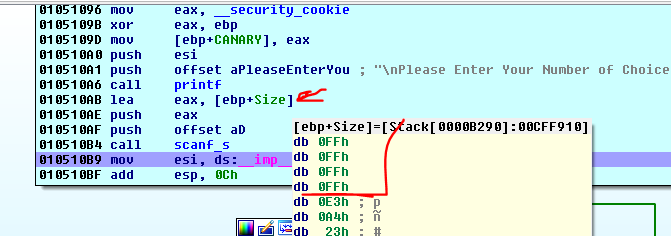

Видим, что значение равно **0xFFFFFFFF.** Если я сделаю двойной щелчок на переменной **SIZE** и нажму **D**, чтобы группировать её до тех пор, пока она не станет типом **DWORD**.

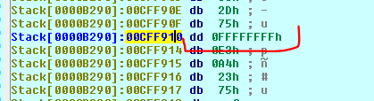

Давайте продолжим трассировать до сравнения.

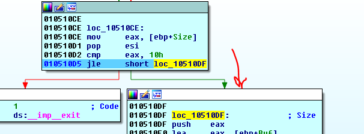

Видно, что поскольку значение **0xFFFFFFFF** это то же самое, что и значение **-**1, и когда программа рассматривает знак, то знак не фильтруется и она продолжает читать эту переменную **SIZE**.

На самом деле, в функции **GETS\_S** и подобных ей, таких, как **MEMCPY** и любой **API**, которая копирует или вводит байты, размеры интерпретируются как **UNSIGNED**, потому что не существует отрицательных размеров, поскольку Вы не можете ввести или скопировать -**1** байт, это просто невозможно. Программа интерпретирует такое число как **0xFFFFFFFF** как большое положительное, которое будет приводить к переполнению.

Я снова ищу, где находится буфер. В этот раз он расположен по адресу **0x00CFF914**.

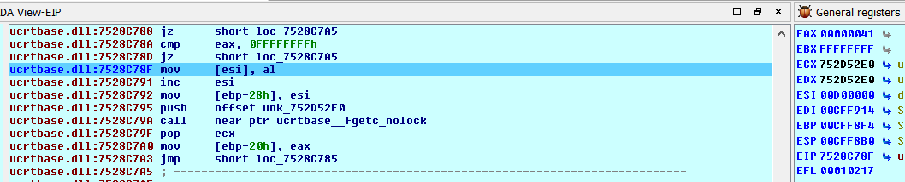

Если я пойду в адрес, где начинается буфер.

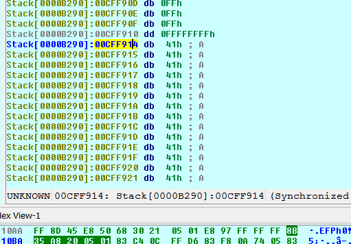

Мы можем увидеть лучше, сколько байт скопировала программа, если я преобразую эти данные в строку. В начале строки я нажимаю клавишу **A**.

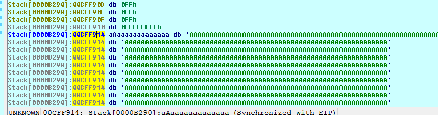

Теперь я вижу очень-очень много байтов, которые мы ввели.

И если я преобразую их в **ARRAY**.

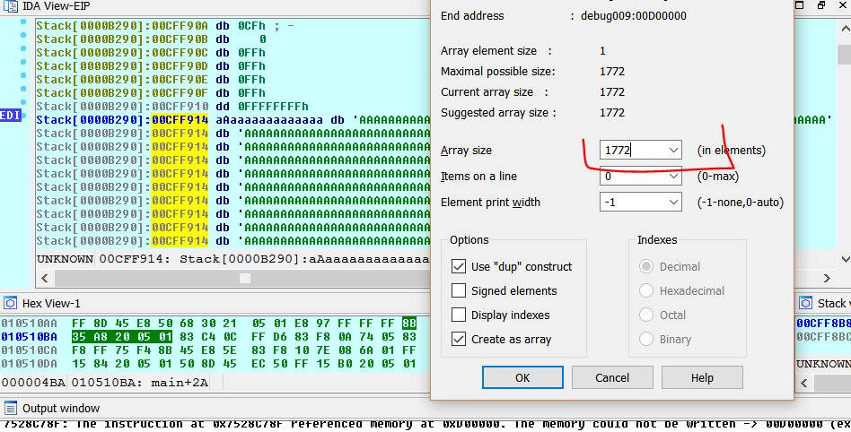

Я вижу, также, что введенные данные достигли конца стека, перезаписывая переменную **CANARY** и все остальное.

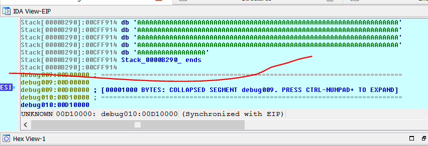

Программа заполняет память стека с помощью символа **A** до самого его дна. Чуть ниже я вижу, что стек уже переходит на другую секцию под именем **DEBUG009**.

С помощью этого, мы проверяем, что программа уязвима. Как сейчас это можно исправить? Очевидно, если вместо использования перехода **JL** или **JLE**, который учитывает знак, использовать переход **JB** или **JBE**, который не учитывает его и если мы поместим значение -**1**, которое также равно значению **0xFFFFFFFF,** то в сравнении программа будет брать это значение как большое положительное и оно будет больше, чем **0x10** и программа выйдет из сравнения.

В исходном коде это выглядело бы так.

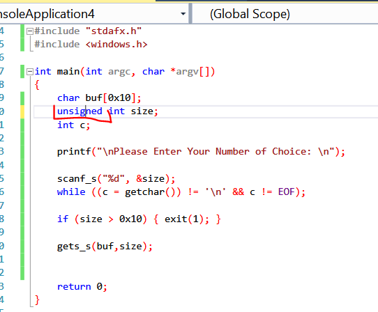

Единственное слово преобразует программу из **УЯЗВИМОЙ** в **НЕУЯЗВИМУЮ.** Давайте откомпилируем новую версию.

**NO\_VULNERABLE.EXE** - так называется новая исправленная программа.

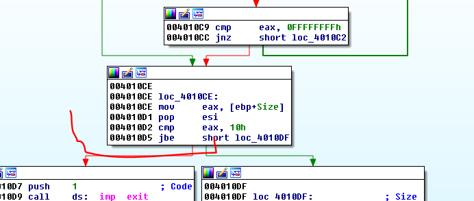

Мы видим, что просто меняя тип переменной на **UNSIGNED** при компиляции меняется тип перехода, который не учитывает знак.

Я исправляю скрипт, меняя имя для того, чтобы загрузить новый исполняемый файл. Оставляем оставшуюся часть такой же.

Я анализирую новый исполняемый файл в **IDA** в **ЗАГРУЗЧИКЕ** и затем я запускаю скрипт и перед тем как нажать **ENTER**, я присоединяю **LOCAL** **DEBUGGER** и устанавливаю **BP** на сравнении переменной **SIZE** для того, чтобы отладчик остановился там, чтобы увидеть, что происходит.

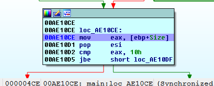

Если посмотрим в переменную **SIZE**, то значение все ещё равно **0xFFFFFFFF**.

Но если продолжу трассировать.

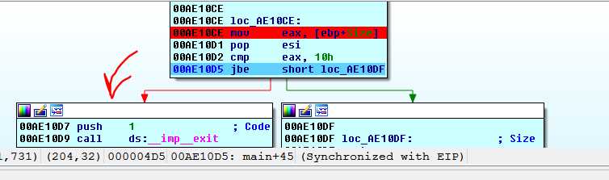

Сейчас, программа направляется в блок с **EXIT** и переполнение предотвращается, так как инструкция **JBE** рассматривает значение **0xFFFFFFFF** как большое положительное число, которое больше чем **0x10** и не учитывает знак.

Следовательно, ответ на упражнение состоит в том, что программа была **УЯЗВИМОЙ** и что уязвимость исчезает путем изменения типа переменной **SIZE** c **INT**, который является **SIGNED\(ЗНАКОВЫМ\)**на **UNSIGNED** **INT\(БЕЗЗНАКОВЫМ\)**, тем самым меняется переход **JLE** на **JBE**, который учитывает знак, а другой это не делает.

Увидимся в **22**-ой части.

Автор текста: **Рикардо Нарваха** - **Ricardo** **Narvaja** \(**@ricnar456**\)
Перевод на английский: **IvinsonCLS \(@IvinsonCLS\)**
Перевод на русский с испанского+английского: **Яша\_Добрый\_Хакер\(Ростовский фанат Нарвахи\).**
Перевод специально для форума системного и низкоуровневого программирования — **WASM.IN
08.11.2017
Версия 1.02**
