# Часть 22

## РАЗЛИЧАЯ

**DIFFER** (далее — **Дифер**, прим. **Яши**\) — это программа, которая из двух последовательных версий одного и того же файла, пытается найти различия в функциях, несмотря на изменения и пытается показать нам какие функции были изменены и где.

Очевидно, эта не простая работа. Особенно, когда между версиями было много изменений, которые могут появиться в приложение из-за патча безопасности, для того, чтобы устранить какую-нибудь уязвимость, а также, могут быть появится улучшения в программе, такие как добавление в интерфейс какого-нибудь функционала или это просто общие изменения в программе, и т.д.

Поскольку мы будем работать с разными **ДИФЕРАМИ**, мы должны знать, что чем больше и больше было изменений в исполняемом файле, то и работа получается более неприятной, так как **ДИФЕР** совершает некоторые ошибки при сравнении.

Давайте рассмотрим три наиболее известных **ДИФЕРА**, которые мы будем использовать в основном для установки и знакомства с ними. Каждый имеет свою сильную и слабую сторону. Иногда, в сложных случаях, придётся использовать более одного **ДИФЕРА**, для того, чтобы прояснить ситуацию.

## BINDIFF

Первый **ДИФЕР**, который мы будем устанавливать, называется **BINDIFF**.
\(Совершенно недавно он стал бесплатным — прим. Яши\)

[https://www.zynamics.com/software.html](https://www.zynamics.com/software.html)

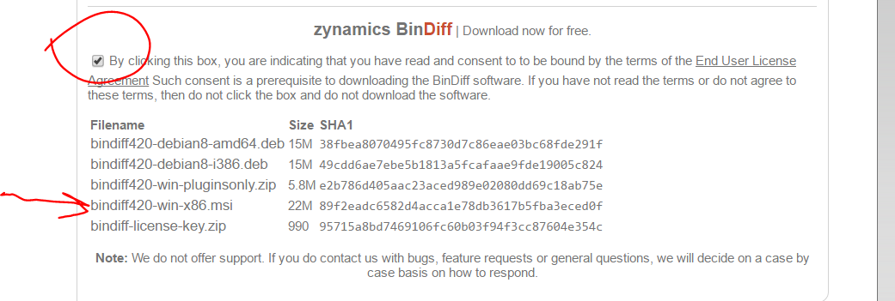

Отсюда его можно загрузить, просто соглашаясь с условиями использования.

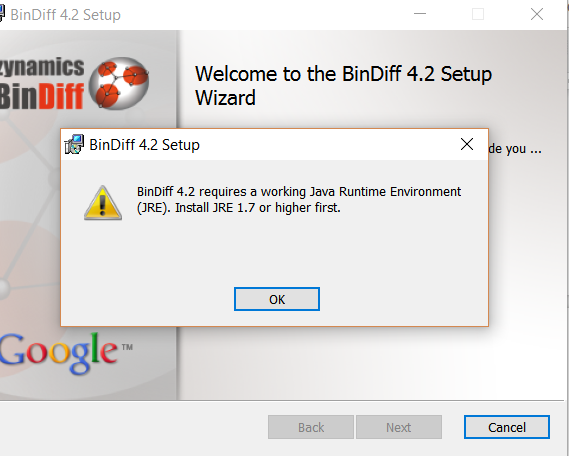

Хорошо, также загружаем **JAVA**, если у нас её нет на нашей машине.

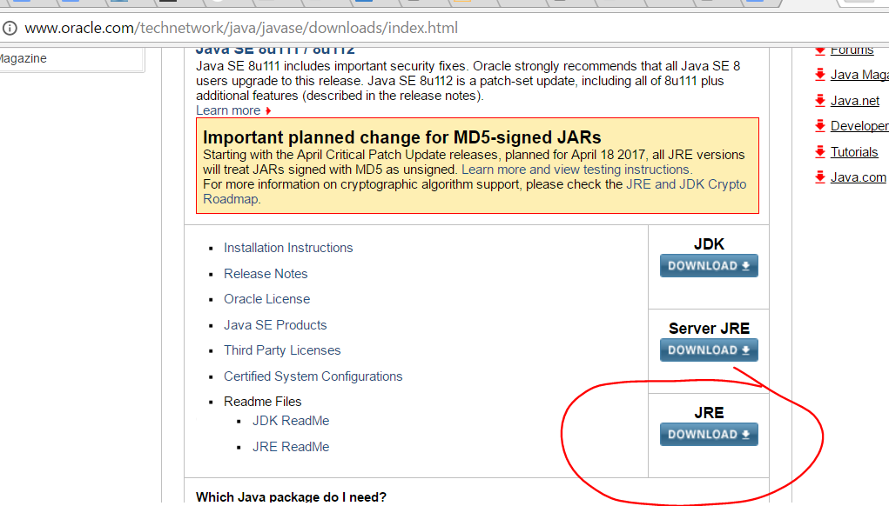

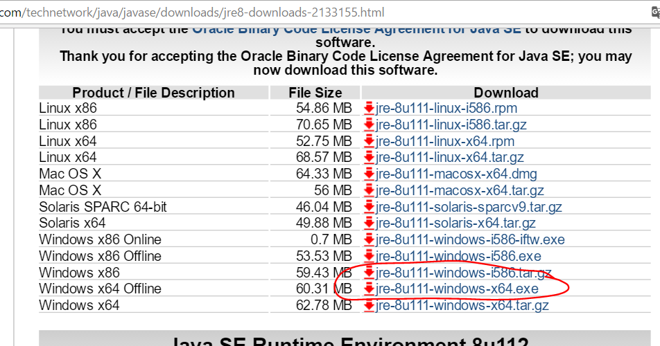

Кажется эта та версия, которая нам нужна. Мы загружаем её и устанавливаем.

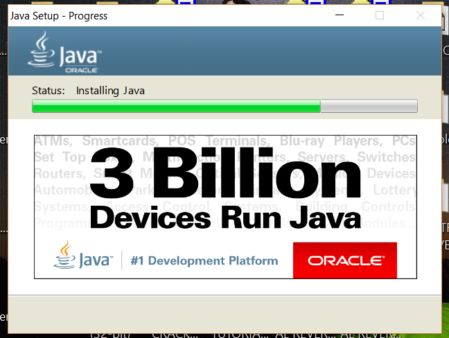

Затем я повторяю установку **BINDIFF** и видно, что проблемы больше нет. Инсталлятор ни на что не жалуется.

У меня всё ещё остались предыдущие исполняемые файлы с упражнениями - уязвимый и неуязвимый. Я открываю как новый неуязвимый или пропатченный файл в **ЗАГРУЗЧИКЕ IDA**, для того, чтобы она создала **IDB** файл, если я не сделал этого раньше.

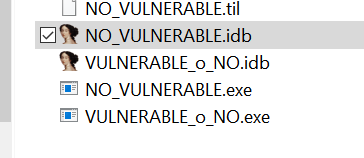

Затем, я открываю уязвимую версию файла.

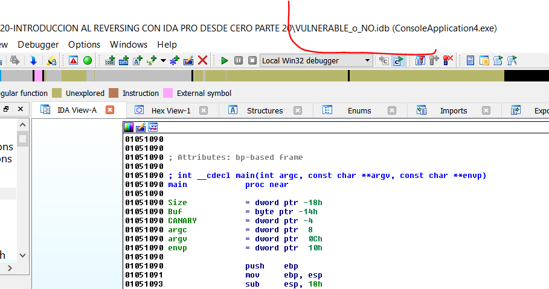

Теперь, я иду в меню **EDIT** → **PLUGINS**.

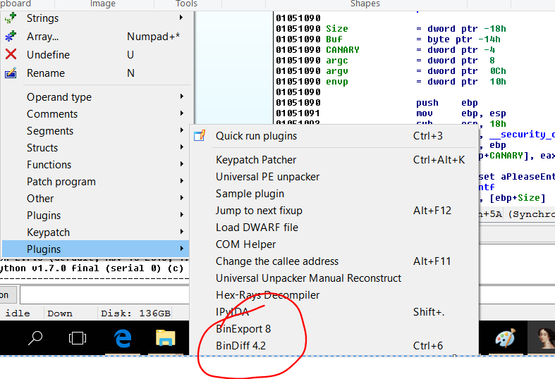

и выбираю пункт **BINDIFF 4.2 \(CTRL + 6\)**.

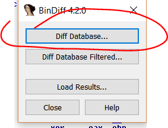

И нажимаю кнопку **DIFF DATABASE** и ищу пропатченную версию файла для сравнения с непропатченной.

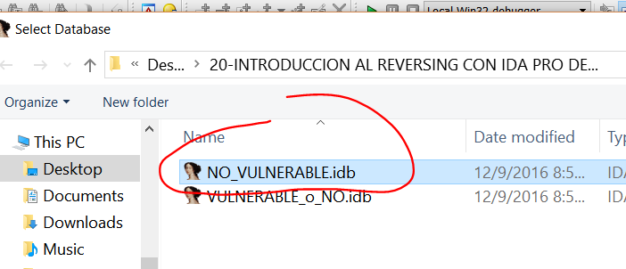

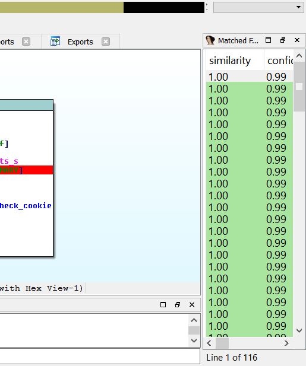

Как только сравнение будет завершено, **IDA** покажет мне результаты. Иногда результат неудобно смотреть в столбце, поэтому я могу перетащить и опустить его на панель вкладок.

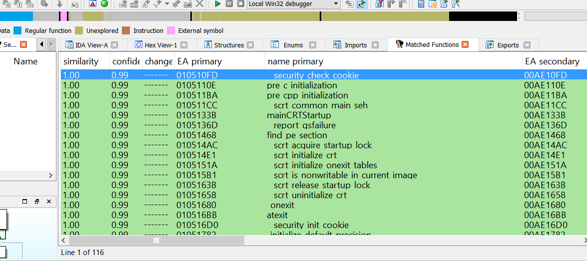

Первый столбец показывает сходство. Те блоки, у которых есть значение **1.00** - одинаковы, и чем меньше это число, тем они более разные. Удобно нажать на верхнюю часть этого столбца, чтобы упорядочить значения от более разных к более схожим.

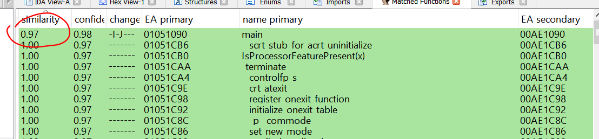

Мы видим, что в таблице есть только одна строка со сходством, меньшим чем **1**.

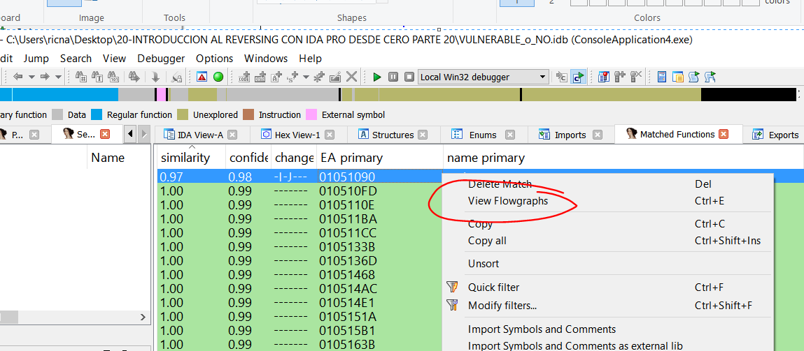

Зеленые блоки говорят о том, что код внутри них схожий. Желтые имеют незначительные изменения. А красные или серые блоки означают, что они новые.

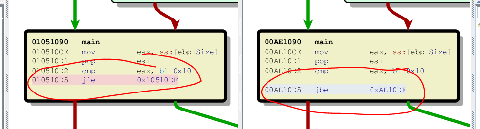

Здесь мы видим изменение. Как мы знаем, если изменить переход **JLE** на **JBE** то это поможет избежать **ПЕРЕПОЛНЕНИЕ БУФЕРА**. Поэтому, если в программе которая у нас есть в двух версиях - уязвимая и пропатченная и смотря на измененные функции мы находим это. Мы будем знать, что нам придется реверсить эту функцию статически, чтобы увидеть действительно ли она уязвима для программы.

Одно из преимуществ **BINDIFF** над другими состоит в том, что его график интерактивный. Это не просто картинка, плагин имеет вверху поисковую систему.

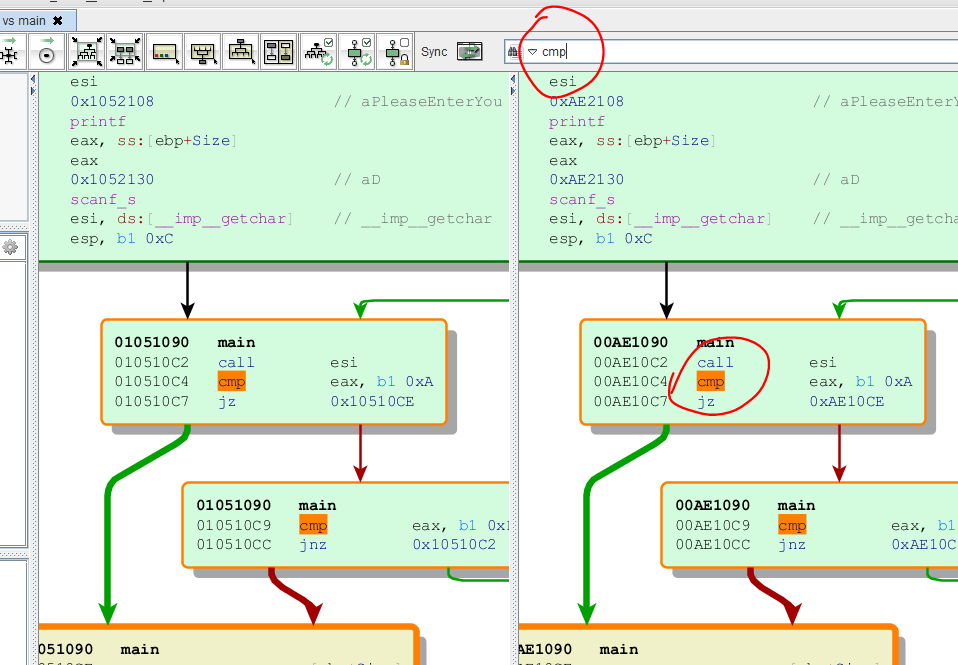

Она очень полезная, и Вы можете найти адреса и любой текст, который находится на графике.

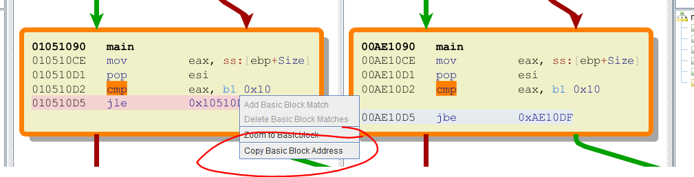

Мы можем скопировать адрес блока для того, чтобы вставить его в **IDA** и перейти по этому адресу.

У нас также есть графический обозреватель для навигации по функциям и списку блоков.

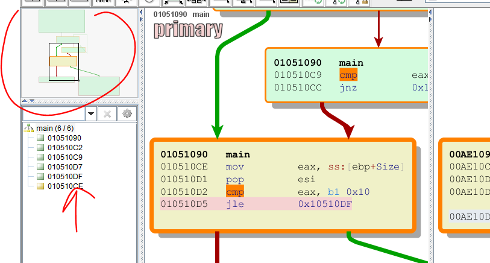

Мы можем пометить блок. В меню у нас есть пункты **SELECT ANCESTOR** или **SELECT SUCCESORS** для того, чтобы затемнять наши блоки \[del camino\] внутри функции. Это поможет вернуться оттуда в начало блока. В этом случае это простая функция. Но в больших и сложных функциях находить путь к блоку - очень важно. \(На картинки я не вижу этих пунктов, поэтому я мог тут неправильно перевести. Если что, поправьте меня — прим. Яши.\)

**BINDIFF** имеет много хороших примочек, прежде всего в графической части. У него есть некоторые проблемы при сравнении больших программ, но **BINDIFF** является одним из лучших решений, которое может быть.

## TURBODIFF

Это **ДИФЕР**, созданный моим коллегой **Николасом Экономэ** из **CORE SECURITY**. Он будет приложен к данному туториалу. Плагин также может быть загружен с сайта **CORE SECURITY**, но там находится более ранняя версия, чем та, которую я приложил.

Файл **PLW** просто копируется в папку **PLUGINS** где установлена **IDA**.

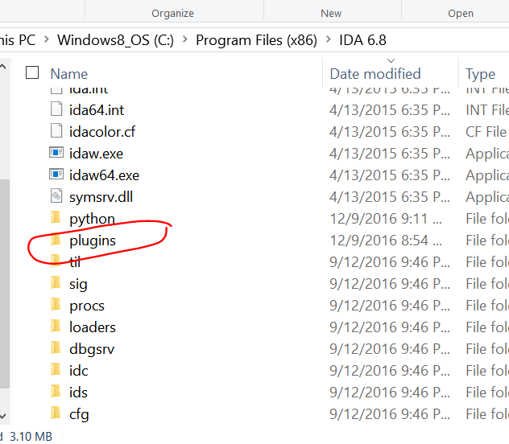

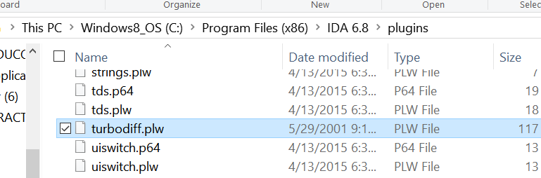

Мне придется перезапустить **IDA**, чтобы плагин заработал.

Как всегда, я загружаю сначала **НЕУЗЯВИМУЮ** версию файла.

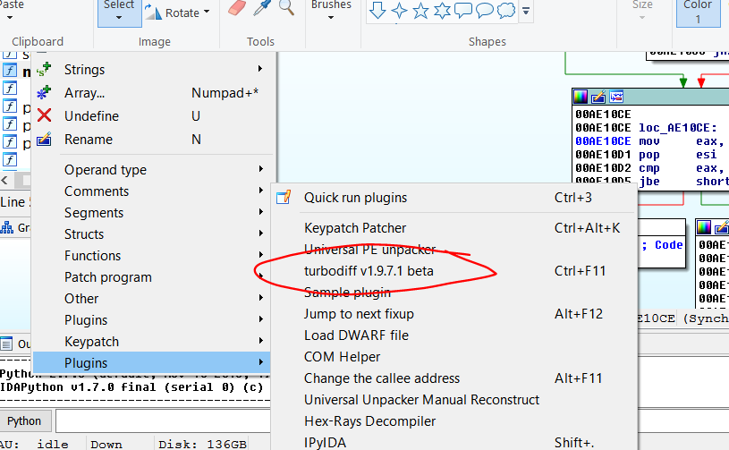

Необходимо иметь информацию о каждом файле, чтобы произвести сравнение между ними.

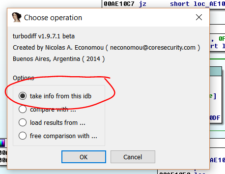

Поэтому я делаю эту операцию с первым файлом.

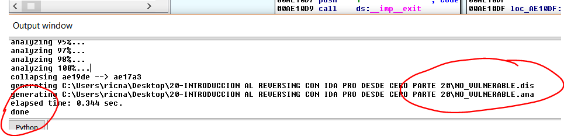

Затем я открываю уязвимый файл и делаю то же самое.

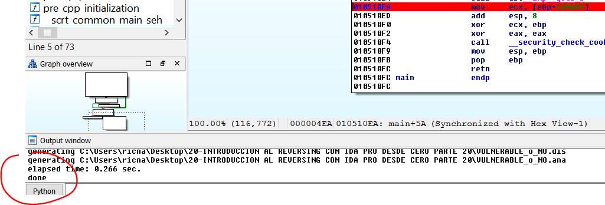

Теперь из уязвимой версии файла я снова вызываю наш плагин.

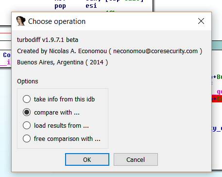

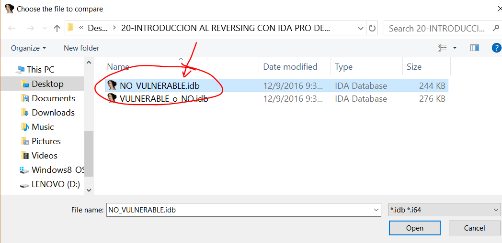

Я ищу неуязвимую версию файла и соглашаюсь с опциями, которые плагин предлагает мне по умолчанию.

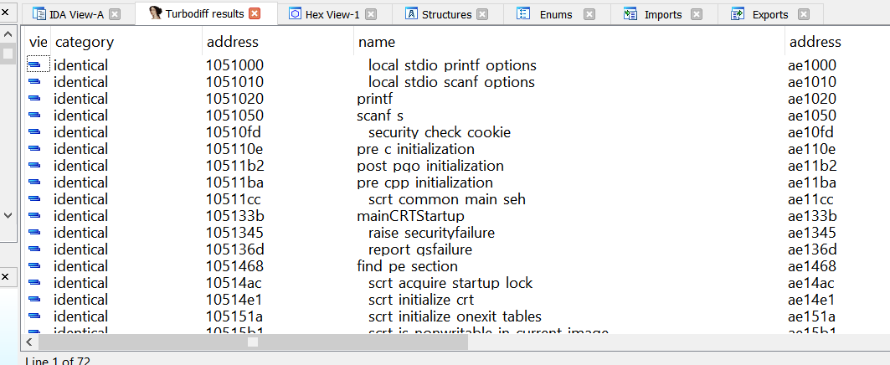

Здесь я могу нажать **CTRL** + **F** для того, чтобы начать искать изменения или подозрительные вещи, чтобы увидеть изменения, которые произошли в коде.

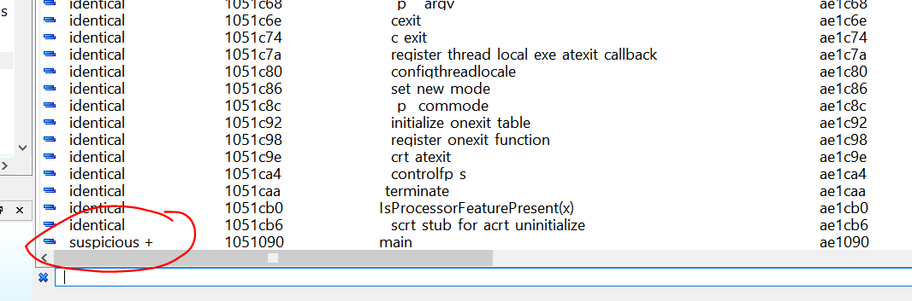

Вот одно из них. Делаем двойной щелчок по этой строке.

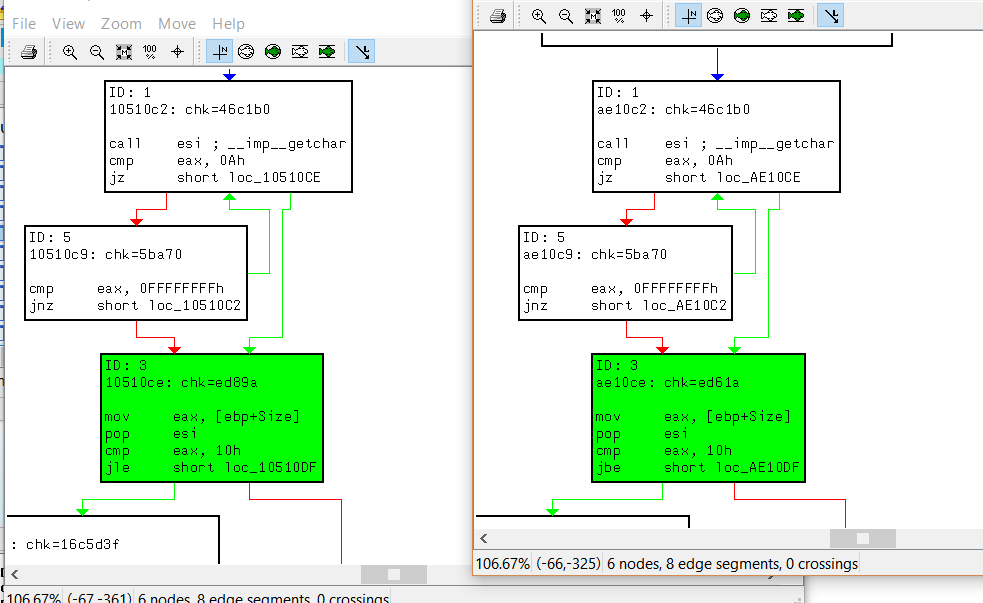

Здесь Вы увидите изменение. Также существует цветовой код в соответствии с типом изменения. Зеленый цвет для блоков с минимальными изменениями, желтый для блоков с очень большими изменениями и красный для новых блоков.

Очевидно графики - это просто картинки и они не интерактивные, но это очень быстрый **ДИФЕР**. Он действительно самый быстрый. Это очень заметно в больших исполняемых файлах и он не показывает слишком много глупых изменений как **BINDIFF**, предполагая, что некоторые вещи не так важны, что ценится в большой работе.

Если Вам не нравится форма графиков, Вы можете использовать оба **ДИФЕРА** одновременно и потом смотреть результаты на графике **BINDIFF**.

## DIAPHORA

**DIAPHORA** - плагин написанный в **PYTHON Джоксеаном Коретом**. \(Подправьте меня если неправильно — прим. Яши\)

[https://github.com/joxeankoret/diaphora](https://github.com/joxeankoret/diaphora)

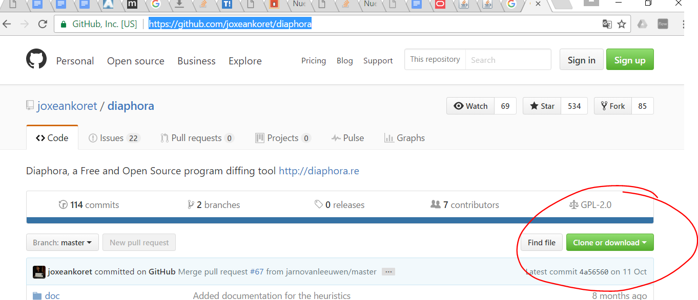

Его не нужно устанавливать. Я могу распаковать его в любое место и ему нужен только установленный **PYTHON** на машине.

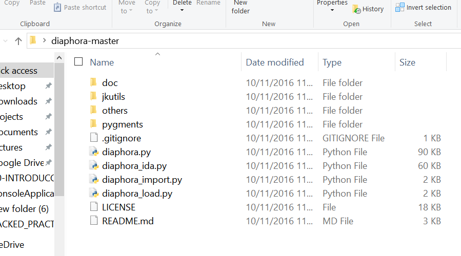

Так что мы будем действовать как обычно. Сначала делаем так для пропатченной или неуязвимой версии файла в **IDA**.

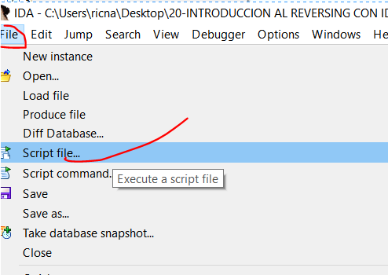

В **FILE → SCRIPT FILE** откройте поисковик и идите в папку, где мы распаковали **DIAPHORA** и ищем там файл **DIAPHORA.PY**.

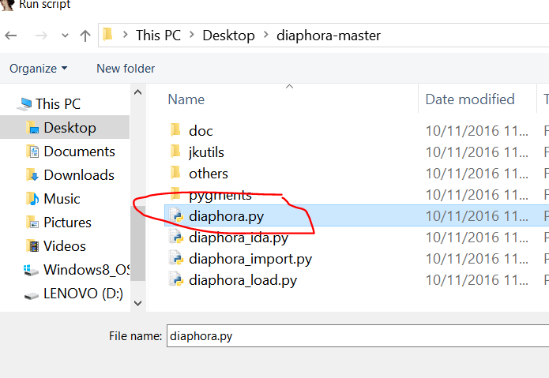

Как только появится окошко, мы нажимаем **OK** для того, чтобы экспортировать базу данных в **SQL** файл.

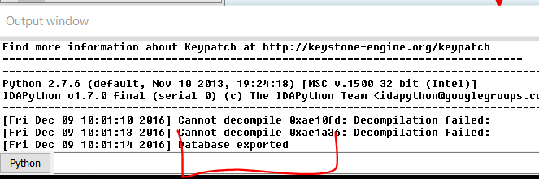

Когда база готова, мы открываем уязвимый файл в **IDA** и повторяем те же самые действия. Открываем **DIAPHORA.PY** и не меняя ничего мы экспортируем базу данных в файл.

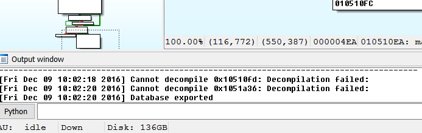

Как только мы сделали то же самое в обоих файлах, мы снова открываем **DIAPHORA.PY** в уязвимой версии файла, но на этот раз делаем так.

Во втором месте, мы ищем **SQL** базу данных пропатченного файла, которую мы экспортировали ранее.

Видим, что когда мы идем в папку, то кажется что там ничего нет.

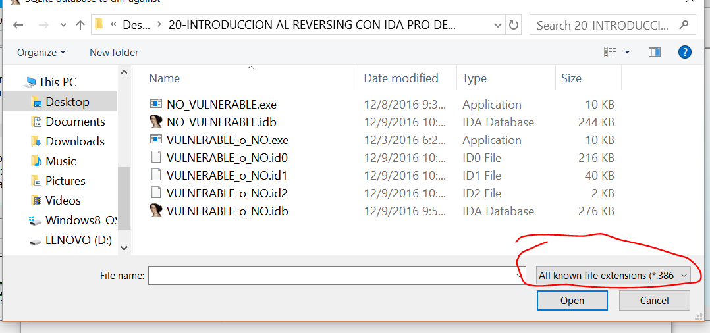

Но это происходит из-за фильтра файлов. Мы меняем фильтр на "**\***", чтобы увидеть все файлы.

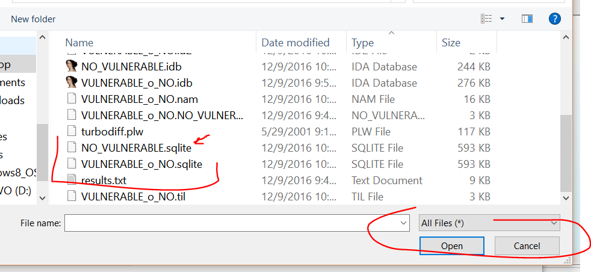

И мы ищем здесь неуязвимую версию файла.

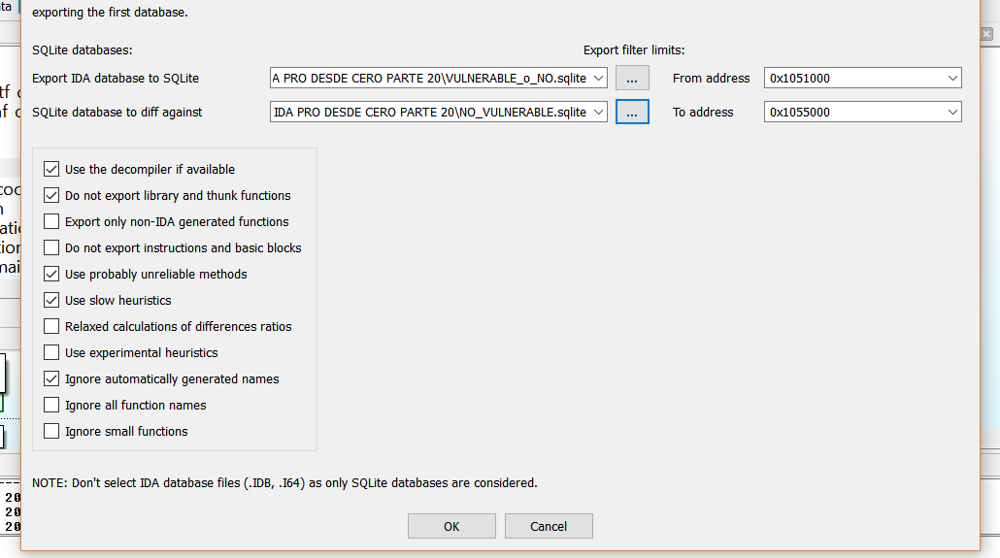

Я нажимаю **OK** как на скриншоте.

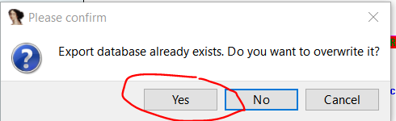

Мы видим, что есть вкладка **BEST MATCHES** с которой не остается сомнений, что файлы одинаковые.

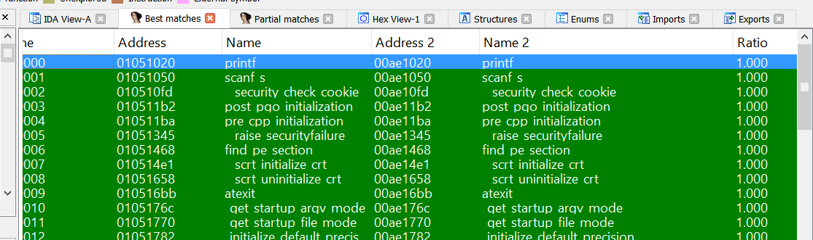

На вкладке **PARTIAL MATCHES** мы видим строки, которые возможно были изменены.

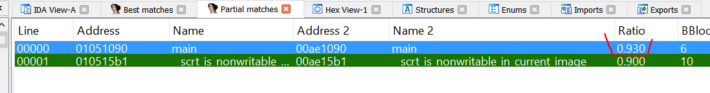

Видно, что программа нашла два изменения. Одна из вещей, которая умеет **DIAPHORA** состоит в том, что она очень точная. Иногда это хорошо, но иногда, когда у вас есть сотни функций, то Вы хотите, чтобы она работала попроще, а не так точно и не показывала столько бессмысленных изменений.

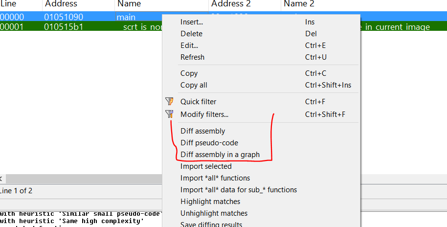

Этот плагин имеет несколько опций для того, чтобы изображать **РАЗЛИЧАЯ**.

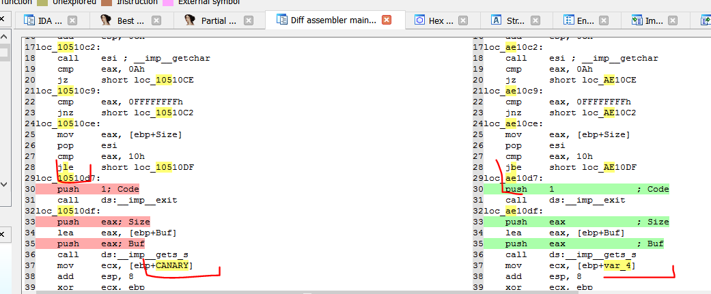

**DIAPHORA** очень точная и подробная, но когда Вы видите сто таких функций, то хочется просто взять и вскрыться **&gt;:D**. Давайте посмотрим вторую опцию **DIFF ASSEMBLY IN A GRAPH**.

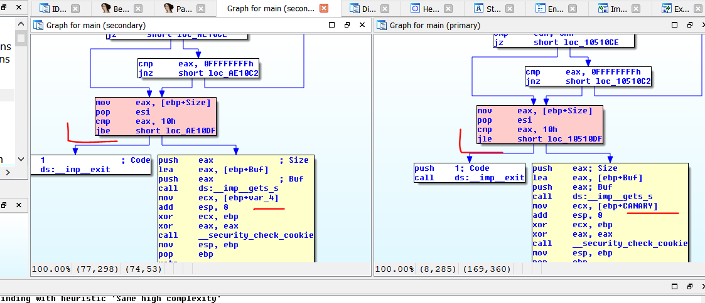

Этот график выглядит немного лучше. Хотя он и не интерактивный, важный блок изменяется в красный цвет, а в желтый цвет отмечаются те блоки, которые имеют меньше изменений, например как имя переменной.

Другая опция **DIFF PSEUDO CODE** использует плагин **HEX RAYS**, который поставляется вместе с **IDA**. Плагин старается воссоздать исходный код из исполняемого файла.

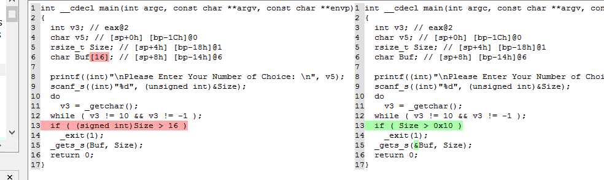

Мы видим, что в уязвимой версии файла, который мы отреверсили вручную и определили, существует буфер из 16 байт, эта переменная **BUF** определяется как буфер. Но в неуязвимой версии, поскольку мы не сделали ту же работу, плагин не обнаруживает его, а просто помечает буфер как переменную типа **CHAR**, ничего более. Плагин также показывает, что переменная в уязвимой версии – **ЗНАКОВАЯ**, а в неуязвимой версии, не говорит ничего про тип переменной, что предполагает, что это переменная имеет **БЕЗЗНАКОВЫЙ** тип.

Другая характеристика **DIAPHORA** состоит в том, что она самая медленная \(она написана на **PYTHON**, а не на **C** как **TURBODIFF**\) и в больших исполняемых файлах анализ и сравнение очень долгое.

Я приложил файл **IDA1.EXE**. Я бы хотел, чтобы Вы проанализировали его и сказали, уязвим ли он, а также, чтобы Вы попытались переполнить буфер и изменить поток исполнения программы, для того, чтобы она показал нам хорошее сообщение.

Это упражнение открыто обсуждается как в списке рассылки **CRACKSLATINOS**, так и в нашей телеграмм группе.

[https://telegram.me/CLSExploits](https://telegram.me/CLSExploits)

До **23**-й главы, где будет представлено решение этого упражнения.

* * *

Автор оригинального текста — Рикардо Нарваха.

Перевод и адаптация на английский  язык — IvinsonCLS.

Перевод и адаптация на русский язык — Яша Яшечкин.

Перевод специально для форума системного и низкоуровневого программирования - WASM.IN

22.11.2017

Источник:

[**http://ricardonarvaja.info/WEB/INTRODUCCION%20AL%20REVERSING%20CON%20IDA%20PRO%20DESDE%20CERO/22-INTRODUCCION%20AL%20REVERSING%20CON%20IDA%20PRO%20DESDE%20CERO%20PARTE%2022.7z**](http://ricardonarvaja.info/WEB/INTRODUCCION%20AL%20REVERSING%20CON%20IDA%20PRO%20DESDE%20CERO/22-INTRODUCCION%20AL%20REVERSING%20CON%20IDA%20PRO%20DESDE%20CERO%20PARTE%2022.7z)
