# Часть 23

[\[Используемые материалы\]](.gitbook/assets/files/23.zip)

Осталось решить незаконченное упражнение **IDA1.EXE**.

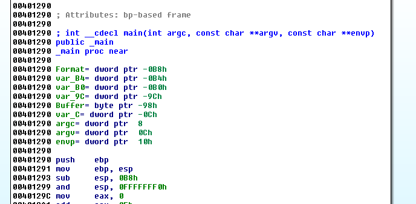

Функция основана на **EBP** как предыдущие упражнения. Разница заключается в том, что этот пример скомпилирован с помощью **DEVC**++, который имеет особый способ компиляции вызовов **API**, отличный от обычного способа и это может вызвать головокружение, у тех, кто никогда такого не видел.

Хорошо, "**VAMOS POR PARTES**", как сказал **Джек**. Первое, что мы видим - это функция **MAIN**. Если она не появляется, Вы также можете перейти к важной функции, просто посмотрев на строки.

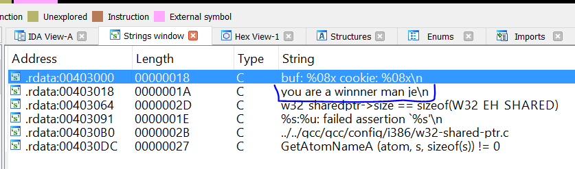

Сделаем двойной щелчок по строке "**You are a winner man je**" и мы попадём на этот адрес:

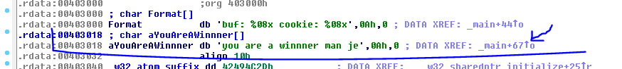

Я помещаю курсор мышки над стрелкой перекрёстной ссылки. Мы можем видеть куда ведёт эта перекрёстная ссылка.

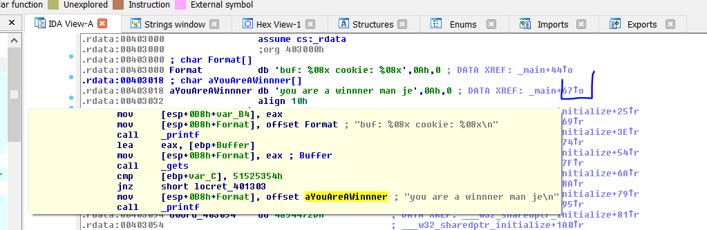

Но лучше, конечно, нажать **CTRL** + **X**. Так мы попадём туда, где находится данный код.

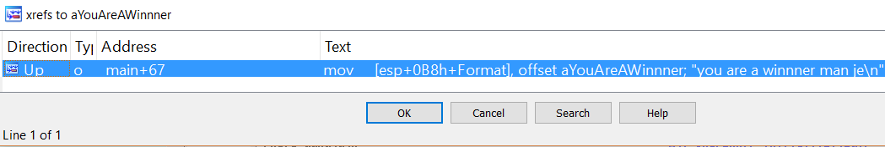

Переходим в этот код, щелкая по этой ссылке.

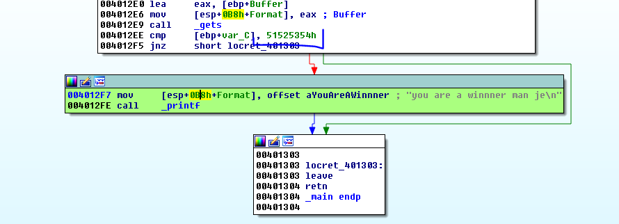

Я меняю в зеленый цвет блок кода, который является **ХОРОШИМ СООБЩЕНИЕМ**. Нам нужно попасть в него.

Мы видим, что перед ним идёт сравнение переменной **VAR**\_**C** с константой **0x51525354**.

Если мы сделаем правый щелчок на этом значение **0x51525354**, появятся альтернативные значения, как можно представить это значение.

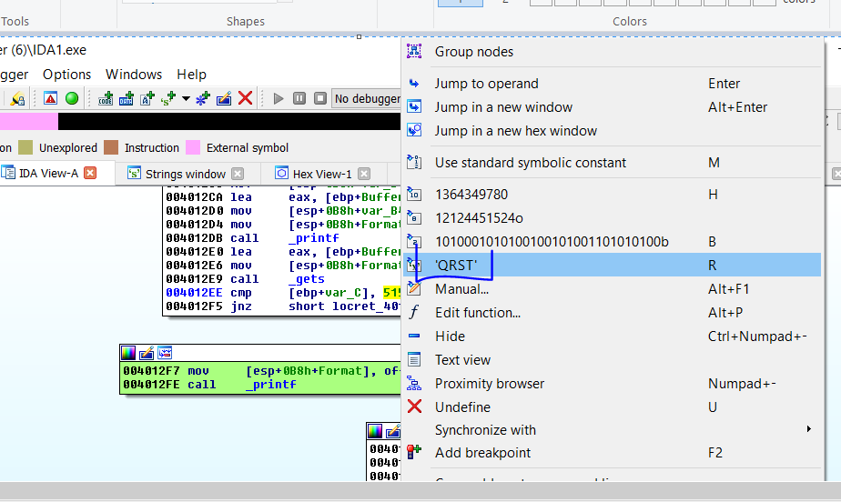

Я могу изменить это представление на буквы **QRST**, которые являются символами **ASCII** этого **HEX** значения.

Мы также можем видеть, что компилятор не использует **CANARY** защиту, потому что в начале функции программа должна считать переменную из секции **DATA** и **XOR**'ить эту переменную с помощью регистра **EBP** и сохранить её чуть выше **STORED EBP** в стек, а также, считать её снова, непосредственно перед выходом из функции, чтобы вызвать **CALL**, который проверит это значение переменной. Ничего из этого не происходит здесь. Если мы посмотрим статический анализ стека, сделав двойной щелчок на любой переменной.

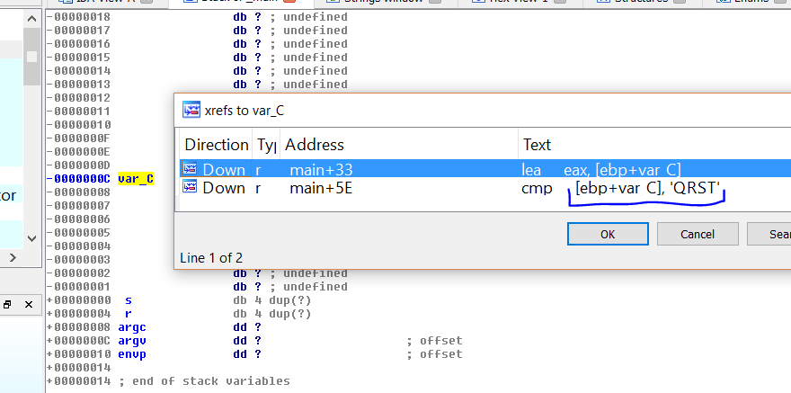

Мы видим, что единственное, что есть в стеке, чуть выше **STORED EBP**, это переменная **VAR**\_**C**, которая сравнивается со строкой **QRST**, чтобы идти к хорошему сообщению, что исключает, что это переменная **CANARY**, так как в этом случае это проверка, которая принадлежит исходному коду программы. **CANARY** не подмешивается к решениям исходного кода программы. Это что-то добавленное самим компилятором, внешнее по отношению к исходному коду и это не защита.

Мы можем переименовать эту переменную, чтобы не путать её с **CANARY**. Назовём её как **VAR\_DECISION**.

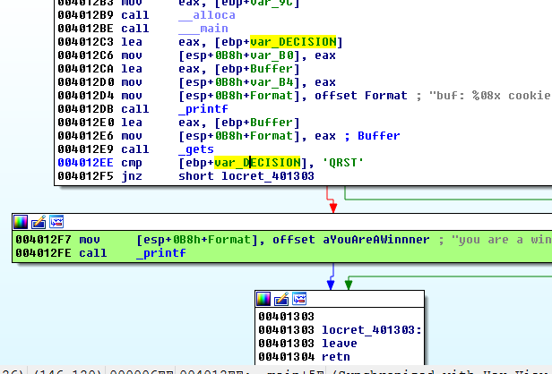

Эта переменная используется дважды в функции. Но можем ли мы действительно изменить значение вышеупомянутой переменной, для того, чтобы заставить программу перейти к хорошему сообщению?

Те, кто смотрит на этот код впервые, обратят внимание, что существуют переменные и аргументы связанные с **EBP**, но есть и другие, которые отсчитываются от **ESP**.

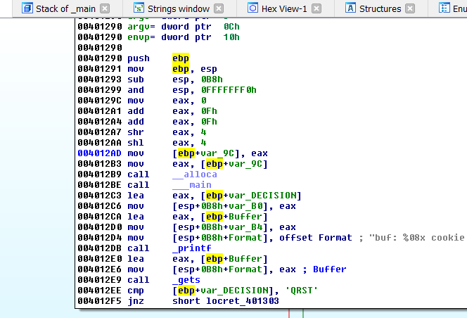

Весь этот начальный код, добавлен компилятором, чтобы установить **ESP** чуть выше переменных и локальных буферов. После исполнения **SUB ESP**, **0B8** программа подготовлена к этому. Хотя программа никогда не изменяет намного больше памяти чем выравнять и округлить, мы могли бы делать математические расчёты. Но если мы не хотим осложнять себе жизнь, мы можем отладить программу, чтобы увидеть какое значение осталось в **ESP**, чтобы закончить всё это и начать с оригинального кода функции.

Тот, кто захочет отладить это место, может сделать это, но у нас есть другая помощь от **IDA**, которая очень полезна. Это расчёт отклонения **ESP** в стеке начиная с самого начала стека функции, что принимается за нуль.

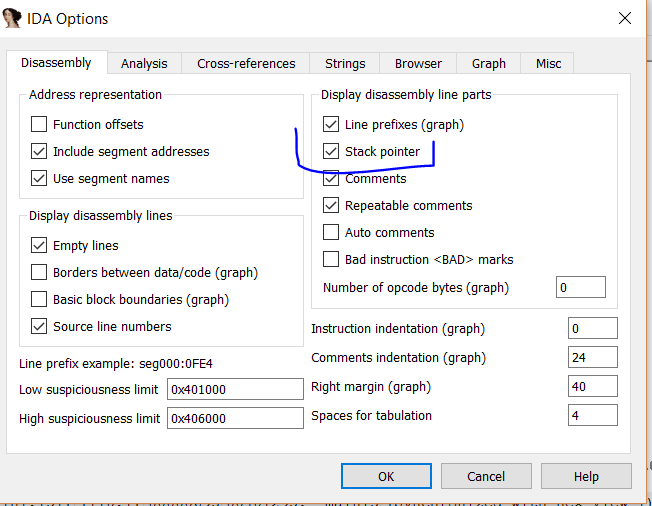

Если посмотрим на код сейчас, после установки этой опции.

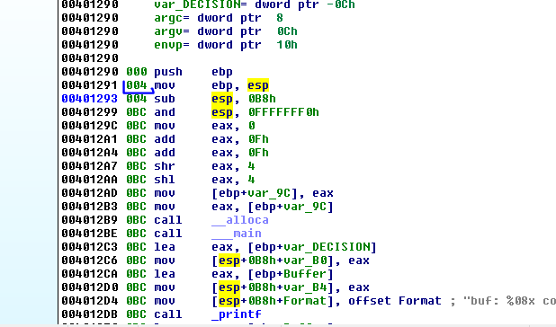

Мы видим влияние каждой инструкции на стек начиная с нуля, что является началом стека. После выполнения инструкции **PUSH EBP**, стек уменьшается на **4**, поэтому у второй строки справа написано **004**.

Вторая инструкция - это **MOV EBP**, **ESP**, которая не изменяет стек, потому что это только одинокая инструкция **MOV** и поэтому регистр **ESP** не меняется, а изменяется только регистр **EBP**.

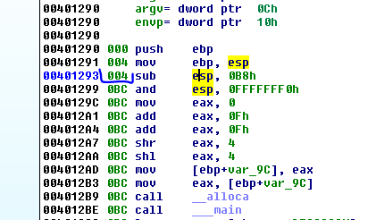

Вот почему третья строка имеет то же самое значение **004**, потому что инструкция не изменила значение **ESP**.

Давайте запомним, что **ESP** и **EBP** остаются одинаковыми и **EBP**, начиная отсюда, будет ссылкой отстающей на **4** байта от начала **ESP**.

Следующая строка вычитает значение **0xB8** из **ESP**, поэтому **ESP** будет равен **0xBC** от начала отсчёта в стеке и поскольку **EBP** был равен **4**, разница между **EBP** и **ESP** будет только **0xB8** байт.

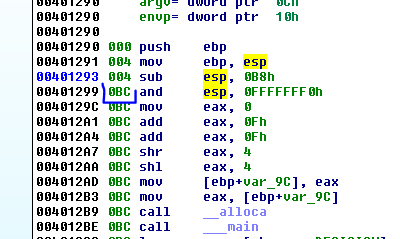

Мы видим, что потом расстояние не меняется, даже при вызове функций \_\_**ALLOCA** и \_\_\_**MAIN**, которые добавлены компилятором. Поэтому, мы можем заключить, что всё это не влияёт ни на что. Расстояние между **EBP** и **ESP** всё также равно **0xB8** и это пространство для локальных переменных и буферов.

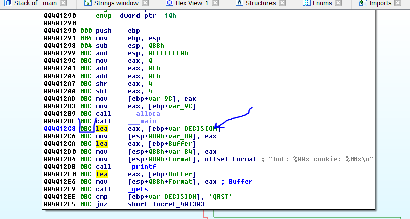

Здесь уже начинается код самой функции и расстояние от **ESP** до начала стека осталось равным **0xBC** и **0xB8** - это область, зарезервированная для локальных переменных и буферов.

Поскольку переменная **VAR\_9C** является временной переменной, созданной компилятором и не используется больше, то мы переименуем её в **TEMP**.

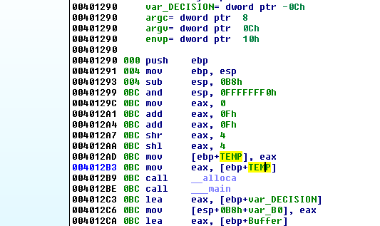

Ниже переменной **TEMP** у нас есть буфер. Я делаю правый щелчок и выбираю – **ARRAY**. Мы видим, что размер буфера равен **140** байт в десятичной системе, так как каждый элемента равен **1** байт, поэтому и размер буфера равен **140** байт в десятичной системе.

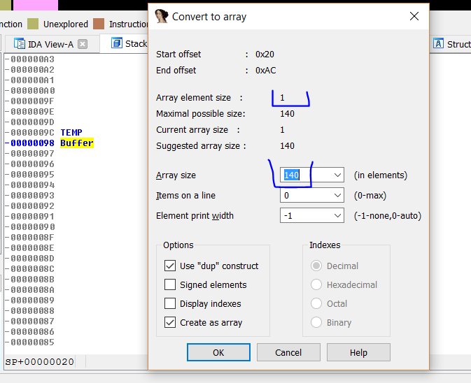

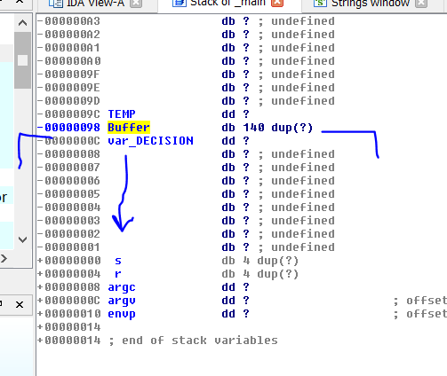

Если бы нам удалось переполнить буфер, скопировав в него больше **140** байт, он бы имел уязвимость типа **BUFFER OVERFLOW**, эксплуатируя которую, можно было бы перезаписать переменную **VAR**\_**DECISION** и если бы могли писать дальше вниз, нам удалось бы дойти до **STORED EBP** и **RETURN** и перезаписать их, в зависимости от того, сколько байт мы скопировали.

Давайте продолжим реверсить. Самая высокая точка компиляции - это способ, как Вы передаёте аргументы в функции. Вместо того, чтобы использовать **PUSH** для сохранения аргументов в стек, сохраняйте их непосредственно с помощью инструкции **MOV**. Мы увидим скоро это пример.

Здесь всё становится ясно. В этом случае, **PRINTF** имеет единственный аргумент, который является адресом строки "**You are a winner je**" и больше не имеет никаких других аргументов.

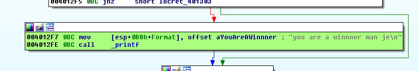

Мы видим, что программа сохраняет этот адрес, так как она использует слово **СМЕЩЕНИЕ** впереди, и сохраняет адрес в стек, но куда? Обозначения не особо нам помогают, но если мы сделаем правый щелчок, мы увидим несколько альтернативных обозначений.

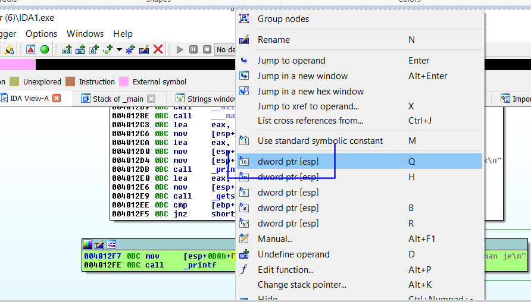

Если мы изменим представление на этот пункт.

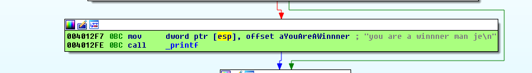

Мы видим, что то, что действительно происходит, состоит в том, что адрес строки помещается в содержимое **ESP** \(самое верхнее положение стека\), чтобы использовать его как аргумент. Другими словами, это программа вместо того, чтобы исполнить **PUSH** на вершине стека, помещает аргументы в положение стека с помощью инструкции **MOV** и логически **PUSH** изменяет значение **ESP**, в то время как инструкция **MOV** – нет. Это можно увидеть по значению **BC**, которое расположено непосредственно перед функцией.

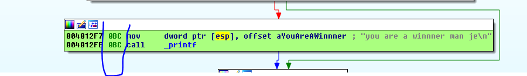

То же самое происходит во всех других **API**. Если мы применим тот же самый способ только к тем строкам, которые имеют аргументы к **API** и сделав правый щелчок и изменив альтернативное обозначение, у нас получается более понятный код.

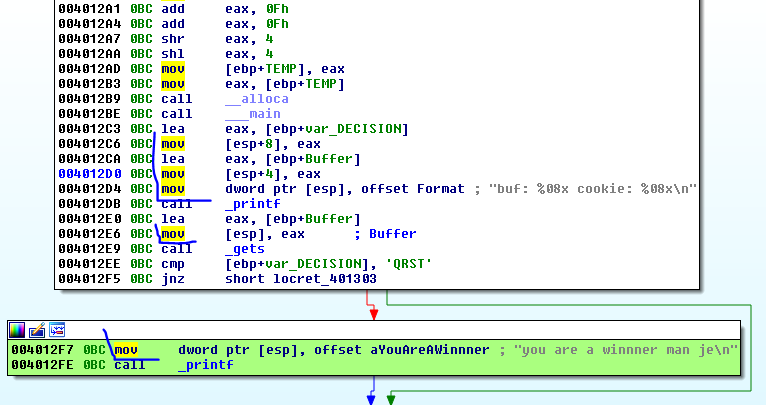

Мы видим, что первый **PRINTF** имеет **3** аргумента, потому что он заменяет форматную строку в строке `buf : %08x cookie : %08x\n`. Для двух верхних аргументов, будет так.

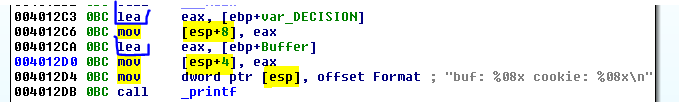

Первый аргумент - это адрес переменной **VAR**\_**DECISION**, который получен с помощью инструкции **LEA**. Инструкция помещает адрес в **EAX** и сохраняет его в содержимое **ESP + 8**.

Второй аргумент - это адрес переменного буфера, который получен также с помощью **LEA**. Инструкция помещает его в **EAX** и сохраняет адрес в содержимое **ESP+4** как следующий аргумент. Третий аргумент сохраняет адрес в содержимое **ESP** и это будет адресом строки. В нашем случае, это строка с форматом.

Если Вы запустите программу вне **IDA**, мы увидим, что программа печатает в консоли адреса обоих переменных, так как программа заменяет исходную строку на форматную, на **HEX** значения обоих адресов, потому что используется последовательность **%x**, которая является преобразованием вывода строки в **HEX** представление.

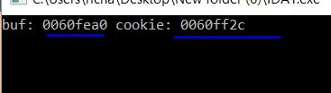

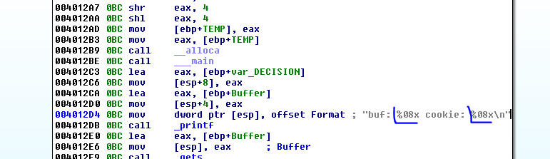

Затем программа продолжает вызывать функцию **GETS**, которая принимает символы с клавиатуры, без каких-либо ограничений, из-за чего Вы можете написать без проблем более **140** символов.

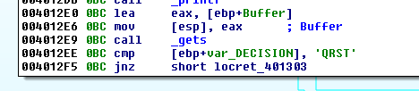

Здесь также программа передаёт адрес буфера, в который будут поступать символы с клавиатуры как аргумент, в содержимое **ESP**

Так что мы знаем, что если я напишу например **140** символов **A** и затем символы **TSQR**, так как они должны идти наоборот из-за режима **LITTLE ENDIAN**, программа должна показать мне хорошее сообщение, так как мы будем перезаписывать переменную **VAR**\_**DECISION** значением **QRST**, которая находится чуть ниже буфера. Давайте сначала сделаем всё это вручную, перед тем как сделать скрипт.

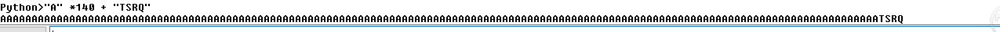

Я печатаю строку в **IDA**, и копирую её в буфер обмена, и вставляю её здесь.

`AAAAAAAAAAAAAAAAAAAAAAAAAAAAAAAAAAAAAAAAAAAAAAAAAAAAAAAAAAAAAAAAAAAAAAAAAAAAAAAAAAAAAAAAAAAAAAAAAAAAAAAAAAAAAAAAAAAAAAAAAAAAAAAAAAAAAAAAAAAATSRQ`

Теперь открываю консоль и запускаю из нее программу, так как иначе она будет закрываться и я не увижу строку с сообщением.

Когда программа ожидаем ввода я вставляю подготовленную строку и ...

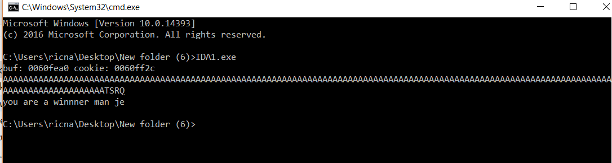

Скрипт очень простой. Он также совпадает с предыдущим. В нашем случае он не имеет двух потоков ввода для **STDIN**, а имеет только один.

> **from** subprocess **import** \*
>
> p = Popen\(\[**r'C:\Users\ricna\Desktop\New folder \(6\)\IDA1.exe'**, **'f'**\], stdout=PIPE, stdin=PIPE, stderr=STDOUT\)
>
> **print "ATACHEA EL DEBUGGER Y APRETA ENTER\n"**
>
> raw\_input\(\)
>
> primera=**"A"** \*140 + **"TSRQ\n"**
>
> p.stdin.write\(primera\)
>
> testresult = p.communicate\(\)\[0\]
>
> **print** primera
>
> **print**\(testresult\)

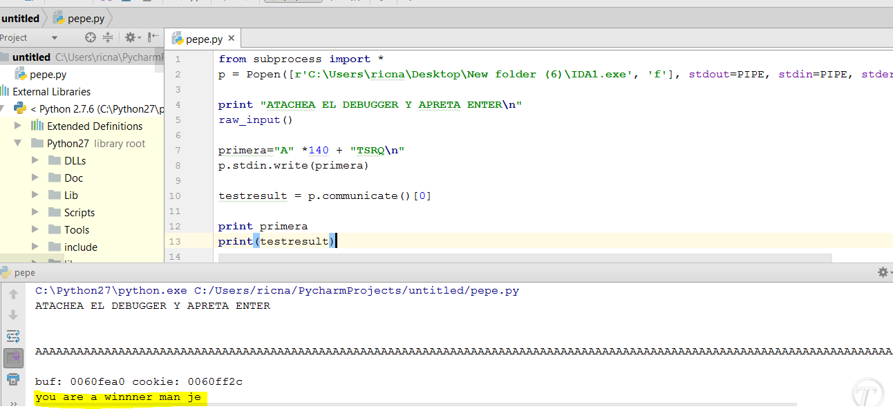

Здесь Вы видите результат. Многие не смогли бы это сделать из-за способа передачи аргументов. Но сейчас будет проще сделать упражнение №**2**, так как оно очень похожее и скомпилировано таким же образом, и Вы уже знаете про этот трюк.

Следующее упражнение называется **IDA2.EXE**.

До встрече в **24**-й главе.

* * *

Автор оригинального текста — Рикардо Нарваха.

Перевод и адаптация на английский  язык — IvinsonCLS.

Перевод и адаптация на русский язык — Яша Яшечкин.

Перевод специально для форума системного и низкоуровневого программирования - WASM.IN

27.11.2017

[**Источник: ricardonarvaja.info**](http://ricardonarvaja.info/WEB/IDA%20DESDE%20CERO/CURSO%20DE%20IDA%20TUTES/23-INTRODUCCION%20AL%20REVERSING%20CON%20IDA%20PRO%20DESDE%20CERO.docx)
