# Часть 25

**СТРУКТУРЫ**

В этой части, мы начнём изучать, как **IDA** **PRO** помогает нам при реверсинге, когда программа использует структуры.

В конце этой части, решения для файлов **IDA3** и **IDA4** будут краткими, потому что похожая проблема уже обсуждалась.

Что же такое структура?

Нам не нужно очень техническое определение, но мы видели, что **МАССИВЫ** это контейнеры, которые резервировали пространство в памяти для своих полей. Поля были того же типа, что и сами массивы, поэтому **МАССИВЫ** могут быть из байтов, слов, двойных слов. Смысл в том, что в массиве не может быть полей другого типа.

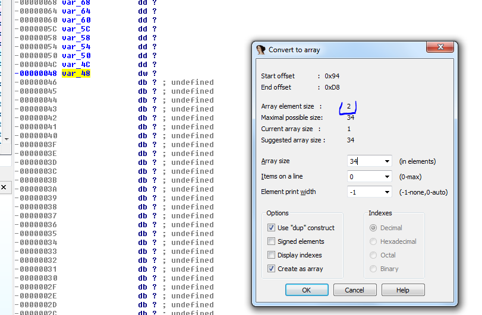

Здесь мы видим пример **МАССИВА**, размер которого равен **34** байта и каждый его элемент имеет размер **2** байта, т.е. каждый элемент - это **СЛОВО**. Поэтому общая длина массива будет равна **34** \* **2**, т.е. **68** десятичных байт.\(Почему на картинки тогда **DD** и **DB**, а не **DW** ??? Без практики тут не понять. Вижу только один **DW**. Нарваха опять ошибается или всё правильно? Прошу помощи у читателей. - Прим. Яши\)

В этом примере **МАССИВА**, каждый его элемент это слово. Другими словами элемент занимает **2** байта \(На картинке только один **DW** – Прим. Яши\). Если мне нужен массив, каждый элемент которого по размеру равен **1** байту, я буду должен создать другой массив, так как я не могу смешивать в нём данные другого размера или типа.

С другой стороны, структура позволяет смешивать различные типы данных разного размера внутри себя.

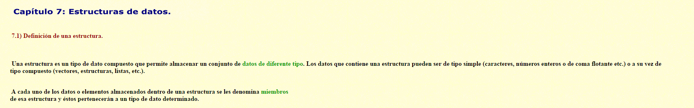

[http://decsai.ugr.es/~jfv/ed1/c/cdrom/cap7/cap71.htm](http://decsai.ugr.es/~jfv/ed1/c/cdrom/cap7/cap71.htm)

Структура - это тип составных данных, который позволяет Вам хранить набор данных разного типа. Данные, которые содержит структура, могут быть простого типа \(символы, целые числа или вещественные и т.д.\) или, в свою очередь, составного типа \(векторы, структуры, списки, и т.д.\). Каждый элемент из данных или элементов, хранящихся внутри структуры, называется членом этой структуры и он будут принадлежать к определенному типу данных.

Это определение более элегантное, но мы можем иметь контейнер с различными типами данных и здесь длина будет суммой длин всех членов или полей.

Код \(C\):

1. 2. struct MyStruct
3. {
4. char \* p\_size;
5. char size;
6. int cookie;
7. int leidos;
8. int cookie2;
9. int maxsize;
10. int\(\*foo2\)\(char \*\);
11. void \* buf2;
12. char buf\[50\];
13. };
14. 15.
В **C++** мы могли бы определить структуру таким способом. В этом примере, мы видим структуру названую мной **MYSTRUCT**, которая имеет несколько полей внутри. Необязательно быть великими гениями программирования, чтобы понять, что это не то же самое, что переменная **INT**, переменная **CHAR** или буфер длиной в **50** байт.

Если у меня есть **VISUAL** **STUDIO**, я могу увидеть размер всей структуры, который равен **0x54** байта.

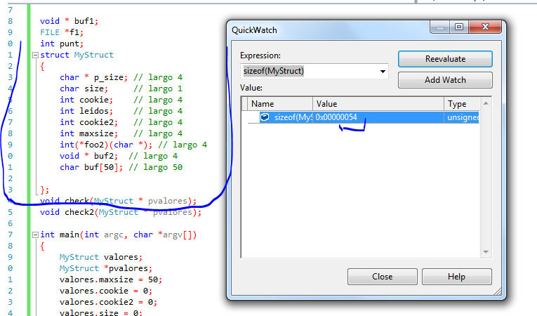

Я делаю это, чтобы позже сравнить результат с тем, что у нас получится в **IDA**. Всё это не имеет большого значения, если Вы не очень хорошо понимаете, как с этим работает **VISUAL** **STUDIO**. Просто примите это как информацию к размышлению.

Мы видим, что полная сумма полей даёт мне немного меньшее значение суммы, чем значение, которое компилятор присваивает при компиляции, но это обычно случается, когда компилятор выделяет немного больше.

Указатель на символьную переменную имеет длину четыре байта, потому что, это указатель, который равен по размеру **DWORD** и его содержимое указывает на символьную переменную.

Код \(C\):

1. char \* p\_size; // длина указателя = 4 байта

Здесь то же самое. Другие указатели на функцию и на буфер являются указателями, которые тоже являются **DWORD**. Другими словами, их длина также равна **4** байта и они указывают на разные типы данных разной длины, но в структуре сохраняется только указатель. Т.е. каждый указатель имеет только **4** байта в структуре.

Код \(C\):

1. int\(\*foo2\)\(char \*\); // длина указателя на функцию = 4 байта
2. void \* buf2; // длина указателя на буфер = 4 байта

Однако, последний буфер не является указателем \(он не имеет символа звездочки **\(\*\),** так как это просто буфер, который прямо внутри структуры занимает **50** байтов её же длины\).

Код \(C\):

1. char buf\[50\]; // размер буфера = 50 байт

Важная вещь заключается в том, что в отличие от массивов, структуры, это контейнеры различных типов данных и которые очень сложно дизассемблировать. **IDA** может автоматически распознать каждое поле и его тип, особенно, если у нас нет символом.

Давайте сделаем сами простой пример, чтобы научиться обнаруживать и управлять структурой в **IDA**.

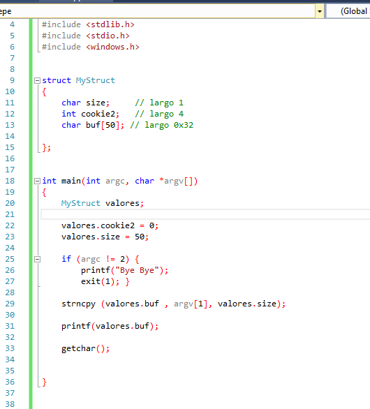

Мы видим простой код, который получает аргумент через консоль. Если мы не запустим пример с аргументом, программа покажет нам сообщение “**BYE** **BYE**”.

Мы могли бы запустить файл так.

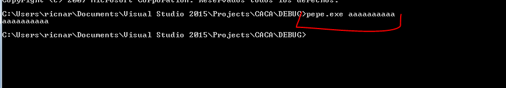

Если мы просто сделаем двойной щелчок, т.е. не будем вводить какой-нибудь аргумент, программа проверит, что переменная **ARGC**, которая является количеством аргументов, отличается от **2** и завершит своё выполнение \(количество аргументов включает в себя имя исполняемого файла, так что, в этом случае, было бы два аргумента. Первый **PEPE.EXE** и второй **aaaaaaaaaaa**\)

Код \(C\):

1. if \(argc != 2\) {
2. printf\("Bye Bye"\);
3. exit\(1\); }

Мы видим, что программа пропускает эту проверку, так как **ARGC** равен **2**.

Кроме определения этой структуры как типа данных, мы можем сделать, чтобы существовали переменные, которые принадлежат типу **INT**, **CHAR**, **FLOAT** или любому другому типу. Также мы можем сделать, чтобы переменные были типа **MYSTRUCT**.

Точно так же мы объявляем целочисленную переменную, например, ставим тип данных спереди.

Код \(C\):

1. int pepe;

Это похоже на переменную структурного типа.

Код \(C\):

1. MyStruct valores;

Значения переменной будут типа **MYSTRUCT.** Они будут иметь то же определение, ту же длину и те же поля.

Мы могли бы создать несколько разных переменных типа **MYSTRUCT**

Код \(C\):

1. MyStruct pinguyo;
2.
И чтобы ссылаться на некоторых свои поля, структура использует:

Код \(Text\):

1. valores.size
2. 3. pinguyo.size
4. 5. valores.cookie2

Таким способом, в программе значения присваиваются в некоторые поля переменой.

Код \(C\):

1. valores.cookie2 = 0;
2. valores.size = 50;
3.

И затем программа копирует символы **A** вызовом функции **STRNCPY**, которые находятся в переменной **ARGV\[1\]** в буфер **VALORES.BUF** длиной 50 десятичных байт, принимая как максимальный размер буфера, значение **VALORES**.**SIZE**, которое равно **50**.
Код \(C\):

1. 2. strncpy \(valores.buf , argv\[1\], valores.size\);

Таким образом, здесь не будет переполнения, потому что программа копирует **50** байтов в буфер длиной **50** байтов, и он не переполняется.

Затем программа печатает то, что мы ввели. Все это хранится в буфере **VALORES**.**BUF**.

Код \(C\):

1. printf\(valores.buf\);

И наконец идёт вызов функции **GETCHAR\(\)**, поэтому программа не будет закрываться, пока мы не нажмем любую клавишу и мы можем увидеть символы **A**.

Сейчас, давайте откроем исполняемый файл в **IDA** и увидим, как мы можем интерпретировать вышесказанное.

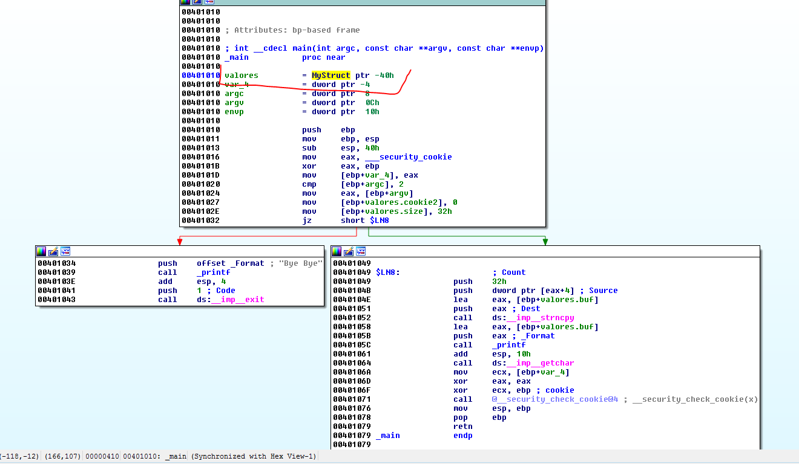

Мы видим, что когда есть символы, то это просто счастье. **IDA** обнаружила переменную **VALORES** как переменную типа **MYSTRUCT**, без проблем. Даже внутри кода, мы видим, что **IDA** обращается к полям структуры по именам.

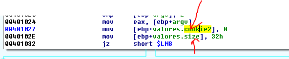

И здесь тоже.

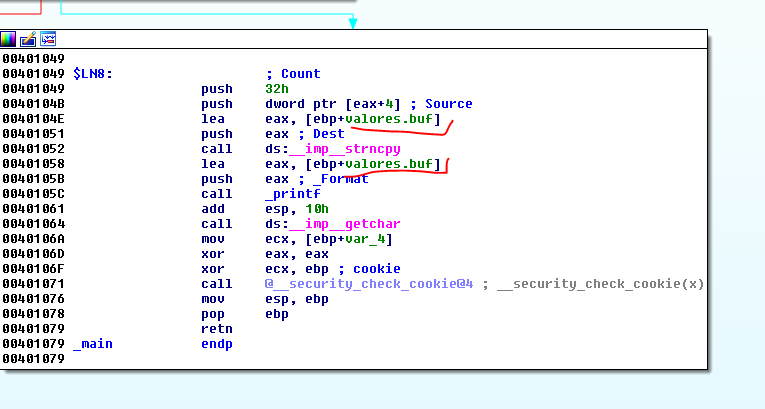

Мы видим, что **IDA** обнаружила буфер из **50** байт. Она уже переименовала его в **VALORES.BUF**, в вызовах функций **STRNCPY** и в **PRINTF** наконец.

Даже если мы перейдём на вкладку **STRUCTURES**.

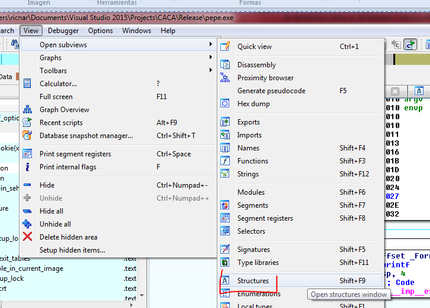

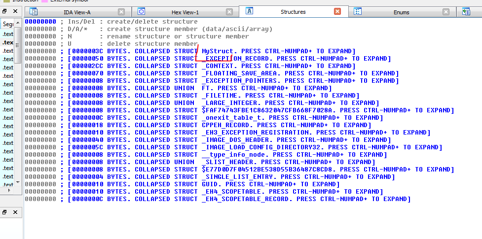

Мы видим, что определена структура. Если мы нажмём здесь **“CTRL” плюс “+”**.

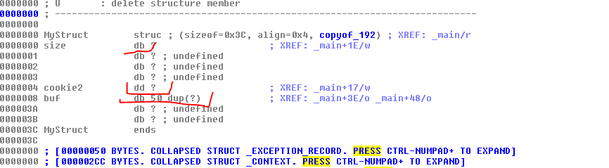

Мы видим, что размеры и имена соответствует тому, что переменная **SIZE** равна **1** байт или **DB**, переменная **COOKIE2** равна **4** байта или **DD** и **BUF** состоит из **50** десятичных байтов.

Код \(C\):

1. struct MyStruct
2. {
3. char size; // длина 1 байт
4. int cookie2; // длина 4 байта
5. char buf\[50\]; // длина 0x32 байта
6. 7. };

Даже в **IDA** существует вкладка **LOCAL** **TYPES** для того, чтобы редактировать и вводить структуры в формате **С++.** Я мог увидеть, есть ли они там.

Их существует очень много. Но поскольку у меня есть фильтр, то с помощью **CTRL** + **F**, я ввожу **MY** и мне показывается теперь так

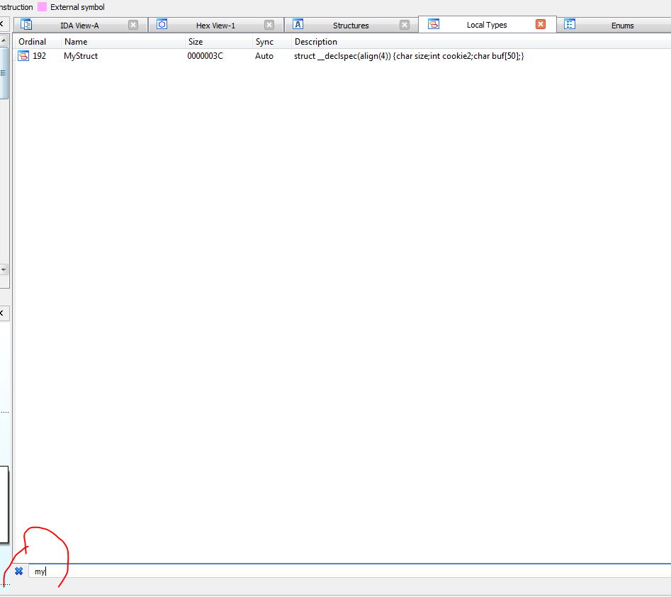

И я могу увидеть это просто сделав правый щелчок и выбрав пункт **EDIT**.

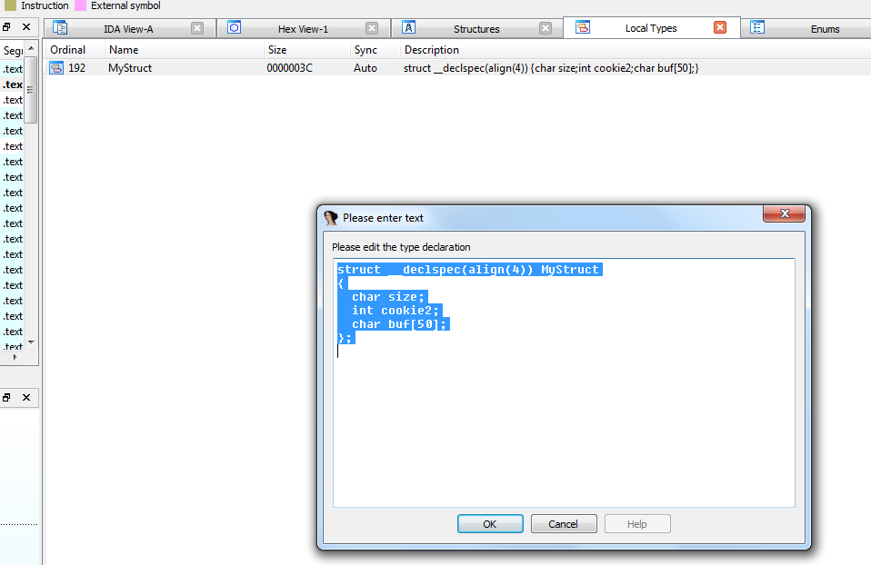

Видно, что всё правильно.

Но поскольку в жизни не всё происходит как мы хотим и почти никогда у нас не будет символов, нам придется немного попотеть, так как **IDA** не может обнаружить без них поля или структуру, хотя она даёт нам интерактивные инструменты для этого.

Если я cкомпилирую и переименую **PEPE**.**PDB**

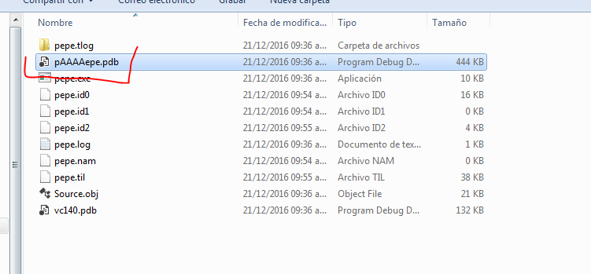

**IDA** не найдет символов, и отлаживать файл будет сложнее.

Я снова открываю файл **PEPE.EXE** и повторно дизассемблирую его.

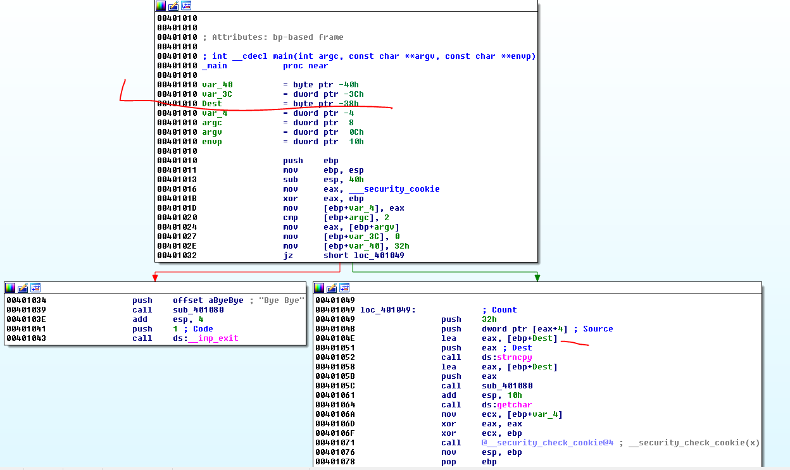

Мы видим, что структура уже не обнаружена, но её поля видны как отдельные переменные.

Проблема в том, что эта программа идёт как единственная функция и в ней есть простая структура. Позже мы увидим программы с множеством функций и сложными структурами, где они передают структуру из одной функции в другую функцию используя адрес начала структуры, которую очень сложно распознать в середине программы, но Вы создаёте её как структуру, которой соответствует каждое поле.

Мы это ещё увидим, но сейчас просто верьте мне. В реверсинге Вы должны знать как работать со структурами.

На данный момент, в этом случае, реверсинг по отдельным переменным будет работать, но давайте всё же сделаем всё правильно. Давайте сделаем работу как будто мы уже знаем что это структура. Позже мы увидим как определить, когда это структура и когда это свободные локальные переменные без структуры.

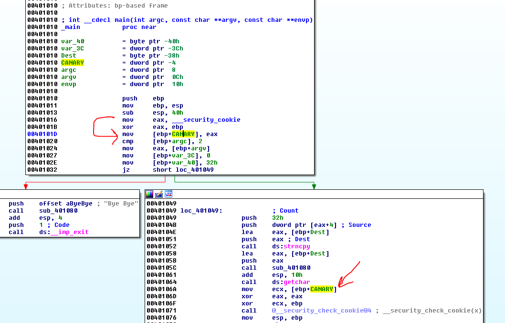

Из предыдущего реверсинга, мы уже знаем переменную **CANARY**, поэтому давайте переименуем её.

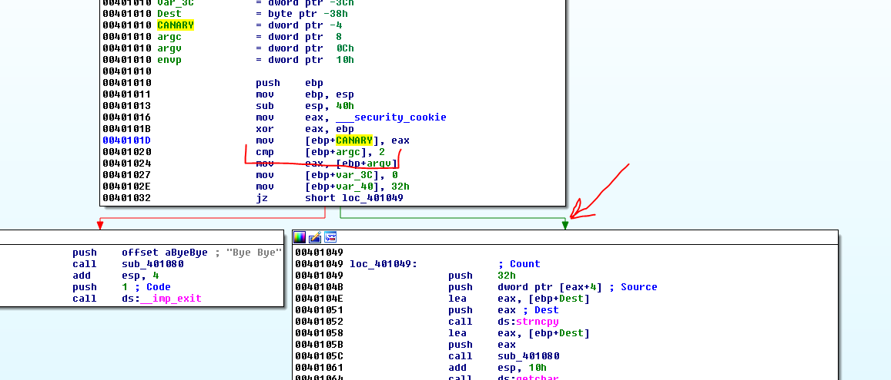

Программа сравнивает переменную **ARGC** с числом **2**. Если **ARGC** равна этому числу, то программа продолжает выполняться, а если не равна, то будет печатать нам слова "**BYE** **BYE**" и переходить к **EXIT**. Мы пометим этот блок в красный цвет, а в зеленый цвет хороший блок.

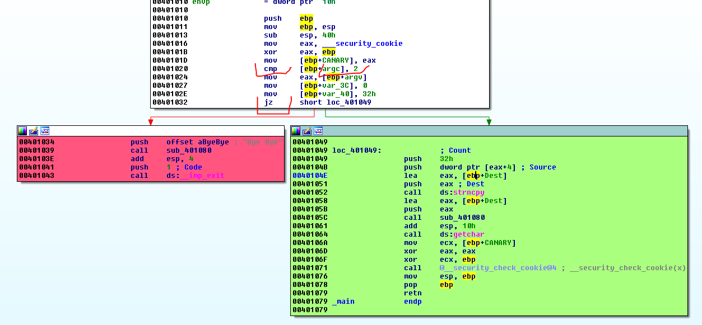

Затем мы видим, что программа сохраняет число **0x32** в переменную и что ниже программа использует значение **0x32** как размер в функции **STRNCPY**. В нашем коде, программа использовала переменную как байт, но здесь, для получения места, программа помещает значение в стек, напрямую, с помощью инструкции **PUSH** **0x32**.

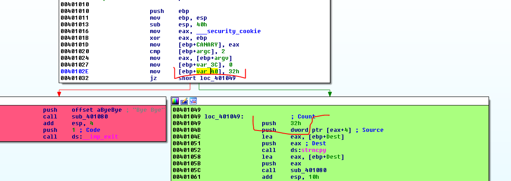

Переменная **VAR\_40** больше не используется. В любом случае, я переименую переменную в **SIZE**.

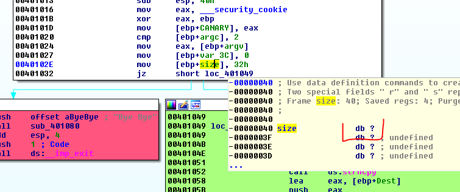

Помещая курсор над этой переменной, мы видим, что **IDA** определяет её как байтовую переменную \(**DB**\).

Также, делая правый щелчок, мы видим, что **IDA** показывает другие представления. **IDA** говорит нам, что это однобайтовая переменная, так как сама инструкция говорит об этом.

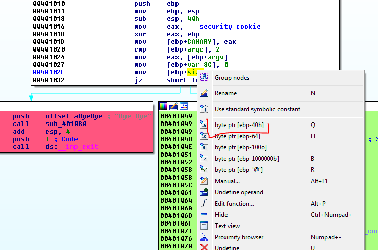

Мы знаем, что в оригинальном коде переменная **COOKIE2** не используется и программа помещает в неё в нуль.

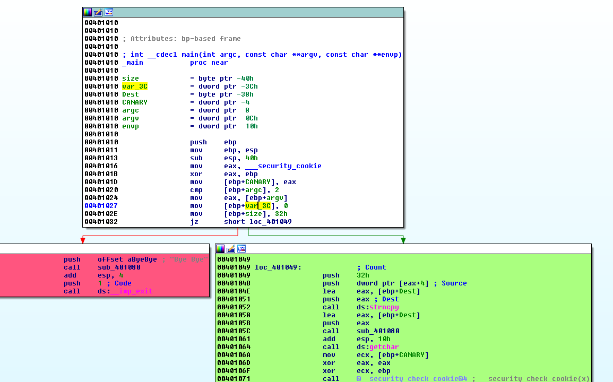

Код \(C\):

1. 2. valores.cookie2 = 0;

Мы переименуем эту переменную в переменную с именем **COOKIE2**, но если бы мы не знали что она делает, мы бы дали ей другое имя. Программа больше не использует её и эта переменная ни на что не влияет.

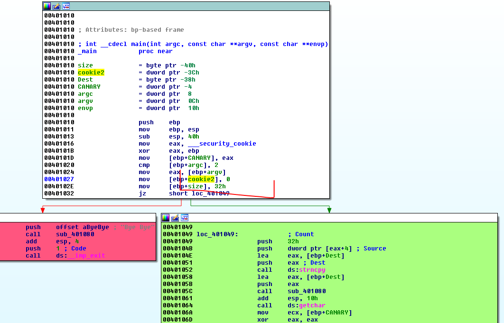

Давайте посмотрим на статическое представление стека.

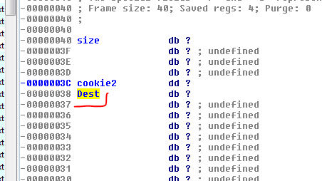

Нам не хватает буфера **DEST**. Ниже мы видим пустое пространство, которое говорит нам, что это может быть буфер. Когда я ищу ссылки с помощью **X**, то нахожу

Почти всегда буферы будут иметь некоторую ссылку, т.е. будут использовать инструкцию **LEA**, так как для заполнения мы должны передать адрес некоторой функции. Функция **STRNCPY** получает адрес буфера через **LEA**.

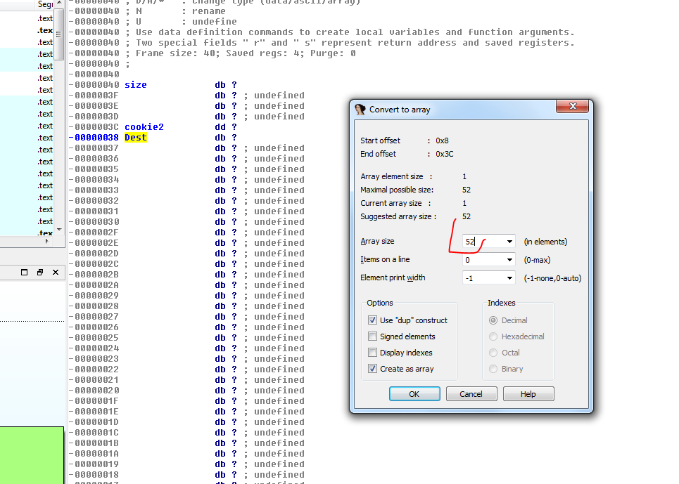

В этом случае, программа резервирует **52** байта вместо **50**, что обычно имеет место.

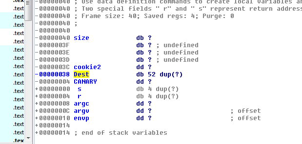

Мы уже видим законченное представление стека. Из этого мы можем понять, что переполнения нет, потому что мы знаем что буфер **DEST** имеет длину **52** байта, а программа копирует в него **0x32**байта в **HEX** через функцию **STRNCPY**.

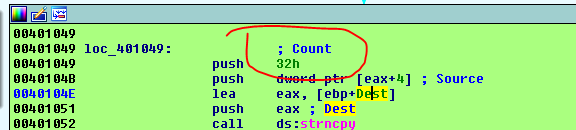

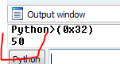

Программа копирует **50** десятичных байтов в буфер длиной **52**, что делает его не уязвимым, и переполнение не происходит.

Всё это конечно хорошо, но мы должны начать медленно изучать структуры, и, хотя, этот пример не для этого, мы будем его использовать.

Давайте пойдём в статическое представление стека.

Если есть структура, она не будет содержать переменную **CANARY**, которая добавляется компилятором.

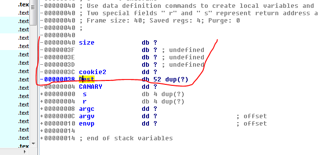

Возможно структура охватит эти адреса.

Таким образом, я помечаю эту область и иду в меню, в пункт **EDIT**→ **CREATE** **STRUCT** **FROM** **SELECTION**

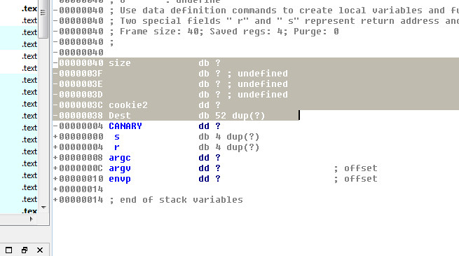

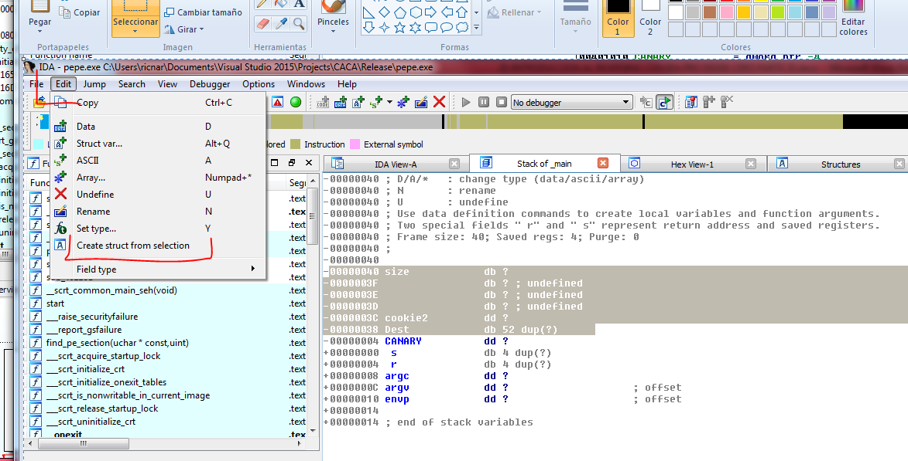

И это становится таким. Если мы посмотрим во вкладку структуры.

Переменная **STRUCT\_0** типа **STRUCT** могла бы выглядеть так, но мы переименуем её в соответствии с нашим кодом.

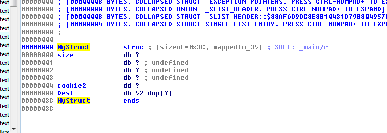

И в статическом представление стека, переменную типа **MYSTRUCT** мы переименовываем в **VALORES**.

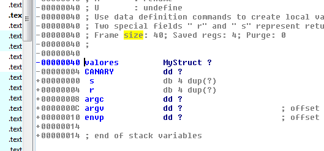

Теперь всё это стало похожим на то, когда у нас есть символы.

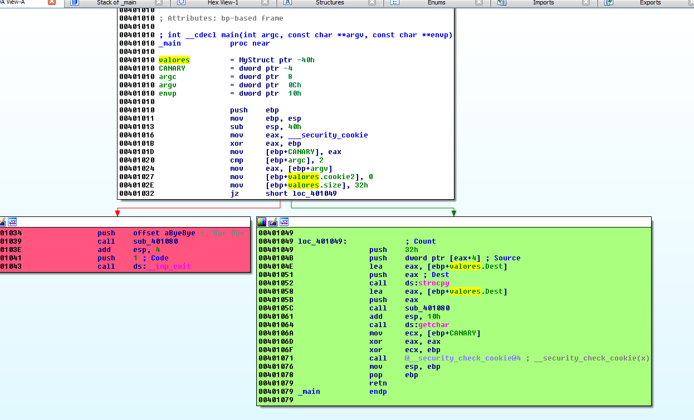

Мы видим, что, по крайней мере, в этой функции, где определена переменная **VALORES**, **IDA** автоматически переименовывает поля в **VALORES**.**XXXX**

Очевидно, это самый простой способ. Мы должны знать, что много раз в сложных структурах придется реверсить поле за полем и сражаться за них, чтобы сделать структуру максимально полной как только возможно.

В следующей части, мы продолжим с более сложными примерами структур.

Давайте посмотрим на решения упражнений **IDA3** и **IDA4**.

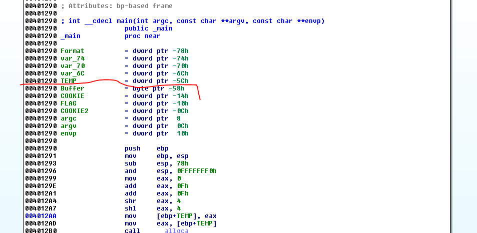

Переменная **TEMP** выше добавлена компилятором.

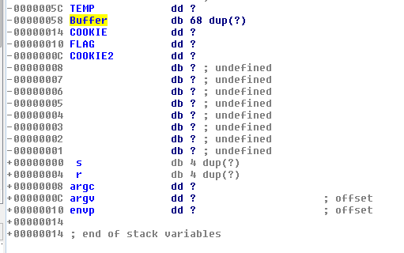

Здесь я вижу представление стека, и переменные, которые я должен перезаписать, это - **COOKIE** и **COOKIE2**. Мы уже знаем, что Вы вводите данные через функцию **GETS**, так что это пример уязвимый программы. Функция не ограничивает количество байт, которое Вы вводите.

Давайте посмотрим, сколько нам нужно байт, чтобы перезаписать переменную **COOKIE**.

Поскольку **COOKIE** находиться чуть ниже **БУФЕРА**, который состоит из **68** десятичных байтов, тогда нужно передать

**68 \* ‘A’ + “ABCD”** байт

Я переполнил бы буфер и перезаписал бы **COOKIE**. Давайте посмотрим, какое значение мне нужно внести в вышеупомянутую переменную, чтобы достигнуть хорошего сообщения.

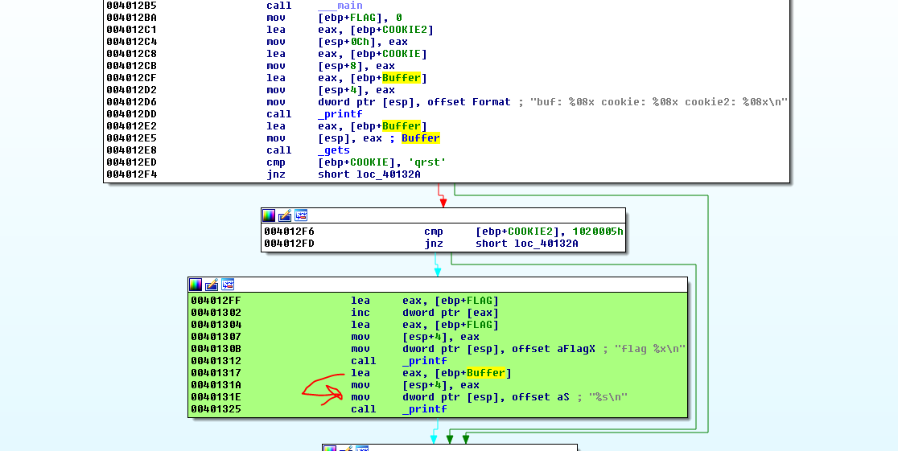

Мы видим, что несмотря на то, что нет определения хорошего сообщения, программа позволяет печатать мне то, что я хочу, так как она печатает то, что хранится в буфере. Если я обойду проверку обоих переменных **COOKIE**, я могу поместить в буфер вместо букв **A** следующее предложение

“**Lo pude hacerrrr!!!!”**

Мы подготовим скрипт вместе. Также мы видим, что после переменной **COOKIE** идёт **4** байта переменной **FLAG** и **4** следующих байта - это переменная **COOKIE2**.

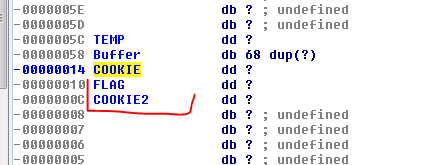

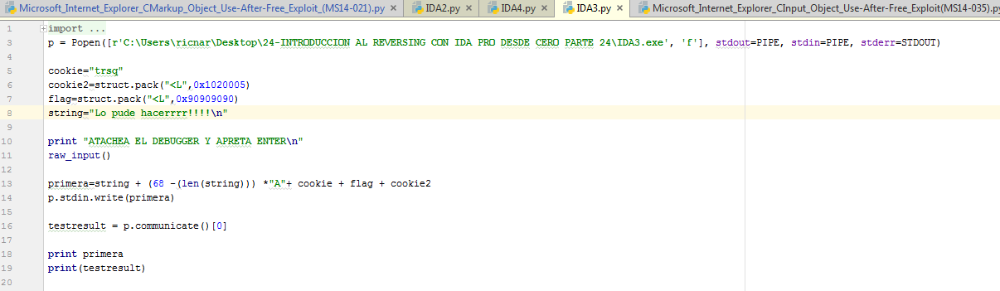

Ели я запущу эту версию скрипта.

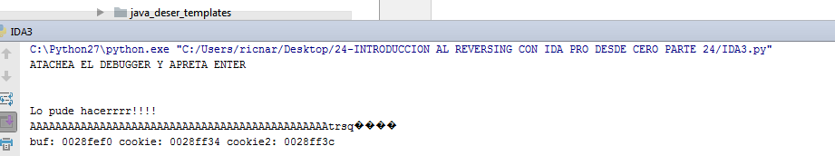

Мы видим, что я поместил строку впереди выражения и вычитаю **68** байт из длины этой же строки для того, чтобы осталось в итоге **68** байт, поэтому **COOKIE** и **COOKIE2** не будут перезаписаны строкой и мы останавливается на границе с ними.

Код \(C\):

1. string + \(68 -\(len\(string\)\)\) \*"A"

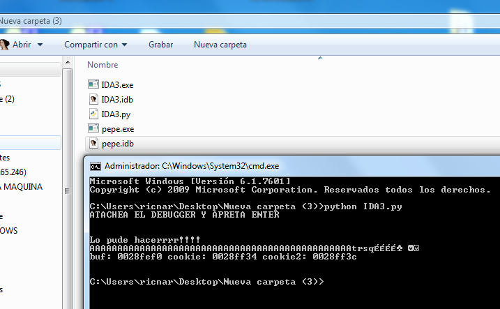

В примере **IDA4** мы видим, что существует функция проверки **CHECK**.

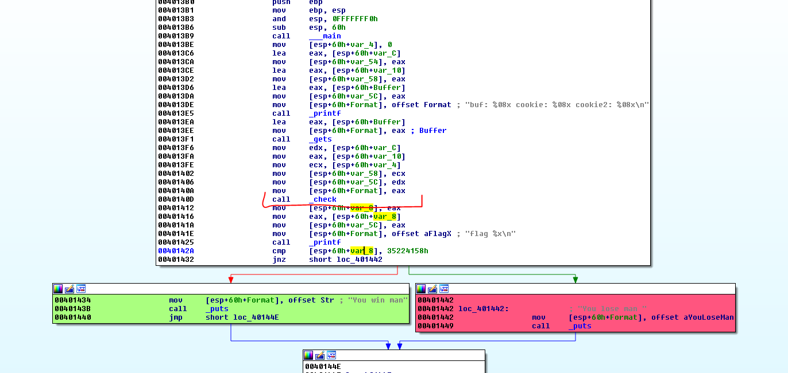

Давайте реверсить функцию **MAIN**.

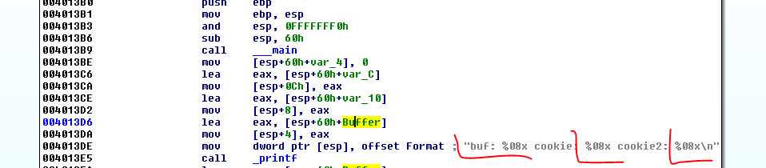

Мы видим, что в функции **PRINTF**, программа печатает три адреса: **COOKIE**, **COOKIE2** и буфер.

Давайте переименуем переменные.

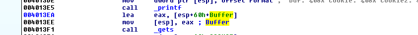

Затем программа передаёт буфер в функцию **GETS**, поэтому мы знаем, что он будет уязвимым. Просто посмотрите на длину буфера.

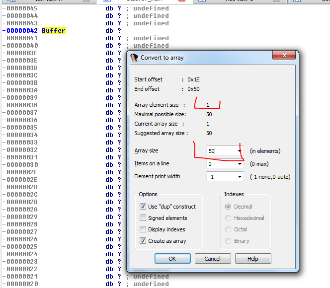

Мы видим, что он равен **50** десятичных байт.

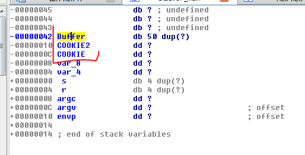

И дальше идут **2** **КУКИСА**, по **4** байта каждый.

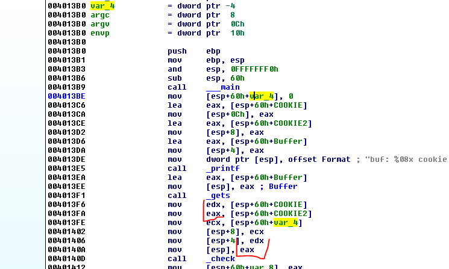

Мы видим, что два **КУКИСА** передаются как аргументы к функции **CHECK**, плюс добавляется переменная **VAR\_4**, про которую мы ещё ничего не знаем. Мы будет, пока, называть её как **ФЛАГ**, позже мы изменим ей имя.

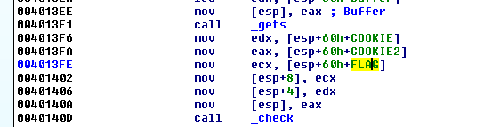

Мы видим, что самый дальний аргумент это **FLAG**, затем идёт переменная **COOKIE** и наконец **COOKIE2.** Давайте войдем в функцию **CHECK**.

Мы видим три аргумента и локальную переменную.

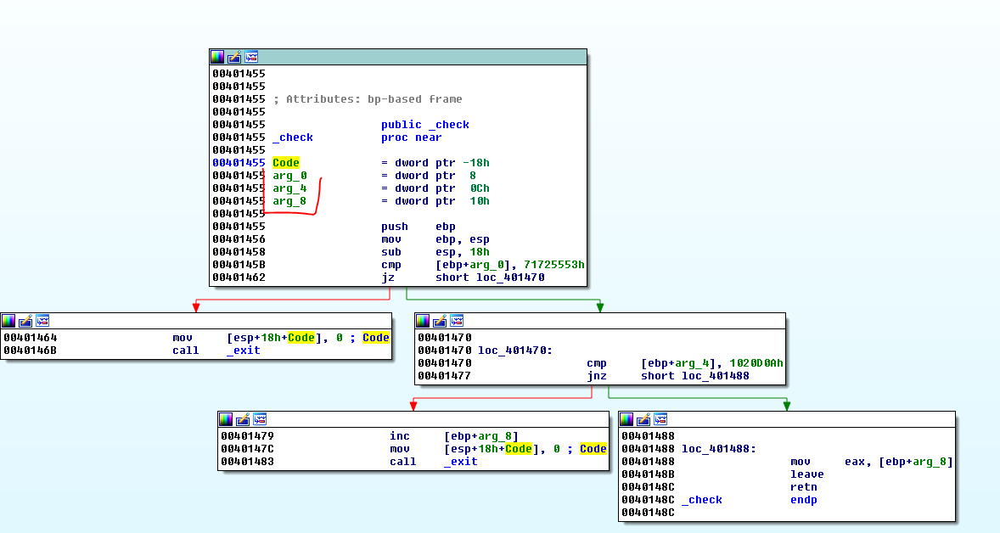

В статическом представлении стека всё это выглядит хорошо.

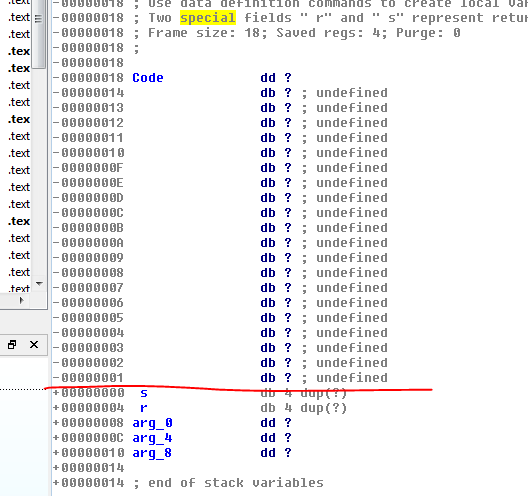

То, что находится ниже линии, под **S** и **R** будет аргументами, а выше - будет локальными переменными.

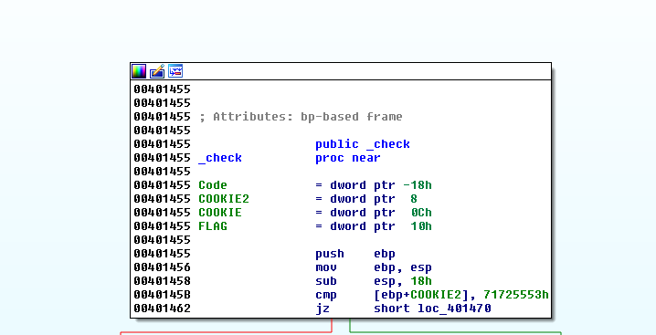

Я переименовываю их согласно порядку, в котором они идут и делаю правый щелчок и выбираю **SET** **TYPE** для того, чтобы распространить имена по функции **MAIN** и вижу, что все хорошо.

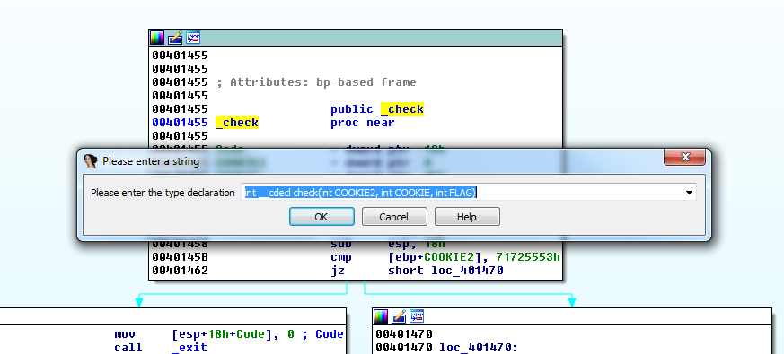

Мы видим, что имена совпадают.

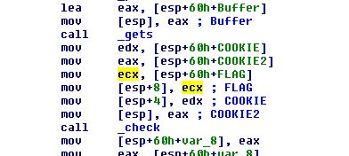

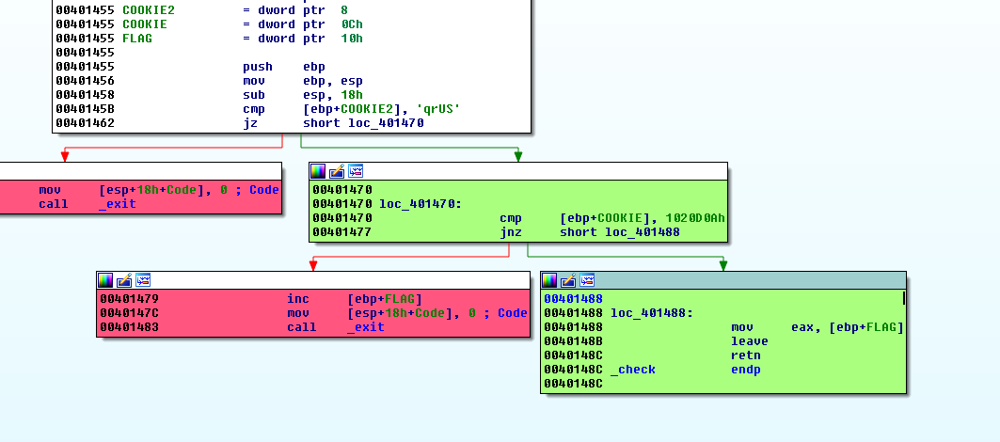

Мы видим, что единственный способ добраться до **RET** и не пойти на **ВЫХОД** - это идти по зеленым блокам \(**Follow the white rabbit, NEO** - Прим. Яши\) и **COOKIE2** должно быть равно **qrUS**, а **COOKIE** равно **0x10200D0A**. Давайте добавим эти значения в наш скрипт.

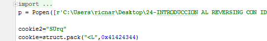

С этими значениями, мы оставим функцию **CHECK**, но всё ещё чего-то не хватает. Мы видим, что значение, которое возвращается функцией **CHECK** - это значение флага.

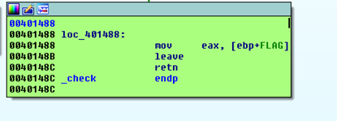

Это значение, которое программа сохраняет в переменную **VAR\_8** и наконец сравнивает. Так что флаг должен быть равен значению **35224158**.

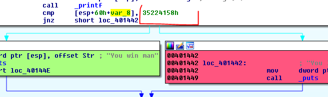

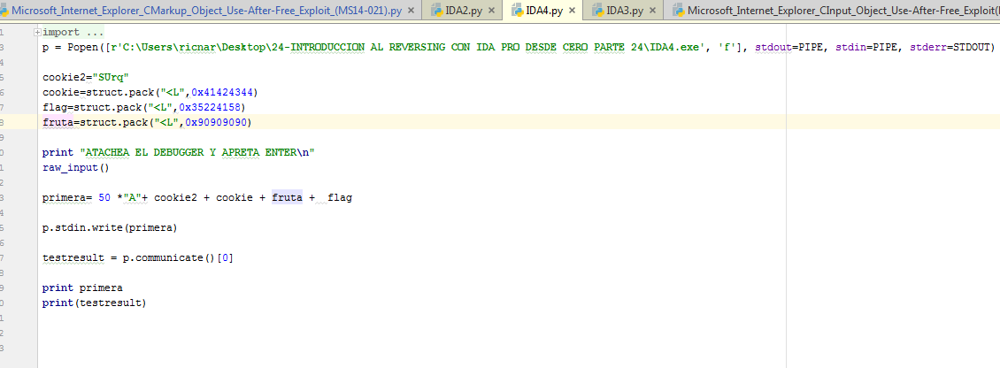

Если мы попробуем теперь такой скрипт.

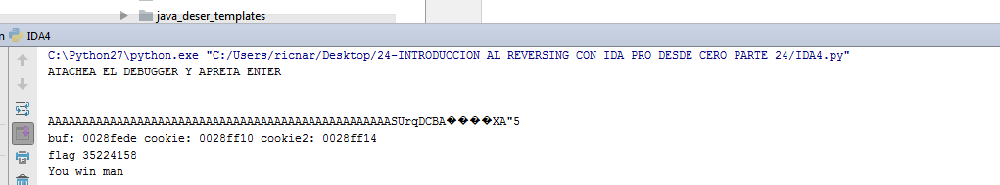

Он работает. В следующей части, мы рассмотрим больше структур.

До встрече в **26**-той главе

=====================================================
Автор текста: **Рикардо Нарваха** - **Ricardo** **Narvaja** \(**@ricnar456**\)
Перевод на английский: **IvinsonCLS \(@IvinsonCLS\)**
Перевод на русский с испанского+английского: **Яша\_Добрый\_Хакер\(Ростовский фанат Нарвахи\).**
Перевод специально для форума системного и низкоуровневого программирования — **WASM.IN
10.12.2017
Версия 1.0**
