# Часть 27

В этой главе, мы будем решать упражнение, которое мы оставили для решения в предыдущей части. Оно называется **IDA\_STRUCT.7Z**. Если Вы не решили это упражнение или у Вас его нет, загрузите его отсюда.

[http://ricardo.crver.net/WEB/INTRODUCCION AL REVERSING CON IDA PRO DESDE CERO/EJERCICIOS/IDA\_STRUCT\_RESOLVER DESPUES DE LA PARTE 26.7z](http://ricardo.crver.net/WEB/INTRODUCCION%20AL%20REVERSING%20CON%20IDA%20PRO%20DESDE%20CERO/EJERCICIOS/IDA_STRUCT_RESOLVER%20DESPUES%20DE%20LA%20PARTE%2026.7z)

Исполняемый файл называется **CONSOLEAPPLICATION4.EXE** и в том же каталоге находятся символы **CONSOLEAPPLICATION4.PDB.**

Когда **IDA** загрузит файл, то сообщит Вам, что она пытается найти символы. Вы можете указать на этот файл и загрузить символы, с которыми программу станет немного яснее понимать. Но для нашего примера, я буду удалять или переименовывать файл **PDB**, чтобы загрузить программу без символов, что соответствует тому, с чем мы обычно имеем дело. Хотя это и выглядит сложнее, зато приближено к реальности.

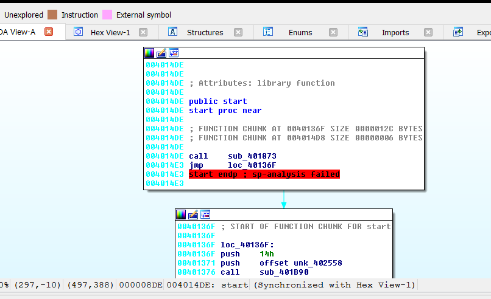

Очевидно, что без символов, функция не будет определяться как **MAIN**. Мы можем добраться до неё, так как это консольное приложение, которое ищет аргументы **ARGV** или **ARGC**, а если их нет**,** то её, обычно, можно найти через поиск строк.

Если мы запустим программу, то увидим, что первое, что она сделает - это попросит нас ввести число. Здесь Вы видите строки, которые могут быть хорошим и плохим сообщением.

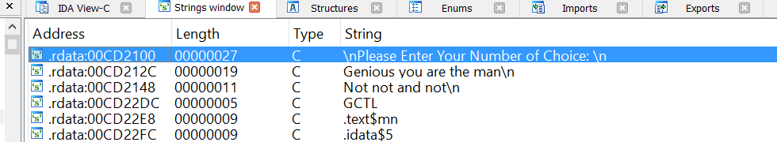

Щелкните на строке **PLEASE ENTER YOUR NUMBER OF CHOICE:**

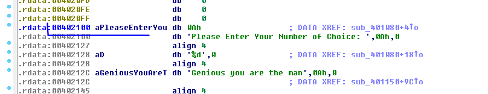

Мы видим, что строка имеет ссылки. Помещая курсор над стрелкой или нажимая клавишу **X** на адресе, мы видим, что строка имеет ссылку.

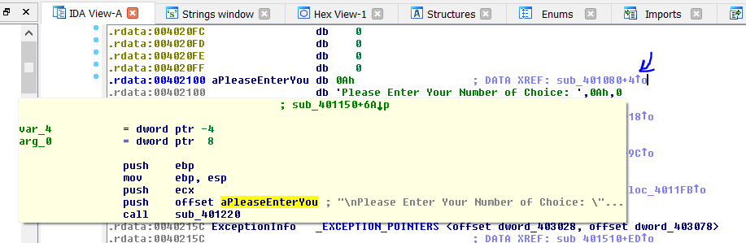

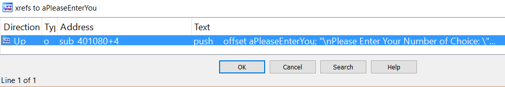

Давайте перейдём по этому адресу.

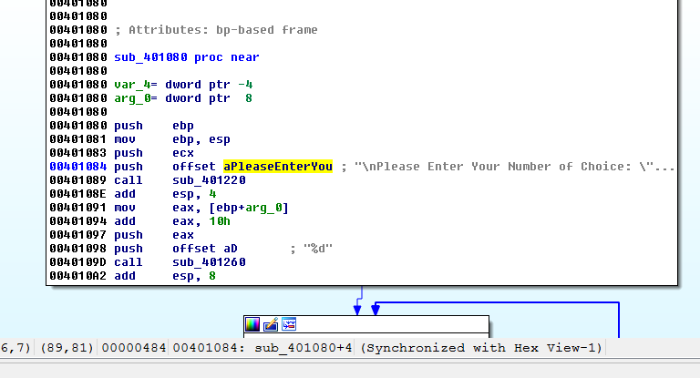

Видим, что мы находимся внутри функции. Далее видно вывод строки и вызов функции для печати этой строки. Поскольку у нас нет символом, **IDA** не говорит нам, что функция по адресу **0x401220** - это функция **PRINTF**. Если мы посмотрим во внутрь этой функции.

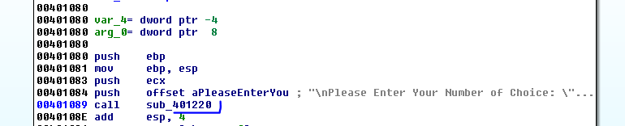

Вы можете посмотреть во внутрь этой функции и увидеть, что внутри есть ещё несколько функций.

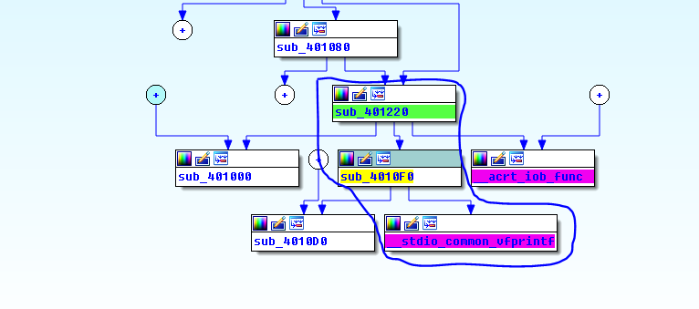

В **PROXIMITY** **VIEW**, в который можно войти нажав клавишу **-** и выйти, нажав **+,** мы видим, что функция **0x401220** вызывает те же самые три функции, но две функции **0x401000** и **ACRT\_IOB\_FUNC** - это функции, которые что-то делают и возвращаются назад. Они не идут к другим дочерним функциям.

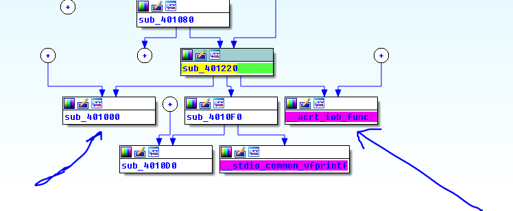

Здесь, где есть стрелки, которые я добавил, видно, что блоки не идут к другим функциям. Только одна функция, которая вызывает другие функции - это функция по адресу **0x4010F0**, которая вызывает две функции и первая из вызываемых, это функция **VFPRINTF.** Функция после своего выполнения возвращается обратно и ниже уже нет никаких других функций.

Это также можно увидеть в дизассемблерном списке. Если я посмотрю во внутрь каждой функции, я увижу то же самое.

Видно, что функция **0x401000** никуда не ведёт. Функция просто исполняет ерунду и возвращает выполнение.

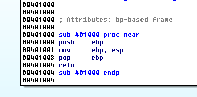

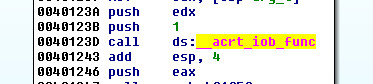

И **\_ACRT\_IOB\_FUNC** - это **API** функция. Поэтому функция не будет продолжаться??? Функция будет только инициализировать поток **STDOUT**, чтобы затем быть готовой печатать текст.

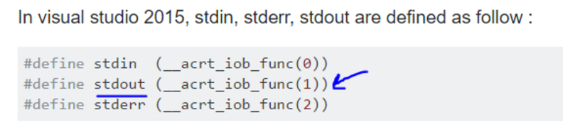

Другими словам, передача аргумента **1**, как в нашем случае, будет инициализировать поток **STDOUT**.

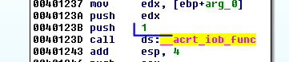

И третья функция, которая будет вызываться, это функция по адресу **4010F0**.

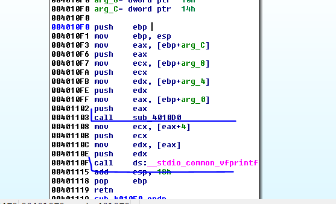

Функция заканчивается вызовом **VFPRINTF**, т.е. мы пришли к тому же, что видно и в **PROXIMITY** **VIEW**, но это занимает больше времени.

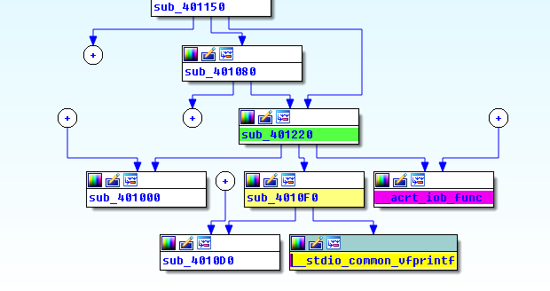

Так что давайте переименуем функцию по адресу **0x401220** в **PRINTF**.

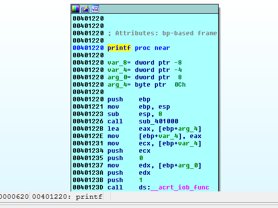

Те блоки, которые заканчиваются вызовом **API**, как в этом случае **PRINTF**, я буду закрашивать в небесный цвет. Каждый будет делать это по своему вкусу.

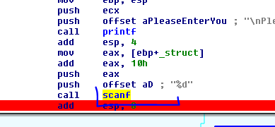

Следующая функция по адресу **0x40109D** – это конечно же функция **SCANF**. Если мы перейдём в неё и посмотрим в **PROXIMITY** **VIEW**, то увидим:

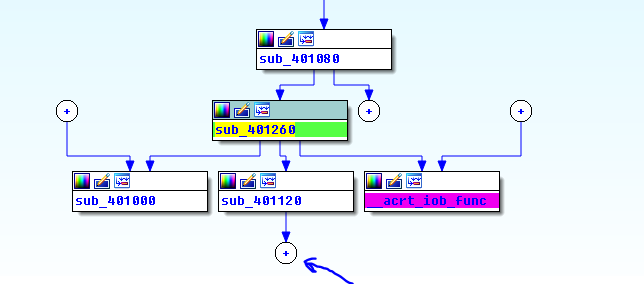

Здесь я нажимаю на **+,** чтобы увидеть спрятанные блоки.

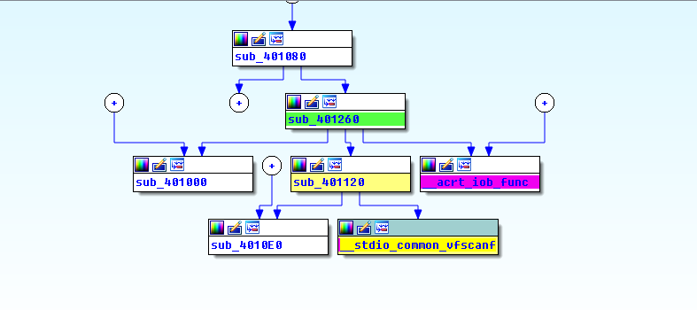

Мы видим, что это функция **SCANF**.

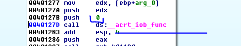

И в этом случае, функция **\_ACRT\_IOB\_FUNC** с аргументом **0** инициализирует поток **STDIN**.

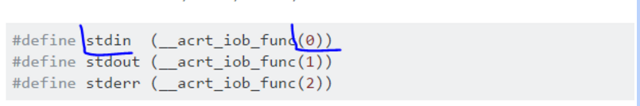

Поэтому, мы переименовываем эту функцию в **SCANF**.

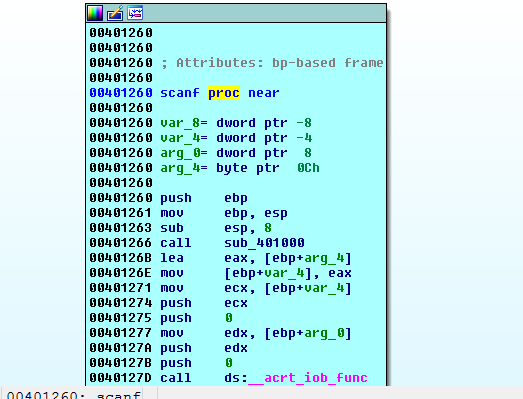

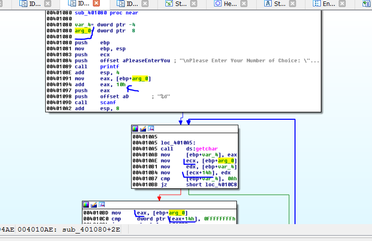

Мы видим что-то похожее на структуру, потому что когда Вы передаёте адрес как аргумент и затем извлекаете его и прибавляете к нему смещение для доступа к полям в каждом месте, в котором они используются, возможно это является адресом структуры.

Давайте посмотрим на ссылки для следующую функции.

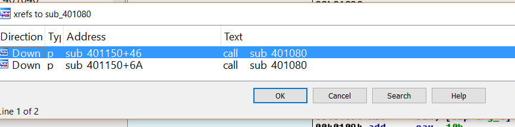

Мы видим, что есть две ссылки. Если я зайду в первую.

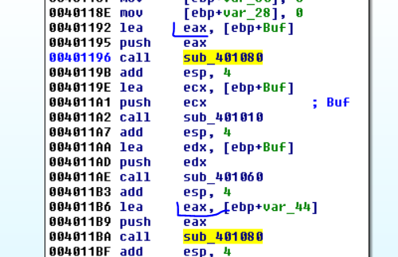

Я вижу, что аргумент в обоих случаях является адресом, который даёт представление о структурах.

Поскольку два разных адреса производят впечатление, что они были двумя структурами одного и того же типа, мы начнем создавать единую структуру, не зная размера, не зная полей или чего-то еще. Мы будем понемногу реверсить её внутреннюю структуру.

Мы видим, что максимальное смещение, которое я нахожу до настоящего времени равно **0x14.** Поэтому я буду создавать структуру этой длины. Если структура станет больше, я буду увеличивать её размер.

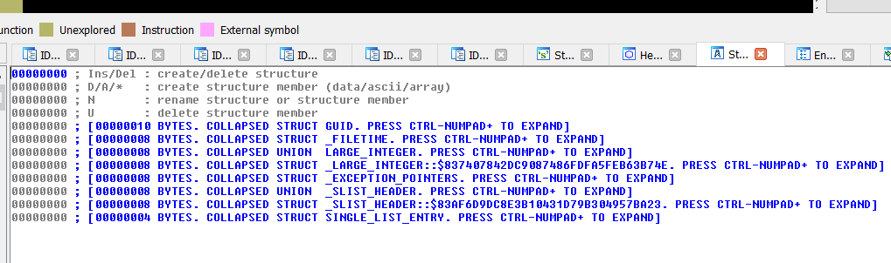

Для этого, я иду во вкладку **STRUCTURES**. Это один из способов её создания. Другой способ - это перейти в **LOCAL** **TYPES** и создать её как код в стиле **C**. Давайте так и сделаем.

Это немного раздражает и это не очень интуитивно. Но хорошо когда мы находимся в месте где определена структура. Здесь мы можем сделать **CREATE** **STRUCT** **FROM** **SELECTION**. Обычно мы будем создавать структуру в некоторой функции где она не определена, ничего не зная о ней.

Я знаю, что если проанализировать представление стека функции **MAIN**, я мог бы здесь использовать опцию **CREATE** **STRUCT** **FROM** **SELECTION** и это облегчило бы мне жизнь, но давайте возьмём наихудший случай. Представим, что мы находимся в функции очень большой программы и что мы далеко от того места, где она была определена, так что мы должны исправить их как только можем.

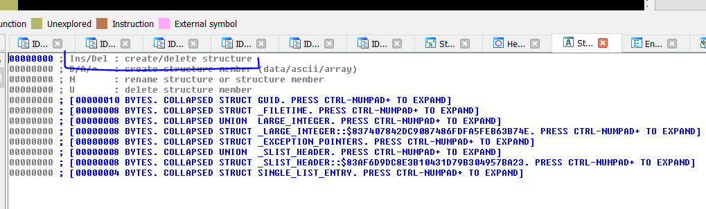

Здесь мы видим, что для создания структуры Вы должны нажать клавишу **INS.** Сделаем же это.

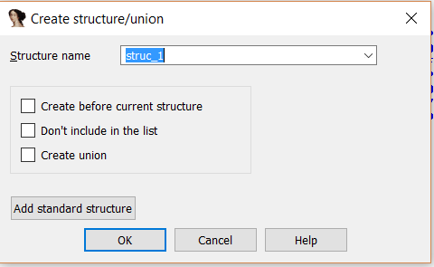

Я могу назначить имя, какое захочу. Назовём нашу структуру **MYSTRUCT**.

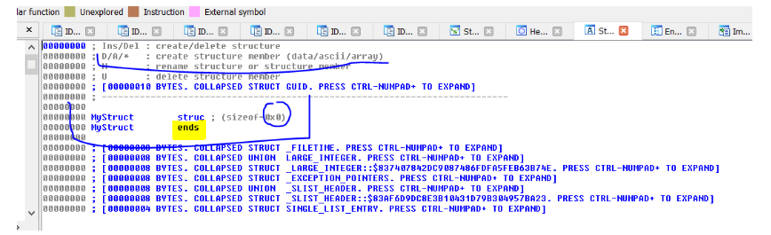

Здесь она была создана мной с размером **0**. Сейчас я буду делать трюк. Когда я всё ещё не знаю полей или чего-то ещё и я хочу дать полю размер, сначала я нажимаю **D** на слове **ENDS**, чтобы добавить одно поле.

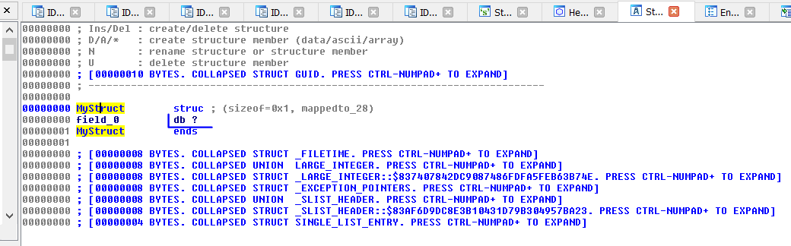

Здесь я добавляю поле длиной **1** байт **DB**. Если бы я снова нажал **D**, я бы переключился на слово **DW** и затем на **DD**.

Но здесь, поскольку мы не знаем, что нам нужно, мы оставляем всё так и делаем правый щелчок на структуре.

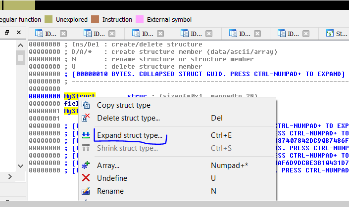

Так как я видел поле со смещением **0x14**.

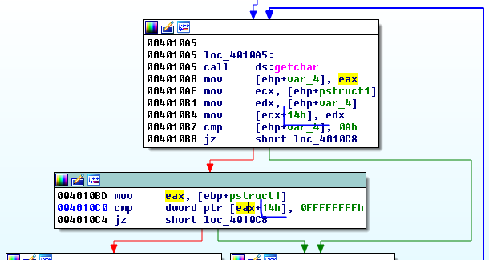

Таким образом, чтобы заполнить это поле с помощью **DWORD**, структуре нужно ещё **4** байта, поэтому я буду создавать структуру из **0x18** байт**.** Я буду добавлять ещё **0x17** байт к байту, который был у структуры.

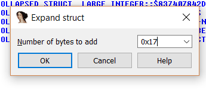

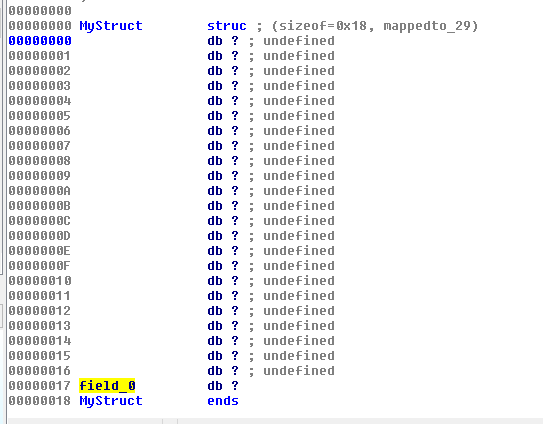

Я вижу, что размер стал равен **0x18**. Теперь мы оставим структуру такой.

Поскольку эта функция вызывается дважды, первый раз с адресом первой структуры типа **MYSTRUCT**, которую мы будем произвольно называть **PEPE** и второй раз с адресом второй структуры того же типа **MYSTRUCT**, которую мы будем называть **JUAN.** Внутри функции, мы будем давать общее имя, которое будет обслуживать оба случая.

В исходном коде, это выглядит так. Чтобы уточнить две переменные типа **MYSTRUCT** первая называется **PEPE**, а другая **JUAN**. Обе передают свой адрес как аргумент в функцию.

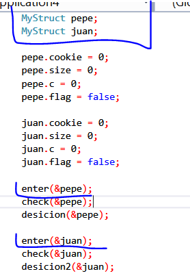

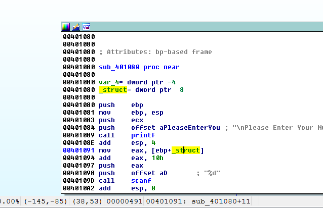

Так как одна и та же функция сначала будет иметь адрес первой структуры или **PEPE** в аргументе **ARG0** и во второй раз, когда она будет вызвана она будет иметь адрес структуры **JUAN**, то я буду давать структуре общее имя для обоих случаев, например \_**STRUCT**.

Если я декомпилирую функцию с помощью **F5**, я вижу, что результат неверный.

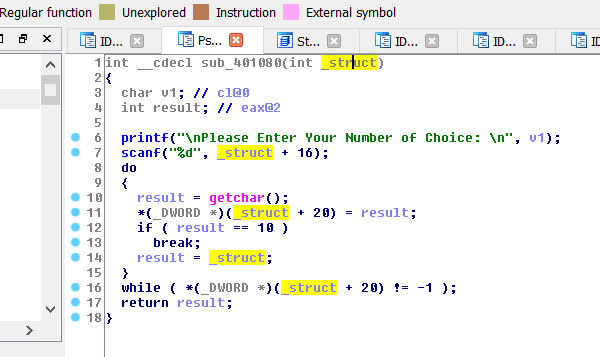

Я вижу, что определение переменной является простым типом **INT**, а не как в исходном коде как адрес структуры. Я могу это исправить так.

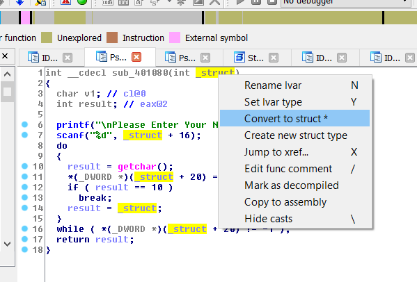

Это позволяет выбрать адрес структуры, в котором она находится, и здесь мы будем выбирать тип **MYSTRUCT**.

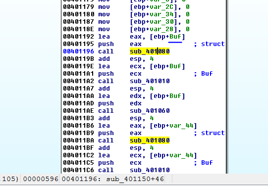

Очевидно, что **BUF** - это **PEPE** и здесь он получает свой адрес и передаёт его как аргумент. Давайте посмотрим **BUF** в представлении стека.

Поэтому структура необязательна, чтобы создать её, потому что она уже существует. Я просто должен сказать Вам, что **BUF –** это переменная типа **MYSTRUCT**. Для этого нажмите сочетание **ALT** + **Q** на переменной **BUF**.

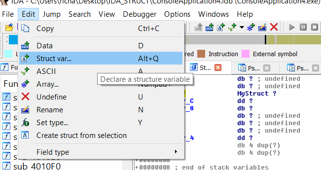

и **IDA** назначит переменной **BUF** тип **MYSTRUCT**. Если мы поместим размер ниже, некоторые поля будут опущены, но затем можно будет увеличить структуру **MYSTRUCT** и она будет исправлена только здесь.\(Если она не сломается конечно\)

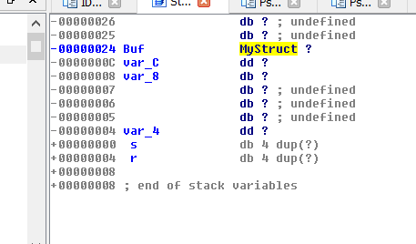

Мы переименовываем **BUF** в **PEPE**.

Мы видим здесь, что адрес **PEPE** передан и во втором вызове передаётся адрес **VAR**\_**44**, которая также будет переменной **JUAN** типа **MYSTRUCT**, поэтому мы пойдём в представление стека и на переменной **VAR**\_**44** мы также нажмём **ALT** + **Q**.

У нас уже есть две структуры типа **MYSTRUCT**.

Я возвращаюсь в функцию.

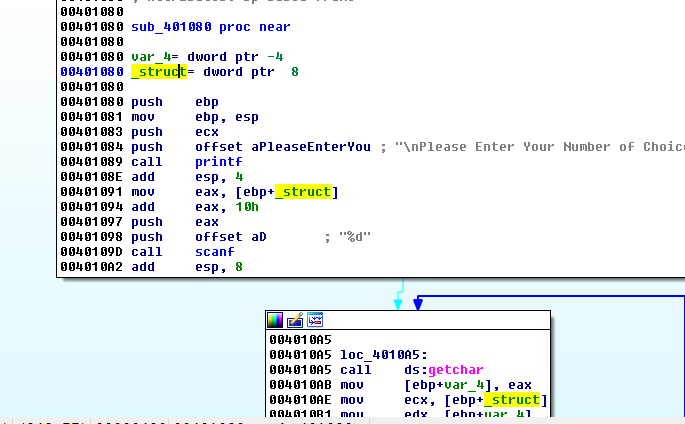

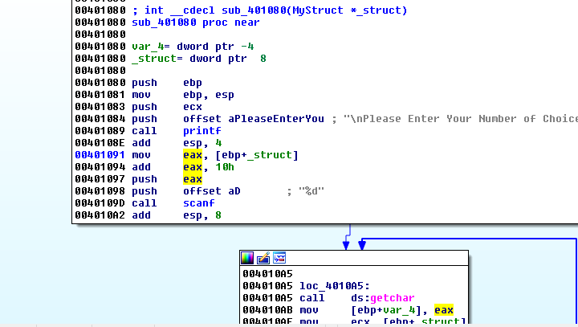

Мы видим, что поле **0x10** является **DWORD** где оно передаётся функции **SCANF**, поэтому мы переходим в **MYSTRUCT** и в поле **0x10** мы нажимаем **D** до тех пор пока оно не будет иметь тип **DD**.

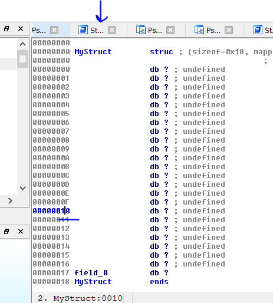

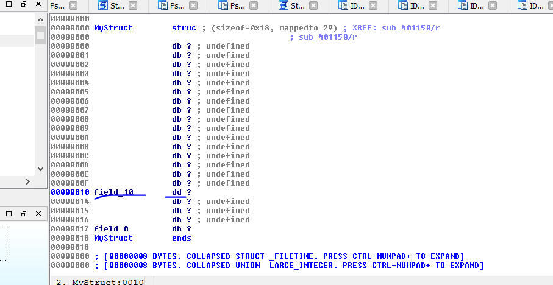

Я переименую это поле в **NUMERO**.

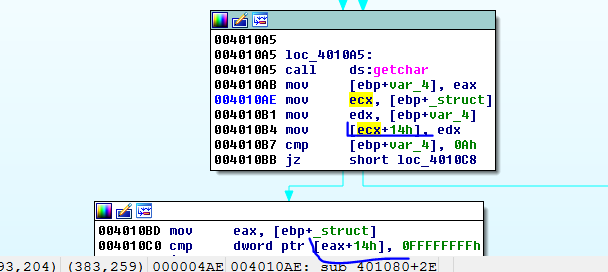

Другая запись - это поле по смещению **0x14**, которое используется в цикле для удаления символа **0xA**. Я назову его **C**.

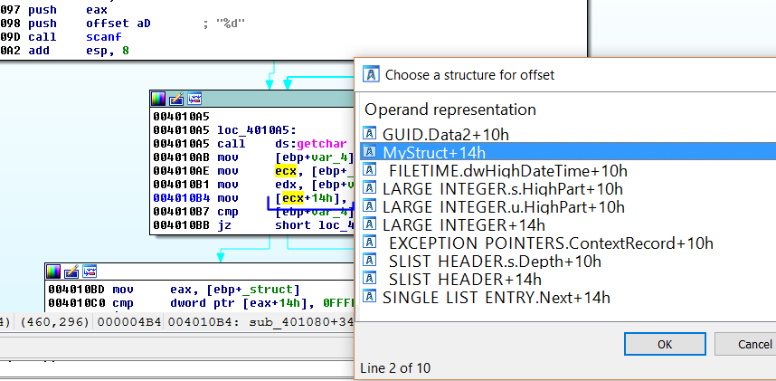

Давайте пойдём в поле по смещению **0x14** структуры **MYSTRUCT** и будем нажимать **D** до тех пор пока не появится **DWORD** и давайте назовём это поле именем **C**.

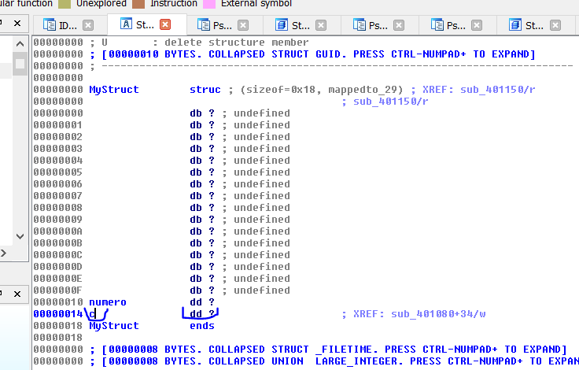

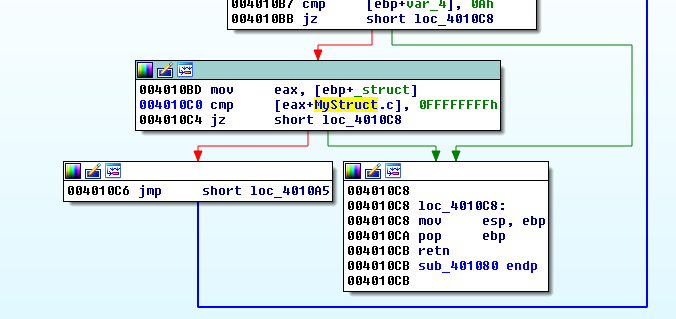

Здесь мы нажимаем **T**, чтобы освежить информацию.

Наконец, я переименовываю функцию в **ENTER**.

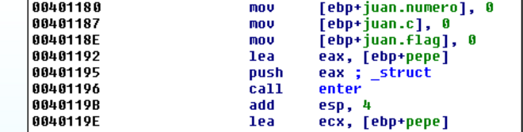

Мы видим, что три первые функции вызывают **ENTER** передавая адрес **PEPE** и три следующие передают адрес **JUAN**.

Давайте посмотрим на следующую функцию.

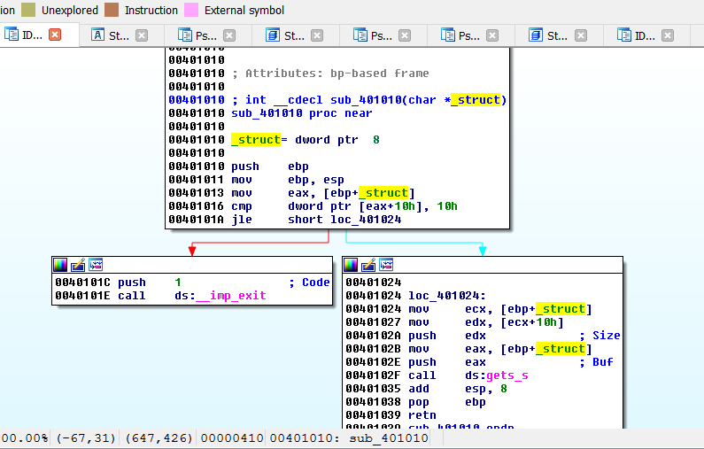

Эта функция также использует обе структуры, поэтому Вы можете равно как в предыдущем случае нажать **F5**.

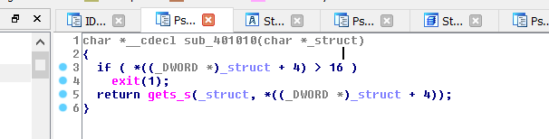

Здесь на переменной **\_STRUCT** я делаю правый щелчок и выбираю пункт **CONVERT TO STRUCT \***.

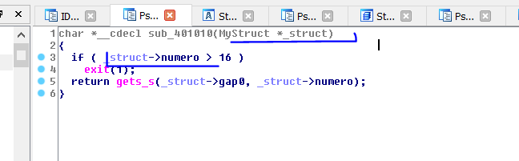

Сейчас, это адрес структуры **MYSTRUCT** и, как и раньше, мы увидим поля только нажав клавишу **T** в соответствующем месте.

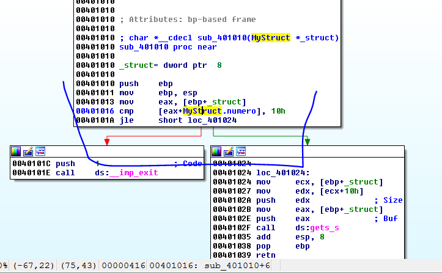

Здесь мы видим, что программа сравнивает поле **NUMERO**, которое мы передали, с числом **0x10** и поскольку сравнение знаковое, любое отрицательное число может пройти. Например число **0xFFFFFFFF**, которое равно **-1** и которое меньше **0x10**.

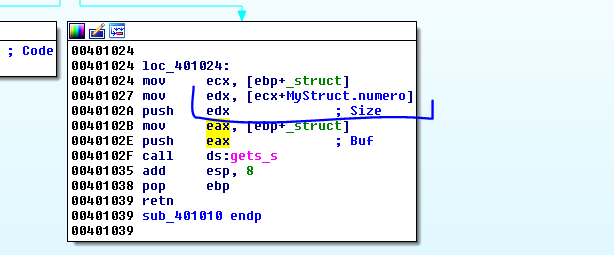

Затем, программа использует **NUMERO** как размер для функции **GETS**\_**S**, которое мы передали ей и другой аргумент. Он должен быть буфером, который находится в начале структуры, потому что он использует её начальный адрес.

Я иду в **MYSTRUCT** и по смещению **0x0** нажимаю **D** один раз, чтобы создать единственное байтовое поле.

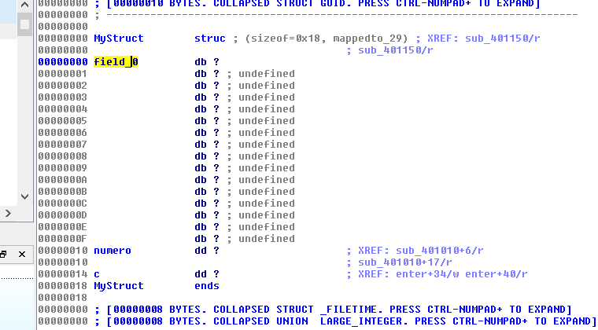

Теперь, здесь, я делаю правый щелчок и выбираю **ARRAY**.

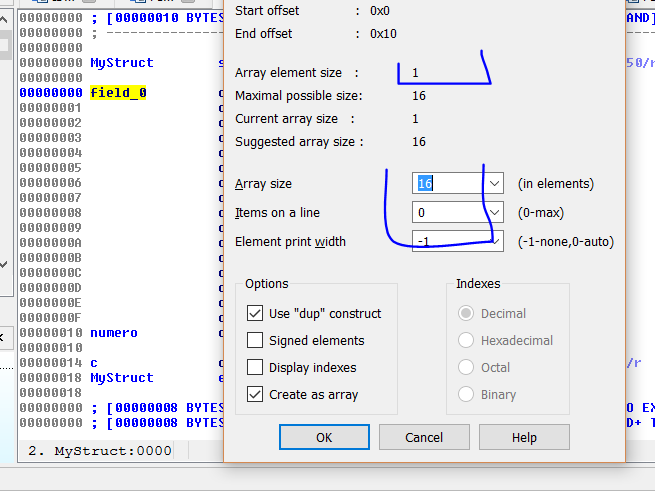

Размер буфера будет равен **16** байт. Я соглашаюсь с этим значением.

Переименовываю это поле в **BUFFER.**

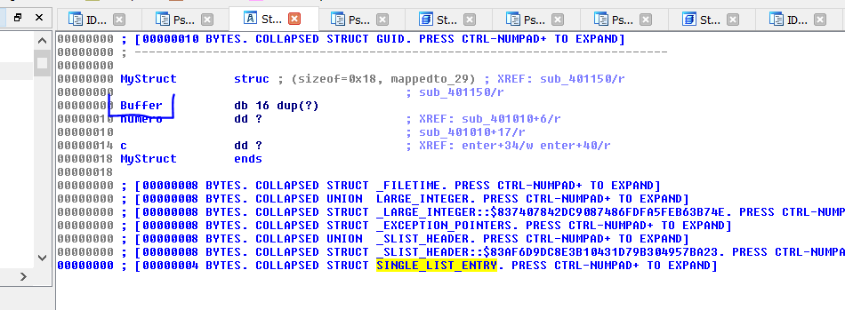

Размер поля теперь равен **16** десятичных байт.

Давайте продолжим реверсить.

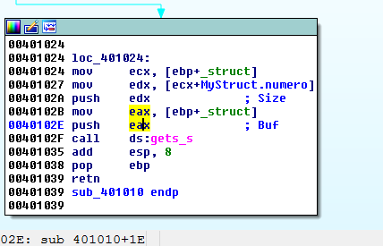

Проблема состоит в том, что с помощью функции **GETS**\_**S** буфер может быть переполнен, так как функция **CHECK** позволяет передавать отрицательные значении при использовании в качестве размера. Они будут восприниматься как беззнаковые значения и будут очень большими.

Если, например, мы передадим **0xFFFFFFFF** в сравнение, значение будет равно **-1**, потому что оно идет как знаковое и будет меньше чем **0x10**, но используя его как размер, оно будет большим положительным значением **0xFFFFFFFF**, которое позволяет нам передавать количество символом, которое мы хотим через функцию **GET**\_**S** в буфер и переполнить его.

Таким образом, мы могли бы переименовать функцию в **CHECK** или **GET**. Независимо от того, что мы хотим, нужно чтобы имя отражало то, что делает функция. Мы будем проверять это соответствие.

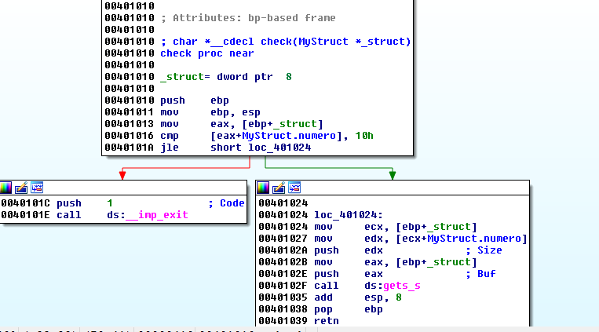

У меня есть третья функция. Аргумент тот же, поэтому я повторяю процедуру, нажимаю **F5** и изменяю тип аргумента.

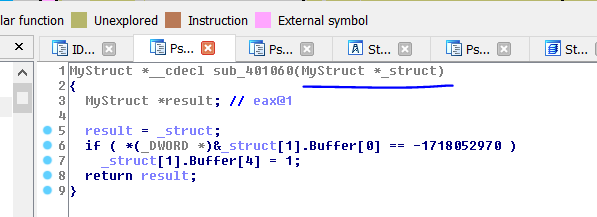

Я продолжаю реверсить.

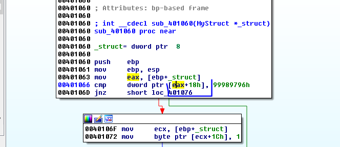

Мы видим, что есть ещё одно поле, поскольку оно пытается сравнить значение \[**EAX**+**0x18**\], которое мы не определили, так как наше последнее поле структуры **MYSTRUCT** равно **0x14**. Давайте добавим его.

Мы помещаем указатель на слове **ENDS** и нажимаем **D** до тех пор пока не создадим новое поле **DD**.

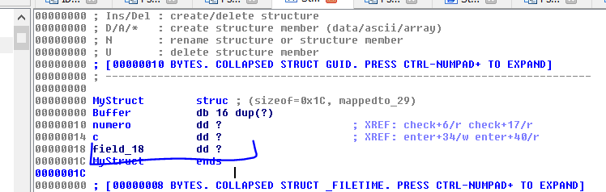

Я переименовываю это поле в **COOKIE**.

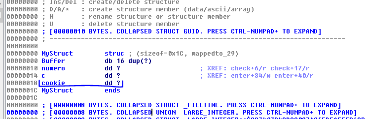

Я возвращаюсь в нашу функцию и нажимаю **T** для обновления информации.

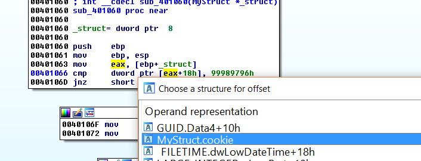

Мы видим, что существует ещё другое поле. Это единственный байт.

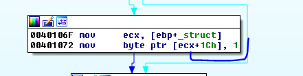

Поэтому мы возвращаемся назад в структуру **MYSTRUCT** и на слове **ENDS** нажимаем **D** один раз и у нас появляется поле из одного байта.

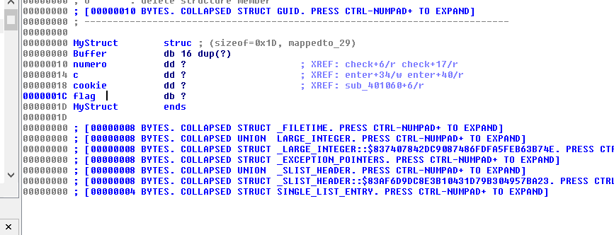

Я переименовываю это поле во **FLAG**, чтобы он совпадал с исходным кодом.

Теперь возвращаемся в функцию.

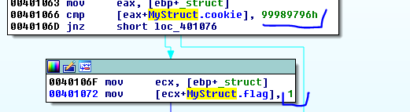

Если переменная **COOKIE** равна **0x99989796**, тогда программа будет устанавливать флаг структуры в **1**.

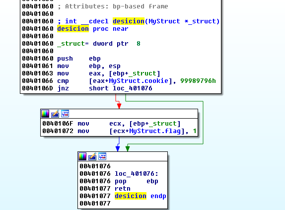

Если для некоторых изменений, которые не распространялись хорошо, переменные функции **MAIN** сломаются, и мы не сделали снимок, как это случилось со мной, то делаем так.

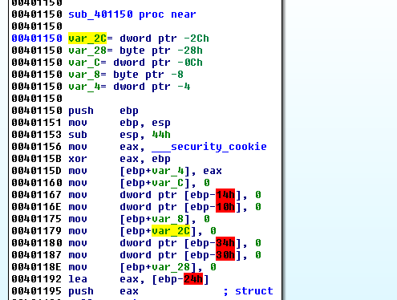

Я иду в начало поломанной функции и нажимаю **U**.

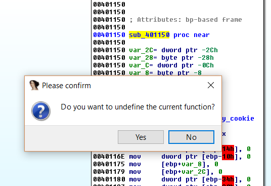

Я соглашаюсь на вопрос программы "сломать" функцию.

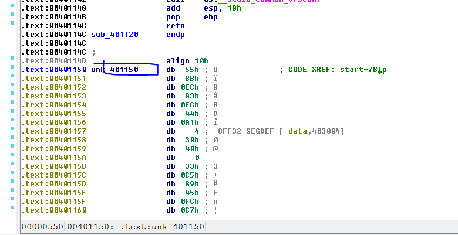

Затем, там же, в начале функции, я нажимаю **C**.

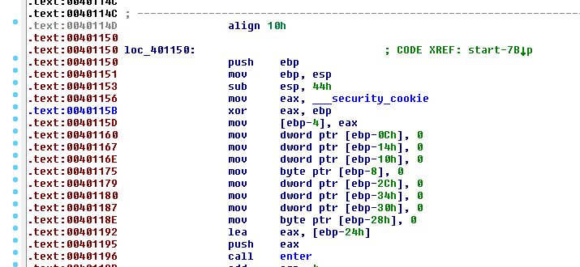

И затем я делаю правый щелчок и выбираю пункт **CREATE** **FUNCTION**.

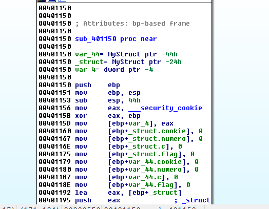

Теперь всё хорошо.

Посмотрим в статическое представление стека.

Мы видим, что после каждый структуры остаются три пустых байта, потому что последнее поле было единственным байтом и больше ничего нет.

Только имена структур неправильные, но я буду менять их в соответствии с исходным коде, т. е. я изменяю имена на **PEPE** и **JUAN**.

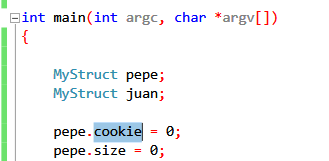

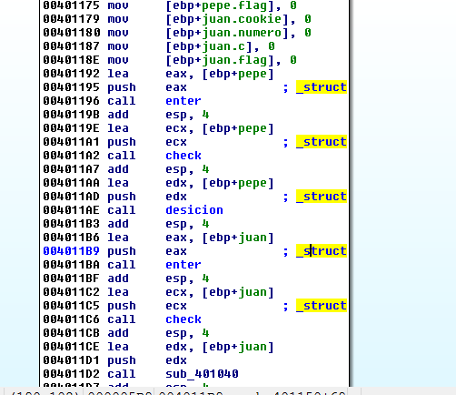

Мы видим, что со структурой **JUAN** программа будет делать то же самое что и с **PEPE**. Структуры будут передавать свои адреса функциям **ENTER** и **CHECK**. Но программа имеет ещё третью функцию. Давайте посмотрим, что она делает.

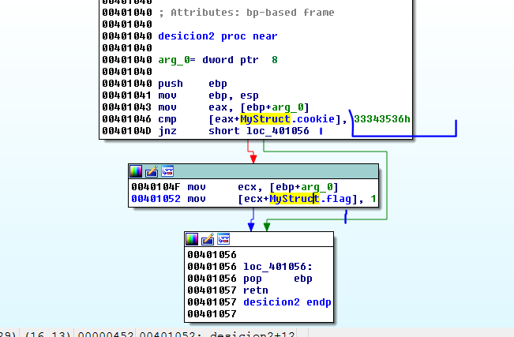

Нажимая **T** в полях, мы видим, что функция похожа на функцию "**DESICION**", только константа с которой сравнивается поле **COOKIE** структуры **JUAN** отличается. В этом случае константа равна **0x33343536**.

Другими словами, поле **COOKIE** структуры **PEPE** должно быть равно значению **0x99989796** и поле структуры **JUAN** должно быть равно **0x33343536**. Только так флаги каждой структуры будут равны 1.

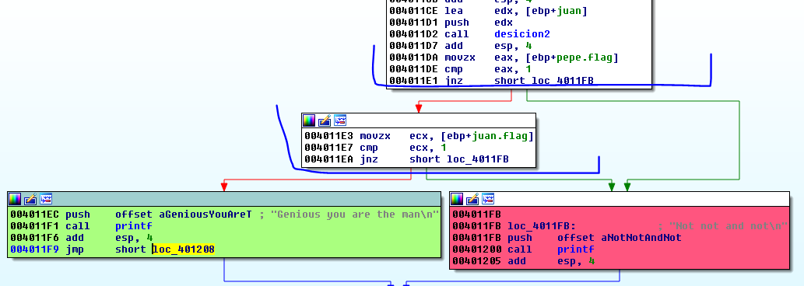

Мы видим, что для того, чтобы прийти к хорошему сообщению оба флага должны быть равны **1**.

Это упражнение имеет много решений, потому что структура **JUAN** находится выше в стеке.

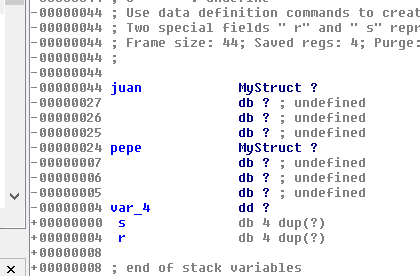

Выполняя функции **GET\_S** мы можем перезаписать все флаги так, чтобы они остались равны **1** и таки образом, сделать это одним переполнением. Также это можно сделать индивидуально, перезаписывая в каждой функции **GET\_S** флаг и нет необходимости перезаписывать поле **COOKIE** правильным значением, потому что мы напрямую перезаписываем флаг, не дожидаясь сравнения поля **COOKIE**, чтобы изменить его.

Чтобы перезаписать флаг, у меня есть **16** десятичных байт, плюс к этому значению **3** **DWORD** или это будет **12** байт.

Общая сумма байт будет равна: **16** + **12** = **28** байт.

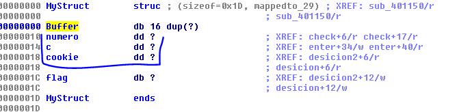

Поэтому количество фруктов будет равно: **FRUTA** = **28\*** "**A**" **+** "**\x01**"

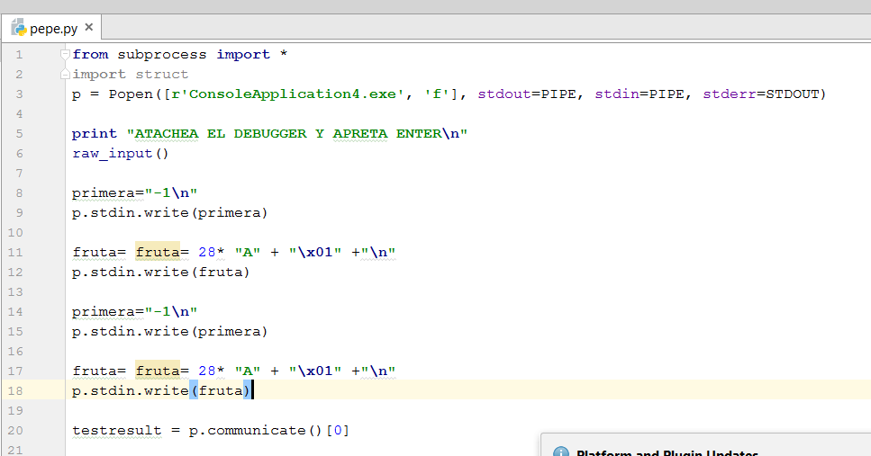

Конечно, для каждой из структур Вы должны передать **-1** или отрицательное значение, которое пройдет проверку против числа **0x10**, а затем должен следовать фруктовый-шеллкод \)\).

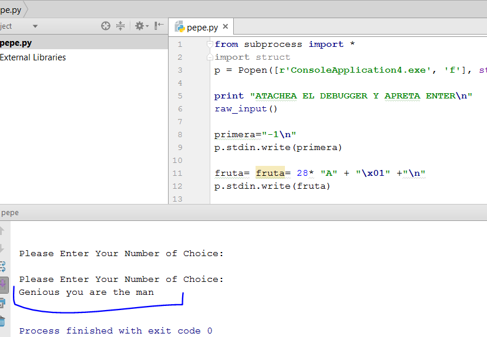

Если мы немного поотлаживаем, мы увидим значение **-1**, которое помещается в поле **NUMERO** структуры **PEPE**.

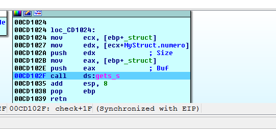

Программа проходит проверку и достигает функцию **GETS\_S**. Здесь и читаются переданные фрукты.

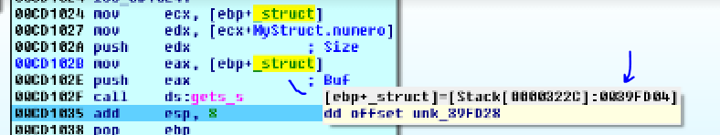

Здесь я вижу адрес структуры **PEPE** на моей машине, после исполнения функции **GET\_S**. Если я пойду в стек.

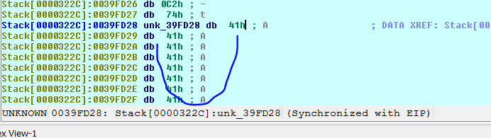

Здесь я вижу наши **ФРУКТЫ**, которые я посылаю программе. Если я хочу сконвертировать эти данные в структуру, то я нажимаю **ALT** **+** **Q**.

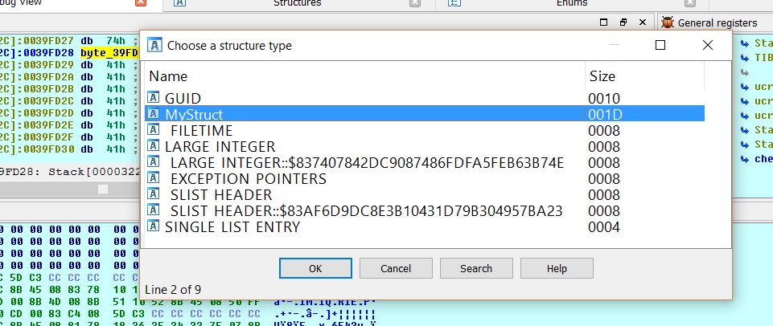

И выбираю пункт **MYSTRUCT**.

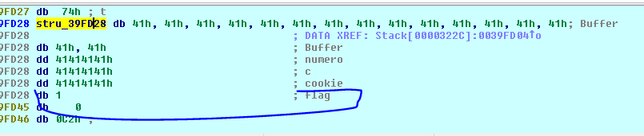

Я вижу, что поля и флаг уже перезаписан на значение 1 переполнением. Не исследуя подробно другие функции, я продолжаю трассировать.

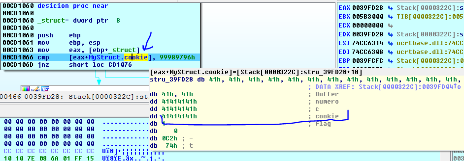

Мы видим, что программа сравнивает **COOKIE** со значением **0x99989796** и поскольку это разные значения, программа не изменят флаг. Но флаг уже равен **1**, поэтому это не так важно.

Тот же процесс будет повторяться и мы переходим в функцию **DECISION2**.

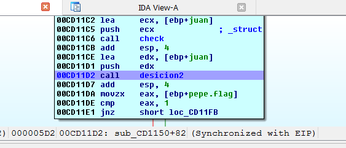

Я начинаю трассировать с помощью клавиши **F7**.

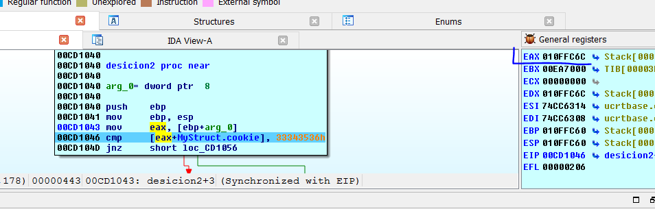

Регистр **EAX** имеет начало структуры **JUAN**. Давайте посмотрим на эту структуру в стеке.

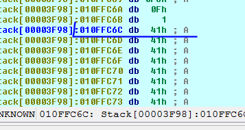

Здесь, я также нажимаю сочетание **ALT** **+** **Q**, чтобы из байтов собрать структуру. Снова выбираем нашу структуру **MYSTRUCT**.

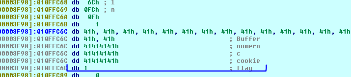

Так же как и раньше флаг будет равен **1**. Сравнение с **COOKIE** не будет равно, но программа продолжит выполняться, потому что с флагом уже всё хорошо.

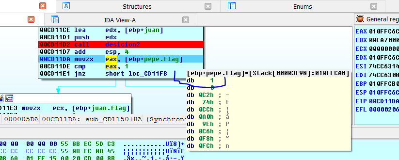

Поле **PEPE.FLAG** равно **1** и это хорошо, поэтому продолжаем трассировку.

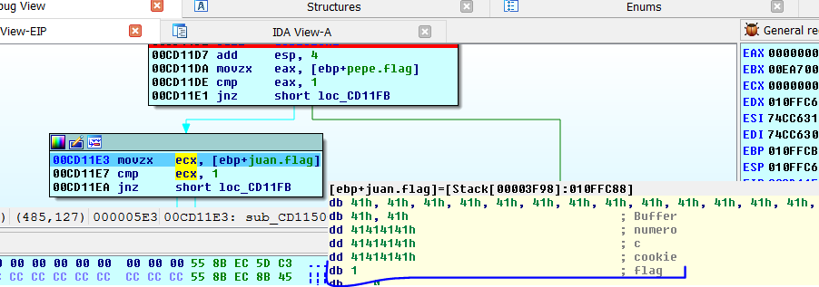

Поле **JUAN**.**FLAG** также правильное, поэтому я достигаю хорошего сообщения.

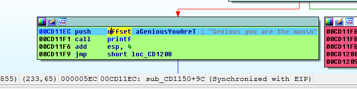

Готово. Теперь пример решен. Мы победили.
Увидимся в **28**-й главе.

* * *

Автор оригинального текста — Рикардо Нарваха.

Перевод и адаптация на английский  язык — IvinsonCLS.

Перевод и адаптация на русский язык — Яша Яшечкин.

Перевод специально для форума системного и низкоуровневого программирования - WASM.IN

05.01.2018

Источник:

[**http://ricardonarvaja.info/WEB/INTRODUCCION%20AL%20REVERSING%20CON%20IDA%20PRO%20DESDE%20CERO/27-INTRODUCCION%20AL%20REVERSING%20CON%20IDA%20PRO%20DESDE%20CERO%20PARTE%2027.7z**](http://ricardonarvaja.info/WEB/INTRODUCCION%20AL%20REVERSING%20CON%20IDA%20PRO%20DESDE%20CERO/27-INTRODUCCION%20AL%20REVERSING%20CON%20IDA%20PRO%20DESDE%20CERO%20PARTE%2027.7z)
