# Часть 28

Давайте будем чередовать теорию с практическими упражнениями, чтобы пытаться постепенно укреплять свои знания и двигаться вперед.

В этой главе, мы будем рассматривать некоторые теоретические вопросы, по темам, которые мы должны знать. Они не будут очень техническими и тяжелыми.

Мы видели, что когда мы определяем переменную, например так:

**INT** **PEPE = 4;**

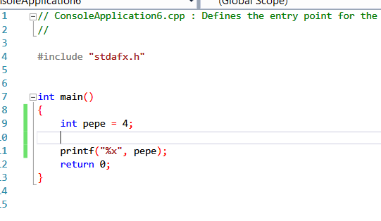

Переменная будет резервировать в памяти необходимое пространство ячеек памяти для хранения этого значения. В нашем случае, это целое число, т.е. **4** байта и затем, когда будет присвоено значение **4**, у нас будет сохраненное значение **4** в адресе памяти переменной **PEPE**.

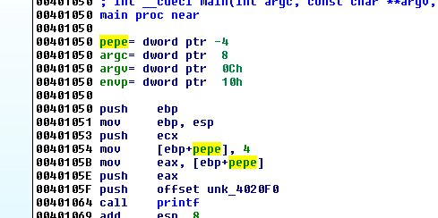

Здесь, мы видим этот случай. Видно переменную **INT** **PEPE** и как она инициализируется значением **4**. Если мы запустим отладчик и поставим на инструкции **MOV** **BP**.

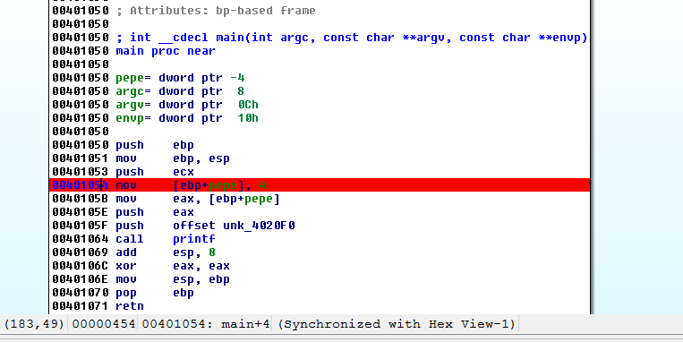

И запустим отладчик **LOCAL** **WIN32** **DEBUGGER**.

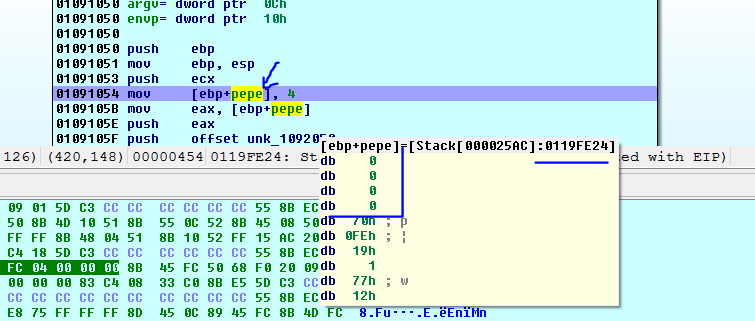

Когда отладчик остановится на инструкции **MOV**, то если мы поместим курсор над переменной **PEPE**, мы увидим адрес памяти, где **4** байта зарезервированы для целого числа, которое должно быть сюда сохранено.

Если я щелкну здесь на переменной **PEPE** я увижу стек \(адрес не будет совпадать с вашим\)

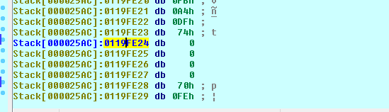

Поскольку это целое число, я могу нажимать здесь **D** до тех пор, пока я не поменяю тип переменной на **DD**, т.е. на **DWORD**.

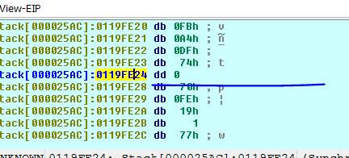

Теперь переменная помечена как **DWORD** и равна нулю, потому что программа всё ещё не сохранила сюда значение **4**. Если я выполню инструкцию, которая сохранит значение и посмотрю снова в стек.

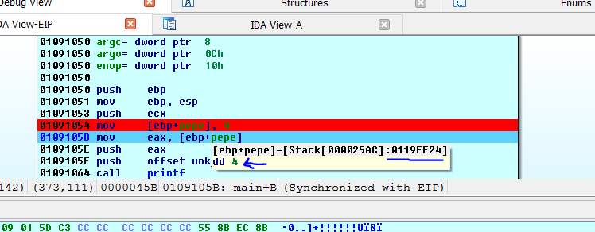


Программа ничего не напечатает на экран, пока она не закончит выполнение, а потом она закроется. Поэтому, если я запущу программу в консоли, я увижу число **4**, которое присвоено переменной **PEPE**.

Здесь этот случай похож на пример **EJEMPLO1.EXE**

Всякий раз, когда у нас есть переменная, то есть, и её значение, и её адрес. В моём случае, значение переменной **PEPE** равно **4,** и адрес **PEPE** равен **0x0119FE24**.

Сейчас я буду менять код, для того, чтобы программа не только печатала значение переменной **PEPE**, но и печатала её адрес.

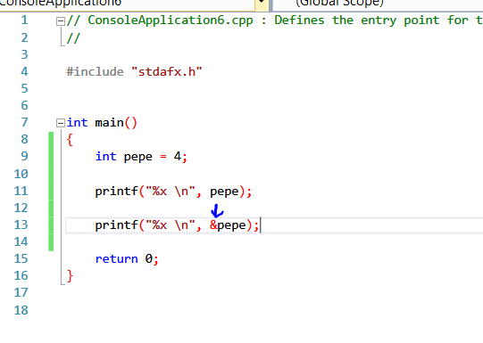

Если мы откроем файл **EJEMPLO2** в **IDA**.

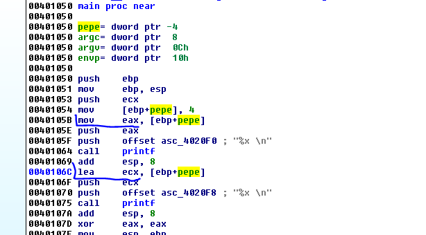

Мы видим два вызова функции **PRINTF**. Первый вызов использует инструкцию **MOV** для передачи значения **4** из переменной **PEPE** в регистр **EAX** и затем программа печатает это значение, а во втором **PRINTF** с помощью инструкции **LEA** вычисляется адрес переменной **PEPE** и программа печатает его тоже.

Если я установлю **BP** на инструкцию **MOV**.

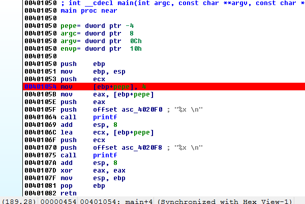

Сейчас я запускаю отладчик.

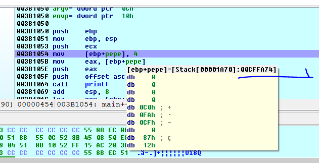

В этом случае, адрес **PEPE** на моей машине будет равен **0x00CFFA74**. Я иду по этому адресу, нажимаю **D** и меняю тип переменной на **DWORD**.

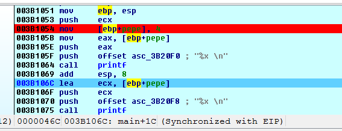

Я дохожу до инструкции **LEA**. Если я помещу курсор над переменной **PEPE**, я вижу, что значение **4** уже сохранено.

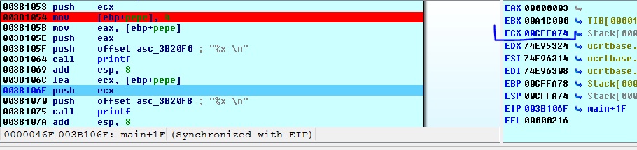

При исполнении **LEA** я вижу, что сейчас в регистре **ECX** есть адрес переменной **PEPE**, который программа будет печатать на второй строке. Если мы запустим программу без **IDA**, мы увидим как программа будет печатать значения. При каждом запуске, адрес переменной будет меняться, но программа напечатает значение и текущий адрес переменной **PEPE**.

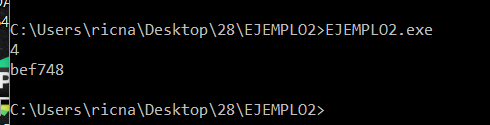

Видно, что когда есть целое число, буфер, структура или любой тип данных, мы будем иметь адрес, где он будет храниться \(или где начинается тип данных, если он является буфером или структурой\) и значение, которое является содержимым, которое размещено в нём.

**УКАЗАТЕЛИ.**

Поскольку существует много типов данных, существует ещё один тип данных, который используется для хранения и обработки адресов памяти. Он называется указателем.

Указатель - это ещё один тип данных. Поскольку **INT** хранит целое число, **CHAR** хранит символ, а **FLOAT** хранит число с плавающей запятой, то указатели хранят адреса памяти.

Например, в предыдущем примере, что произойдёт, если вместо того, чтобы печатать адрес переменной **PEPE**, Вы хотите его сохранить? Так как это адрес памяти, Вы должны использовать другую переменную типа указатель, чтобы сохранить его.

**INT \* JOSE;**

Эта запись отличается от записи

**INT JOSE;**

Последняя переменная является целочисленной переменной, в то время как первая - это переменная типа указатель, которая хранит адреса памяти. Они указывают на целые числа.

Т.е. не только при определении указателя, мы определяем переменную, которая сохраняет адрес памяти, но мы говорим этому адрес памяти, какой тип данных эта переменная будет адресовать. Если я попытаюсь сохранить указатель на другой тип данных, в этом случае у меня не получится скомпилировать программу.

В предыдущем примере, у нас есть такой код.

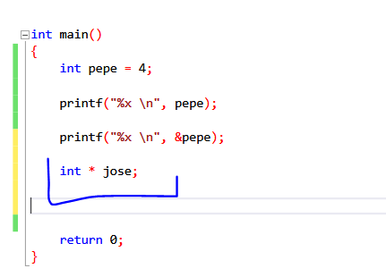

Мы видим, что переменная **JOSE** будет указателем на целое число, но ей ещё не присвоено никакое значение. Я могу присвоить ей адрес памяти переменной **PEPE**, значение которой является целым числом. Здесь мы видим оба случая, что сохраняется адрес памяти и что этот адрес указывает на переменную типа **INT**.

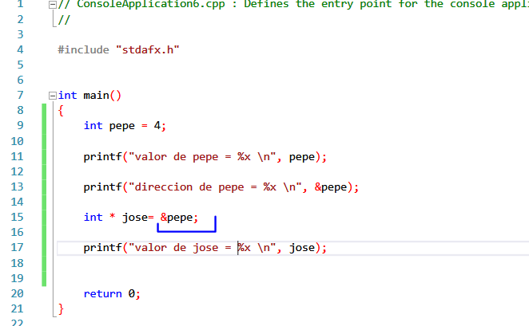

Здесь мы видим, что мы присваиваем переменной **JOSE** адрес памяти переменной **PEPE**, которая является типом **INT** и компиляция пройдёт без ошибок. Типы совпадают.

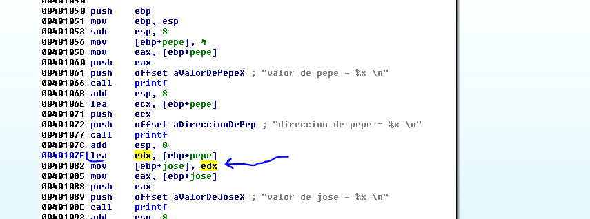

Это происходит в этом месте программы. Программа вычисляет адрес **PEPE** с помощью инструкции **LEA** и сохраняет его в переменную **JOSE**, которая является указателем. **JOSE** служит для хранения адресов памяти переменных или аргументов и поскольку эта переменная является целым числом, то все в порядке. Программа будет печатать значение переменной **JOSE**, которая будет равна адресу переменной **PEPE**.

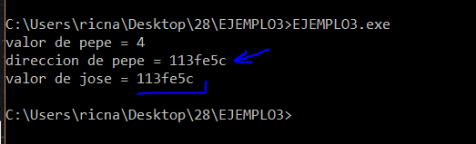

Здесь мы видим этот случай и понимаем, что указатель служит для того, чтобы хранить и работать с адресами переменных или аргументов.

Псевдокод функции можно увидеть нажав **F5**.

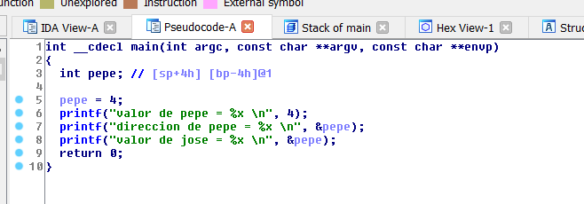

**IDA** не показывает нам переменную **JOSE**, потому что она использует для экономии непосредственно переменную **&PEPE** вместо **JOSE**.

Мы попытаемся заставить **IDA** показать нам **JOSE**, изменив код в следующем примере.

Когда **IDA** доходит до этого места, она говорит - "Ну хорошо. Какая разница, нужно ли создавать специальный тип данных, который хранит адреса памяти? Нельзя ли использовать тип **INT** и хранить там адрес?

Это будет похоже на это. Я удаляю звездочку в определении переменной **JOSE** и это уже будет целое число, и если я хочу сохранить в неё адрес переменной **PEPE**.

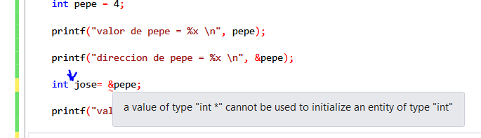

Компилятор не позволит мне собрать программу. Он будет выдавать мне ошибку, так что, не остаётся ничего другого как использовать указатели.

Указатели также позволяют мне читать, менять и работать со значениями на которые они указывают.

**JOSE** сохраняет адрес памяти переменной **PEPE** и это значение равно **4**, с которым они связаны друг с другом. Если я делаю так.

**\* JOSE = 8;**

Звездочка используется не только для определения указателя, но также для доступа к содержимому на которое указывает указатель\(в этом случае этот тип доступа называется косвенным обращением\).

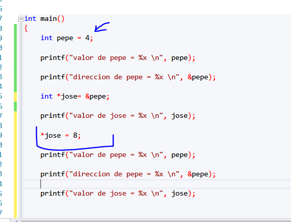

И поскольку значение переменой **JOSE** является адресом памяти переменной **PEPE**, **JOSE** является указателем, который указывает на значение **PEPE**, т.е. на 4. Если я изменю значение **JOSE** на **8**, я также изменю значение переменной **PEPE**.

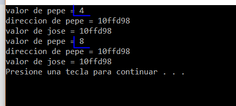

Мы видим, что изменяя содержимое **JOSE**, мы влияем на значение переменной **PEPE**, что логично, потому что **JOSE** присвоен адрес памяти **PEPE** и указывает на него. Теперь переменная равна **8**.

Давайте посмотрим на этот момент в **IDA**, чтобы увидеть что она показывает.

Это важно и вот почему я оставляю скомпилированные примеры для Вас, которые легко понять, и отлаживать, и проверять до тех пор пока Вы не разберетесь.

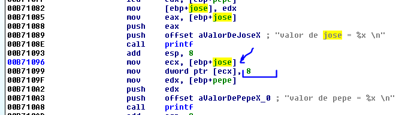

Мы видим, что переменная **JOSE –** это указатель на переменную **PEPE**, и здесь программа сохраняет значение **8** в содержимое указателя. Если мы будем отлаживать пример с самого начала.

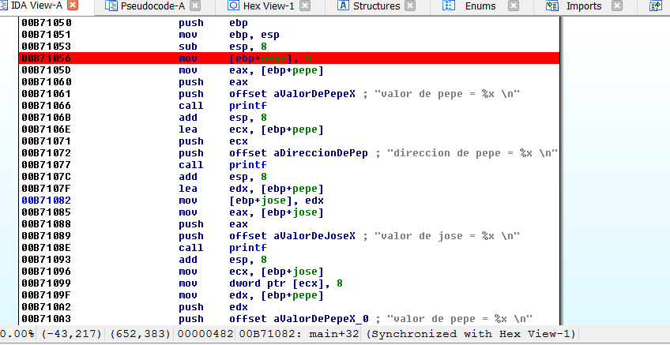

Мы запускаем отладчик.

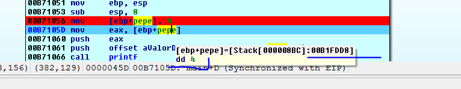

После сохранение значения **4**, мы видим адрес переменной **PEPE.** В моём случае это адрес **0x00B1FD88** и значение переменной **PEPE** равно **4**.

Если я продолжу трассировать.

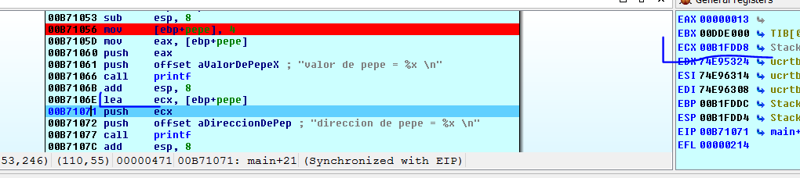

Здесь, с помощью инструкции **LEA,** программа получает адрес переменной **PEPE**, который остаётся в регистре **ECX** и печатает его. Я продолжаю трассировать.

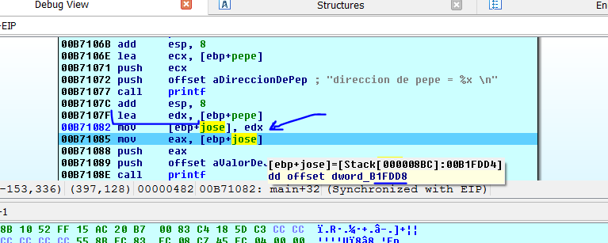

После того, как программа сохранит адрес переменной **PEPE** в **JOSE**, мы видим здесь, что программа сохраняет адрес **0xB1FDD4**, который будет теперь значением **JOSE**. \(то же адрес памяти **PEPE**\).

Как мы сказали, **IDA** показывает этот адрес так:

**OFFSET** **DWORD** **0x00B1FDD4**

Мы сказали, что **СМЕЩЕНИЕ** в **IDA** означает адрес памяти и **DWORD**, который стоит рядом, означает что это указатель на **DWORD** \(**INT**\).

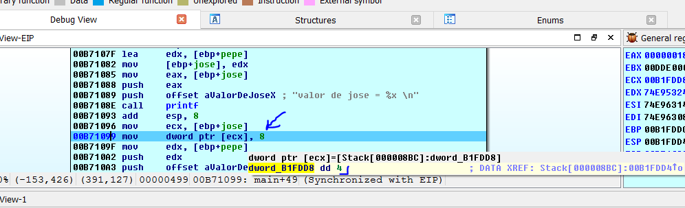

Здесь программа передаёт значение **JOSE** в регистр **ECX** и сохраняет в его содержимое значение **8**, где до этого было **4**. Очевидно, что содержимое **JOSE** - это значение переменной **PEPE**, которое печатается позже.

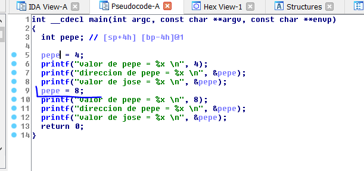

Мы видим, что псевдокод всегда работает с переменной **PEPE** и не показывает указатель **JOSE** напрямую. Вместо использования указателей, **IDA** изменяет значение **PEPE** напрямую работая с ним, но этот получившийся код не является оригинальным кодом.

Очевидно, что

**PEPE = 8**

равнозначно

**\*JOSE = 8**

Но **IDA** не использует указатель **JOSE**.

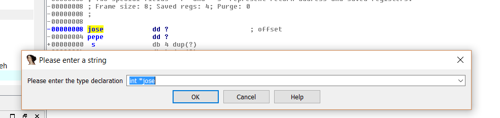

Нажатие **Y** позволяет нам вручную определить переменную, и я устанавливаю **JOSE** как указатель на **INT**.

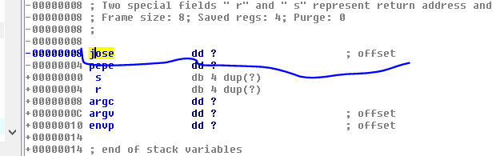

Псевдокод не показывает изменений. В любом случа, код, который генерирует **IDA** является приблизительным и оптимизированным, чтобы было проще понять, что происходит. Но его нельзя считать за правду

Давайте посмотрим следующий пример, который является случаем, где указатели более полезные, когда вам нужно передать аргументы в функцию.

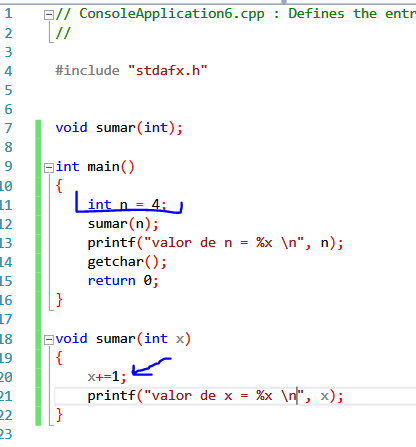

Мы видим, что мы определяем целое число **N**, которое равно **4** и мы передаём значение в функцию **SUMAR**. Эта функция присваивает **4** локальной переменной **X** и прибавляет к её значению число **1**, и печатает **5**, но оставляет в **N** значение равное **4**, потому что область действия переменной **N** - это функция **MAIN**, а область действия переменной **X** - функция **SUMAR**. Эти переменные отличаются областью действия и если Вы измените одну, это не повлияет на другую переменную.

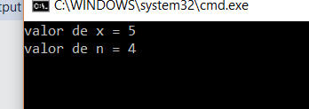

Сейчас, как мне сделать так, чтобы работая внутри функций, изменить значение **N**? Таким образом, передавая переменную по значению, как мы делали в предыдущем примере, не помогает нам вообще, но мы будем использовать указатели, которые служат для этих случаев. Они позволяют нам хранить адрес памяти переменной функции **MAIN**, как в этом случае.

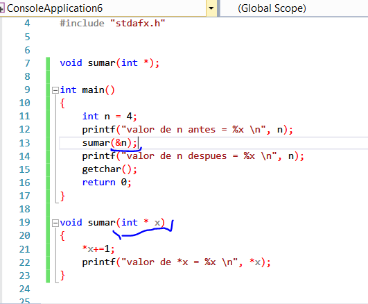

Функция **SUMAR** определена с одним аргументом **X**, который является указателем на целое число.

И когда функция вызывается, аргумент передаёт так:

**SUMAR\(&N\);**

Мы знаем, что указатель хранит адреса памяти и в этом случае, мы передаём адрес памяти **N**, который указывает на целое число, поэтому все в порядке.

```cpp
void sumar\(int * x\)
{
    *x+ = 1;
    printf("valor de *x = %x \n", *x);
}
```

Видим, что мы увеличивает содержимое **X**, так как **X** имеет адрес памяти **N.** Мы влияем на значение **N**, которое несмотря на то, что оно не является здесь недопустимым, мы работаем с ним используя указатель и оставляя это значение, оно будет всё равно меняться.

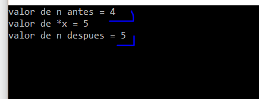

Итак, **N** изменилось, и мы не внесли никаких изменений во внутрь функции **MAIN**, и нет никакой ссылки на какую-либо операцию в этой функции, потому что, передав ей адрес в качестве аргумента и работая внутри функции с помощью указателя, который ее получил, мы получаем доступ к её значению и меняем его.

Давайте посмотрим на это в **IDA**.

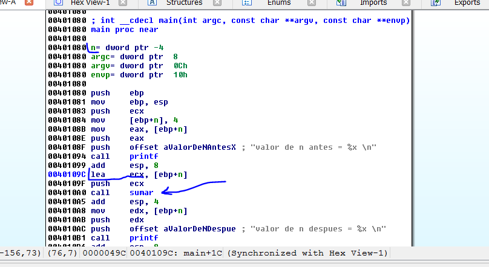

Мы видим, что программа инициализирует переменную **N** при запуске, когда ей присваивается значение **4**, а затем программа передает адрес переменной **N** как аргумент в функцию **SUMAR** \(а не передаёт её значение\)

Давайте посмотрим эту функцию.

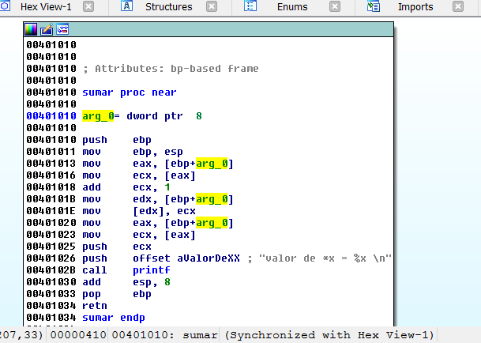

Аргумент **ARG**\_**0** должен быть указателем на целое число.

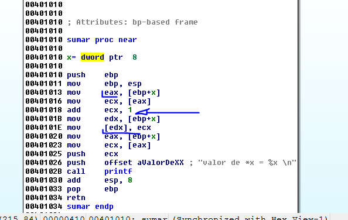

Мы видим, что здесь программа читает переменную **X**, которая является адресом памяти переменной **N**, и передает его в регистр **EAX**. Затем программа считывает это значение и увеличивает его на **1** и сохраняет его снова в указатель **EDX**.

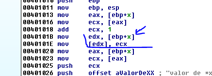

Здесь, увеличенное значение регистра **ECX** сохраняется в указатель **EDX**, который является адресом памяти **N**.

Поэтому мы видим, что передача адресов с помощью указателей служит нам для работы со значениями переменных других областей, которые иначе не могли измениться.

Давайте посмотрим код с помощью **F5**.

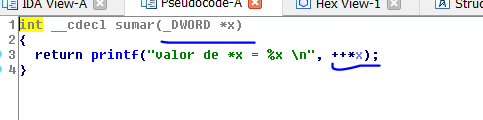

На этот раз **IDA** ничего не может оптимизировать. **X** - это указатель на целое число \(**DWORD**\), которое показывает **IDA**. Мы можем только изменить тип данных переменной **X**.

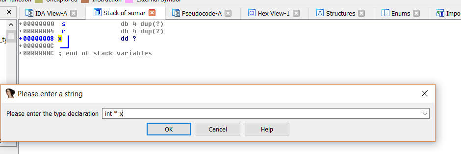

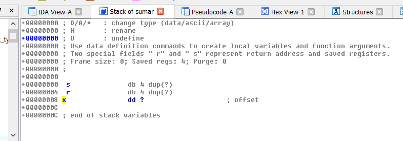

И давайте посмотрим, что случится, когда я сделаю **SET** **TYPE** в функции **SUMAR**.

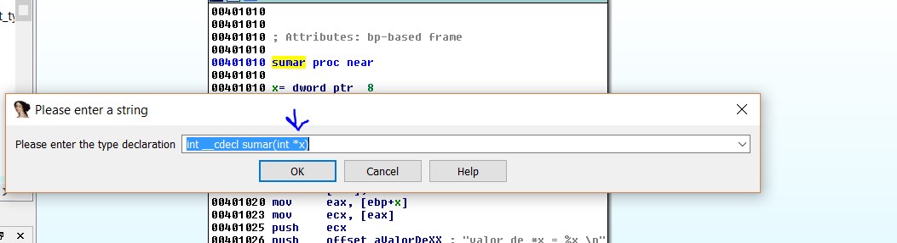

Мы видим, что переменная сейчас объявлена как надо, т.е. как указатель.

**INT \* X**

После этого, если я нажму **F5**, и код становится лучше.

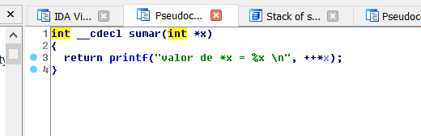

Существует ещё один способ сделать это без использования указателей, используя то что в **C++** называется ссылками.

В дополнении к указателям, язык **C++** имеет ещё одну характеристику, которая называется ссылкой. Ссылка - это так сказать алиас или тег переменной.

```cpp
INT N = 4;
INT &REF_N = N;
```

Когда я помещаю символ **&** впереди переменной в объявлении, что я делаю – это создаю псевдоним той же самой переменной, который имеет один и тот же общий адрес памяти.

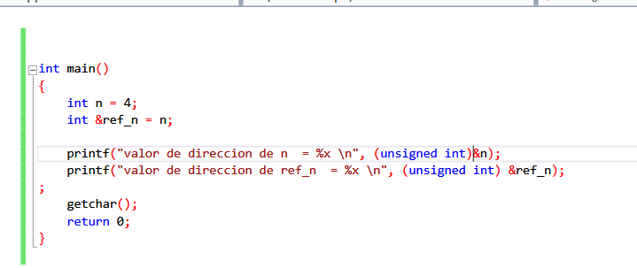

Если я запущу этот пример.

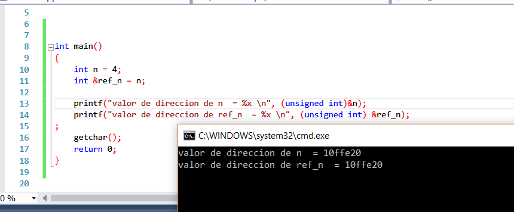

Таким образом, видно, что если у меня есть две переменные, которые делят одну и туже ячейку памяти и если я изменю одну переменную.

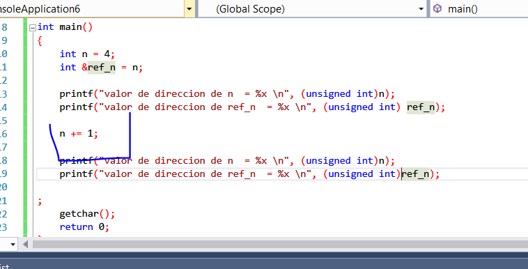

Поэтому, когда я меняю одну переменную, другая будет тоже меняться.

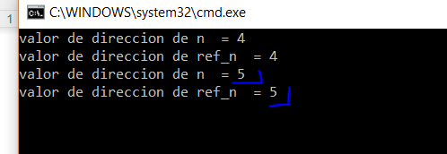

Так что ссылки послужат мне больше всего для того, чтобы написать более комфортно функцию **SUMAR** без использования указателей.


Мы видим, что я передаю в функцию значение **N**, но функция создаёт алиас для переменной **N**, который делит тот же адрес, поэтому изменение переменной **X** является тем же самым, что и изменение переменной **N**.

```cpp
void sumar(int &x)
{
    x = x + 1;
}
```

Мы видим, что нам не нужно иметь дело с содержимым или чем-то еще. Просто измените значение напрямую.

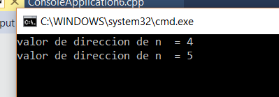

Это работает. Давайте посмотрим на этот пример в **IDA**.

Наша радость сразу исчезает.

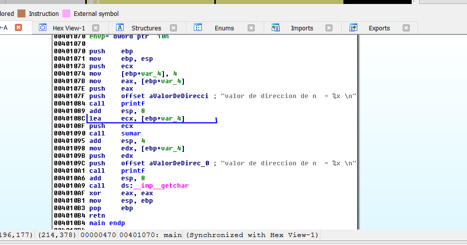

Мы видим, что всё это - это что-то, что помогает писать более легче исходный код, но на низком уровне продолжают использоваться указатели. Мы видим, что программе не передается значение **N**, а только адрес, как и раньше.


И внутри функции будет то же самое, как раньше, т. е. указатель, с помощью которого увеличивается содержимое.

Таким образом, алиас или ссылка, очень удобны для написания кода, но на низком уровне мы должны работать с указателями.

Всем до встречи в **29**-й главе.

* * *

Автор оригинального текста — Рикардо Нарваха.

Перевод и адаптация на английский  язык — IvinsonCLS.

Перевод и адаптация на русский язык — Яша Яшечкин.

Перевод специально для форума системного и низкоуровневого программирования - WASM.IN

28.01.2018

Источник:

[**http://ricardonarvaja.info/WEB/INTRODUCCION%20AL%20REVERSING%20CON%20IDA%20PRO%20DESDE%20CERO/28-INTRODUCCION%20AL%20REVERSING%20CON%20IDA%20PRO%20DESDE%20CERO%20PARTE%2028.7z**](http://ricardonarvaja.info/WEB/INTRODUCCION%20AL%20REVERSING%20CON%20IDA%20PRO%20DESDE%20CERO/28-INTRODUCCION%20AL%20REVERSING%20CON%20IDA%20PRO%20DESDE%20CERO%20PARTE%2028.7z)
