# Часть 31

[\[Используемые материалы\]](.gitbook/assets/files/31.zip)

Прежде чем делать упражнение из предыдущей главы, я расскажу о некоторых моментах более подробно, которые остались в тени из-за моего быстрого объяснения и затем мы создадим **POC**.

Один из моментов, который остаётся неясным заключается в том, что иногда мы принимаем размер массива, который предлагает нам **IDA** при выполнении правого щелчка и выбора пункта **ARRAY**. Иногда мы ставим предлагаемый нам размер под сомнение как в предыдущем примере и устанавливаем значение длины массива немного больше.

Очевидно, что всё приходит с опытом, но мы попытаемся объяснить это на нескольких примерах.

Давайте посмотрим на этот простой пример.

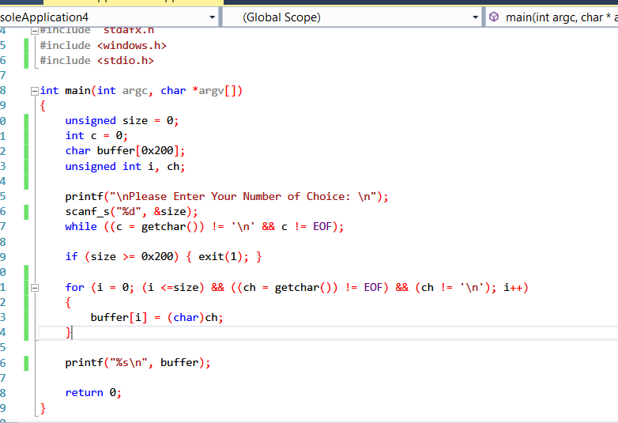

Программа имеет приглашение для ввода размера\(переменная беззнаковая\), который проверяется на то, чтобы он не был равен или был больше **0x200** байт.

Затем идёт цикл, который повторяется количество раз равное размеру, который мы ввели. Он читает символы, которые мы вводим через функцию **GETCHAR**.

Программа не будет уязвима для переполнения буфера, потому что переменная **SIZE** - беззнаковая. Таким образом никаких проблем со знаком при сравнении со значением **0x200** не будет.

И затем программа будет читать символы и будет копировать их в буфер. Поскольку размер буфера равен **0x200** байт, он не будет переполняться.

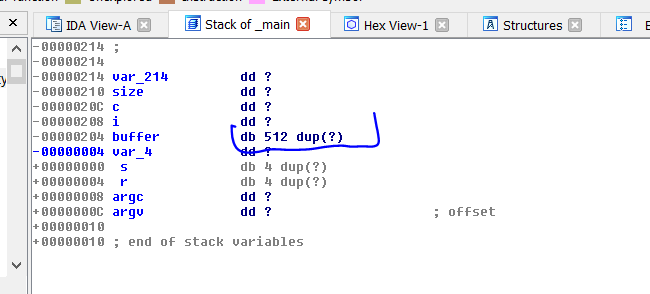

Если я посмотрю на буфер в **IDA**, то поскольку я скомпилировал программу с символами, **IDA** уже обнаружила буфер корректно \(**512** десятичных байт = **0x200 hex**. байт\). То же самое произойдёт, если я снова скомпилирую пример, но без символов.

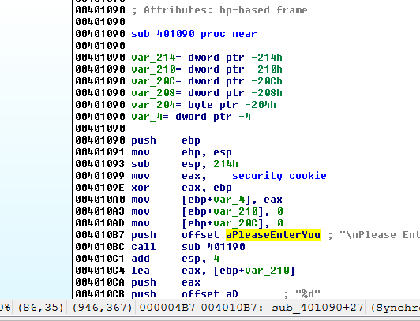

Давайте посмотрим статическое представление стека.

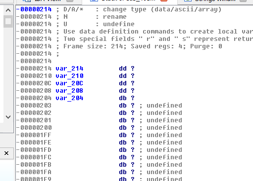

Мы видим, что здесь не обнаруживается буфер, ни другие переменные. Поэтому мы должны сделать всё вручную. Поскольку существует пустое пространство - очень вероятно, что переменная **VAR\_204** является буфером. Давайте посмотрим на её перекрестные ссылки.

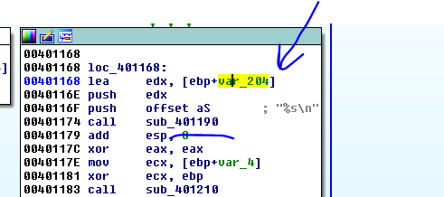

Здесь видна четкая ссылка, когда программа печатает получившийся буфер. Обычно, когда идёт ссылка вместе с инструкцией **LEA** - почти всегда это будет буфер. Кроме того, функция по адресу **0x401190** является функцией **PRINTF**.

Другая ссылка на буфер находится внутри цикла, когда программа заполняет буфер байтами. Программа читает байты с клавиатуры с помощью функции **GETCHAR**.

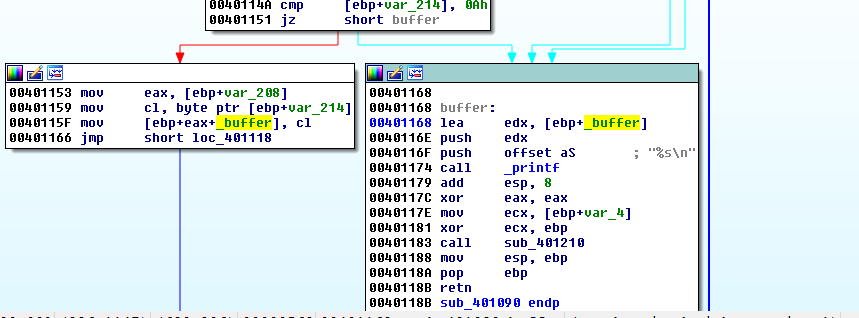

Сейчас, давайте пройдём в статическое представление стека и посмотрим размер буфера.

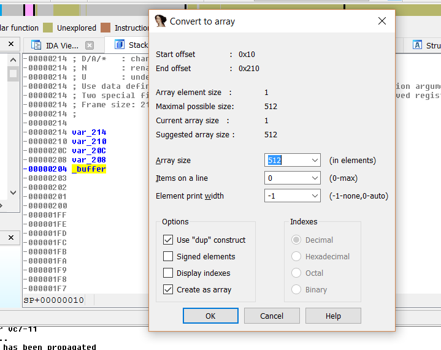

Мы видим, что **IDA** говорит нам, что буфер равен **512** байт и будет права. Но почему **512**?

Потому что **IDA** смотрит на пустое пространство, которое есть до следующей переменной **VAR\_4**. Сейчас наш метод такой - увидеть где программа сохраняет в первый раз значение в эту переменную и где эта переменная **VAR**\_**4** используется позже. Давайте посмотрим.

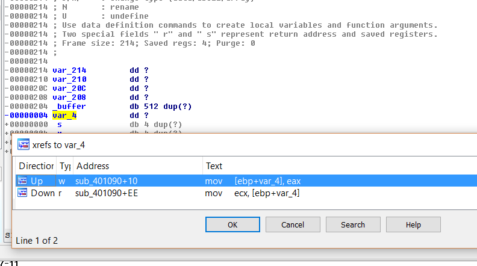

Мы видим, что есть два места где используется эта переменная. Первое место - где переменная инициализируется значением \(сохраняется **SECURITY COOKIE**\) и второе место, где это значение считывается.

Давайте перейдём к первому месту.

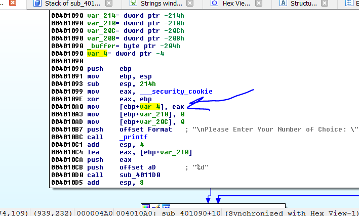

Мы видим, что перед заполнением буфера в цикле, переменная **VAR**\_**4** получает значение и она не связана с буфером, из-за чего мы можем определить, что это независимая переменная и что она не принадлежит к буферу.

Я сохраняю этот пример как **BUFFER1.EXE** и **здесь IDA** не ошибается.

Сейчас я буду делать другой пример и буду называть его **BUFFER2.EXE**.

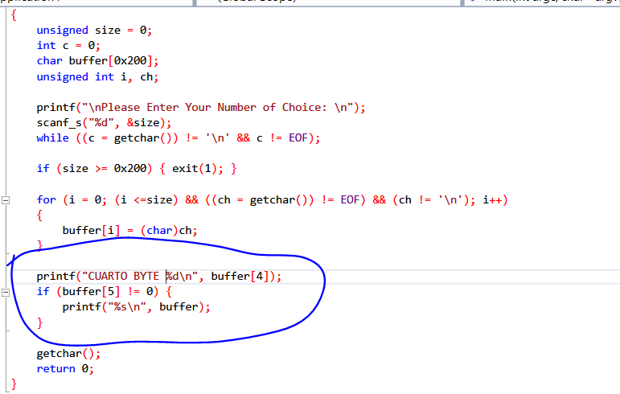

Мы видим, что размер буфера по-прежнему равен **0x200** байт. Всё аналогично предыдущему примеру, за исключением того, что здесь программа печатает **ЧЕТВЁРТЫЙ БАЙТ** буфера, и сравнивает **ПЯТЫЙ БАЙТ** с нулём. Если этот байт не равен нулю, то печатается наш буфер.

Давайте посмотрим, что случится если я скомпилирую этот пример с символами, а потом без символов.

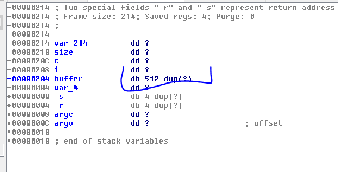

Мы видим, что когда у нас есть символы, то нет никаких проблем. **IDA** продолжает обнаруживать буфер как переменную из **0x200** байт и **ЧЕТВЕРТЫЙ БАЙТ**, который печатается.

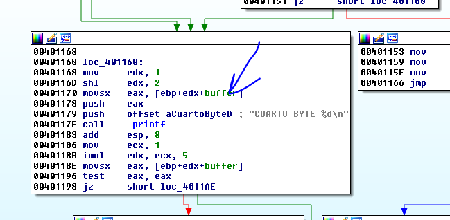

Мы видим, что **IDA** не восприняла это как независимую переменную, как я предположил. Программа считывает четвертый байт буфера к которому она обращается, прибавляет значение **4** \(инструкция **SHL EDX**, **2** равносильна умножению **EDX** на **4**\) и затем складывает регистр **EDX** с начальным адресом буфера, для того чтобы указывать на значение четвертого байта.

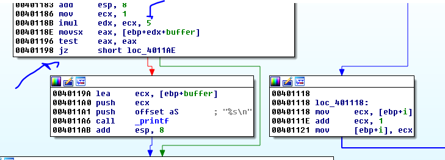

Здесь программа умножает регистр **EDX** на **5**, и складывает **EDX** с началом буфера, и помещает результат в регистр **EAX** с помощью инструкции **MOVSX**. Если результат отличается от нуля, программа производит печать

Мы ясно видим, что буфер не был затронут и что с символами **IDA** продолжает обнаруживать его длину правильно. Давайте теперь посмотрим пример без символов.

Я открываю пример и вижу, что **IDA** не ошибается. Она не присваивает отдельную переменную четвёртому и пятому значению буфера \(хотя бывают случаи, когда это происходит\). **IDA** по прежнему предлагает мне размер буфера **512** байт, потому что следующая переменная **VAR\_4** - это защита **CANARY**. Если по каким либо причинам **IDA** примет эти четвертый и пятый байт за переменные, очевидно они не будут независимыми. Потому что они заполняются, когда с буфером идет работа. Иначе здесь нет другого места для сохранения переменных. Следовательно, я должен рассматривать эти байты как часть буфера.

Поскольку я не могу скомпилировать пример, и показать когда **IDA** ошибается, мы сравниваем программу с буфером упражнения, принимая во внимание, то, что когда **IDA** предлагает нам размер буфера, мы должны продолжить поиск первой независимой переменной \(которая инициализируется в другом месте отличном от буфера\), которая будет настоящим пределом буфера.

Давайте посмотрим буфер нашего упражнения.

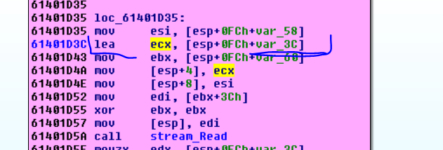

Эта инструкция **LEA** говорит о том, что аргумент очень возможно является буфером в стеке, который передаётся функцию **STREAM\_READ**. Давайте переименуем эту переменную в буфер.

Давайте посмотрим на переменные ниже, чтобы увидеть первую независимую переменную буфера.

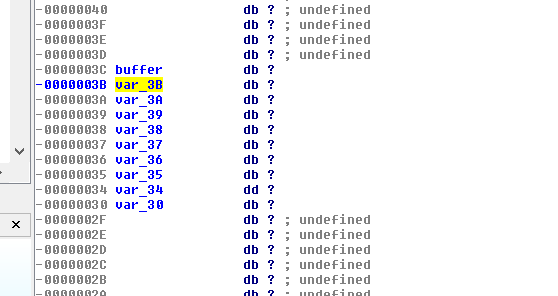

Я нажимаю **X** на каждой переменной.

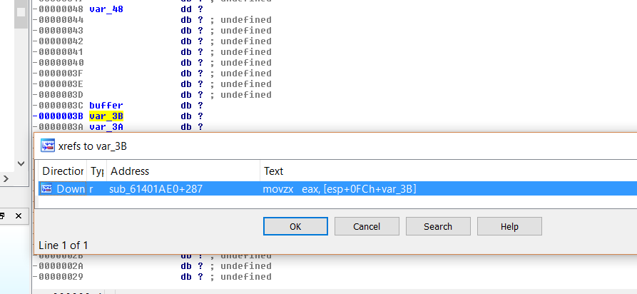

Здесь я вижу как я оставляю курсор на инструкции **LEA\(???MOVZX\)** где программа будет читать буфер, который использует эту переменную ниже \(**DOWN**\), и нет смысла использовать её если нет никакой другой ссылки, где программа сохраняет какое-нибудь начальное значение. Единственное возможное место - когда программа заполняет буфер. То же самое случится со всеми следующими переменными.

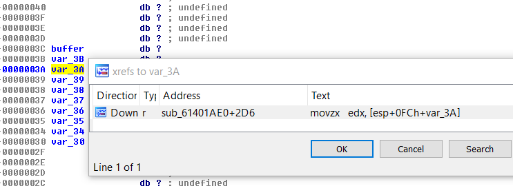

Здесь тот же случай. Переменная принадлежит буферу.

А это первая переменная, которая имеет другую перекрёстную ссылку:

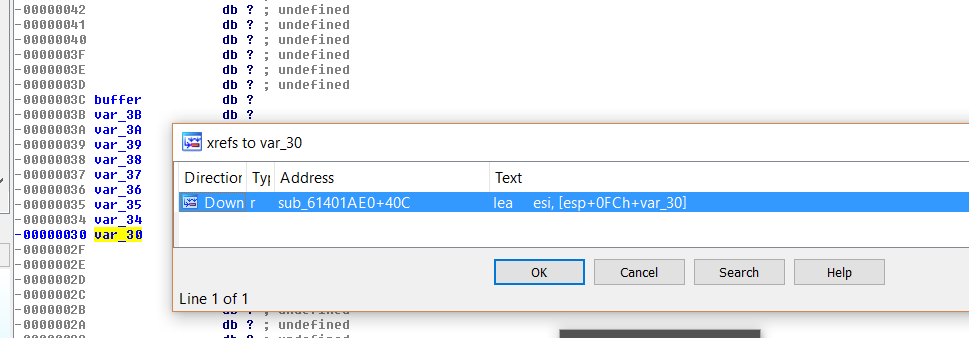

Эта переменная похожа на буфер, поскольку программа использует инструкцию **LEA**. Давайте посмотрим.

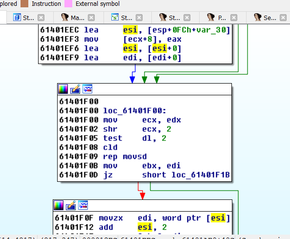

Мы видим, что это действительно буфер, но он является частью предыдущего буфера, потому что у него нет никакого независимого места для заполнения. Первая ссылка передаётся как источник в инструкцию **REPS MOVS** которая должна сохранить значения, чтобы скопировать их в другое место. **IDA** также указывает направление **DOWN**, другими словами переменная используется после заполнения исходного буфера. Так что ничего важного здесь нет. Давайте продолжим опускаться вниз.

Программа продолжает чтение всех следующих переменных ниже того места, где заполняется буфер до этого момента.

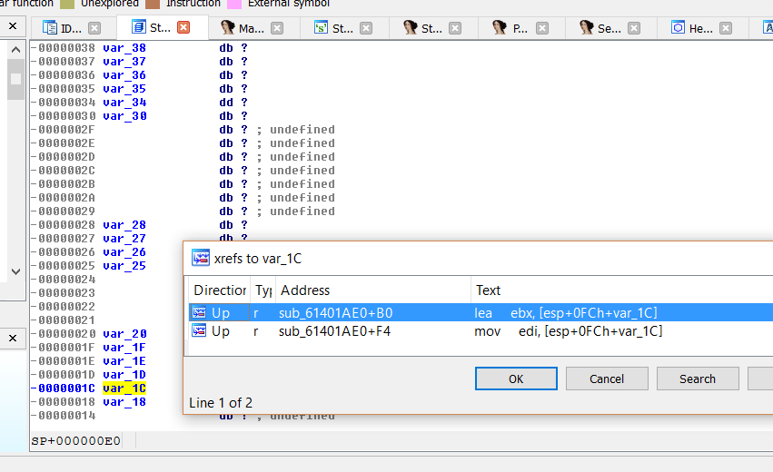

Здесь нам показывается инструкция **LEA** и направление **UP**. Другими словами этот буфер находится выше того места где заполняется первоначальный буфер.

Мы видим, что это другой буфер, независимый от исходного.

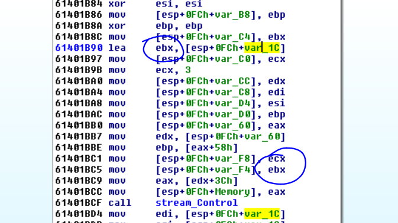

Буфер передаётся как аргумент в функцию **STREAM**\_**CONTROL** и заполняется там. Поэтому мы нашли первую независимую переменную, и поэтому буфер заполняется непосредственно перед этой переменной.

Поскольку я делал всё это быстро, я не увидел, что есть другой вызов **STREAM**\_**READ**, который находится выше с тем же буфером.

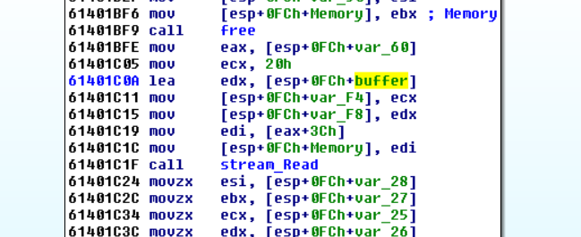

В любом случае, анализ будет точно таким же. Нет никаких переменных вплоть до переменной **VAR**\_**1C**, которые имеют перекрестные ссылки, до некоторого места где заполняется буфер.

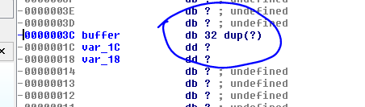

Я оставляю буфер равным **32** байта, и мы можем проверить, что все переменные, внутри буфера являются внутренними по отношению к этому буферу, и они не являются независимыми.

Другая вещь, про которую я спрашил - это то, как я понял, что функция **STREAM**\_**READ** может писать количество байт, которое мы передали в буфер. Само название функции говорит об этом. Кроме того, есть патч, который ограничивает значение, которое передаётся туда. Если оно больше чем **8**, это даёт мне подозревать, что это максимальное значение, которое программа копирует.

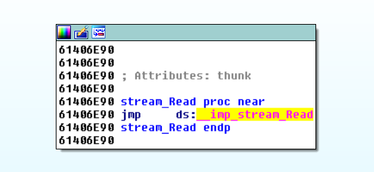

Здесь мы видим, что программа идёт в вызов **STREAM**\_**READ**. Давайте здесь нажмём **ENTER**.

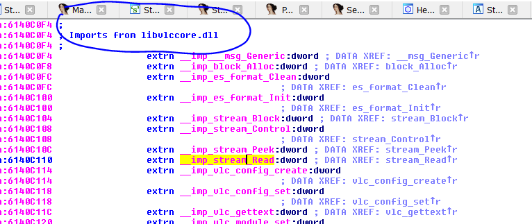

Здесь мы видим, что это импортируемая функция из библиотеки **LIBVLCCORE.DLL**. Поэтому я ищу эту функцию в уязвимой версии и открываю её в **IDA**.

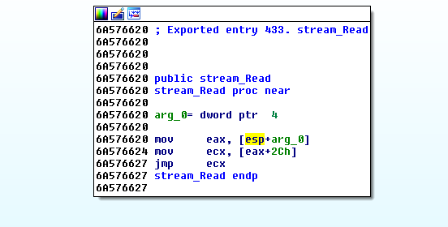

Я вижу, что функция зависит от аргумента **ARG**\_**0**, который является константой. Он приходит из вызова **CALL**. От этой константы зависит куда программа совершит переход используя инструкцию **\[EAX+2C\]**.

Я мог бы реверсить эту функцию, чтобы найти куда происходит переход, но поскольку я собираюсь создать **POC**, то я должен начать отладку.

Для тех, кто спрашивал, что такое **POC**. **POC** - это **PROOF OF CONCEPT**, который не является полноценным эксплоитом, но он показывает уязвимость, создающий файл **TY**, в этом случае, который переполняет буфер из **32** байт.

Поскольку программа находится удаленно, я буду присоединяться к ней с помощью удаленного отладчика. Если программа находится локально, присоединяйтесь к ней локальным отладчиком.

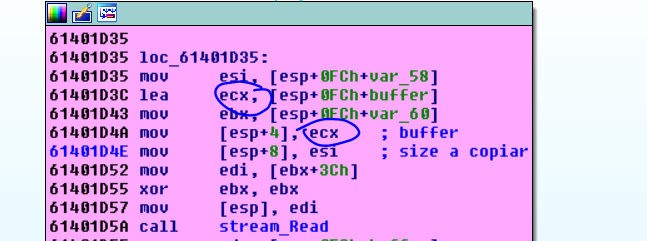

Во-первых, я увижу откуда приходит это значение **ESI**, которое имеет размер для копирования и похоже, что оно приходит из переменной **VAR**\_**58**. Переименуем эту переменную в **SIZE**\_**A**\_**COPIAR**.

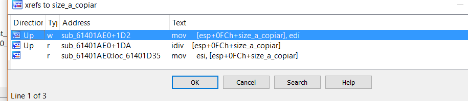

Мы видим, где программа сохраняет переменную и что происходит деление с помощью инструкции **IDIV**, но сначала давайте перейдём туда где программа сохраняет эту переменную.

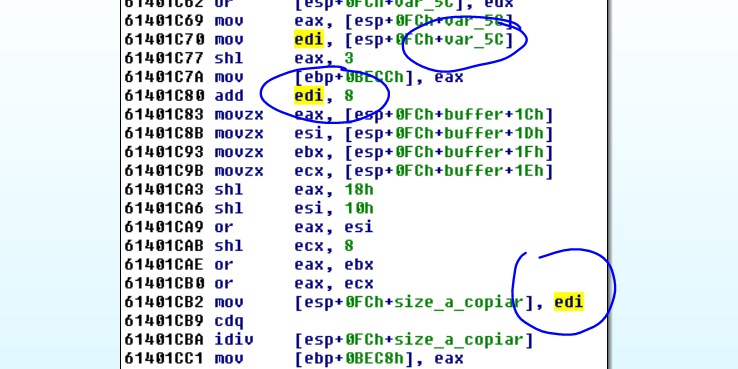

Мы видим, что это регистр **EDI**, который программа сохраняет в переменную **SIZE**\_**A\_COPIAR** и он приходит из другой переменной **VAR**\_**5C** и к этому значению прибавляется ещё значение **8**. Давайте переименуем эту переменную.

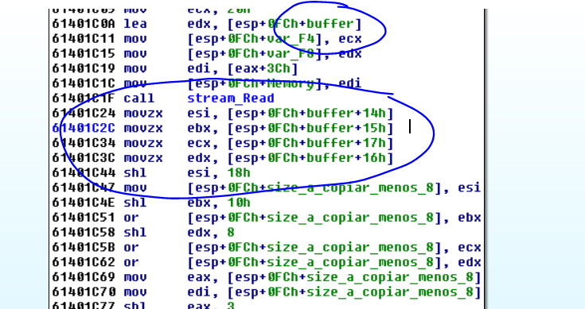

Мы видим, что все исходит от первого вызова **STREAM\_READ**. Программа берет байты из **14**-**15**-**16-17** позиции и будет создавать значение **DWORD** с использованием инструкций **SHL** и **OR**, оставляя его в переменной **SIZE\_A\_COPIAR\_MENOS\_8**.

Давайте установим **BP** на инструкцию **LEA**.

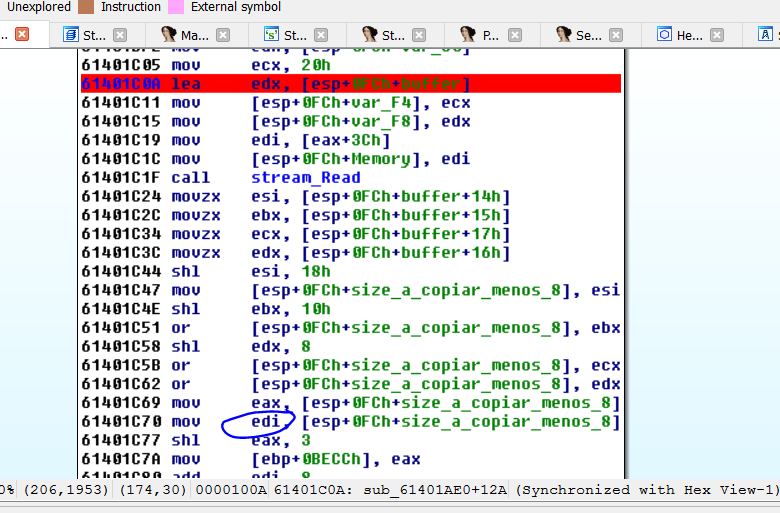

Мы присоединяем **WIN32**\_**REMOTE**, перетаскиваем и бросаем файл **.TY** в уязвимый **VLC**.

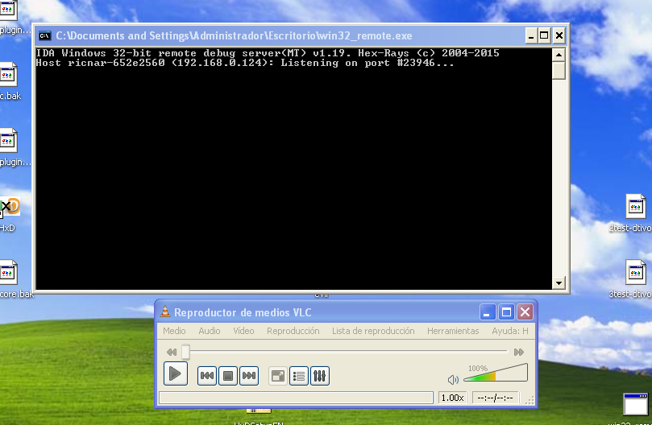

У меня есть **VLC** и **WIN32**\_**REMOTE.EXE**, открытые на моей виртуальной машине.

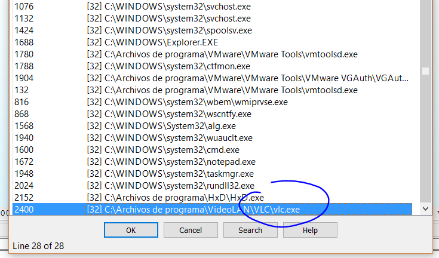

Я присоединяюсь к этому процессу.

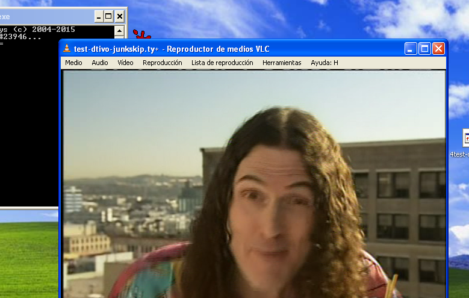

Проиграв некоторое время ролик, отладчик остановится на **BP**.

Я трассирую с помощью клавиши **F7** и вижу, что в регистре **EDX** находится адрес **БУФЕРА**.

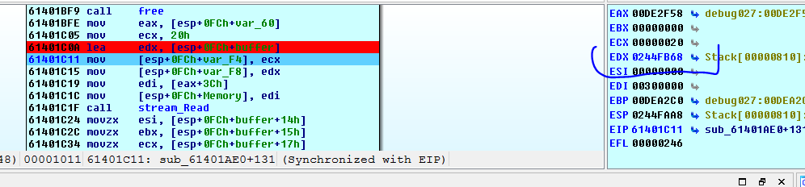

Я щелкаю на маленькую стрелку рядом с регистром **EDX**, которая переносит фокус в листинг.

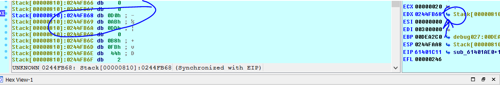

Сейчас я делаю правый щелчок в стеке на этих данных и создаю массив из **32** байтов в десятичной системе.

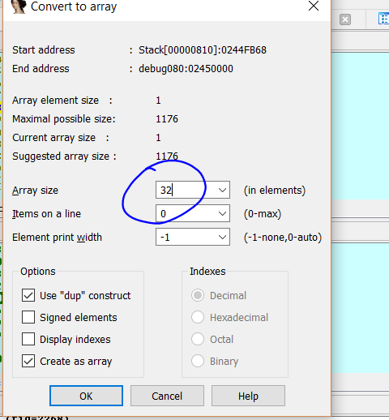

У меня получается вот так.

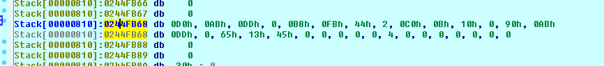

Мы устанавливаем **BP** на запись в первом **DWORD** буфера, чтобы увидеть когда программа остановится заполнив буфер внутри функции **STREAM**\_**READ**.

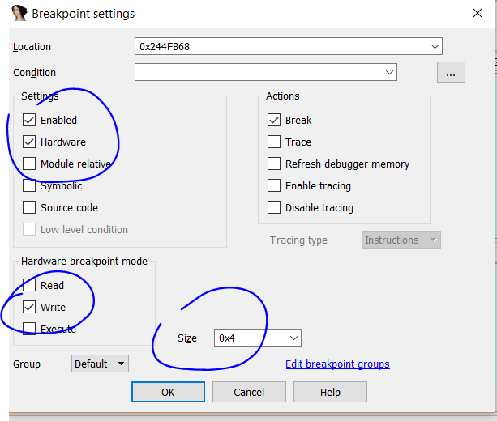

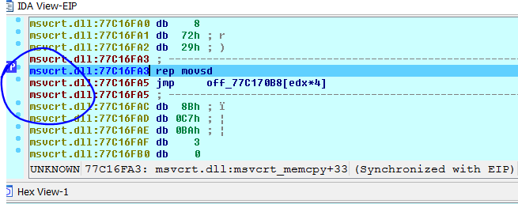

После нажатия на **RUN**, отладчик останавливается в библиотеке **MSVCRT** на инструкции **REP MOVSD**, копируя данные в буфер.

Через меню **DEBUGGER → DEBUGGER WINDOWS → MODULE LIST** появляется список модулей и там я ищу библиотеку **MSVCRT.DLL**.

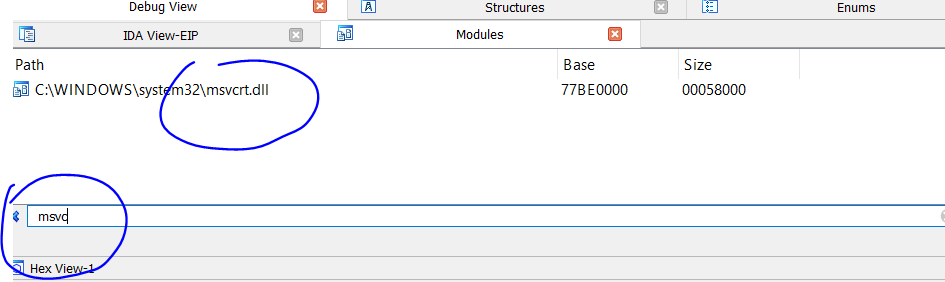

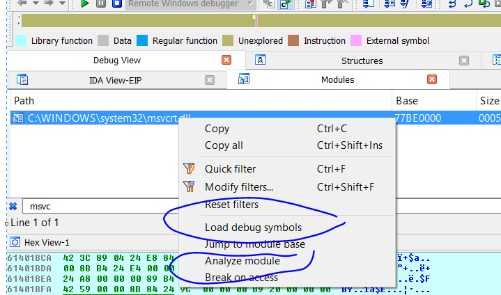

Я делаю правый щелчок и выбираю пункт **ANALIZE MODULE**, и когда анализ закончится, я выбираю пункт **LOAD DEBUG SYMBOLS**, и теперь функция выглядит лучше. Мы можем увидеть её в стеке вызовов где мы находимся сейчас.

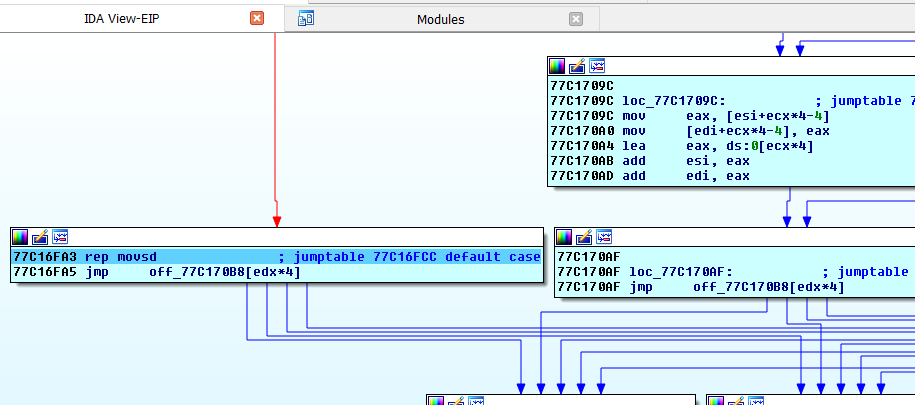

Теперь делаем так: **DEBUGGER → DEBUGGER WINDOWS → STACK TRACE**.

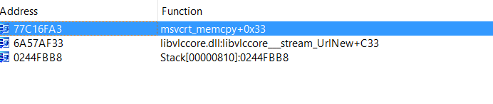

Теперь мы внутри функции **MEMCPY** и видим откуда она вызывается.

На самом деле, инструкция **REPS MOVS** копирует данные из источника, на который указывает регистр **ESI** в регистр **EDI**, который является назначением. А в регистре **ECX** хранится количество копируемых двойных-слов. Давайте посмотрим куда указывает **ESI**. Для этого делаем щелчок на стрелке, которая находится рядом с **ESI**, но теперь нужно сфокусироваться на режиме **HEX DUMP**, чтобы увидеть эти данные там.

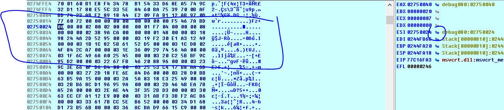

Это то, что функция копирует в **БУФЕР**. Давайте откроем файл **.TY** в **HEX** редакторе и сделаем следующее.

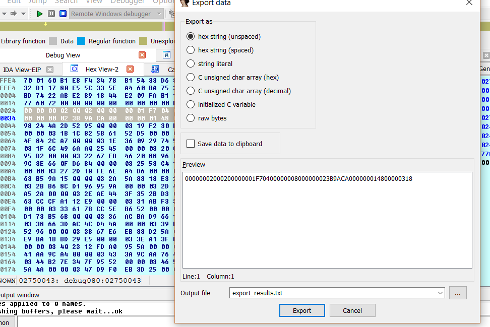

Давайте выделим эти **32** байта и сделаем **EDIT → EXPORT DATA**, чтобы скопировать байты, которые отмечены, в желаемый формат.

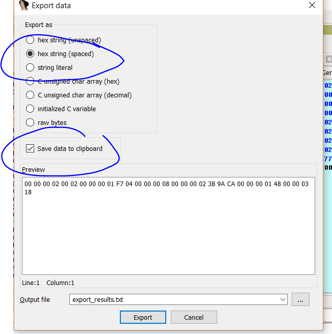

Я думаю, что так они будут выглядеть лучше.

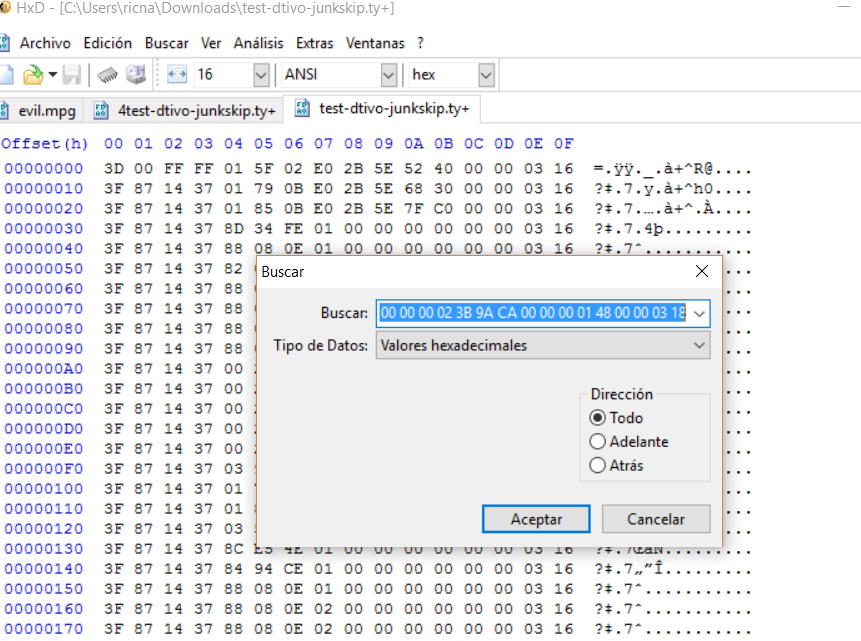

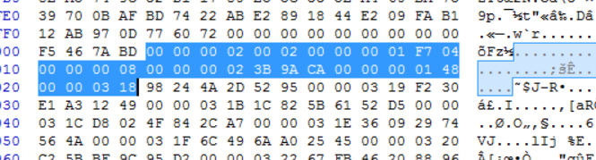

Итак, мы уже нашли байты, которые программа читает из файла. Мы знаем, что **14**-**15**-**16** и **17** байты - это те байты, из которых будет создаваться нужное значение. Программа добавляет к значению **8**и делает деление, а потом приходит к нужному значению. Давайте посмотрим что у нас есть в этом файле.

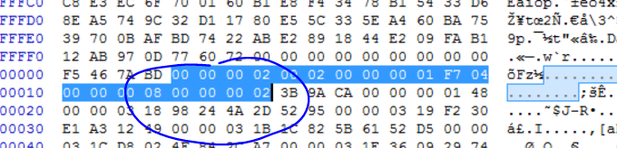

Нужные нам байты - **00 00 00 02**. Давайте установим **BP** так, чтобы отладчик остановился, когда происходит возврат из функции **STREAM**\_**READ** снова в библиотеку **LIBTY**\_**PLUGIN**.

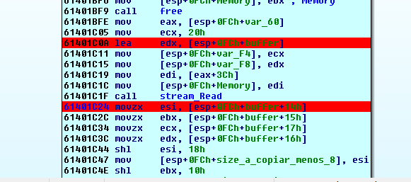

Я запускаю отладчик снова, потому что **IP** был отключен.

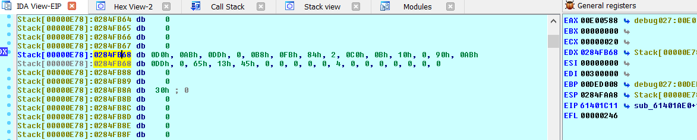

Сейчас буфер будет здесь.

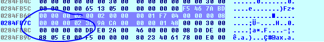

Я могу скопировать его в **HEX DUMP** и добавить значение **0x14** в адрес буфера и я увижу, что это значение **00 00 00 02**, которое мы и видели в файле.

Давайте будем трассировать, чтобы увидеть, что программа делает с этими данными.

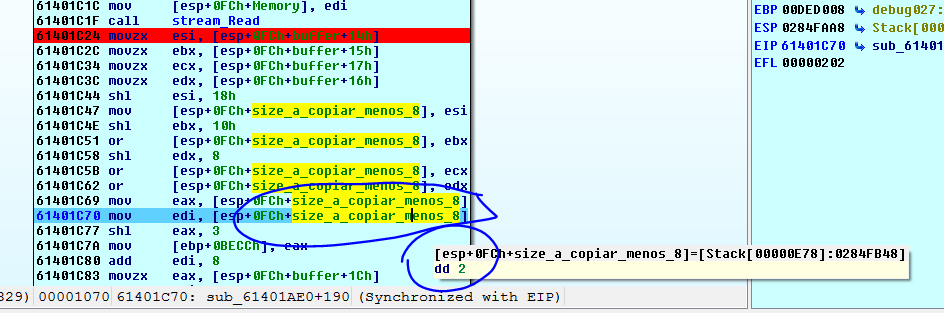

Мы видим, что все эти вычисления нужны, чтобы создать переменную типа **DWORD** и переместить её в регистр **EDI**. Затем к этому регистру прибавляется значение **8**.

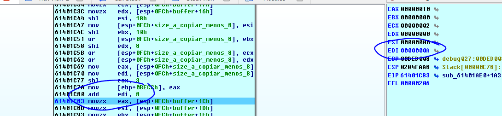

Позже программа будет исполнять инструкцию **IDIV**. Давайте пойдем по этому адресу.

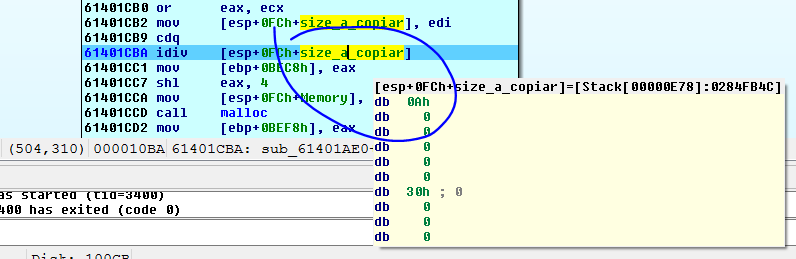

Здесь, это байт **0x0A**, который получился из байта **0x02**. Он был прочитан из файла и программа прибавила к нему значение **8**. Поэтому результат равен **0xA**.

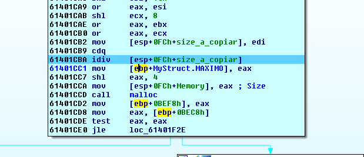

**IDIV** - это знаковое деление. Инструкция разделит регистр **EDX**:**EAX** на размер, чтобы скопировать, который не будет изменен. Проблема заключается в том, что если я увеличу размер, чтобы скопировать больше, деление будет давать мне результат - нуль и это значение, пойдёт в функцию **MALLOC** после умножения на **16**. Поэтому мы должны хорошо постараться с этим делением, чтобы результат не был равен **0**.

Регистр **EDX**:**EAX** сейчас равен **00000000:00000148** и это значение делится на **0x0A**. Если мы увидим в файле значение **0x148**, то оно близко к значению **00000002**.

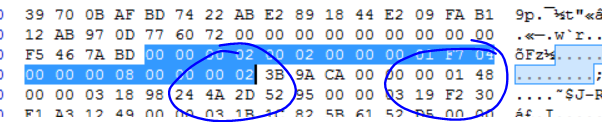

Если я увеличу это значение до **0x02**, мне также придется увеличить значение **0x148**, чтобы деление не было равно нулю. Сделаем это.

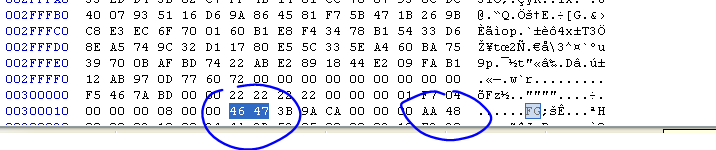

Таким образом, мы увидим, достигает ли программа функции **STREAM**\_**READ** с размером больше чем **8**, чтобы переполнить буфер. Мы снова спровоцируем переполнение с этим измененным файлом.

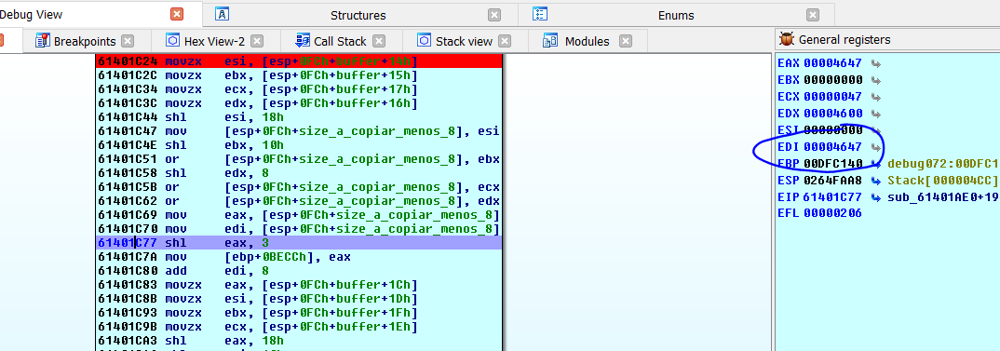

Здесь программа создаёт число **0x4647** в регистре **EDI**. Затем прибавляет к нему **8**.

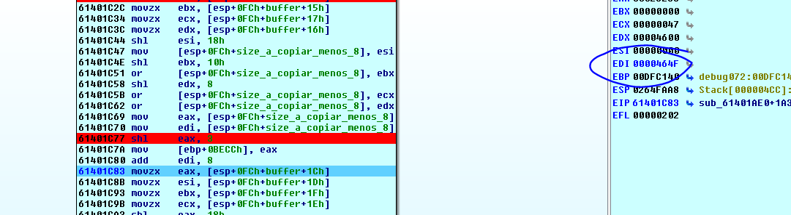

Затем программа исполнит инструкцию **IDIV 0000000:AA48**, которая поделит это значение на число **0x464F**.

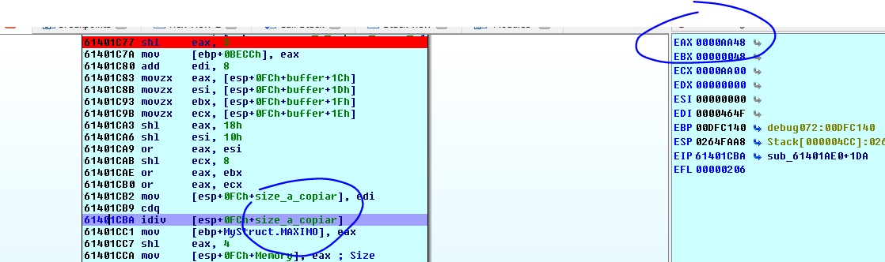

Результат деления будет в регистре **EAX** и он равен **2**.

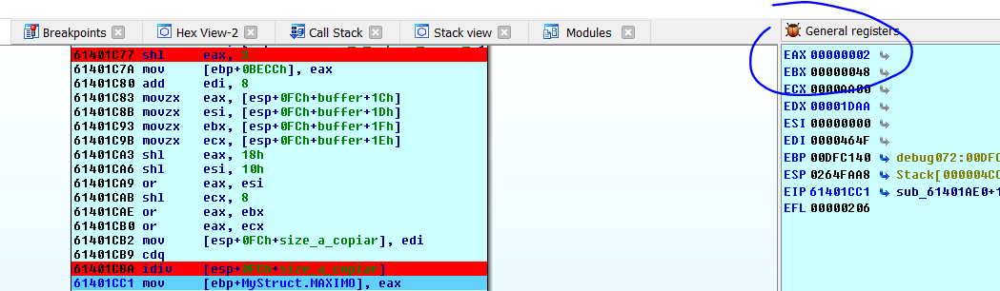

Это максимальное значение, которое будет умножено на **16** и будет передано функции **MALLOC**. Поскольку мы не эксплуатируем переполнение кучи, во время выделения всё будет хорошо.

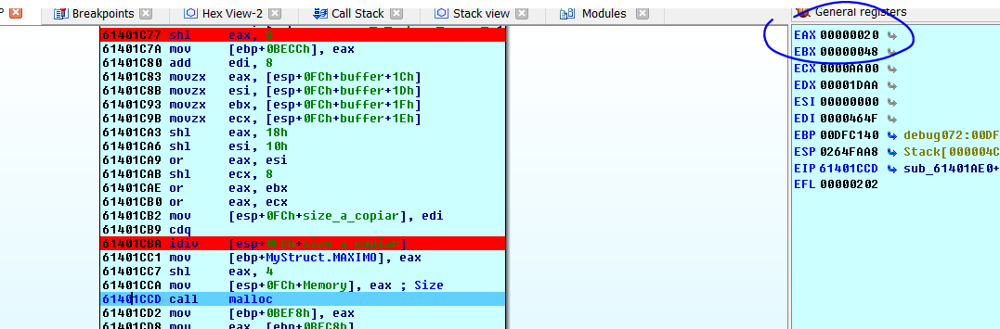

Так что программа вызывает функцию **MALLOC** с аргументом **0x20**. Этот размер будет выделяться без проблем.

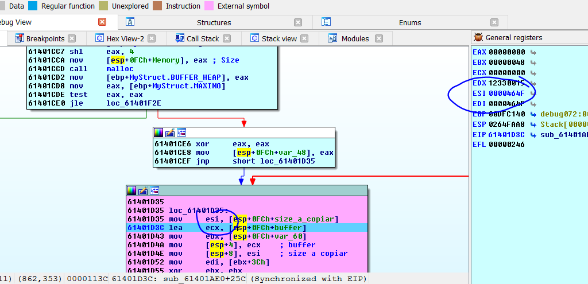

Указатель попадёт в блок, где есть уязвимость, со значением переменной **SIZE**\_**A**\_**COPIAR** равной **0x464F**, которая очевидно больше чем **8**. В пропатченной версии, программа будет игнорировать такое значение и переполнения не случится.

Я установил **BPs** на буфер. Регистр **ECX** указывает на него. Я иду туда и устанавливаю аппаратную **BP** на чтение и запись для того, чтобы программа остановилась, когда начнёт заполняться буфер.

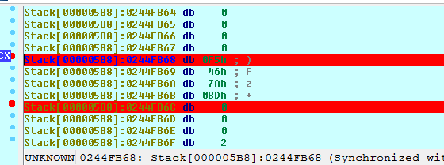

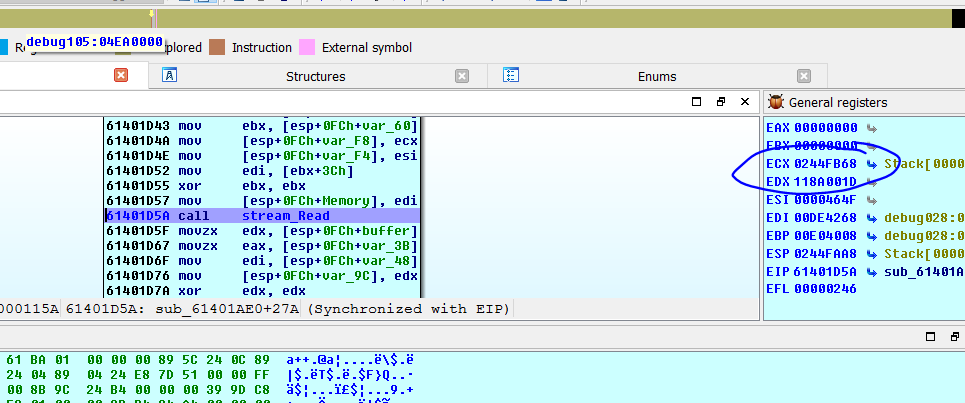

Я нажимаю **F9** для того, чтобы отладчик остановился, когда программа копирует данные в буфер.

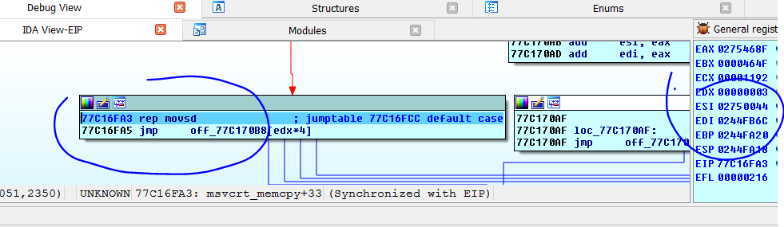

Регистр **ECX** копирует **1192 DWORDS**, так как **REP MOVSD** это **REPEAT MOV DWORDS**. Поэтому общая сумма, которая будет записана в **32-х** байтовый буфер равна **0x1192 x 4** т.е. **0x4648**. Это сумма исходит из округления числа **0x4647**. Я поместил это значение в файл.

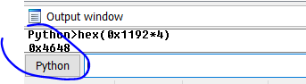

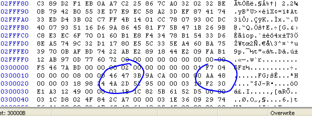

Я смогу перейти к инструкции **RET**, потому что программа может перезаписать буфер из-за размера, который она должна скопировать в буфер.

Я командую **RUN TILL RETURN** или **CTRL + F7** и возвращаюсь в главную функцию, где расположен буфер, когда программа доходит до **RET**. Программа должна вызвать крах.

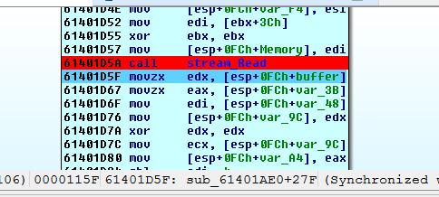

Я устанавливаю в функции **BP** на инструкцию **RET** и выключаю все другие **BPs**.

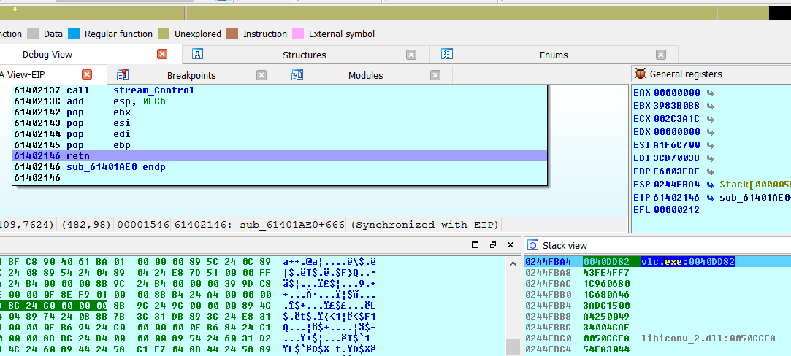

Я вижу, что стек разрушен, потому что я перезаписываю там все данные. Я иду в **HEX VIEW** и нажимаю маленькую стрелку рядом с регистром **ESP**.

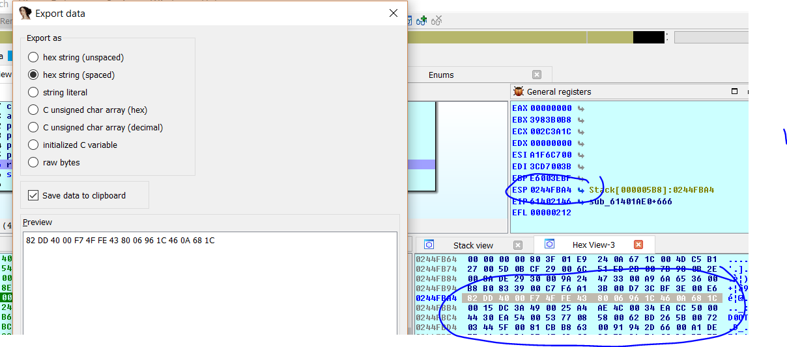

И ищу эти байты в файле.

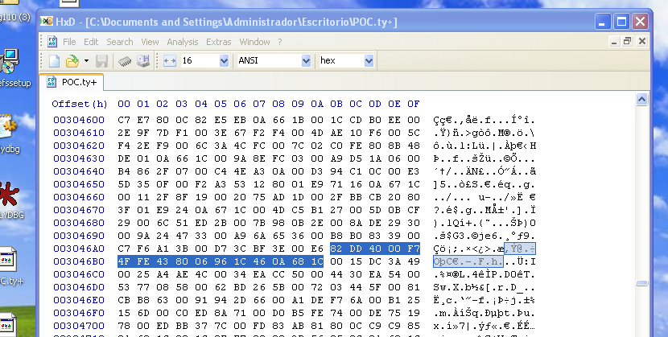

Это адреса, в которые программа будет передавать выполнение, так как мы перезаписываем ими адрес возврата. Я изменяю эти байты на такие:

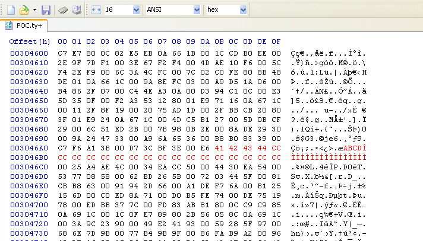

Сейчас я запускаю **VLC** c этим измененным файлом.

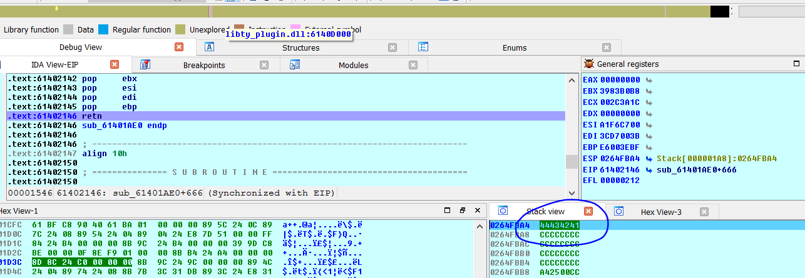

Готово. Если сейчас я запущу программу, я возьму под контроль **EIP**, который является целью нашего **POC**. Некоторые **POC** не делают этого. Они просто разрушают программу.

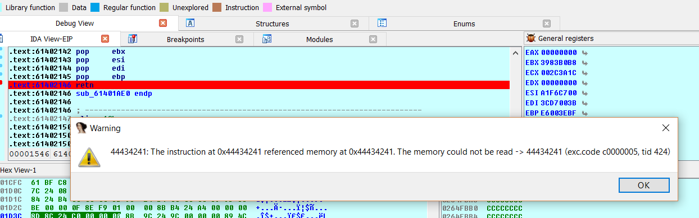

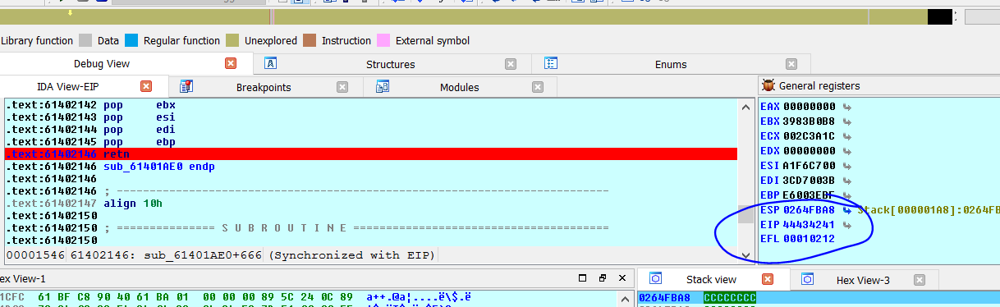

Если всё хорошо, этот **POC** можно эксплуатировать. Позже мы увидим, как продолжить с эксплуатацией этого примера. В следующих частях, мы будем продолжать работать с теорией, которую я опустил и некоторыми простыми примерами, запрограммированными мной для практики. Я уже так много работаю \)\).

Нужно заметить, что расширение файла должно быть **TY**. Если мы его изменим, программа не попадет в уязвимую часть.

До встрече в **32** главе.

* * *

Автор оригинального текста — Рикардо Нарваха.

Перевод и адаптация на английский  язык — IvinsonCLS.

Перевод и адаптация на русский язык — Яша Яшечкин.

Перевод специально для форума системного и низкоуровневого программирования - WASM.IN

25.02.2018

Источник:

[**http://ricardonarvaja.info/WEB/INTRODUCCION%20AL%20REVERSING%20CON%20IDA%20PRO%20DESDE%20CERO/31-INTRODUCCION%20AL%20REVERSING%20CON%20IDA%20PRO%20DESDE%20CERO%20PARTE%2031.7z**](http://ricardonarvaja.info/WEB/INTRODUCCION%20AL%20REVERSING%20CON%20IDA%20PRO%20DESDE%20CERO/31-INTRODUCCION%20AL%20REVERSING%20CON%20IDA%20PRO%20DESDE%20CERO%20PARTE%2031.7z)
