# Часть 32

Подготовка **WINDBG** для работы с **IDA**.

Один из инструментов, который нам необходимо установить - это отладчик **WINDBG**. Им можно управлять через интерфейс **IDA**. Это отличный отладчик. Может ему и не хватает комфорта, потому что почти все типы команд являются консольными и его немножко сложно использовать, но мы можем использовать отличный интерфейс, который предлагает **IDA**, отлаживая движком **WINDBG**. **WINDBG**очень полезен, когда мы хотим отлаживать ядро или получить хорошую информацию о состоянии кучи при переполнении кучи или об ошибках после освобождения памяти, которые мы увидим позже.

Существует множество способов установить **WINDBG**. К сожалению они меняются и Вам придется пробовать те, которые заработают на Вашем ПК. Поскольку я использую **WINDOWS** **10**, я перехожу на страницу **MICROSOFT**, чтобы загрузить **SDK** для **WINDOWS** **10**.

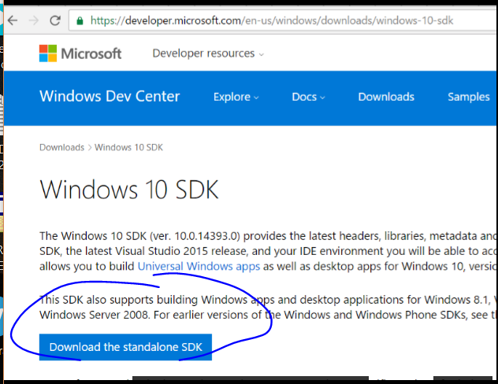

Здесь я скачал, и запустил установщик, и когда он мне показывает опции, я просто выбираю для установки **DEBUGGING** **TOOLS** **FOR** **WINDOWS**.

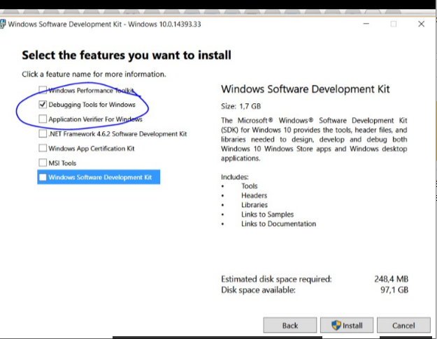

Отключив ненужные пункты, инсталлятор установит **WINDBG**. Поскольку каждая версия **WINDOWS** имеет свой собственный **SDK**, Вы можете сделать то же самое и в других версиях **WINDOWS**, и установить **SDK**, который соответствует Вашей системе. По крайней мере, в нашем случае, мы знаем, что у нас идёт всё хорошо.

Затем я должен перейти в папку **CFG** внутри установленной папки **IDA** и найти файл **IDA**.**CFG**.

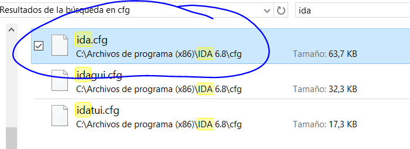

Я редактирую этот файл, и я должен указать путь в переменную **DBGTOOLS** где установлен **WINDBG** **x86**. В моём случае он находится здесь.

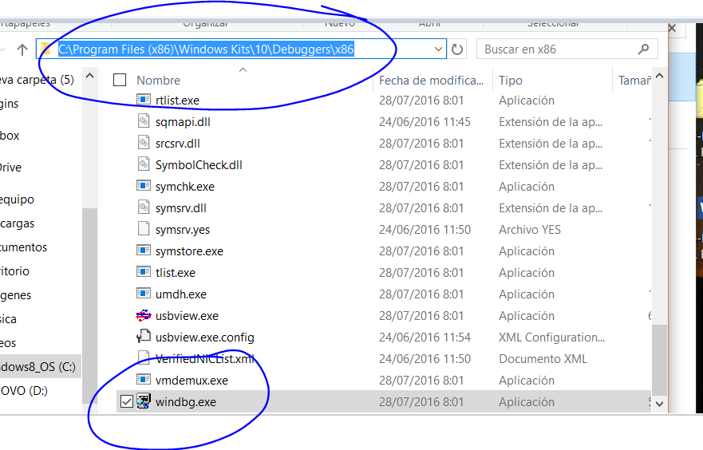

Поэтому в файле **IDA**.**CFG** я ищу слово **DBGTOOLS**.

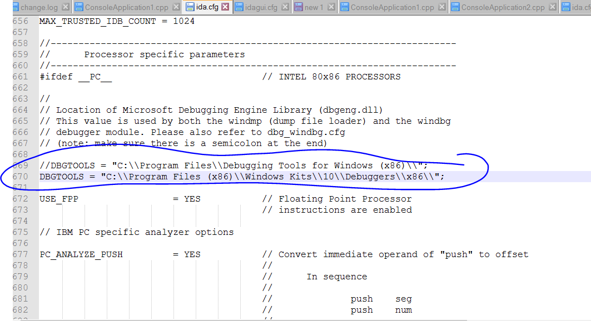

И я добавляю точный путь, добавляя двойной символ бэк-слэша **\\** вместо одного, чтобы разделить папки. Я оставляю исходный путь, закомментированный выше.

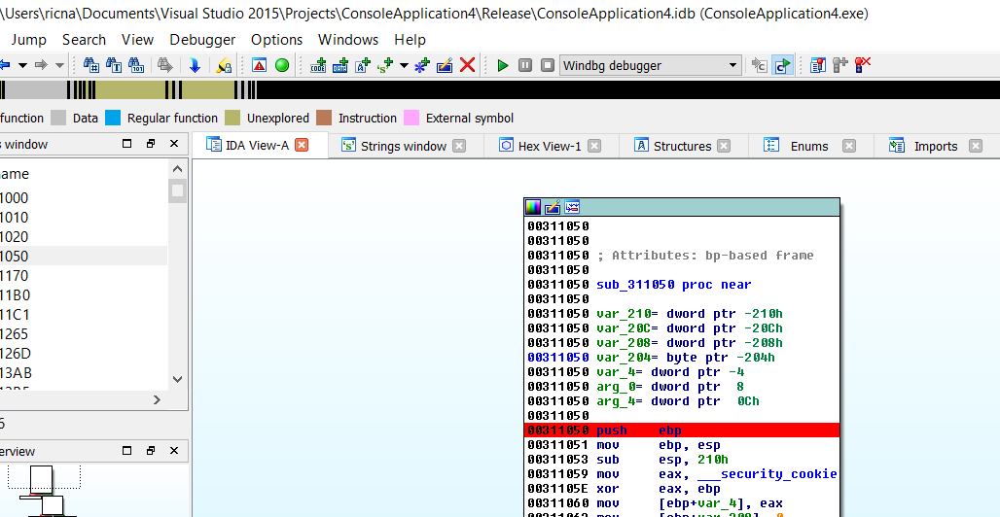

Я открываю любой исполняемый файл, и устанавливаю **BP** для того, чтобы программа остановилась, и меняю отладчик на **WINDBG**.

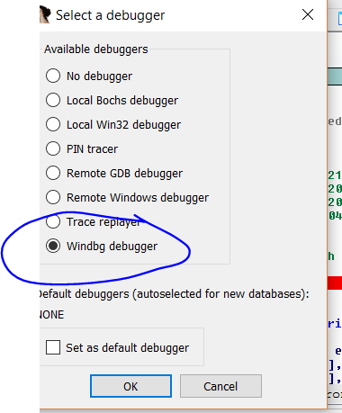

Затем мы проверяем, всё ли в порядке. Мы запускаем исполняемый файл. Если **IDA** говорит нам, что она не находит **WINDBG,** мы должны проверить путь, или что-то не так установилось в процессе установки. Я думаю, что единственный способ увидеть проблему - это посмотреть с помощью утилиты **PROCESS** **MONITOR** какие файлы, установщик ищет при запуске и где, чтобы увидеть, чего ему не хватает.

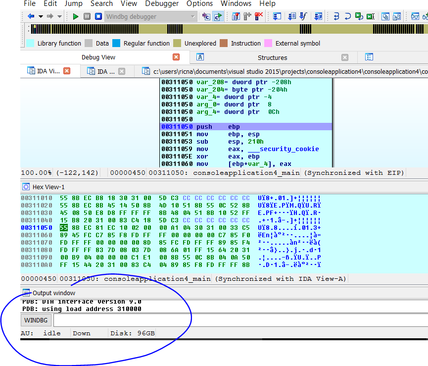

Здесь отладчик остановится, поскольку он был **WIN32** локальным отладчиком **IDA**, но мы видим, что ниже, где обычно находится панель **PYTHON**, появляется панель **WINDBG** \(???\). Если будет нужно, то нажав на слово **WINDBG**, я могу переключиться на панель **PYTHON**.

Это означает, что всё нормально. Он установился хорошо. Мы можем использовать **GUI** **IDA** и в то же время команды **WINDBG**. Давайте попробует некоторые из них.

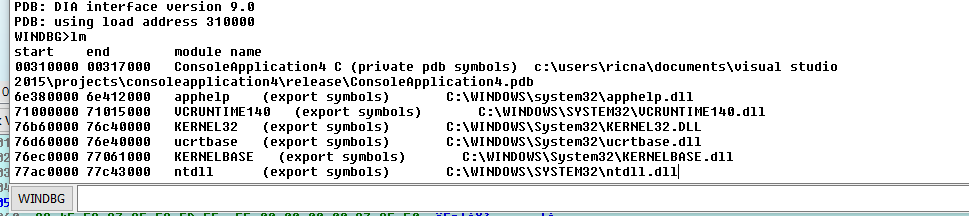

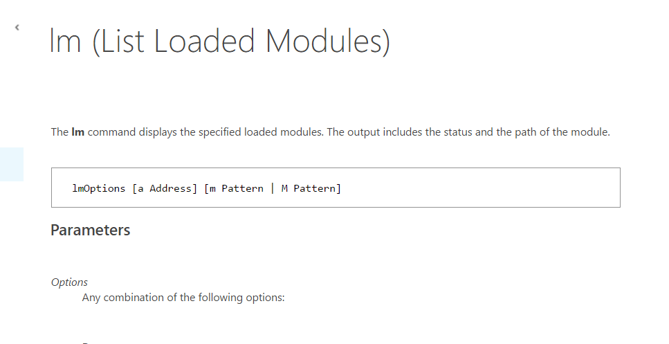

Всё работает!!! Я могу увидеть список модулей в панели **WINDBG**. Очевидно в **IDA** будут те же данные.

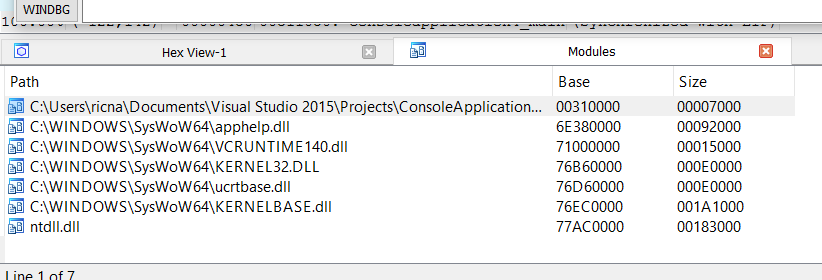

Также мы должны сконфигурировать символы для **WINDBG**. Если мы введем такую команду:

**.RELOAD**

Отладчик покажет мне ошибки при работе с символами, потому что не настроено место, где нужно их хранить.

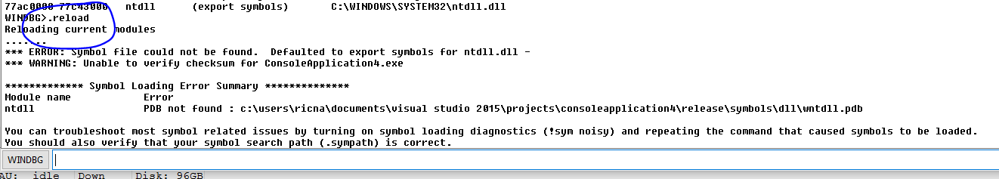

Мы создаём каталог на диске **C:\** для символов. Очевидно **IDA** должна запускаться от пользователя **Администратор**. Если это не так, она не сможет писать в нужную папку.

В **ПЕРЕМЕННЫЕ** **ОКРУЖЕНИЯ** **WINDOWS** мы добавим переменную **\_NT\_SYMBOL\_PATH.**

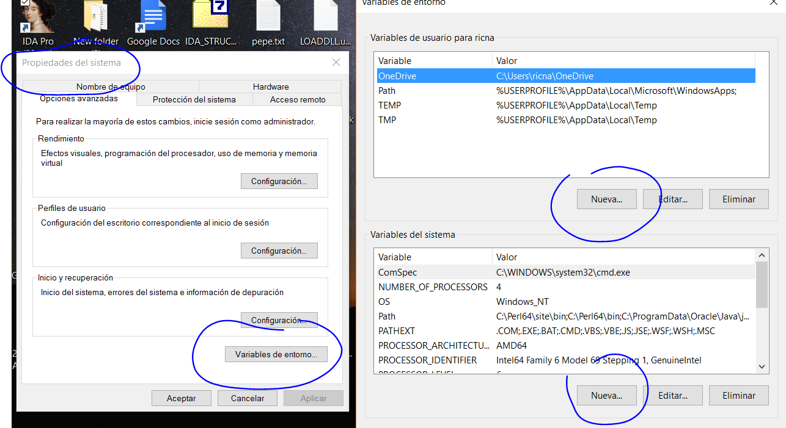 ****

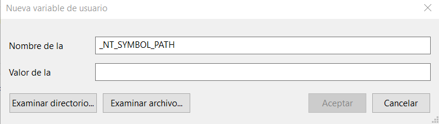

А в значение, мы вводим следующее:

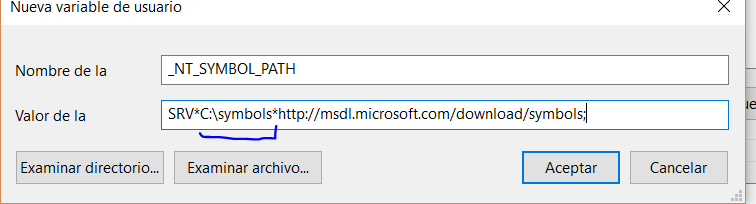

Здесь я буду вводить путь до папки, которая будет создана, когда начнут загружаться символы. В моём случае это будет папка с именем **SYMBOLS** на диске **C:\**

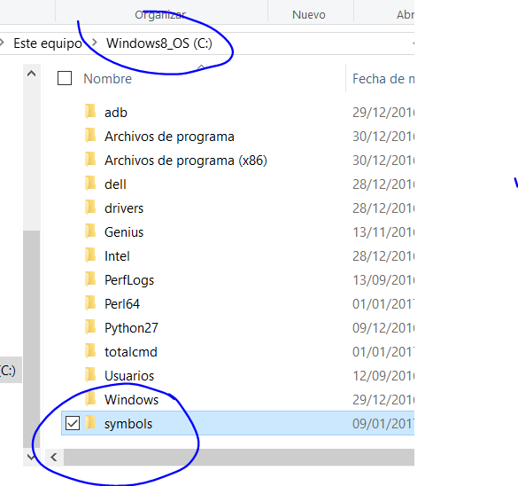

Я перезагрузил **ПК** или **WINDOWS** **EXPLORER**\(процесс **EXPLORER.EXE** убивается и запускается из панели диспетчера задач\).

И сейчас, когда я запускаю снова **IDA** и запускаю отладчик с помощью **WINDBG**, мы уже видим, что он пытается загрузить символы. Отладчик показывает окно загрузки и по окончанию с помощью команды **LM**, мы видим, что появляется путь, который мы установили и внутри папки символов находятся **PDB** файлы.

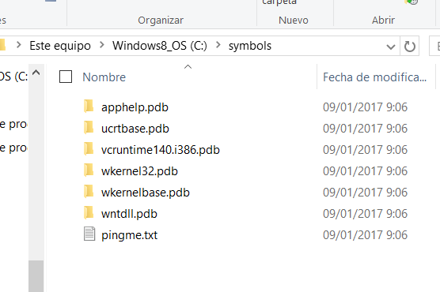

Мы уже сконфигурировали отладчик и он готов к работе.

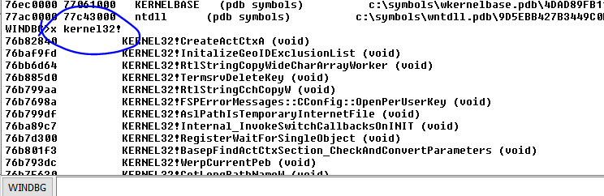

С помощью клавиши **X** мы можем увидеть список функций библиотеки **KERNEL32**. Например, мы можем использовать подстановочные знаки.

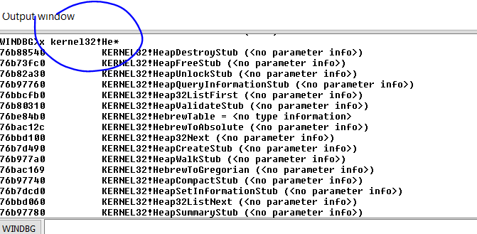

Отладчик, покажет нам функции, которые начинаются с символов **He**.

Конечно, также в **IDA**, в списке модулей, я могу сделать правый щелчок и выбрать пункт **LOAD** **SYMBOLS** для любого модуля.

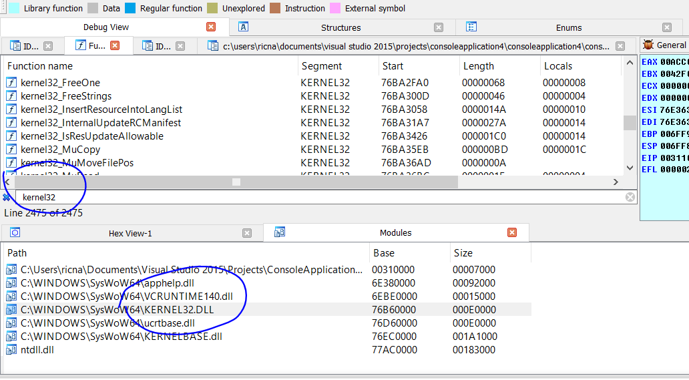

И также я буду иметь их в интерфейсе **IDA**.

У меня есть возможность установить **BP** из интерфейса **IDA** как мы обычно это делаем с помощью клавиши **F2** и через панель **WINDBG**, которые будут обрабатываться **IDA**.

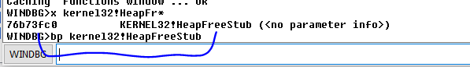

Если я введу команду **BL,** то увижу список **BP** **WINDBG**.

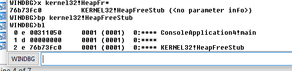

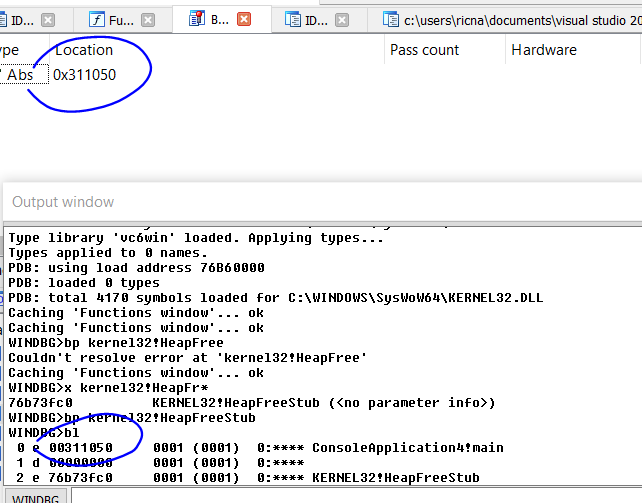

Мы видим, что в **WINDBG** выводятся все **BP**, тогда как в списке **IDA** будут появляться только **BP** **IDA**, но отладчик всегда будет останавливаться на всех.

Очень важно, чтобы вы произвели установку и чтобы она отработало хорошо. Иногда с этим возникают проблемы. Поэтому в следующей части мы будем двигаться вперед.

* * *

Автор оригинального текста — Рикардо Нарваха.

Перевод и адаптация на английский  язык — IvinsonCLS.

Перевод и адаптация на русский язык — Яша Яшечкин.

Перевод специально для форума системного и низкоуровневого программирования - WASM.IN

26.02.2018

Источник:

[**http://ricardonarvaja.info/WEB/INTRODUCCION%20AL%20REVERSING%20CON%20IDA%20PRO%20DESDE%20CERO/32-INTRODUCCION%20AL%20REVERSING%20CON%20IDA%20PRO%20DESDE%20CERO%20PARTE%2032.7z**](http://ricardonarvaja.info/WEB/INTRODUCCION%20AL%20REVERSING%20CON%20IDA%20PRO%20DESDE%20CERO/32-INTRODUCCION%20AL%20REVERSING%20CON%20IDA%20PRO%20DESDE%20CERO%20PARTE%2032.7z)
