# Часть 36

Хорошо. Давайте начнем работать с версией программы, которая имеет защиту **DEP**. Мы знаем, что программа похожа на предыдущую, но что произойдёт, если мы запустим скрипт для версии где защита **DEP** отсутствует.

Изменим путь в скрипте, для того, чтобы он указывал на файл **DEP.EXE**.

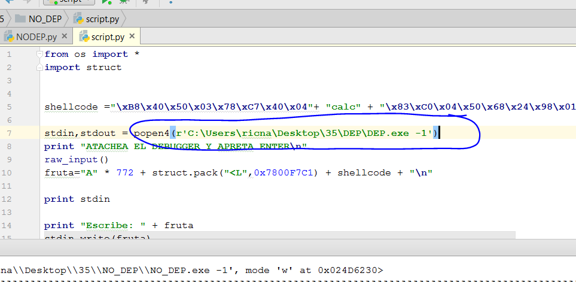

Я запускаю скрипт и присоединяюсь к процессу помощью **IDA**, которая уже имеет анализ файла **DEP.EXE**.

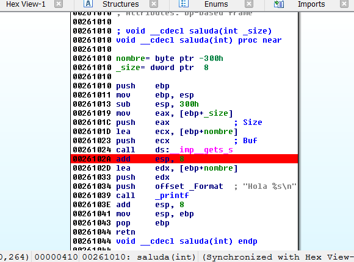

Я установлю **BP** сразу после функции **GETS**, чтобы увидеть, что происходит в функции **SALUDA**, так как процесс ожидает здесь внутри **API** функции, когда мы присоединяемся к нему.

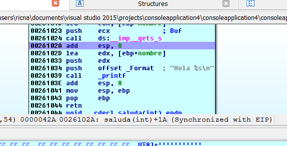

Программа остановилась здесь. Я буду трассировать её до инструкции **RET** c помощью клавиши **F8**.

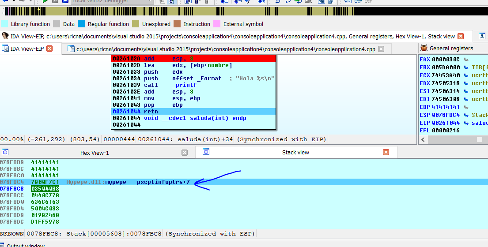

Здесь мы видим перезапись стека. Программа будет переходить на гаджет **PUSH** **ESP** - **RET**, который находится по адресу **0x7800F7C1**. Здесь не должно быть никаких проблем, потому что это инструкция кодовой секции модуля и эти секции всегда имеют разрешение на выполнение. Мы нажимаем клавишу **F7**.

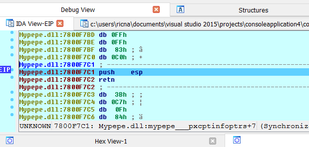

Трассируем программу далее с помощью клавиши **F7**.

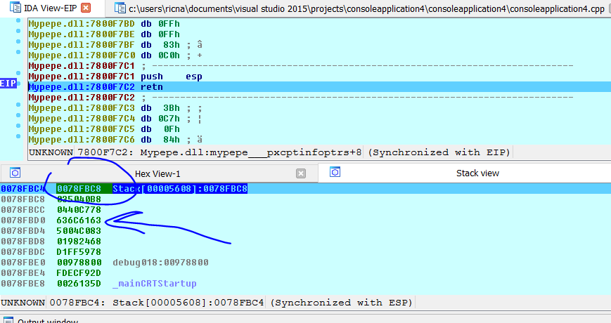

Программа помещает в стек значение регистра **ESP**, а затем переходит к исполнению инструкции **RET**. Здесь программа будет переходить на адрес **0x78FBC8**, чтобы выполнить его, как если бы это был обратный адрес для выполнения и здесь это мой шеллкод в стек. В файле **NO** **DEP** программа переходила и выполняла этот шеллкод, который я засылал. Но что происходит здесь ? Я нажимаю клавишу **F7**.

**0078FBC4 0078FBC8 STACK\[00005608\]:0078FBC8**

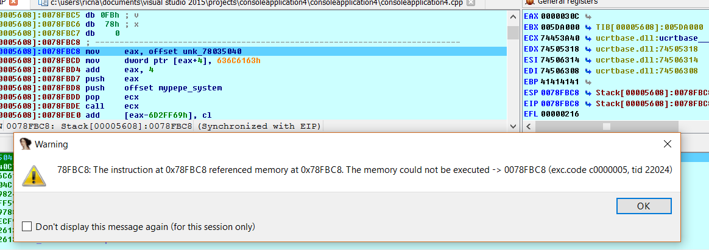

Код в стеке, который программа выполняла без проблем для файла **NO** **DEP**, не может быть здесь выполнен, потому что защита **DEP** удаляет разрешение на выполнение в стеке \(в куче и т.д.\) и оставляет только права на чтение и запись.

Что мы можем сделать здесь ?

Мы видим, что когда программа переходит в код библиотеки как мы это делали с помощью гаджета **PUSH** **ESP -** **RET** и это является основном смыслов **ROP.** Поместите гаджеты вместе, которые представляют собой небольшие кусочки кода, которые заканчиваются на **RET**, чтобы наконец получить разрешение на выполнение в стеке, куче или того, что нам нужно.

Например, если я хочу поместить значение в регистр **EAX**, то вместо перехода на гаджет **PUSH ESP - RET** я буду переходить на гаджет **POP EAX - RET**. Я буду искать гаджет **POP EAX - RET** среди гаджетов **IDASPLOITER** в моей библиотеке **MYPEPE**, которая не имеет защиту **ASLR**.

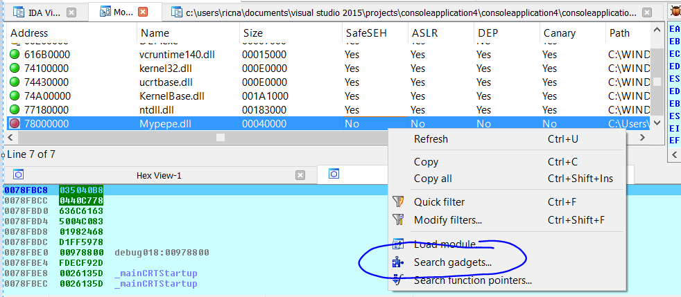

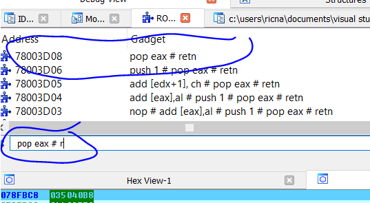

Здесь такой гаджет расположен по адресу **0x78003D08**.

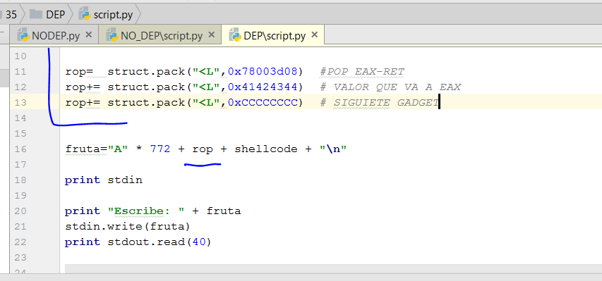

Здесь, мы заменили переход на гаджет **PUSH** **ESP** - **RET** нашим **ROP**, который начинается с инструкции **POP** **EAX**, которая помещает значение **0x41424344**. Это значение находится ниже в регистре **EAX** и затем когда программа переходит к инструкции **RET** \(помните, что все или почти все гаджеты заканчиваются на инструкции **RET**\) она переходит к следующему гаджету по адресу **0xCCCCCCCC**. Позже я посмотрю, что это такое, но сейчас давайте выполним этот код, чтобы посмотреть, что произойдёт. Давайте снова присоединимся к процессу и потрассируем его немного, как и раньше.

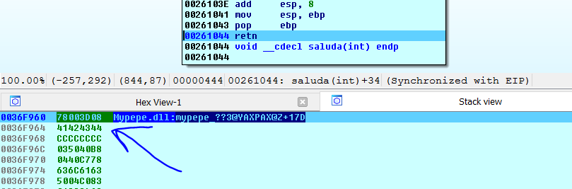

Когда я дохожу до инструкции **RET,** я вижу как гаджет **POP EAX - RET** переходит в мой **ROP**. Значение **0x41424344**, которое в конечном итоге поместится в регистр **EAX** и значение **0xCCCCCCCC** где вы должны добавить указатель на следующий гаджет. Давайте потрассируем этот гаджет с помощью клавиши **F7**.

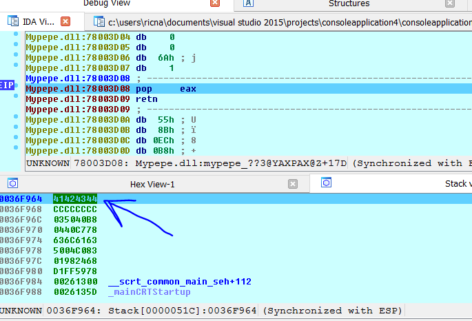

Мы переходим к моему первому гаджету. Это гаджет **POP EAX - RET**. Мы знаем, что инструкция **POP** берет значение с вершины стека и помещает его, в нашем случае, в регистр **EAX**. Если я выполю код с помощью клавиши **F7**.

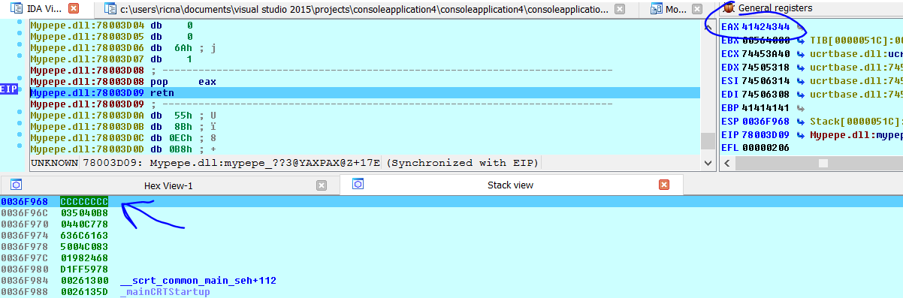

Здесь это значение было помещено в регистр **EAX**, и поскольку программа достигла инструкции **RET**, теперь она будет переходить на следующий гаджет, в этом случае на адрес **0xCCCCCCCC**. У Вас его ещё нет, но мы должны добавить его сюда.

И всё это называется **ROP**. Объединяя разные гаджеты вместе, программа будет делать то, что пожелаю. Гаджет будет выполняться один за другим. Вот почему всё это называется **ROP** \(**RETURNORIENTED** **PROGRAMMING**\). Потому что мы исполняем код без сборки наших собственных инструкций. Мы только помещает список адресов, которые указывают на кусочки кода. Они служат нам для достижения цели и приводят к захвату системы.

Очевидно, что существует автоматический и ручной способ сделать это. Сначала мы научимся делать это вручную. Тот, кому это не нужно и не интересно – просто пропускает эту часть и переходит к следующей части, где всё делается автоматически.

Общий метод состоит в том, чтобы разместить определенные значения в регистрах и затем перейти к гаджету **PUSHAD** - **RET**. Мы увидим, что программа будет перестраивать всё. Хотя есть тысячи способов собрать **ROP**. Это самый распространенный метод.

Прежде всего нужно решить, какой **API** мы будем использовать для снятия защиты со стека. В этом случае, это могут быть функции **VIRTUALALLOC** или **VIRTUALPROTECT**, которые наиболее часто используются, хотя, на самом деле, этих способов больше.

Мы знаем, что сейчас есть две вкладки с модулями. Это **IDASPLOLITER** и сама **IDA**. Последняя находится в меню **DEBUGGER→** **DEBUGGER** **WINDOWS →** **MODULE** **LIST**. Здесь мы сделаем щелчок правой кнопкой по библиотеке **MYPEPE** и будем анализировать его. Затем заставьте **IDA** загрузить его символы, если они конечно, есть.

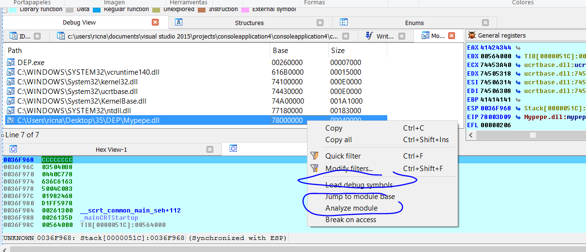

Поскольку у нас нет символов для библиотеки **MYPEPE**, это выглядит хорошо**\(???\),** но **IDA** не добавляет никакой информации про импортированные функции, которые видно в списке функцией. Там есть только для библиотеки **MYPEPE\(???\)**.

Но хорошо, давайте будем искать строку **OFF\_**.

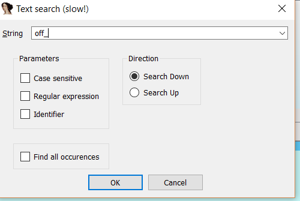

Мне не нужны все вхождения. Только одно.

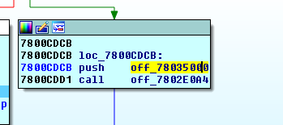

Инструкция **CALL** является типичным переходом к импортированной функции **IAT**, так как префикс **OFF**\_\(не путать с **OFFSET**, который указывает адресом\) в этом случае означает, что это содержимое адреса, куда программа будет переходить. Он также является указателем, как в случае **IAT**. Давайте перейдём по этому адресу.

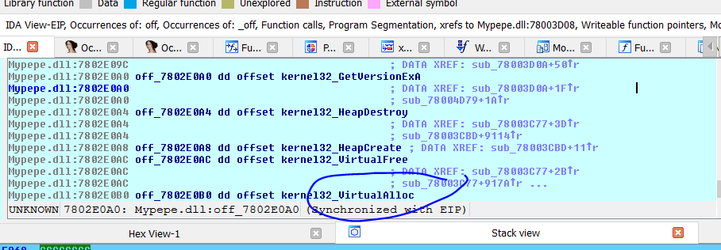

Хорошо. Смотря между функциями **IAT** мы видим функцию **VIRTUALALLOC**. Поэтому мы будем подготавливать для неё **ROP** \(мы уже знаем, что **0x7802E0B0** это начало **IAT** **VA**. С этого момента я будет называть **VIRTUALALLOC –&gt; VA**\)

Основной смысл состоит в том, чтобы разместить эти значения в каждом регистре и затем с помощью некоторых гаджетов **PUSHAD** - **RET** вставить их в стек, чтобы они были упорядочены как аргументы для функции **VIRTUALALLOC**. Да, да - это не волшебство.

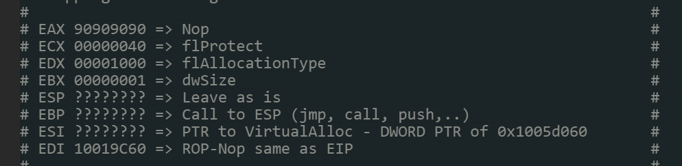

Мы видим, что нам нужно поместить значение **0x90909090** в регистр **EAX**. Для это есть гаджет **PUSH EAX - RET** мы уже добавили его. Теперь нам нужно изменить регистр **POPEA** на регистр **EAX** в **0x90909090**, но регистр **EAX** всегда соглашается установить его последним, потому что он может быть необходим для установки других значений. Рекомендуется добавлять сначала самые сложные. В регистре **ESI** должен быть адрес функции **VIRTUALALLOC**, но у нас есть только расположение **IAT** и адрес **API** будет меняться, записи **IAT** не будет. Поэтому основываясь на местоположении, мы будем искать адрес и **ROP** будет работать всегда.

Для этого, мы должны искать самые простые гаджеты. Если есть такой гаджет **MOV** **ESI**, \[**РЕГИСТР**\] **- RET**. Давайте искать эту последовательность среди гаджетов.

Такого гаджета нет, но зато есть такой.

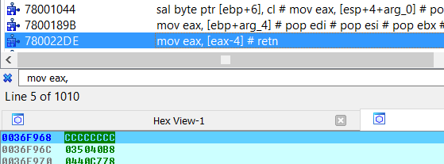

Всё хорошо. Мы помещаем в регистр **EAX** адрес **IAT** **+** **4** и с помощью этой инструкции мы помещаем адрес **API** в регистр **EAX**. Нам придется переместить значение из регистра **EAX** в регистр **ESI** с помощью другого гаджета. Но давайте упорядочим всё это и попробуем всё это в деле.

Расположение записи **IAT** было по адресу **0x7802E0B0.** Мы добавим к ней значение **4** и поместим значение в регистр **EAX** с помощью гаджета **POP EAX - RET**, который у нас уже есть.

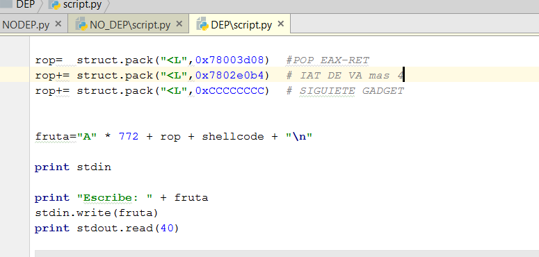

При этом у нас будет местоположение **IAT** **+** **4** в регистре **EAX**. Следующий гаджет будет тем, который мы уже нашли.

**780022DE** **MOV** **EAX, \[EAX - 4\] \# RETN**

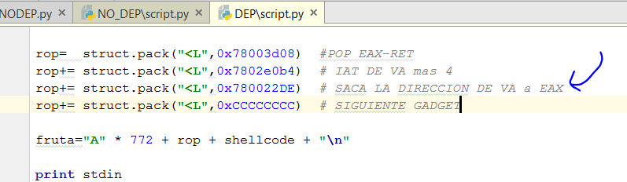

Здесь мы объединяем оба гаджета. Давайте протестируем их, чтобы убедиться, что они делают то, что мы задумали и адрес **VIRTUALALLOC** остаётся в **EAX**.

Одно из неудобств, которое мы увидим, заключается в том, что **IDASPLOITER** работает только в режиме отладки. Поэтому если нам нужно отлаживать, он будет закрываться при перезагрузке, но мы можем открыть другой экземпляр **IDA** с процессом c остановленным процессом отладки, для того чтобы найти его в **IDA** **SPLOITER** и отлаживать его в другом окне.

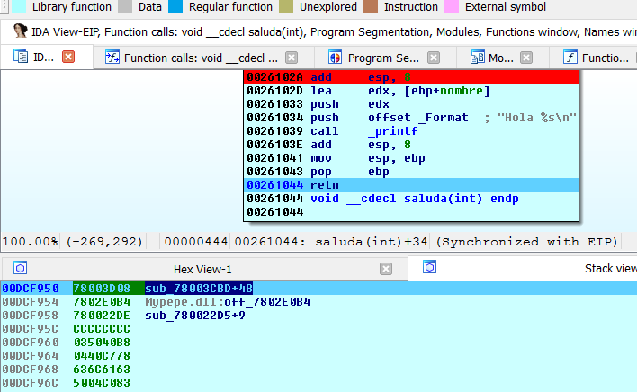

Мы будем трассировать **ROP**, который мы сделали, до этого места с помощью клавиши **F7**.

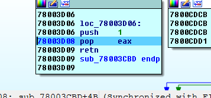

Теперь программа будет помещать адрес записи **IAT** из **VA** **+** **4** в регистр **EAX**.

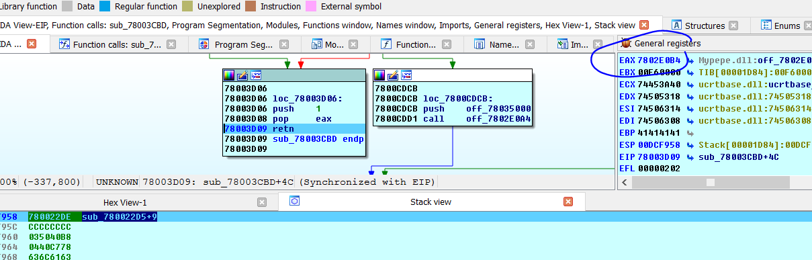

Сейчас, программа будет переходить на второй гаджет. Я продолжаю с помощью клавиши **F7**.

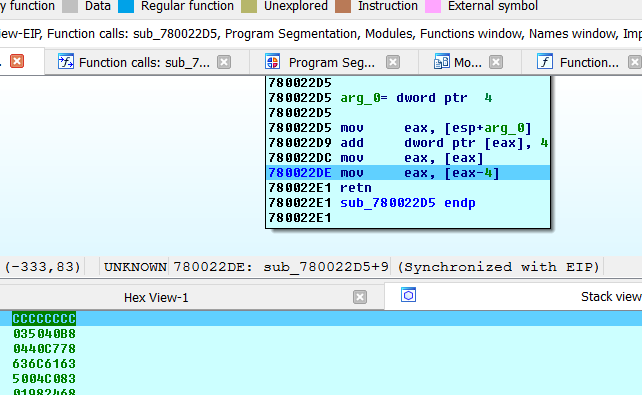

Я исполняю гаджет с помощью клавиши **F7.**

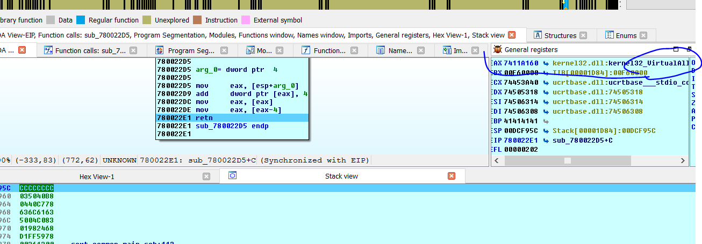

Мы видим, что мы достигли нашей цели. Адрес **API** находится в регистр **EAX** и мы вытащили его из **IAT**. Поэтому он будет работать на любой машине. Следующий гаджет должен поместить **VA** адрес из регистра **EAX** в регистр **ESI,** чтобы он оставался в регистр **ESI**, где это соответствует следующему.

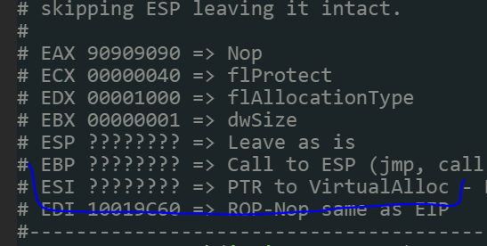

Здесь нет инструкции **MOV ESI, EAX** или что-то в этом роде. Поэтому мы должны использовать наше воображение. Несмотря на то, что гаджеты обычно заканчивает на инструкции **RET**, любой код, даже если он не заканчивается на **RET**, позволяет мне продолжать и удерживать контроль. Он также будет считаться гаджетом, хотя он и менее традиционный, но он всё равно будет работать.

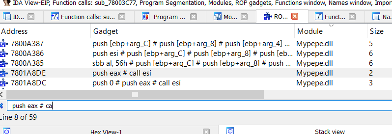

Если я помещу значение регистра **EAX** в стек используя гаджет **PUSH** **EAX - CALL** **ESI** и подготовлю регистр **ESI** для гаджета **POP** **ESI** - **RET**, я мог бы поместить содержимое регистра **EAX** в **ESI**используя стек. Давайте посмотрим на этот случай.

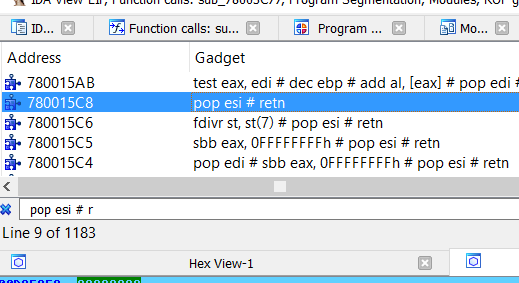

Поэтому я буду добавлять гаджет **POP** **ESI –** **RET** в **ESI** раньше.

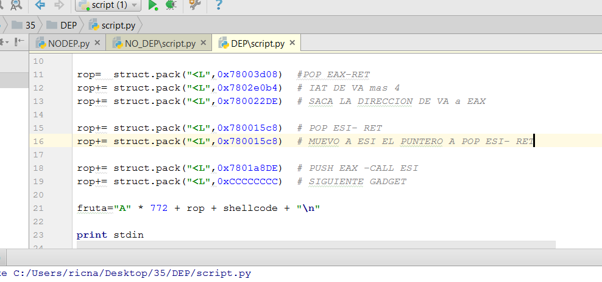

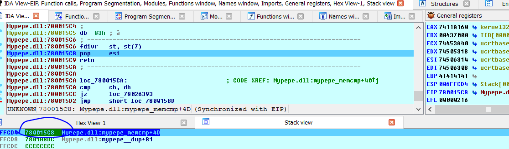

Мы видим, что инструкция **POP** **ESI**, помещает в регистр **ESI** тот же самый указатель на гаджет **POP** **ESI – RET**, чтобы после следующего гаджета восстановить управление.

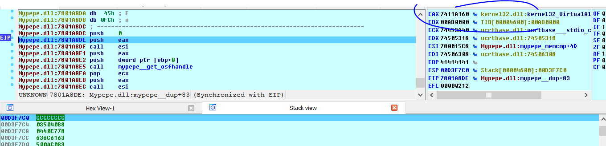

Этот гаджет будет помещать в стек адрес **VA** и снова переходит с помощью инструкции **CALL** **ESI** обратно к гаджету **POP** **ESI** - **RET** так как мы сохранили адрес гаджета **POP** **ESI** - **RET** в регистр **ESI**.

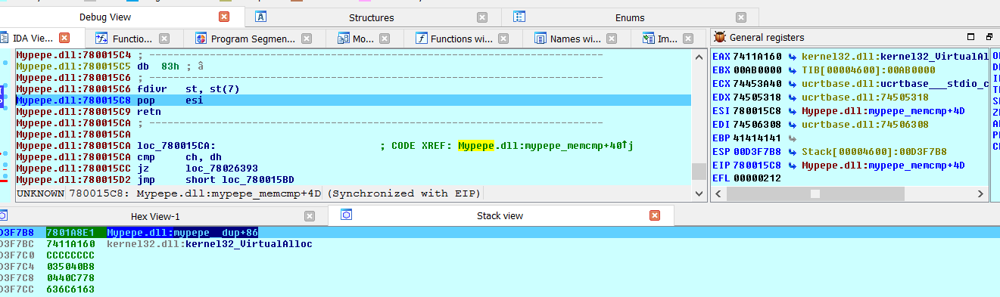

Мы видим, что гаджет не сработал, потому что он помещает адрес возврата, который он сохранил в регистр **ESI** и чуть ниже это адрес **VA**. Поэтому вместо гаджета **POP** **ESI** - **RET** последним должен быть гаджет **POP** **XXX**, **POP** **ESI** - **RET** что перенести первое значение из стека в другое место и затем вытолкнуть в регистр **ESI** адрес **VA**.

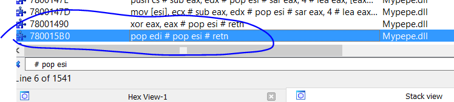

Вот нужный нам гаджет. Поэтому я меняю именно его, который я помещаю в регистр **ESI**. Другой гаджет должен оставаться таким же.

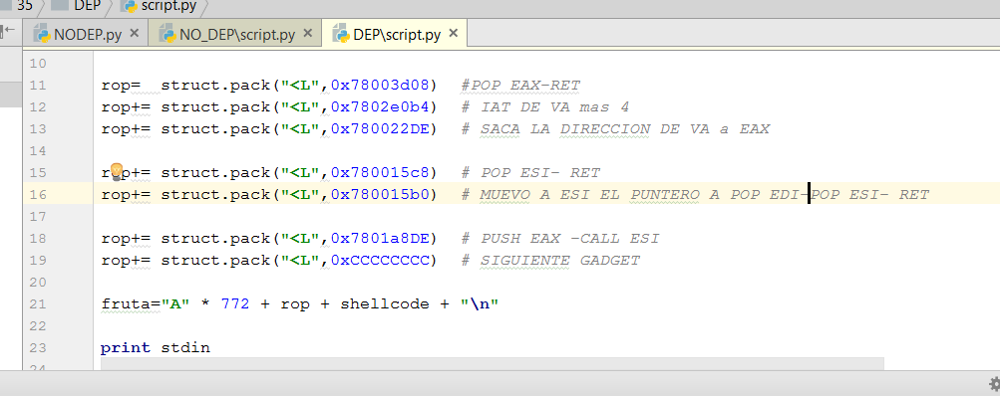

Давайте попробуем сейчас.

Я вхожу в гаджет с помощью клавиши **F7**.

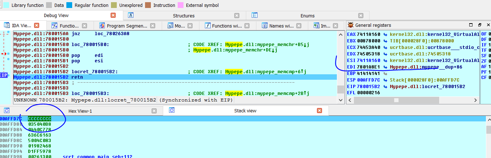

Готово. Первая цель уже достигнута. В регистре **ESI** находится адрес **VA** и программа будет переходить по адресу **0xCCCCCCCC,** который является адресом следующего гаджета. Поэтому я снова взял контроль над выполнением.

Следующий гаджет будет легче. В регистр **EBP** мы должны поместить адрес гаджета **JMP** **ESP,** **CALL** **ESP** или **PUSH ESP - RET**. У нас уже был гаджет **PUSH ESP - RET.** Мы только должны найти гаджет **POP EBP - RET** чтобы поместить его в регистр **EBP**.

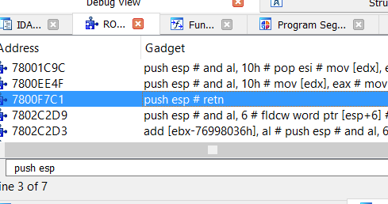

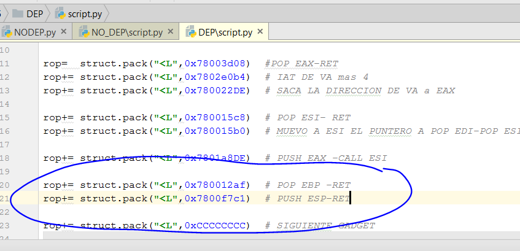

Это настройка для регистра **EBP**. При этом, он будет установлен с указателем на гаджет **PUSH ESP - RET**. Давайте продолжим.

**EDI** = **ROP** **NOP** означает, что регистр должен указывать на **RET**, который является **NOP** в программировании **ROP**. Поэтому давайте найдем гаджет **POP EDI - RET** для установки регистра **EDI**.

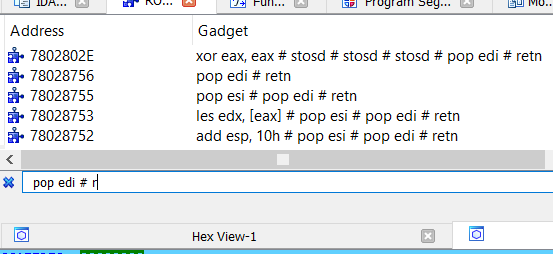

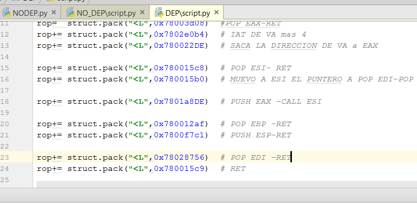

Мы устанавливаем любой указатель библиотеки **MYPEPE** на **RET**. Он переместит его в регистр **EDI**. Давайте продолжим.

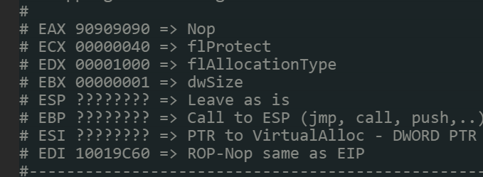

Нам нужно установить **4** константы: значение **90909090** в регистр **EAX**, значение **40** в регистр **ECX**, значение **1000** в регистр **EDX** и значение **1** в **EBX**. Мы будем искать соответствующие **POP** и добавлять константы.

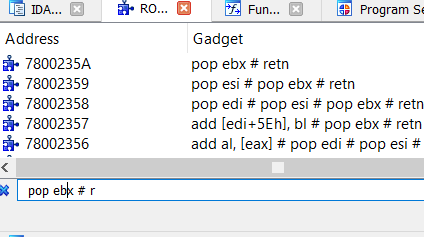

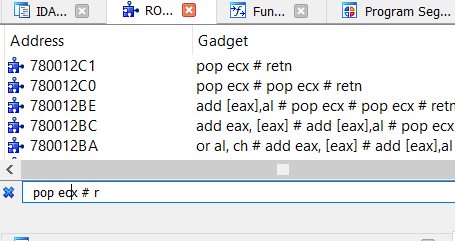

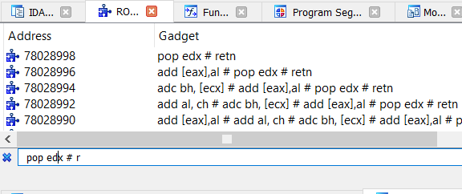

Давайте добавим их в нашу цепочку **ROP**.

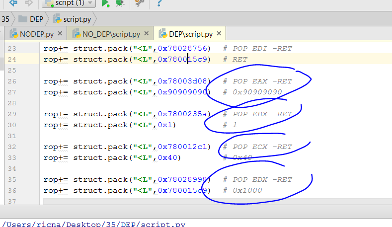

Готово. Теперь нам нужен только последний гаджет, который завершит всю цепочку. Им будет **PUSHAD** - **RET**.

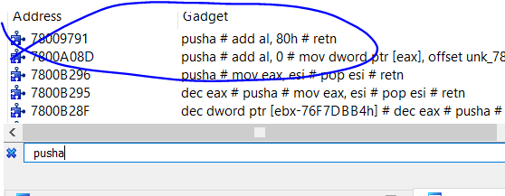

Вот он. Инструкция **ADD** **AL**, **XX** ничего не делает, потому что до этого была инструкция **PUSHAD**. Поэтому он будет сохранять **90909090** в стеке. Давайте добавим его.

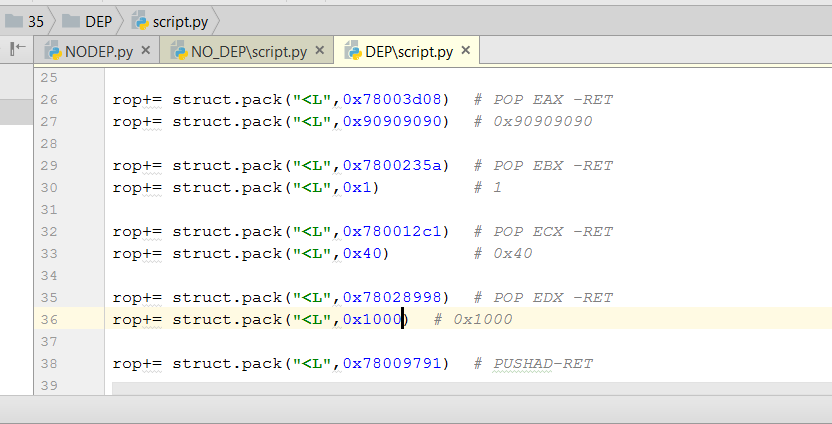

Цепочка уже должна заработать с этими гаджетами. Давайте трассировать её полностью до тех пор пока не доберемся до функции **VIRTUALALLOC**.

Мы пришли к инструкции **PUSHAD.**

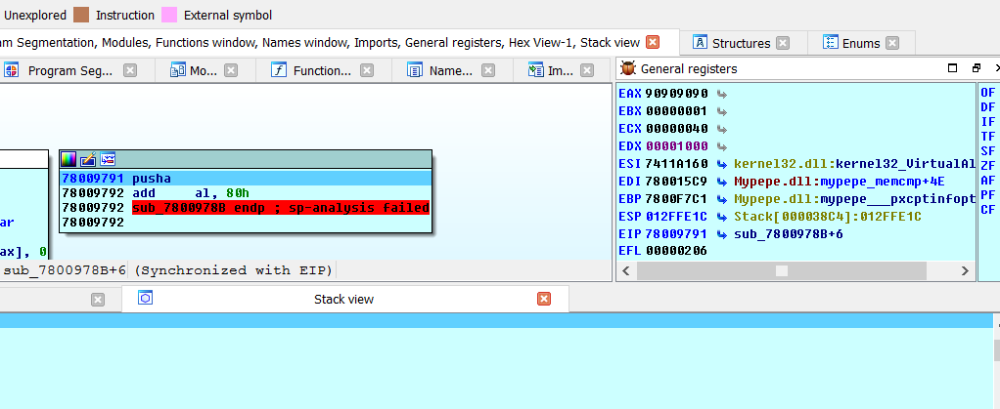

Всё выглядит хорошо. Мы нажимаем клавишу **F7**.

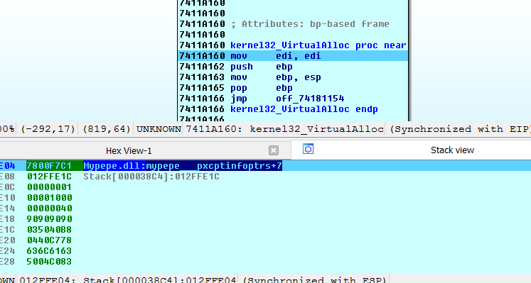

Мы добрались до функции **VIRTUALALLOC**. Мы видим аргументы в стеке. Первым будет место, где программа вернётся после возвращения из **API**. Если я посмотрю, это будет гаджет **PUSH** **ESP** - **RET**. Затем приходят аргументы для **API**. Давайте проверим.

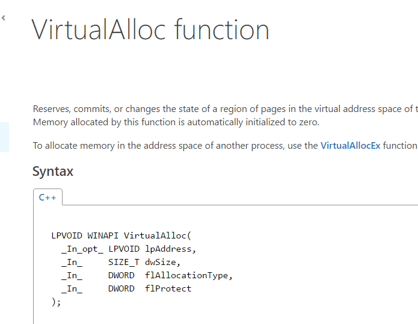

Адрес для снятия защиты **LPADDRESS** принадлежит стеку и показывает, где находится мой шеллкод.

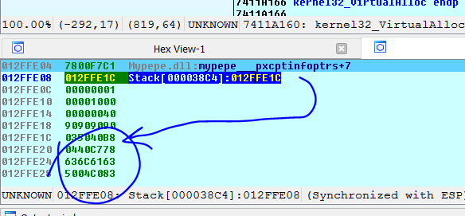

Затем идёт параметр **SIZE 1**, который будет снимать защиту блока длиной равной **0x1000**, потому что это минимальный блок для снятия защиты. Независимо от того, что вы введете. Затем идёт значение **0x1000,** которое является константой для указания типа распределения и значение **0x40**, которое является другой константой **FLPROTECT**. Если я выполню код **API** до инструкции **RET**, то нажимая **CTRL + F7,** я увижу, что программа возвращается к гаджету **PUSH ESP - RET**.

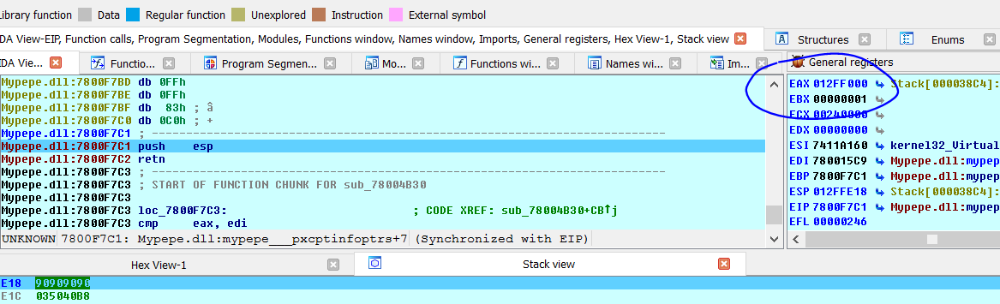

Если в регистре **EAX** программа вернет адрес, то гаджет правильный и стек теперь не защищен. Сейчас я могу выполнить мой код в стеке. Я продолжаю трассировать с помощью клавиши **F7**.

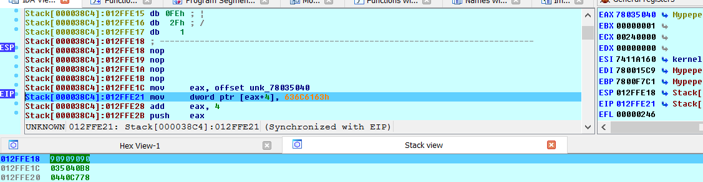

Мы видим, что программа прибывает в мой шеллкод без проблем и он исполняется.\(**Аллилуйя**\)

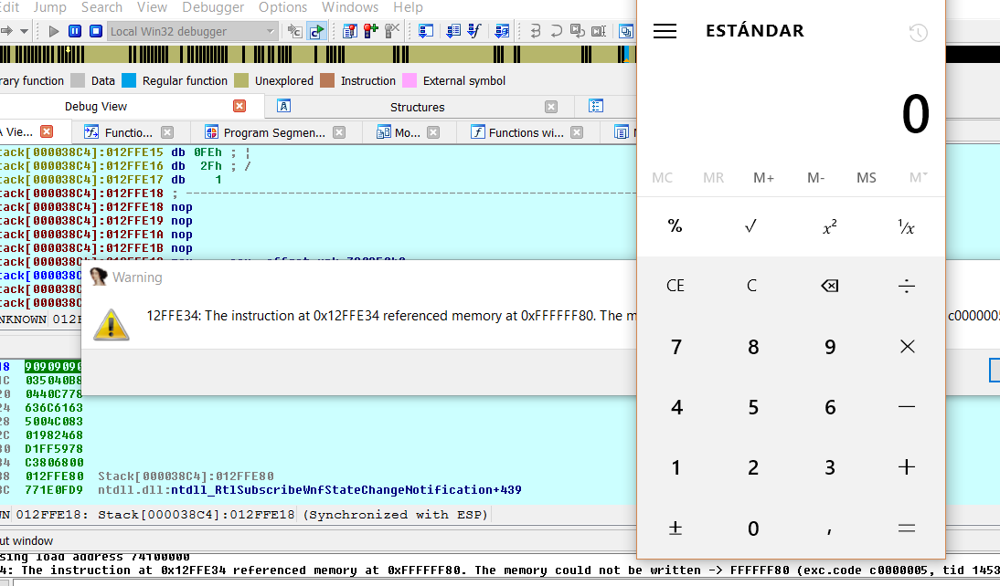

И программа заканчивается запуском калькулятора. Конечно, это может быть автоматизированно с помощью **MONA,** но это мы увидим это в следующей части.

**МЫ ПОБЕДИЛИ.
=======================================================**

=======================================================
Автор текста: **Рикардо Нарваха** - **Ricardo** **Narvaja** \(**@ricnar456**\)
Перевод на английский: **IvinsonCLS \(@IvinsonCLS\)**
Перевод на русский с испанского+английского: **Яша\_Добрый\_Хакер\(Ростовский фанат Нарвахи\).**
Перевод специально для форума системного и низкоуровневого программирования — **WASM.IN
24.03.2018
Версия 1.0**
