# Часть 38

[\[Используемые материалы\]](.gitbook/assets/files/38.zip)

**CANARY** и **SEH**.

Мы уже видели, что такое переменная **CANARY**. Это случайное значение, которое помещается в стек непосредственно перед сохраненным регистром **EBP** и адресом возврата. Так что, если это значение перезаписывается, программа проверяет это значение\(Это необходимо нам для перезаписи адреса возврата\). Если это значение тоже самое, то оно сохраняется, а если оно неправильное, то программа закрывается, избегая исполнение кода.

Приложенный файл - это файл **CANARY\_SIN\_DEP.EXE**. Позже, в следующей части, мы увидим случай, когда у программы включена защита **DEP** и мы должны сделать **ROP**, чтобы обойти переменную **CANARY**.

Код в программе такой же, как и в файле **NO**\_**DEP**. Только в этом случае, компилятор добавляет защищенную переменную **CANARY**, которая предотвращает эксплуатацию и перезапись **АДРЕСАВОЗВРАТА**.

Давайте будем трассировать программу, запустив тот же самый скрипт, который мы сделали для файла **NO**\_**DEP**, чтобы увидеть почему **ROP** сейчас не работает и, затем, попытаемся обойти защиту.

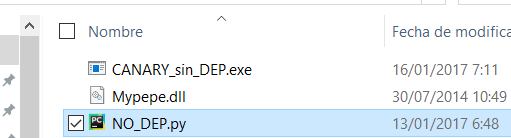

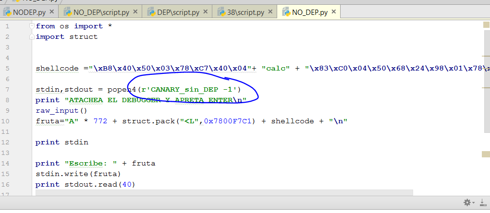

Я изменяю имя исполняемого файла в скрипте, для того, чтобы загрузить файл **CANARY\_SIN\_DEP.EXE**.

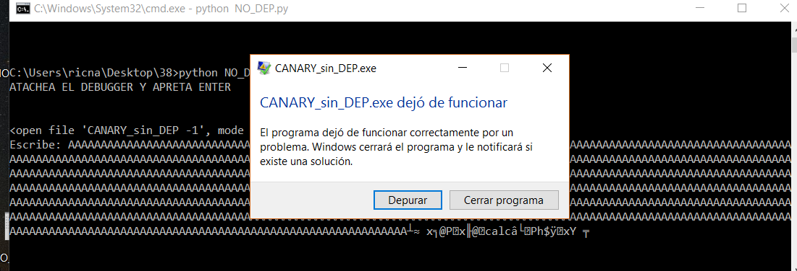

Мы видим, что программа перестаёт работать. Давайте трассировать программу, чтобы увидеть, что происходит на самом деле. Запустим скрипт и присоединимся к процессу с помощью **IDA**.

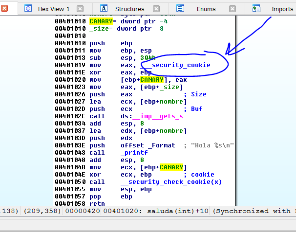

Мы видим, что программа считывает случайное значение **\_SECURITY\_COOKIE**, которое сохраняется в секцию данных, помещает его в регистр **EAX** и **XOR**ит его с помощью значения регистра **EBP**, чтобы сделать его более уникальным. Это значение будет **EBP** этой функции и если исполняемый файл будет рандомизирован, значение регистра **EBP** также не будет постоянным.

Программа сохраняет это значение в переменную **CANARY**. Если есть переполнение, которое пытается перезаписать адрес возврата, это значение будет изменено. Также, никто не может знать какое случайное значение будет там, чтобы перезаписать его с тем же значением.

Когда программа покинет функцию, значение снова будет восстанавливается, **XOR**ится с тем же значением регистра **EBP**, чтобы получить исходное значение **\_SECURITY\_COOKIE** и внутри **CALL**, программа будет сравнивать это значение и если значение не будет равно, программа будет выдавать ошибку или будет закрыта, в зависимости от случая.

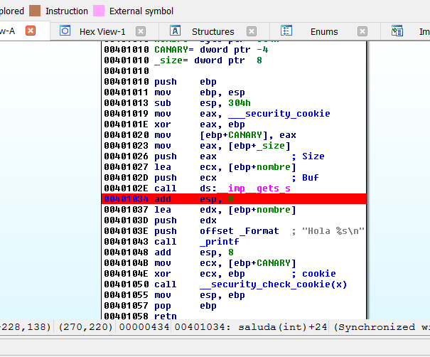

Давайте поместим здесь **BP**, чтобы остановить программу и присоединиться к ней.

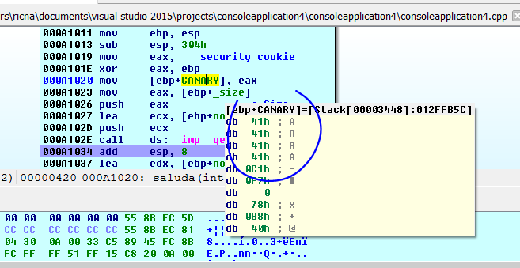

Поскольку мы уже вернулись из функции **GETS\_S**, переменная **CANARY** уже была перезаписана и имеет значение **0x41414141**.

**CANARY = \_SECURITY\_COOKIE XOR EBP**

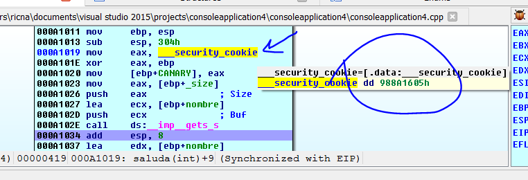

**CANARY = 0x988A1605 XOR 0x012FFB60**

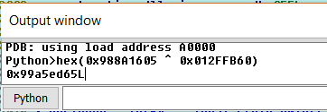

Мы можем проверить, что если мы запустим программу несколько раз, это значение **CANARY** будет меняться каждый раз. Поэтому, мы не можем предсказать значение, чтобы перезаписать его тем же самым.

Давайте продолжим трассировку.

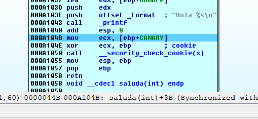

Программа **XOR**ит значение **0x41414141** с помощью значения регистра **EBP**.

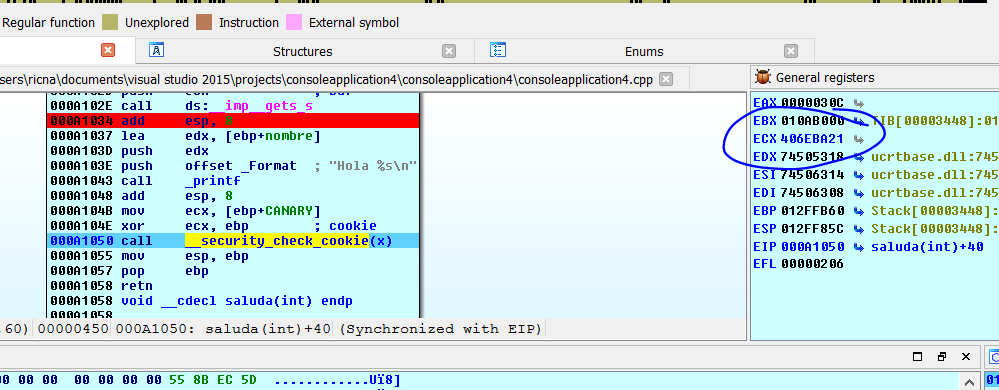

Затем программа входит в **CALL**, чтобы проверить значение.

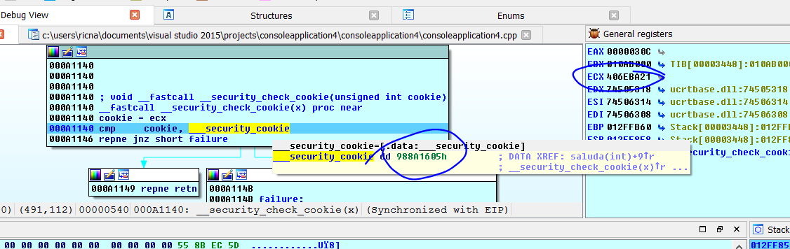

Программа сравнивает это значение с сохраненным значением\_**SECURITY**\_**COOKIE** и поскольку они не равны, программа переходит на метку **FAILURE**. Если эти значения равны, программа переходит на инструкцию **RET** и продолжает выполнение до **АДРЕСА ВОЗВРАТА** так как значение не перезаписано.

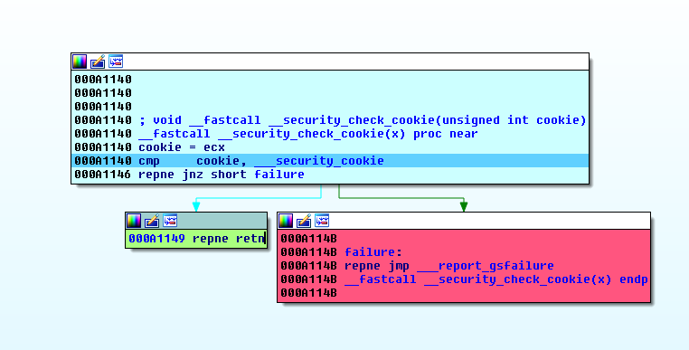

Очевидно, мы должны идти на красной блок, потому что мы переполнили значение. Давайте продолжим трассировку.

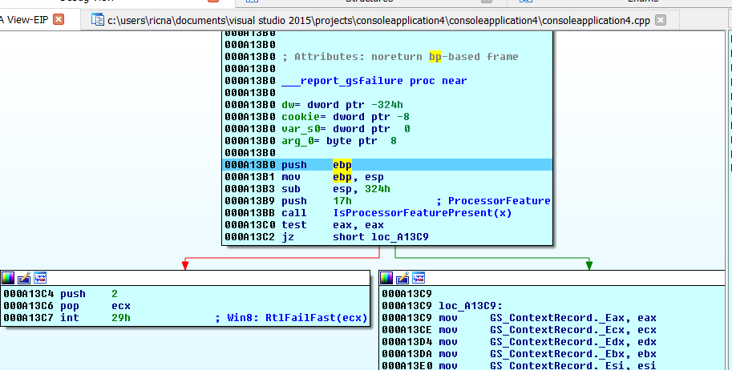

Мы не собираемся анализировать весь этот код, но если мы запустим программу, мы увидим, что программа перестала работать или она закрывается без продолжения с ошибкой.

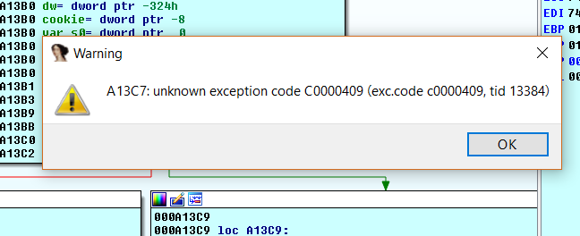

Поэтому вопрос заключается в следующем - Как обойти всю эту защиту? Пeрвая вешь, которая была использована и которая используется с некоторыми ограничениями и которая все ещё работает - это **SEH**.

Про неё можно прочитать здесь на испанском.

[https://msdn.microsoft.com/es-ar/library/swezty51.aspx](https://msdn.microsoft.com/es-ar/library/swezty51.aspx)

Хорошо. Тот, кто хочет узнать все сразу, знайте следующее, что **WINDOWS** сохраняет в стеке простой связанный список, который содержит указатели куда должна переходить программа, когда она сталкивается с исключением.

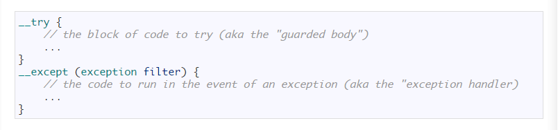

Те, у кого есть опыт в программирование, знают, что существуют структуры **TRY-EXCEPT** или **TRY – CATCH**, где код исполняется внутри ветки **TRY** и если он провоцирует какое-либо исключение, программа переходит на ветку **EXCEPT**.

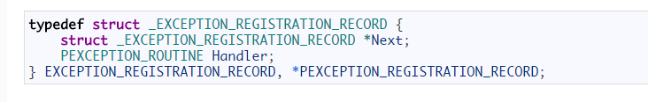

Мы видим, что существуют структуры называемые \_**EXCEPTION**\_**REGISTRATION**\_**RECORD**, которые имеют структуру внутри себя с двумя полями: **NEXT**, которое как мы видим является указателем на другое поле \_**EXCEPTION**\_**REGISTRATION**\_**RECORD** и поле **HANDLER**, которое является типом **PEXCEPTION ROUTINE**.

Многие из этих структур, которые программа добавляет в стек, используются для обработки исключений части кода, и каждая из них должен иметь поле **NEXT**, которое указывает на следующую структуру, и указатель куда должен переходить обработчик, если он найдет исключение.

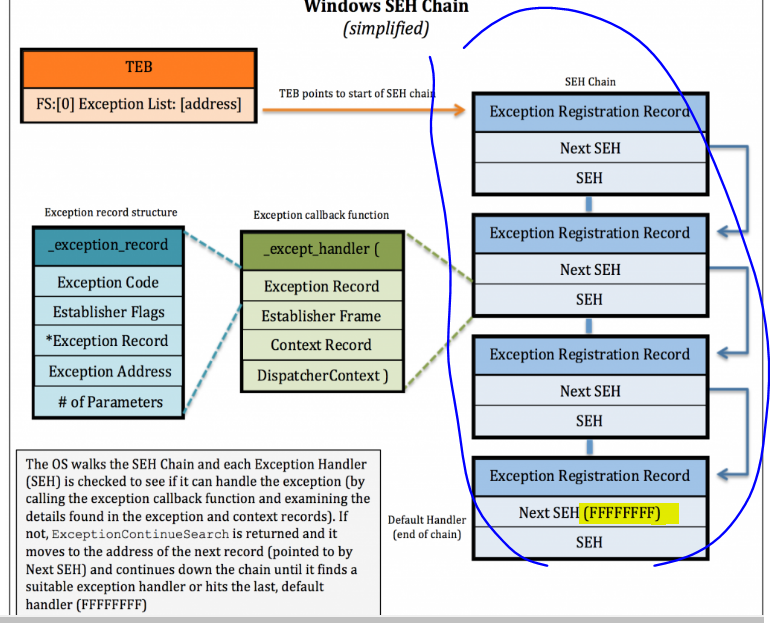

В синим облаке, мы видим простой связанный список, который находится в стеке. Каждое поле **NEXT** указывает на следующую структуру и каждое поле имеет **ОБРАБОТЧИК** или **SEH**, который указывает куда будет переходить программа. Давайте посмотрим на пример **CANARY\_SIN\_DEP.EXE**. Мы присоединимся к нему снова.

Если мы пойдем в **DEBUGGER WINDOWS → SEH LIST**, то сможем увидеть **SEH** каждой структуры в стеке. К сожалению список не показывает адрес стека где он находится, но вы можете легко создать связанный список.

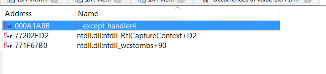

Давайте посмотрим на первую ссылку.

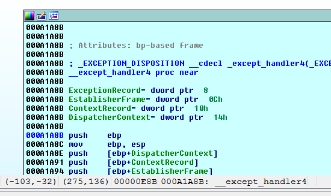

Если я нажму на клавишу **X**.

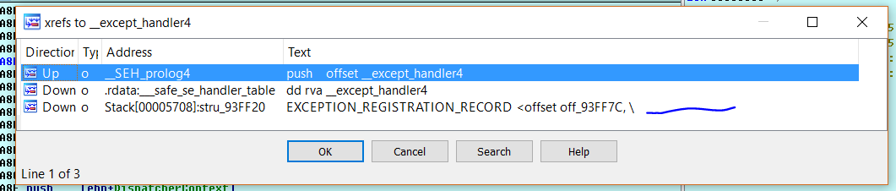

Я вижу ссылку на стек. Если **IDA** не отображает ссылку, потому что стек не является секцией кода, она может быть найдена с помощью поиска непосредственного значения, нужно искать в памяти адрес **SEH** и искать где он находится в стеке.

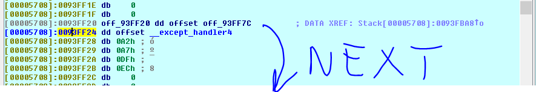

Мы видим, что поле **NEXT** указывает на следующую структуру. В моём случае она находится по адресу **0x93FF7C**. Давайте перейдем туда.

Поэтому, весь список просто связан с каждым полем **NEXT**, которое указывает на следующую структуру.

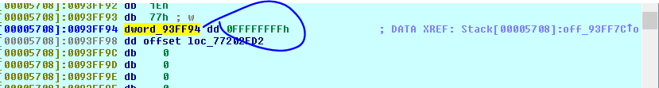

Когда поле **NEXT** равно **-1**, то это последняя структура, но **IDA** показывает мне ещё один указатель. Будет ли ещё одна структура?

Если мы вернемся к первой структуре, мы увидим, что поле **NEXT** имеет ссылку на стек.

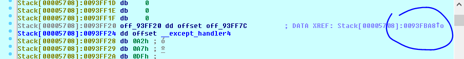

Здесь у нас есть три структуры. Поскольку я должен заполнить стек, чтобы спровоцировать исключение, когда я не могу продолжать писать, потому что секция стека уже закончилась, я буду изменять наш скрипт и запускать его, чтобы он сломал весь стек.

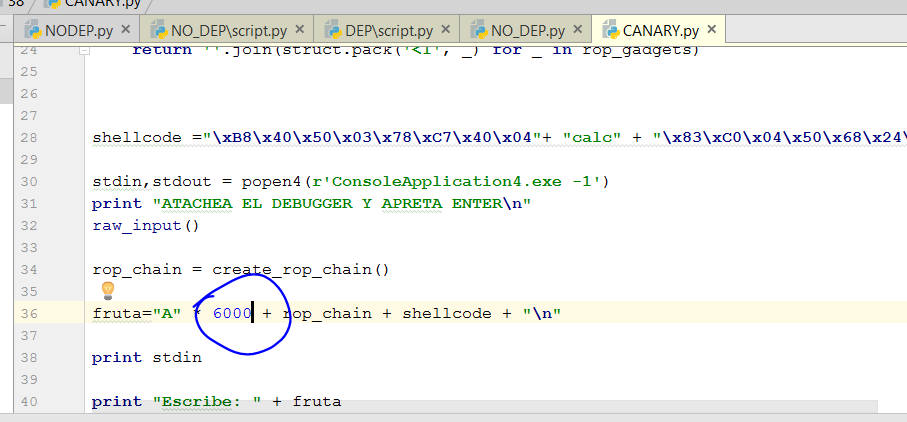

Мы снова запускам скрипт.

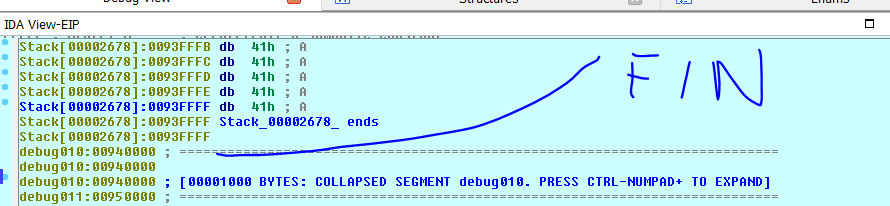

Мы видим конец стека и программа пытается писать дальше за его пределы

Программа перестает работать здесь. Регистр **ESI** указывает, в моем случае, на адрес **0x940000**, где уже нет стека.

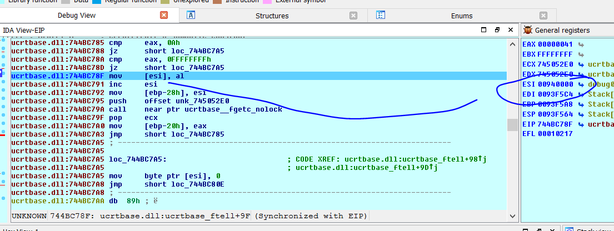

Давайте посмотрим список **SEH**.

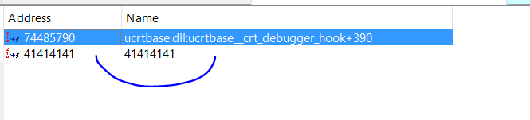

Мы видим, что программа перезаписывает **SEH**. Поэтому если я продолжу исполнение, программа может перейти по адресу **0x41414141**, но очевидно это имеет некоторые ограничения. Мы должны найти модуль для перехода у которого нет **ASLR** для того, что бы адреса не менялись. Кроме того, программа может перейти только в модуль, который имеет **SAFE SEH OFF**, что является опцией компилятора.\(так как в этом случае у нас не будет **DEP**. Мы также может перейти в область **КУЧИ**, которую мы заполнили нашими данными и с предсказуемым адресом, потому что поскольку нет **DEP**, мы могли бы запустить код прямо там, но это не тот случай. Данные поступают непосредственно в стек и вы не можите напрямую перейти из **SEH** в стек\)

Если мы посмотрим список модулей в **IDASPLOITER**.

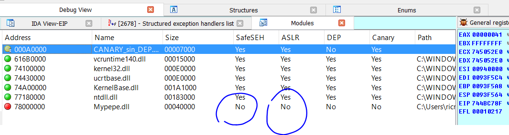

Хорошо. Здесь есть модуль без **ASLR** и **SAFE SEH OFF**. Это модуль **MYPEPE**. Поэтому нам придется перейти в него.

Давайте найдем позицию **SEH** в стеке.

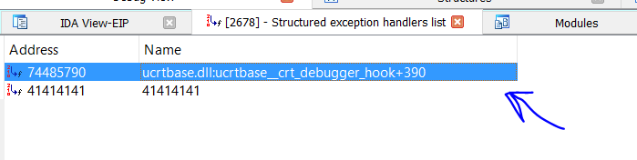

Если я нажму здесь правую кнопку и затем выберу пункт **CREATE FUNCTION**.

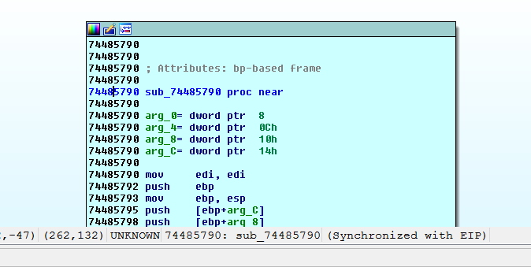

Давайте посмотрим, если ли у неё ссылки на стек.

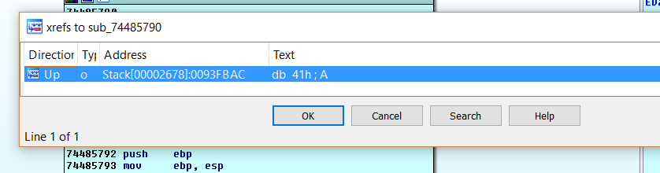

Если я не вижу ссылки, то я нахожу их через **SEARCH → INMEDIATE VALUE**

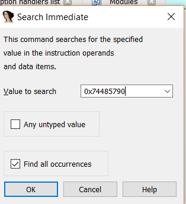

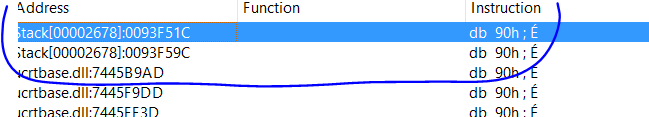

В стеке есть два места, которые используют их. Давайте посмотрим на них.

Это связано с тем, что поле **NEXT** указывает на перезаписанную структуру.

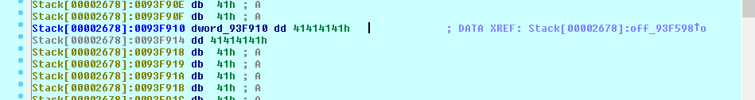

Вот она. Сейчас, мы должны рассчитать расстояние от начала буфер до этого поля **NEXT**. В моём случае это равно **0x93F90F**.

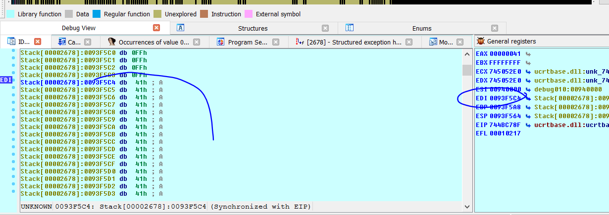

Я вижу, что регистр **EDI** указывает на начало буфера. Поэтому я пойду туда и нажму сочетание клавиш **ALT + L**.

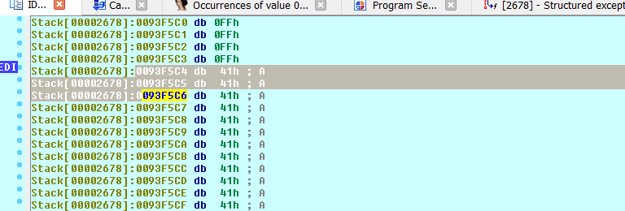

Это позволяет включить режим выделения. Если я пойду вниз с зажатой клавишей **SHIFT** программа будет делать выделение. Но поскольку нужный адрес находится очень далеко, я нажимаю клавишу **G** и ввожу конечный адрес **0x93F90F**. Если перед нажатием кнопки я продолжаю удерживать **SHIFT** центр остается выбранным.

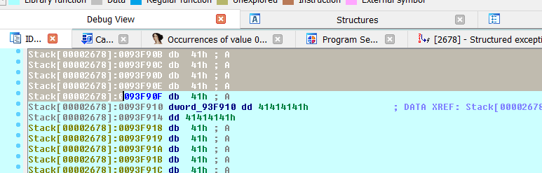

Если я пойду в меню **EDIT → ARRAY**, **IDA** скажет мне, что длина выбранной области равна **844** байт в десятичной системе.

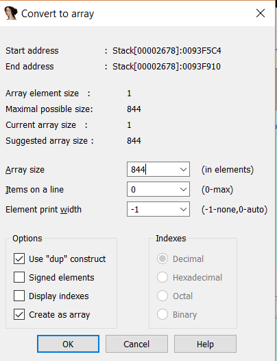

Хорошо. Поэтому, чтобы перезаписать **SEH** мы должны переслать что-то вроде этого:

>**FRUTA = 844 \* "A" + NEXT + SEH + 6000 \* "B"**

Мы видим, что так мы перезаписываем поля **NEXT** и **SEH**. Затем я должен продолжать отправку данных, чтобы полностью обрушить программу и скопировать весь стек.

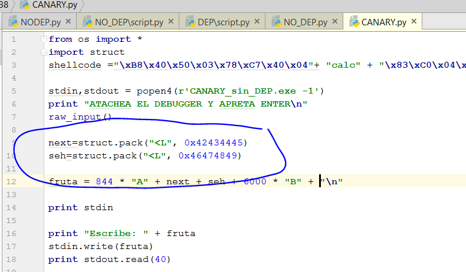

Мы посмотрим, были ли наши подсчеты верны и мы перезаписываем **SEH** с помощью адреса **0x46474849**

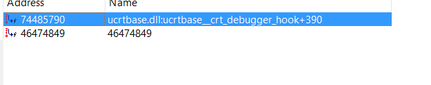

Я вижу, что программа аварийно завершает работу, потому что стек заканчивается. Сейчас **SEH** перезаписан моим значением. Это означает, что расчет был верным

Даже если я продолжу выполнение, я увижу, что регистр **EIP** по-прежнему указывает на адрес **0x46474849** как я этого хочу.

Куда сейчас мы можем перейти? Давайте посмотрим.

Адрес возврата остается в стеке по умолчанию, а затем, во втором месте этой структуры \(третья часть стека\), у нас есть **ESTABLISHERFRAME**.

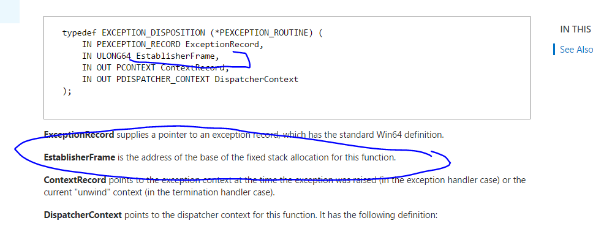

Хорошо. Этот указатель, заканчивается тем, что указывает на структуру, которая вызывает исключение, особенно в её начале, а начало это поле **NEXT**, которое мы контролируем.

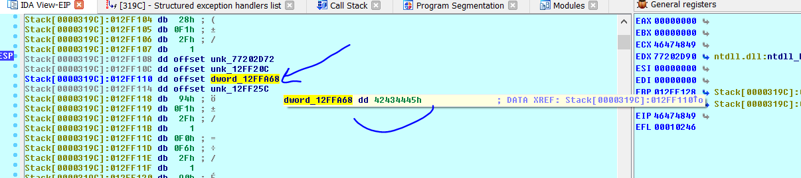

Итак, поскольку здесь нет **DEP**, то если мы перейдем на гаджет **POP R32 - POP R32 - RET** мы заканчиваем переход на наше поле **NEXT**, потому что мы выталкиваем два первых значения и мы перейдем на третье с помощью инструкции **RET**.

Давайте искать среди модуля **MYPEPE** гаджет **POP – POP - RET**. Регистры не имеют значения.

Здесь мы видим гаджет **POP – POP - RET**. Давайте поместим его в **SEH** для того, чтобы перейти туда.

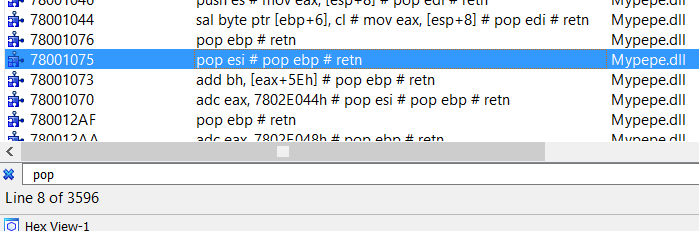

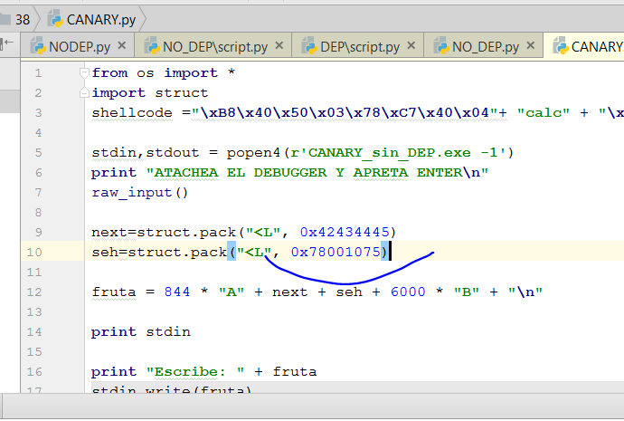

Запустите программу снова.

Здесь она перестает работать. Давайте посмотрим наш **SEH**.

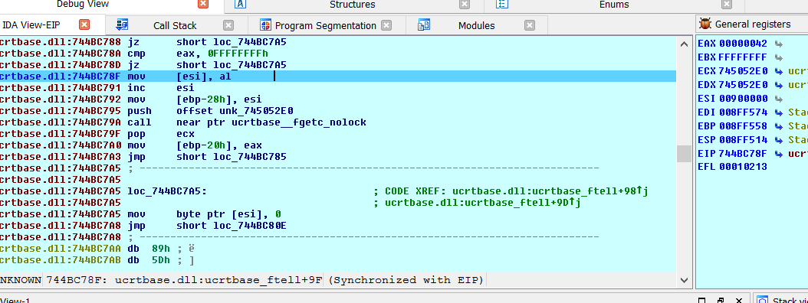

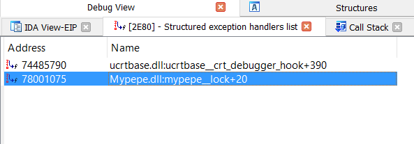

Давайте пойдем сюда и поместим здесь **BP**.

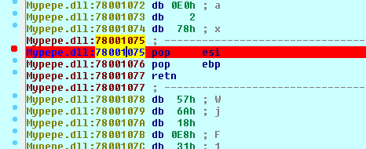

Давайте продолжим с помощью клавиши **F9** и примем исключение.

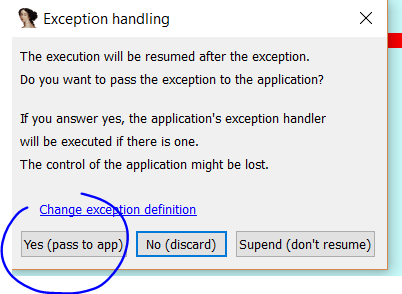

Я останавливаюсь на нашем **BP**. Сейчас, если я трассирую с помощью **F7**, я должен прийти к выполнению поля **NEXT**.

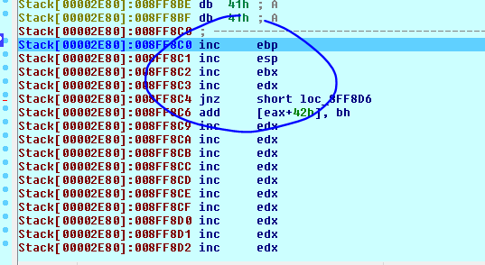

Сейчас мы находимся в поле **NEXT**. Мы не видели его, потому что он похож на код, но если мы посмотрим на него в режиме **HEX DUMP**.

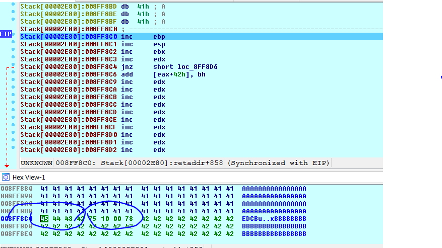

Это наш **NEXT** и **SEH**. Обычно мы делаем замену **NEXT** на байты **EB 06 90 90**, для того чтобы совершить переход выше **SEH\(пропускаем его\)** и программа не падает. Затем мы должны добавить шеллкод, в начало где находится байты **B**.

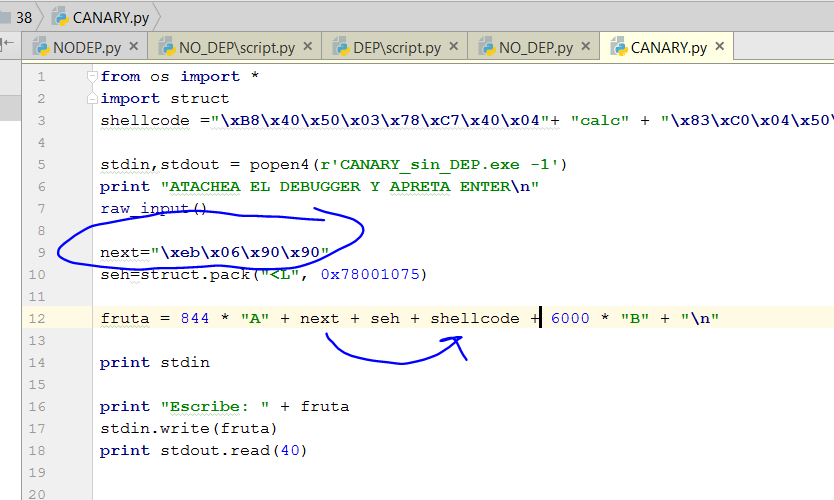

Это должно сработать. Давайте докажем это.

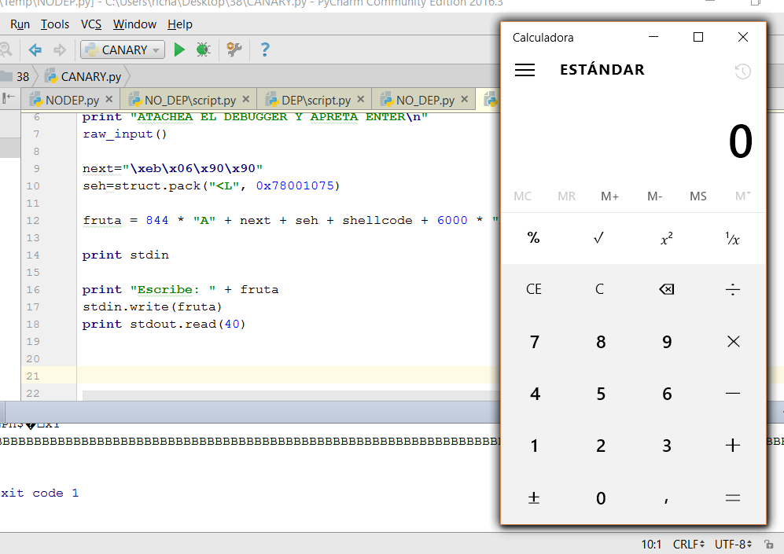

Случается так, что программа запускает множество экземпляров калькуляторов, потому что каждый раз, когда падает программа, она переходит назад к **SEH** для захвата исключения и повторно запускает калькулятор. Это можно легко устранить изменив шеллкод так, чтобы при первом его выполнении, когда он заканчивается, вызывалась функция **EXIT\(\)** и она закроет программу.

>**780039AB.FF15 20E00278 CALL DWORD PTR DS:\[<KERNEL32.EXITPROCESS>; \EXITPROCESS**

Здесь существует постоянный **CALL**, который будет закрывать программу.

Я буду добавлять байты **\x68\xAB\x39\x00\x78\xC3**

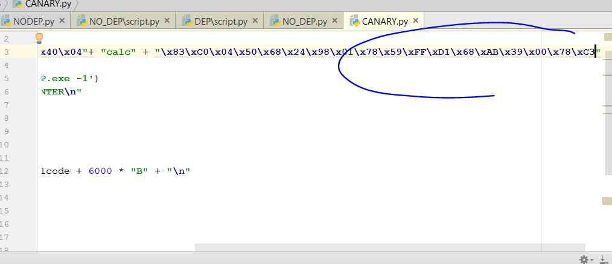

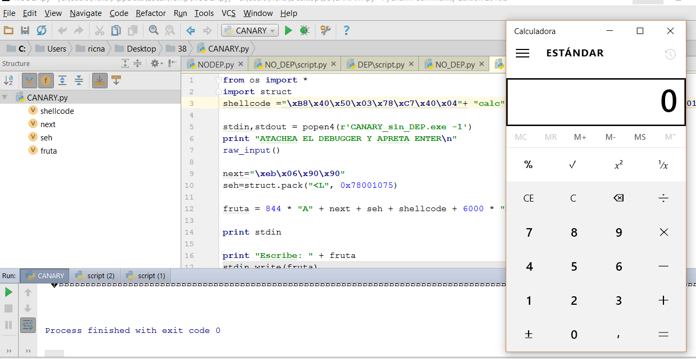

Сейчас, у нас есть только один экземпляр калькулятора. В следующей части, мы увидим как сделать **ROP**, когда вы вернемся к эксплуатации **SEH**.

Мы должны уточнить, что если у них есть модуль без **ASLR**, и **SAFE SEH OFF**, и программа не переходит в свой **SEH** при обработки исключения, может быть запущена специальная защита под названием **SEHOP**, которая по умолчанию включена в серверные версии **Windows >= 2008** по умолчанию, а также в некоторых программах, таких как современные **БРАУЗЕРЫ** или некоторые сервисы.

Это защита проверяет целостность цепочки перед переходом и проверяет, что последняя **SEH** запись является корректной и не меняется, но будучу рандомизированной, невозможно перезаписать и продолжить выполнение.

* * *

Автор оригинального текста — Рикардо Нарваха.

Перевод и адаптация на английский  язык — IvinsonCLS.

Перевод и адаптация на русский язык — Яша Яшечкин.

Перевод специально для форума системного и низкоуровневого программирования - WASM.IN

07.04.2018

[**Источник: ricardonarvaja.info**](http://ricardonarvaja.info/WEB/IDA%20DESDE%20CERO/CURSO%20DE%20IDA%20TUTES/38-INTRODUCCION%20AL%20REVERSING%20CON%20IDA%20PRO%20DESDE%20CERO.docx)
