# Часть 41

Мы продолжаем практиковать и рассматривать примеры. В нашем случае, это код, который имеет разные способы обработки и размещения строк.

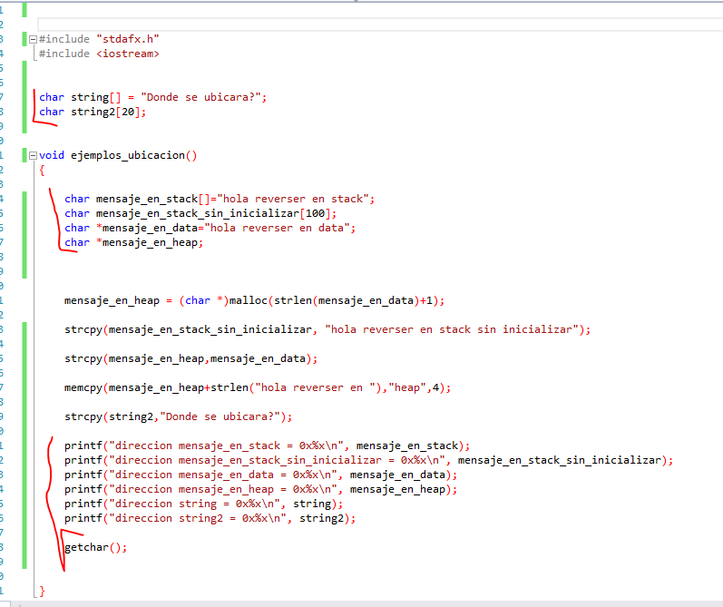

Мы видим, что существует несколько массивов символов и затем, в конце кода, программа печатает адреса каждого из массивов, чтобы увидеть где они находятся.

Здесь мы не ищем уязвимость или чего-то ещё. Мы только смотрим расположение данных.

Давайте откроем исполняемый файл в **ЗАГРУЗЧИКЕ**. Мы заставляем его загрузить символы. Теперь мы видим функцию **MAIN**.

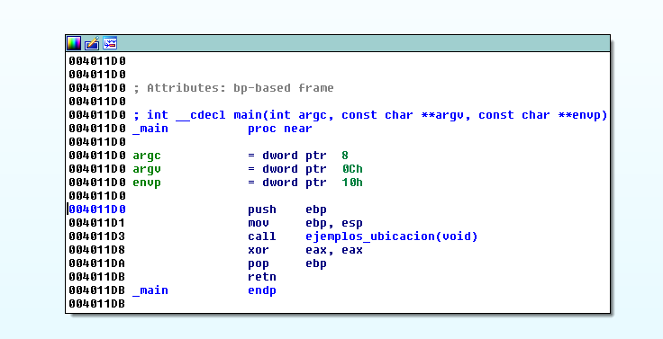

Сейчас мы находимся в функции **MAIN**. У неё просто есть вызов функции **EJEMPLOS\_UBICACION**. И ничего больше. Давайте вызовем меню **DEMANGLE NAMES –&gt; NAMES**.

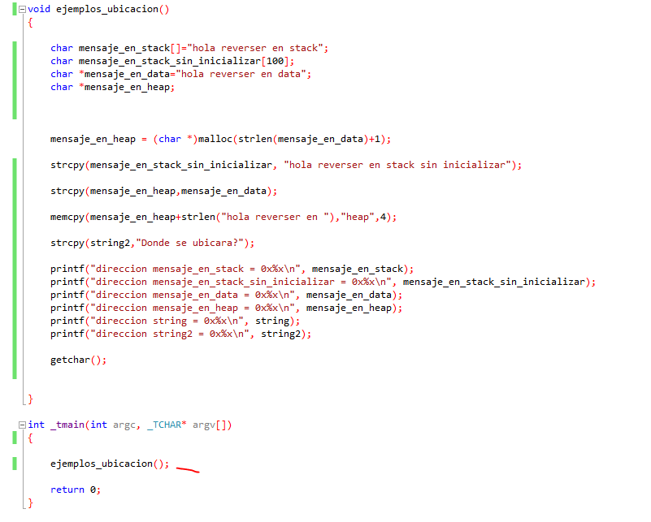

Вот этот вызов. Давайте посмотрим, что происходит внутри функции. Мы видим, что у неё нет аргументов, только переменные.

**VOID \_\_CDECL EJEMPLOS\_UBICACION\(\)**

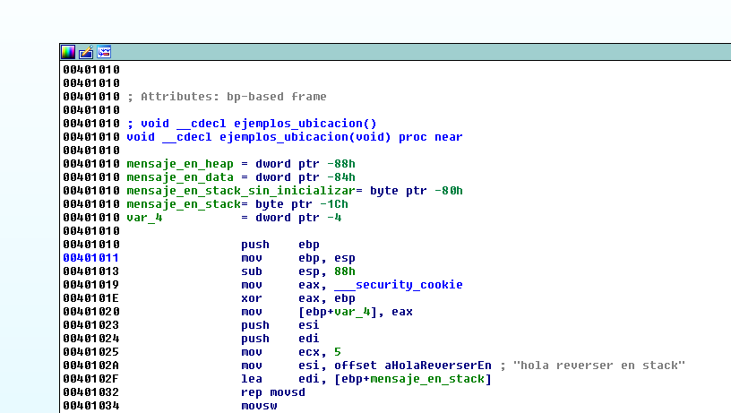

Если бы у функции были бы аргументы, они были бы в круглых скобках. Также посмотрим статическое представление стека.

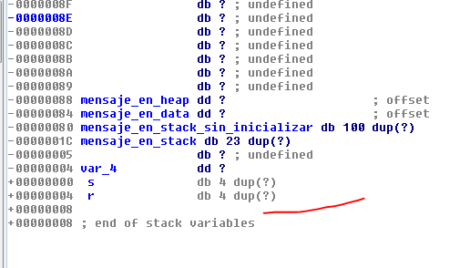

Если бы функция имела аргументы, то они должны были быть ниже адреса возврата \(**R**\). Но здесь ничего нет. Только переменные.

Здесь я вижу переменную **CANARY**, которая сохраняется в переменную **VAR\_4**.

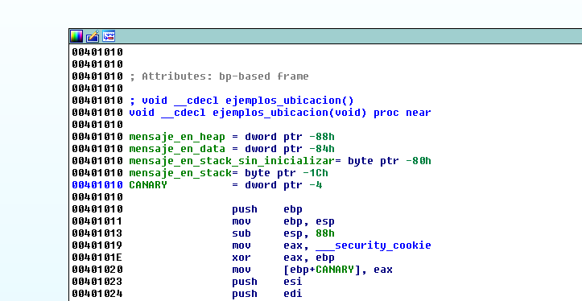

Вернемся назад к статическому представлению стека.

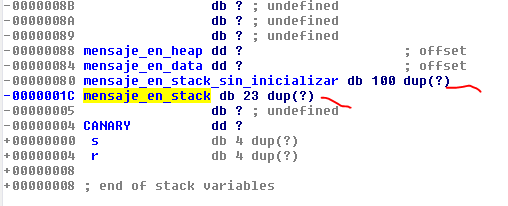

Мы видим, что переменная **MENSAJE\_EN\_STACK** так и переменная **MENSAJE\_EN\_STACK\_SIN\_INICIALIZAR**, являются буферами в стеке. Одна из них имеет размер **100** байт, а другая **23** байта.

Здесь мы видим два случая.

1. char mensaje\_en\_stack\[\]="hola reverser en stack"; \# Инициализирован
2. char mensaje\_en\_stack\_sin\_inicializar\[100\]; \# Не инициализирован

Мы видим, что во втором случае, программа резервирует **100** байт, потому что она не знает, что будет сохранено в эту переменную. Это может быть то, что вводит пользовать и не является постоянным значением. В то время как другая переменная резервирует пространство для строки **HOLA** **REVERSER** **EN** **STACK.** Переменная уже имеет фиксированную длину.

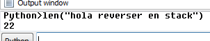

Размер строки равен **22** байта + терминирующий нуль. Всего получается **23** байта.

Здесь мы видим, когда программа копирует строку в стек и инициализирует переменную.

Сначала программа получает исходный адрес строки с помощью **СМЕЩЕНИЯ** и помещает адрес в регистр **ESI**. Затем программа помещает адрес назначения в регистр **EDI**, который имеет адрес буфера в стеке.

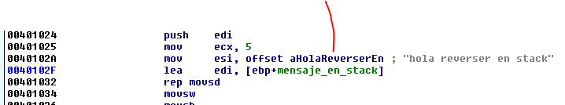

**Что такое секция rdata?**

Объявляет инициализированную секцию данных, которая доступна для чтения, но не доступна для записи. Компиляторы Microsoft используют эту секцию для размещения в ней констант.

Мы видим, что в секцию **RDATA** **VISUAL** **STUDIO** при компиляции программы сохраняет константные данные, которые не будут меняться и в нашем случае строка сохраняется там. Поскольку секция недоступна для записи, то данные не меняется. Затем программа скопирует данные в стек.

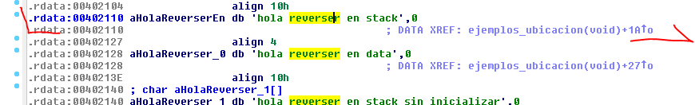

Инструкция **LEA** помещает адрес буфера в регистр **EDI** и копирует строку помощью инструкции **REPS** **MOVS**, инициализирую переменную.

В первом случае, переменная была инициализирована, в том время как во втором случае **-** нет.

Логически, во втором случае этот неинициализированный буфер существует для чего-то, и программа будет использовать его и заполнять его в какой-то момент выполнения программы.

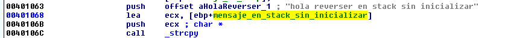

Программа будет делать это здесь. Это похоже на первый случае. Но теперь программа использует **API** **WINDOWS** для копирования строки. Она берет **СМЕЩЕНИЕ** строки из секции **RDATA** “**HOLAREVERSER** **SIN** **INICIALIZAR**” и копирует строку с помощью функции **STRCPY**.

**STRCPY\(MENSAJE\_EN\_STAQCK\_SIN\_INICIALIZAR, "HOLA** **REVERSER** **EN** **STACK** **SIN** **INICIALIZAR"\);**

Очевидно, что компилятор как в первом случае, не будет использовать **API** **WINDOWS**. Он будет использовать инструкции похожие на **REPS** **MOVS**, в то время как во втором случае это уже программный код, который может использовать **API**.

Совпадение состоит в том, что этот второй случай имеет определенную строку постоянной длины, но это может быть строка, введенная пользователем, и ее длина может измениться. Здесь нам нужно будет проверить, что строка не переполняет буфер длинной строкой.

Очевидно, что из этих двух строк мы получаем адреса строк с помощью инструкции **LEA**, и программа печатает эти адреса.

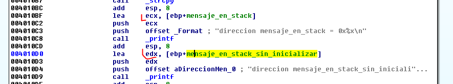

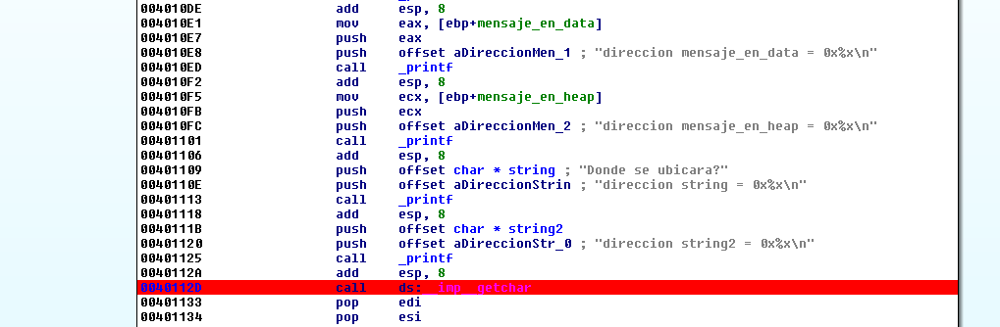

Если я помещу здесь **BP,** и выберу локальный отладчик, и запущу программу в режиме отладки.

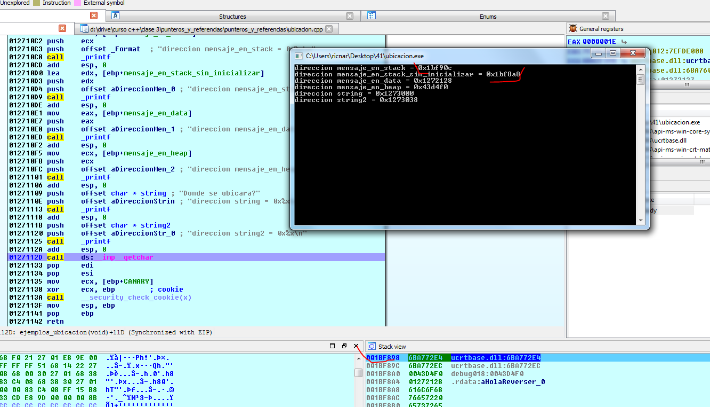

Я вижу, что адреса, которые печатает программа принадлежат стеку. Поэтому я могу пойти и посмотреть эти строки по этим адресах.

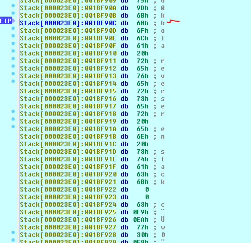

Если я нажму **A**, чтобы сконвертировать строку в **ASCII** представление**.**

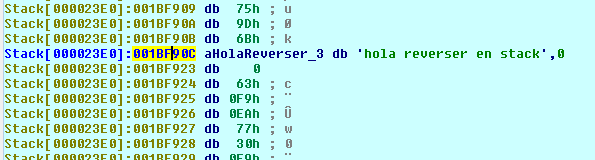

И другую.

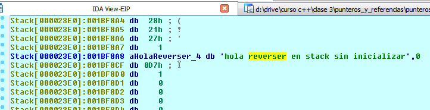

До этих пор все идёт нормально. Давайте посмотрим другие строки. Мы остановим отладчик и вернемся назад к загрузчику.

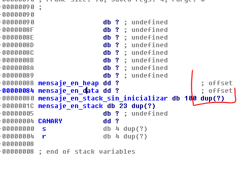

Мы видим, что две другие переменные являются указателями \(**OFFSET**\) и занимают **4** байта \(**DD**\).

Давайте сначала посмотрим на указатель **MENSAJE**\_**EN**\_**DATA**.

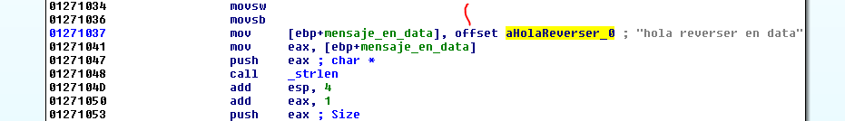

Мы видим, что в этом случае, как мы сказали ранее, переменная является указателем, которая сохраняет адрес, который получен с помощью **СМЕЩЕНИЯ** в переменную стека **MENSAJE**\_**EN**\_**DATA**.

Строка находится в секции **RDATA** и сохраняется здесь. То, что мы обрабатываем в стеке является указателем на неё, в то время как в предыдущем случае, строка была полостью скопирована в стек заполняя сам буфер.

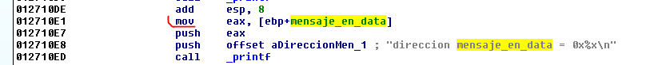

Мы видим, что сейчас нам не нужна инструкция **LEA**, чтобы найти адрес, потому что значение переменной является указателем и это адрес, которые помещается в регистр **EAX** и помещается в стек для печати этого значения. Посмотрим, будем ли мы отлаживать код как раньше?

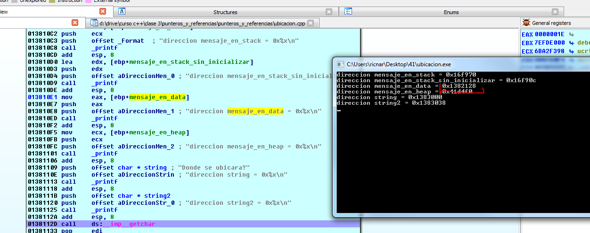

Если я пойду к этому адресу в секцию **RDATA**, строка будет находиться здесь.

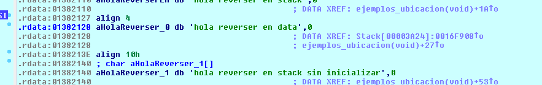

И в переменной стека этот адрес сохраняется \(**OFFSET**\).

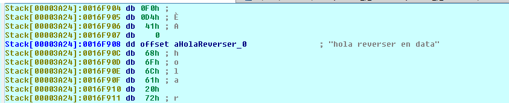

Здесь есть **СМЕЩЕНИЕ**. Если я хочу увидеть числовое значение, я нажимаю **D**.

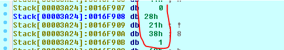

Если я нажму **D** несколько раз, когда число станет **DWORD**, **IDA** обнаружит, что оно указывает на строку и меняете его на **СМЕЩЕНИЕ**.

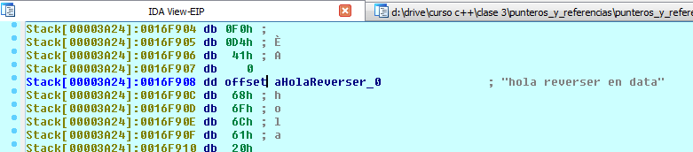

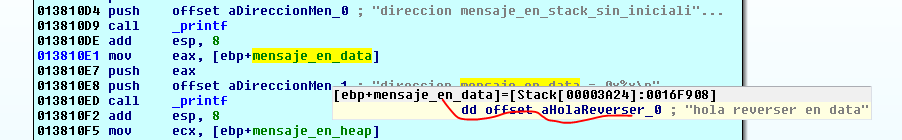

Здесь мы видим, что поместив мышь на переменную, **IDA** покажет нам, что переменная имеет сохранённый адрес строки\(**OFFSET**\), так как это переменная указатель, которая хранит адреса.

Остановим оставшуюся переменную стека и посмотрим глобальные переменные. Для тех, кто не знает, глобальные переменные расположены в исходном коде вне всех функций, обычно, в начале исходного текста.

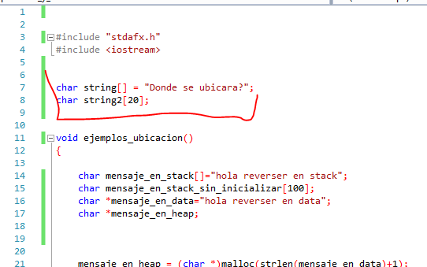

Сначала мы посмотрим **СТРОКУ1,** которая инициализируется и глобальную переменную **СТРОКУ2**.

Если я посмотрю код, я понимаю, что строка используется здесь.

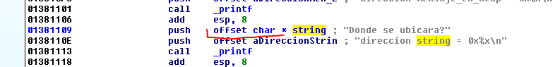

Мы видим, что в стек помещается строки. Если мы пойдем по этому адресу.

Мы видим, что-то непонятное. Сейчас мы находимся в секции данных, которая используется для глобальных переменных.

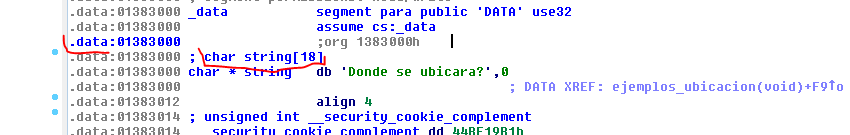

У нас есть буфер **CHAR** **STRING** \[**18**\]. **IDA** знает, что это строка такой-то длины, которая будет в этом буфере. Здесь это сохраненная строка “**DONDE** **SE** **UBICARA**”. Если мы нажмём **D**, мы увидим байты. Если мы нажмем **A**, мы вернем представление назад, как и раньше.

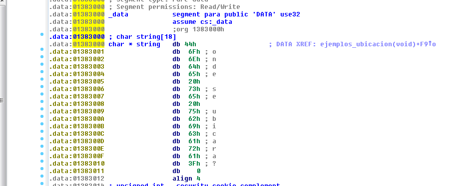

Обычно, когда есть второе определение, то это потому, что есть некоторая ссылка на некоторый **API**.

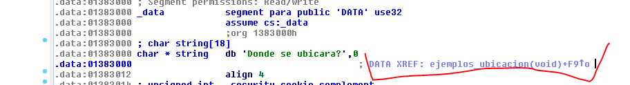

Здесь мы видим, что есть ссылка.

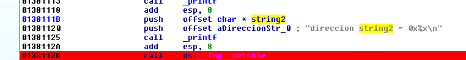

Это аргумент к функции **PRINTF**. Вторым аргументом является адрес. Если мы сделаем правый щелчок, мы увидим, что это адрес, где существует строка.

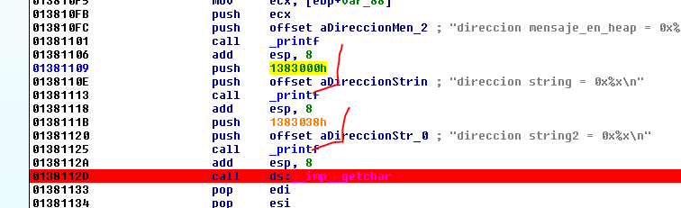

Здесь, когда мы делаем правый щелчок, то заменяем смещения на строки прямым адресом, который будет напечатан. Мы видим, что обе строки находятся в секции **DATA**.

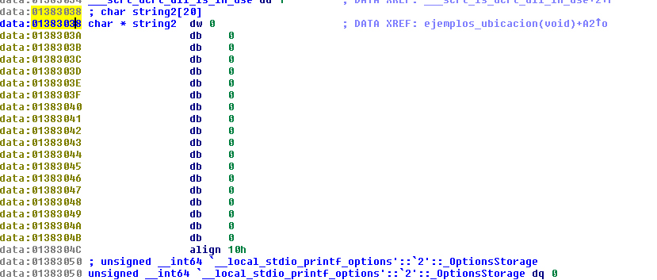

Единственное различие заключается в том, что **STRING2** не инициализируется, поэтому строку нельзя вернуть в исходное состояние, потому что она заполнен нулями, т.е. буфер пуст. Поэтому сделаем правый щелчок и выберем пункт **ARRAY**.

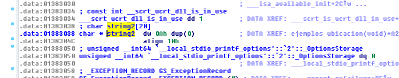

**CHAR \* STRING2 DW 0Ah DUP\(0\)**

**DUP\(0\)**

Это означает, что нуль повторяется **DW**\(**2** байта\)\* **0xA** раз, т.е. **20** десятичных байт.

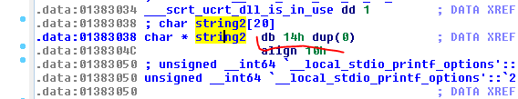

Если я изменю буфер на байтовый тип, а не двойное слово, он будет более точным. Буфер будет равен **0x14** байт или **20** десятичных байт, заполненных нулями.

Давайте посмотрим ссылки, где буфер заполняется.

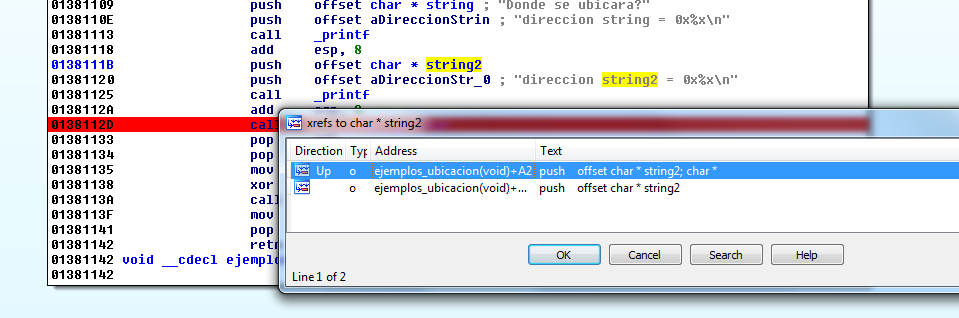

Я вернул **СМЕЩЕНИЕ**, которое передаётся как аргумент, сделав правый щелчок и выбрав **OFFSET** **\*** **CHAR** и, затем, с помощью клавиши **X** я могу увидеть ссылки. Первая ссылка, это где будет заполняться буфер.

Я вижу, что здесь программа копируют строку, которая поступает из переменной "**DONDE** **SE** **UBICARA**?" в буфер, который можно перезаписывать и можно модифицировать

Очевидно, в секции **DATA,** так как это секция доступная для записи и которая может иметь буфера, также могут быть переполнена, если длина строки плохо рассчитана, имея возможность перезаписывать глобальны переменные, которые есть и которые влияют ход исполнения на программы.

Если мы попробуем это сделать, мы увидим.

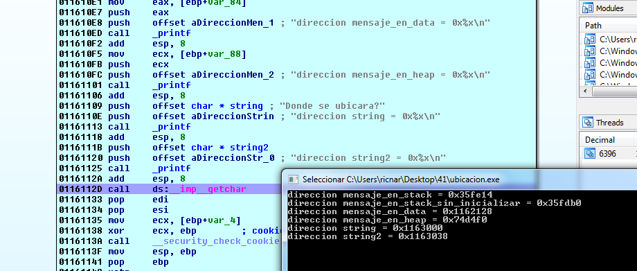

Адреса строк **STRING** и **STRING2**, принадлежат секции **DATA**.

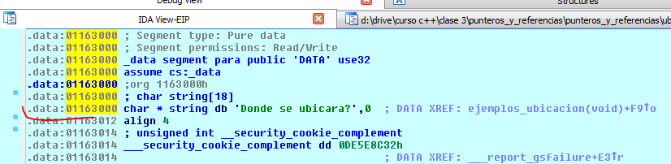

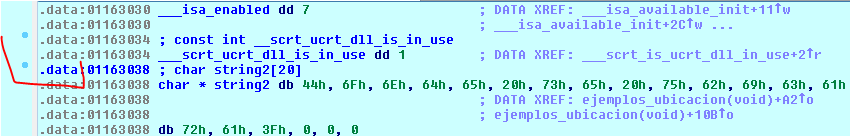

Единственное, что нам остается, это увидеть кучу. Это указатель в стеке, который хранит адрес строки, которая была размещена в куче.

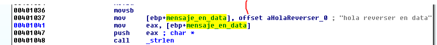

Мы видим, что здесь программа сохраняет **СМЕЩЕНИЕ**, т.е. адрес строки "**HOLA** **REVERSER** **EN** **DATA**", и затем передает адрес строки в функцию **STRLEN** для того, чтобы получить её длину

К результату добавляется число **1,** как и в исходном коде.

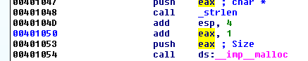

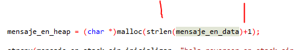

И этот размер передается как размер в функцию **MALLOC,** чтобы зарезервировать в куче буфер длиной строки + **1**.

Возвращаемый адрес будет всегда изменяться, но он будет зарезервированной областью с правом на чтение и запись, куда вы будете копировать позже строку.

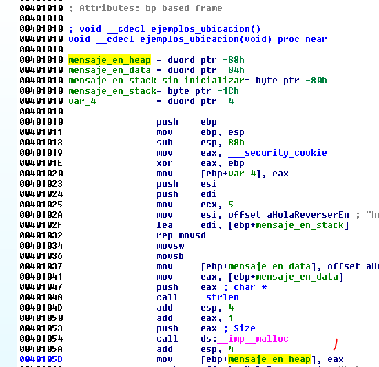

Здесь программа сохраняет адрес этой кучи, который указывает на этот буфер, в переменную указатель стека под именем **MENSAJE\_EN\_HEAP.**

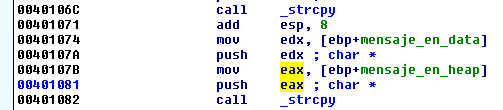

Затем программа скопирует строку **MENSAJE**\_**EN**\_**DATA** в буфер, созданный в куче.

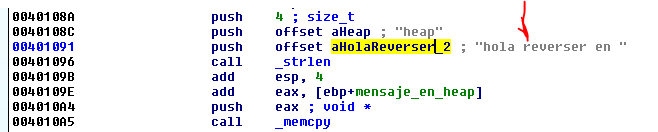

Теперь программа получает длину строки "**HOLA** **REVERSER** **EN**" и складывает с начальным адресом буфера в куче. Он просто указывает, чтобы заменить слово **DATA** на **HEAP**, так как она вызывает функцию **MEMCPY** **4** байтов передавая слово “**HEAP**” как источник и как указатель назначение на слово **DATA**, которые находятся в буфере кучи.

В исходном коде мы видим следующее

**MEMCPY\(MENSAJE\_EN\_HEAP+STRLEN\("HOLA** **REVERSER** **EN "\),"HEAP",4\);**

Назначение, это адрес сообщения в кучи + размер строки "**HOLA** **REVERSER** **EN**". Это будет указывать на слово **DATA**, которое будут перезаписано **4** байтами, являющимися источником слова **HEAP**.

Давайте отлаживаем, чтобы убедиться, что всё это правда.

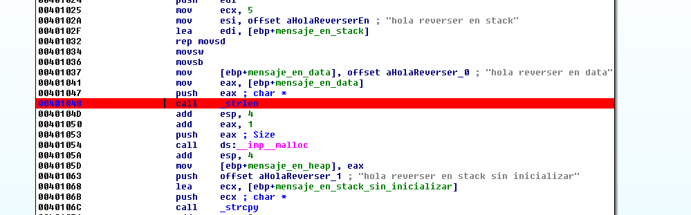

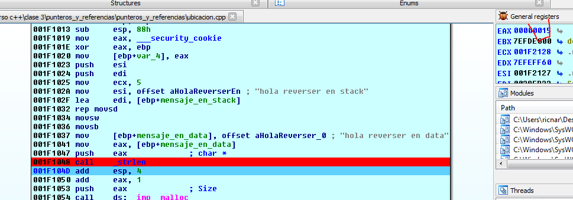

Здесь я беру размер строки "**HOLA REVERSER** **EN** **DATA**" и он равен **15** байт вместе с нулем.

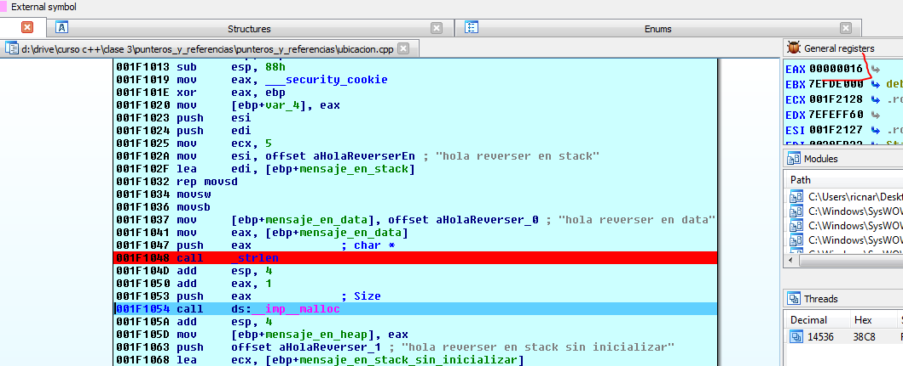

Здесь программа добавляет **1** и передает значение в функцию **MALLOC,** чтобы зарезервировать **0x16** байт.

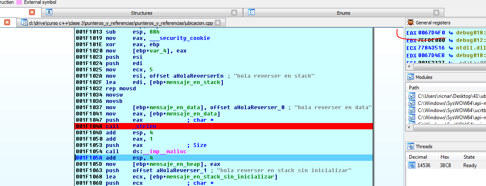

Теперь, у нас есть буфер куче. В моем случае он располагается по адресу **0x67D4F0**.

Поскольку программа находится в режиме отладки при запуске отладчика, становится очень ясно, что **0x16** байт равно **22** десятичным байтам.

Поскольку программа находится в режиме отладки \(если это не так, то ничего не сработает\)
и пока ничего не написано, мы видим байты **BAAD** **F00D**.

Существует пять **DWORDS** т.е. буфер длиной в **20** байтов + два последних байта равны **0xFEEE**. Я спрашиваю у **IDA** сколько в десятичной системе равно **0x16** байт.

Мы увидим уже больше информации о кучи. Сейчас же это буфер байтами \(**BAAD** **F00D**\).

Затем программа сохраняет адрес в переменную указателя стека.

Затем в функции **STRCPY**, программа копирует строку **HOLA** **REVERSER** в **DATA** в мои **BAAD** **F00D**.

Если я потрассирую программу с помощью **F8**.

В буфере кучи, я вижу скопированные байты. С помощью клавиши **A** я преобразую их в строку **ASCII**.

Здесь программа получает длину строки "**HOLA REVERSER EN**".

Длина строки равна **11.** Затем программа добавляет начальный адрес буфера в **КУЧИ**.

Если я разложу исходную строку в байты, то увижу.

Затем, там я нажимаю клавишу **A**.

Я вижу, что программа будет перезаписывать **4** байта слова "**DATA**" на слово "**HEAP**".

Поэтому, я могу разложить слово **HEAP** и собрать целую строку.

Хорошо. Строка в куче уже собрана. Остаётся только напечатать её адрес.

Хорошо. На сейчас это всё. Постарайтесь хорошо разобраться в этом примере, как работают и как управлять строками.

**=======================================================
Автор текста: Рикардо Нарваха** - **Ricardo** **Narvaja** \(**@ricnar456**\)
Перевод на английский: **IvinsonCLS \(@IvinsonCLS\)**
Перевод на русский с испанского+английского: **Яша\_Добрый\_Хакер\(Ростовский фанат Нарвахи\).**
Перевод специально для форума системного и низкоуровневого программирования — **WASM.IN
21.04.2018
Версия 1.0**
