# Часть 42

В 41 части, для практики было оставлено два упражнения. К сожалению, никто не прислал мне решения. Это заставляет меня задаться вопросом, стоит ли оно того, что я делаю. По крайней мере для меня это сейчас вопрос. Ни обратной связи, ни вопросов ко мне. Ничего нет.

Это заставляет меня переосмыслить вещи и спросить себя, стоит ли мне заходить с этим курсом так далеко, как я думал с самого начала. Мы увидим, какое решение мы примем в отсутствии обратная связь. Сейчас же, мы будем решать упражнение из главы **41**.

Нам необходимо обновить до новой версии плагин **KEYPATCH**, поскольку мы будем использовать его в конце.

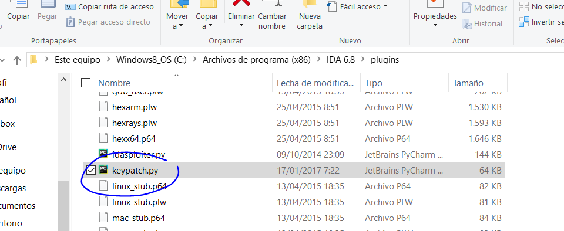
[https://github.com/keystone-engine/keypatch](https://github.com/keystone-engine/keypatch)

Я заменяю файл **.PY** новым скриптом.

[http://ricardo.crver.net/WEB/INTRODUCCION AL REVERSING CON IDA PRO DESDE CERO/EJERCICIOS/](http://ricardo.crver.net/WEB/INTRODUCCION%20AL%20REVERSING%20CON%20IDA%20PRO%20DESDE%20CERO/EJERCICIOS/)

Давайте откроем пример **41** в **IDA**.

Я буду стараться не использовать символы, так как у вас их то же нет. Поэтому мы будем это делать похожим способом.

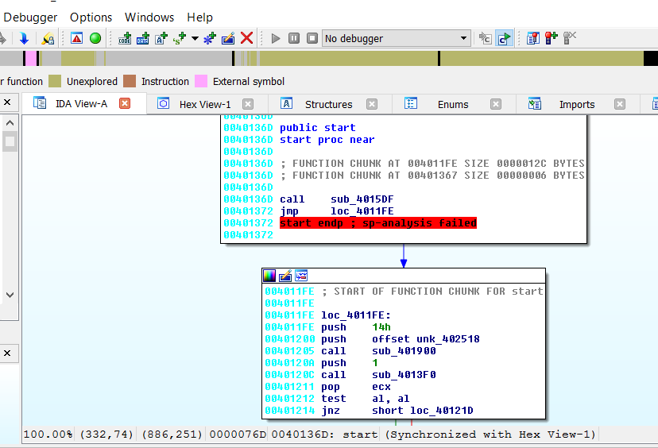

Если мы посмотрим **STRINGS WINDOWS**, мы увидим строку **MYPEPE.DLL**. Поэтому, возможно, что необходимо поместить библиотеку в ту же папку. Это та же самая **DLL** из предыдущих упражнений.

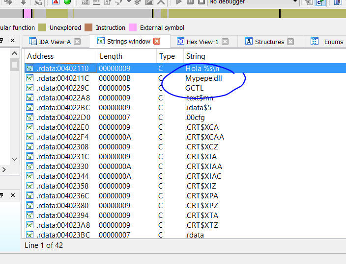

Я помещаю библиотеку в нужную папку.

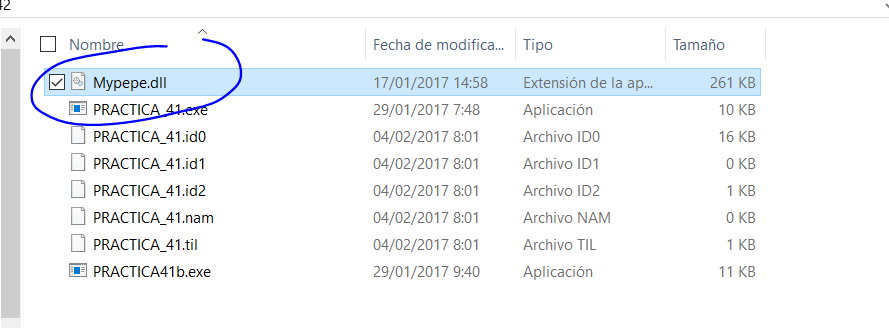

Я делаю двойной щелчок по этой строке.

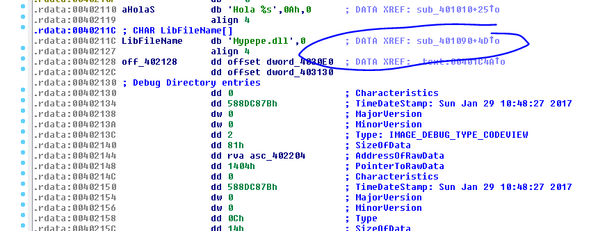

Мы видим ссылку. Мы идем в неё с помощью нажатия **X** или **CTRL + X**.

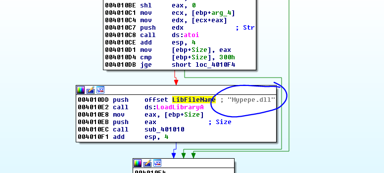

Мы видим, что программа загружает библиотеку здесь. Поэтому всё хорошо. Это похоже на функцию **MAIN**. Поскольку это консольная программа, если это так, то она должна иметь функцию в качестве ссылки, которой передаётся такие аргументы как **ARGC**, **ARGV** и т.д.

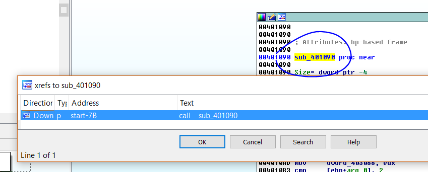

Мы видим, что в ссылке на функцию, если мы пойдем туда, то это обычный вызов в функцию **MAIN**. Вы можете увидеть аргументы консоли.

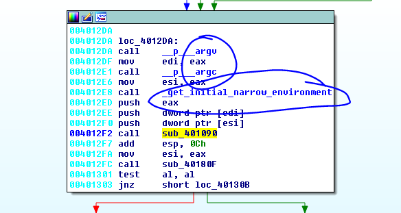

Поэтому, по адресу **401090** находится функция **MAIN**. Мы переименовываем её.

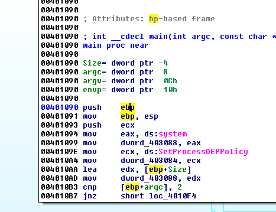

Здесь нет буфера в стеке для защиты. Вот почему программа не добавляет переменную **CANARY** несмотря на то, что программа скомпилирована с этой опцией.

Давайте начнем реверсить.

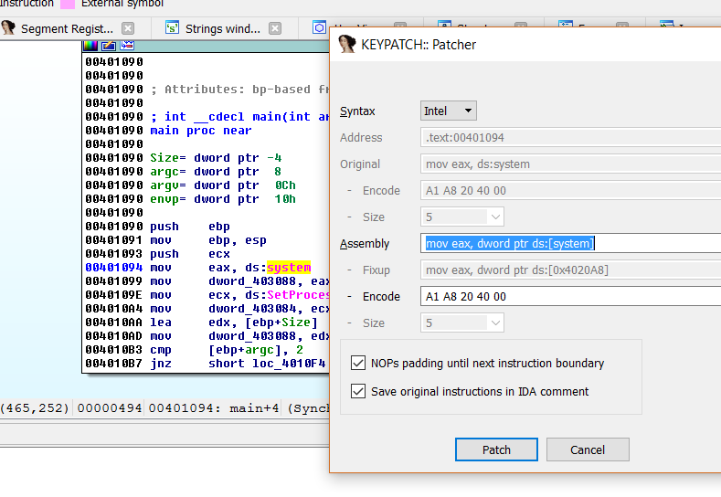

Здесь, мы видим, что программа читает запись **IAT SYSTEM**, которая находится в секции **IDATA**. Адрес указанной **API** помещается в регистр **EAX**.

Иногда, если вы испытываете некоторые сомнения в синтаксисе **IDA**, используйте **KEYPATCH**, чтобы увидеть простую альтернативу пока не привыкните к ней.

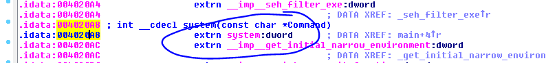

Здесь, Вы можете увидеть запись **IAT. IDA** логически говорит нам о типе **EXTRN**, потому что это внешняя **API** импортированного модуля.

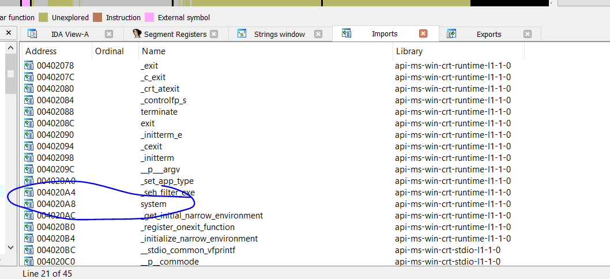

Конечно, в **IMPORTS** есть импортированные функции для модуля и адрес записи **IAT**, который показывает значение **4020A8**, поэтому у нас всё совпадает.

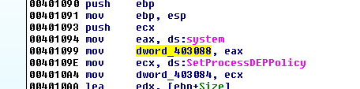

Затем программа запишет в глобальную переменную **DWORD**\_**403088**, \(которая является **DWORD\)** значение регистра **EAX**.

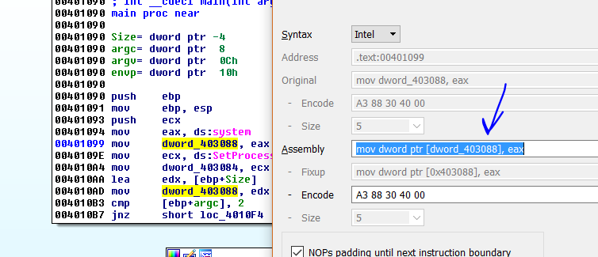

Мы помним, что в **IDA** если существует префикс типа данных перед адресом, это означает, что содержимое этого адреса имеет тот же тип. В этом случае это **DWORD**. По крайней мере это **4** байта. Также программа записывает адрес **API** здесь.

Поэтому мы переименовываем глобальную переменную в **P**\_**SYSTEM**.

Мы знаем, что это переменная длиной **4** байта и так как она сохраняет адрес, то она должна быть типа указатель. Я изменяю её тип.


Поскольку я знаю, что это указатель на **API**, то могу легко сделать его указателем на что-то неизвестное.

```assembly
VOID * P_SYSTEM
```

В любом случае, нет необходимости иметь слишком точные определения, потому что они лишние. Важно просто то, что это указатель на что-то.

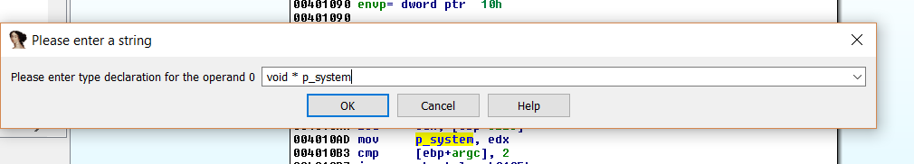

Поэтому, в конечном итоге, это будет переменная типа указатель, которая сохраняет системный **API** адрес.

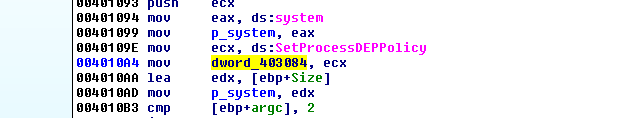

Существует другая переменная того же типа, которая хранит адрес **API SETPROCESSDEPPOLICY**. Я делаю то же самое.

Я изменяю тип также в декомпиляторе **HEXRAYS** с помощью **F5**. Изменение типа ни на что не влияет.

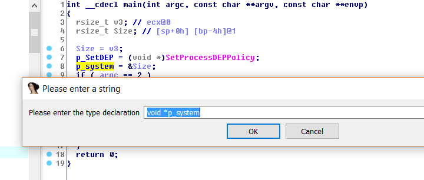

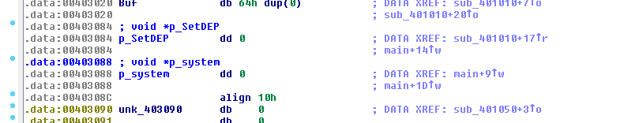

Это не имеет большого значение. Это просто нужно, чтобы показать Вам больше вариантов.


Мы видим, что глобальная переменная **P\_SYSTEM** используется повторно и сохраняет указатель \(используется инструкция **LEA** для поиска адреса\) на переменную **SIZE**, которая является **DWORD**. Очевидно, it will cast it to do it **C++**\(**??? Опять куча itов. Не понял как тут правильно будет**\), но здесь это не имеет значения. Они обе являются указателями.

Обычно, когда переменная используется повторно, я помещаю горизонтальные полосочки, так как я не могу поставить диагональные и затем помещаю второе имя.

Что-то вроде этого:

>**P\_SYSTEM\_\_\_\_\_P\_SIZE**

В сложных функциях они много раз повторяется и мы должны следовать этому.

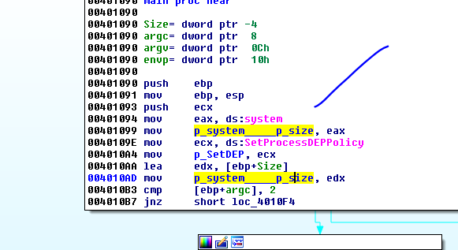

Затем программа сравнивает переменную **ARGC**, которая представляет собой число аргументов с числом **2**. Таким образом это имя исполняемого файла + аргумент, т.е. всего два аргумента. Если нет двух аргументов, программа пропускает всё и выходит из функции напрямую.

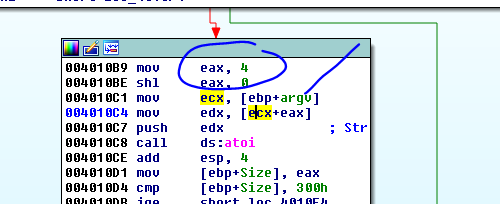

Мы видим, что **ARGV** это массив и что в позиции **0** он хранит строку имени исполняемого файла и если мы добавим в нему **4**, то программа получит адрес строки первого аргумента.

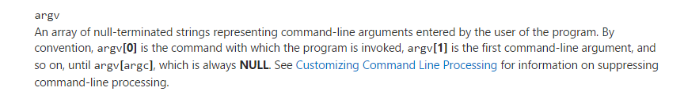

Затем программа передает эту строку в функцию **ATOI**, чтобы попытаться преобразовать строку в целое число. Если у функции это не получается, программа выдаёт ошибку.

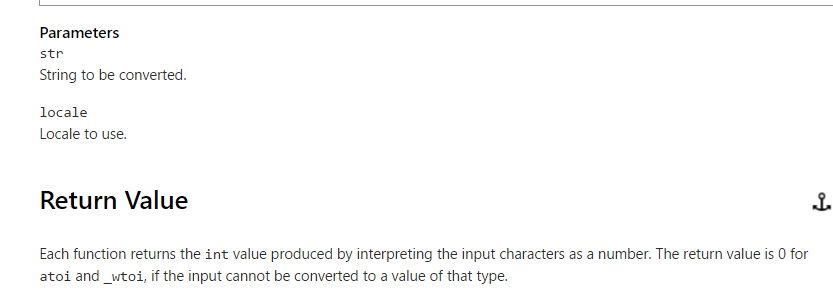

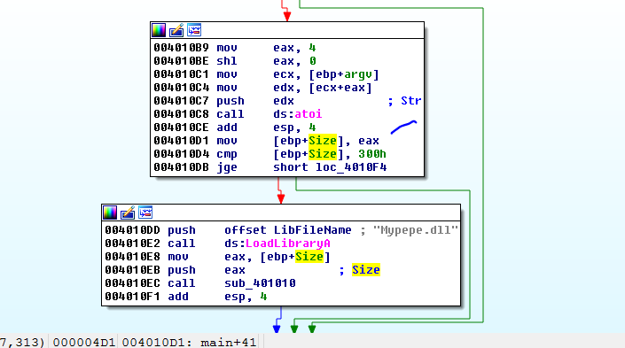

После возврата из функции **ATOI** это значение сохраняется в переменную **SIZE**, которая находится в стеке.

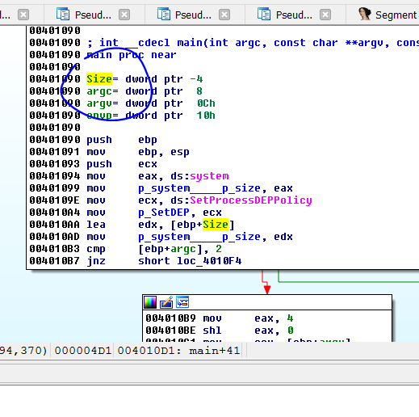

Не путайте её с глобальной переменной **P\_SYSTEM\_\_\_\_\_P\_SIZE**, которая имеет сохраненный **АДРЕС** этой же переменной **SIZE**.

Программа сравнивает это значение размера, которое пришло из **ARGV** со значением **0x300** и если оно больше, программа переходит и возвращается в функцию **MAIN**. Конечно, этот **SIZE** является знаковым, потому что сравнение с использованием инструкции **JLE** говорит нам об этом.

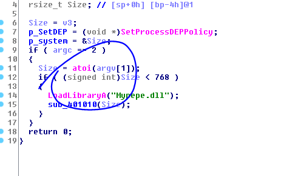

Поскольку переменная является знаковой, когда мы передаем ей отрицательное значение, она будет меньше **0x300**. Например, если я передам ей значение **-1**, это значение будет меньше **0x300**, потому что рассматривается знак и переменная пройдет сравнение.

Очевидно, если эта переменная **SIZE** используется как размер в **API** функции, которая принимает переменную как беззнаковую, то в программе может случиться переполнение, потому что для этой **API** функции значение не будет отрицательным, но без знака. Например, если значение равно **-1**, для **API**, которая принимает это значение как положительное, максимальным положительным будет значение **0xFFFFFFFF**. Т.е. **-1** равно **0xFFFFFFFF**.

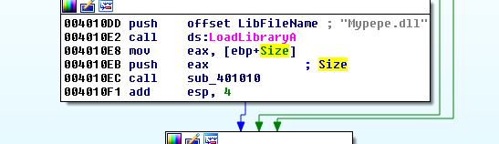

Мы видим функцию, ей аргументом является переменная **SIZE**. Мы ещё не переименовывали её. Давайте посмотрим что она делать. Пойдем туда и посмотрим.

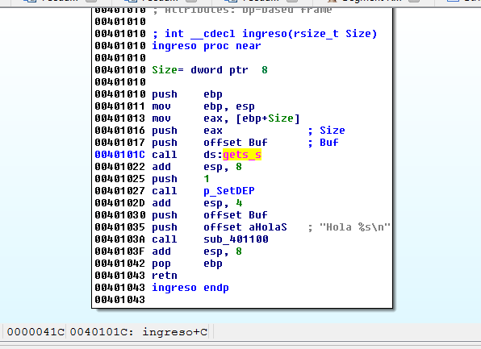

Мы видим, что есть здесь есть функция **GETS\_S** для ввода данных. Поэтому я даю функции имя **INGRESO**.

Эта функция **GETS\_S** имеет переменную **SIZE**, которая принимается как беззнаковая и может вызвать переполнение буфера.

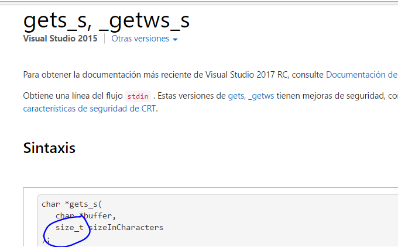

Здесь мы видим, что тип переменной **SIZEINCHARACTERS** является типом **SIZE\_T**.


И этот **SIZE\_T** является беззнаковым. Поэтому я уверен, что мы можем переполнить буфер. Давайте посмотрим насколько он большой. Хотя мы уже видели, что я сделал его плохим, но программы пытается фильтровать **SIZE** больше чем **0x300** байт. Поэтому очень вероятно, что размер буфера таков.

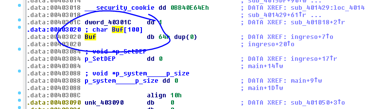

Мы видим, что буфер находится в секции **DATA** и **IDA** говорит мне, что его размер равен **0x64** байт. Чуть ниже буфера мы видим глобальные переменные **P**\_**SETDEP** и **P\_SYSTEM**\_\_\_\_**P**\_**SIZE**. Поэтому здесь нет ошибки. Максимальная проверка позволяет нам переполнить даже этот **0x64** байтный буфер \(**100** десятичных байт\), без требования быть отрицательным. Только с размером больше чем **0x64** байта.

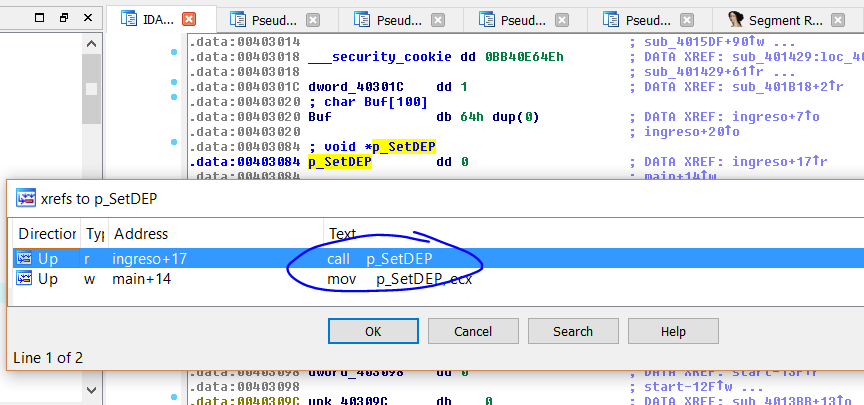

Как только я запишу больше чем **0x64** байта, я буду продолжать двигаться вниз и смогу перезаписать сохраненные указатели в секции **DATA**.

Сейчас, после того как Вы перезапишите указатели, будет ли программа использовать эти указатели?

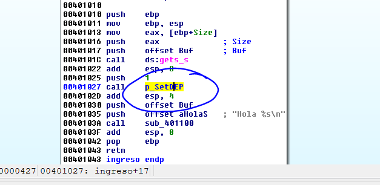

Я вижу в ссылках на **P**\_**SETDEP**, что есть вызов с использованием этого указателя на функцию и что, если я перезаписываю его с помощью переполнения, он может отклонить выполнение программы.


Это происходит сразу после функции **GETS**\_**S**. Это прекрасно. Давайте сделаем скрипт.

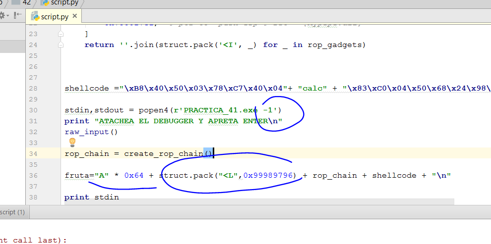

Я изменяю скрипт, который был достаточно похожий и устанавливаю размер равным **-1**. Он будет проходить проверку. Я помещаю **0x64** байта символов **A** чтобы заполнить буфер, и затем я помещаю значение **0x99989796**, которое предположительно должно перезаписать указатель, который находится чуть ниже.

Поскольку **ROP** для библиотеки **MYPEPE.DLL** уже создан, я оставляю его. Я увижу, как я расположу **ROP**. Сейчас я запускаю скрипт и присоединяю **IDA** к процессу, помещаю **BP** сразу после функции **GETS**\_**S**, для того, чтобы остановится там.

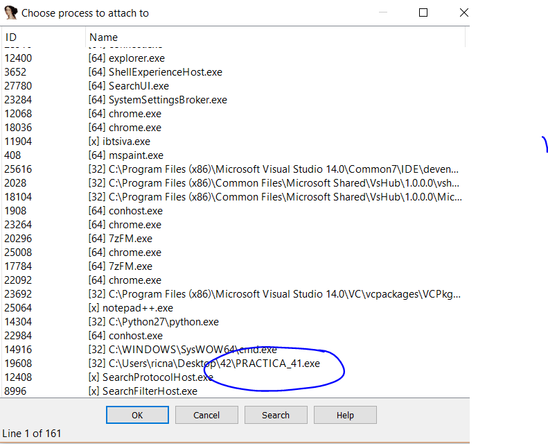

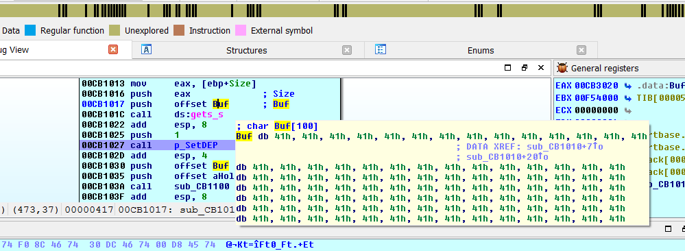


Мы видим, что буфер выглядит почти полным. Давайте пойдем туда, чтобы увидеть его.

Если я нажму **U** для **UNDEFINE**, мы увидим много символов **A**. Давайте посмотрим перезаписался ли указатель.

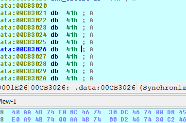

Мы должны увидеть, перезаписали ли мы указатель.

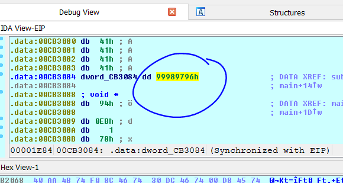

Я нажимаю **D** до тех пор пока не получу **DWORD** и вижу что это всё хорошо перезаписалось. Установлено значение, которое я хотел.

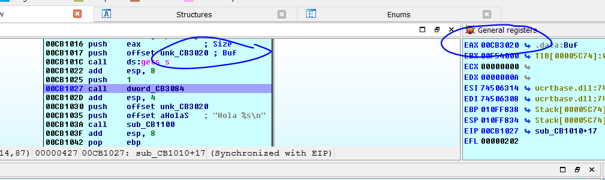

Я вижу, что у процесса нет **DEP**, потому что мы перезаписали правильный **API SETPROCESSDEPPOLICY**, которая собиралась включить его. Поэтому здесь нам не понадобится **ROP**.


Регистр **EAX** указывает на буфер, который заполнен **A**. Поэтому если я смогу перейти туда и разместить шеллкод в начале буфера и выполнить его.

Я мог бы искать вызов **CALL EAX** в библиотеке **MYPEPE**, который не содержит защиту **ASLR**. Я использую новый **KEYPATCH** с опцией **SEARCH** и ввожу инструкцию **CALL EAX**.

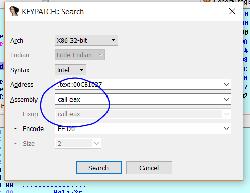

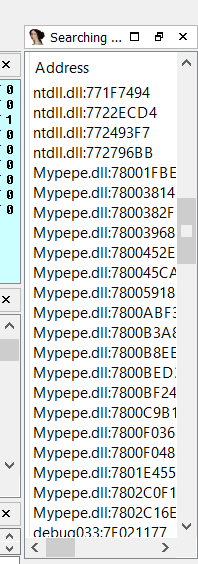

Мы видим в результатах, что есть несколько, которые принадлежат библиотеке **MYPEPE**. Я выбираю некоторые для примера.

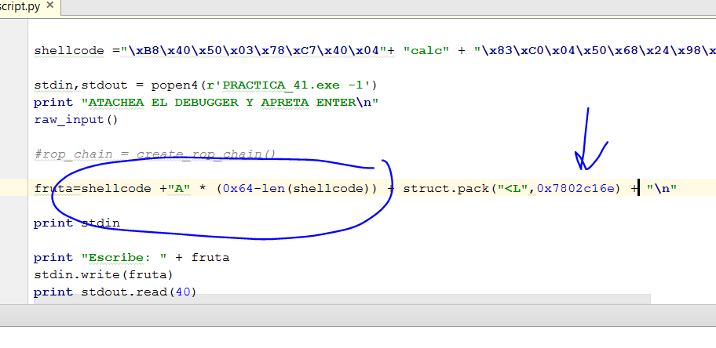

Когда я иду туда, я нажимаю **C** для преобразования его в код, потому что я его не дизассемблировал.

По адресу **0x7802C16E** будет инструкция **CALL EAX**, которую я выбрал. Я добавляю этот адрес в скрипт.


Я помещаю шеллкод вперед, потому что он переходит в начало буфера и не меняет длину перед указателем. Оставшаяся часть шеллкода вычитается из общего количества букв **A**. Мне больше не понадобится **ROP**. Поэтому я удаляю его.

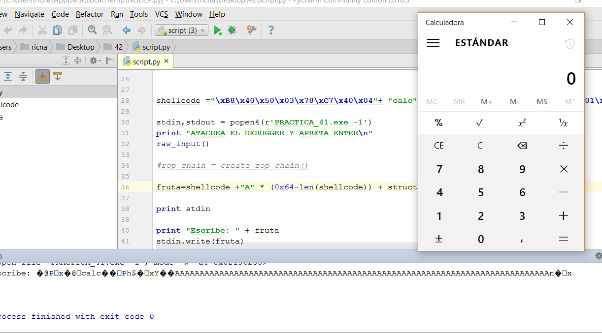

Наша курочка готова. Шеллкод запускает калькулятор. Я надеюсь, что кто-то сделает меня счастливым, решив задачку **41B** или, по крайней мере, просто попробует её на вкус.

`\#8eqw0uExIPQMo0hlG2SMbg.kWxA60qd204.wQ0f6qnVEDF3sTM4kUnjA82Jgnlue8Wsgi0LIXEGPRLM89DcLVaUVNH29WUFmLizrcwP9OtNDlc4wPiQ6DtpTgbIFIhKqOATEW8MBxHDk2Uvz/8H8BgX5L2XHkS/zfDWlnPEVsMXsg`

* * *

Автор оригинального текста — Рикардо Нарваха.

Перевод и адаптация на английский  язык — IvinsonCLS.

Перевод и адаптация на русский язык — Яша Яшечкин.

Перевод специально для форума системного и низкоуровневого программирования - WASM.IN

22.04.2018

Источник:

[**http://ricardonarvaja.info/WEB/INTRODUCCION%20AL%20REVERSING%20CON%20IDA%20PRO%20DESDE%20CERO/42-INTRODUCCION%20AL%20REVERSING%20CON%20IDA%20PRO%20DESDE%20CERO%20PARTE%2042.7z**](http://ricardonarvaja.info/WEB/INTRODUCCION%20AL%20REVERSING%20CON%20IDA%20PRO%20DESDE%20CERO/42-INTRODUCCION%20AL%20REVERSING%20CON%20IDA%20PRO%20DESDE%20CERO%20PARTE%2042.7z)
