# Часть 43

Давайте решать практическое упражнение **41B**.

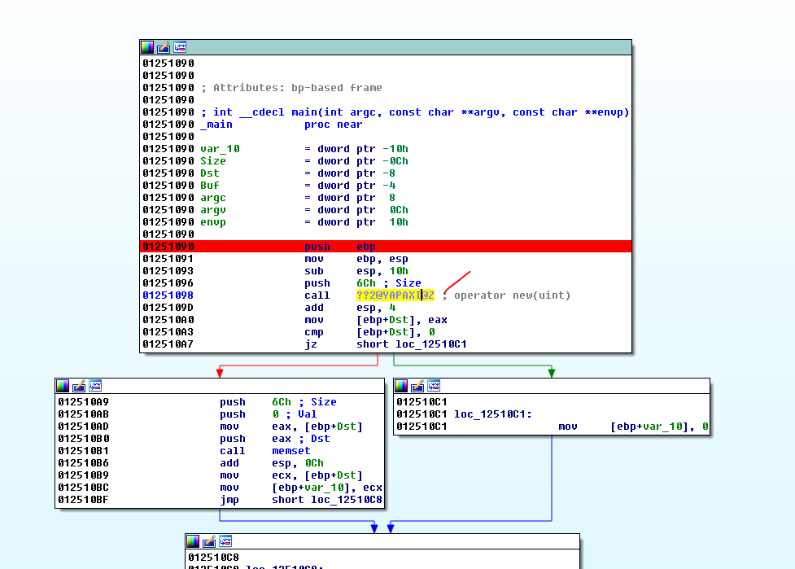

Если мы перейдем в меню **DEMANGLED** **NAMES → NAMES**, мы увидим, что анализ выглядит лучше.

Даже если **IDA** не показывает функцию с именем **NEW,** а показывает числовой адрес, оператор **NEW** очень похож на функцию **MALLOC**. В исходном коде, очевидно, оператор **NEW** применяется к объекту и программа внутренне вызывает функцию **MALLOC**, резервирую память для объекта и функции **MALLOC** непосредственно передается числовой размер, но здесь, нет большой разницы. \(В этом случае, используя оператор **NEW** для экземпляров классов, вы можете вызвать конструктор класса после выделения памяти. Это не делается с помощью функции **MALLOC**, но здесь это не так\)

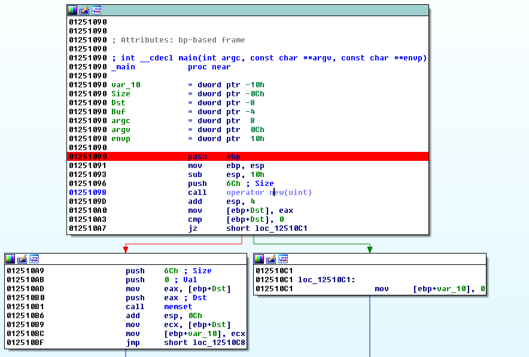

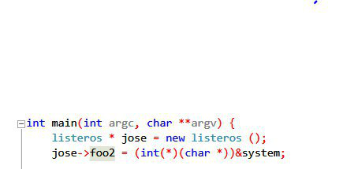

В исходном коде, программа вызывает оператор **NEW**, создавая объект типа **LISTREROS**, который здесь не рассматривается, но дело в том, что этот тип **LISTREROS** имеет размер и это то, что на низком уровне заканчивается вызовом функции **MALLOC** для резервирования в памяти. По крайней мере, в этом случае нет большой разницы.

Даже не зная, что вышеупомянутая функция является оператором **NEW**, потому что **IDA** говорит мне, я вижу, что **РАЗМЕР** передается в функцию **MALLOC** и резервирует это количество памяти и возвращает адрес зарезервированной памяти в регистре **EAX**, потому что, если функция сможет зарезервировать этот **РАЗМЕР** она вернет ненулевое значение, и программа будет исполняться по пути красной стрелке к инструкции **RETN**.

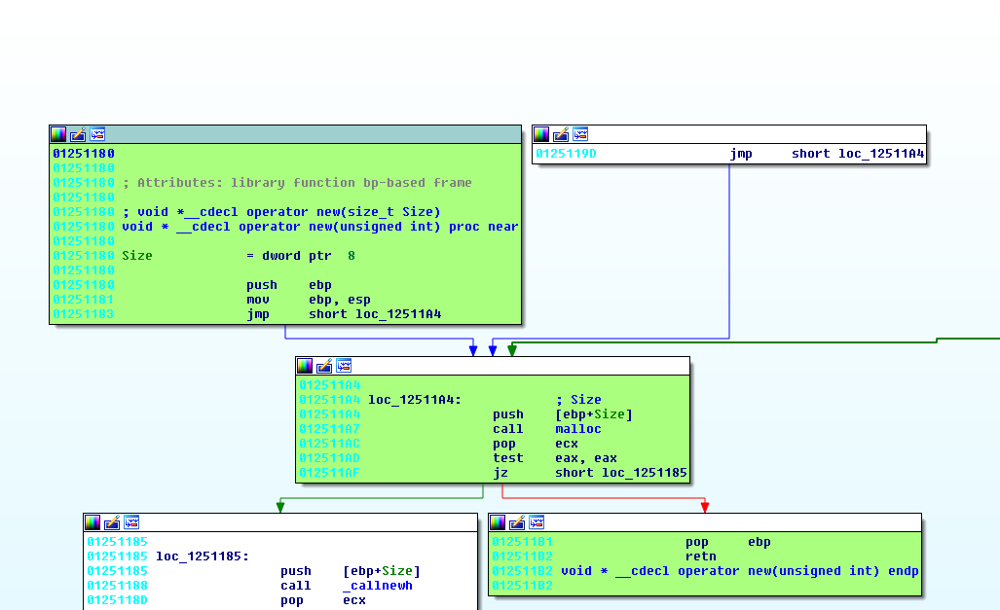

Поэтому, в нормальных условиях, даже если я не знаю, что это оператор **NEW,** если я переименую эту функцию в \_**MALLOC**, потому что она заканчивается вызовом функции **MALLOC**, не было бы большой проблем. Если бы **IDA** не придупредила меня, это была бы функция **MALLOC** с аргументом **0x6C**, что является размером объекта, или если я этого не знаю, это **РАЗМЕР,** который нужно выделить.

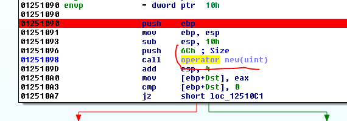

Адрес выделенной области хранится в переменной **DST**. Поэтому я могу переименовать эту переменную в **P**\_**DST**\_**HEAP**, так как переменная указывает на выделенную область памяти, которая находится в кучи. Поскольку функция **MALLOC** резервирует область в **КУЧИ**, то возвращает адрес в ней.

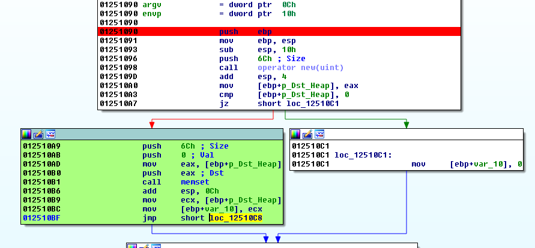

Если функция возвращает ненулевое значение, т.е. если выделение корректно, программа переходит к зеленому блоку, где она передает этот адрес и исполняет функцию **MEMSET** для заполнения всего этого буфера в куче нулями, чтобы очистить его от предыдущего содержимого.

Это видно здесь.

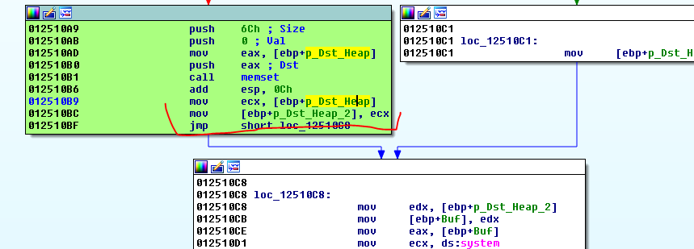

Программа скопирует тот же указатель в другую переменную. Поэтому я переименовал вторую переменную в **P\_DST\_HEAD\_2**, так как я не могу использовать две разные переменные с одним и тем же именем.

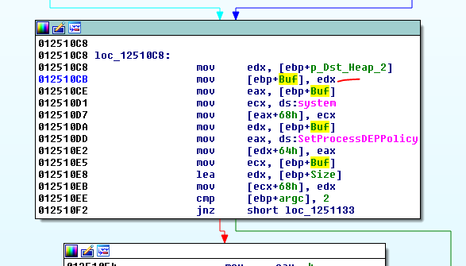

Здесь мы уже начинаем подозревать, что оператор **NEW** был сделан для выделения объекта типа структура. Тот же указатель сохраняется в переменную **BUF**. Затем программа помещает переменную **BUF** в регистр **EAX** и затем, в позицию **68** зарезервированной области, программа записывает адрес **SYSTEM**, а в позицию **0x64** программа записывает адрес функции **SETPROCESSDEPPOLICY**. Таким образом, мы могли бы думать, что, поскольку у структуры разные типы данных внутри, это будет структура размером **0x6C** байтов, где по смещению **0x64** хранится указатель, а по смещению **0x68**другой указатель. Теперь мы можем объединить их вместе.

struct \_listeros
{
char Buf\[0x64\];
void \* puntero1;
void \* puntero2;
};

Давайте посмотрим, сработает ли это. Эта структура будет иметь внутренний буфер из **0x64** байт и два поля типа указатель, т.е. ещё **8** байт. Если всё в порядке, длина структуры будет **0x6C** байт. Давайте посмотрим. Перейдем в **LOCAL** **TYPES** и добавим её.

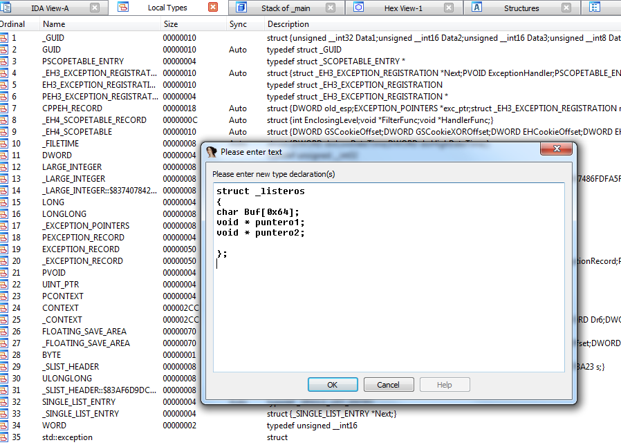

В **LOCAL** **TYPES** я делаю правый щелчок, выбираю пункт **INSERT** и добавляю структуру. Затем, я делаю правый щелчок и выбираю пункт **SYNCRONIZE** **TO** **IDB**.

Здесь регистр **EAX** и чуть ниже регистр **EDX** указывают на начало структуры. Если в каждом поле, я нажимаю **T** и выбираю тип **LISTREROS**.

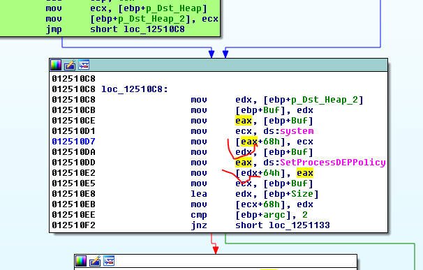

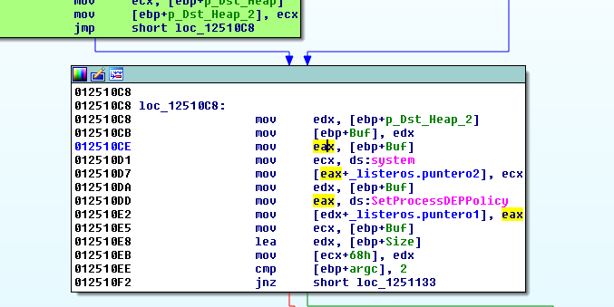

Это будет похоже на это. Я мог бы использовать более описательные имена для полей. Когда мы создадим структуру в **LOCAL** **TYPES** мы должны отредактировать там имена.

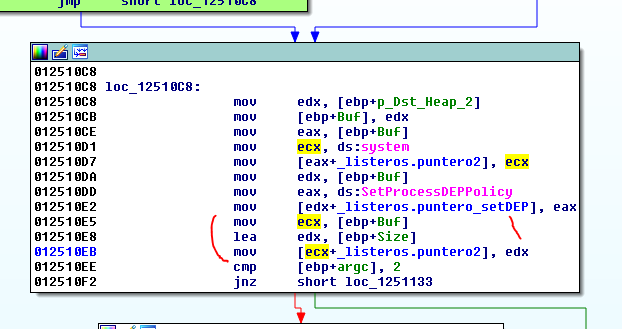

Также, если мы нажмем **T** в следующем поле, это также соответствует указателю **PUNTERO2**, который используется повторно, сохраняя **РАЗМЕР**, как в предыдущем примере. Поэтому я переименую его.

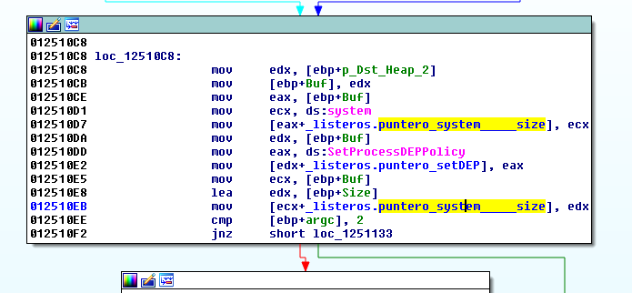

Это поле изначально использовалось для сохранения указателя на **SYSTEM** и затем сохраняется **РАЗМЕР**. Вот почему переменная разделяется символами подчеркивания, чтобы знать, что эта переменная была использована.

Затем программа сравнивает **ARGC** c числом **2** для того, чтобы увидеть, есть ли два аргумента, имя исполняемого файла и второй аргумент, как в предыдущем примере.

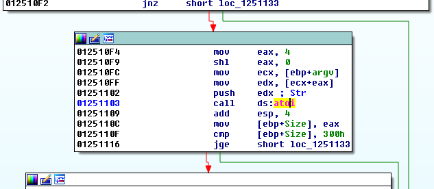

Этот блок аналогичен предыдущему примеру. Функция читает аргумент, который мы передали ей. Если функция может преобразовать аргумент в целое и по прежнему, если аргумент больше чем **0x300**, программа переходит к концу функции **MAIN**. Непосредственно на инструкцию **RET**.

Также здесь используется инструкция **JGE,** которая рассматривает знак. Таким образом отрицательные значение, будут меньше чем **0x300** и будет отлично проходить сравнение.

После загрузки библиотеки **MYPEPE**.**DLL**

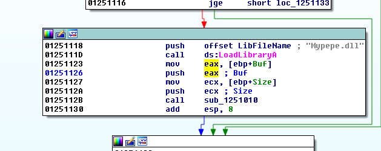

Программа приходит в функцию, где ей передается два аргумента, начало структуры, которая находится в буфере **BUF** и **РАЗМЕР**, который приходит из аргумента, который был преобразован в целое.

Посмотрим на функцию.

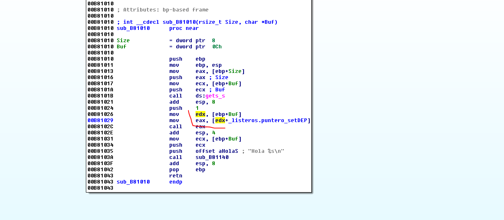

С помощью функции **GETS**\_**S** программа будет получать, то что набирает пользователь, и поскольку **РАЗМЕР** может быть отрицательным, буфер будет переполняться. Здесь проблема заключается в том, что когда мы исполняем функцию **MALLOC,** мы создаем буфер в кучи, чтобы разместить всю структуру, и внутри неё существует поле структуры, которое является внутренним буфером для получения того, то вводит пользователь через функцию **GETS**\_**S.**

Если все сработает и проверка не позволит передать отрицательное значение или значение больше чем **0x64** байт, и мы не сможем переполнить буфер **BUF** и перезаписать указатель, который находятся ниже структуры.

struct \_listeros
{
char Buf\[0x64\];
void \* puntero1;
void \* puntero2;
};

В любом случае, здесь мы не можем просто переполнить буфер **BUF** и перезаписать указатели, но мы можем продолжить запись вниз и переполнить весь выделенный блок **0x6C,** продолжать ломать и перезаписывать вещи в кучи.

Мы имеем представление о том, как ниже программа использует указатель на **SETDEP**. Мы можем перейти туда, чтобы выполнить код.

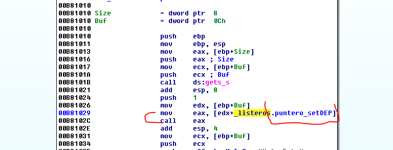

Чтобы перезаписать этот указатель, мы должны заполнить буфер **BUF** **0x64** байтами и затем он будет переполняться.

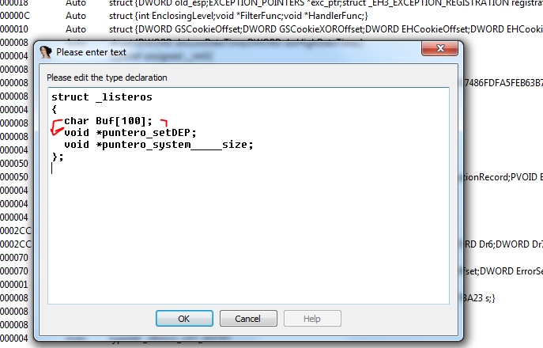

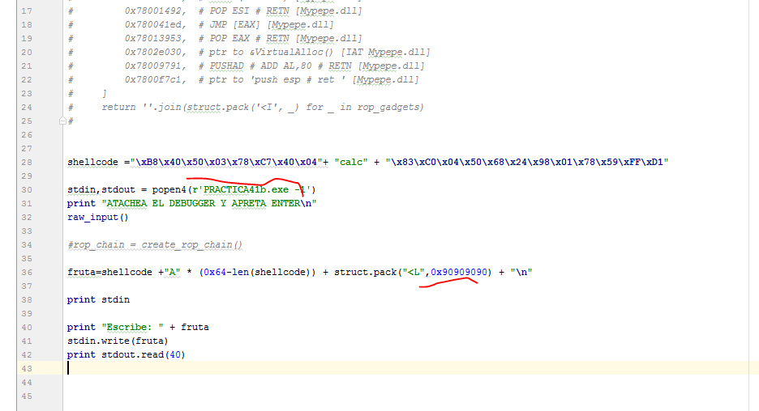

Если мы изменим немного предыдущий скрипт, то у нас получится что-то вполне функциональное. Шеллкод будет идти вперед и он должен быть скомпенсирован для того, чтобы сумма до адреса для перехода была **0x64** байта. Посмотрим как это получится.

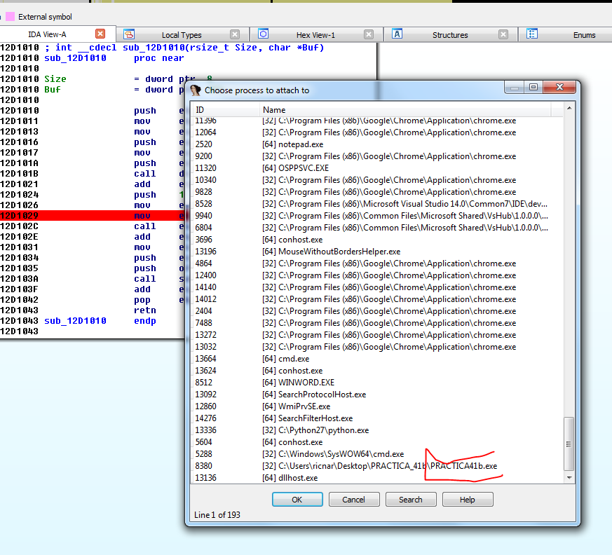

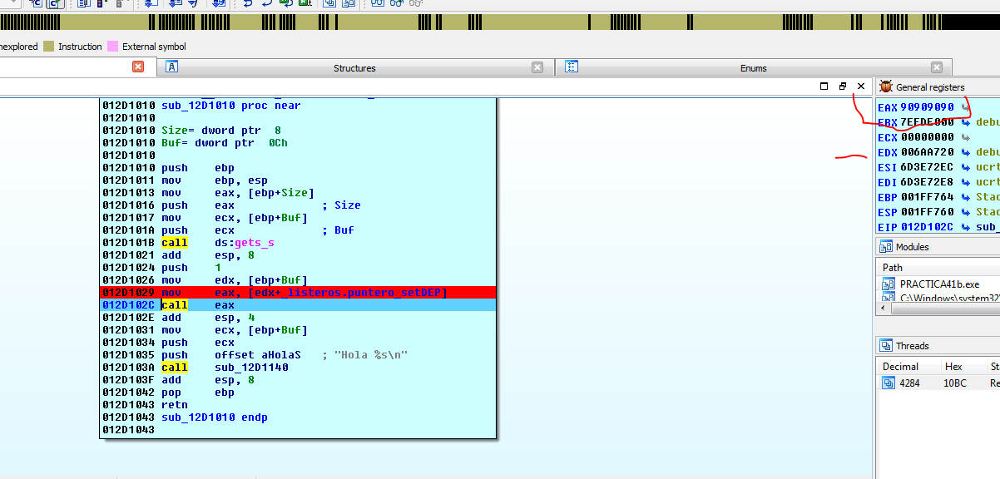

Регистр **EAX** имеет указатель куда переходить, а регистр **EDX** указывает на начало буфера где находится мой шеллкод.

Поэтому я ищу гаджет **JMP** **EDX** или **CALL** **EDX** или **PUSH** **EDX** – **RET** так как он не имеет **DEP** и будет работать. Давайте использовать для этого **IDASPLOITER**.

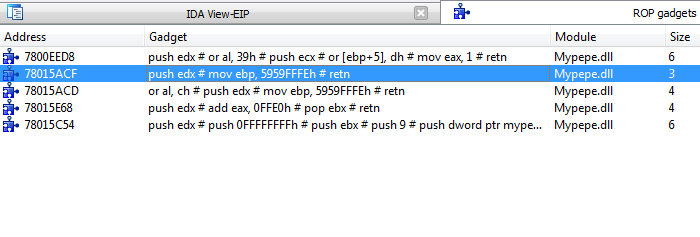

Этот гаджет исполняет инструкцию **PUSH** **EDX**. Затем в середине него есть инструкции, которые не меняют стек и не роняют программу, а затем инструкция идет **RET**. Поэтому он работает.

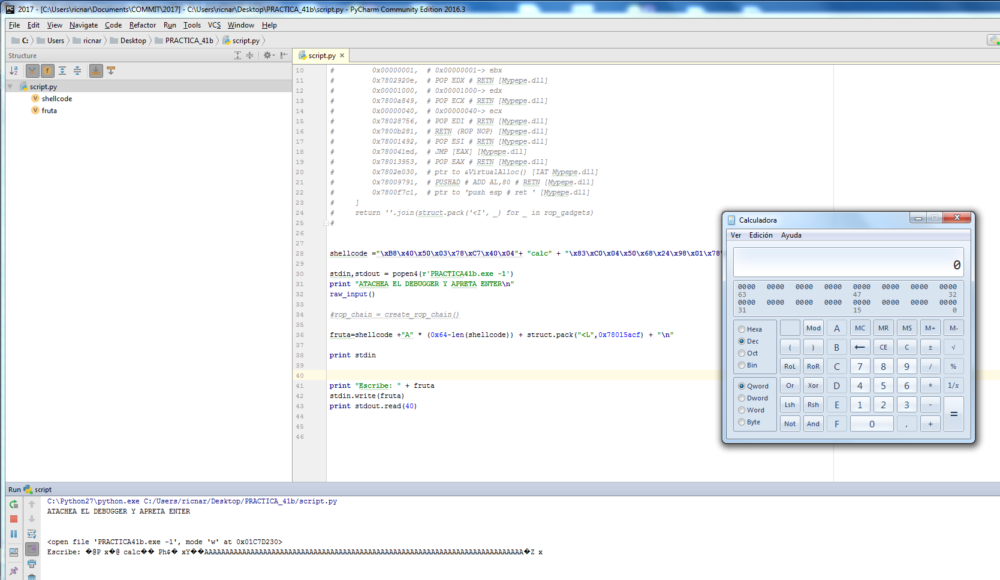

Поэтому наша курочка готова.

Сейчас, проблема, на самом деле, с переполнениями кучи заключается в том, что они обычно сложны и менее надежны \(процент эффективности\). Другими словами, в этом случае, расстояние между перезаписанным буфер и указателем является постоянным, потому что я создал программу в идеале и это все внутри той же структуры, но большую часть времени мы будем переполнять блок кучи и будем перезаписывать много раз другие блоки, где есть указатели, но расстояние не будет постоянным, поскольку местоположение блока разного размера не определяется на **100%**, а иногда это не срабатывает вообще.

Вот почему мы будем добавлять сложность шаг за шагом, когда будем продвигаться вперед.

Одна из проблем, которую мы видим сейчас, это когда мы фаззим \(мы используем утилиту, которая проверяем миллионы комбинаций ввода\) и обнаруживаем КРЭШ и мы не знаем, есть ли там переполнение или нет. Нам нужно знать больше об этом, чтобы управлять нашей эксплуатацией. Предположим, что это так. Я делаю похожий скрипт, но не знаю размеров или чего-то ещё и я использую его в программе или это результат использования утилиты фаззинга, который говорит мне, что скрипт рушит нашу программу.

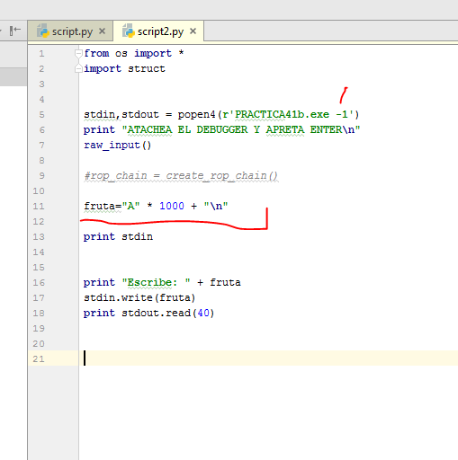

Предположим, что инструмент тестирует тысячи комбинаций записей, и я понимаю, что этот скрипт обрушивает программу. Мы можем выполнить его и увидеть, что он работает. Я устанавливаю **IDA**как **JIT** из консоли с правами администратора, перехожу в папке, где находится исполняемый файл **IDA** с помощью команды **CD** и затем выполняю.

**IDAQ.EXE -LL**

Если я запускаю скрипт и не присоединяю **IDA**. Я нажимаю **ENTER** и жду, пока программа не выйдет из строя для автоматического присоединения **IDA** как **JIT**.

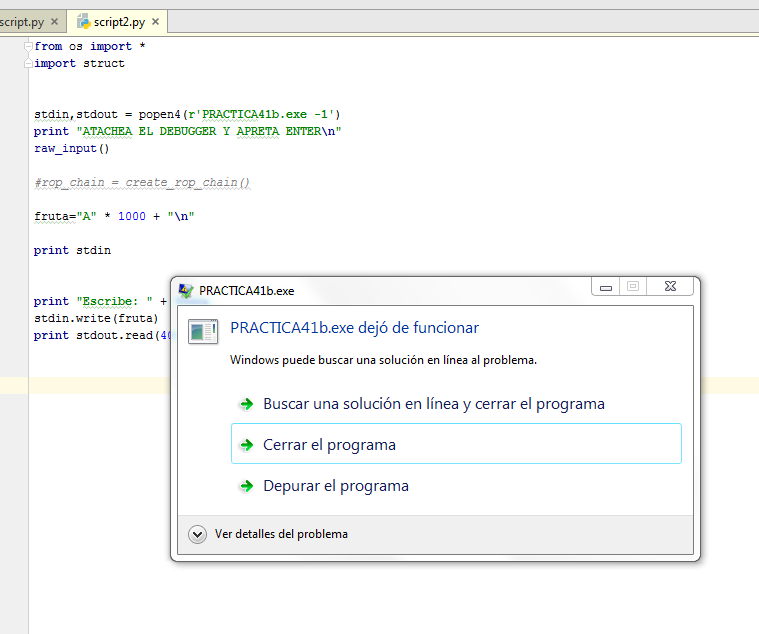

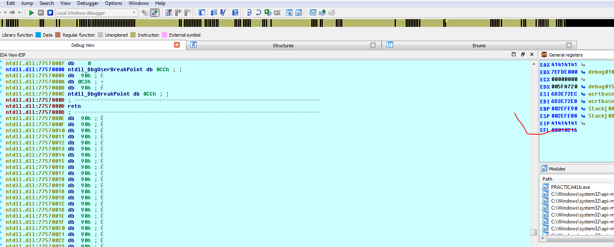

Программа переходит к выполнению. Регистр **EIP** равен **0x41414141.** Но откуда мы знаем, что произошло и если есть переполнение, то где оно произошло? Давайте посмотрим **CALL** **STACK** чтобы увидеть откуда идет вызов.

**IDA** ничего не показывает в стеке. Есть что-то, что похоже на адрес возврата, который может приходить от исполняемого файла **PRACTICA41B**.**EXE**.

Поэтому давайте проанализируем это. Таким образом, мы ничего не видим. Напомним, что **IDA** присоединена как **JIT** и не проводила никакого анализа.

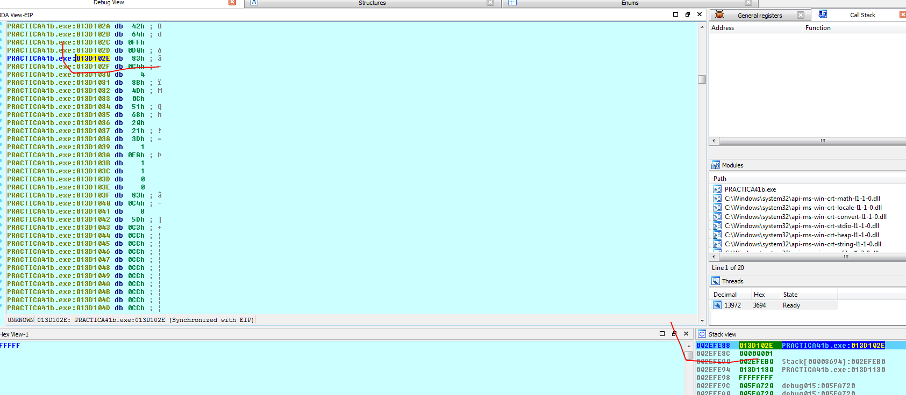

В **MODULE** **LIST** я выбираю пункт **ANALIZE** **MODULE,** а потом выбираю **LOAD** **DEBUG** **SYMBOLS**.

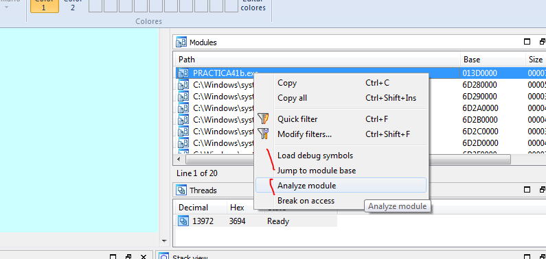

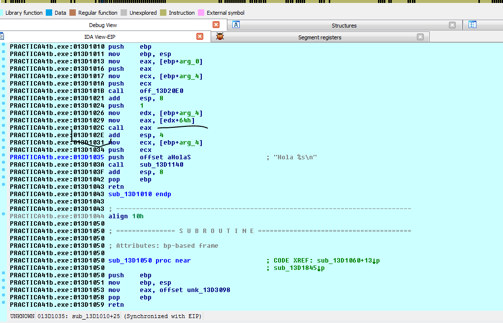

Хорошо. По крайней мере, мы знаем куда перешла программа и что этот адрес в стеке является адресом возврата, который помещает инструкцию **CALL** **EAX** для перехода на адрес **0x41414141**.

Если это простая программа, подобная той, которую мы используем, возможно, мы могли бы увидеть где буфер выделяется, где он записывается и переполняется, но в настоящей программе, есть тысячи распределений, и записей, и мы просто сойдем с ума из-за этого.

На сегодняшний день, мы увидим трюк, который место, где он записал и переполнил программу. Не имеет значения, является ли эта программа самой сложной в мире с миллионами выделений памяти. Он будет работать также.

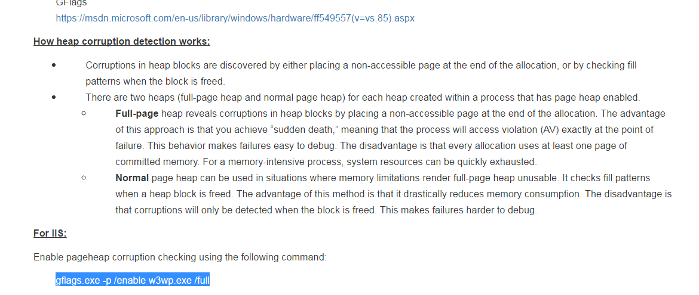

Это часть веб-страницы, которая находится здесь:

[https://blogs.msdn.microsoft.com/we...cting-heap-corruption-using-gflags-and-dumps/](https://blogs.msdn.microsoft.com/webdav_101/2010/06/22/detecting-heap-corruption-using-gflags-and-dumps/)

Проблема заключается в том, что с использованием **GFLAGS**, который предоставляет **WINDBG**, мы меняем способ обработки кучи и как там сказано, куча находит конец каждого распределения в режиме **FULL** **PAGE**, блок не доступный для записи, и когда куче передается байт этого размера блока, программа падает при записи и останавливается только в том месте, где он пишет и переполняет, что обычно является интересным моментом.

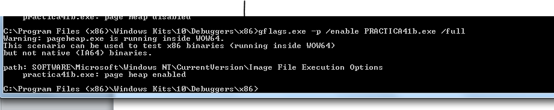

Я иду в папку где находится **GFLAGS**.**EXE** в том же каталоге, что и сам **WINDBG**.**EXE** и изменяю кучу, чтобы включить **PAGE** **HEAP** в режиме **FULL** с помощью такой команды.

**GFLAGS.EXE -P /ENABLE PRACTICA41B.EXE /FULL**

Когда я закончу работу, чтобы вернуться в привычный режим, я исполняю.

**GFLAGS.EXE -P /DISABLE PRACTICA41B.EXE**

Хорошо. Мы включаем этот режим и теперь закрываем **IDA**, которая остается как **JIT** и запускаем скрипт снова.

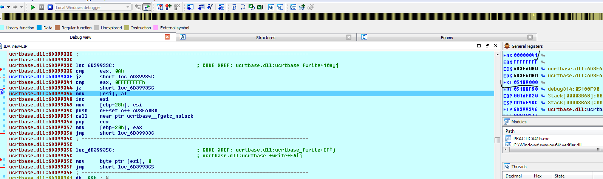

Есть изменения. Это сбой при попытке записи символы **A,** т.е. **0x41** за пределы правильного блока, что вызывает переполнение. Сейчас мы можем увидеть откуда приходит извращенная запись.

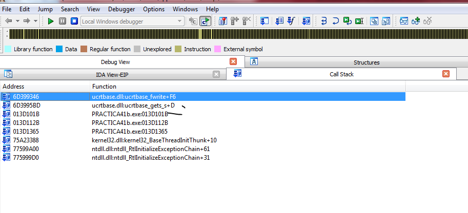

В **STACK** **TRACE** сейчас мы видим откуда она пришла. Мы видим функцию **GETS\_S** где произошло переполнение и откуда его вызвала программа.

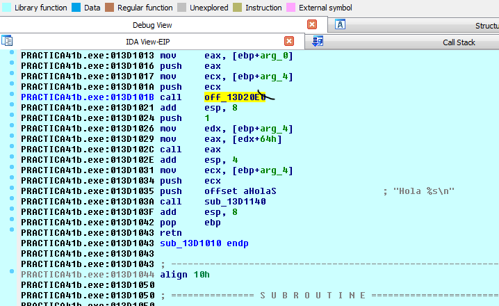

Это вызов функции **GETS\_S**. Если мы хотим, чтобы **IDA** сообщила нам имя, мы проанализируем код и находим символы модуля **UCRTBASE**.**DLL**, который видели в стеке вызова. Модуль был тем, у которого была выбрана экспортированная функция **GETS\_S**.

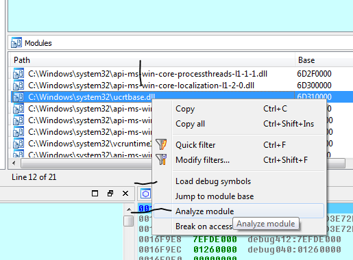

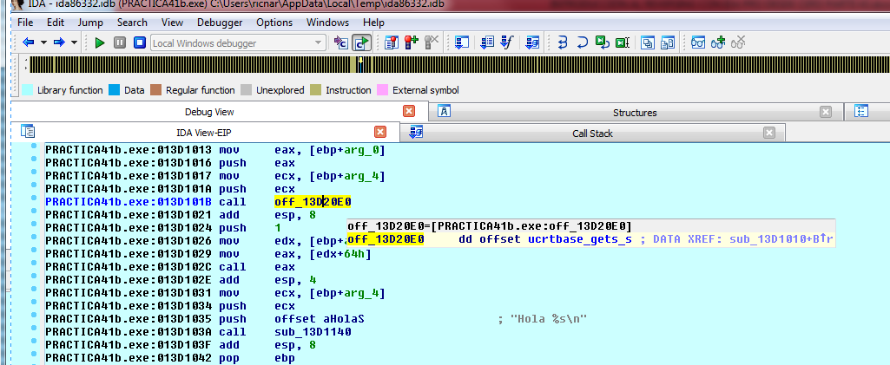

Хорошо. Наведите курсор мыши на функцию.

Мы вводим его вручную, пока не увидим более подробный анализ кучи в **WINDBG**. Зная примерно размер выделенного блока в куче, по крайней мере, сколько мне нужно написать, чтобы переполнить его.

Если я пойду в регистр **ESI**, который указывает туда, где я пытаюсь записать.

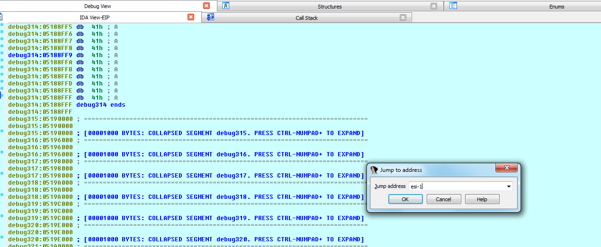

Я устанавливаю адрес как **-1,** потому что в регистре **ESI** программа не могла писать. Здесь я вижу байты **0x41** которые я писал. Если я прокручу вверх к началу.

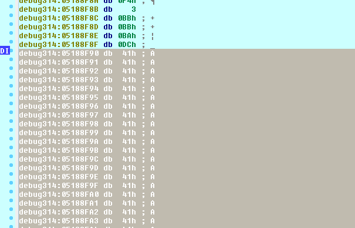

Выделяем всю эту область и затем выбираем пункт **EDIT** → **ARRAY**.

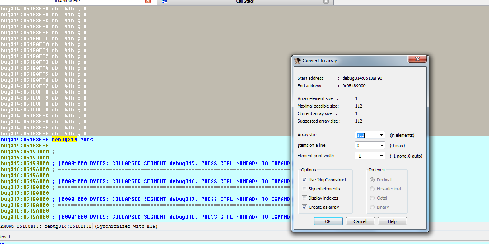

У меня получается **112** байт, что приблизительно равно **0x70** байт выделенного блока, который был **0x6C** байт. Очевидно, это также зависит от того, что написано в начале блока или нет. И есть **4**байта. Это хорошо. Система не идеальна при распределении смежной страницы и немного округляет, но мы достаточно близки. Очевидно, с помощью встроенных команд **WINDBG** это будет намного проще увидеть. Но нам нужно включить **PAGE** **HEAP** **FULL** с **GFLAGS**. Мы нашли что-то, что может занять часы и заставить многих людей сходить с ума. Точка, в которой произошло переполнение кучи.

Очевидно, когда речь шла о переполнении, мы говорили о переполнении блока, который был выделен функцией **MALLOC**. Система может обнаружить это, но если мы просто переполнили внутренний буфер структуры и просто передадим **4** байта для перезаписи указателя на **SETDEP** это не будет работать. Хотя, это очень странный случай и это не нормально, всегда происходит переполнение в каком-то блоке кучи, который передается и смежные блоки перезаписываются.

Верните кучу в нормальное состояние, когда закончите.

**=======================================================

Автор текста: Рикардо Нарваха** - **Ricardo** **Narvaja** \(**@ricnar456**\)
Перевод на английский: **IvinsonCLS \(@IvinsonCLS\)**
Перевод на русский с испанского+английского: **Яша\_Добрый\_Хакер\(Ростовский фанат Нарвахи\).**
Перевод специально для форума системного и низкоуровневого программирования — **WASM.IN
01.05.2018
Версия 1.0**
