# Часть 44

Конечно, нам нужно решить упражнение **PRACTICA\_44**, но мы будем решать его в следующих частях. Сейчас мы увидим дополнительную информацию, которую мы можем получить используя **WINDBG** внутри **IDA**. Мы будем использовать предыдущий случай **PRACTICA 41B**, про который мы знаем, что это переполнение кучи.

Мы перейдём от отладчика **IDA** к **WINDBG** и убедимся, что он находится в режиме **USER** через **DEBUGGER OPTIONS**.

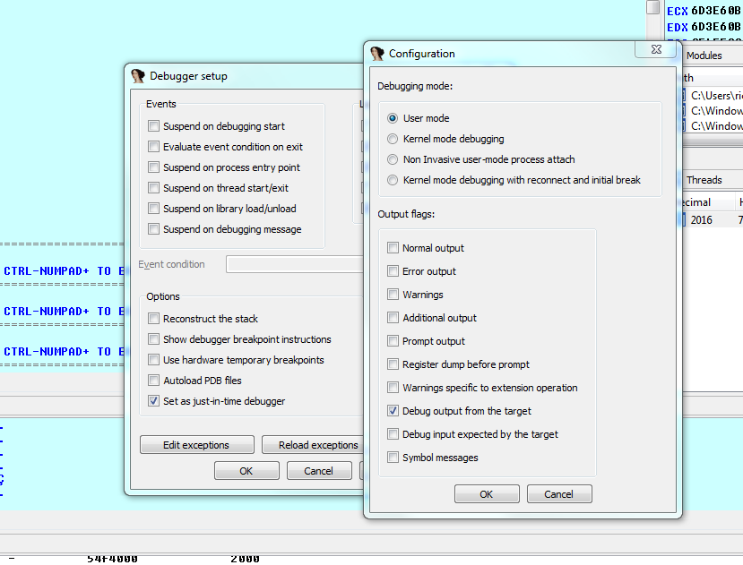

Мы меняем **GFLAGS** для того, чтобы процесс имел включенный **PAGE HEAP** в режиме **FULL**.

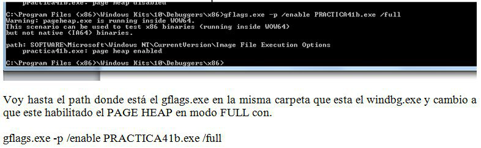

И я запускаю скрипт **SCRIPT2**.

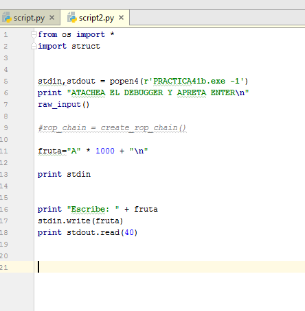

Но на этот раз, когда программа останавливается, я присоединяю **IDA** к анализу **PRACTICA41B** загруженного в **ЗАГРУЗЧИК** и конечно в режиме отладки **USER WINDBG**.

Логично, что программа будет падать, как и прежде, когда она пытается записать за пределы выделенного блока и переполнить его.

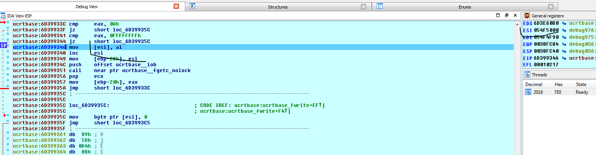

Разумеется, для этого необходимо сконфигурировать **WINDBG** внутри **IDA**. В любом случае, если у вас возникли проблемы с установкой **WINDBG** и **IDA** не распознает его, вы можете присоединить **WINDBG** за пределами **IDA** и набирать команды там. У Вас не будет интерфейса **IDA**, но вы будете получать ту же информацию.

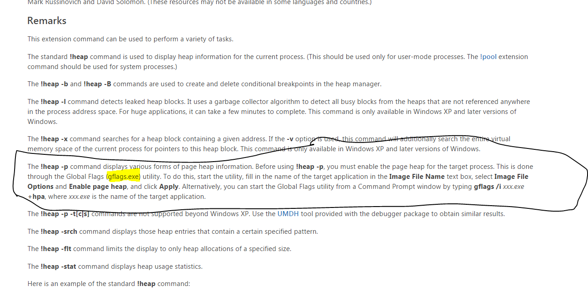

Хорошо. **WINDBG** имеет много полезных команд для исследования кучи. Я думаю, что для работы с кучами, этот интерфейс является наиболее полными.

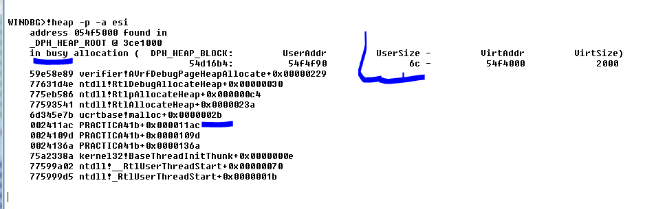

Эта команда очень полезна. Она просто работает полностью с включенным режимом **PAGE HEAP FULL**. И мне сообщается размер выделенного блока, который использует программа или занят \(не свободный\) и сообщает мне историю мест, где это произошло, когда этот блок был выделен.

Если бы мы выполнили ту же команду в блоке, который был освобожден или свободен, команда покажет нам историю тех мест где был освобождён блок.

Распределение приходит из адреса: **002411AC PRACTICA41B+ 0x000011AC**

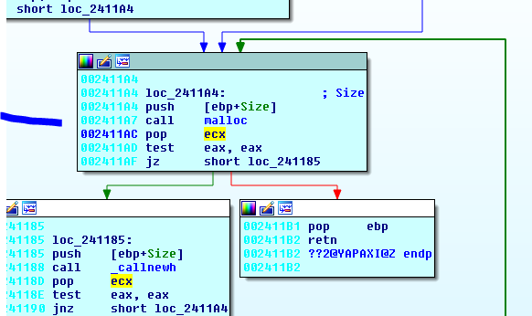

И выше, в списке истории, программа похоже вызывает функцию **MALLOC**. Затем идет внутренний вызов **RTLALLOCATEHEAP** и т.д.

Ниже, в списке истории у нас есть такой вызов **0024109D PRACTICA41B+0x0000109D**

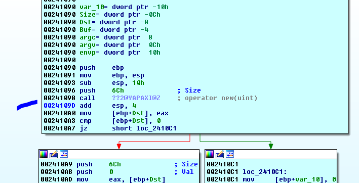

Команда помечает адреса возврата вызовов куда входила программа, чтобы выделить блоки.

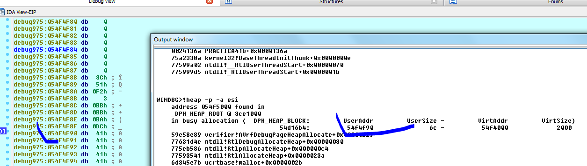

Команда показывает **USER ADDRESS**, который является начальным блоком для **USER**, где он может быть записан. Этому предшествует заголовок блока.

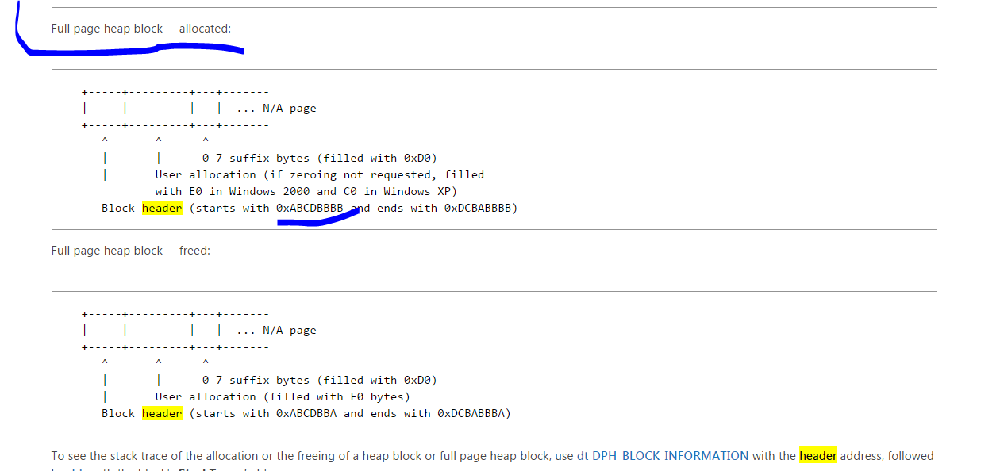

На веб-страницы **MICROSOFT** мы видим информацию о заголовке, в данном случае, информацию о кучи в режиме **FULL PAGE** . Заголовок начинается с байтов **ABCDBBBB** и заканчивается байтами **DCABBBBB**. Давайте посмотрим, увидим ли мы это непосредственно перед началом, где мы писали.

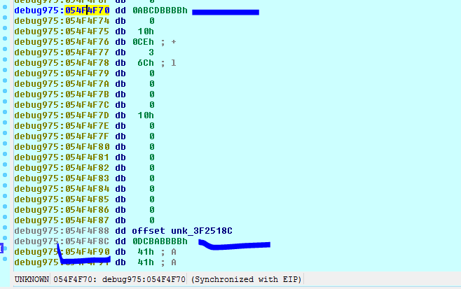

С помощью команды **DT WINDBG**, за которой следует \_**DPH\_BLOCK\_INFORMATION**, команда будет выдавать нам информацию о полях заголовка.

Если мы пойдем по адресу, который указывает **STACK TRACE** .

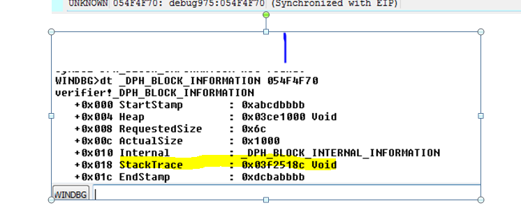

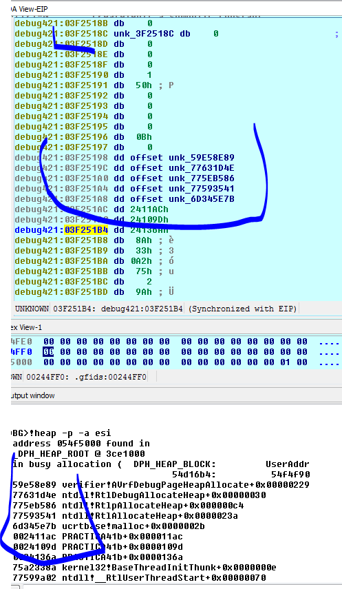

Немного ниже сохраняется история распределения. Это соответствует тому, что нам дала команда.

`!heap –p –a xxx`

Теперь мы докажем, какую информацию дает нам команда, когда мы используем её с нормальной кучей.Очевидно, это будет не так специфично и не будет иметь истории каждого блока, но это хорошо.

Я выключаю режим **PAGE GUARD FULL**.

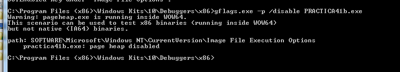

Я запускаю скрипт снова и когда программа остановится, я присоединяю снова **IDA** с анализом и локальным отладчиком **WINDBG**, как и раньше.

Логически, мы не имеет ту же информацию и программа падает, когда она переходит к выполнению.
Давайте посмотрим нашу кучу.

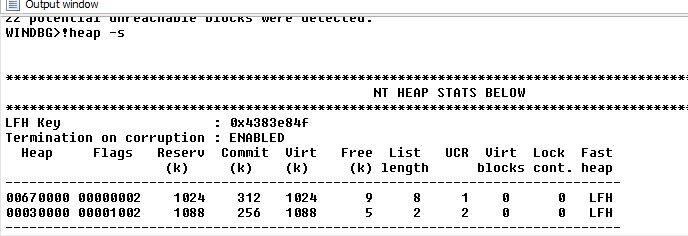

Статистики кучи такая.

Если мы пойдем в область где перешла программа, смотря на стек, мы понимаем, что она приходит отсюда.

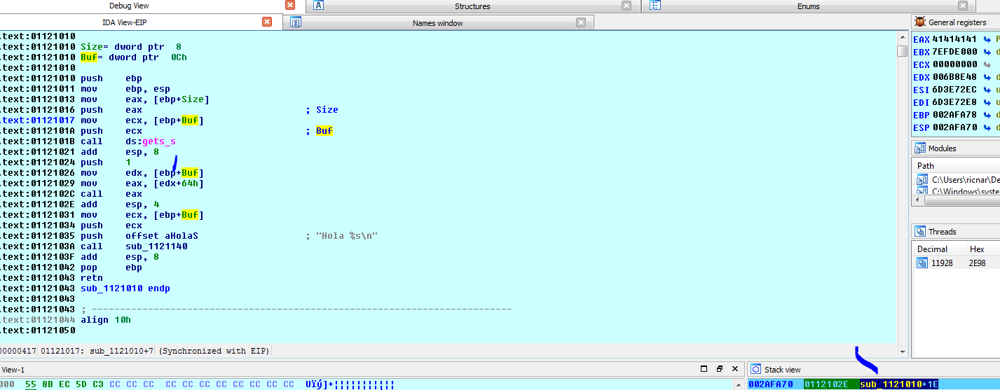

И регистр **EBP** не меняется и поскольку мы знаем программу, мы будем делать чит, смотря на значение буфера, которое мы передали в функцию **GETS\_S**, которое является началом выделенного блока потому. Теперь программа копирует его. Он передается в качестве агумента \(очевидно мы можем это сделать, потому что это простая программа и для учебы, в противном случае, мы должны включить **PAGE GUARD** и делать то что мы видели раньше\)

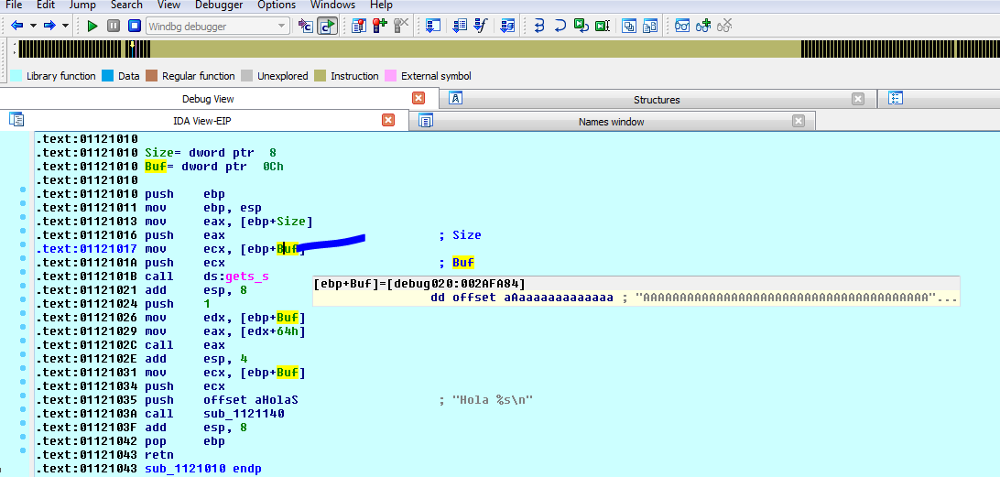

Переменная **BUF** продолжает указывать на начало кучи. Поэтому мы можем пойти туда.

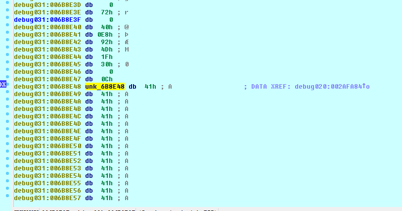

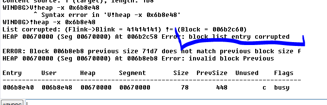

**BLOCK LIST ENTRY** поломан. Мы знаем это.

Очевидно, поскольку все поломано, мы постараемся присоединиться прежде чем куча сломается, чтобы увидить информацию о блоке. Хорошо. Я не могу запустить его непосредственно в **IDA**, потому что он запускается в режиме отладки в куче. Поэтому я буду помещать байты **EB FE**, чтобы программа зациклилась и когда я запущу его, я буду присоединиться к нему.

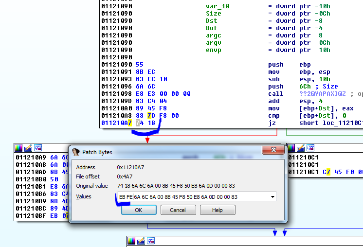

Я буду изменять байты **74 18** условного перехода на байты **EB FE**. После изменения я выбираю **EDIT → PATCH PROGRAM → APPLY PATCH TO INPUT FILE**.

Сейчас я запускаю скрипт. Как только он зациклится, я останавливаюсь здесь. Но поскольку я уже прошел через **MALLOC** я уже могу увидеть кучу.

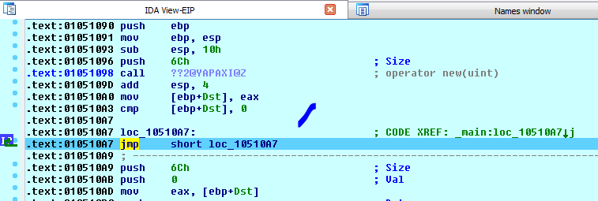

После выделения, в регистре **EAX** остается адрес блока.

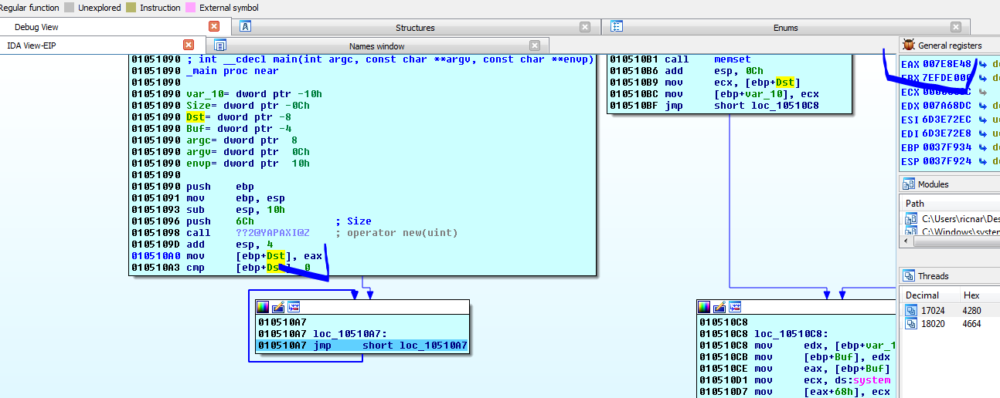

Давайте посмотрим, что скажет нам команда.

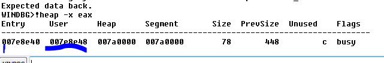

**USER** как всегда является частью где Вы можете писать, а **ENTRY** это где начинается заголовок. Посмотрим на них.

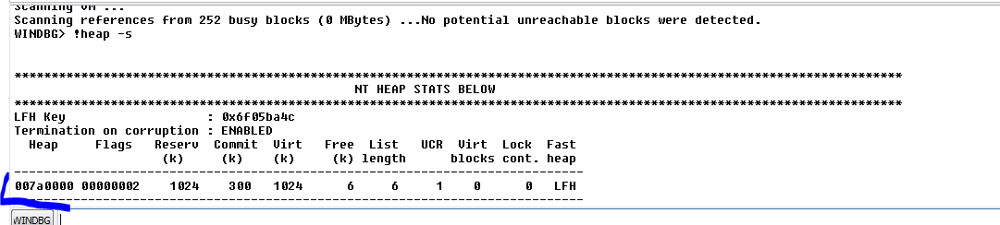

Команда показывает только одну кучу, и вот где она. Давайте посмотрим её содержимое.

```console
WINDBG>!heap -a 007a0000

Index Address Name Debugging options enabled
1: 007a0000
Segment at 007a0000 to 008a0000 (0004b000 bytes committed)
Flags: 00000002
ForceFlags: 00000000
Granularity: 8 bytes
Segment Reserve: 00100000
Segment Commit: 00002000
DeCommit Block Thres: 00000800
DeCommit Total Thres: 00002000
Total Free Size: 0000031b
Max. Allocation Size: 7ffdefff
Lock Variable at: 007a0138
Next TagIndex: 0000
Maximum TagIndex: 0000
Tag Entries: 00000000
PsuedoTag Entries: 00000000
Virtual Alloc List: 007a00a0
Uncommitted ranges: 007a0090
007eb000: 000b5000 (741376 bytes)
FreeList[ 00 ] at 007a00c4: 007e8ec0 . 007e4e90
007e4e88: 00028 . 00010 [100] - free
007a6750: 00028 . 00010 [100] - free
007a6158: 00050 . 00010 [100] - free
007e2d30: 00028 . 00018 [100] - free
007e2c58: 00210 . 00018 [100] - free
007e8eb8: 00078 . 01878 [100] - free

Segment00 at 007a0000:
Flags: 00000000
Base: 007a0000
First Entry: 007a0588
Last Entry: 008a0000
Total Pages: 00000100
Total UnCommit: 000000b5
Largest UnCommit:00000000
UnCommitted Ranges: (1)

Heap entries for Segment00 in Heap 007a0000
address: psize . size flags state (requested size)
007a0000: 00000 . 00588 [101] - busy (587)
007a0588: 00588 . 00240 [101] - busy (23f)
007a07c8: 00240 . 00020 [101] - busy (18)
007a07e8: 00020 . 01dd8 [101] - busy (1dce)
007a25c0: 01dd8 . 02d00 [101] - busy (2cf8)
007a52c0: 02d00 . 00048 [101] - busy (3c)
007a5308: 00048 . 00038 [101] - busy (30)
007a5340: 00038 . 00080 [101] - busy (78)
007a53c0: 00080 . 00080 [101] - busy (78)
007a5440: 00080 . 00048 [101] - busy (3c)
007a5488: 00048 . 00228 [101] - busy (220)
007a56b0: 00228 . 00050 [101] - busy (42)
007a5700: 00050 . 00080 [101] - busy (78)
007a5780: 00080 . 00018 [101] - busy (10)
007a5798: 00018 . 00050 [101] - busy (46)
007a57e8: 00050 . 00080 [101] - busy (78)
007a5868: 00080 . 00018 [101] - busy (10)
007a5880: 00018 . 00018 [101] - busy (10)
007a5898: 00018 . 00020 [101] - busy (14)
007a58b8: 00020 . 00070 [101] - busy (64)
007a5928: 00070 . 00208 [101] - busy (200)
007a5b30: 00208 . 00208 [101] - busy (200)
007a5d38: 00208 . 00030 [101] - busy (24)
007a5d68: 00030 . 00030 [101] - busy (24)
007a5d98: 00030 . 00038 [101] - busy (30)
007a5dd0: 00038 . 00028 [101] - busy (20)
007a5df8: 00028 . 00028 [101] - busy (20)
007a5e20: 00028 . 00028 [101] - busy (20)
007a5e48: 00028 . 00028 [101] - busy (20)
007a5e70: 00028 . 00018 [101] - busy (10)
007a5e88: 00018 . 00080 [101] - busy (78)
007a5f08: 00080 . 00080 [101] - busy (78)
007a5f88: 00080 . 00018 [101] - busy (10)
007a5fa0: 00018 . 00020 [101] - busy (14)
007a5fc0: 00020 . 00020 [101] - busy (10)
007a5fe0: 00020 . 00078 [101] - busy (6c)
007a6058: 00078 . 00080 [101] - busy (78)
007a60d8: 00080 . 00018 [101] - busy (10)
007a60f0: 00018 . 00018 [101] - busy (10)
007a6108: 00018 . 00050 [101] - busy (42)
007a6158: 00050 . 00010 [100]
007a6168: 00010 . 00058 [101] - busy (4a)
007a61c0: 00058 . 00080 [101] - busy (78)
007a6240: 00080 . 00020 [101] - busy (10)
007a6260: 00020 . 00018 [101] - busy (10)
007a6278: 00018 . 00080 [101] - busy (78)
007a62f8: 00080 . 00020 [101] - busy (10)
007a6318: 00020 . 00018 [101] - busy (10)
007a6330: 00018 . 00018 [101] - busy (10)
007a6348: 00018 . 00070 [101] - busy (68)
007a63b8: 00070 . 00080 [101] - busy (78)
007a6438: 00080 . 00018 [101] - busy (10)
007a6450: 00018 . 00070 [101] - busy (68)
007a64c0: 00070 . 00078 [101] - busy (70)
007a6538: 00078 . 00080 [101] - busy (78)
007a65b8: 00080 . 00020 [101] - busy (10)
007a65d8: 00020 . 00018 [101] - busy (10)
007a65f0: 00018 . 00020 [101] - busy (10)
007a6610: 00020 . 00078 [101] - busy (6a)
007a6688: 00078 . 00088 [101] - busy (7c)
007a6710: 00088 . 00018 [101] - busy (10)
007a6728: 00018 . 00028 [101] - busy (20)
007a6750: 00028 . 00010 [100]
007a6760: 00010 . 00080 [101] - busy (78)
007a67e0: 00080 . 00080 [101] - busy (78)
007a6860: 00080 . 03d20 [101] - busy (3d1f)
007aa580: 03d20 . 378b0 [101] - busy (378a8) Internal
007e1e30: 378b0 . 00080 [101] - busy (78)
007e1eb0: 00080 . 00020 [101] - busy (17)
007e1ed0: 00020 . 00400 [101] - busy (3f8) Internal
007e22d0: 00400 . 00400 [101] - busy (3f8) Internal
007e26d0: 00400 . 00080 [101] - busy (78)
007e2750: 00080 . 00080 [101] - busy (78)
007e27d0: 00080 . 00028 [101] - busy (20)
007e27f8: 00028 . 00028 [101] - busy (20)
007e2820: 00028 . 00070 [101] - busy (66)
007e2890: 00070 . 00080 [101] - busy (78)
007e2910: 00080 . 00028 [101] - busy (20)
007e2938: 00028 . 00028 [101] - busy (20)
007e2960: 00028 . 00070 [101] - busy (68)
007e29d0: 00070 . 00078 [101] - busy (6a)
007e2a48: 00078 . 00210 [101] - busy (208)
007e2c58: 00210 . 00018 [100]
007e2c70: 00018 . 00070 [101] - busy (66)
007e2ce0: 00070 . 00028 [101] - busy (20)
007e2d08: 00028 . 00028 [101] - busy (20)
007e2d30: 00028 . 00018 [100]
007e2d48: 00018 . 00078 [101] - busy (6c)
007e2dc0: 00078 . 02000 [101] - busy (1ff8) Internal
007e4dc0: 02000 . 00028 [101] - busy (20)
007e4de8: 00028 . 00028 [101] - busy (20)
007e4e10: 00028 . 00028 [101] - busy (20)
007e4e38: 00028 . 00028 [101] - busy (20)
007e4e60: 00028 . 00028 [101] - busy (20)
007e4e88: 00028 . 00010 [100]
007e4e98: 00010 . 00078 [101] - busy (6a)
007e4f10: 00078 . 00408 [101] - busy (400)
007e5318: 00408 . 00028 [101] - busy (20)
007e5340: 00028 . 00800 [101] - busy (7f8) Internal
007e5b40: 00800 . 006d0 [101] - busy (6c8)
007e6210: 006d0 . 00c08 [101] - busy (c00)
007e6e18: 00c08 . 00800 [101] - busy (7f8) Internal
007e7618: 00800 . 00228 [101] - busy (220)
007e7840: 00228 . 00228 [101] - busy (220)
007e7a68: 00228 . 00490 [101] - busy (483)
007e7ef8: 00490 . 00218 [101] - busy (209)
007e8110: 00218 . 00058 [101] - busy (4a)
007e8168: 00058 . 00808 [101] - busy (800)
007e8970: 00808 . 00088 [101] - busy (80)
007e89f8: 00088 . 00448 [101] - busy (440)
007e8e40: 00448 . 00078 [101] - busy (6c)
007e8eb8: 00078 . 01878 [100]
007ea730: 01878 . 00100 [101] - busy (f4)
007ea830: 00100 . 00038 [101] - busy (2e)
007ea868: 00038 . 00030 [101] - busy (28)
007ea898: 00030 . 00040 [101] - busy (37)
007ea8d8: 00040 . 00048 [101] - busy (3c)
007ea920: 00048 . 00040 [101] - busy (31)
007ea960: 00040 . 00030 [101] - busy (24)
007ea990: 00030 . 00040 [101] - busy (32)
007ea9d0: 00040 . 00038 [101] - busy (2e)
007eaa08: 00038 . 00038 [101] - busy (2c)
007eaa40: 00038 . 00030 [101] - busy (28)
007eaa70: 00030 . 00030 [101] - busy (21)
007eaaa0: 00030 . 00020 [101] - busy (15)
007eaac0: 00020 . 00038 [101] - busy (2b)
007eaaf8: 00038 . 00030 [101] - busy (22)
007eab28: 00030 . 00038 [101] - busy (2e)
007eab60: 00038 . 00048 [101] - busy (39)
007eaba8: 00048 . 00020 [101] - busy (17)
007eabc8: 00020 . 00040 [101] - busy (36)
007eac08: 00040 . 00050 [101] - busy (47)
007eac58: 00050 . 00050 [101] - busy (48)
007eaca8: 00050 . 00020 [101] - busy (12)
007eacc8: 00020 . 00020 [101] - busy (18)
007eace8: 00020 . 00030 [101] - busy (24)
007ead18: 00030 . 00038 [101] - busy (29)
007ead50: 00038 . 00098 [101] - busy (8b)
007eade8: 00098 . 00020 [101] - busy (17)
007eae08: 00020 . 00020 [101] - busy (11)
007eae28: 00020 . 00020 [101] - busy (18)
007eae48: 00020 . 00020 [101] - busy (17)
007eae68: 00020 . 00030 [101] - busy (21)
007eae98: 00030 . 00020 [101] - busy (13)
007eaeb8: 00020 . 00020 [101] - busy (14)
007eaed8: 00020 . 00020 [101] - busy (16)
007eaef8: 00020 . 00030 [101] - busy (28)
007eaf28: 00030 . 00030 [101] - busy (27)
007eaf58: 00030 . 00060 [101] - busy (52)
007eafb8: 00060 . 00028 [101] - busy (12)
007eafe0: 00028 . 00020 [111] - busy (1d)
007eb000: 000b5000 - uncommitted bytes.
```

Если мы посмотрим в список, там будет блок. Если мы найдем его по адресу заголовка, то программа сообщит нам его размер.

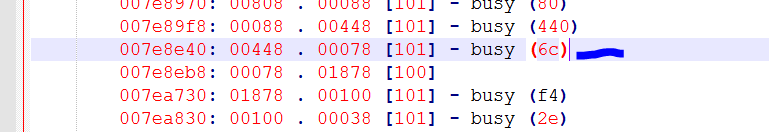

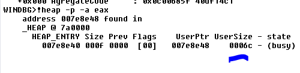

Он больше не показывает нам историю, хотя, если размер, общий размер равен **0xF**, потому что, чтобы найти общее количество, программа умножает на **8**, что даёт нам.

```console
hex\(0xf \* 0x8\)
'0x78'
```

Это полный размер с заголовком и концевиком и т.д.

В случае нормальной кучи, чтобы увидеть значения, мы должны использовать такую команду.

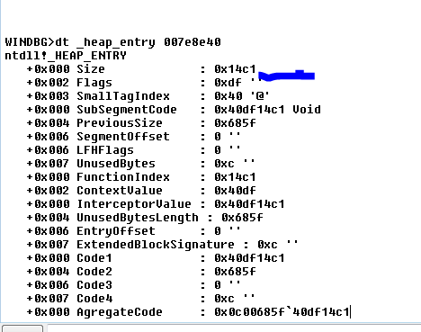

Проблема заключается в том, что они закодированы \(**XOR**\) константой. Где мы можем найти константу чтобы раскодировать\(**UNXOR**\) их.

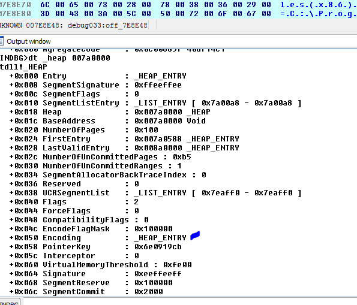

Мы видим, что поле смещению **0x50** структуры кучи называется ENCODING

```console
WINDBG>dd 007a0000+ 0x50 L2
007a0050 4ede14ce 000068d6
```

Это те **DWORDS**, которые зашифровывают информацию.

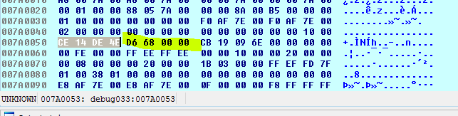

Если мы сделаем то же самое в заголовке разделив его на два **DWORDS**.

```console
dd 007E8E40 L2
```

У меня есть два DWORDS, которые мне нужны, чтобы зашифровать две записи.

```console
WINDBG>dd 007a0000+ 0x50 L2
007a0050 4ede14ce 000068d6
```

```console
WINDBG>dd 007E8E40 L2
007e8e40 40df14c1 0c00685f
```

Я зашифровываю

```console
WINDBG>? 4EDE14CE ^ 40DF14C1
Evaluate expression: 234946575 = **0E01000F**
```

```console
WINDBG>? 68D6 ^ 0C00685F
Evaluate expression: 201326729 = **0C000089**
```

Мы можем создать небольшую таблицу. Очевидно, мы сломаем программу и не сможем запустить её больше, но один раз это можно сделать.

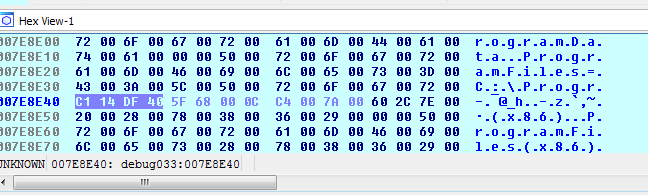

Я заменяю значения, чтобы зашифровать.

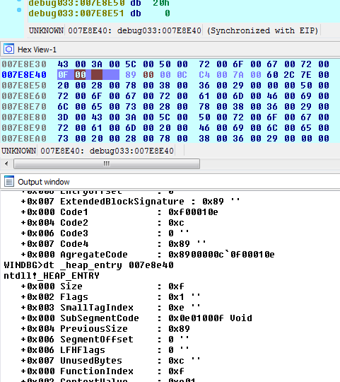

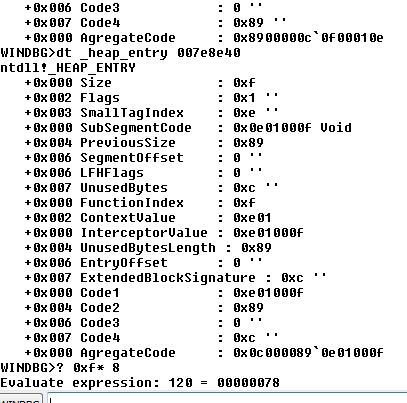

Поскольку, в этом случае размер равен **0xF**, мы должны умножить его на **8**, чтобы найти общие размер и это даёт мне **0x78**. То же самое у меня получилось в начале где включен заголовок и концевик.

Хорошо. Мы медленно наблюдаем и знакомимся с блоками кучи. В следующий раз, мы увидим, что **MONA** расскажет нам об этом. Поможет она нам или нет.

* * *

Автор оригинального текста — Рикардо Нарваха.

Перевод и адаптация на английский  язык — IvinsonCLS.

Перевод и адаптация на русский язык — Яша Яшечкин.

Перевод специально для форума системного и низкоуровневого программирования - WASM.IN

02.05.2018

Источник:

[**http://ricardonarvaja.info/WEB/INTRODUCCION%20AL%20REVERSING%20CON%20IDA%20PRO%20DESDE%20CERO/44-INTRODUCCION%20AL%20REVERSING%20CON%20IDA%20PRO%20DESDE%20CERO%20PARTE%2044.7z**](http://ricardonarvaja.info/WEB/INTRODUCCION%20AL%20REVERSING%20CON%20IDA%20PRO%20DESDE%20CERO/44-INTRODUCCION%20AL%20REVERSING%20CON%20IDA%20PRO%20DESDE%20CERO%20PARTE%2044.7z)
