# Часть 45

Мы будем снова продолжать практиковаться с упражнением **PRACTICA41B**, но на этот раз в **WINDBG**, используя **MONA** вне **IDA**. Конечно, мы будем использовать тот же исполняемый файл, который уже имеет байты **EB FE** и поэтому программа зациклена. В любом случае, хорошо держать файл также открытым в **ЗАГРУЗЧИКЕ IDA** без отладки, чтобы всё было ясно.

Основная идея состоит в том, чтобы увидеть какую информацию мы получаем в обоих случаях, используя **WINDBG** внутри **IDA** или используя **WINDBG** вне **IDA**, но пользуясь помощью **MONA**.

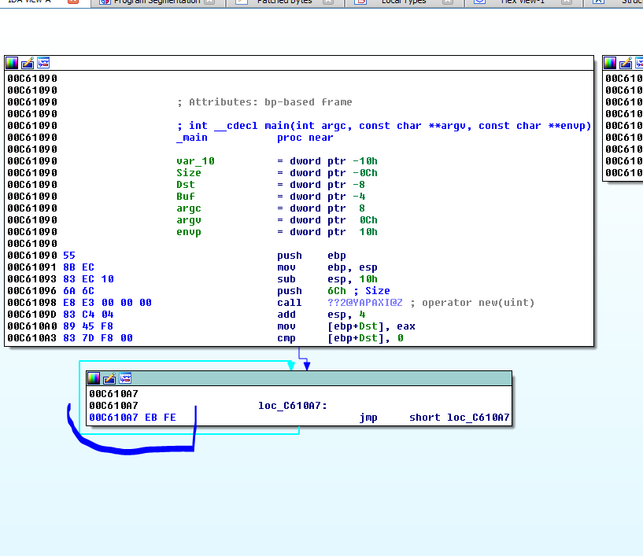

В этом случае, **IDA** в **ЗАГРУЗЧИКЕ** показывает мне адрес **БЕСКОНЕЧНОГО ЦИКЛА** на моей машине равном **0xC610A7** и секция кода начинается в **SEGMENTS**.

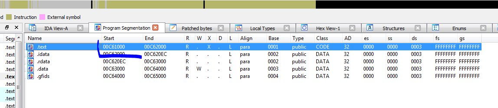

Если я делаю вычитание из начала кодовой секции, **ЦИКЛ** будет находится по смещению **0xA7** байт, а если делаю вычитание из **IMAGEBASE** равной **0xC60000 ЦИКЛ** будет находится по смещению **0x10A7**.

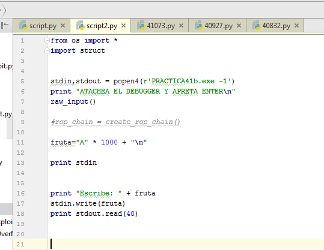

Я запускаю скрипт и процесс будет зациклен. Поэтому я открываю **WINDBG** у которого уже установлена **MONA**, как мы видели в предыдущих частях.

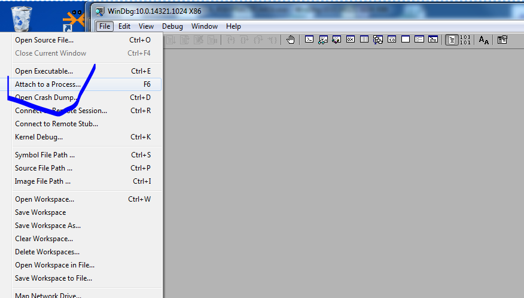

Когда я присоединяю **WINDBG** и процесс останавливается, я вижу **IMAGEBASE** поскольку исполняемый модуль имеет **ASLR**. С помощью команды **LM** я увижу список модулей.

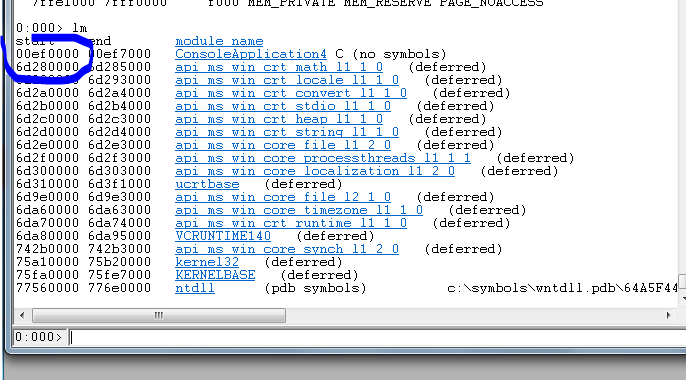

Имя, в этом случае, совпадает с тем, которое было указано при компиляции.

Если я добавлю значение **0x10A7** к **IMAGEBASE 0xEF0000**, то у меня получится адрес **0xEF10A7** где находится инструкция **JMP**.

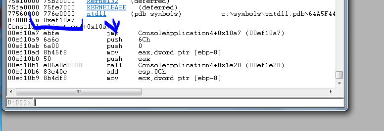

Если я хочу, чтобы адреса в **IDA** совпадали с процессом, который запущен в **WINDBG**, я иду в следующий пункт.

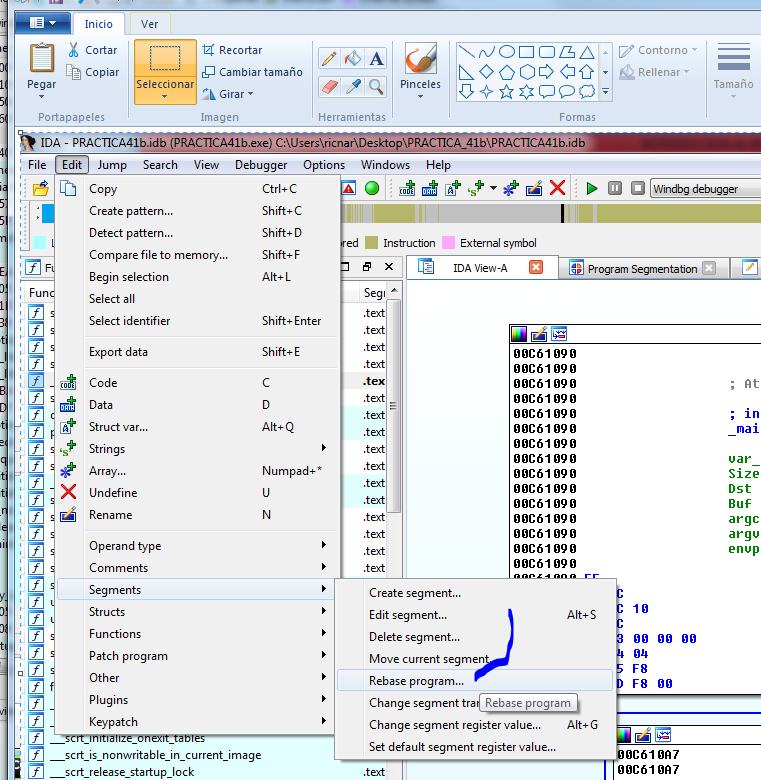

Я ввожу **IMAGEBASE** процесса, который запущен в **WINDBG**. Он был равен **0xEF0000**.

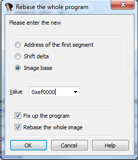

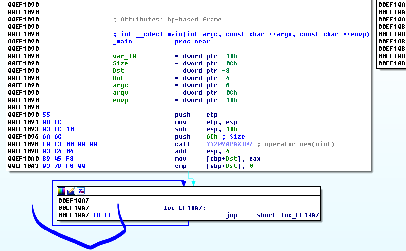

Видно, что сейчас адрес соответствует адресу процесса в **WINDBG**. Очевидно, каждый раз когда я перегружаю процесс, адрес будет меняться и я должен повторить **REBASE**.

Здесь я вижу инструкцию. Я устанавливаю **BP** на выполнение с помощью такой команды.

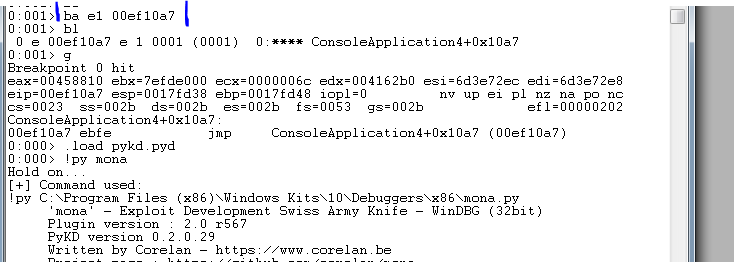

Я установил **BP** и нажал "**G**" для запуска процесса. Он останавливается. Как только я загружу **MONA** я могу пользоваться её командами для работы с кучей.

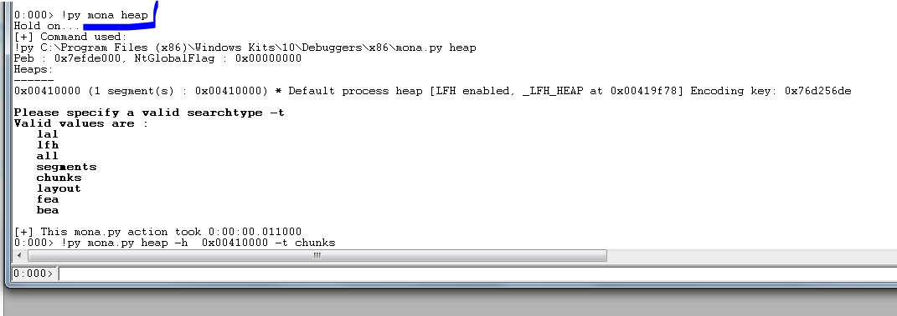

Мы сравниваем результат с тем, что даёт нам **WINDBG**. Нет большого различая. **MONA** просто даёт мне один из ключей шифрования.

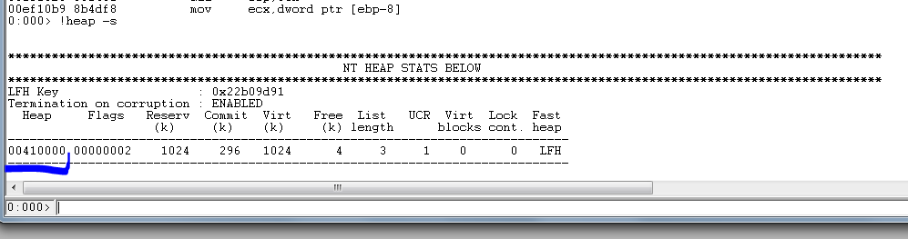


Давайте посмотрим, что **MONA** расскажет нам о чанках \(блоках\).

```console
0:000> !py mona.py heap -h 0x00410000 -t chunks
Hold on...
[+] Command used:
!py C:\Program Files [x86]\Windows Kits\10\Debuggers\x86\mona.py heap -h 0x00410000 -t chunks
Peb : 0x7efde000, NtGlobalFlag : 0x00000000
Heaps:
------
0x00410000 [1 segment[s] : 0x00410000] * Default process heap [LFH enabled, _LFH_HEAP at 0x00419f78] Encoding key: 0x76d256de
[+] Preparing output file 'heapchunks.txt'
- [Re]setting logfile heapchunks.txt
[+] Generating module info table, hang on...
- Processing modules
Let's rock 'n roll.
[+] Processing heap 0x00410000 [LFH]
Segment List for heap 0x00410000:
---------------------------------
Segment 0x00410588 - 0x00510000 [FirstEntry: 0x00410588 - LastValidEntry: 0x00510000]: 0x000ffa78 bytes
Nr of chunks : 146
_HEAP_ENTRY psize size unused UserPtr UserSize
00410588 00000 00240 00001 00410590 0000023f [575] [Busy]
004107c8 00240 00020 00008 004107d0 00000018 [24] [Busy]
004107e8 00020 019d0 0000a 004107f0 000019c6 [6598] [Busy]
004121b8 019d0 029e8 0000a 004121c0 000029de [10718] [Busy]
00414ba0 029e8 00048 0000c 00414ba8 0000003c [60] [Busy]
00414be8 00048 00038 00008 00414bf0 00000030 [48] [Busy]
00414c20 00038 00080 00008 00414c28 00000078 [120] [Busy]
00414ca0 00080 00080 00008 00414ca8 00000078 [120] [Busy]
00414d20 00080 00048 0000c 00414d28 0000003c [60] [Busy]
00414d68 00048 00228 00008 00414d70 00000220 [544] [Busy]
00414f90 00228 00050 0000e 00414f98 00000042 [66] [Busy]
00414fe0 00050 00080 00008 00414fe8 00000078 [120] [Busy]
00415060 00080 00018 00008 00415068 00000010 [16] [Busy]
00415078 00018 00050 0000a 00415080 00000046 [70] [Busy]
004150c8 00050 00080 00008 004150d0 00000078 [120] [Busy]
00415148 00080 00018 00008 00415150 00000010 [16] [Busy]
00415160 00018 00018 00008 00415168 00000010 [16] [Busy]
00415178 00018 00040 0000b 00415180 00000035 [53] [Busy]
004151b8 00040 00070 0000c 004151c0 00000064 [100] [Busy]
00415228 00070 00208 00008 00415230 00000200 [512] [Busy]
00415430 00208 00208 00008 00415438 00000200 [512] [Busy]
00415638 00208 00030 0000c 00415640 00000024 [36] [Busy]
00415668 00030 00030 0000c 00415670 00000024 [36] [Busy]
00415698 00030 00038 00008 004156a0 00000030 [48] [Busy]
004156d0 00038 00028 00008 004156d8 00000020 [32] [Busy]
004156f8 00028 00028 00008 00415700 00000020 [32] [Busy]
00415720 00028 00028 00008 00415728 00000020 [32] [Busy]
00415748 00028 00028 00008 00415750 00000020 [32] [Busy]
00415770 00028 00018 00008 00415778 00000010 [16] [Busy]
00415788 00018 00080 00008 00415790 00000078 [120] [Busy]
00415808 00080 00080 00008 00415810 00000078 [120] [Busy]
00415888 00080 00018 00008 00415890 00000010 [16] [Busy]
004158a0 00018 00020 0000c 004158a8 00000014 [20] [Busy]
004158c0 00020 00020 00010 004158c8 00000010 [16] [Busy]
004158e0 00020 00078 0000c 004158e8 0000006c [108] [Busy]
00415958 00078 00080 00008 00415960 00000078 [120] [Busy]
004159d8 00080 00018 00008 004159e0 00000010 [16] [Busy]
004159f0 00018 00018 00008 004159f8 00000010 [16] [Busy]
00415a08 00018 00050 0000e 00415a10 00000042 [66] [Busy]
00415a58 00050 00010 00000 00415a60 00000010 [16] [Free]
00415a68 00010 00058 0000e 00415a70 0000004a [74] [Busy]
00415ac0 00058 00080 00008 00415ac8 00000078 [120] [Busy]
00415b40 00080 00080 00008 00415b48 00000078 [120] [Busy]
00415bc0 00080 00018 00008 00415bc8 00000010 [16] [Busy]
00415bd8 00018 00020 00010 00415be0 00000010 [16] [Busy]
00415bf8 00020 00018 00008 00415c00 00000010 [16] [Busy]
00415c10 00018 00010 00000 00415c18 00000010 [16] [Free]
00415c20 00010 00080 00008 00415c28 00000078 [120] [Busy]
00415ca0 00080 00080 00008 00415ca8 00000078 [120] [Busy]
00415d20 00080 00088 0000c 00415d28 0000007c [124] [Busy]
00415da8 00088 00018 00008 00415db0 00000010 [16] [Busy]
00415dc0 00018 00078 00008 00415dc8 00000070 [112] [Busy]
00415e38 00078 00020 00010 00415e40 00000010 [16] [Busy]
00415e58 00020 00018 00008 00415e60 00000010 [16] [Busy]
00415e70 00018 00080 00008 00415e78 00000078 [120] [Busy]
00415ef0 00080 00018 00008 00415ef8 00000010 [16] [Busy]
00415f08 00018 00018 00008 00415f10 00000010 [16] [Busy]
00415f20 00018 00020 00010 00415f28 00000010 [16] [Busy]
00415f40 00020 00070 00008 00415f48 00000068 [104] [Busy]
00415fb0 00070 00080 00008 00415fb8 00000078 [120] [Busy]
00416030 00080 00018 00008 00416038 00000010 [16] [Busy]
00416048 00018 00028 00008 00416050 00000020 [32] [Busy]
00416070 00028 00080 00008 00416078 00000078 [120] [Busy]
004160f0 00080 00028 00008 004160f8 00000020 [32] [Busy]
00416118 00028 00028 00008 00416120 00000020 [32] [Busy]
00416140 00028 00070 00008 00416148 00000068 [104] [Busy]
004161b0 00070 00028 00008 004161b8 00000020 [32] [Busy]
004161d8 00028 00078 0000e 004161e0 0000006a [106] [Busy]
00416250 00078 03d20 00001 00416258 00003d1f [15647] [Busy]
00419f70 03d20 378b0 00008 00419f90 000378a8 [227496] [Internal,Busy [LFH]]
00451820 378b0 00400 00008 00451840 000003f8 [1016] [Internal,Busy [LFH]]
00451c20 00400 00400 00008 00451c40 000003f8 [1016] [Internal,Busy [LFH]]
00452020 00400 00080 00008 00452028 00000078 [120] [Busy]
004520a0 00080 00080 00008 004520a8 00000078 [120] [Busy]
00452120 00080 00028 00008 00452128 00000020 [32] [Busy]
00452148 00028 00028 00008 00452150 00000020 [32] [Busy]
00452170 00028 00070 0000a 00452178 00000066 [102] [Busy]
004521e0 00070 00080 00008 004521e8 00000078 [120] [Busy]
00452260 00080 00028 00008 00452268 00000020 [32] [Busy]
00452288 00028 00028 00008 00452290 00000020 [32] [Busy]
004522b0 00028 00070 00008 004522b8 00000068 [104] [Busy]
00452320 00070 00078 0000e 00452328 0000006a [106] [Busy]
00452398 00078 00210 00008 004523a0 00000208 [520] [Busy]
004525a8 00210 00028 00008 004525b0 00000020 [32] [Busy]
004525d0 00028 00028 00008 004525d8 00000020 [32] [Busy]
004525f8 00028 00028 00008 00452600 00000020 [32] [Busy]
00452620 00028 00028 00008 00452628 00000020 [32] [Busy]
00452648 00028 00028 00008 00452650 00000020 [32] [Busy]
00452670 00028 00028 00008 00452678 00000020 [32] [Busy]
00452698 00028 00078 0000c 004526a0 0000006c [108] [Busy]
00452710 00078 02000 00008 00452730 00001ff8 [8184] [Internal,Busy [LFH]]
00454710 02000 00070 0000a 00454718 00000066 [102] [Busy]
00454780 00070 00078 0000e 00454788 0000006a [106] [Busy]
004547f8 00078 00408 00008 00454800 00000400 [1024] [Busy]
00454c00 00408 00800 00008 00454c20 000007f8 [2040] [Internal,Busy [LFH]]
00455400 00800 006d0 00008 00455408 000006c8 [1736] [Busy]
00455ad0 006d0 00c08 00008 00455ad8 00000c00 [3072] [Busy]
004566d8 00c08 00800 00008 004566f8 000007f8 [2040] [Internal,Busy [LFH]]
00456ed8 00800 00228 00008 00456ee0 00000220 [544] [Busy]
00457100 00228 00228 00008 00457108 00000220 [544] [Busy]
00457328 00228 004c0 00008 00457330 000004b8 [1208] [Busy]
004577e8 004c0 00038 0000f 004577f0 00000029 [41] [Busy]
00457820 00038 00098 0000d 00457828 0000008b [139] [Busy]
004578b8 00098 00020 00009 004578c0 00000017 [23] [Busy]
004578d8 00020 00020 00008 004578e0 00000018 [24] [Busy]
004578f8 00020 00030 0000f 00457900 00000021 [33] [Busy]
00457928 00030 00020 0000c 00457930 00000014 [20] [Busy]
00457948 00020 00020 0000a 00457950 00000016 [22] [Busy]
00457968 00020 00030 00008 00457970 00000028 [40] [Busy]
00457998 00030 00030 00009 004579a0 00000027 [39] [Busy]
004579c8 00030 00060 0000e 004579d0 00000052 [82] [Busy]
00457a28 00060 00048 00008 00457a30 00000040 [64] [Busy]
00457a70 00048 00020 0000e 00457a78 00000012 [18] [Busy]
00457a90 00020 00058 0000e 00457a98 0000004a [74] [Busy]
00457ae8 00058 00808 00008 00457af0 00000800 [2048] [Busy]
004582f0 00808 00088 00008 004582f8 00000080 [128] [Busy]
00458378 00088 00048 0000b 00458380 0000003d [61] [Busy]
004583c0 00048 00448 00008 004583c8 00000440 [1088] [Busy]
00458808 00448 00078 0000c 00458810 0000006c [108] [Busy]
00458880 00078 01168 00000 00458888 00001168 [4456] [Free]
004599e8 01168 000f0 0000c 004599f0 000000e4 [228] [Busy]
00459ad8 000f0 00038 0000a 00459ae0 0000002e [46] [Busy]
00459b10 00038 00030 00008 00459b18 00000028 [40] [Busy]
00459b40 00030 00040 00009 00459b48 00000037 [55] [Busy]
00459b80 00040 00048 0000c 00459b88 0000003c [60] [Busy]
00459bc8 00048 00040 0000f 00459bd0 00000031 [49] [Busy]
00459c08 00040 00030 0000c 00459c10 00000024 [36] [Busy]
00459c38 00030 00020 00009 00459c40 00000017 [23] [Busy]
00459c58 00020 00040 0000e 00459c60 00000032 [50] [Busy]
00459c98 00040 00038 0000a 00459ca0 0000002e [46] [Busy]
00459cd0 00038 00038 0000c 00459cd8 0000002c [44] [Busy]
00459d08 00038 00030 00008 00459d10 00000028 [40] [Busy]
00459d38 00030 00030 0000f 00459d40 00000021 [33] [Busy]
00459d68 00030 00020 0000b 00459d70 00000015 [21] [Busy]
00459d88 00020 00038 0000d 00459d90 0000002b [43] [Busy]
00459dc0 00038 00030 0000e 00459dc8 00000022 [34] [Busy]
00459df0 00030 00038 0000a 00459df8 0000002e [46] [Busy]
00459e28 00038 00048 0000f 00459e30 00000039 [57] [Busy]
00459e70 00048 00020 00009 00459e78 00000017 [23] [Busy]
00459e90 00020 00040 0000a 00459e98 00000036 [54] [Busy]
00459ed0 00040 00050 00009 00459ed8 00000047 [71] [Busy]
00459f20 00050 00050 00008 00459f28 00000048 [72] [Busy]
00459f70 00050 00020 0000e 00459f78 00000012 [18] [Busy]
00459f90 00020 00020 00008 00459f98 00000018 [24] [Busy]
00459fb0 00020 00030 0000c 00459fb8 00000024 [36] [Busy]
00459fe0 00030 00020 00003 00459fe8 0000001d [29] [Busy]
0x00459ff8 - 0x00510000 [end of segment] : 0xb6008 [745480] uncommitted bytes
Heap : 0x00410000 [LFH] : VirtualAllocdBlocks : 0
Nr of chunks : 0
[+] This mona.py action took 0:00:05.043000
```

Напомним, что в этот момент регистр **EAX** имел адрес **USER** блока \(без заголовка\)

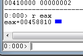

Если мы поищем значение **4588**, мы увидим, что в списках значение всегда по этому адресу, который включает в себя заголовок.

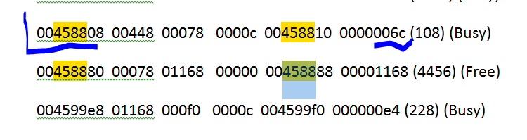

Там мы видим, что блок **BUSY**, размер **USER 0x6С** и общий размер, который равен **0x78**, т.е. **120** десятичных байт. Если мы сделаем то же самое с помощью **WINDBG** используя команду **!HEAP -A 0x00410000**.

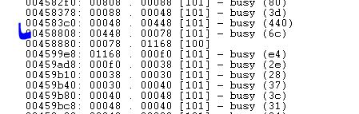

То увидим, что информация схожа.

Как и раньше в **WINDBG** мы увидим блок информации.

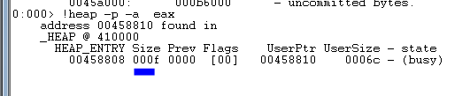

Размер был умножен на **8**, чтобы увидеть сумму.

```console
HEX(0xF * 0x8)
```

**0x78** т.е. **120** десятичных.

В **MONA**

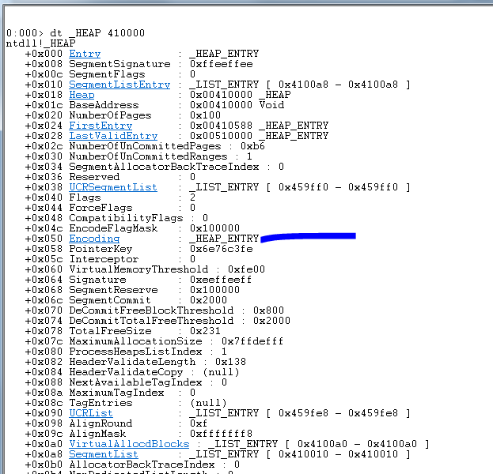

Как всегда, в позиции **0x50**, у нас есть ключи, чтобы расшифровать их. Давайте посмотрим на них.

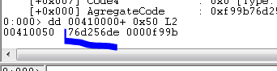

Один из двух ключей совпадает с тем, который показывает нам **MONA**.

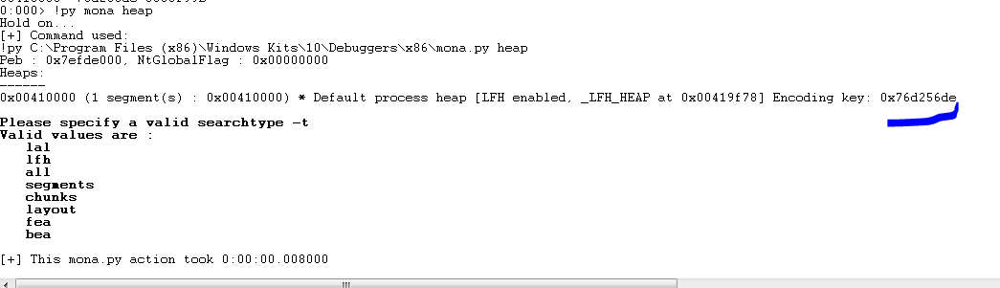

У нас есть команда в **MONA**, про которую я не знаю есть ли она в **WINDBG**.

```console
!py mona heap -t layout -v
```

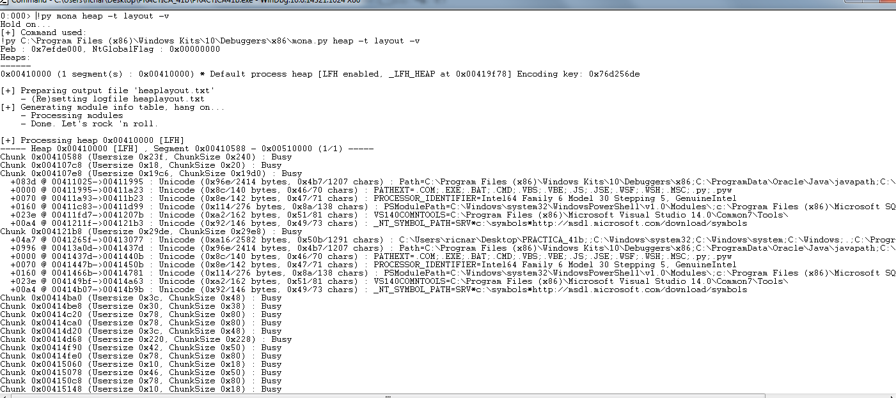

Вывод очень длинный, но **MONA** пытается увидеть, что он использует блок кучи и перечисляет их.

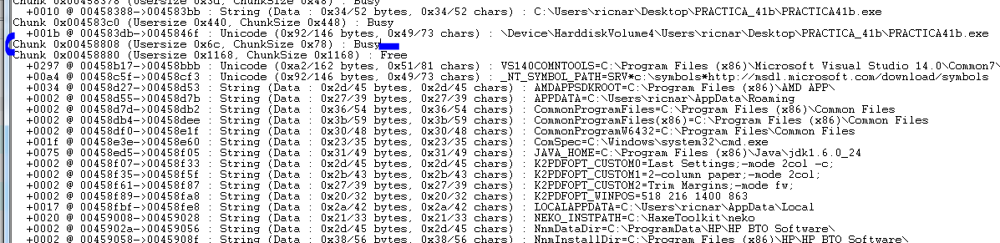

Здесь это наш блок.

Если я посмотрю содержимое любого из них.

```console
0:000> da 00458d27
00458d27 "AMDAPPSDKROOT=C:\Program Files \("…..
```

Содержимое такое же как и показывает список.

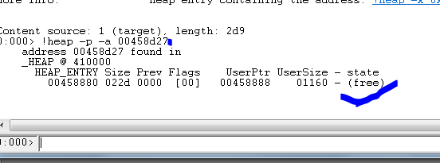

Данные соответствуют. Блок свободен. Это означает, что программа сохранила там информацию, но блок был освобожден для нового использования.

В этом случае нет, но мы должны всегда обращать внимание на выделенные объекты, потому что они имеют **VTABLES**, которые являются виртуальными таблицами, которые могут быть перезаписаны и могут заставить нас контролировать выполнение программы.

Это пример для Вас, чтобы увидеть как выглядит там **ОБЪЕКТ** и **VFTABLE**. Хорошая цель для перезаписи если есть переполнение.

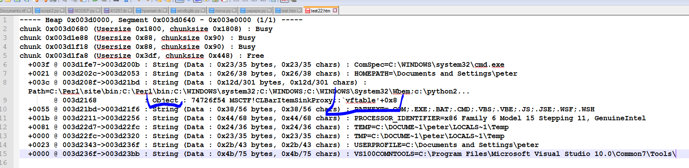

В **IDA** мы можем видеть байты, которые мы изменили, чтобы установить бесконечный цикл. Их можно увидеть через **EDIT→ PATCHED BYTES**.

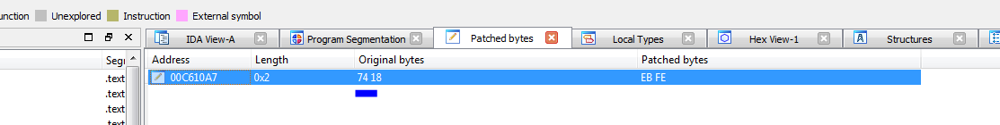

В **WINDBG** на вкладке **MEMORY** я перехожу на адрес где находятся байты **EB FE** и меняю их на **74 18**.

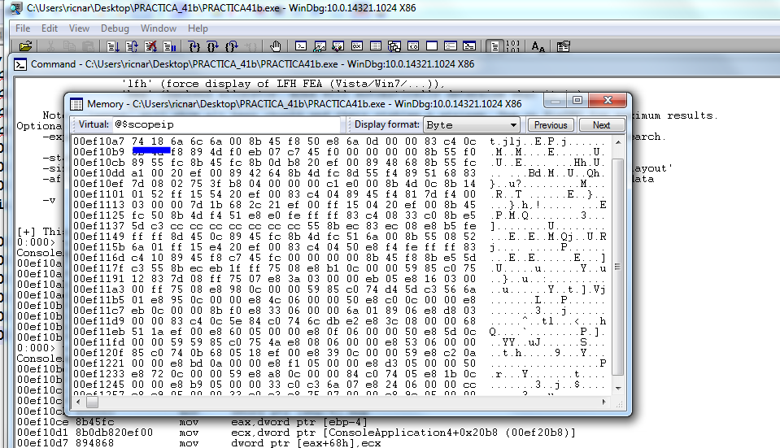

Если сейчас я исполняю команду **U EIP**, я увижу, какое изменение произошло в условном переходе.

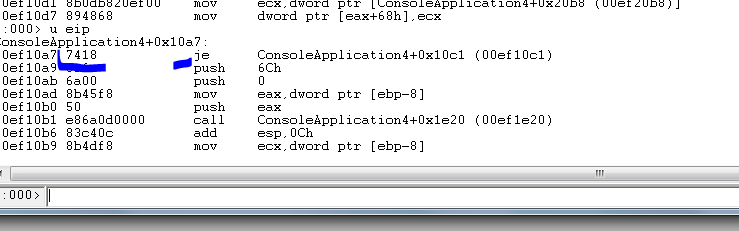

Я могу нажать **RUN** или **G** и принять скрипт и продолжить работу программы до сбоя. Мы знаем, что **PAGE HEAP** не помечена как **FULL**. Таким образом, нет никакой истории, и программа не будет терпеть сбой при записи. Сбой будет только при переходе на выполнение.

Я буду добираться до нужного места, как и раньше, хотя адреса будут разными.

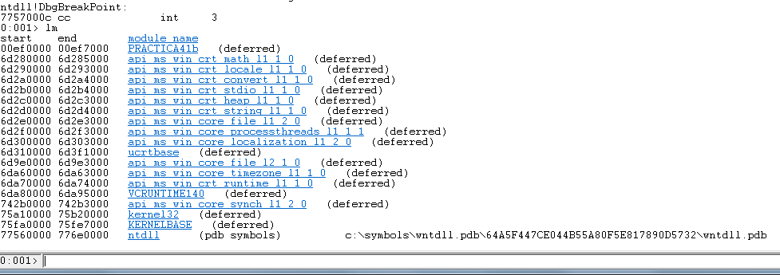

На этот раз появилось имя.

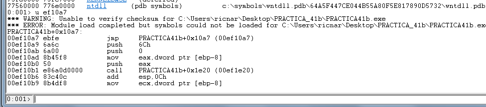

Я посмотрю на кучу с помощью **MONA**.

```console
0:000> !py mona heap -a
Hold on...
[+] Command used:
!py C:\Program Files (x86)\Windows Kits\10\Debuggers\x86\mona.py heap -a
Peb : 0x7efde000, NtGlobalFlag : 0x00000000
Heaps:
------
0x004f0000 (1 segment(s) : 0x004f0000) * Default process heap [LFH enabled, _LFH_HEAP at 0x004fb348] Encoding key: 0x13f60872
```

И я вижу блоки.

```console
!py mona.py heap -h 0x004f0000 -t chunks
```

И регистр **EAX** равен.

```console
0:000> r eax

EAX = 0053a720
```

Поэтому блок сейчас такой.

> **0053a718 00448 00078 0000c 0053a720 0000006c \(108\) \(Busy\)**
>
> 0053a790 00078 01728 00000 0053a798 00001728 \(5928\) \(Free\)
>
> 0053beb8 01728 00128 00014 0053bec0 00000114 \(276\) \(Busy\)
>
> 0053bfe0 00128 00020 00003 0053bfe8 0000001d \(29\) \(Busy\)

Я изменяю бесконечный цикл на условный переход.

```console
00ef10a7 7418 je PRACTICA41b+0x10c1 \(00ef10c1\)
```

Я нажимаю **G** и затем клавишу **ENTER** в скрипте, для того чтобы продолжить выполнение.

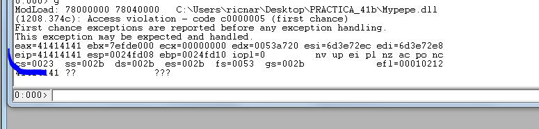

Программа перешла, чтобы выполнить код. Давайте посмотрим, что она говорит нам о блоке.

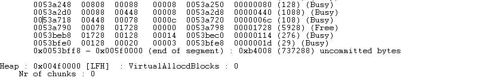

То же самое. Посмотрим на макет.

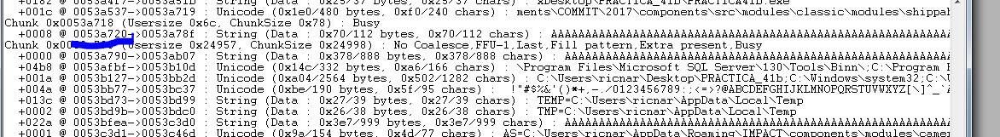

Команда показывает нам блок полный **A** и следующий также с **A**. WINDBG показывает мне следующий блок размером **0x4141**. Размер выглядит поврежденным.

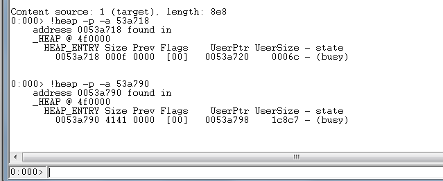

Если мы используем **-X**, **WINDBG** сообщит нам, поврежден ли блок.

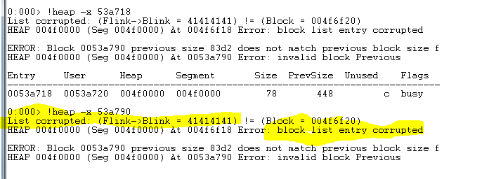

Хорошо. **WINDBG** даёт нам много информации. **MONA** немного больше. Она имеет некоторые команды для работы с объектами, которые мы пока не может использовать. Все это будет помогать нам в практики и поможет решить оставленное упражнение из **44** главы. Мы увидим в следующей части.

* * *

Автор оригинального текста — Рикардо Нарваха.

Перевод и адаптация на английский  язык — IvinsonCLS.

Перевод и адаптация на русский язык — Яша Яшечкин.

Перевод специально для форума системного и низкоуровневого программирования - WASM.IN

02.05.2018

[**Источник: ricardonarvaja.info**](http://ricardonarvaja.info/WEB/IDA%20DESDE%20CERO/CURSO%20DE%20IDA%20TUTES/45-INTRODUCCION%20AL%20REVERSING%20CON%20IDA%20PRO%20DESDE%20CERO.docx)
