# Часть 47

Давайте попробуем прояснить некоторое вещи, которые мы ещё не упоминали в теме о куче и которые очень необходимы. Мы будем делать это снова смотря на упражнение **PRACTICA** **44** о котором мы говорили в **WINDOWS** **7.** Мы снова посмотрим на него же в тех же программах.

Хорошо заметить, что способ обработки кучи очень сильно изменился от **XP** к **WINDOWS** **7**, и имеет больше изменений даже до **WINDOWS** **10**. Поэтому способы эксплуатации, которые работали в одной системе, могут не работать в другой.

Верно также, что мы должны очень много бороться с типами эксплоитов, который эксплуатирует переполнение кучи они не просты в большинстве случаев и не всегда работают на **100%**.

Хорошо. Мы будем рассматривать упражнение из **44** части.

[http://ricardonarvaja.info/WEB/INTRODUCCION AL REVERSING CON IDA PRO DESDE CERO/EJERCICIOS/PRACTICA\_44.7z](http://ricardonarvaja.info/WEB/INTRODUCCION%20AL%20REVERSING%20CON%20IDA%20PRO%20DESDE%20CERO/EJERCICIOS/PRACTICA_44.7z)

Мы будем использовать **WINDBG** вне **IDA**.

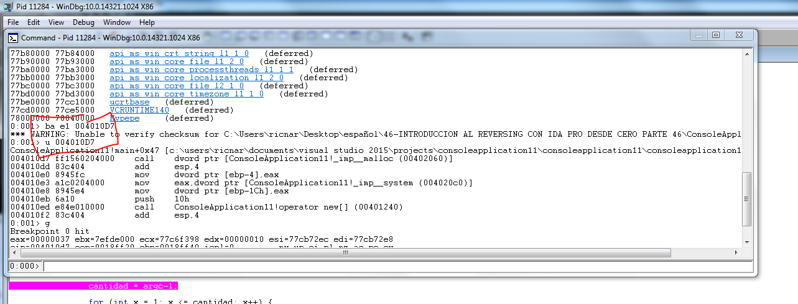

Мы уже увидели, что начальный адрес функции **MALLOC** находится по адресу **0x004010D7**. Поэтому я помещаю **BP** в **WINDBG** с помощью команды

**BA E1 0x004010D7**

Поскольку мы знаем, что размер был **NUMERO**, которые мы передавали умноженное на **4**.

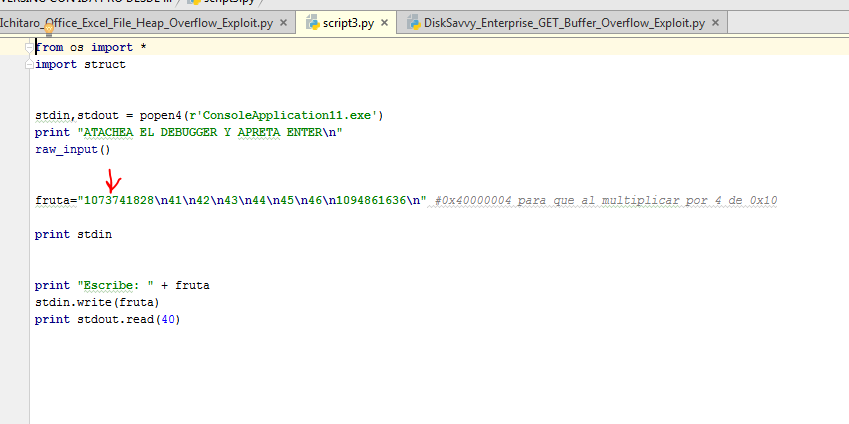

То число, которое передается в **HEX** виде равно

**HEX\(1073741828\)** или **0x40000004**

Умножение на **4** даёт мне значение **0x10**

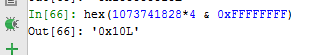

Поэтому функция выделяет нам **0x10** байт**.**

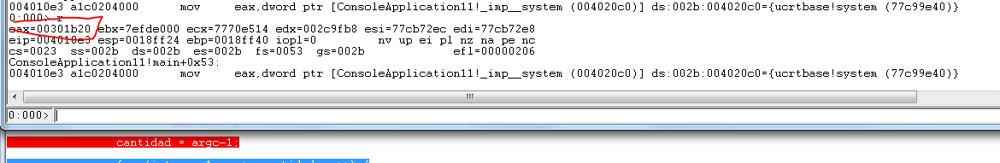

При переходе через функцию **MALLOC** с помощью клавиши **F10** я вижу, что в моём случае, выделение памяти происходит по адресу **0x00301B20**

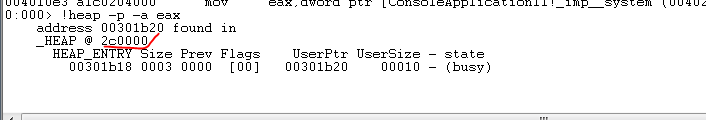

Выделенная память принадлежит к блоку размером **0x10** байт **USERSIZE**, т.е. будет **0x10** байт пространства, которое резервирует память для использования пользователем, без учета заголовка.

Я использую команду **!HEAP** -**A** **0x2C0000** для того, чтобы увидеть чанки кучи.

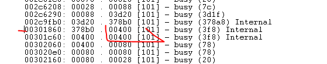

У нас есть чанк по адресу **0x301860** длиной **0x400** байт, который будет иметь мой адрес внутри, потому что адрес **0x301B20** включен в этот блок, который начинается по адресу **0x301860** и прибавляя **0x400** байт получим адрес где заканчиваться чанк, т. е. **0x301C60**.

**HEX**\(**0x301860** + **0x400**\) = **0x301C60**

Посмотрим, что скажет нам **MONA** в этом случае.

Я загружаю её с помощью

.**LOAD** **PYKD**.**PYD**

И затем ввожу команду

**!PY** **MONA.PY HEAP -H 0x2C0000 -T CHUNKS**

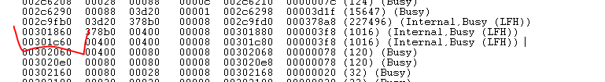

**WINDBG** показывает нам тот же чанк с размером **0x400** байт за исключением того, что в **INTERNAL** говорит нам, что он принадлежит **LFH**.

**LOW FRAGMENTATION HEAP**

Можно написать много туториалов о **LFH**. Это сложно. Мы попытаемся, чтобы у Вас не закружилась голова и пойдем частям. Это будет первая. В следующей части мы постараемся увидеть, сможем ли мы понять и следовать распределению.

На самом деле **LFH** похож на специальную кучу внутри стандартной кучи, только с немного другими правилами. Основная идея состоит в том, чтобы иметь кучу, чтобы избежать фрагментацию, другими словами, чтобы вы выделяли блоки разбросанные в памяти и очень разделенные.

Фрагментация кучи происходит, когда выделяются небольшие несмежные блоки. Когда это происходит, выделения памяти может быть неудачным, хотя может быть достаточно общей памяти в куче для того, чтобы удовлетворить запрос. Тем не менее, поскольку никакой блок свободной памяти не является достаточно большим, запрос на выделение может быть неудачным. Для приложений с использованием небольшого объёма памяти, стандартная куча подходит и проблем не будет, там выделения не будут неудачными из-за фрагментации кучи. Тем не менее, если приложения распределяют память часто с использованием разных размеров, эти выделения памяти могут быть неудачными из-за фрагментация кучи.

Мы увидим несколько таблиц и в следующих частях мы попытаемся понять как система принимает решение выделять в **LFH** или в стандартной **КУЧE** и как это работает.

Принимайте все это спокойно и с терпением, я знаю, что никому не нравится эта вся ерунда. Мы будем все это делать потихоньку с тем же примером, который остановлен в **WINDBG**.

Теперь, имея адрес базы кучи, мы можем увидеть её содержимое с помощью команды
**DT** \_**HEAP** адрес

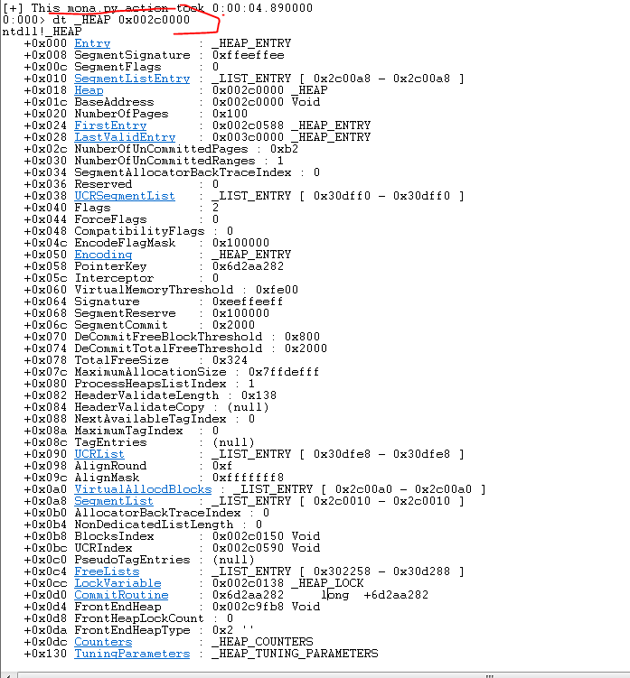

Здесь находится главная таблица кучи, которую можно увидеть с помощью команды **DT** **\_HEAP** и адреса таблицы, который в моем случае равен **0x2C0000**.

В позиции **0xB8** находится **BLOCKSINDEX**, который указывает на другую таблицу. В моем случае эта таблица находится по адресу **0x2C0150**, т.e. **0x150** байт от начал кучи.

**+0x0B8** **BLOCKSINDEX : PTR32** **VOID**

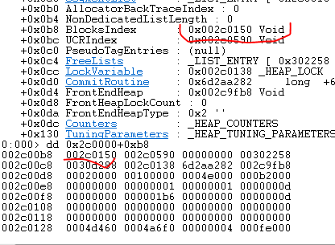

Для просмотра содержимого этой таблицы **BLOCKSINDEX** используется следующая команда
**DT** **\_HEAP\_LIST\_LOOKUP** адрес

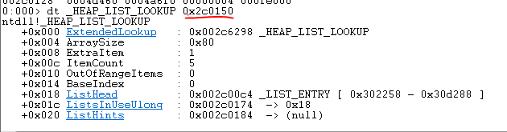

Мы попытаемся показать вам таблицы и объяснить минимальные нужные знания, и вернемся позже к этой таблице.

Следующая важная таблица происходит из главной таблицы значения **FRONTENDHEAP**

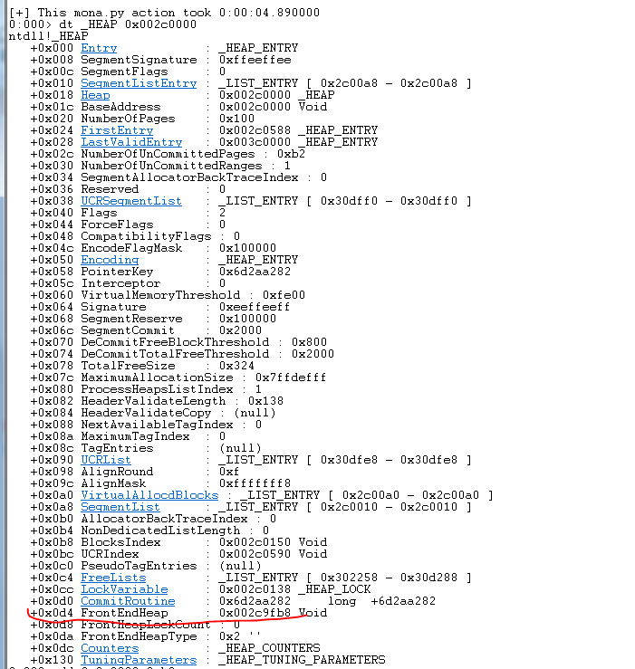

В моём случае значение указывает на адрес **0x2C9FB8**. Помните, что при поиске моего чанка в списке было так

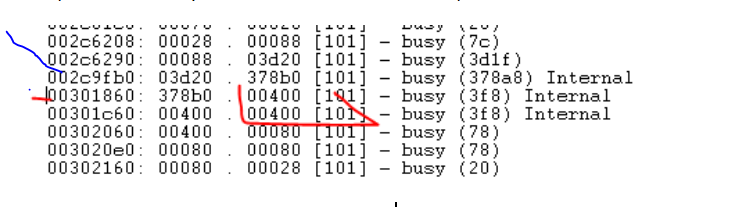

Случайно по адресу **0x2C9FB0** начинались эти чанки **INTERNAL** **LFH.** Это показывает положение **LOW** **FRAGMENTATION** **HEAP** что является **FRONTEND** **HEAP**, в то время как стандартная куча называется **BACKEND** **HEAP**.

Здесь ясно видно, что **LFH** это куча внутри другой кучи. Он начинается там, поскольку это был чанк больше, чем основная куча, но внутри он имеет другую кучу.

Давайте продолжать.

Для просмотра содержимого **LFH** через указатель **FRONTENDHEAP** используется команда
**DT** **\_LFH\_HEAP** адрес

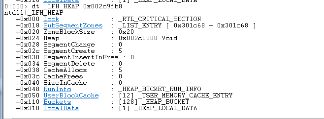

Осталось немного потерпеть.

В качестве любопытства давайте отметим, что смещение **0x18** **SUBSEGMENTZONES** имеет указатель на третий блок **INTERNAL** **LFH**.

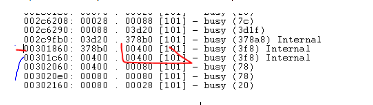

Внутри **LFH** есть пара структур более важных. Одна из них это **\_HEAP\_LOCAL\_DATA**, которая находится по смещению **0x310**, чьё содержимое можно увидеть с помощью команды

**DT** **\_HEAP\_LOCAL\_DATA** адрес

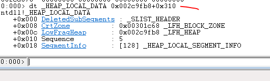

**SEGMENTINFO** это список из **128** байт. Давайте посмотрим, что там есть. В том же **WINDBG** делаем щелчок на **SEGMENTINFO**, и нам покажется список. Если это не сработало, тогда так.

**DT** **\_HEAP\_LOCAL\_SEGMENT\_INFO**

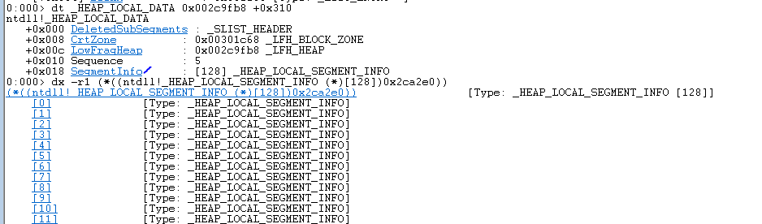

и перемещая мышь над номерами \[**0\],** \[**1**\], и т.д. нам показывается адрес.

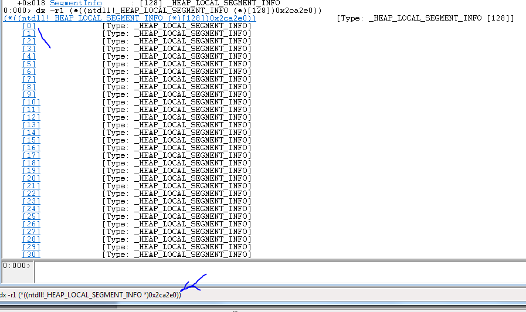

Это будет первый **LOCAL** **SEGMENT** **INFO**. Мы можем увидеть, что значит его содержимое, нажимая например на ячейку **\[0\].**

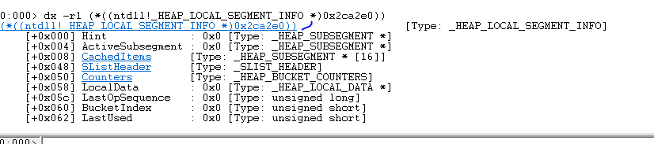

Мы видим, что есть список под названием **CACHEDITEMS** по смещению **0x8** поэтому мы можем нажать туда. В моём случае первый **SEGMENTINFO** начинается по адресу **0x2CA2E8**.

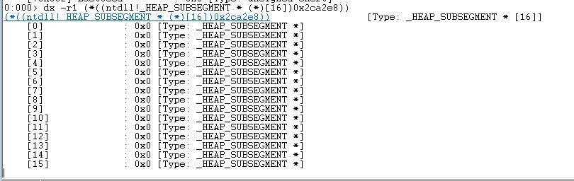

Каждый из них является типом **\_HEAP\_SUBSEGMENT**.

Чтобы увидеть содержимое, Вы должны использовать команду

**DT** **\_HEAP\_SUBSEGMENT** адрес

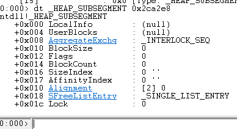

И после всего этого мы прибудем туда куда хотим, т.е. внутрь структуры **AGGREGATEEXCH**, которая находится по смещению **0x8.** Это будет \_**INTERLOCK**\_**SEQ.** Её может показать следующая команда

**DT \_INTERLOCK\_SEQ а**дрес

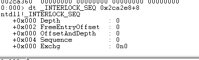

Также, сделав щелчок в **WINDBG**

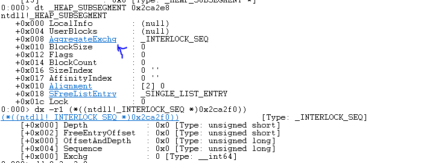

Хорошо, наша задача была дойти до поля **FREEENTRYOFFSET**. В этом случае оно равна нулю. Давайте напишем правильно как дойти до этого места, если мы увидим определение этого значения.

**FREEENTRYOFFSET** - это **2-**байтное целое число, которое хранит значение. При добавлении к адресу \_**HEAP**\_**USERDATA**\_**HEADER**, результат приводит к указателю на следующее местоположение для освобождения или выделения памяти.

Другими словами это зависит от текущего значения которое будет следующим блоком, который будет выделен или освобожден. К нему добавляет другое поле, которое называется \_**HEAP**\_**USERDATA**\_**HEADER**. Давайте посмотрим где находится это.

Это значение приходит из той же предыдущей таблицы, только находится по смещению **0x4** т.е. это **USERBLOCKS**

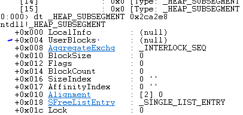

И структура дампиться с помощью команды

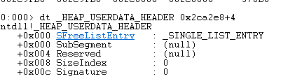

Хорошо. Потихоньку мы получаем значения, чтобы собрать головоломку. Мы видим, что **USERBLOCKS** находится прямо над \_**INTERLOCK**\_**SEQ** который является тем у которого есть указатель на **FREEENTRYOFFSET** и поскольку переполняя данные чанка он бы смог переписать его и изменить следующий чанк, который вы хотите выделить. Здесь на картинке это видно более ясно.

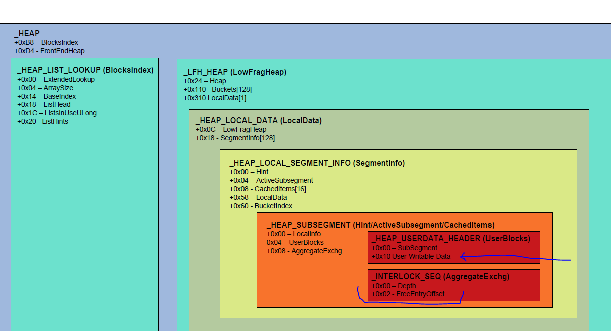

Здесь на картинки это видно более понятно. Вы видите заголовок **\_HEAP\_USER\_DATA** который мы видели, прямо под которым находится область записанная пользователем, и прямо под ней находится структура **\_INTERLOCK\_SEQ** которая является той, которая имеет значение, и которая решает, что является следующим.

С этим у нас есть видение основных таблиц и их значений. В следующей части мы увидим помогает ли нам изучение того, что программа решает выделить память в стандартной куче или в **LFH**.

**Автор текста: Рикардо Нарваха** - **Ricardo** **Narvaja** \(**@ricnar456**\)
Перевод на русский с испанского: **Яша\_Добрый\_Хакер\(Ростовский фанат Нарвахи\).
Исправление ошибок и неточностей - репетитор и носитель испанского языка.**
Перевод специально для форума системного и низкоуровневого программирования — **WASM.IN
02.06.2018
Версия 1.0**
