# Часть 48

Мы будем стараться продолжать обсуждать распределение, чтобы увидеть сможем ли мы понять логику распределения и увидеть, что говорит программа, если распределение происходит в **LFH** или в **СТАНДАРТНОЙ КУЧЕ**.

Мы будем продолжать использовать исполняемый файл из того же практического упражнения.

Мы загружаем исполняемый файл вне **IDA** из консоли, не используя скрипт **PYTHON**.

Мы вводим номер, который нас просит программа **\(1073741828\)**, присоединяем **WINDBG** к **IDA** как отладчик, помещаем **BP** на функцию **MALLOC** и нажимаем клавишу **ENTER**.


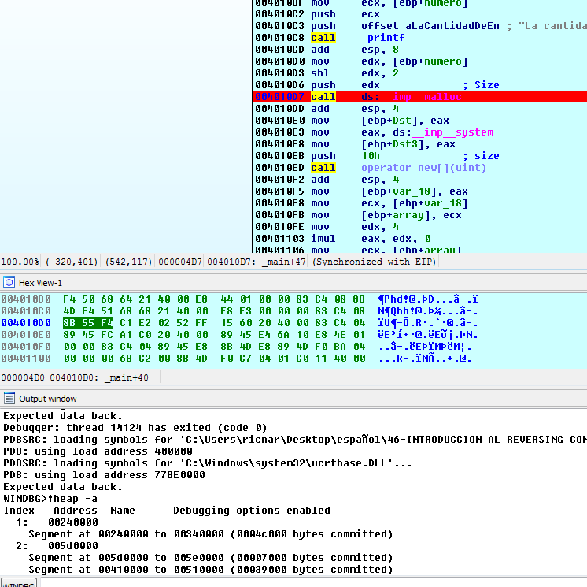

Если мы трассируем вход в функцию **MALLOC** с помощью клавиши **F7** мы увидим, что размер помещается в регистр **ESI**. Программа сравнивает это значение. Если размер больше чем значение **0xFFFFFFE0**, то, так как в нашем случае это значение равно **0x10**, то у нас нет проблем. Программа помещает в стек размер как аргумент и прямо там мы видим, что программа помещает в стек, в моём случае, значение **0x240000**. Это одна из куч, поэтому мы уже знаем, что программа будет работать с ней.

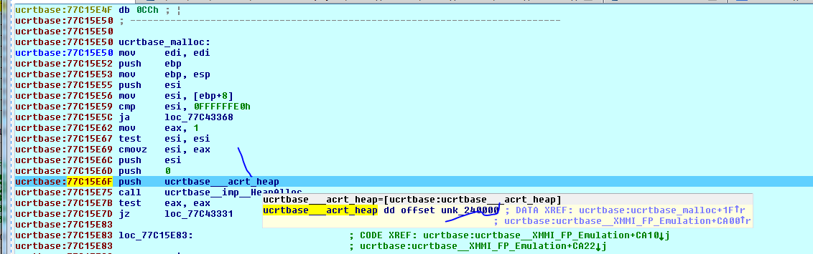

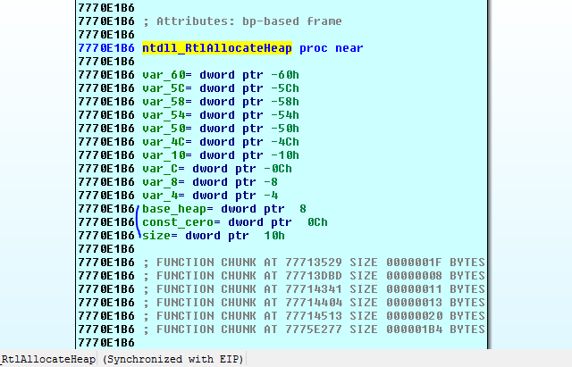

Здесь мы можем создать функцию с помощью правого щелчка и выбрав пункт **CREATE FUNCTION** и переименовать аргументы, которые были размером, нулем и базой кучи.

Это структура кучи. Я оставляю её для копирования и вставки.

```console
# +0x000 Entry : _HEAP_ENTRY
# +0x008 SegmentSignature : Uint4B
# +0x00c SegmentFlags : Uint4B
# +0x010 SegmentListEntry : _LIST_ENTRY
# +0x018 Heap : Ptr32 _HEAP
# +0x01c BaseAddress : Ptr32 Void
# +0x020 NumberOfPages : Uint4B
# +0x024 FirstEntry : Ptr32 _HEAP_ENTRY
# +0x028 LastValidEntry : Ptr32 _HEAP_ENTRY
# +0x02c NumberOfUnCommittedPages : Uint4B
# +0x030 NumberOfUnCommittedRanges : Uint4B
# +0x034 SegmentAllocatorBackTraceIndex : Uint2B
# +0x036 Reserved : Uint2B
# +0x038 UCRSegmentList : _LIST_ENTRY
# +0x040 Flags : Uint4B
# +0x044 ForceFlags : Uint4B
# +0x048 CompatibilityFlags : Uint4B
# +0x04c EncodeFlagMask : Uint4B
# +0x050 Encoding : _HEAP_ENTRY
# +0x058 PointerKey : Uint4B
# +0x05c Interceptor : Uint4B
# +0x060 VirtualMemoryThreshold : Uint4B
# +0x064 Signature : Uint4B
# +0x068 SegmentReserve : Uint4B
# +0x06c SegmentCommit : Uint4B
# +0x070 DeCommitFreeBlockThreshold : Uint4B
# +0x074 DeCommitTotalFreeThreshold : Uint4B
# +0x078 TotalFreeSize : Uint4B
# +0x07c MaximumAllocationSize : Uint4B
# +0x080 ProcessHeapsListIndex : Uint2B
# +0x082 HeaderValidateLength : Uint2B
# +0x084 HeaderValidateCopy : Ptr32 Void
# +0x088 NextAvailableTagIndex : Uint2B
# +0x08a MaximumTagIndex : Uint2B
# +0x08c TagEntries : Ptr32 _HEAP_TAG_ENTRY
# +0x090 UCRList : _LIST_ENTRY
# +0x098 AlignRound : Uint4B
# +0x09c AlignMask : Uint4B
# +0x0a0 VirtualAllocdBlocks : _LIST_ENTRY
# +0x0a8 SegmentList : _LIST_ENTRY
# +0x0b0 AllocatorBackTraceIndex : Uint2B
# +0x0b4 NonDedicatedListLength : Uint4B
# +0x0b8 BlocksIndex : Ptr32 Void
# +0x0bc UCRIndex : Ptr32 Void
# +0x0c0 PseudoTagEntries : Ptr32 _HEAP_PSEUDO_TAG_ENTRY
# +0x0c4 FreeLists : _LIST_ENTRY
# +0x0cc LockVariable : Ptr32 _HEAP_LOCK
# +0x0d0 CommitRoutine : Ptr32 long
# +0x0d4 FrontEndHeap : Ptr32 Void
# +0x0d8 FrontHeapLockCount : Uint2B
# +0x0da FrontEndHeapType : UChar
# +0x0dc Counters : _HEAP_COUNTERS
# +0x130 TuningParameters : _HEAP_TUNING_PARAMETERS
```

Мы не будем создавать структуры в **IDA** со всеми полями. Мы только создадим пустую структуру, чтобы переименовывать только те поля, которые мы используем.

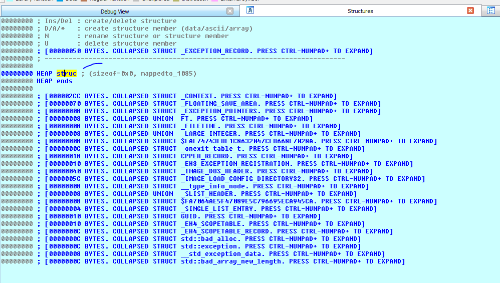

Я создаю структуру через вкладку **STRUCTURES** с помощью клавиши **INSERT** и затем расширяю её до значения **0x130** байт. Позже я увижу, нужно ли мне расширить её ещё больше.

Мы уже знаем как это сделать. Я добавляю однобайтовое поле, помещая курсор на слово **ENDS** и нажимаю клавишу **D**, а затем нажимаю правую кнопку, и выбираю пункт **EXPAND**, и ввожу значение **0x12F**.

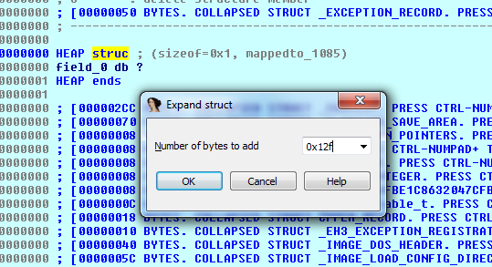

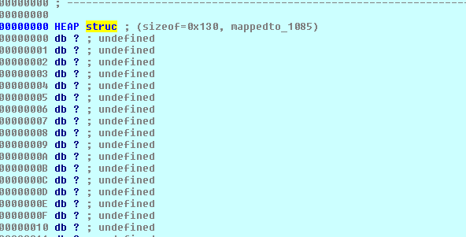

Я нахожусь в структуре размером **0x130** байт. Структура будет немного больше из-за длины последнего поля, но позже мы увидим всё ли правильно.

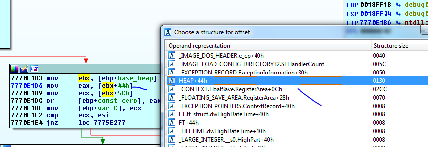

Здесь программа использует смещение **44**, а ниже смещение **5C**. Я нажимаю **T** на обоих полях, и выбираю структуру **HEAP**.

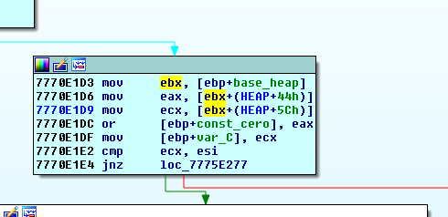

Теперь я должен определить эти поля в структуре.

>**\# +0x044 FORCEFLAGS : UINT4B**
>
>\# +0x048 CompatibilityFlags : Uint4B
>
>\# +0x04c EncodeFlagMask : Uint4B
>
>\# +0x050 Encoding : \_HEAP\_ENTRY
>
>\# +0x058 PointerKey : Uint4B
>
>**\# +0x05C INTERCEPTOR : UINT4B**

Это два поля по **4** байты. Я переименую их. Я иду по смещению **0x44** и нажимаю **D** до тех пор пока не появятся буквы **DD**.

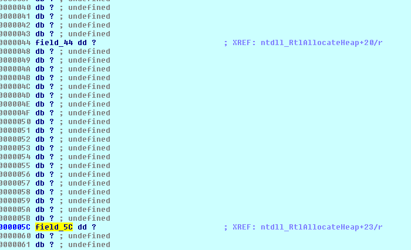

И я переименую их.

Хорошо. Мы не имеем представление что это и для чего это нужно, но по крайнер мере это выглядит симпатично.


Очевидно, не все поля или не всё, что делает программа мы будем интерпретировать, но постепенно мы увидим, что делает программа.

Как только мы дотрассируем до этого места, регистр **EBX** принимает значение базы кучи, **240000** в моем случае. Я могу пойти пойти этому адресу и назначить этому адресу структуру кучи, которая на данный момент что-то имеет.

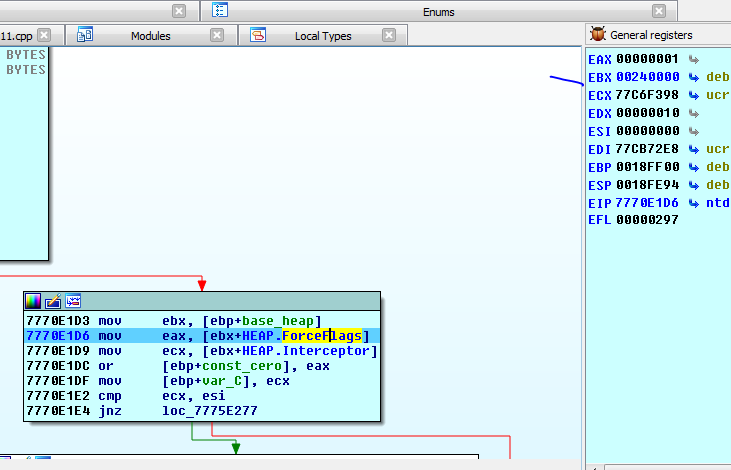

С помощью сочетания **ALT + Q** или **CONVERT TO STRUCT VARIABLE** мы можем конвертировать данные в структуру.

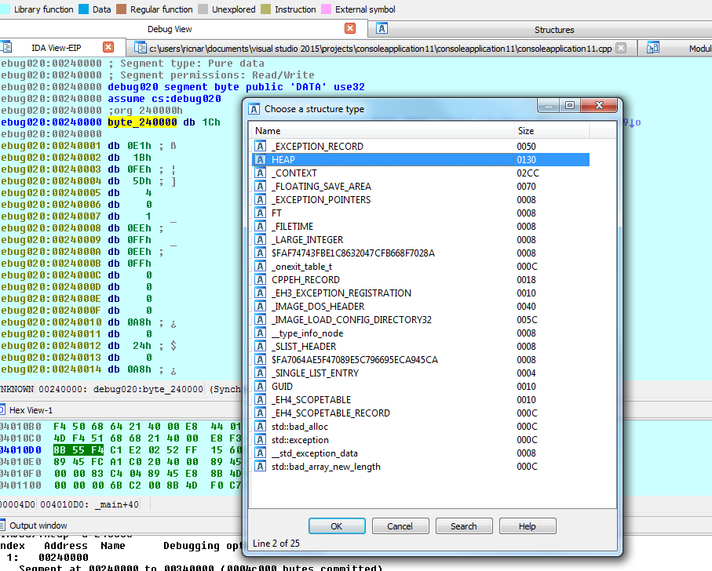

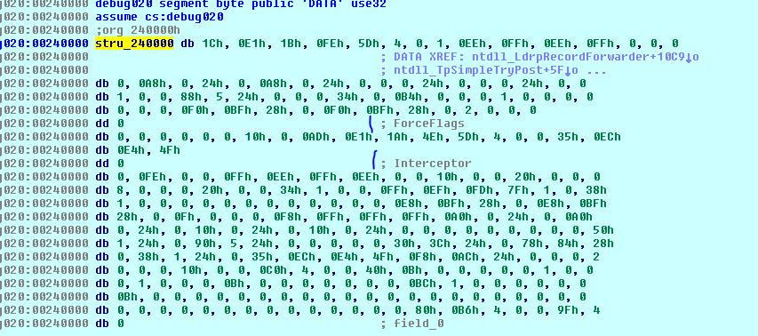

Выглядит не очень симпатично, но там видны поля **FORCEFLAGS** и **INTERCEPTOR** равные нулю.

Это совпадает c результатом отладчика

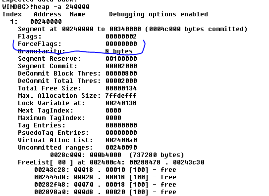

И с помощью такой команды видны значения

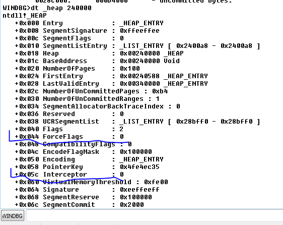

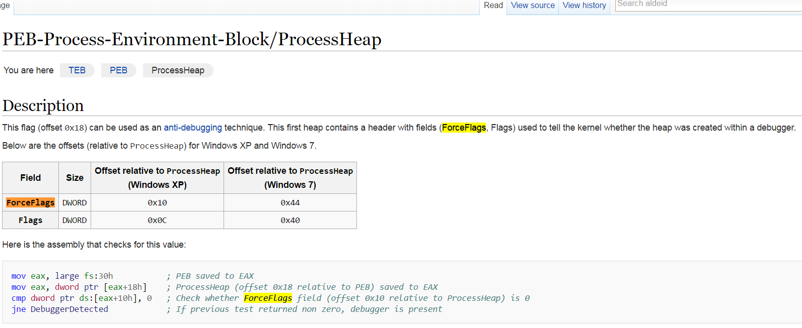

Я скопировал исполняемый файл в другую папки не закрывая предыдущий файл, чтобы проверить его. Я открываю второй файл непосредственно во второй **IDA** без присоединения, но прямо внутри неё и это значение изменяться на **0x40000060**. Это значение, указывает на то отлаживается ли программа.

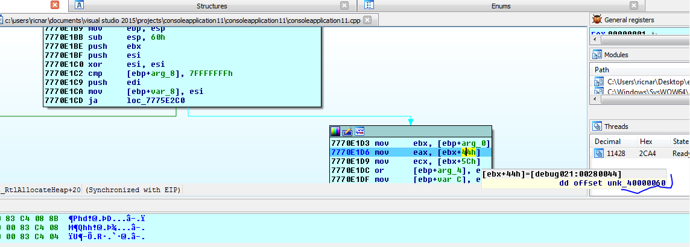

Это вывод для файла, который отлаживается.


А это вывод для файла, который просто отрыт в отладчике.

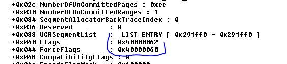

Здесь отладчик говорит, что среди прочих вещей, этот флаг может быть использован как **АНТИОТЛАДОЧНАЯ ТЕХНИКА**.

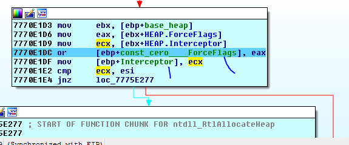

Аргумент, который был равен нулю повторно используется в инструкции **OR** с полем **FORCEFLAGS**. Таким образом, поскольку аргумент был равен нулю, это выражение будет также равно **FORCEFLAGS**.

И регистр **ECX**, который содержит переменную **INTERCEPTOR** сохраняет её в переменную **VAR\_C**, поэтому я переименовываю эту переменную, хотя я не нашел никаких объяснений для чего она нужна, но позже мы увидим, то что я увидел, это то что переменная не меняется если программа отлаживается или не равна нулю в обоих случаях.

Поскольку переменная **INTERCEPTOR** в моем случае равна нулю и регистр **ESI** равен нулю, программа переходит на красную стрелку так как значения равны.

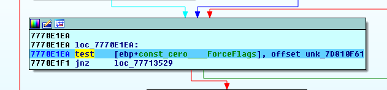

Затем программа тестирует переменную **FORCEFLAGS**, которая равна нулю по отношению к константе **7D810F61**. Результат будет равен нулю и программа будет идти по красной стрелкой. \(Если программа открыта в отладчике, то программа будет идти по зеленой стрелке\)

Программа сравнивает, значения. Если размер равен нулю, а в нашем случае он равен **0x10**, поэтому программа пойдет сюда.

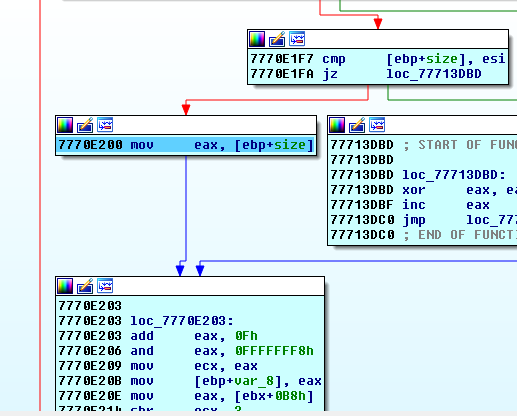

Программа прибавляет к регистру **EAX** значение **0xF**, а затем исполняет инструкцию **AND** с параметром **-8**, что будет равно **0x18**. Это будет равно полному размеру, чтобы распределить добавленный заголовок и быть умноженным на **8**.

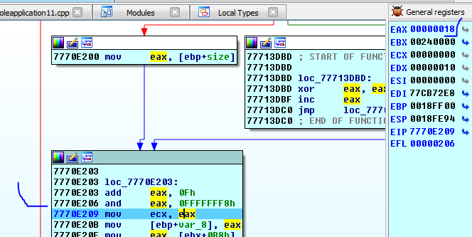

В регистре **EAX** остается значение полного размера, равное **18**.

Затем программа сохраняет в переменную **VAR\_8** это значение, поэтому я переименую эту переменную.

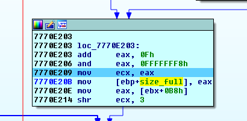

Затем программа читает поле **0xB8** которое является **BLOCKINDEX**, поэтому я переименую его в структуре и здесь я нажимаю **T** для того чтобы освежить информацию.

```console
# +0x0B8 BLOCKSINDEX : PTR32 VOID
```

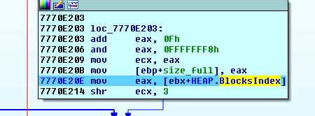

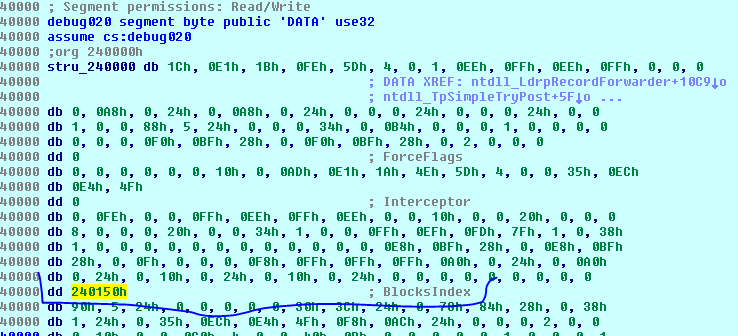

Поэтому это значение является указателем, которое равно **0x240150** в моём случае.
Давайте запомним, что

```assembly
shr eax, 3 ;Signed division by 8
```

И это то же самое что и знаковое деление переменной **SIZE\_FULL** на **8**. Помните также, что размер, который появился в заголовках как общий размер, нужно было умножить на **8**, чтобы найти общий размер блока.

Например, скопировав из предыдущего туториала поле **USERSIZE 0x10**, мы получим общий размер **0x3**, умножив который на **8**, мы получим общее количество байтов.


```console
Python>hex(0x3*0x8)
0x18
```

Это обратная операция для переменной **SIZE\_FULL** для нахождения значения **0x3** при делении на **0x8**.

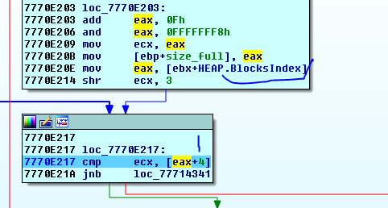

Мы видим, что теперь программа начинает работать со структурой **BLOCKSINDEX**, которую мы видели в последнем туториале. \(Следующее изображение из предыдущего туториала\)

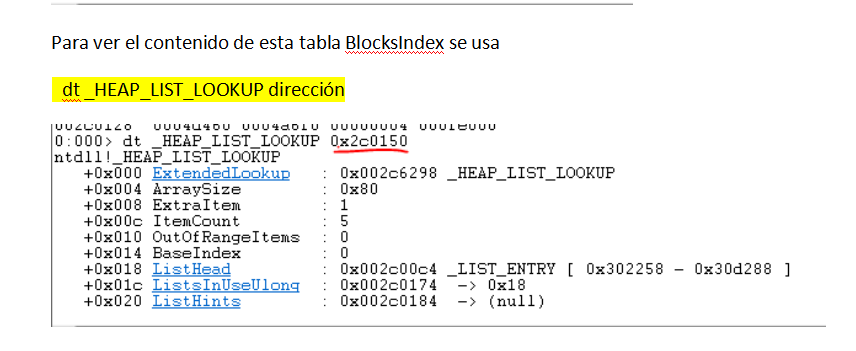

Поэтому мы можем создать новую пустую структуру из **0x24** байт, чтобы ввести последний **DWORD**.


Поэтому сейчас я нажимаю **T** на инструкции и выбираю эту новую структуру.

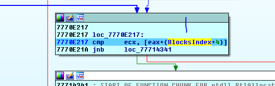

Теперь я должен только переименовать поле, которое находится по смещению **0x4** в **ARRAYSIZE**.

Поскольку регистр **EAX** указывает на начало этой структуры, я могу пойти в память и назначить структуру с помощью **ALT + Q**.

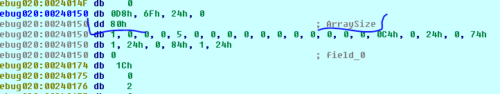

**ARRAYSIZE** равен **0x80** в этом случае, остальные поля по-прежнему не определены, поэтому все это выглядит некрасивым.

Поскольку значение **ARRAYSIZE** меньше, программа не идет на розовые блоки.

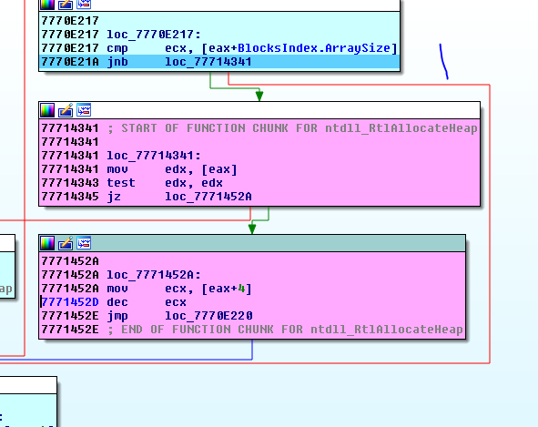

Мы находимся в этой части

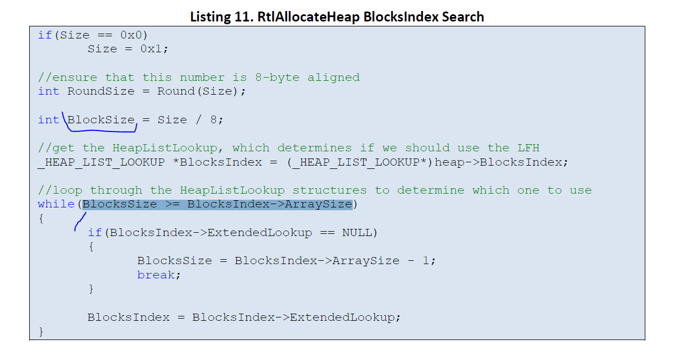

Здесь **FULL SIZE** делится на **8**. Это значение присваивается переменной **BLOCKSIZE**. Мы все еще храним это значение в регистре **ECX**. Мы не сохраняем его, только сравниваем, и мы видим, что программа также делает, сравнивая с **ARRAYSIZE** так же, как и наши.

Программа вычитает **1** из значения **ARRAYSIZE**, получая значение **0x7F** и снова сравнивает результат со значением **0x3**, которое находится в регистре **ECX**.

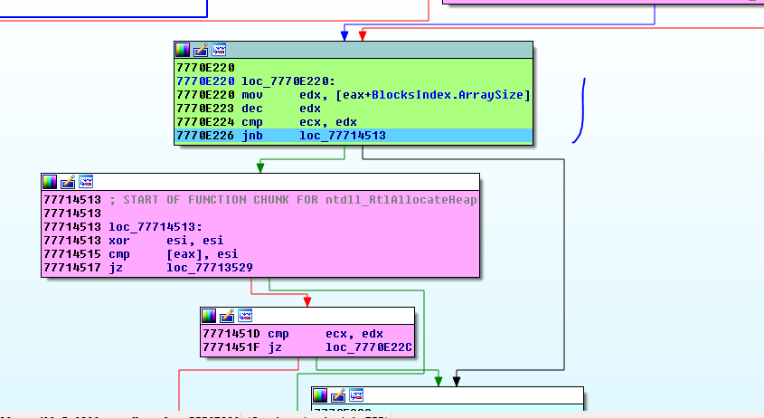

Поскольку значение продолжает быть меньше, программа не идет на розовые блоки.

Сейчас программа прочитает поле **0x14** структуры **BLOCKLIST**, которое называется **BASEINDEX**, поэтому я переименую его.

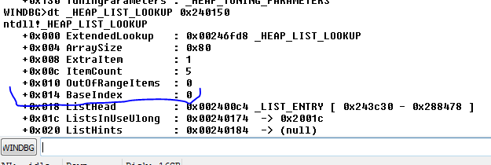


Поскольку **BASEINDEX** равен **0**, регистр **ECX** по-прежнему продолжает быть равен значению **0x3** т.е. **BLOCKSIZE**.

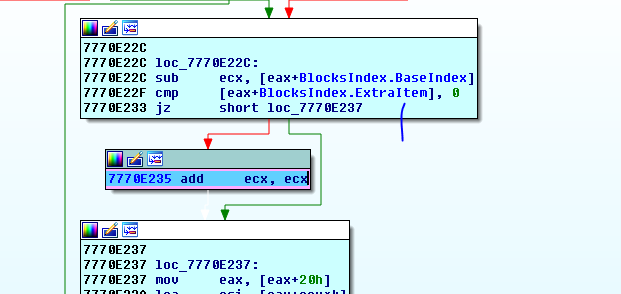

Поскольку поле **EXTRAITEM**, которое находится по смещению **0x8**, равно **1** \(я не буду повторять, как переименовать поле в структуре\), мы доходим до инструкции **ADD ECX, ECX**, где программа умножает на **2** значение **BLOCKSIZE**.

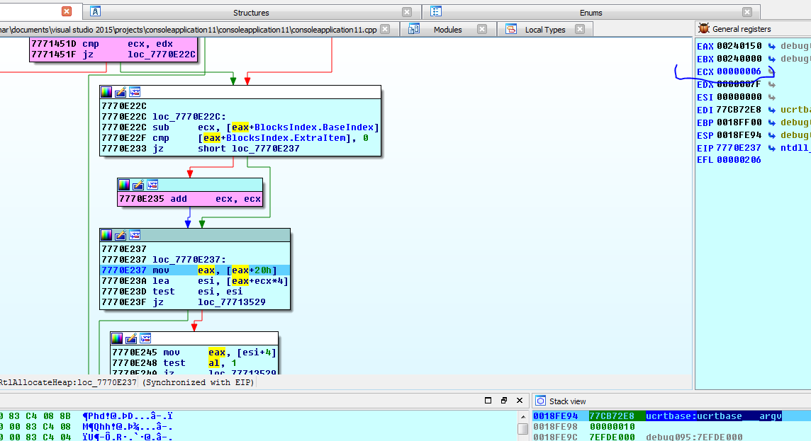

Затем программа использует смещение **0x20 LISTHINTS**.

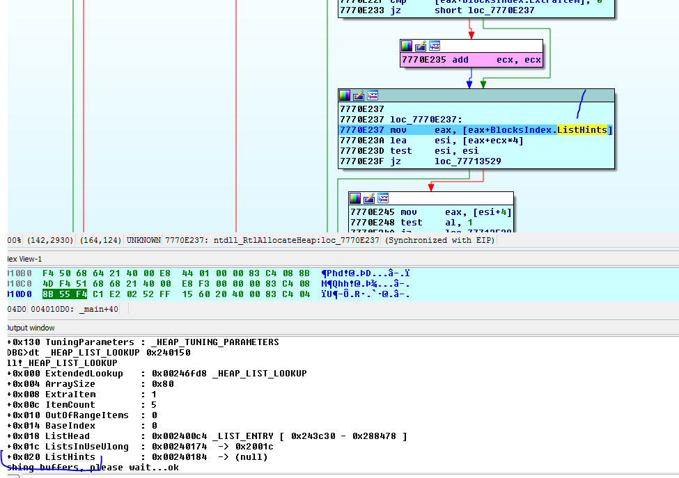

При умножении **0x6** на **4** и сложение с указателем **LISTHINTS** в регистре **ESI** остаётся значение **0x24019C**.

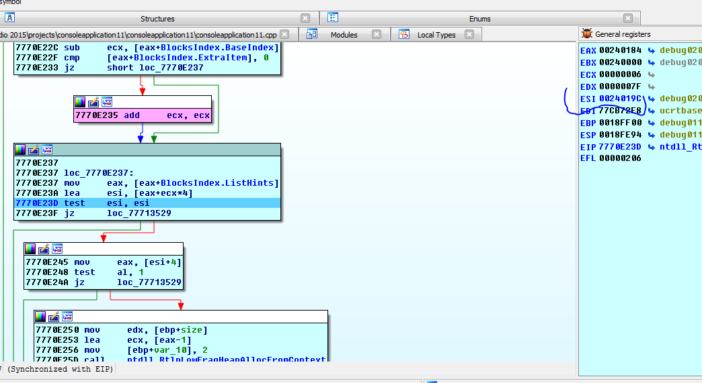

**LISTHINTS** указывает на **FREELIST**, который является другим типом более простого распределения. Теперь мы посмотрим, что делает программа.

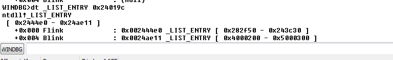

Таким образом, мы можем создать новую структуру из **8** байт. Но в моей **IDA** у меня уже это есть эта структура \(если у вас её нет, то создайте её\).

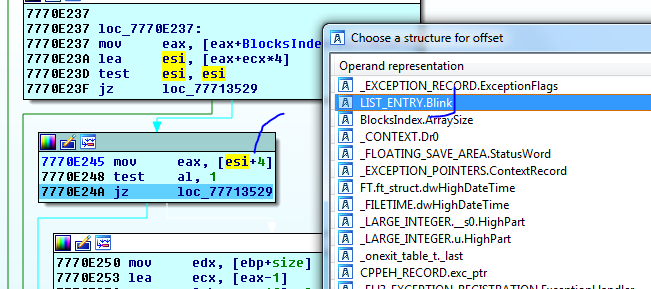

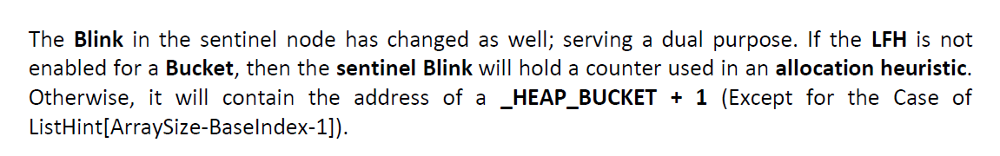

Т.е. если **LFH** выключен, у **BLINK** есть счетчик, а если он включен, то имеет указатель. **\(HEAP\_BUCKET + 1\)**

Хорошо. Вопрос здесь состоит в том, что программа тестирует регистр **AL**. Если он равен **1**, чтобы увидеть, является ли он счетчиком.

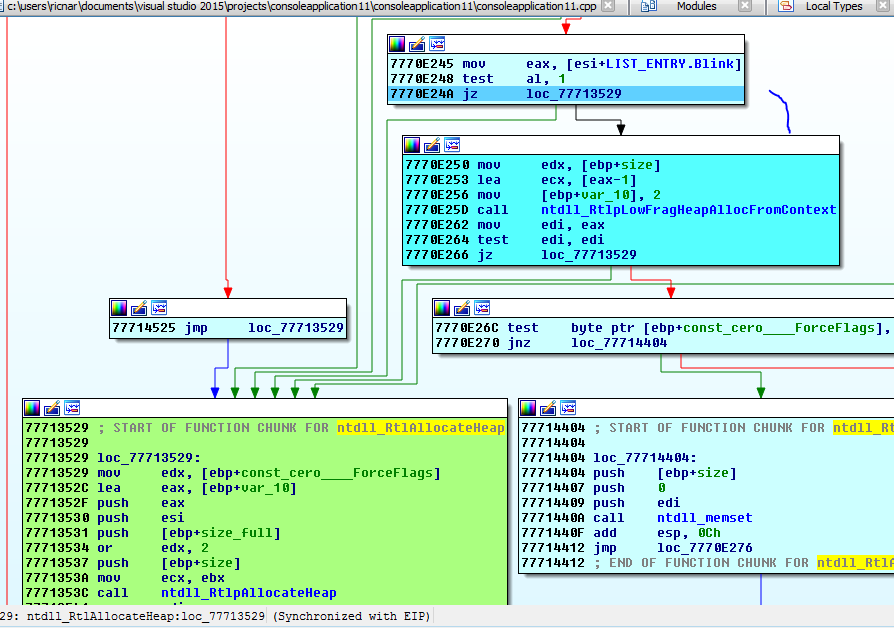

Если **BLINK** равен **1**, программа переходит к этому зеленому блоку с вызовом функции **RTLPALLOCATEHEAP**, а если нет, как в моем случае, программа переходит на голубой блок, который идет в вызов **RTLPLOWFRAGHEAPALLOCFRONCONTEXT**.

Другими словами, есть некоторые вещи, которые мы видим в нашем случае, программа сравнивает размер **0x3** с **0x80**, и поскольку это значение меньше, а регистр **AL** из **BLINK** отличался от байта **0x1**, мы прибыли сюда к чему-то, что, по-видимому, обрабатывается **LFH**.

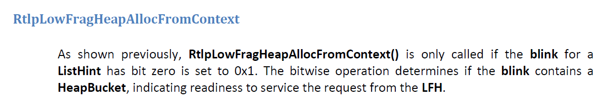

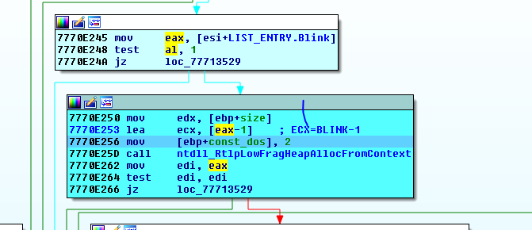

Регистр **ECX** имеет указатель, который был в **BLINK - 1** и в регистре **EDX** находится **USERSIZE 0x10**.

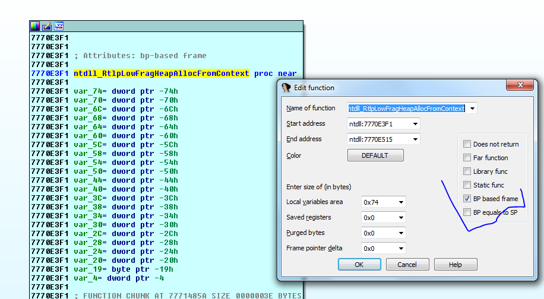

Поскольку в функции не отображаются переменные и функция основана на **EBP** \(были переменными **EBP - X**\), я изменил тип функции, поставив здесь галочку.

Напомним, что у **BLINK** было значение **HEAP\_BUCKET + 1**, другими словами, вычитая **1**, это будет равно **HEAP\_BUCKET**, поэтому я переименую переменную в **HEAP\_BUCKET**.

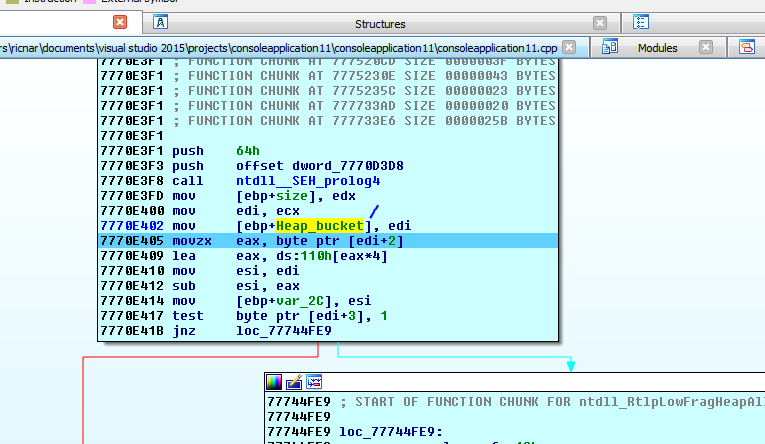

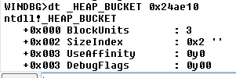

Другими словами, регистр **EDI** является базой структуры **HEAP\_BUCKET** которую я создал.

Кажется она имеет **0x3** байта.

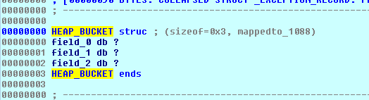

Хорошо. **SIZEINDEX** равен **2**, программа помещает это значение в регистр **EAX**

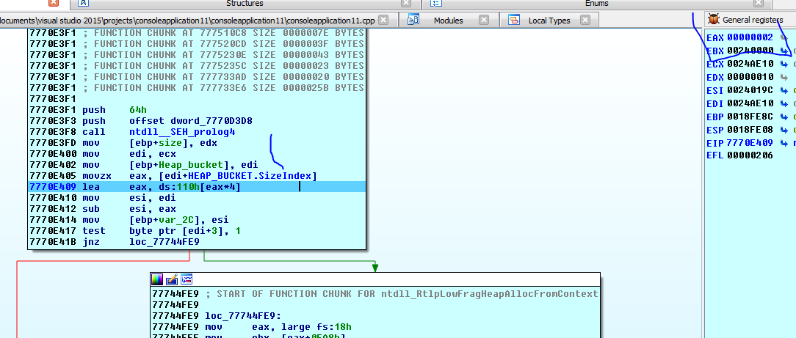

```assembly
LEA EAX, DS:110H[EAX*4]
```

Программа умножает значение **0x2** на **4** и складывает полученное значение со значением **0x110** и затем вычитает из найденного значения **HEAP\_BUCKET** и сохраняет результат в переменную **VAR\_2C**.

Этот адрес, который сохраняется в переменную **VAR\_2C** является началом таблицы **LFH**, так как **HEAP\_BUCKETS** находится по смещению **0x110** и должен быть равен **8**, потому что поле находится внутри таблицы **BUCKETS**, поэтому в переменной **VAR\_2C** программа сохраняет значение **0x24ACF8**, которое было началом таблицы **LFH**.

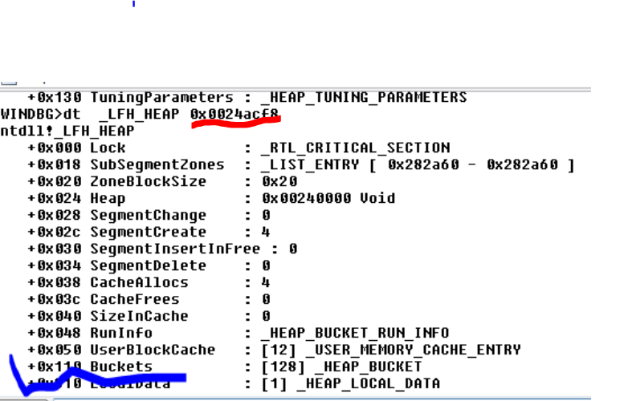

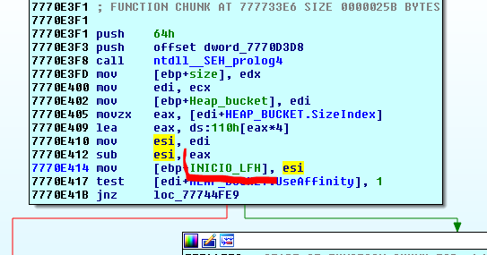

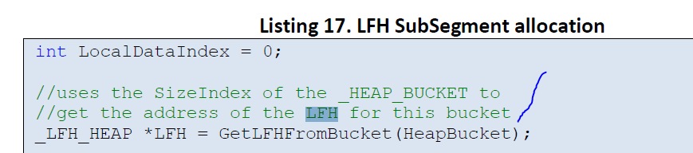

То, что программа сейчас делает, это то, что говорит нам картинка. Программа пытаясь найти адрес **LFH** для этой структуры **BUCKET**, используя переменную **SIZEINDEX**.

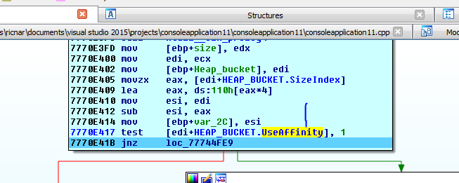


Очевидно, мы находимся в этой части, только в моём случае переменная не равна единице и программа продолжает выполнение здесь.

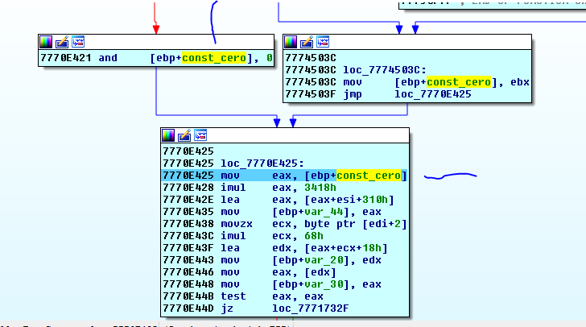

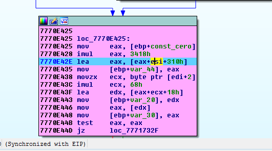

Программа достигает инструкции **LEA**, где на данный момент регистр **EAX** равен нулю, поскольку он получается из умножения **0x3418** на **CONST\_CERO** и суммируется с регистром **ESI**, который хранит начало таблицы **LFH** и добавляет значение **0x310**.

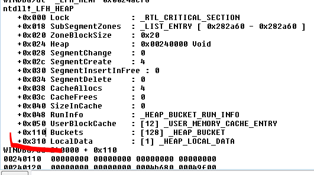

Мы напомним, что смещение **0x310** из **LFH** это **\_HEAP\_LOCAL\_DATA**.

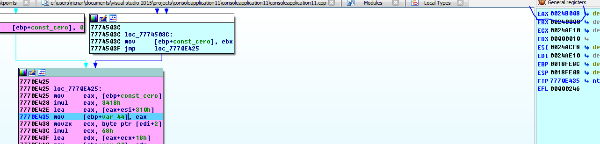

Это значение сохраняется в переменную **VAR\_44**. Я переименую это поле в **HEAP\_LOCAL\_DATA**.

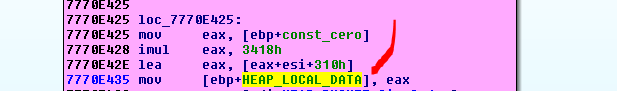

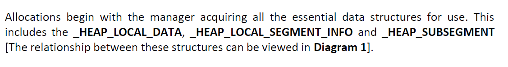

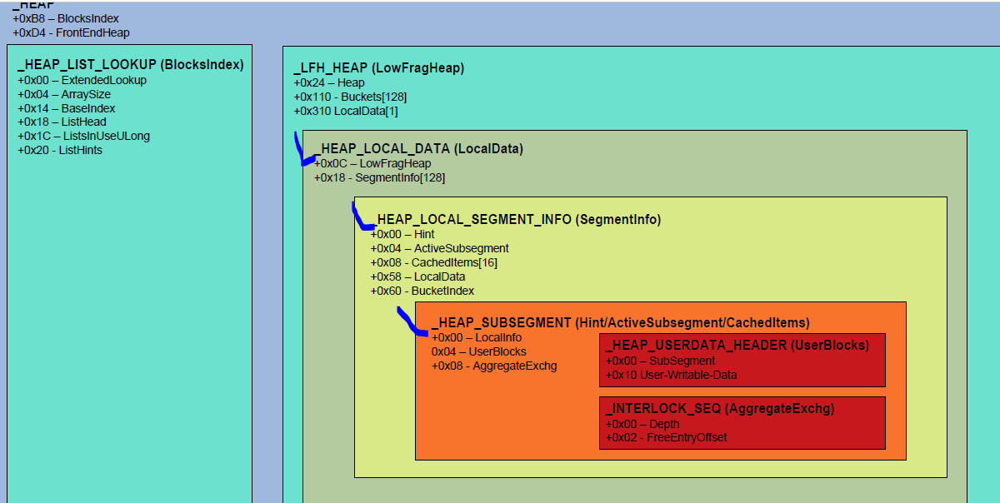

Основная идея состоит в том, что мы пытаемся найти эти структуры и увидим, можем ли мы их найти и идентифицировать.

Хорошо. Мы должны создать структуру для **HEAP\_LOCAL\_DATA**.

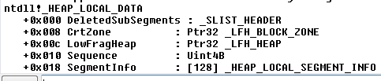

Я создаю структуру из **0x22** байт, хотя она наверняка будет намного больше, но пока пойдет и это.

По смещению **0x18** есть структуры. Их размер равен **0x128** байт.

```console
[128] _HEAP_LOCAL_SEGMENT_INFO
```

Программа проходит через все эти **128** структур, используя **SIZEINDEX** как индекс, который умножается на **0x68**, а затем добавляет значение, чтобы найти адрес это структуры **SEGMENTINFO**.

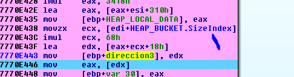

Это означает, что адрес **DIRECCION3** равен **HEAP\_LOCAL\_SEGMENT\_INFO**.

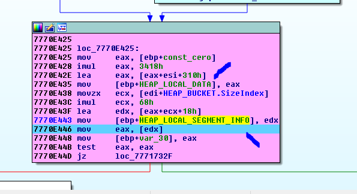

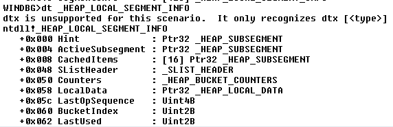

Поэтому мы будем создавать структуру больше чем **0x64** байта.

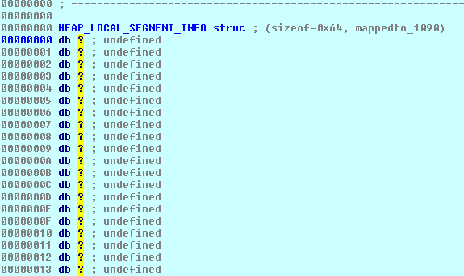

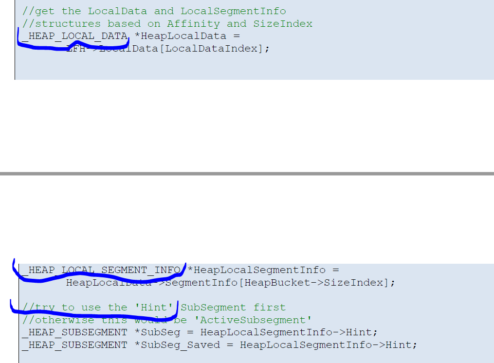

Хорошо. Внутри отладчика этого выглядит так.

```console
ntdll!\_HEAP\_LOCAL\_SEGMENT\_INFO
+0x000 Hint : Ptr32 \_HEAP\_SUBSEGMENT
```

Первое поле, которое программа пытается использовать здесь, говорит, что это **HINT** .

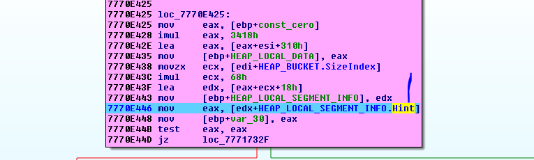

И программа сохранит это значение в переменную **VAR\_30**. Я переименовываю переменную в **HINT**.

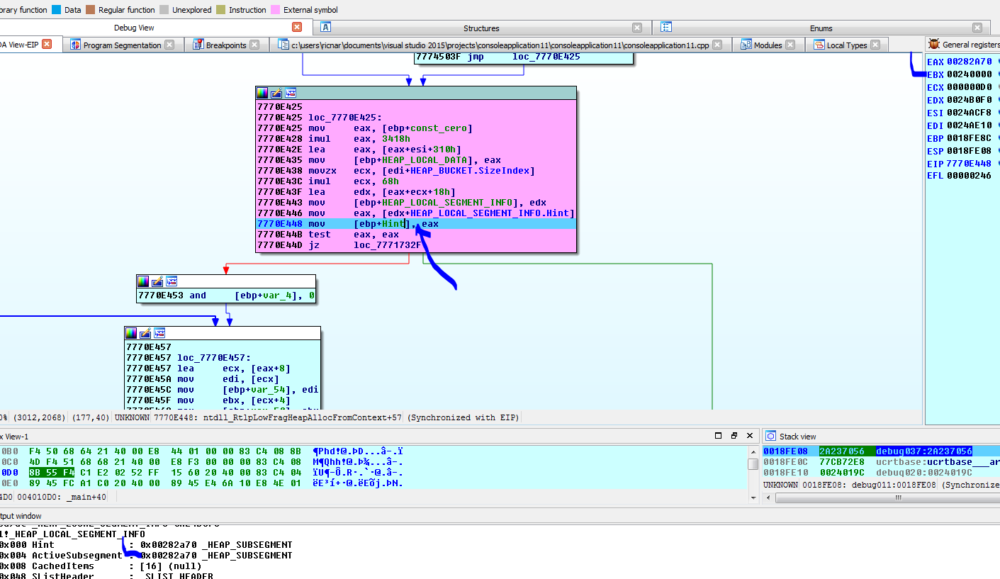

Если значение **HINT** не равно нулю, программа ищет **ACTIVESUBSEGMENT**, что является следующим полем.

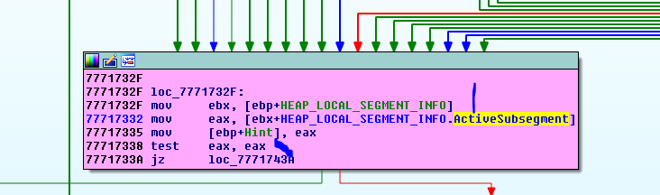

А если это поле равно нулю, программа переходит сюда

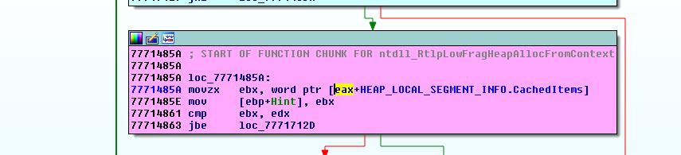

В любом из трех случае, программа сохраняет результат в переменной, которую мы назвали **HINT**, но она может быть любой из трех.

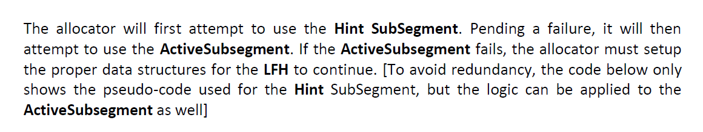

Хорошо. Мы находимся здесь.

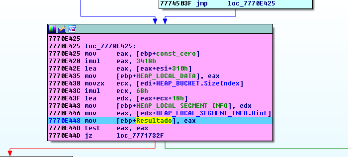

Мы будем переименовывать переменную **HINT** в **RESULTADO**, поскольку переменная может принимать три значения.

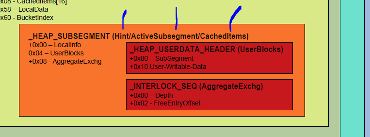

Картинка показывает нам три варианта. Сейчас же мы находимся в **HINT**.

Этот результат должен был бы быть **\_HEAP\_SUBSEGMENT**.

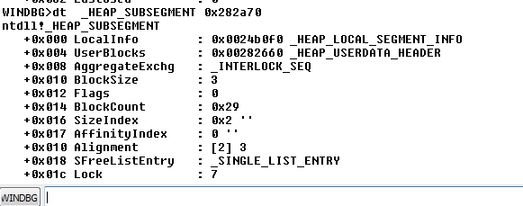

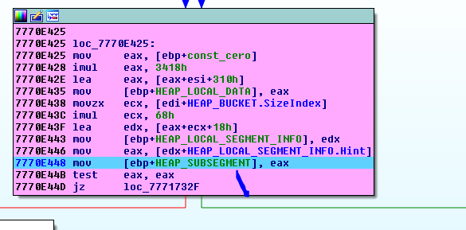

Здесь программа говорит мне, что **\_HEAP\_LOCAL\_SEGMENT\_INFO** находится в памяти по адресу **0x24B0F0** и что **0x282660** это структура **\_HEAP\_USERDATA\_HEADER** а по смещению **0x08** это структура **INTERLOCK\_SEQ**.

Мы уже подходим к концу. Фууууууууууууууууууххххххххххххх.

Здесь я добавляю новую структуру.

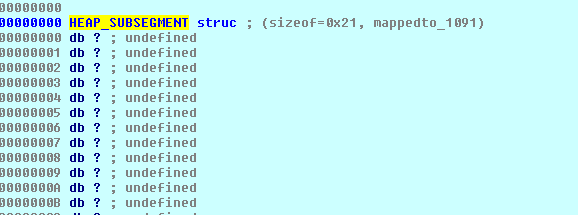

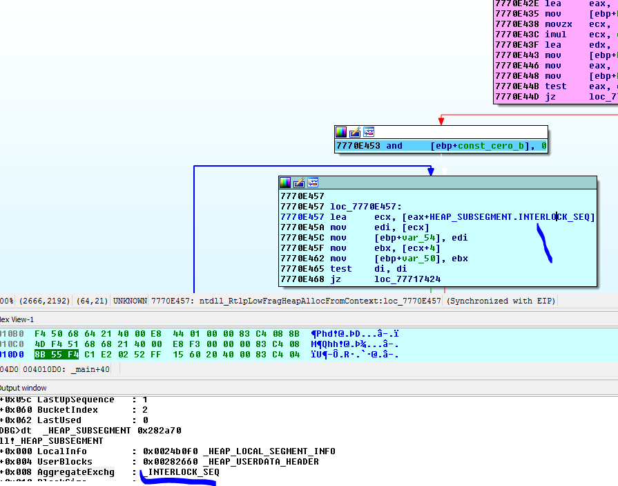

Здесь я вижу, что программа находит с помощью инструкции **LEA** адрес поля **\_INTERLOCK\_SEQ**

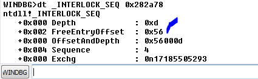

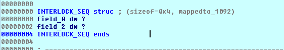

На данный момент, я думаю что она состоит из **4** байтов.

Программа может прочитать поле как **WORD** или как **DWORD**, это сложно для имени. В моем случае, программа читает **DWORD** т.е. имеет значение **0x56000D** \(**ЭТО ЗНАЧЕНИЕ ОЧЕНЬ ВАЖНО**\)

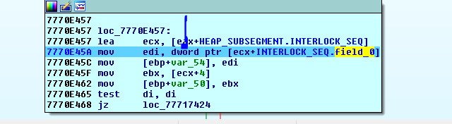

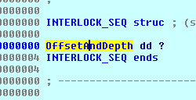

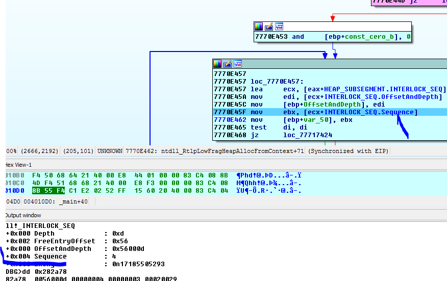

Я добавляю поле **SEQUENCE**.

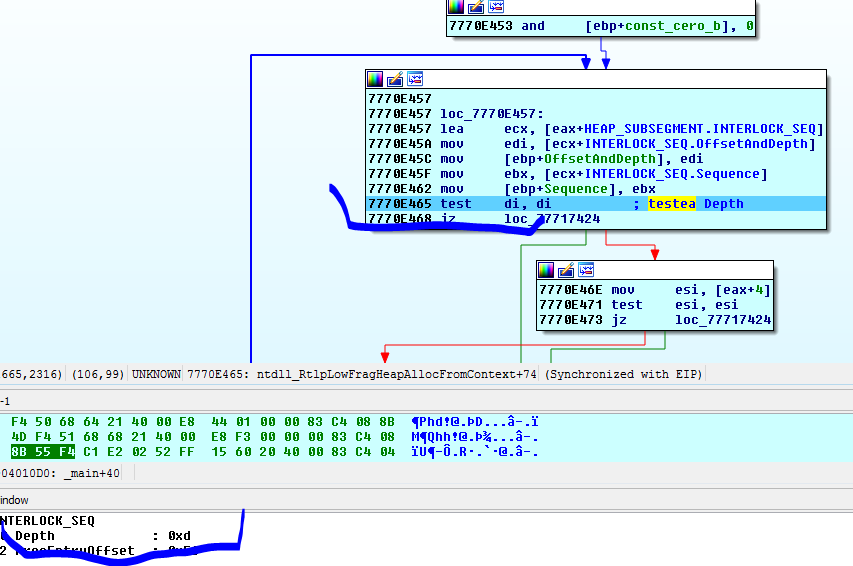

Программа тестирует регистр **DI** который хранит поле **OFFSETANDDEPTH**. Это поле в моём случае равно **0xD**.

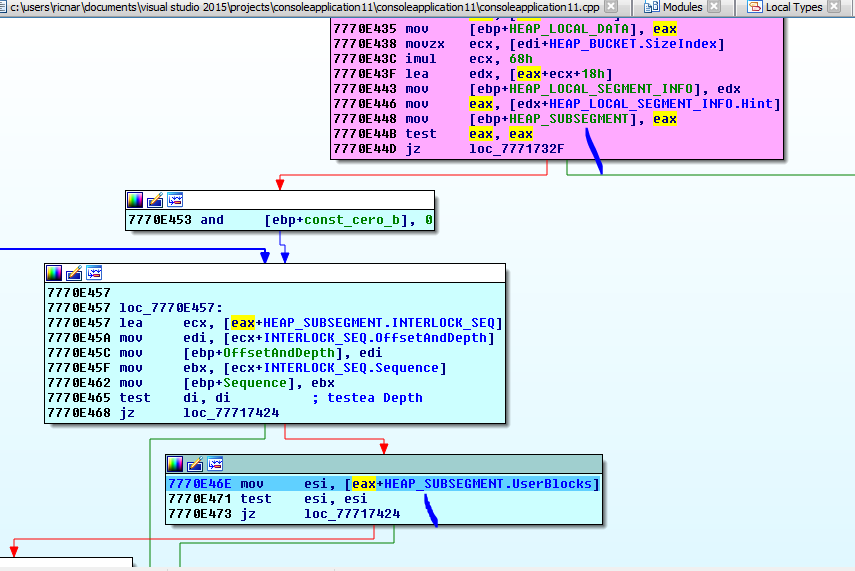

Здесь программа читает поле **USERBLOCKS**, которое находится по смещению **0x4** структуры **HEAP\_SUBSEGMENT**.

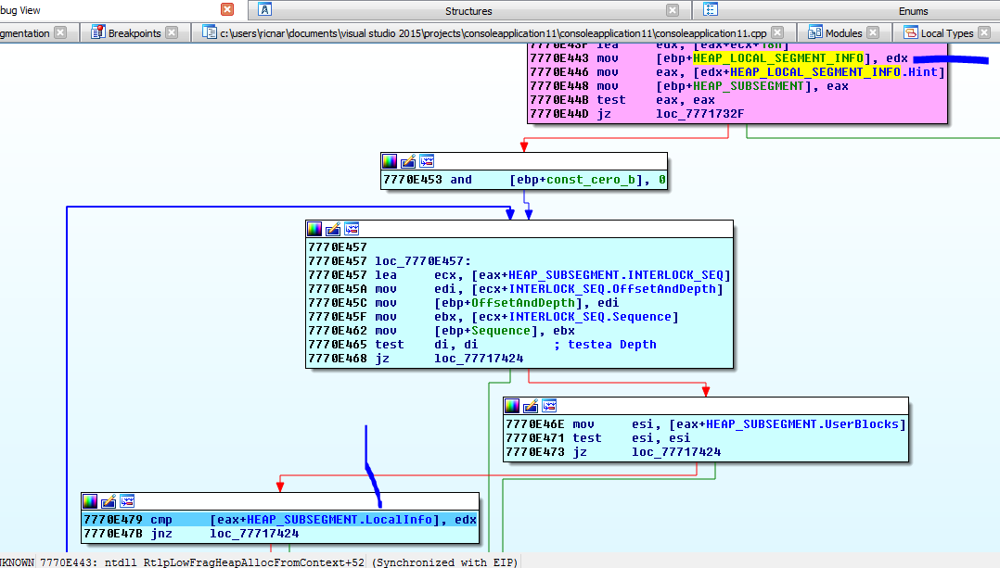

Программа сравнивает регистр **EDX** который хранит **LOCALINFO** высчитанный с помощью указателя **HEAP\_SUBSEGMENT.LOCALINFO** и они должны быть одинаковыми.

Поскольку значения одинаковые, программа идет к этому блоку.

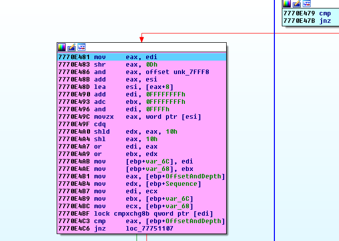

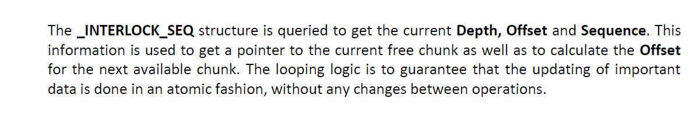

Хорошо. Я не собираюсь просчитывать все эти значения, но очевидно, что то, что программа делает, это получает первый свободный блок запрошенного размера из значений структуры **\_INTERLOCK\_SEQ**, и когда программа покинет этот блок, она сохранит его здесь.

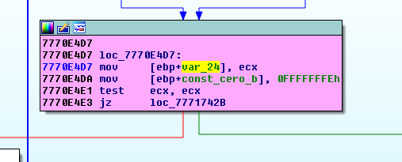

Регистр **ECX** здесь равен значению **282918** и если я посмотрю список блоков с размером **0x10** с помощью команды.

```console
!heap -flt s 0x10
```

В выводе блоки находятся здесь

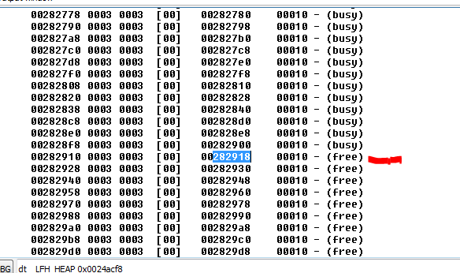

И это первое значение из этих **LFH**, потому что предыдущие размеры **0x10**, которые говорят что они **FREE\(СВОБОДНЫЕ\)**, имеют другую **LFH** младшего адреса, возможно, соответствующей другой куче.

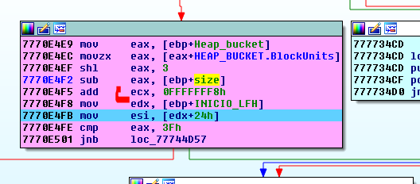

Здесь по адресу чанка **0x282918** без заголовка, вычитается **8**, и остается адрес полного блока с заголовком **0x282910**.

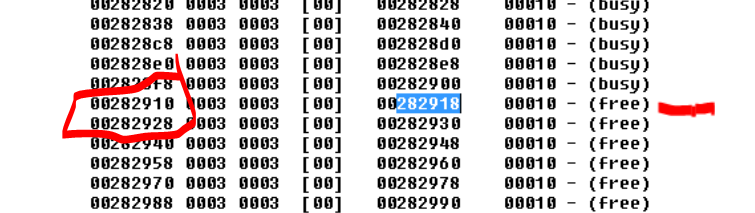

Структура, которую мы ещё не добавили называется структурой **LFH**. Сейчас я сделаю это.

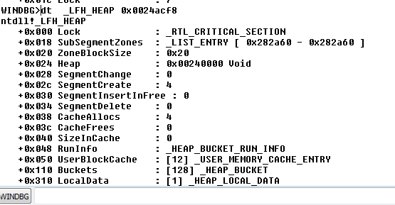

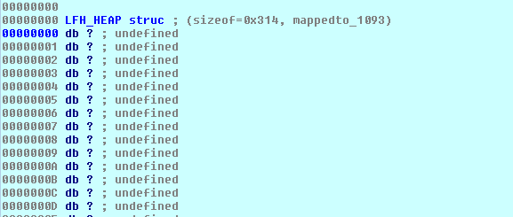

Теперь используется поле **0x24**, которое должно найти базовый адрес **КУЧИ** по адресу **0x240000**. Полученное значение помещается в регистр **ESI**.


**BLOCKUNITS** был равен **0x3** в инструкции **SHL EAX, 3**

Это похоже на умножение **8** поэтому

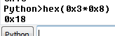

И это то значение, что осталось в поле **USERSIZE**

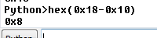

И это значение программа сравнивает со значением **0x3F** . Поскольку оно меньше, программа идёт сюда.

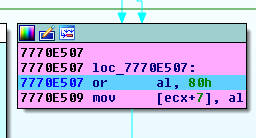

Здесь программа пишет в заголовок чанка **LFH**. Мы не сделали структуру.

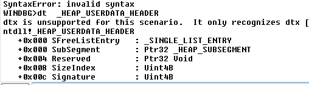

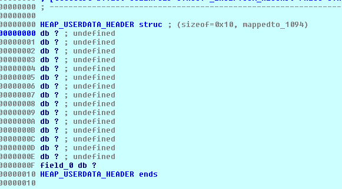

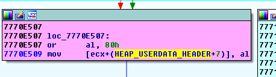

Программа перезаписывает **7** байт, меняя его со значения **0x80** на **0x88**.

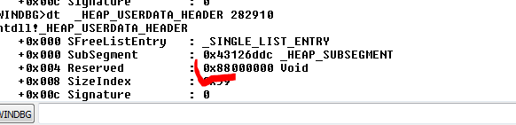

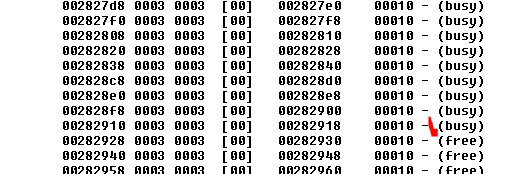

Сейчас блок обозначен как занятый. Если мы посмотрим следующий свободный блок по адресу **282928**

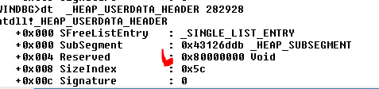

Свободные блоки - это блоки со значение **0x80**, а занятые со значением **0x88**.

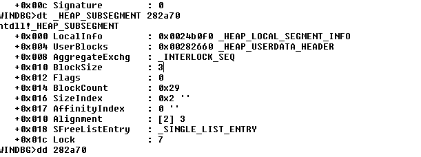

Вопрос состоит в том, что значение, которое находится в структуре **INTERLOCK\_SEQ** и которое определяет следующий блок для доставки находится в по адресу **0x282A78** \(по смещению **0x8** от начала структуры **HEAP\_SUBSEGMENT**\)

До этого значение было равно **56000D**.

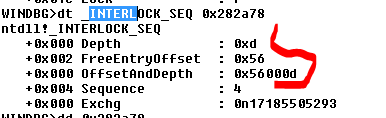

А сейчас значение равно **59000C**.

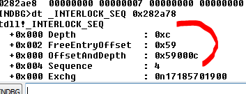

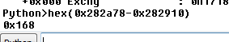

Расстояние между началом чанка, в который я могу написать, который решает, кто следующий….

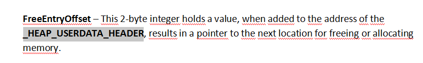

То, что мы сказали в предыдущем туториале проверено здесь.

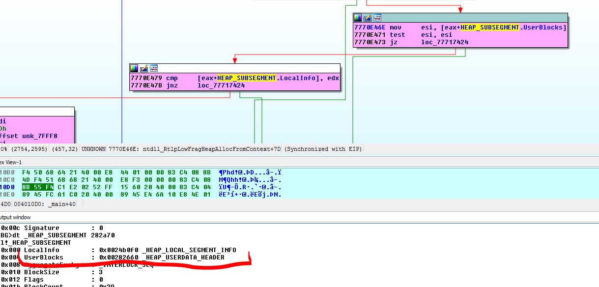

Это значение **0x282660 USERBLOCKS**, помещается в регистр **ESI**.

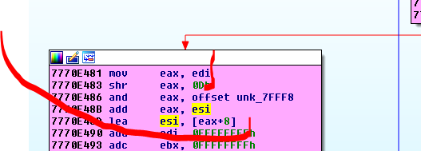


Это означает, что в следующий раз, когда запрашивается размер **0x010**, программа поместит в **EDI** значение **0x59000C** если оно не перезаписано.

Программа помещает значение в регистр **EAX** и затем исполняет инструкцию **SHR EAX****,0xD

2** в **0xD** степени = **8192** десятичных байт, т.е. **0x2000** в шестнадцатеричной системе

Другими словами, это эквивалентно значению **0x59000С** делённому на значение **0x2000**, что даёт мне результат **0x2C8**

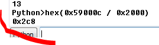

К этому значению программа применяет инструкцию **AND** c параметром **0x7FFF8**

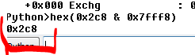

Затем программа добавляет регистр **ESI**, который равен **0x282660**

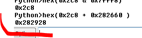

И это даём мне результат **0x282928**, что является следующим свободным


Это означает, что если есть переполнение, мы можем перезаписать эти данные переписав значение внутри структуры **INTERLOCK\_SEQ** и программа предоставит мне предыдущий блок, про который мы расскажем в следующей части.

* * *

Автор оригинального текста — Рикардо Нарваха.

Перевод и адаптация на русский язык — Яша Яшечкин.

Исправление ошибок и неточностей - репетитор и носитель испанского языка.

Перевод специально для форума системного и низкоуровневого программирования - WASM.IN

24.06.2018

Источник:

[**http://ricardonarvaja.info/WEB/INTRODUCCION%20AL%20REVERSING%20CON%20IDA%20PRO%20DESDE%20CERO/48-INTRODUCCION%20AL%20REVERSING%20CON%20IDA%20PRO%20DESDE%20CERO%20PARTE%2048.7z**](http://ricardonarvaja.info/WEB/INTRODUCCION%20AL%20REVERSING%20CON%20IDA%20PRO%20DESDE%20CERO/48-INTRODUCCION%20AL%20REVERSING%20CON%20IDA%20PRO%20DESDE%20CERO%20PARTE%2048.7z)
