# Часть 51

Перед тем, как приступить к **ВИДЕОТУТОРИАЛАМ**, мы должны скомпилировать и пореверсить немного те драйверы, что были сделаны в предыдущей части, а также некоторые другие драйверы, чтобы ознакомиться с тем, как они работают.

В случае простого драйвера из части **50**, это простой **HELLO WORLD**, очень простой для реверсинга. Мы уже увидели, что при его компиляции со старым **WDK 7.1** есть несколько простых подпрограмм, а в новом **WDK 10** есть несколько функций перед инициализацией, но они приходят к тому же коду. Там нет никакой другой функциональности.

Здесь мы находимся в том месте, что будет точкой входа в драйвер **DRIVERENTRY** в старом драйвере сделанном в **WDK 7.1**.

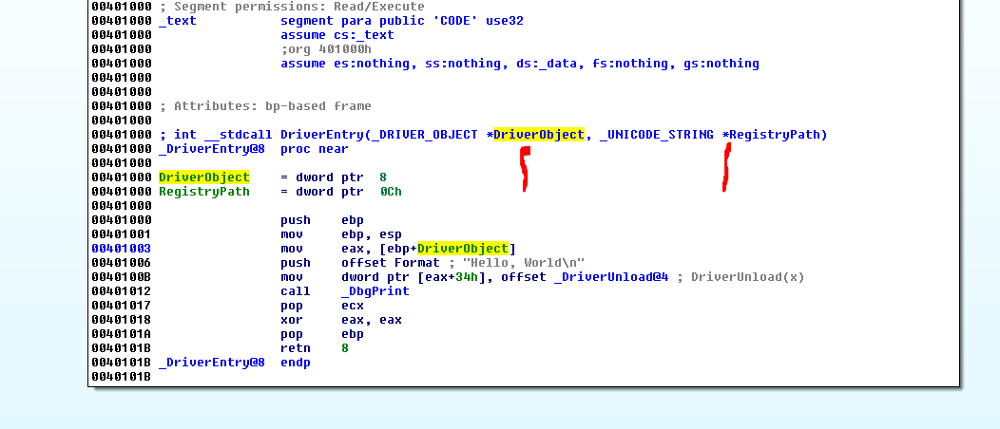

Мы видим по звездочкам, что есть два аргумента, которые являются двумя указателями, т.е. по **4** байта. Первый это указатель на структуру **\_DRIVER\_OBJECT**, а второй на структуру **\_UNICODE\_STRING**. Давайте посмотрим их, так как **IDA** обнаруживает их

В **MSDN**.

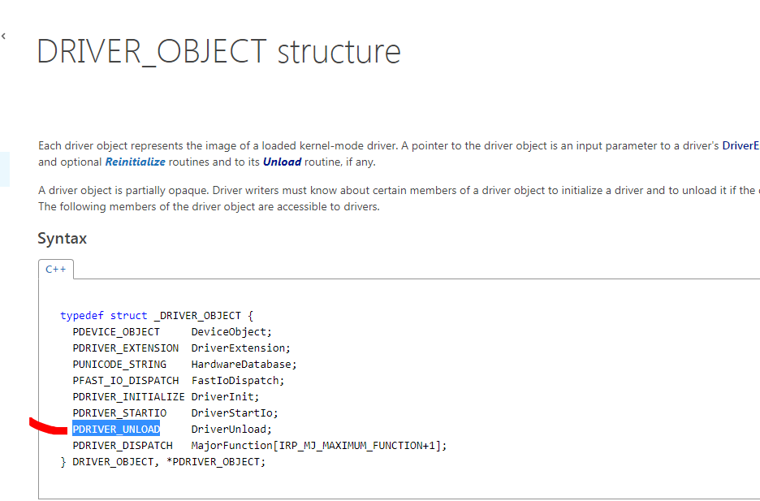

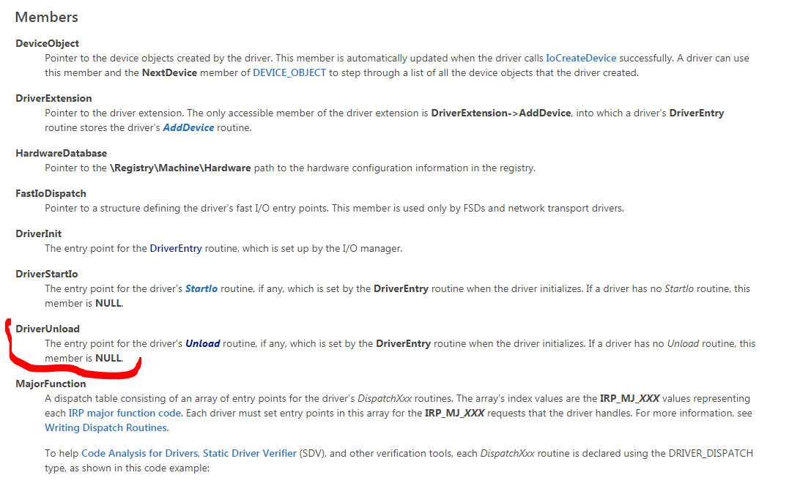

Во вкладке структуры их нет. Но не забываем, что в **LOCAL TYPES** иногда есть больше структур. Мы также замечаем там это.

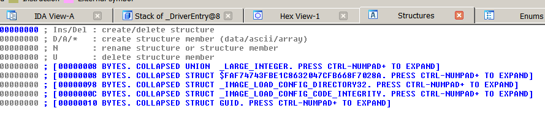

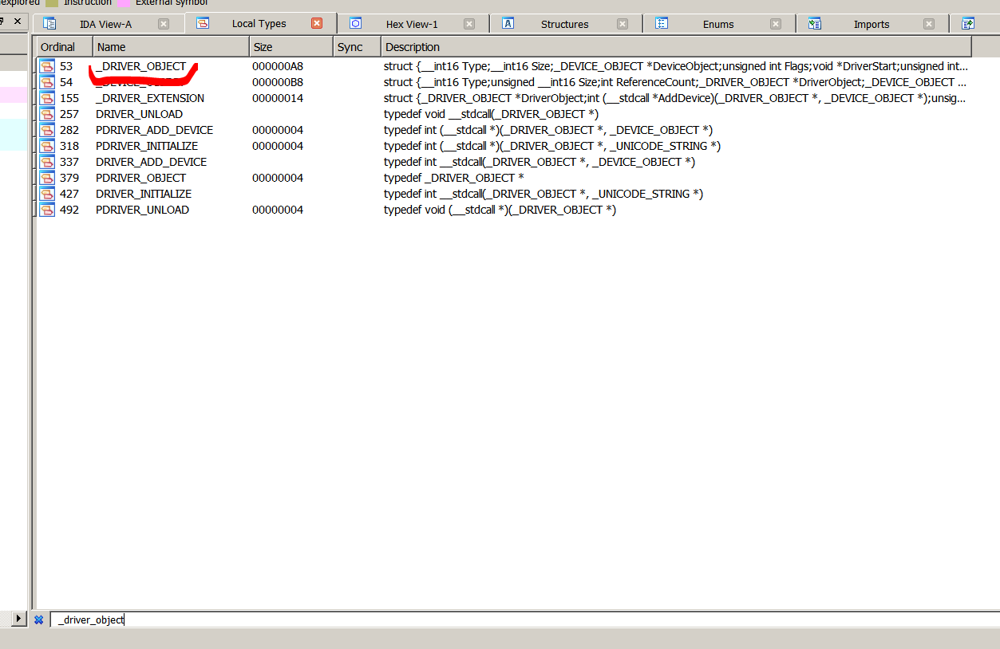

Хорошо. Вот она. Мы будем импортировать её. Делаем правый щелчок и выбираем **SYNCRONIZE TO IDB**.

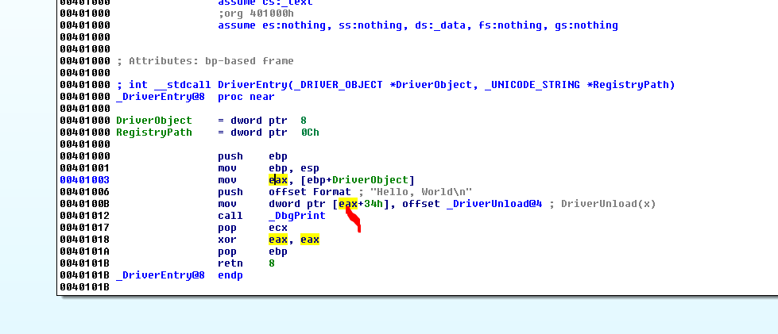

Поскольку я загружаю адрес структуры в регистр **EAX**, я знаю, что **EAX+34H** это какое-то поле структуры. Мы нажимаем **T**, чтобы увидеть.

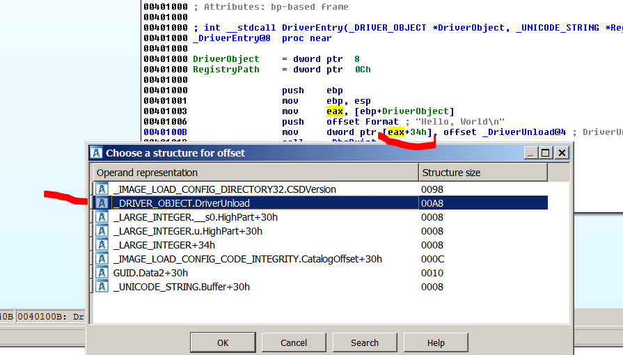

Из структур, которые загружены, я выбираю **\_DRIVER\_OBJECT** и это поле **DRIVERUNLOAD**.

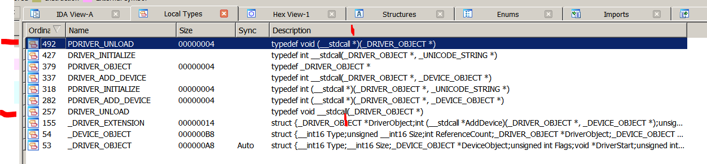

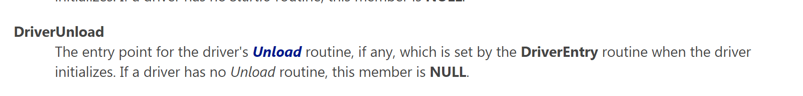

В переводе на испанский, это переменная указатель в структуре, которая сохраняет адрес функции, которую система будет вызвать при выгрузке драйвера. Здесь вверху мы видим, что тип функции определен, её аргумент это указатель на **\_DRIVER\_OBJECT** и ввеху всего этого мы видим определение структуры **PDRIVER\_UNLOAD** что очевидно является адресом, так как это указатель на ту же фунцию. Мы видим звездочку в определении.

Поэтому это поле предназначено для хранения адреса функции, которую система вызывает, когда выгружается драйвер.

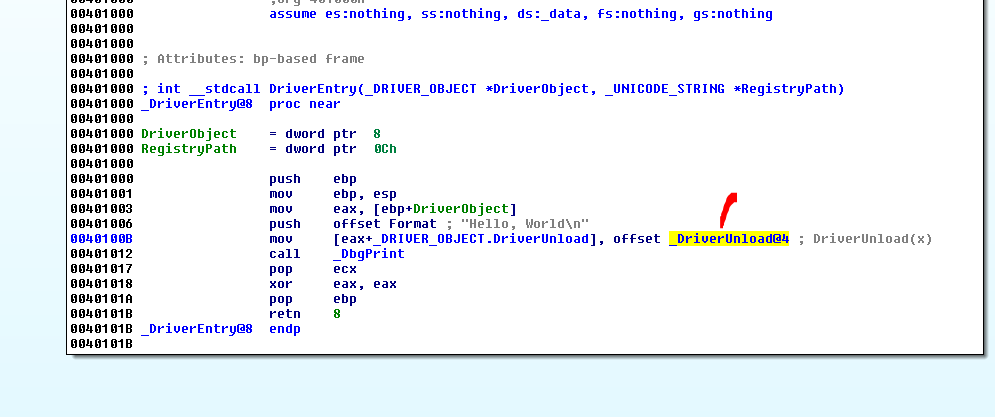

В нашем случае, **IDA** показывает нам смещение, так как это адрес функции **\_DRIVERUNLOAD**. Нажимаем пункт **DEMANGLE NAMES → NAMES**. Теперь всё выглядит лучше.

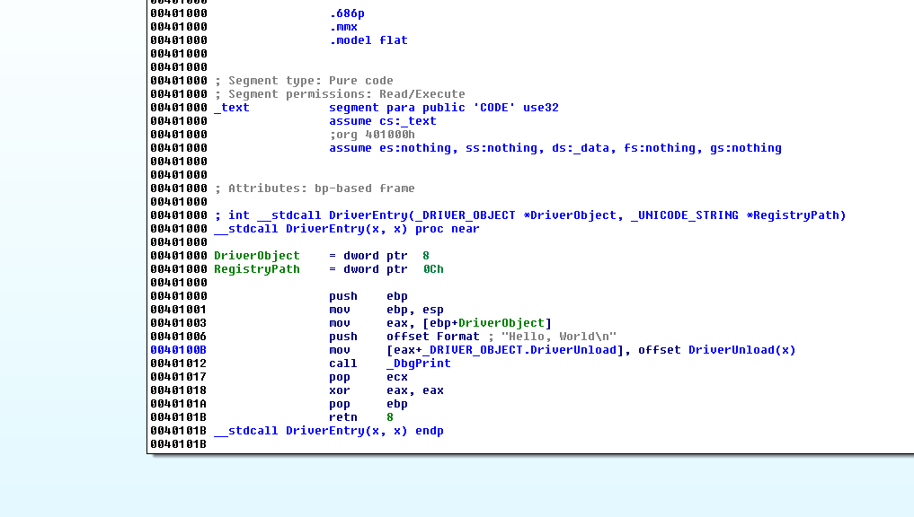

Поэтому, когда запускается драйвер, он приходит сюда и печатает "**HELLO WORLD**" каждый раз, когда он запускается, посредством функции **\_DBGPRINT** и сохраняет адрес функции, которая будет выполняться при выгрузке драйвера.

Давайте запомним, что функция, которую мы создали **DRIVERUNLOAD** в нашем коде, должна быть скорректирована до типа, определенного ранее, т.е. его аргумент должен быть указателем на **\_DRIVER\_OBJECT**, и поэтому наш аргумент имеет тип **PDRIVER\_OBJECT**, как говорят определения функции в исходном коде.

```console
#include <ntddk.h>

void DriverUnload(PDRIVER_OBJECT pDriverObject)
{
    DbgPrint("Driver unloading\n");
}
```

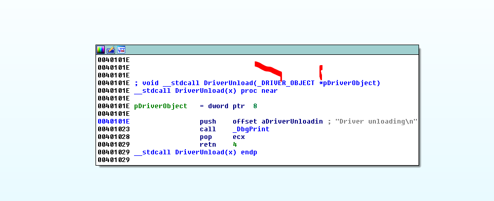

Так что все типы совпадают. Это будет процедура, когда драйвер будет выгружатся, и как мы видим, напечатает сообщение "**DRIVER UNLOADING**" используя функцию **\_DBGPRINT**.

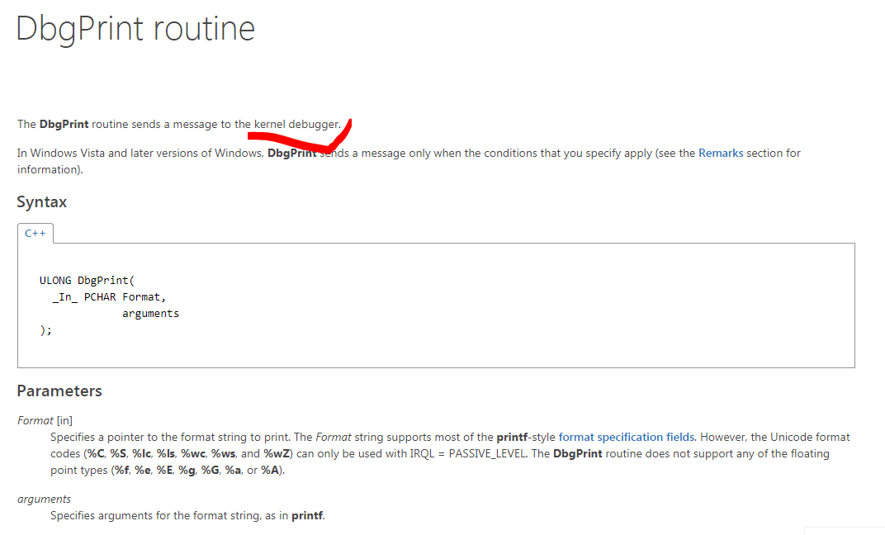

Если драйвер отлаживается, сообщение будет видно в **ЛОГАХ** отладчика. Как мы видели в **WINDBG** и в **IDA** сообщение "**HOLA MUND** " и "**DRIVER UNLOADING**" при загрузке и выгрузке.

В этой версии не так много интересного. Мы увидим другую версию, которая скомпилирована с **WDK 10**, поэтому реверсим эту совсем чуть-чуть. Мы проходим мимо части инициализации, и сосредоточимся на том, как драйвер управляет структурой и указателем на **DRIVERUNLOAD**.

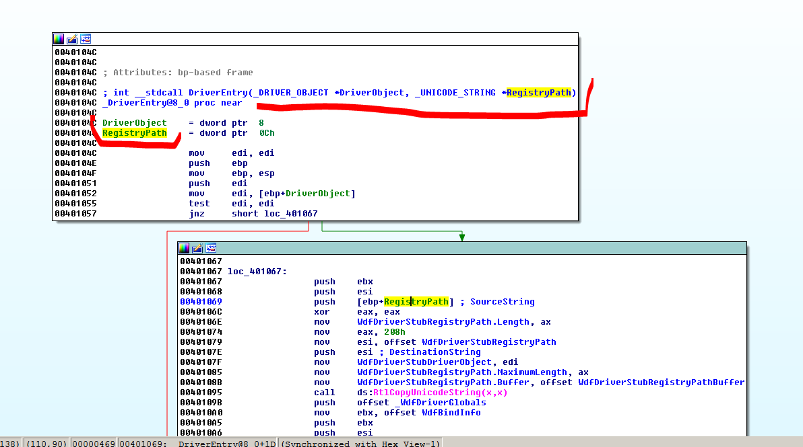

Функция **\_DRIVERENTRY@8** имеет те же аргументы, которые являются двумя указателями на структуры, которые мы видели в другой части.

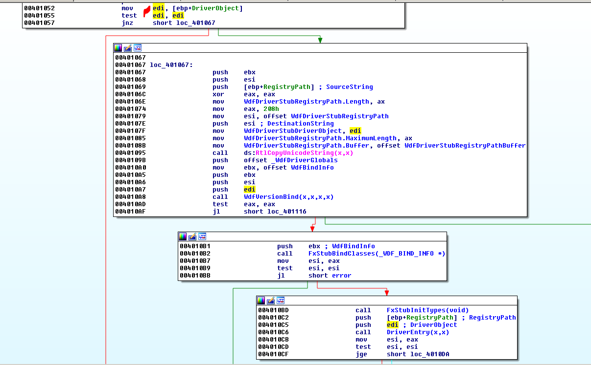

Мы видим, что регистр **EDI** берет адрес структуры **DRIVEROBJECT** и использует его во всей функции вплоть до выхода из неё, когда исполняется **POP EDI** перед **RET**.

Я могу сделать правый щелчок и выбрать **RENAME** в регистре **EDI** и в диапазоне, где остается то же значение. Я переименую его в **P\_DRIVEROBJECT**.

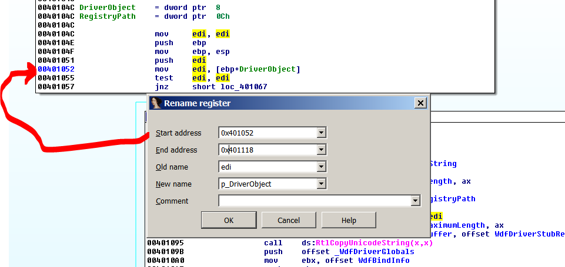

Эта метка распространяется до самого конца, где уже **POP EDI** изменяет значение.

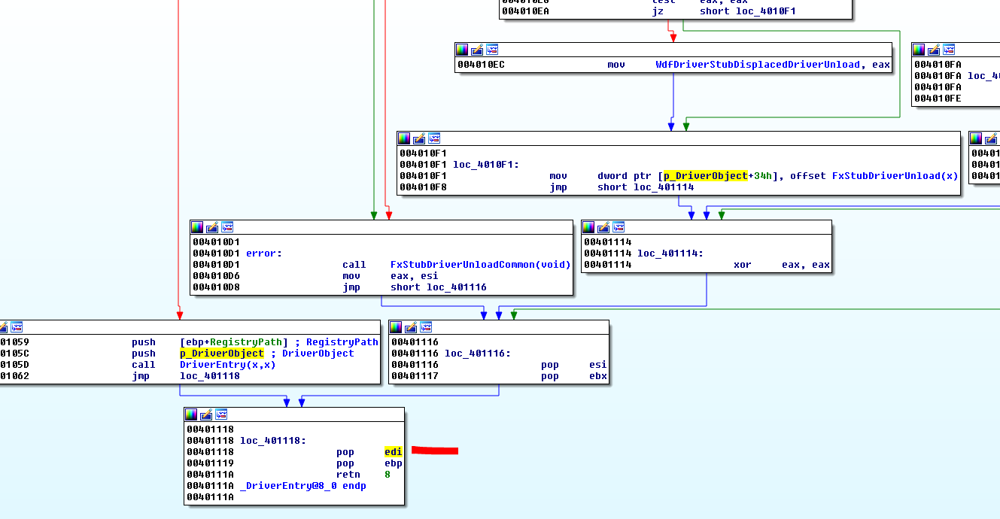

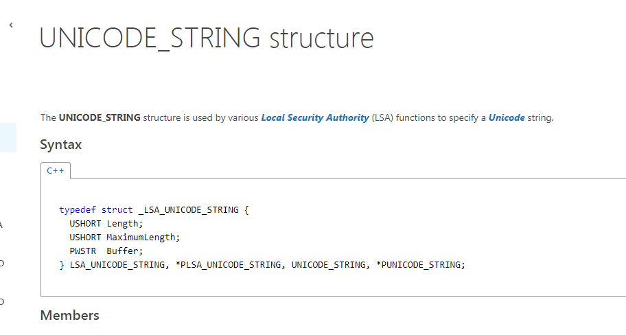

Хорошо. Это структура, которая имеет тип **USHORT** \(слово\) в переменной **LENGHT**. Другая переменная с максимальной длиной буфера и указатель на буфер со строкой типа **UNICODE**. Другими словами, всегда длина структуры будет **0x8**, два **WORD** плюс указатель типа **DWORD**.

**Length**
Specifies the length, in bytes, of the string pointed to by the **Buffer** member, not including the terminating **NULL** character

**MaximumLength**
Specifies the total size, in bytes, of memory allocated for **Buffer**. Up to **MaximumLength** bytes may be written into the buffer without trampling memory.

**Buffer**
Pointer to a wide-character string. Note that the strings returned by the various LSA functions might not be **null**-terminated.

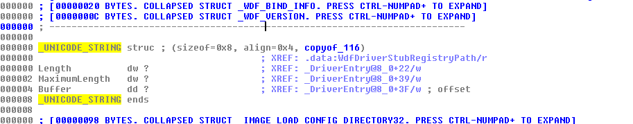

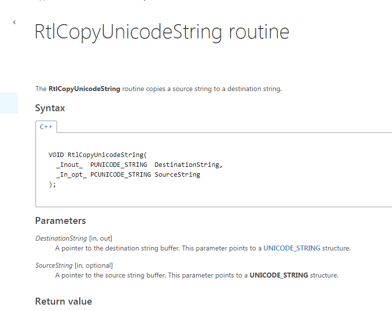

Мы видим, что эта функция имеет в качестве аргумента указатель на исходную структуру **UNICODE\_STRING** и как назначение, указатель типа **UNICODE\_STRING**.

Здесь мы видим два аргумента, источник, который является **REGISTRYPATH**, который является указателем на структуру **UNICODE\_STRING** и регистр **ESI**, который имеет назначение того же типа.

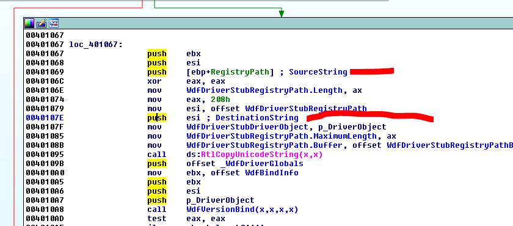

Регистр **ESI** указывает на секцию данных. Здесь есть эта переменная того же типа.

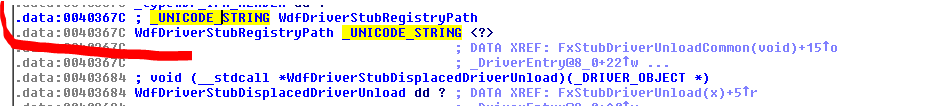

Поскольку, мы видим, что длина была **0x8** байт, в секции данных следующий адрес, который остается будет на **0x8** больше, т.е.

```console
Python>hex(0x40367c+0x8)
0x403684
```

Здесь мы видим, как перед вызовом функции для копирования, инициализируется структура назначения. Программа помещает нуль в значение длины, так как на данный момент эта переменная пуста. Программа помещает значение **0x208** в **MAXIMUMLENGHT** и сохраняет указатель на буфер в смещении **WDFDRIVERSTUBREGISTRYPATH**.

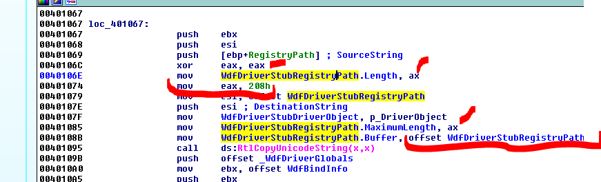

Сам буфер имеет **0x104** слова, т.е. **0x208** байта или **520** в десятичной системе

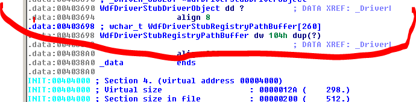

```console
hex(0x104*2)
0x208
```

```console
Python>(0x104*2)
520
```

Здесь я показываю, что это массив **260** типа **WCHAR\_T** \(**2** байта\), т.е. **260** \* **2** что равно **520**.

Поэтому все нормально. Указатель указывает на буфер длиной **0x208** и максимальное значение также равно **0x208**.

Давайте не будем забывать об этом.

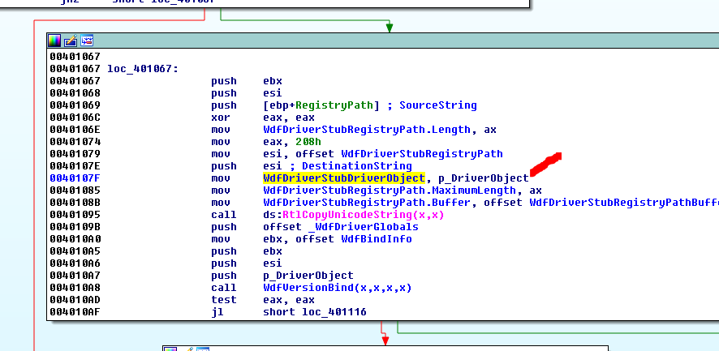

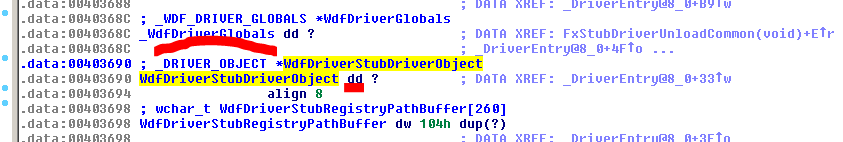

Это переменная из **4** байтов **DD**, так как это указатель на структуру **\_DRIVER\_OBJECT**.

Затем есть пара недокументированных функций инициализации. По крайней мере я их не нашел в документации, и это не так важно. Всё это чистая инициализация. А затем программа приходит к **DRIVERENTRY**, функция которого эквивалентна предыдущему драйверу.

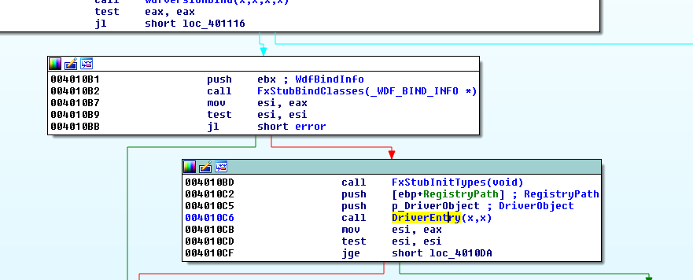

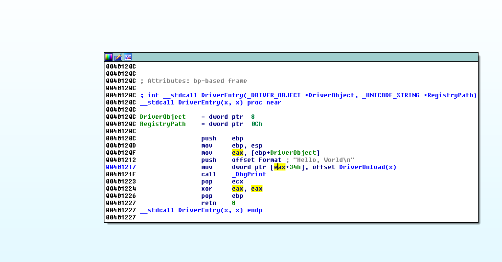

Внутри функции, если мы делаем то же самое как в предыдущий раз и пойдем в **LOCAL TYPES** и синхронизируем структуру **DRIVER\_OBJECT**.

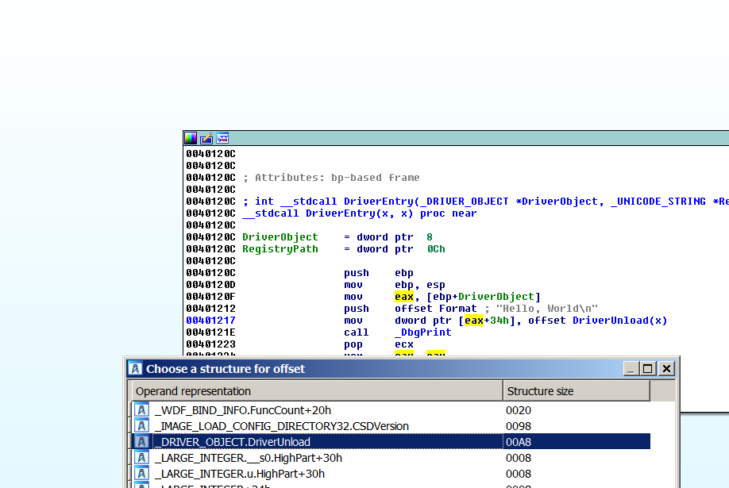

Мы видим, что драйвер похож на предыдущий. Он сохранит адрес функции, которую мы назвали как **DRIVERUNLOAD** в том поле структуры, чтобы вызывает ее, при выгрузке.

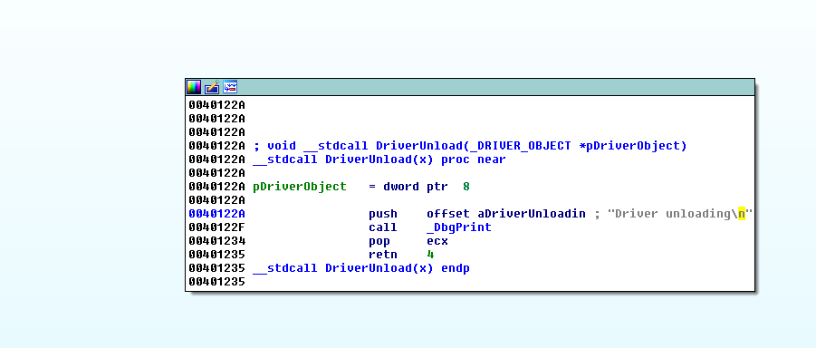

Мы видим, как поле **DRIVERUNLOAD** проверяется на нуль. Программа переходит в розовую часть, где будет сохранен указатель на нашу функцию в эту переменную секции данных под названием **WDFDRIVERSTUBDISPLACEDDRIVERUNLOAD**.

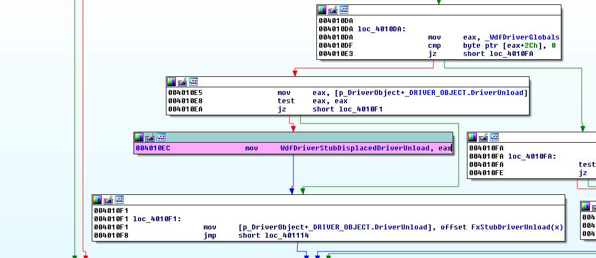

И также программа перезаписывает поле **DRIVERUNLOAD** функцией, которая не является моей и называется **FXSTUBDRIVERUNLOAD** и которая выглядит так если мы её посмотрим.

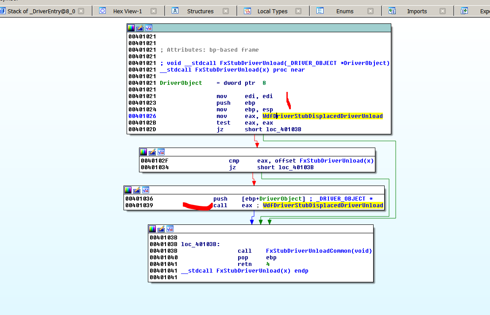

При выгрузке драйвера программа будет переходить в функцию **FXSTUBDRIVERUNLOAD**, но затем загрузит нашу функцию **DRIVERUNLOAD** через переменную **WDFDRIVERSTUBDISPLACEDDRIVERUNLOAD**, так как туда программа сохранила адрес функции. И программа переходит в инструкцию **CALL EAX** так же, как и в предыдущем примере, только для того, чтобы сделать немного больше циклов.

В следующей части, мы будем стараться скомпилировать драйвер, который вызывает **IOCTL** из пользовательского режима, зная, что это один из способов эксплуатации драйвера \(И это не единственный способ\)

* * *

Автор оригинального текста — Рикардо Нарваха.

Перевод и адаптация на русский язык — Яша Яшечкин.

Перевод специально для форума системного и низкоуровневого программирования - WASM.IN

21.10.2018

Источник:

[**http://ricardonarvaja.info/WEB/INTRODUCCION%20AL%20REVERSING%20CON%20IDA%20PRO%20DESDE%20CERO/51-INTRODUCCION%20AL%20REVERSING%20CON%20IDA%20PRO%20DESDE%20CERO%20PARTE%2051.7z**](http://ricardonarvaja.info/WEB/INTRODUCCION%20AL%20REVERSING%20CON%20IDA%20PRO%20DESDE%20CERO/51-INTRODUCCION%20AL%20REVERSING%20CON%20IDA%20PRO%20DESDE%20CERO%20PARTE%2051.7z)
