# Часть 52

Мы будем продолжать с этой третьей части о ядре и прежде чем перейти непосредственно к эксплуатации, мы будем реверсить и понимать определенные структуры функциональность которых поймем позже, когда мы увидим их в более сложных драйверах.

В этом случае, мы будем создавать драйвер, который будет не только загружаться и выгружаться как раньше, но который сможет из программы в пользовательском режиме, присылать себе определенные аргументы для взаимодействия с ней.

Чтобы получать информацию из пользовательского режима, мы должны научить наш драйвер отвечать на входные и выходные управляющие коды устройства \(**IOCTL**\), которые могут быть доставляться из пользовательского режима используя **API** **DEVICEIOCONTROL**. Мы уже видели, как наш драйвер может изменить процедуру загрузки, используя структуру **DRIVER**\_**OBJECT** и изменять указатель, который там храниться. Обработка **IOCTL** очень похожа. Нам просто нужно подготовить еще несколько процедур.

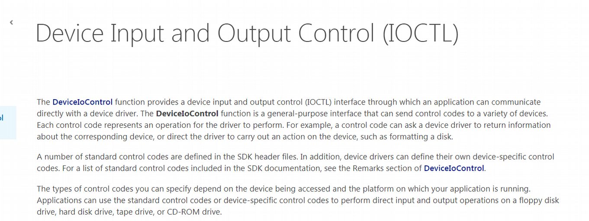

Первое, что мы должны сделать в нашей точке входа - создать **DEVICE** **OBJECT**.

Я не буду объяснять всю теорию об этом. Кто хочет узнать больше, почитайте это:

[https://docs.microsoft.com/en-us/windows-hardware/drivers/kernel/introduction-to-device-objects](https://docs.microsoft.com/en-us/windows-hardware/drivers/kernel/introduction-to-device-objects)

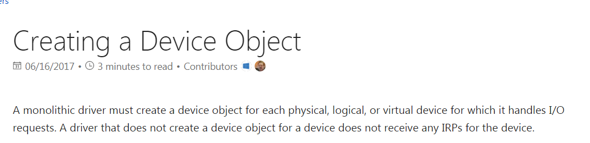

И это должно быть так. В нашем первом драйвере, мы могли только запускать и останавливать его и не могли получать управляющие команды из пользовательского режима. Поэтому теперь мы должны создать **DEVICE** **OBJECT**, используя **API** **IOCREATEDEVICE**.

Функция, которую вызывает наша **DRIVERENTRY**, аналогична

status = IoCreateDevice\(DriverObject,0,&deviceNameUnicodeString,FILE\_DEVICE\_HELLOWORLD,
0,TRUE,&interfaceDevice\);

---------------------------------------------------------------------------------------------------------------------------
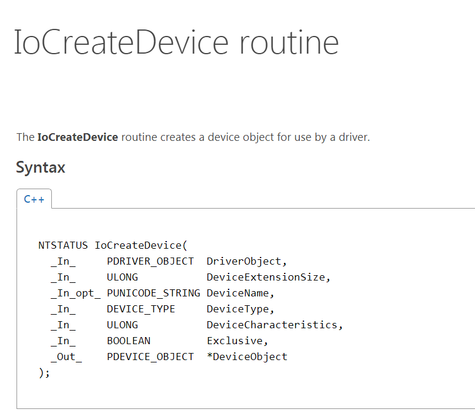

**Parameters**

**DriverObject \[in\]**
Pointer to the driver object for the caller. Each driver receives a pointer to its driver object in a parameter to its [DriverEntry](https://msdn.microsoft.com/es-es/library/windows/hardware/ff544113) routine.

NTSTATUS DriverEntry\(
PDRIVER\_OBJECT DriverObject,
PUNICODE\_STRING RegistryPath\)
{

Как мы увидели, **DRIVERENTRY** получает два аргумента. Первый - указатель на структуру **DRIVER** **OBJECT**, которая передается в качестве первого аргумента функции **IOCREATEDEVICE**.

**DeviceName \[in, optional\]**
Optionally points to a buffer containing a null-terminated Unicode string that names the device object.

WCHAR deviceNameBuffer\[\] = L"\\Device\\HelloWorld";
UNICODE\_STRING deviceNameUnicodeString;

В нашем коде **DEVICENAME** соответствует имени устройства, а затем копируется в переменную **DEVICENAMEUNICODESTRING**, который передается как аргумент **API**.

**DeviceType \[in\]**
Specifies one of the system-defined FILE\_DEVICE\_XXX constants that indicate the type of device \(such as FILE\_DEVICE\_DISK or FILE\_DEVICE\_KEYBOARD\) or a vendor-defined value for a new type of device.

В нашем случае, это значение, определяется нами в начале кода.

\#define FILE\_DEVICE\_HELLOWORLD 0x00008337

**DeviceObject \[out\]**
Pointer to a variable that receives a pointer to the newly created [DEVICE\_OBJECT](https://msdn.microsoft.com/es-es/library/windows/hardware/ff543147) structure. TheDEVICE\_OBJECT structure is allocated from nonpaged pool.

Это указатель на **DWORD**, где **API** будет содержать указатель. Поэтому система говорит, что **OUT** – используется для выходного параметра.

Это самые важные функции. Давайте теперь посмотрим на код в **IDA,** теперь, когда мы знаем эти **API**.

Мы видим, что функция, которая вызывает наш **DRIVERENTRY**, аналогична

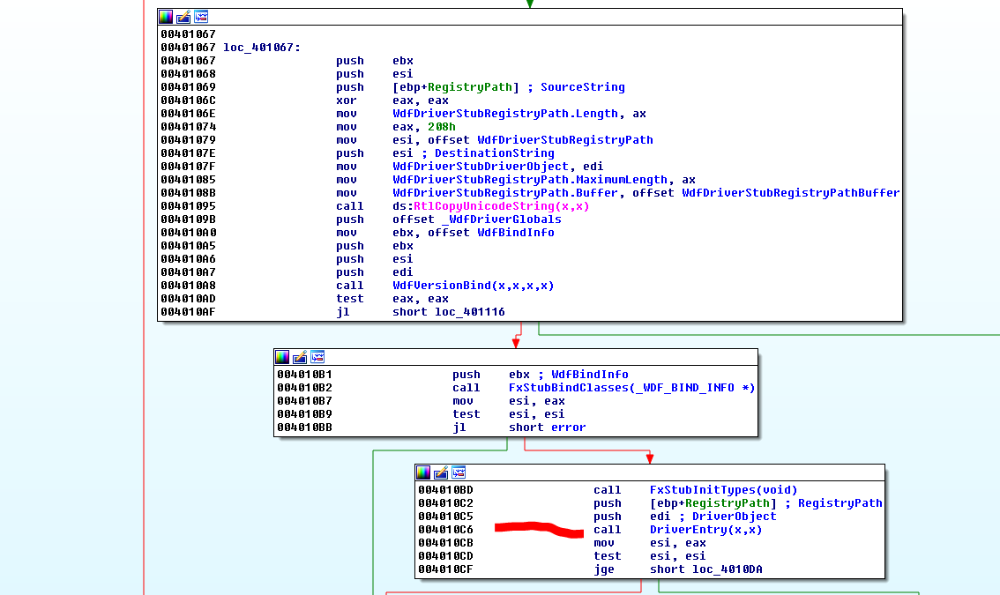

Давайте посмотрим на часть нашего кода.

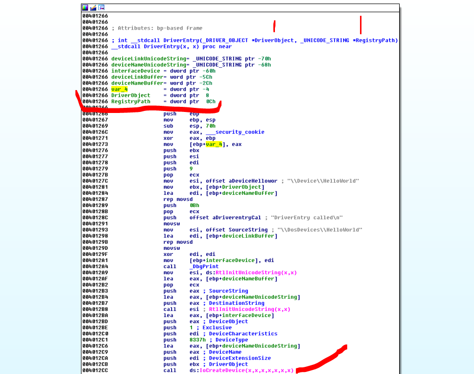

Функция начинается с тех же двух указателей на структуры типа \_**DRIVER**\_**OBJECT** и \_**UNICODE**\_**STRING**.

Остальные - это переменные. Поскольку у нас есть символы, это не очень сложный случай. Но хорошо понемногу привыкать к реальным случаям, когда у нас нет символов.

В переменную **VAR**\_**4** сохраняется **COOKIE** для защиты стека.

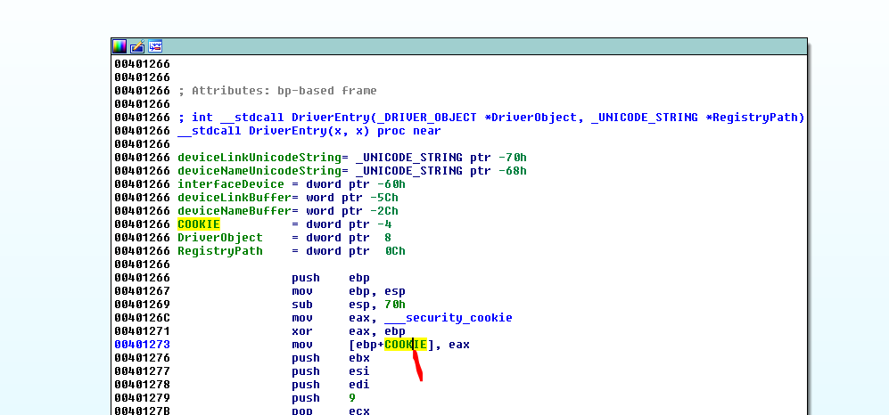

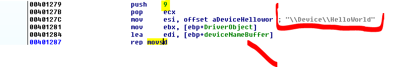

Здесь программа копирует имя устройства **UNICODE** размером **9** **DWORD** \(**0x24** байта\) в назначение, которым является переменная **DEVICENAMEBUFFER**, длина которой составляет **19** **WORDS**, т.е. **19** \* **2**, всего **38** байт в десятичном формате или **0x26** байт в шестнадцатеричном, поэтому всё, что копируется, намного меньше, чем буфер.

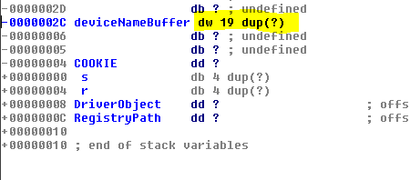

Python&gt;hex\(0x19\*2\)
0x32

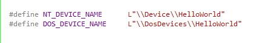

Затем копируется **DOS**\_**DEVICE**\_**NAME** размером **0xB** **DWORDS,** т.е. **0xB** \* **4** - это **0x2C** байт в шестнадцатеричной системе в общей сложности

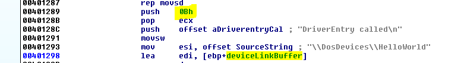

И буфер назначения это **DEVICELINKBUFFER**. Давайте посмотрим его длину.

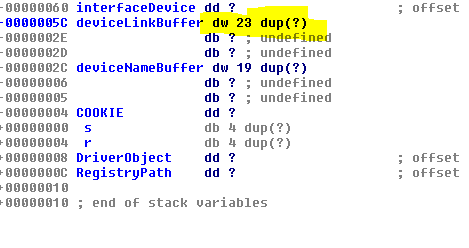

Это **23** \* **2** в десятичной системе, т.е. **46** байт, т.е **0x2E** в шестнадцатеричной системе, так что здесь тоже нет переполнения.

Проблема в том, что в **DEVICENAMEBUFFER** находится имя устройства, а в **DEVICELINKBUFFER** - имя устройства **DOS**.

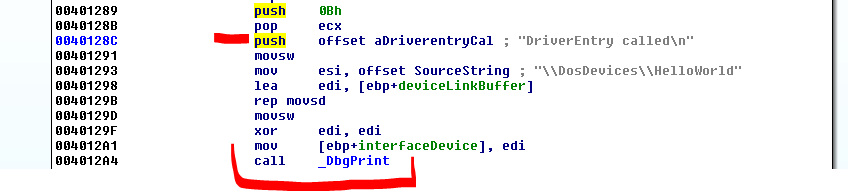

Затем идёт вызов функции **DBGPRINT**, которая печатает сообщение "**DRIVERENTRY** **CALLED**".

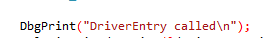

Давайте продолжим со следующего: преобразуем строку **UNICODE** в ту, которая имеет тип \_**UNICODE**\_**STRING.** Для этого существует следующий **API** **RTLINITUNICODESTRING**.

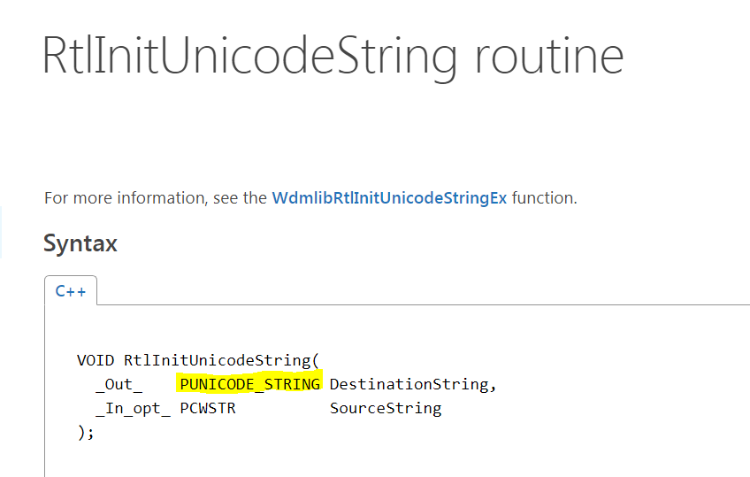

У нас есть вызов в **RTLINITUNICODESTRING**

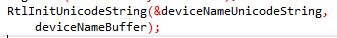

WCHAR deviceNameBuffer\[\] = L"\\Device\\HelloWorld";

Источник **DEVICENAMEBUFFER** является указателем на буфер, который имеет строку юникода, а назначение - указатель на структуру **UNICODE**\_**STRING**. Эта структура, которую мы уже видели, имеет три поля, два слова \(**LENGHT** и **MAXIMUMLENGHT**, а третья должна быть указателем на строку юникода.

Это означает, что **API** скопирует адрес этого исходного буфера в третье поле структуры, добавит **LENGHT** и **MAXIMUMLENGHT** в соответствующие поля и преобразует общий буфер со строкой **UNICODE** в структуру **UNICODE**\_**STRING**.

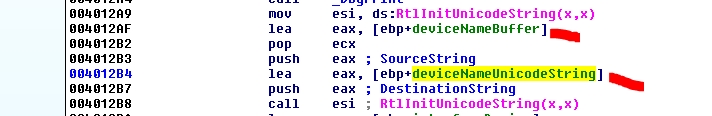

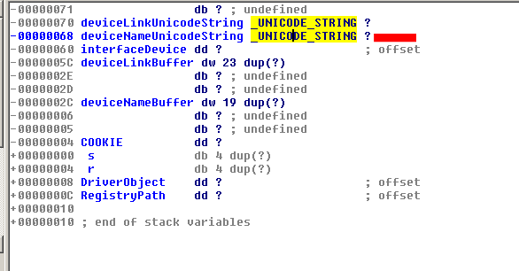

Это структура типа **UNICODE**\_**STRING** из **8** байт. Так как они представляют собой два слова для **LENGHT** и **DWORD** для копирования указателя на буфер с помощью строки юникода,

Тогда есть вызов к **API IOCREATEDEVICE**, про которую мы говорили.

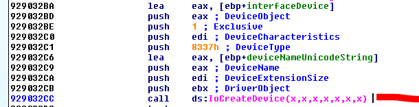

Мы видели, что самый дальний аргумент, т.е. последний, был указателем на **DWORD**, который использовался как выход. Так что **API** хранит там указатель. Мы видим, что программа устанавливает нуль в переменную **INTERFACEDEVICE**, а затем с помощью инструкции **LEA** находит указатель на эту переменную, где будет записан указатель.

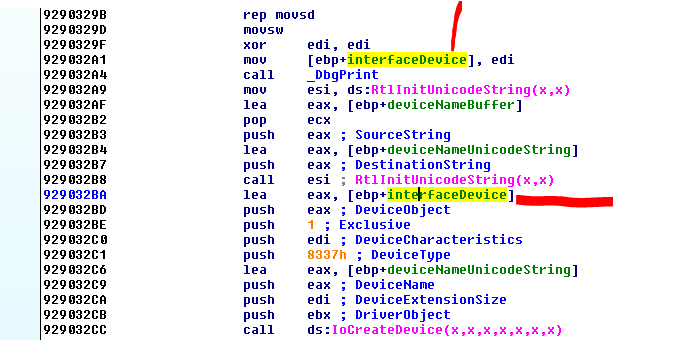

Затем идет инструкция **PUSH** **1**, которая является исключительным аргументом, который мы не видели раньше, потому что это не имело большого значения. Затем появляется инструкция **PUSH** **EDI.**Мы видим, что в регистре **EDI** есть нуль, поскольку раньше была выполнена инструкция **XOR** **EDI**, **EDI**.

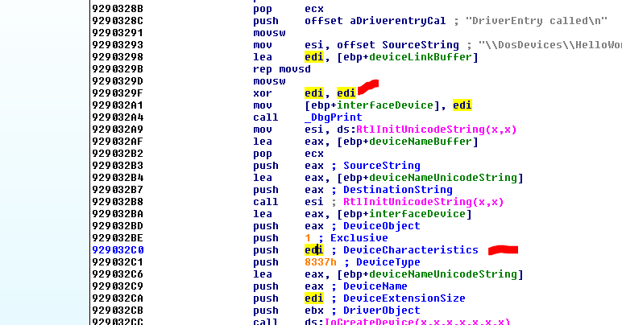

Это также не очень важно. Затем идёт инструкция **PUSH** **8337H**, которая является константой **DEVICETYPE**, которую мы определили в исходном коде.

\#define FILE\_DEVICE\_HELLOWORLD 0x00008337

Затем появляется указатель на структуру с \_**UNICODE**\_**STRING** с **DEVICENAME**

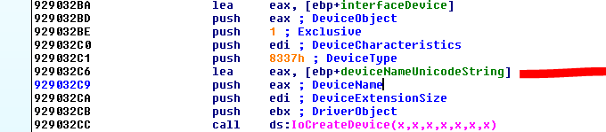

Затем идет другая инструкция **PUSH** **EDI**, которая равна нулю **DEVICEEXTENSIONSIZE** и в конце регистр **EBX** является указателем на **DRIVEROBJECT**.

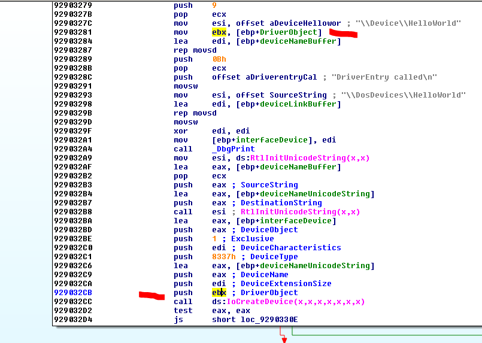

Давайте запомним, что это указатель на структуру \_**DRIVER**\_**OBJECT**.

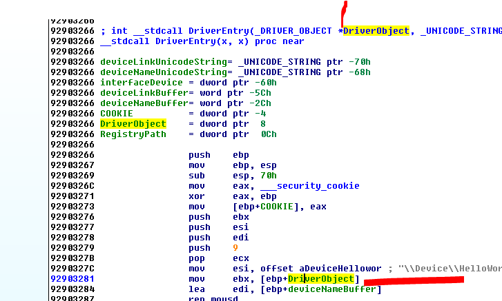

Хорошо. При выходе из **API** будет создан **DEVICEOBJECT**.

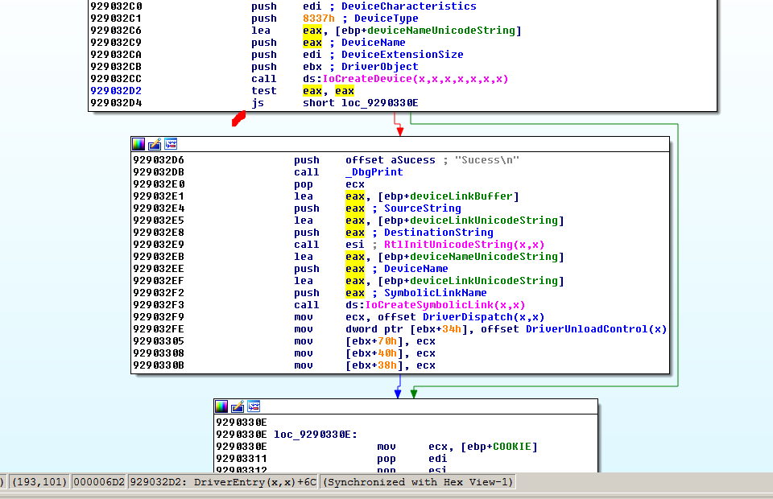

Если регистр **EAX** имеет отрицательное значение, будет сбой и инструкция **JS** будет переходить на зеленую стрелку. Но у нас всё будет нормально и программа перейдет к функции **DBGPRINT**, которая напечатает "**SUCESS**"

Затем программа будет делать то же самое с другой строкой **UNICODE** при преобразовании ее из буфера со строкой **UNICODE** в структурную форму \_**UNICODE**\_**STRING**, как и раньше, с помощью **APIRTLINITUNICODESTRING**.

Поэтому **DEVICELINKUNICODESTRING** теперь будет иметь тип \_**UNICODE**\_**STRING** и будет иметь в своем третьем поле указатель на буфер со строкой **UNICODE** **L"\\DOSDEVICES\\HELLOWORLD"**.

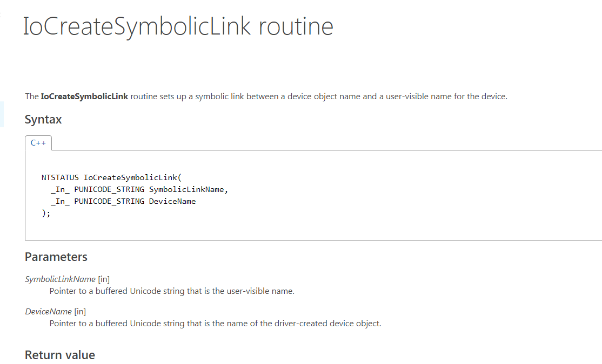

Затем, передаются указатели на два \_**UNICODE**\_**STRING** в функцию **IOCREATESYMBOLICLINK.** Мы создаем символическую связь между **DEIVCEOBJECT** и пользовательским режимом.

Регистр **EBX** имеет указатель на структуру **DRIVER\_OBJECT**

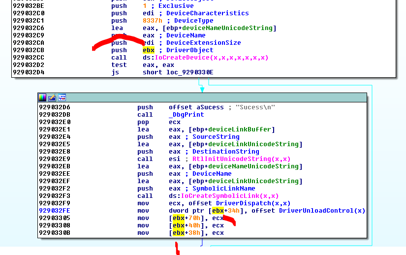

Если объект не находится в структурах как раньше, мы переходим в **LOCAL** **TYPES** и синхронизируем программа так, чтобы объект отображался. Мы нажимаем **T** в каждом из этих полей.

Как и в предыдущем случае, мы устанавливаем пользовательскую подпрограмму, когда загружается драйвер, которая находится по смещению **EBX** + **34H.** Теперь нажимая **T**, мы видим, что это поле **DRIVERUNLOAD**.

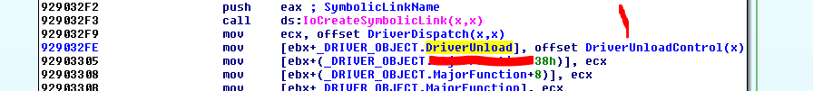

Мы видим, что программа загрузки драйвера не только печатает с помощью **DBGPRINT** строку "**DRIVER** **UNLOADING**"

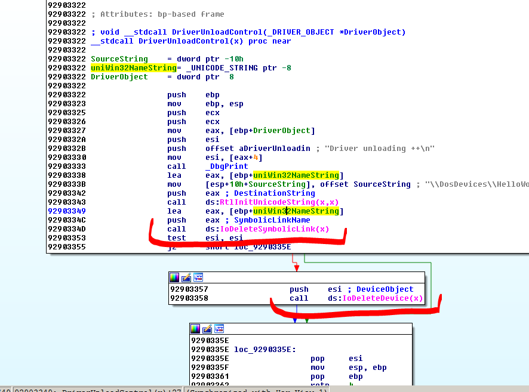

Поскольку раньше мы создавали символическую ссылку с помощью функции **IOCREATESYMBOLICLINK**, когда мы выходим, мы должны удалить ее с помощью функции **IODELETESYMBOLICLINK**, а также, поскольку мы использовали для создания функцию **DEVICEOBJECT** с **IOCREATEDEVICE**, теперь устройство будет удаляться с помощью **IODELETEDEVICE**, иначе возникнут проблемы с его загрузкой.

Последней вещью во входной функции является поле **MAJORFUNCTION**, которое представляет собой массив указателей обратных вызовов \(**DWORD**\) на разные функций.

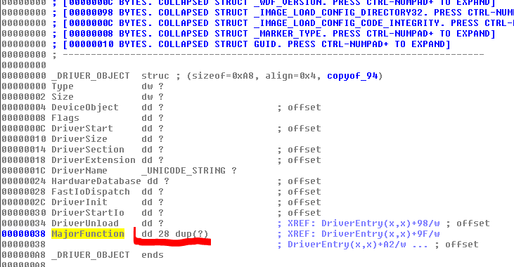

**MAJORFUNCTION** \[**IRP**\_**MJ**\_**CREATE**\] - это первая позиция в массиве, т.е. **MAJORFUNCION**\[**0x0**\].

Поскольку у нас есть таблица.

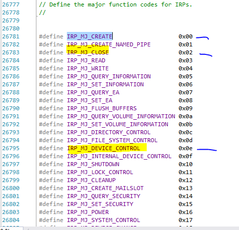

**\[IRP\_MJ\_CREATE\]** это **0x0
\[IRP\_MJ\_CLOSE\]** это **0x02
\[IRP\_MJ\_DEVICE\_CONTROL\]** это **0x0E**

Три поля инициализируются адресом функции **DRIVERDISPATCH**

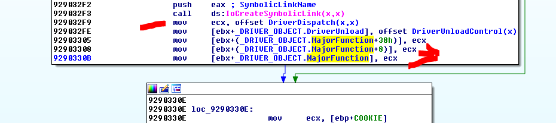

Значение записывается в положение **0x0**, так как \[**IRP**\_**MJ**\_**CLOSE**\] равно **0x0** \* **4** = **0**

Затем

**\[IRP\_MJ\_CLOSE\]** равно **0x2** \* **4** даёт **8**

И затем

**\[IRP\_MJ\_DEVICE\_CONTROL\]** это **0x0E** \* **4** даёт **0x38**

Таким образом, все три инструкции пишут один и тот же указатель на одну и ту же функцию.

Каждый из этих обратных вызовов вызывается в разные моменты взаимодействия из программы в пользовательском режиме.

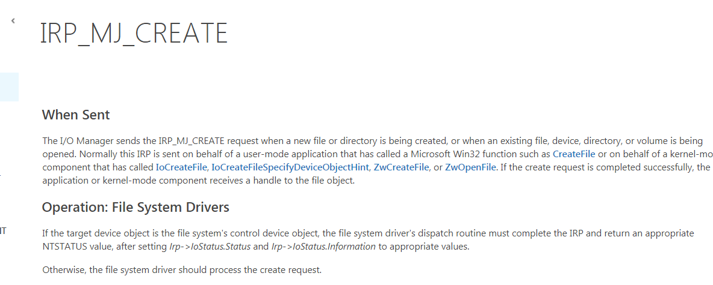

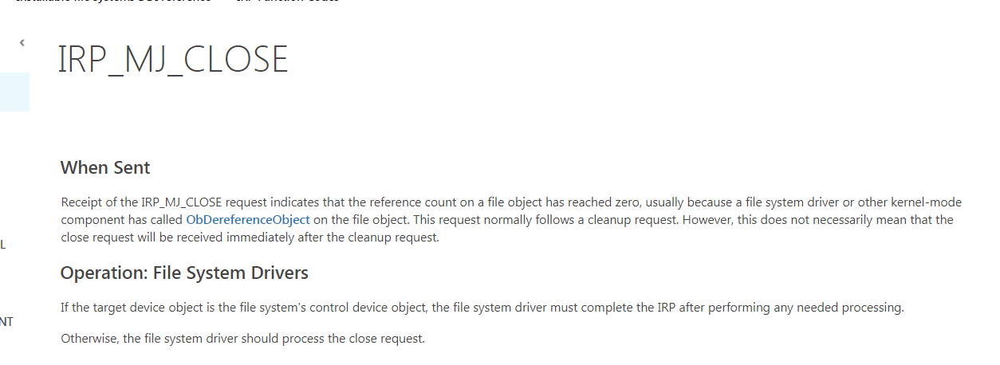

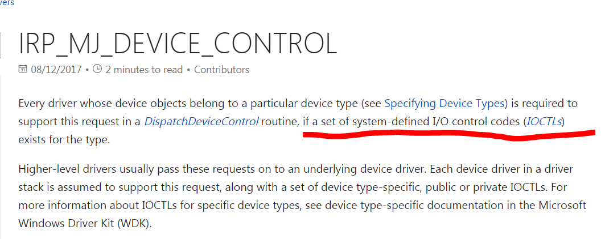

Видно, что когда мы делаем вызов из приложения в пользовательском режиме через **DEVICEIOCONTROL** с использованием **IOCTL** используется этот обратный вызов. Так же во всех трех случаях программа переходит к той же функции, поскольку мы перезаписываем на неё указатели на **DRIVERDISPATCH**.

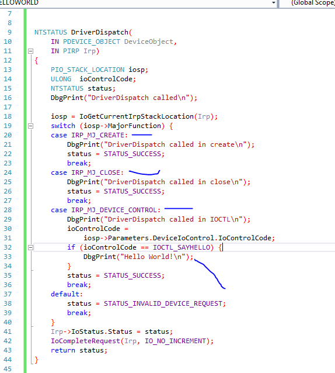

Функция получает два аргумента. Знаменитый указатель на **DEVICE**\_**OBJECT**, а второй - указатель на структуру **IRP**, которая является сложной структурой, и мы увидим её позже.

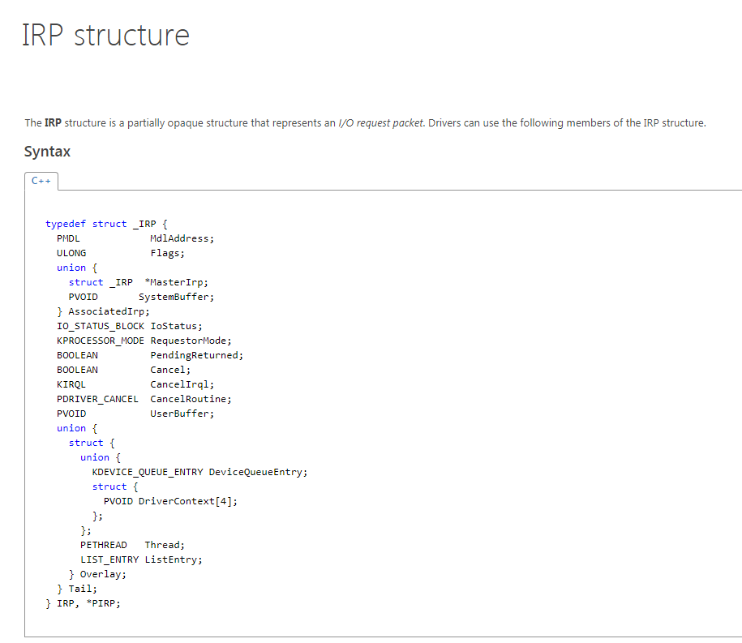

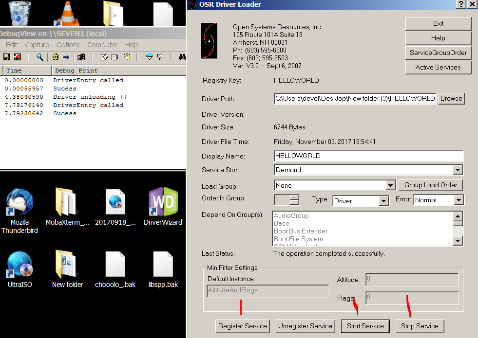

Мы видим, что, как и в предыдущий раз при регистрации и запуске, драйвер печатает **DRIVERENTRY** **CALLED** и **SUCESS**, а также при выгрузке **Driver** **UNLOADING**, но теперь также из пользовательского приложения, которое я сделал при его запуске, хотя раньше нужно было нажимать **START** **SERVICE** для того, чтобы он начал печатать.

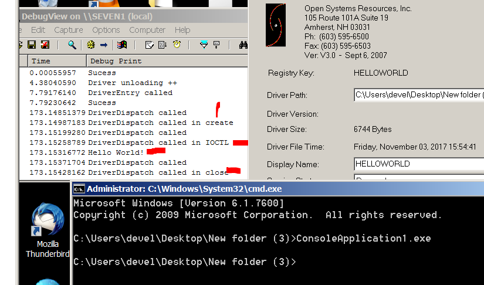

При взаимодействии с программой в пользовательском режиме вызывается обработчик. Мы видим, что моя программа делает только это \(исполняемый файл будет прикреплен к туториалу\)

\#include "stdafx.h"
\#include &lt;windows.h&gt;

\#define FILE\_DEVICE\_HELLOWORLD 0x00008337
\#define IOCTL\_SAYHELLO \(ULONG\) CTL\_CODE\( FILE\_DEVICE\_HELLOWORLD, 0x00, METHOD\_BUFFERED, FILE\_ANY\_ACCESS \)

int main\(\)
{

HANDLE hDevice;
DWORD nb;
hDevice = CreateFile\(TEXT\("\\\\.\\HelloWorld"\), GENERIC\_READ \| GENERIC\_WRITE, 0, NULL, OPEN\_EXISTING, FILE\_ATTRIBUTE\_NORMAL, NULL\);

DeviceIoControl\(hDevice, IOCTL\_SAYHELLO, NULL, 0, NULL, 0, &nb, NULL\);

CloseHandle\(hDevice\);
return 0;

}

Т.е. когда я вызываю функцию **CREATEFILE,** чтобы иметь хэндл драйвера, драйвер переходит к обработчику через обратный вызов \[**IRP**\_**MJ**\_**CREATE**\] и печатает следующее:

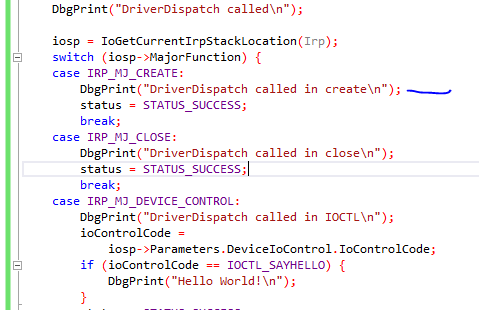

Затем, когда Вы вызываете с помощью **функции** **DEVICEIOCONTROL**, передавая его **IOCTL** код.

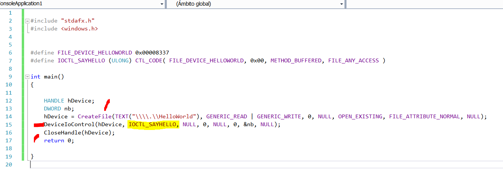

Драйвер использует обратный вызов \[**IRP\_MJ\_DEVICE\_CONTROL**\], а затем проверяет, является ли **IOCTL** код равным в этом случае **IOCTL**\_**SAYHELLO**

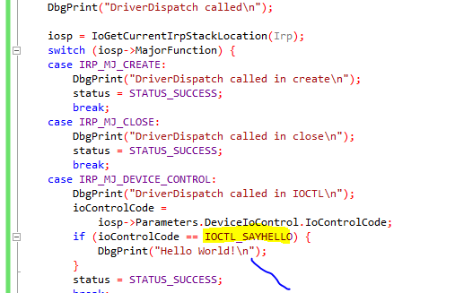

В этом случае драйвер печатает "**HELLO** **WORLD**"

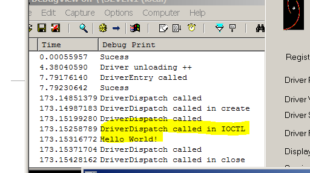

И последний код вызывается, когда я вызываю функцию **CLOSEHANDLE** и вызывается соответствующий \[**IRP**\_**MJ**\_**CLOSE**\]

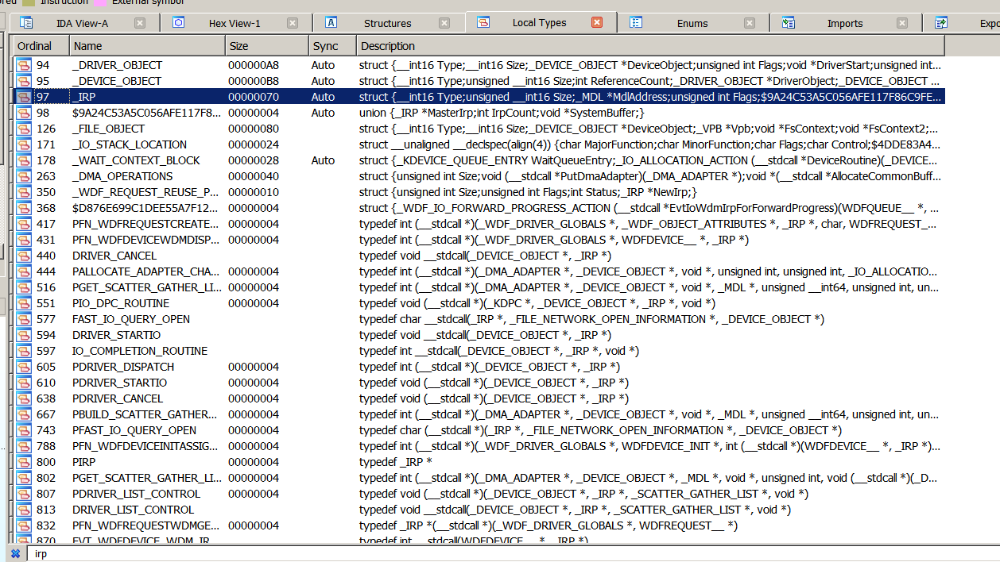

Я синхронизирую структуру **IRP** через **LOCAL** **TYPES.**

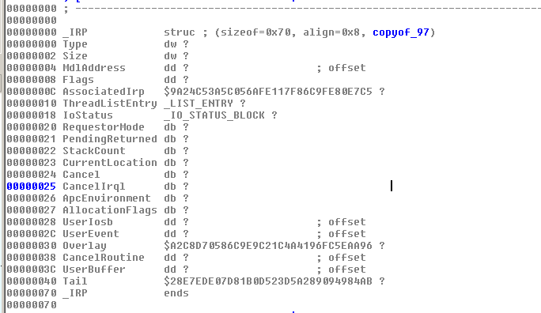

И я вижу на вкладке **STRUCTURES** ту же самую структуру.

Мы видим, что когда я его отладку, и я поставлю **BP** в функцию обработки, после прибываем в это место

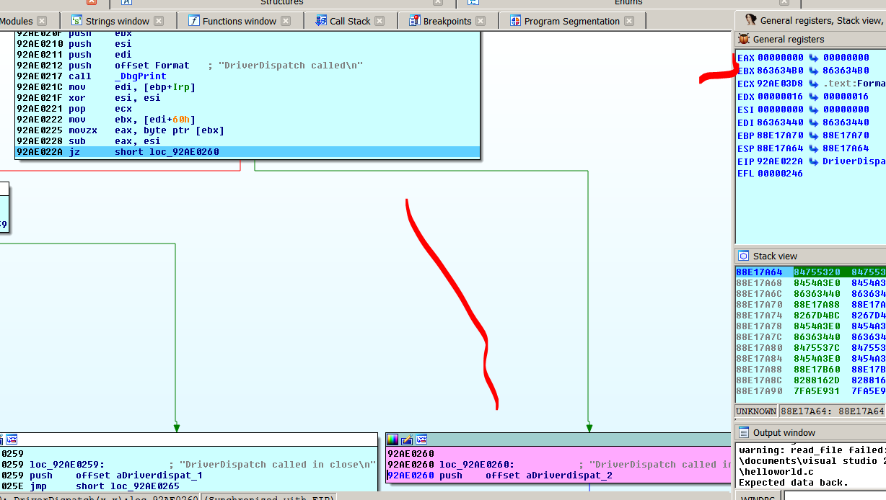

Драйвер читает из структуры **IRP** часть **TAIL,** которая не определена в **MSDN**, но здесь, после поиска по смещению **EDI**+**60** и передачи этого значения в регистр **EBX**, его содержимое переходит в регистр **EAX**, который впервые имеет значение \[**IRP\_MJ\_CREATE**\], т.е. нуль. И в этом случае драйвер пойдет туда, чтобы напечатать сообщение о том, что произошло создание.

Если я снова нажму **RUN**, драйвер снова остановится со значением регистра **EAX** равным **0x0E** из \[**IRP\_MJ\_DEVICE\_CONTROL**\].

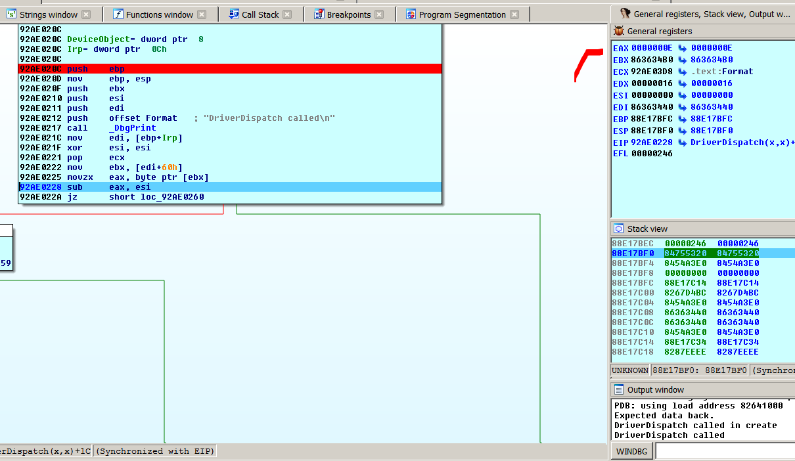

Поскольку регистр **EAX** отличается от нуля, драйвер идет сюда.

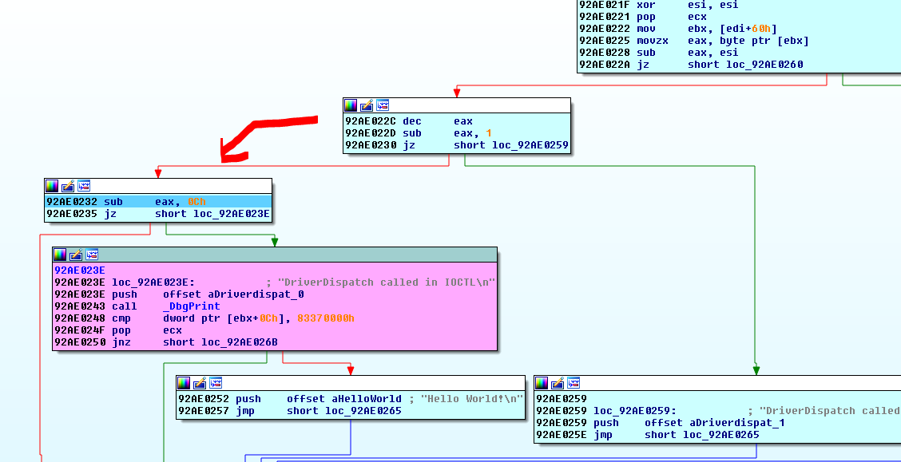

И в этом случае драйвер приходит в розовый блок, печатая, что добрался сюда через **IOCTL**.

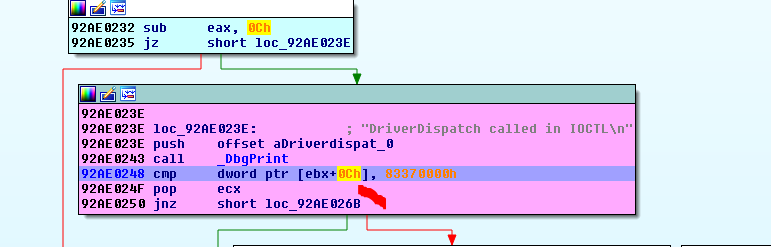

\#define IOCTL\_SAYHELLO \(ULONG\) CTL\_CODE\( FILE\_DEVICE\_HELLOWORLD, 0x00, METHOD\_BUFFERED, FILE\_ANY\_ACCESS \)

В коде **IOCTL** код, который получается из значения **0x8337** **FILE\_DEVICE**, выполняется несколькими операциями в соответствии с типом **IOCTL** \(в этом случае **METHOD** **BUFFERED** и т.д. и т.д\), Который дает нам **IOCTL** код равным **83370000**.

Здесь драйвер сравнивает это и как есть. Он выходит и печатает сообщение "**HELLO** **WORLD**!".

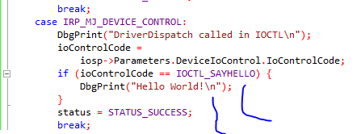

Когда мы проходим через функцию **DEBUGPRINT**, драйвер показывает нам в панели **WINDBG** сообщение. Если бы было несколько **IOCTL** с разными кодами, здесь был бы переключатель.

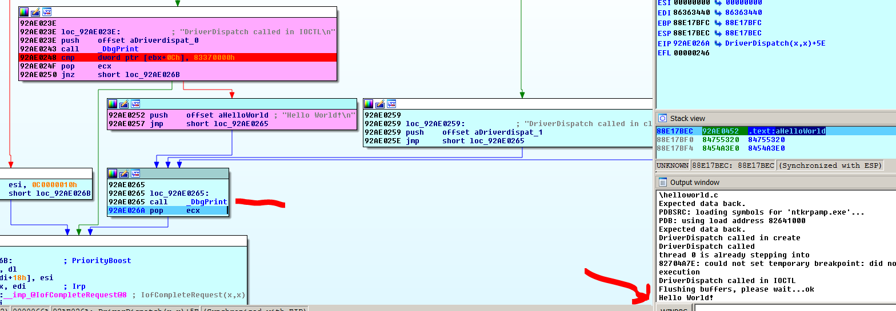

В третий раз, когда мы останавливаемся, мы исполняем функцию **CLOSEHANDLE** и регистр **EAX** равен **2**.

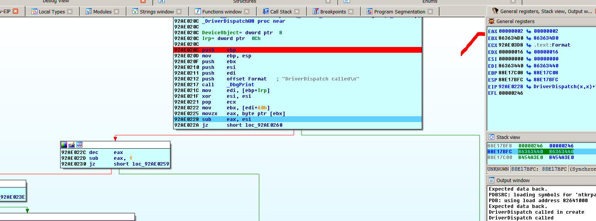

И происходит печать.

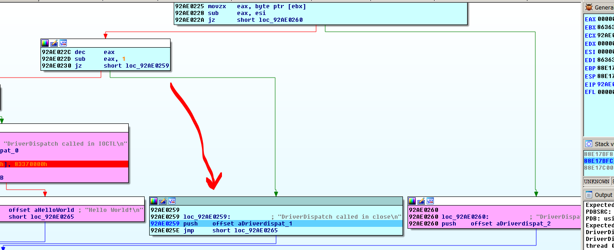

Я думаю, что с этим туториалом мы хорошо познакомились с этой темой. Мы продолжим в следующей части и будем углубляться больше.
**=======================================================
Автор текста: Рикардо Нарваха** - **Ricardo** **Narvaja** \(**@ricnar456**\)
Перевод на русский с испанского: **Яша\_Добрый\_Хакер\(Ростовский фанат Нарвахи\).**
Перевод специально для форума системного и низкоуровневого программирования — **WASM.IN
22.10.2018
Версия 1.0**
