# Часть 53

Деталь, про которую я хотел рассказать в этом туториале, которую в предыдущей части мы не рассматривали, так как определение структуры **IRP** не было для нас полным...

Если я вернусь к отладке и когда остановлюсь, я буду использовать командную строку **WINDBG**, чтобы увидеть содержимое структуры. Мы знаем, что команда **DT** показывает нам содержимое структуру. В этом случае это содержимое структуры **\_IRP**.

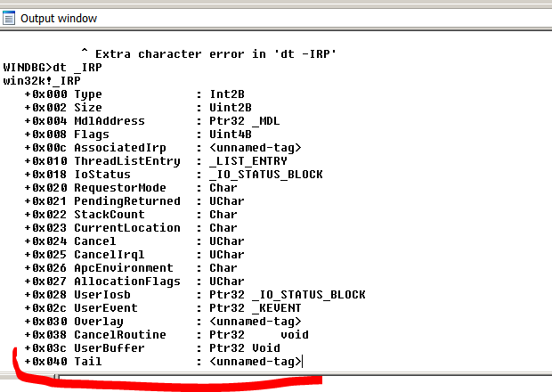

**IDA** не показывает нам поле по смещению **0x60**, которое является тем, которое читается и находится внутри структуры **TAIL**. Но здесь есть трюк, который помогает прояснить немного больше вещей.

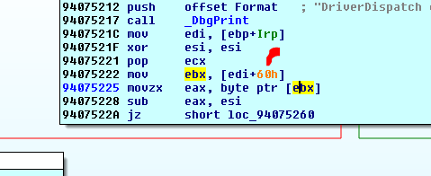

Существует несколько модификаторов для команды **DT**. Первый модификатор - это **-V**, который переводит команду в подробный режим. Другой модификатор -это **-R**, который задаёт глубину подструктур, чтобы показать нам её же. Давайте посмотрим, что произойдет, если мы введем такую команду.

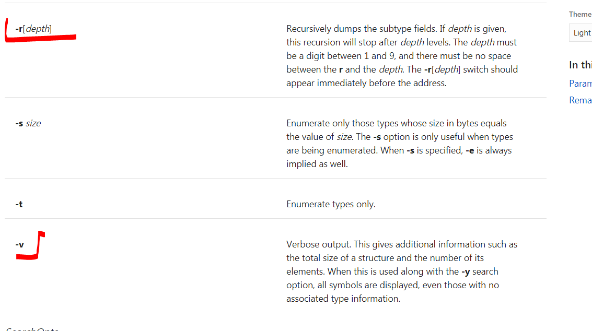

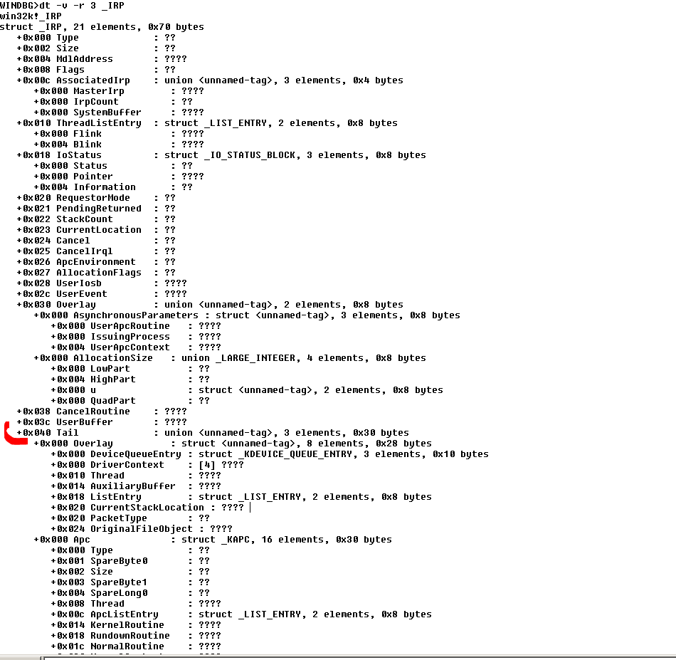

Теперь **IRP** выглядит намного лучше. Нам даже показывается содержимое подструктуры **TAIL**

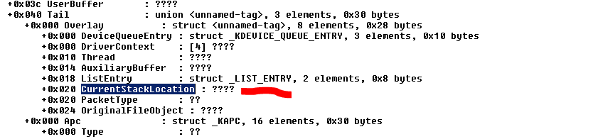

Мы видим, что подструктура **TAIL** начинается по смещению **0x40** основной структуры, а по смещению **0x20** подструктуры **TAIL** чуть ниже находится указатель **CURRENTSTACKLOCATION**, который тоже будет структурой. Она находится по смещению **0x60**

Мы поищем структуру **CURRENTSTACKLOCATION** в **WDK**, если он конечно установлен

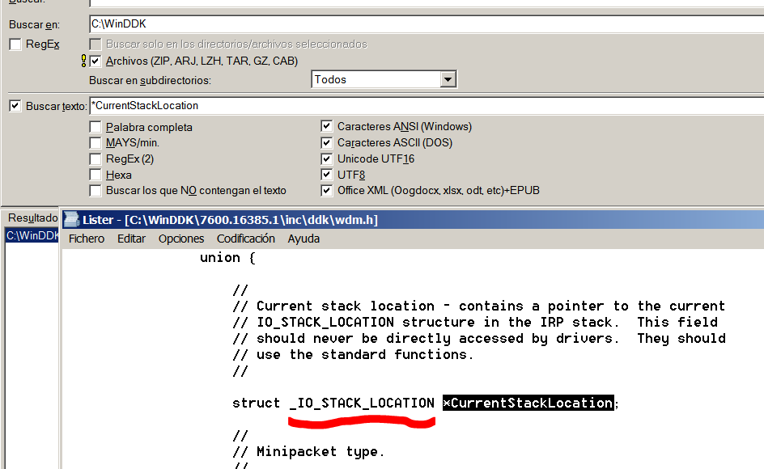

**WINCMD** находит нам указатель **CURRENTSTACKLOCATION**, который является структурой типа **\_IO\_STACK\_LOCATION.** Давайте посмотрим, покажет ли нам **WINDBG** содержимое структуры.

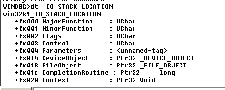

Мы получили то что нужно. Но все же нам не показывается поле **0X0C**, которое находящееся внутри структуры **PARAMETERS.** Также мы увидели, что нам показывается структура у которой есть подструктуры. Поэтому мы будем использовать модификаторы снова.

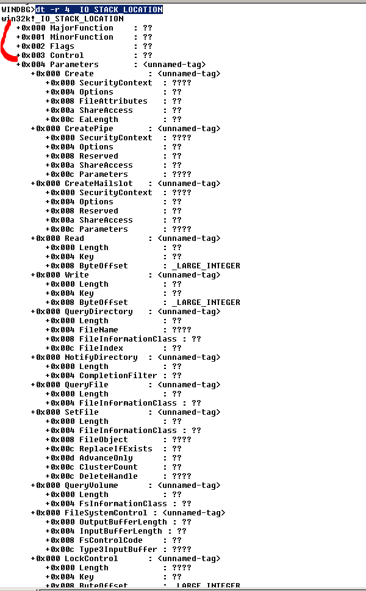

Мы видим, что поля, начинающиеся со смещения **0x004.** Имена изменяются в соответствии с действием, которое они выполняют. Для каждого действия существует другое определение этих полей.

Поскольку в нашем случае, мы ищем код **IOCTL**, который используется только во второй раз, когда мы вызываем **DEVICEIOCONTROL**, поэтому мы можем посмотреть здесь и увидеть, что поле **0x8**внутри **PARAMETERS**, для этого случая это **IOCTL**. Если мы посмотрим с начала структуры **\_IO\_STACK\_LOCATION** это будет полем по смещению**0xC,** так как перед **PARAMETERS** было **0x4** байт.

Если мы поищем в **WDK** определение структуры.

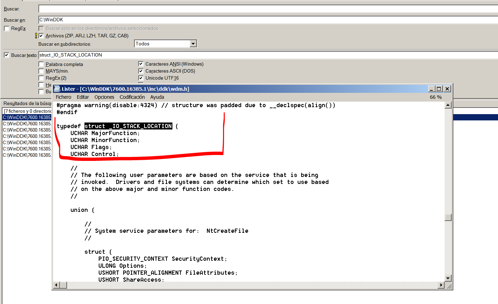

Мы видим, что так же как и в **WINDBG**, мы получаем, что первая часть является фиксированной, но затем, когда она идет слово, **UNION** это означает, что следующая часть является переменной частью и зависит от кода, с которым мы работаем. Существуют разные значения в зависимости от того, что и как вы вызываете функции **CREATEFILE**, **READFILE** и т.д., Что же важно для нас, это то, что когда драйвер вызывается из **DEVICEIOCONTROL**, так как это **API**, который используется для передачи кода **IOCTL**.

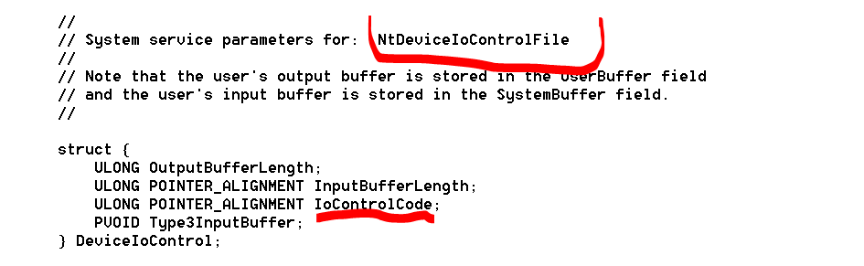

Ahí esta asi que como el tipo **ULONG** es de **4** bytes de largo. Vemos entonces que si lo completamos.

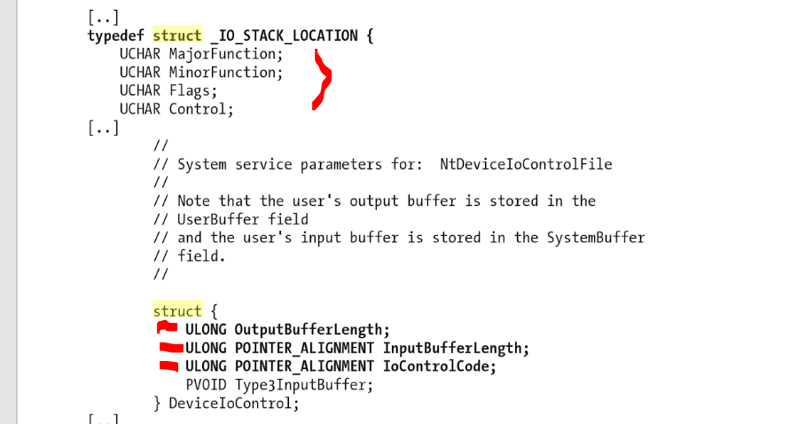

Первые четыре переменные являются типа **UCHAR**, т.е. байт. Сумма всех полей означает, что структура **PARAMETERS** начинается по смещению **0x4**. Вот что на это сказал нам **WINDBG.**

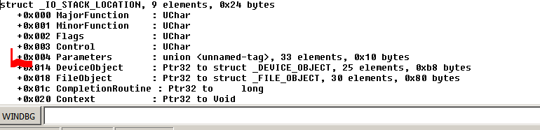

И затем здесь по смещению **0x4** от начала структуры **\_IO\_STACK\_LOCATION** будет первое поле **OUTPUTBUFFERLENGHT** структуры. По смещению **0x8** будет поле **INPUTBUFFERLENGHT**, а по смещению **0xC** будет **IOCTL** или поле **IOCONTROLCODE**.

Это совпадает с нашим реверсингом, поскольку, если по смещению **IRP**+**0x60** начинается структура **\_IO\_STACK\_LOCATION**, то она читается здесь.

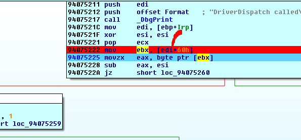

Это означает, что в регистр **EBX** помещается адрес структуры **\_IO\_STACK\_LOCATION**. Поэтому поскольку она существует в **LOCAL** **TYPES** в **IDA**, мы синхронизируем её с кодом. И в регистре **EBX** мы нажимаем **T** и выбираем её.

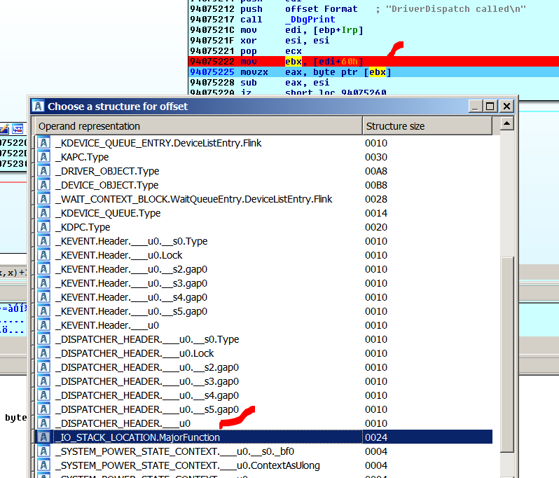

Здесь драйвер читает в регистр **EAX** значение **MAJORFUNCTION**. Так как он читает только один байт, то это будет это поле.

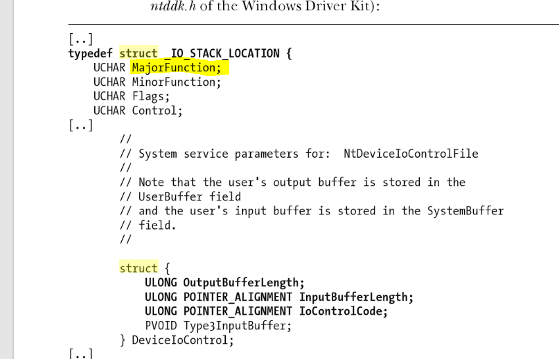

Давайте вспомним, что это было значение, которое мы взяли из таблицы

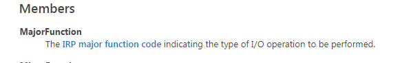

В первый раз, когда я вызываю функции **CREATEFILE**, будет передавать код **0x0.** Во второй раз, когда я использую функцию **DEVICEIOCONTROL**, будет передавать код **0xE.** И в третий раз, когда я вызываю функцию **CLOSEHANDLE**, будет передавать код **0x02**.

Конечно, поскольку это первый вызов, когда отладчик останавливается и когда драйвер вызывает функцию **CREATEFILE**, регистр **EAX** будет равен нулю.

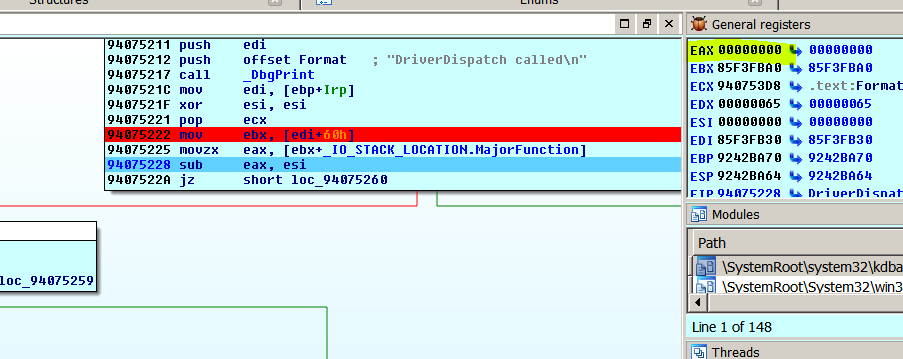

Я буду продолжать, пока не остановлюсь снова на том же адресе.

Сейчас, если **MAJORFUNCION** равно **0xE**.

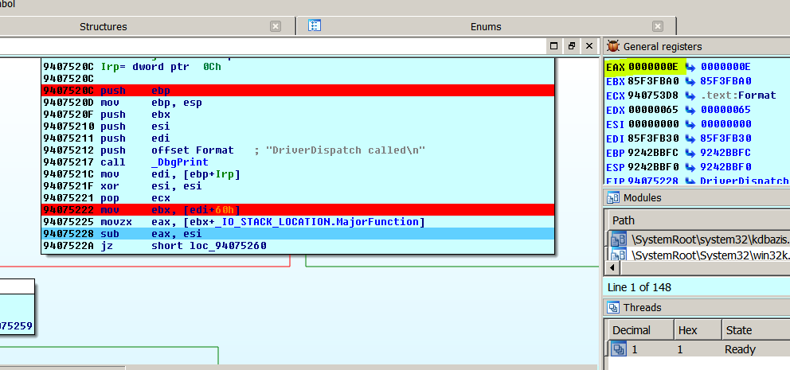

Мы видим, что мы находимся на инструкции, где по смещению **0xC**, будет сохраняться **IOCTL.** Если я нажму **T.**

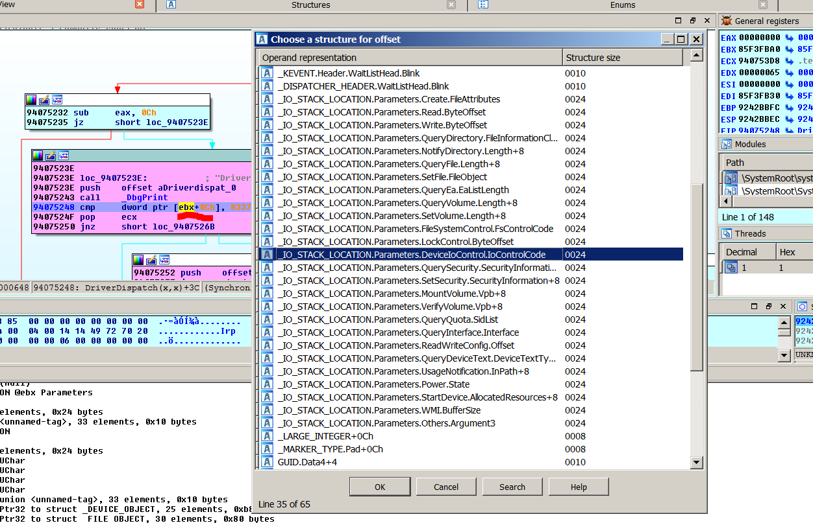

И мне показывается список опций. Я вижу, что есть для поля для **CREATE**, **READ** и т.д. Я ищу функцию **DEVICEIOCONTROL** и поле **IOCONTROLCODE**.

Y ahora si me queda perfectamente reverseado y coincide ya que solo pasara por alli cuando sea el **MAJORFUNCTION** **0xE**, y como en los otros valores de **MAJORFUNCION** no pasa por acá, no habrá ningún error.

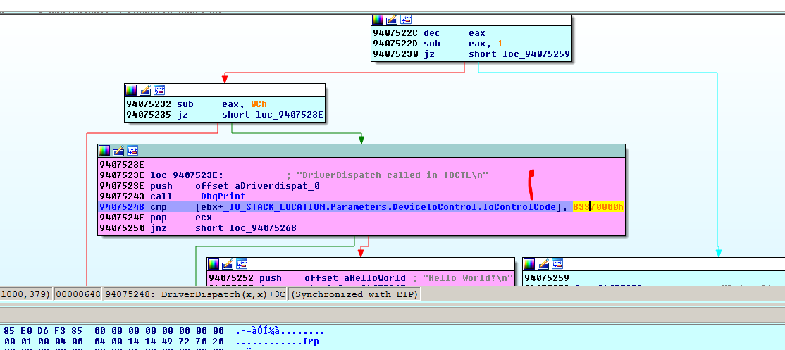

Если в другой части программы драйвер прочитает это же самое поле **0xC**, когда он использует другую функцию **MAJORFUNCTION,** в этом случае, нажав **T**, мы выберем соответствующее поле.

**=======================================================
Автор текста: Рикардо Нарваха** - **Ricardo** **Narvaja** \(**@ricnar456**\)
Перевод на русский с испанского: **Яша\_Добрый\_Хакер\(Ростовский фанат Нарвахи\).**
Перевод специально для форума системного и низкоуровневого программирования — **WASM.IN
25.10.2018
Версия 1.0**
