# Часть 54

[\[Используемые материалы\]](.gitbook/assets/files/54.zip)

Мы собираемся немного изменить предыдущее упражнение, а также сделаем программу для пользовательского режима, прямо в **PYTHON**.

Для этого, на целевой машине, где запущен драйвер, мы должны установить **PYTHON**. Я установил версию **2.7**, а также загрузил инсталлятор **PYWIN32**, который соответствует моей версии **PYTHON**.

[https://sourceforge.net/projects/pywin32/files/pywin32/Build 214/](https://sourceforge.net/projects/pywin32/files/pywin32/Build%20214/)

Поскольку моя версия **PYTHON** равна **2.7**, то скачайте этот файл.

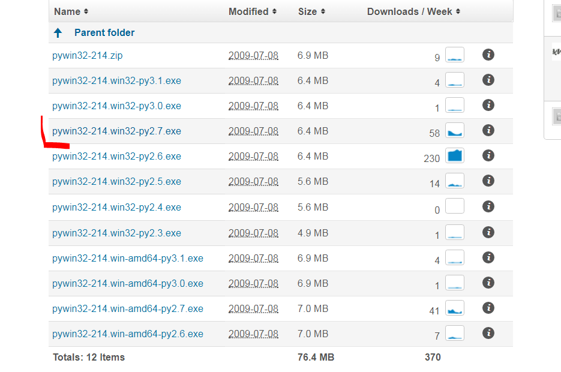

Это инсталлятор. Запускаем его и он устанавливается. С этой программой мы сможем запустить скрипт **PYTHON**, который заменит предыдущую пользовательскую программу.

Мы видим, что у драйвера теперь есть еще два кода **IOCTL**.

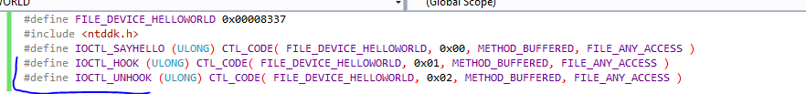

В дополнение к коду **IOCTL\_SAYHELLO**, который у нас уже был, теперь есть два новых: код **IOCTL\_HOOK** и код **IOCTL\_UNHOOK**.

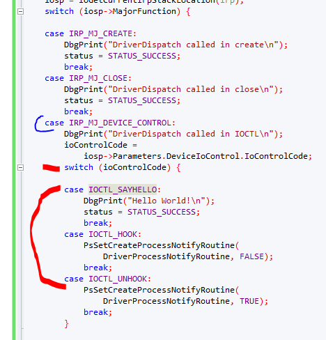

Мы видим, что внутри **CASE**, когда **MAJORFUNCTION** равен **IRP\_MJ\_DEVICE\_CONTROL**, есть еще один переключатель, который имеет три **CASE IOCTL**.

Мы видим, что код **IOCTL**, который мы имели раньше, все еще печатает только фразу "**HELLO WORLD**"

case IOCTL\_SAYHELLO:
DbgPrint\("Hello World!\n"\);
status = STATUS\_SUCCESS;
break;

Давайте посмотрим другие два.

case IOCTL\_HOOK:
PsSetCreateProcessNotifyRoutine\(
DriverProcessNotifyRoutine, FALSE\);
break;
case IOCTL\_UNHOOK:
PsSetCreateProcessNotifyRoutine\(
DriverProcessNotifyRoutine, TRUE\);
break;

Мы видим, что драйвер использует функцию **PSSETCREATEPROCESSNOTIFYROUTINE**

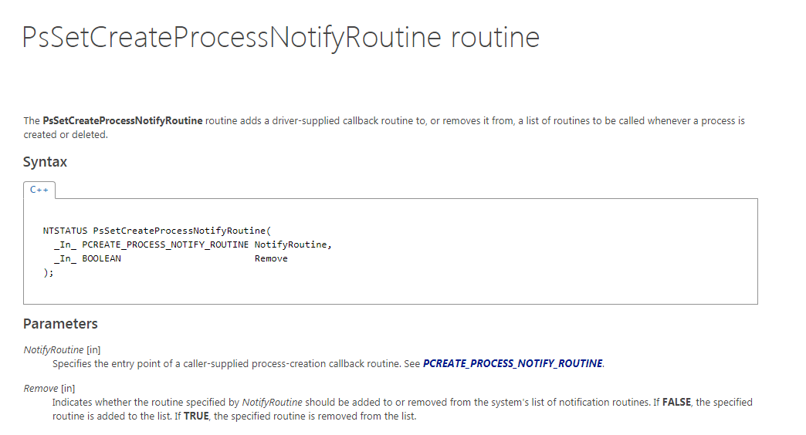

Эта функция позволяет нам добавить **CALLBACK**, т.е. свою собственную функцию, которая будет срабатывать каждый раз, когда система запускает или останавливает программу, передавая ей для активации второй аргумент **FALSE**, а в первый аргумент адрес функции, в которую будет переходить драйвер.

Наша функция, в которую будет переходить драйвер, называется **DRIVERPROCESSNOTIFYROUTINE**, и если условие **CREATE** истинно, драйвер печатает, что создан новый процесс, **PID** родительского процесса, который его создал, и сам **ID** процесса.

VOID DriverProcessNotifyRoutine\(
IN HANDLE ParentId,
IN HANDLE ProcessId,
IN BOOLEAN Create\)
{
if \(Create\)
{
DbgPrint\("Process %d created process %d\n",
ParentId, ProcessId\);
}
else
{
DbgPrint\("Process %d has ended\n",
ProcessId\);
}
}

И когда процесс завершается, так как условие **CREATE** будет ложным, драйвер напечатает, что процесс завершился и его **PID**.

Конечно, вы должны убедиться, что перед остановкой драйвера, что функция будет отключена, иначе драйвер будет переходить к функции, которая не существует, и будет вызывать **BSOD**.

case IOCTL\_UNHOOK:
PsSetCreateProcessNotifyRoutine\(
DriverProcessNotifyRoutine, TRUE\);
break;

Второй аргумент установленный в **TRUE** отключает функцию - и система продолжает работать нормально.

Хорошо. Исходный код драйвера будет доступен во вложении. Помните, что если вы скомпилируете его в **VISUAL STUDIO**, вы должны изменить **НАСТРОЙКИ** в **WINDOWS** 7 и свойства **DESKTOP**, а также снизить уровень строгости ошибок с **4** уровня до **1** или **2**.

Хорошо. Теперь идет скрипт **PYTHON**, который отправит **IOCTL** драйверу, когда тот будет запущен.

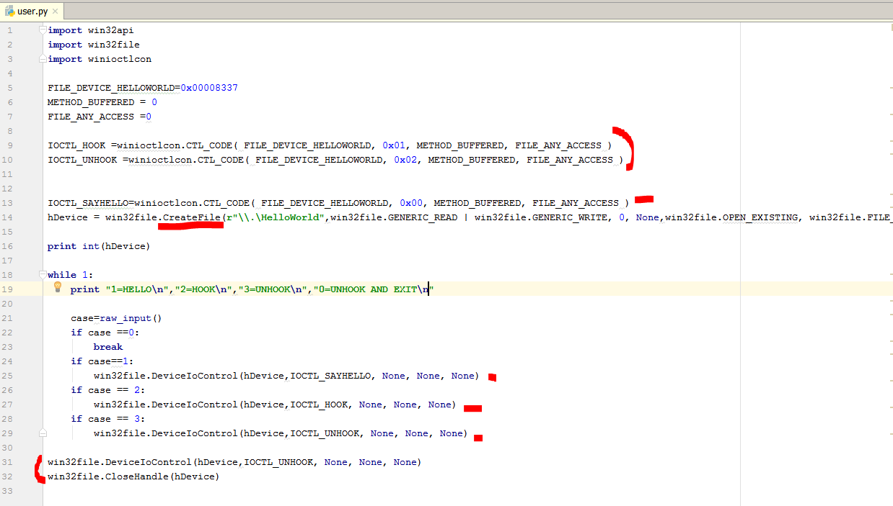

Мы видим, что это небольшой скрипт. Вам нужно импортировать модули **WIN32API** и **WIN32FILE**, в дополнение к **WINIOCTLCON**. Всё это входит в пакет **PYWIN32**, который мы установили. Если вы его не установили, это даст вам ошибку.

IOCTL\_HOOK =winioctlcon.CTL\_CODE\( FILE\_DEVICE\_HELLOWORLD, 0x01, METHOD\_BUFFERED, FILE\_ANY\_ACCESS \)

IOCTL\_UNHOOK =winioctlcon.CTL\_CODE\( FILE\_DEVICE\_HELLOWORLD, 0x02, METHOD\_BUFFERED, FILE\_ANY\_ACCESS \)


IOCTL\_SAYHELLO=winioctlcon.CTL\_CODE\( FILE\_DEVICE\_HELLOWORLD, 0x00, METHOD\_BUFFERED, FILE\_ANY\_ACCESS \)

Мы видим, что функция **CTL\_CODE**, которую мы используем, когда мы создали исполняемый файл на C++, чтобы найти **IOCTL**. В **PYTHON** импортирует их из модуля **WINIOCTLCON**. Мы сможем найти три **IOCTL**.

Затем у нас идёт вызов функции **CREATEFILE**.

hDevice = win32file.CreateFile\(**r"\\.\HelloWorld"**,win32file.GENERIC\_READ \| win32file.GENERIC\_WRITE, 0, None,win32file.OPEN\_EXISTING, win32file.FILE\_ATTRIBUTE\_NORMAL, 0\)

В этом случае, в имени драйвера вам нужно просто добавить обратную косую черту. Остальная часть строки похожа на константы для аргументов, которые находятся в модуле **WIN32FILE**.

И затем происходит вызов функции **DEVICEIOCONTROL**. Мы предлагаем, что пользователь вводить клавишу и в зависимости от того, что он выбирает, мы отправляем драйверу соответствующий код. Если пользователь выбирает нуль, перед выходом их программы, он отключит эту функцию, чтобы избежать **BSOD**.

> **while** 1:
>
> **print "1=HELLO\n"****,"2=HOOK\n"****,"3=UNHOOK\n"****,"0=UNHOOK AND EXIT\n"**
>
> case=raw\_input\(\)
>
> **if** case ==0:
>
> **break**
>
> **if** case==1:
>
> win32file.DeviceIoControl\(hDevice,IOCTL\_SAYHELLO, None, None, None\)
>
> **if** case == 2:
>
> win32file.DeviceIoControl\(hDevice,IOCTL\_HOOK, None, None, None\)
>
> **if** case == 3:
>
> win32file.DeviceIoControl\(hDevice,IOCTL\_UNHOOK, None, None, None\)
>
> win32file.DeviceIoControl\(hDevice,IOCTL\_UNHOOK, None, None, None\)
>
> win32file.CloseHandle\(hDevice\)

С помощью этого скрипта мы могли бы управлять драйвером, отправляя разные коды **IOCTL**. Давайте протестируем его.

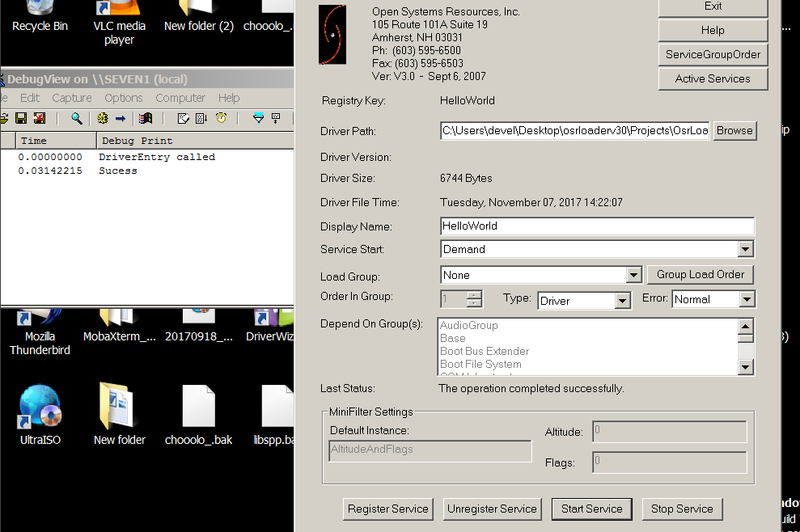

Я запускаю целевую систему и запускаю драйвер с помощью **OSRLOADER**, и оставляю его запущенным. Теперь я буду использовать скрипт **PYTHON**, чтобы узнать, работает ли он.

Мы видим, что после того, как нам напечатается дескриптор драйвера, нам покажутся опции для выбора.

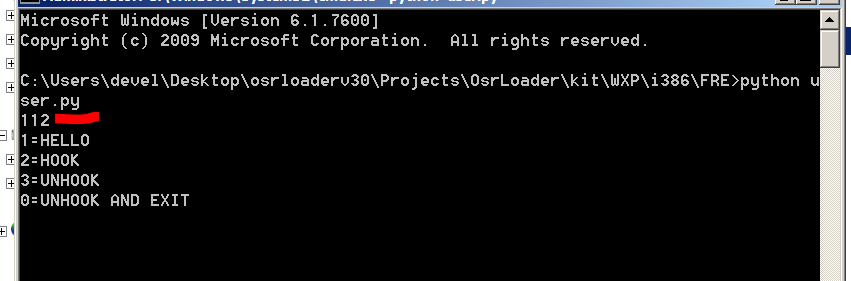

Если я нажму **1**, то ничего не происходит. Что же произошло?

```console
case=raw_input()
1
case
type(case)

Out[6]: str
```

Ааа. Результат **RAW\_INPUT** - это строка, и мы сравниваем ее с целым числом. Давайте изменим это.

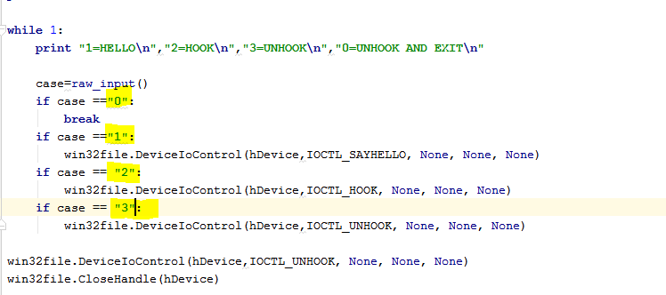

Посмотрим сейчас.

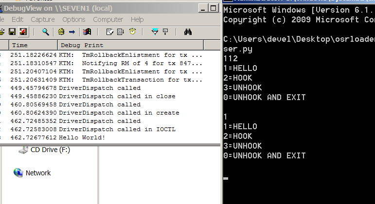

Теперь всё работает. Когда мы нажимаем **1**, нам показывается перехваченная фраза "**HELLO WORLD**". Сейчас я нажимаю **2**.

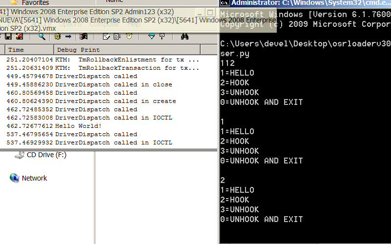

Теперь позапускаем некоторые программы в машине.

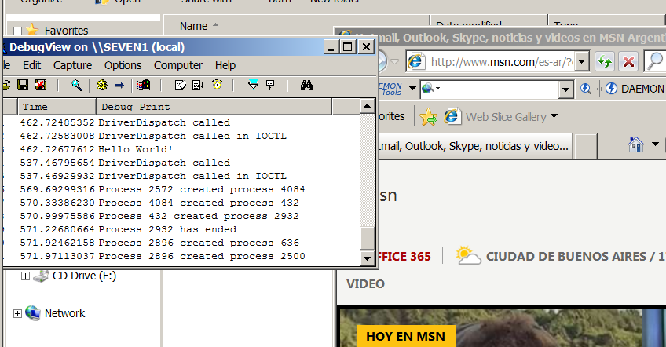

Мы видим, как драйвер логирует процессы, которые запускаются и закрываются. В моем случае, запускается **INTERNET EXPLORER**.

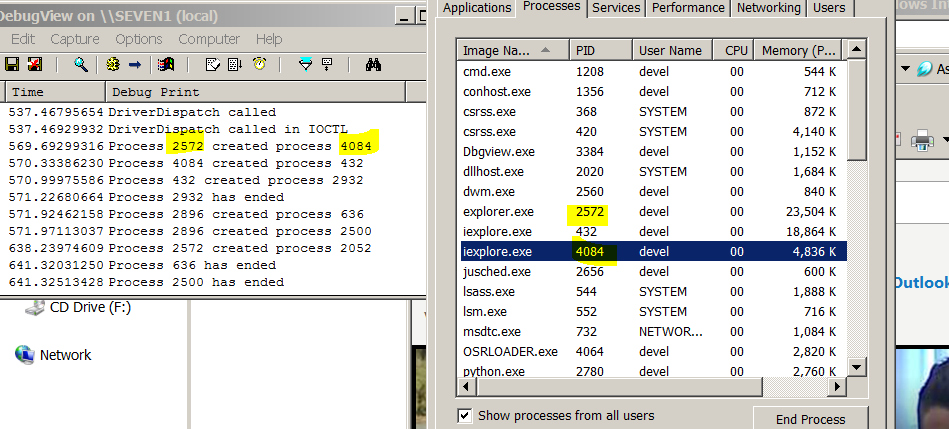

**PID IE** равен **4084**, а родителем является – **EXPLORER**. При запуске двойным щелчком, любой процесс, который запускается на машине или останавливается будет логироваться. Теперь я закрываю **IE**.

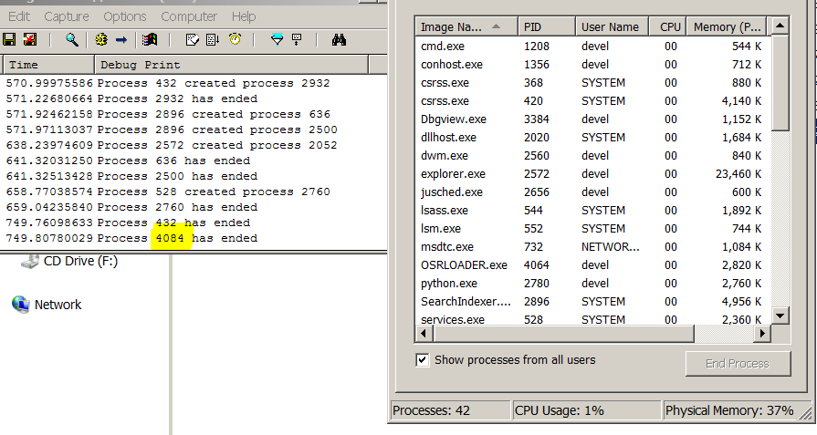

Хорошо. Всё работает. Теперь выключим перехват через пункт **3**. Мы видим, что процессы, которые мы открываем и закрываем, больше не регистрируются.

Что касается реверсинга, то это похоже на предыдущий случай.

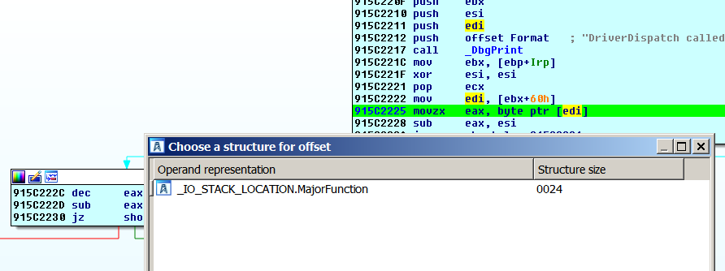

В обработчике мы видим, что в этом случае регистр **EDI**, равен **IRP** + **0x60**. Он будет иметь адрес структуры **\_IO\_STACK\_LOCATION**. Кроме того, поставим там **BP**. Как только мы синхронизируем необходимые структуры в **LOCAL TYPES**, нам покажут, что это поле **MAJORFUNCTION**.

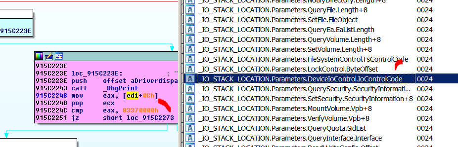

В случае, когда **MAJORFUNCTION** равно **0xE**, другими словами, когда мы используем **DEVICEIOCONTROL**. Мы нажимаем **T** и из всех опций, которые есть, мы выбираем, те для которых используется **DEVICEIOCONTROL**.

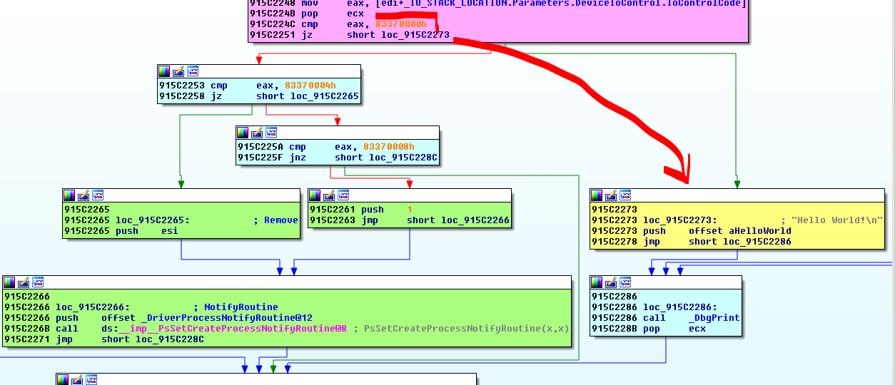

Мы видим, что когда код равен **IOCTL\_SAYHELLO**, драйвер переходит к желтому блоку, который напечатает **HELLO WORLD**. В двух других случаях он идёт в зеленые блоки. В случае **IOCTL\_HOOK** выполняется инструкция **PUSH ESI**, регистр которой равен нулю, чтобы передать аргумент **FALSE** в **API** [**PSSETCREATEPROCESSNOTIFYROUTINE@8**](mailto:PSSETCREATEPROCESSNOTIFYROUTINE@8), а в случае **IOCTL\_UNHOOK** исполняет инструкцию **PUSH 1**, что является **TRUE**.

Другим аргументом является смещение функции, в которую будет переходить драйвер.

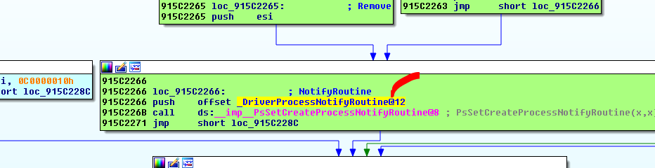

Если мы сделаем щелчок здесь, мы перейдём к этой функции.

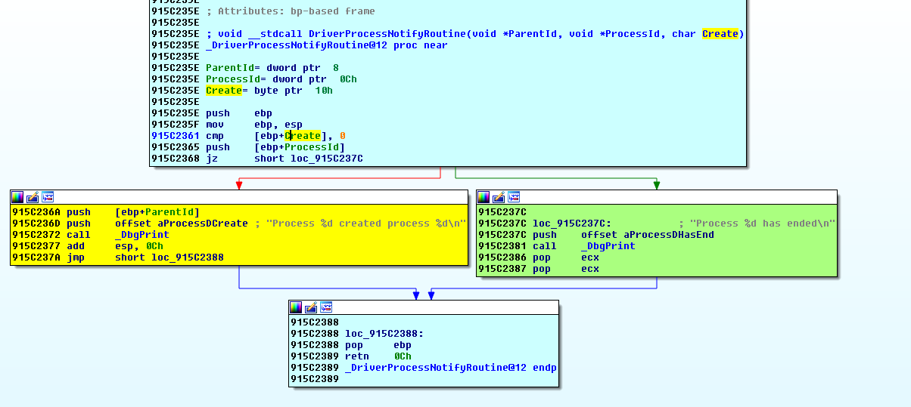

Здесь мы видим, если переменная **CREATE** ложная, т.е. равна нулю, драйвер переходит в **PROCESS \(PID\) HAS ENDED**, а если переменная истинна, то переходит в **ROCESS \(PID\) CREATED PROCESS\(PID\)**

Если мы поставим **BP** здесь, драйвер будет останавливаться каждый раз, когда мы запускам процесс, после того, как я нажму **2** в скрипте **PYTHON** для **ПЕРЕХВАТА**.

Я оставляю вам домашнюю работу поставить **BP** в этой функции, и в обработчике и трассировать код, чтобы проверить, то что мы увидели при реверсинге.

* * *

Автор оригинального текста — Рикардо Нарваха.

Перевод и адаптация на русский язык — Яша Яшечкин.

Перевод специально для форума системного и низкоуровневого программирования - WASM.IN

26.10.2018

Источник:

[**http://ricardonarvaja.info/WEB/INTRODUCCION%20AL%20REVERSING%20CON%20IDA%20PRO%20DESDE%20CERO/54-INTRODUCCION%20AL%20REVERSING%20CON%20IDA%20PRO%20DESDE%20CERO%20PARTE%2054.7z**](http://ricardonarvaja.info/WEB/INTRODUCCION%20AL%20REVERSING%20CON%20IDA%20PRO%20DESDE%20CERO/54-INTRODUCCION%20AL%20REVERSING%20CON%20IDA%20PRO%20DESDE%20CERO%20PARTE%2054.7z)
