# Часть 56

Давайте теперь рассмотрим драйвер, который запрограммирован с различными уязвимостями, чтобы понять, как их эксплуатировать. Как и всегда мы будем использовать **WINDOWS** **7** **SP1** без какого-либо патча безопасности. Мы знаем, что здесь всё будет работать. Затем мы увидим, какие изменения есть ниже и какие другие возможности существуют в новых системах. Но мы будем идти потихоньку и никуда не будем спешить.

У нас есть драйвер, скомпилированный с символами. У вас есть возможность эксплуатировать его практически всеми возможными способами. Он сделан специально для практики.

[https://github.com/hacksysteam/HackSysExtremeVulnerableDriver](https://github.com/hacksysteam/HackSysExtremeVulnerableDriver)

**Реализованные уязвимости**

* **Двойная выборка**
* **Переполнение пула**
* **Использование после освобождения**
* **Путаница в типах**
* **Переполнение стека**
* **Целочисленное переполнение**
* **Переполнение стека с флагом GS\(Buffer Security Check\)**
* **Перезапись арбитражного кода**
* **Разыменование нулевого указателя**
* **Неинициализированная переменная кучи**
* **Неинициализированная переменная стека**
* **Небезопасный доступ к ресурсам ядра**

Мы будем начинать потихоньку. Сначала сделаем анализ переполнения стека.

Конечно, Вам нужно скопировать драйвер на целевую машину и загрузить его с помощью **OSR** **DRIVER LOADER**.

Мы копируем его с его **IDB** в локальную папку и открываем его в **IDA** чтобы начать анализ.

Хорошо. Как мы уже знаем здесь, у нас есть символы, которые облегчают нам много вещи. Но первое, что мы должны найти и что почти всегда распознаётся с символами или без, это структура \_**DRIVER**\_**OBJECT**, которая передается как аргумент в функцию **DRIVERENTRY**.

В этом случае у нас не так много проблем.

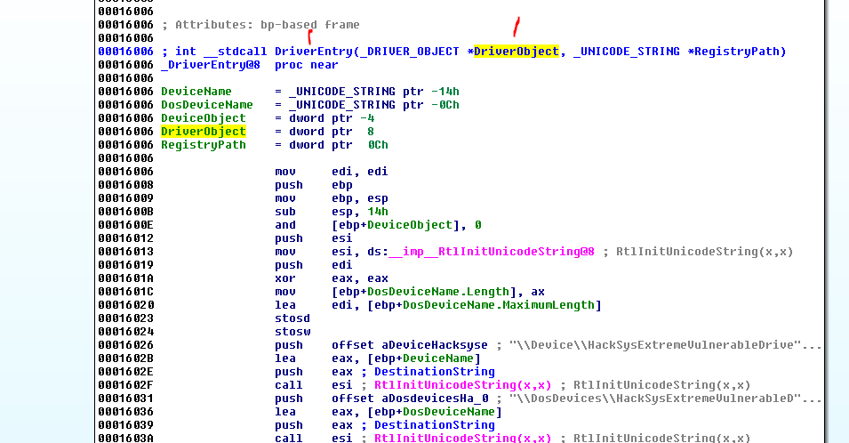

Здесь хорошо видна точка входа, и ее аргументы хорошо обнаружились.

Мы видим, что драйвер использует, как и в предыдущих примерах, **API** функцию **RTLINITUNICODESTRING** для инициализации структур.

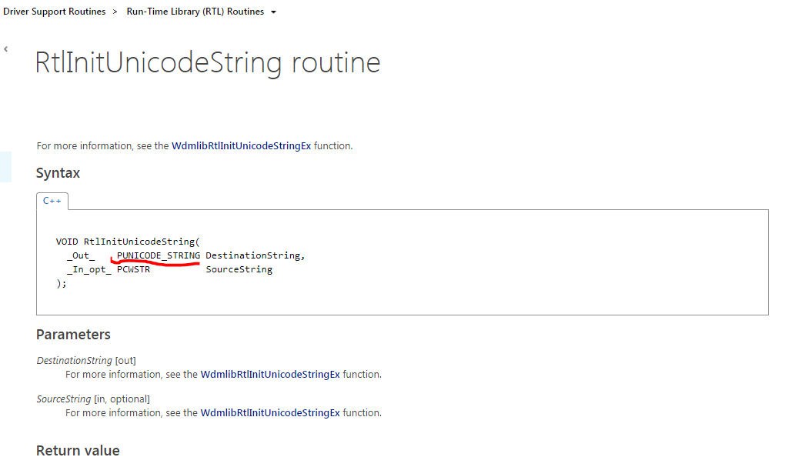

Напомним, что первым аргументом был указатель на структуру **UNICODE**\_**STRING**. Здесь мы видим **PUNICODE**\_**STRING,** т.е. указатель на структуру **UNICODE**\_**STRING**.

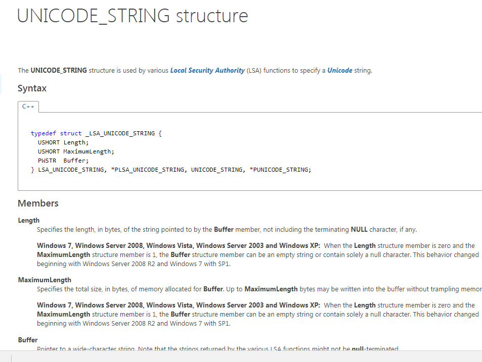

Т.е. это буфер, куда драйвер сохранит длину строки в переменную типа **WORD,** Максимальная длина в следующем поле также имеет тип **WORD**, а указатель будет скопирован в строку юникода, которую мы передали как источник в третьем поле.

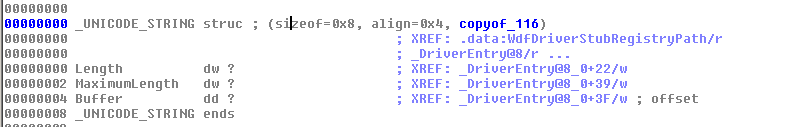

Сначала инициализируется в нуль структура **DOSDEVICENAME**, которая также имеет тип **UNICODE**\_**STRING**.

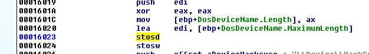

Драйвер помещает в поле **LENGTH** нуль, помещая в него значение регистра **AX**, которое равно здесь **0.** А затем идет инструкция **STOSD,** которая копирует значение из регистра **EAX**, т.е. помещает нуль в адрес, куда указывает регистр **EDI,** т.е. в поле **MAXIMUMLENGHT.** А затем следующая инструкция **STOSW** копирует из регистра **AX** значение**,** т.е. нуль в два следующих байтах, т.е. помещая нуль в **6** байтов, т. е. инициализирует два оставшихся поля структуры, которые занимают **6** байтов \(**1** **WORD** и **DWORD**\).

Компилятор только инициализирует структуру **DOSDEVICENAME.** Другая переменная, которая называется **DEVICENAME**, не равна нулю. Драйвер использует ее напрямую.

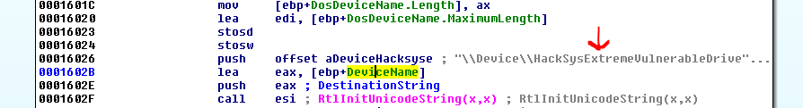

Другими словами, **DEVICENAME** - это строка, которая преобразуется в тип структуры **UNICODE**\_**STRING.** Другими словами, в её трех полях будет длина, максимальная длина и указатель, который мы передаем в строку источник. Он будет скопирован в третье поле.

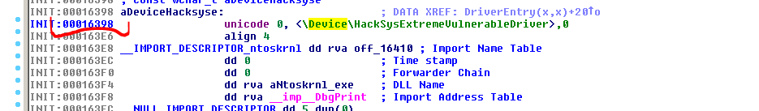

В моей машине указатель находится по адресу **0x00016938**. Это смещение скопирует его в третье поле структуры.

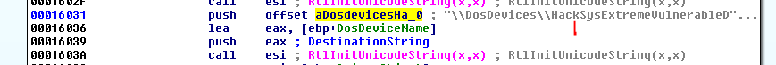

В **DOSDEVICENAME** вы будете создавать другой указатель **UNICODE**\_**STRING**. Я использую как источник эту другую строку.

Затем идёт вызов функции **IOCREATEDEVICE.** Мы помним, что вам нужно было создать **DEVICE** **OBJECT**, чтобы иметь возможность общаться с программами из пользовательского режима.

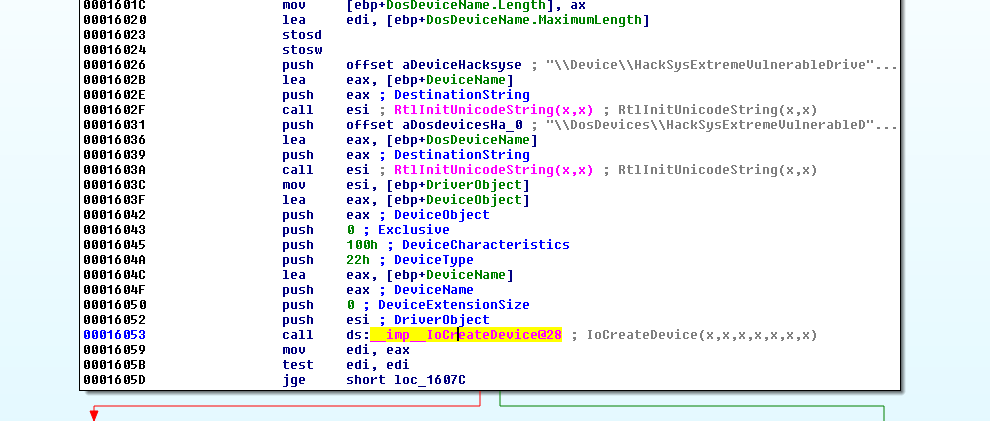

Это будет почти всегда около точки входа в большинстве драйверов, которые взаимодействуют с программами в пользовательском режиме.

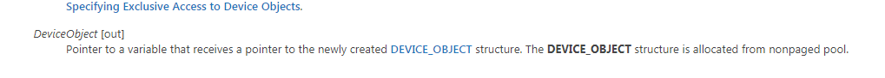

Последний аргумент, это указатель на вновь созданную структуру **DEVICE**\_**OBJECT**.

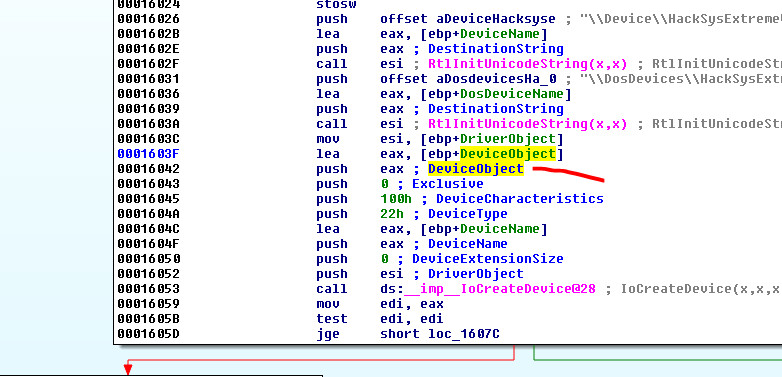

Мы видим, что если результат создания устройства отрицательный, который проверяется в этом условном знаковом переходе, драйвер переходит к оранжевым блокам ошибок, а объект устройства удаляется с помощью функции **IODELETEDEVICE**.

Затем структура **DRIVEROBJECT** будет инициализироваться из регистра **ESI** + **38.** Поскольку **ESI** указывает на **DRIVEROBJECT**, я нажимаю **T.** Я могу посмотреть, какое это поле \(но это **DRIVER**\_**OBJECT** идём в **LOCAL** **TYPES** и синхронизируем типы\)

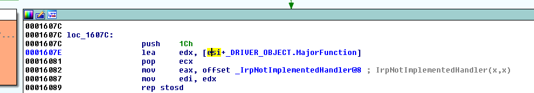

Т.е. это указатель на структуру **MAJORFUNCTION**, про которую мы помним, что он представляет собой таблицу указателей, которая, согласно позиции, приведет меня к разным функциям в зависимости от случая. Вспомните это, например.

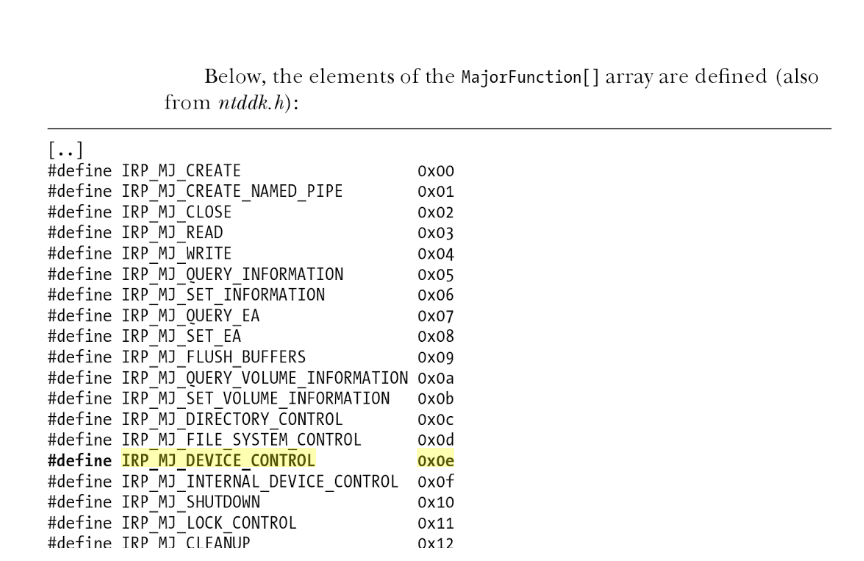

Первый указатель, т.е. тот, который находится в позиции **0**, является **IRP\_MJ\_CREATE** и драйвер будет переходить на него, когда вы вызываете функцию **CREATEFILE**, чтобы открыть дескриптор устройства. Второй указатель, т.е. со значением **0x1** находится в положении 4**,** так как он являются **DWORD** и т.д. Это означает, что обратно пропорционально, если у меня есть поле этой структуры по её смещению, чтобы знать, какой указатель нам нужен надо делить его на четыре. Из примера, который мы использовали в предыдущих драйверах давайте вспомним.

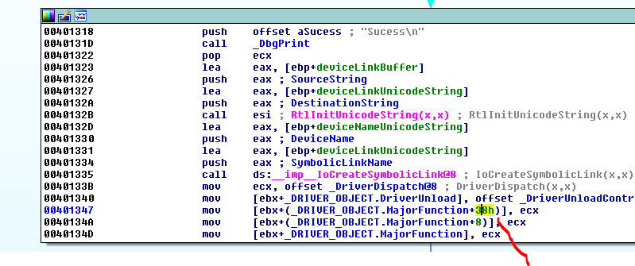

Это соответствует значению **0x38/4**, т.е.

Python&gt;hex\(0x38/4\)
0xE

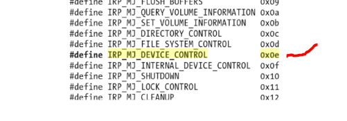

Т.е. **0xE** соответствует **IRP\_MJ\_DEVICE\_CONTROL**, когда мы передали код **IOCTL** из режима пользователя. Этот указатель мы перезаписали с помощью обработчика, так что в соответствии с тем, какой код **IOCTL**, различные действия будут выполняться с помощью конструкции **SWITCH**. Например так.

В текущем случае, мы видим, что драйвер инициализирует значения начиная с указателя на начало таблицы **MAJORFUNCTION**. Он копирует значение регистра **EAX**, в которое помещается смещение функции, которая называется **\_IRP\_NOTIMPLEMENTEDHANDLERS.** Копирование происходит **0x1C** раз. Это значение передаётся в регистре **ECX.** Оно равно количеству указателей, которые нужно инициализировать.

Другими словами, в начале вся таблица инициализирует этим указателем, который, по-видимому, не будет делать ничего. Это похоже на случай по умолчанию.

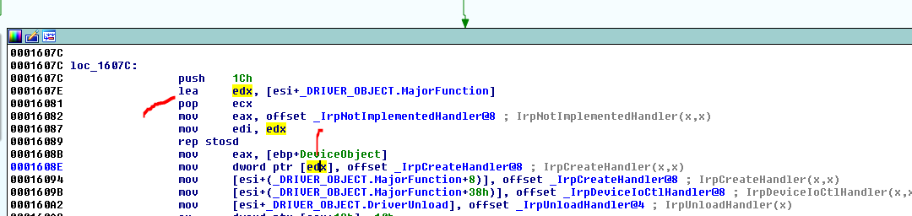

Поскольку регистр **EDX** хранит указатель на начало таблицы **MAJORFUNCTION**, его содержимым является позиция **0**, т.е.

+\#define IRP\_MJ\_CREATE 0x00
+\#define IRP\_MJ\_CREATE\_NAMED\_PIPE 0x01
+\#define IRP\_MJ\_CLOSE 0x02
+\#define IRP\_MJ\_READ 0x03
+\#define IRP\_MJ\_WRITE 0x04
+\#define IRP\_MJ\_QUERY\_INFORMATION 0x05
+\#define IRP\_MJ\_SET\_INFORMATION 0x06
+\#define IRP\_MJ\_QUERY\_EA 0x07
+\#define IRP\_MJ\_SET\_EA 0x08
+\#define IRP\_MJ\_FLUSH\_BUFFERS 0x09
+\#define IRP\_MJ\_QUERY\_VOLUME\_INFORMATION 0x0a
+\#define IRP\_MJ\_SET\_VOLUME\_INFORMATION 0x0b
+\#define IRP\_MJ\_DIRECTORY\_CONTROL 0x0c
+\#define IRP\_MJ\_FILE\_SYSTEM\_CONTROL 0x0d
+\#define IRP\_MJ\_DEVICE\_CONTROL 0x0e
+\#define IRP\_MJ\_INTERNAL\_DEVICE\_CONTROL 0x0f
+\#define IRP\_MJ\_SCSI 0x0f
+\#define IRP\_MJ\_SHUTDOWN 0x10
+\#define IRP\_MJ\_LOCK\_CONTROL 0x11
+\#define IRP\_MJ\_CLEANUP 0x12
+\#define IRP\_MJ\_CREATE\_MAILSLOT 0x13
+\#define IRP\_MJ\_QUERY\_SECURITY 0x14
+\#define IRP\_MJ\_SET\_SECURITY 0x15
+\#define IRP\_MJ\_POWER 0x16
+\#define IRP\_MJ\_SYSTEM\_CONTROL 0x17
+\#define IRP\_MJ\_DEVICE\_CHANGE 0x18
+\#define IRP\_MJ\_QUERY\_QUOTA 0x19
+\#define IRP\_MJ\_SET\_QUOTA 0x1a
+\#define IRP\_MJ\_PNP 0x1b
+\#define IRP\_MJ\_PNP\_POWER 0x1b
+\#define IRP\_MJ\_MAXIMUM\_FUNCTION 0x1b

Мы будем создавать структуру **MAJORFUNCTION.**

struct \_\_MajorFunction{
unsigned int \_MJ\_CREATE;
unsigned int \_MJ\_CREATE\_NAMED\_PIPE;
unsigned int \_MJ\_CLOSE;
unsigned int \_MJ\_READ;
unsigned int \_MJ\_WRITE;
unsigned int \_MJ\_QUERY\_INFORMATION;
unsigned int \_MJ\_SET\_INFORMATION;
unsigned int \_MJ\_QUERY\_EA;
unsigned int \_MJ\_SET\_EA;
unsigned int \_MJ\_FLUSH\_BUFFERS;
unsigned int \_MJ\_QUERY\_VOLUME\_INFORMATION;
unsigned int \_MJ\_SET\_VOLUME\_INFORMATION;
unsigned int \_MJ\_DIRECTORY\_CONTROL;
unsigned int \_MJ\_FILE\_SYSTEM\_CONTROL;
unsigned int \_MJ\_DEVICE\_CONTROL;
unsigned int \_MJ\_INTERNAL\_DEVICE\_CONTROL;
unsigned int \_MJ\_SCSI;
unsigned int \_MJ\_SHUTDOWN;
unsigned int \_MJ\_LOCK\_CONTROL;
unsigned int \_MJ\_CLEANUP;
unsigned int \_MJ\_CREATE\_MAILSLOT;
unsigned int \_MJ\_QUERY\_SECURITY;
unsigned int \_MJ\_SET\_SECURITY;
unsigned int \_MJ\_POWER;
unsigned int \_MJ\_SYSTEM\_CONTROL;
unsigned int \_MJ\_DEVICE\_CHANGE;
unsigned int \_MJ\_QUERY\_QUOTA;
unsigned int \_MJ\_SET\_QUOTA;
unsigned int \_MJ\_PNP;
unsigned int \_MJ\_PNP\_POWER;
unsigned int \_MJ\_MAXIMUM\_FUNCTION;
};

Я знаю, что это указатели, но для нашего случая я буду использовать тип **UNSIGNED** **INT** и это будет работать. Проблема состоит в том, что это локальные типы. При использовании операции **INSERT**, **IDA** не принимают структуру. Поэтому я буду экспортировать её. Я добавляю структуру и перезагружаю ее с помощью **FILE→** **LOAD FILE→** **PARSE C HEADER FILE**

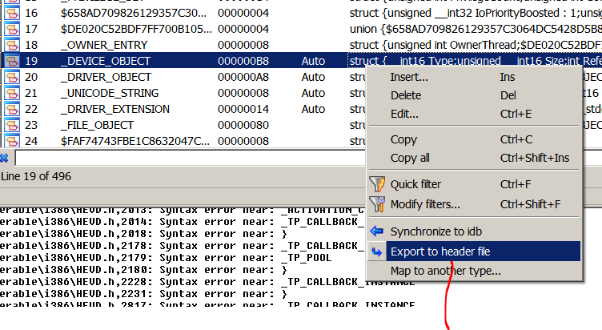

Я добавил структуру в **ЗАГОЛОВОЧНЫЙ ФАЙЛ.**

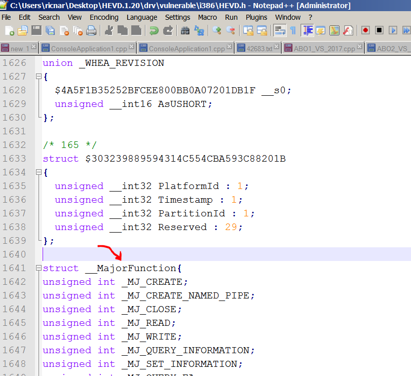

Теперь возникает вопрос

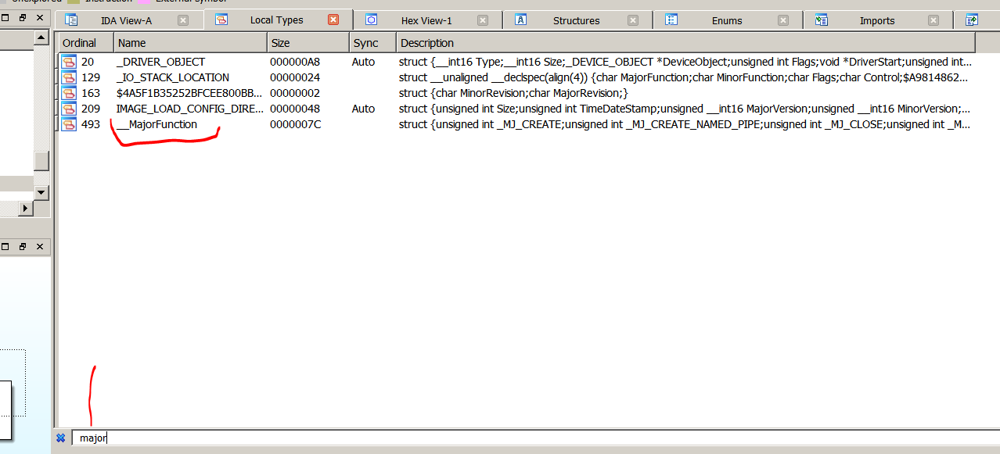

Я позволял себе редактировать внутри структуры **DRIVER**\_**OBJECT**, тип **MAJORFUNCTION** в **LOCAL TIPES** ?

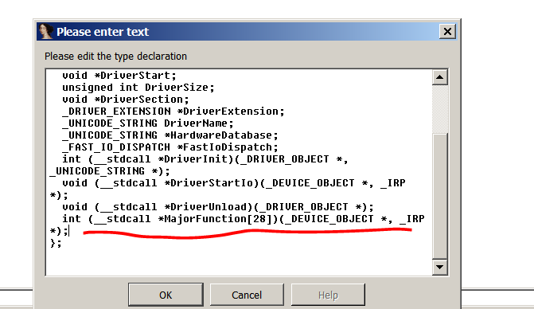

Мы видим, что я изменил структуре определение поля **MAJORFUNCTION.** Внутри структуры **DRIVER**\_**OBJECT** для того, чтобы она была типа \_\_**MAJORFUNCTION**, который я определил.

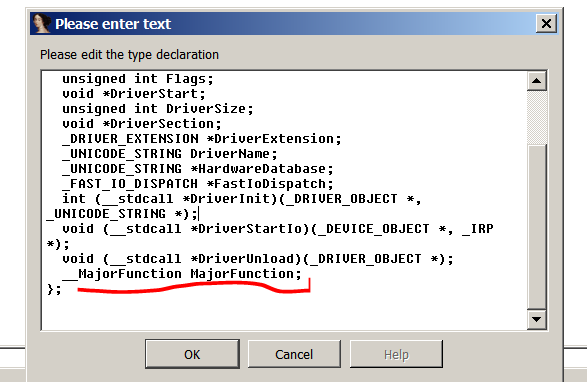

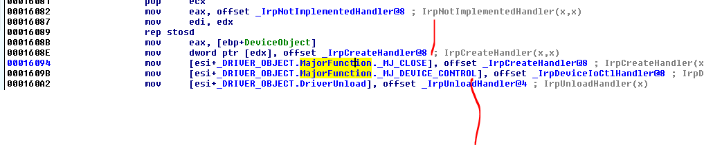

Мы видим, что сейчас, если поля определены с их именами каждого указателя.

Когда мы нажимаем **T**, мы не можем выбрать структуру **DRIVER\_OBJECT**, потому что регистр **EDX** указывает на таблицу **MAJORFUNCTION**, поэтому я выбираю последнюю.

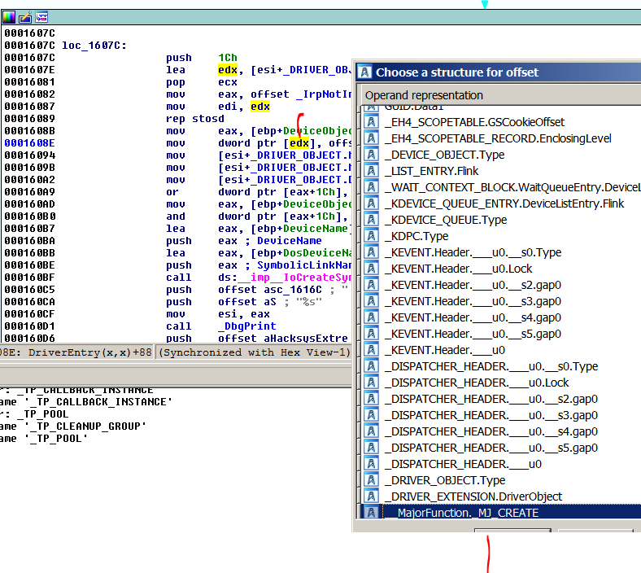

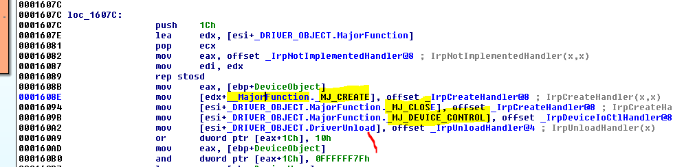

Сейчас стало намного лучше. Все в порядке. Я определил функции, которые будут использоваться, т. е. **\_MJ\_CREATE**, \_**MJ**\_**CLOSE**, **\_MJ\_DEVICE**\_**CONTROL** и те, которые будет вызываться, когда драйвер останавливается через функцию **DRIVERUNLOAD**.

Очевидно, когда из режима пользователя мы вызвали функцию **CREATEFILE**, вызывается функция, которая перезаписывает поле **\_MJ\_CREATE.** Когда мы передаем **IOCTL** код в функцию **DEVICEIOCONTROL**, вызывается **\_MJ\_DEVICE\_CONTROL.** Когда вызывается функция **CLOSEHANDLE**, драйвер вызывает ту, которая перезаписывает поле **\_MJ\_CLOSE.** И когда драйвер останавливается, вызывается та, которая перезаписывает функцию **DRIVERUNLOAD**.

Мы будем смотреть на функцию, которая будет вызываться при передаче **IOCTL**.

Мы синхронизируем структуру **IRP** из вкладки **LOCAL** **TYPES.**

Как мы видели в части **53**, поле **60** из **IRP** указывает на структуру \_**IO**\_**STACK**\_**LOCATION.**

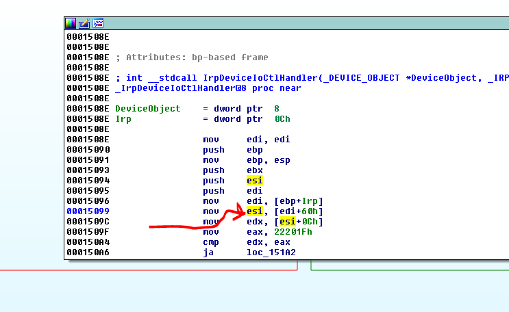

Регистр **ESI** указывает на **\_IO\_STACK\_LOCATION**, поэтому все, что равно **ESI** + **XXX**, будет полем вышеупомянутой структуры. После синхронизации из вкладки **LOCAL** **TYPES**.

Напомним, что у структуры **\_IO\_STACK\_LOCATION** есть несколько опций. Я выберу ту, которая соответствует **IOCONTROLCODE**.

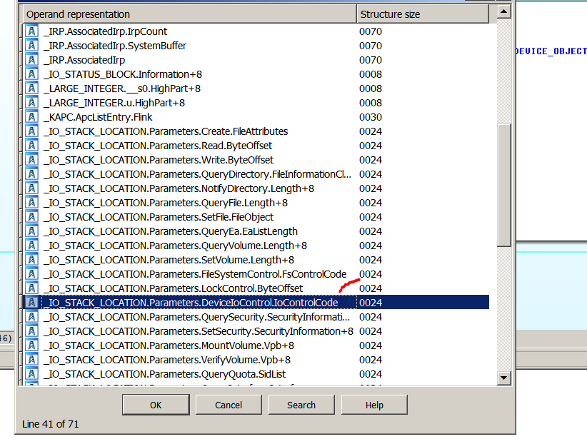

Мы видим, что в соответствии с кодом **IOCTL,** **SWITCH** отправляет нас в разные блоки и что они помечены типом уязвимости, который имеет каждый путь.

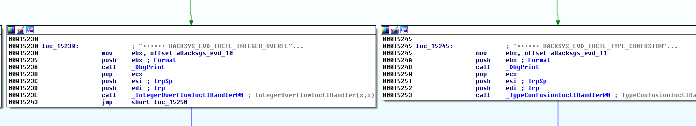

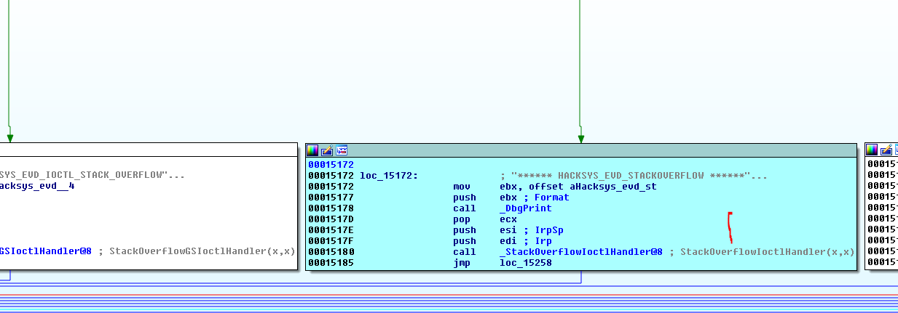

Здесь есть один блок, который говорит нам, что он имеет **STACKOVERFLOW**. Поэтому вам не нужно слишком сильно себя утруждать и искать переполнение.

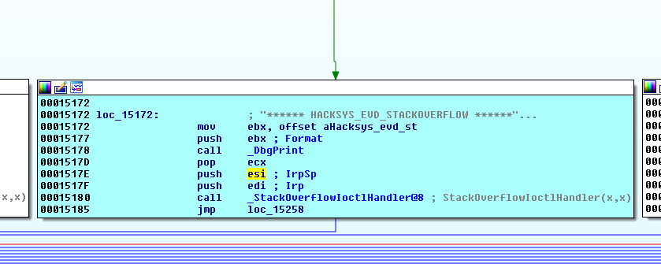

Мы видим, что есть два аргумента, которые передают в регистре **EDI** структуру **IRP** а в регистре **ESI IRPSP** - это имя переменной типа \_**IO**\_**STACK**\_**LOCATION**, которая была в регистре **ESI**.

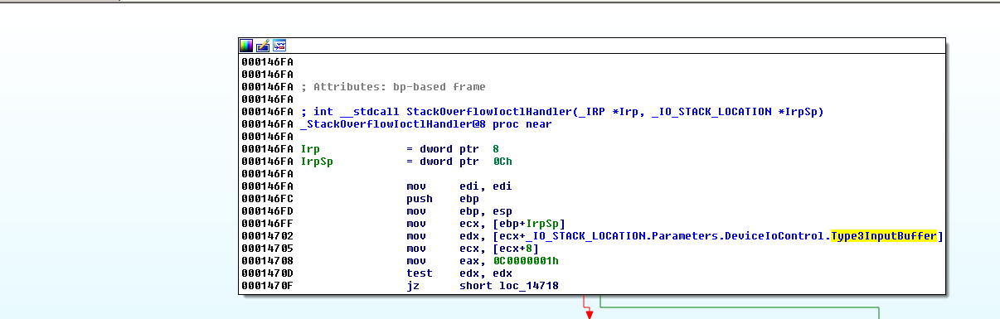

Это указатель на входной буфер. Также в этой же субструктуре находится **IOCONTROLCODE** и длина входного и выходного буфера. Предположительно эти значения передаются то же. Давайте посмотрим, что с ними делать.

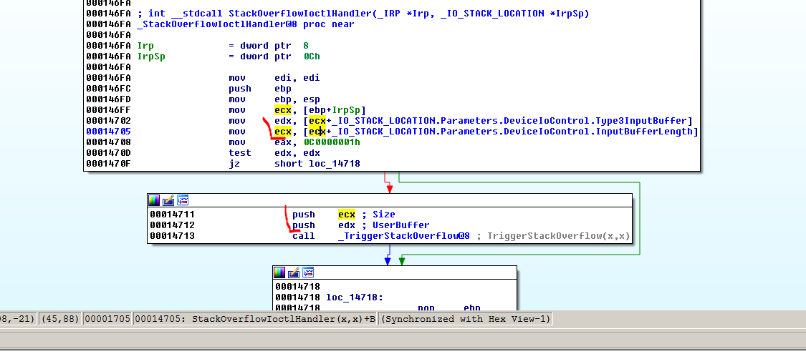

Мы видим, что этот **SIZE** и этот буфер передаются в функцию \_**TRIGGERSTACKOVERFLOW**.

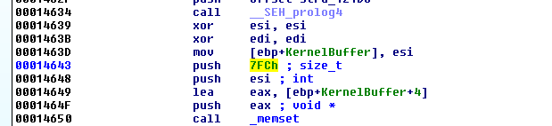

Мы видим, что драйвер помещает нуль с помощью регистра **ESI** в первый **DWORD** буфера **KERNELBUFFER** и затем с помощью функции **MEMSET** помещает нуль в следующий **DWORD**, так как происходит сложение **KERNELBUFFER + 4**, и получается размер **0x7FC**.

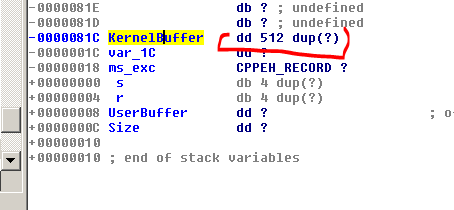

Вышеупомянутый буфер имеет длину **512** \* **4**, так как это массив **DWORD** \(**DD**\), поэтому общая длина в десятичной системе равна:

**512 \* 4
Out\[64\]: 2048**

В **HEX** это

**hex\(2048\)
Out\[65\]: '0x800'**

Поэтому, поместив в первый **DWORD** нуль, а затем в оставшиеся **0x7FC байт.** Действительно, драйвер заполнит весь буфер размером **0x800** нулями. \(**0x7FC** + **4** = **0x800\)**

Затем драйвер вызовет функцию **PROBEFORREAD**, которая проверит, выровнен ли входной буфер в пользовательском режиме и находится ли он в пользовательском пространстве.

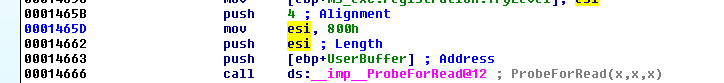

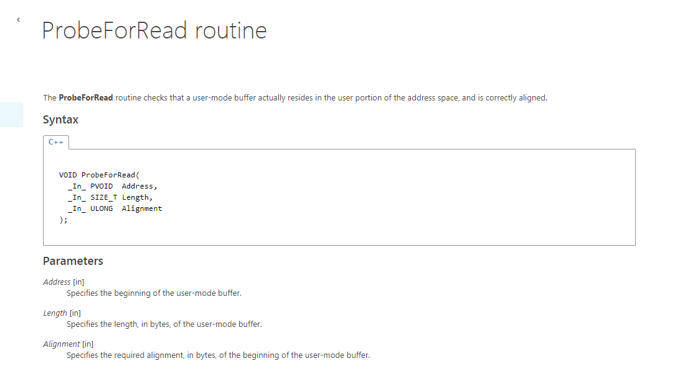

Затем драйвер печатает указатели буферов и их размеры.

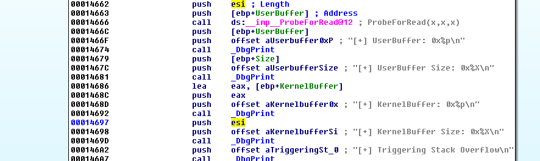

Здесь мы ясно видим переполнение стека, поскольку драйвер использует размер, который я передаю ему как данные для копирования из входного буфера в пользовательский, в буфер в ядре, который является назначением.

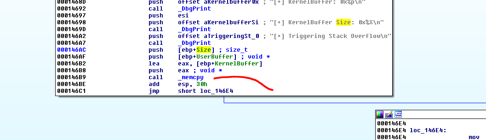

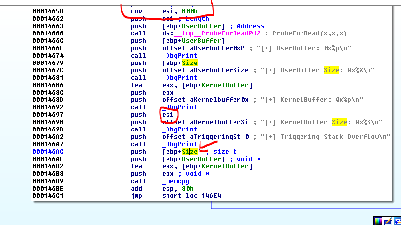

Здесь мы видим, что при печати размера буфера ядра, драйвер используйте тот, который находится в регистре **ESI**, который является константой **0x800**, но при выполнении функции **MEMCPY** он используйте аргумент **SIZE**, который я передал ему, без каких-либо проверок, которые будут приводить к переполнению стека и поскольку здесь нет **COOKIE**, он будет легко переполняться.

В следующей части мы будем делать скрипт с эксплуатацией. На этом здесь, мы закончим анализ.

**=======================================================
Автор текста: Рикардо Нарваха** - **Ricardo** **Narvaja** \(**@ricnar456**\)
Перевод на русский с испанского: **Яша\_Добрый\_Хакер\(Ростовский фанат Нарвахи\).**
Перевод специально для форума системного и низкоуровневого программирования — **WASM.IN
06.11.2018
Версия 1.0**
