# Часть 57

[\[Используемые материалы\]](.gitbook/assets/files/57.zip)

Хорошо. Мы будем пытаться эксплуатировать переполнение стека из скрипта **PYTHON**. Обычно эксплуатация ядра происходит локально. Другими словами, скрипт уже эксплуатирует некоторую программу, которая не имеет привилегий системы и хочет повысить привилегии и быть с правами **SYSTEM**, что устраняет ограничения, которые имеет эксплуатируемый процесс, который имеет только ограниченные привилегии обычного пользователя на машине.

Поэтому, за исключением очень редких исключений, эксплойты ядра - это эксплоиты для повышения привилегий или **PRIVILEDGE ESCALATION**.

Поэтому, много раз мы будм видеть их код в скомпилированном исполняемом файле или их исходный код, потому что предполагается, что мы должны загрузить файл и запустить его с правами обычного пользователя. Этот исполняемый файл будет атаковать в этом случае наш драйвер и проэксплуатириует его достигнув эскалации.

В любом случае, как код в **C**, так и код на **PYTHON** основаны на вызовах одних и тех же **WINDOWS API**, таких, как **CREATEFILE**, **DEVICEIOCONTROL** и т.д. Поэтому, то, что делается на одном языке, легко переносится на другой.

Давайте напомним нашу модель **PYTHON** предыдущего примера.

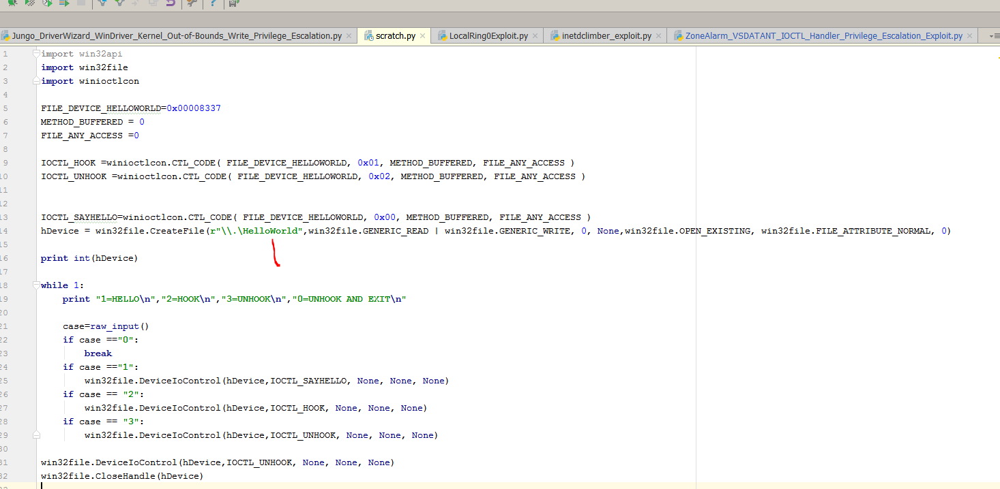

Первым шагом будет изменение имени для драйвера поэтому, когда вы делаете **CREATEFILE**, нам возвратится его правильный дескриптор.

Напомним, что имя генерируется здесь

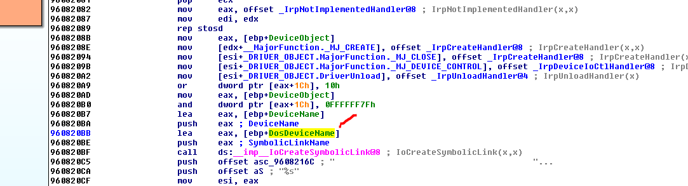

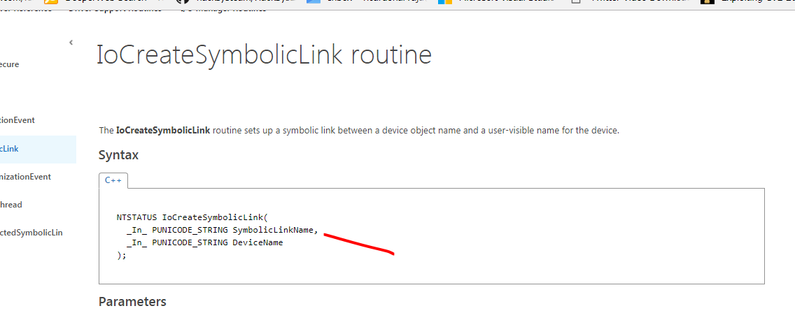

Здесь драйвер возвращает **SYMBOLICNAME**, который приходит из строки, которая находится в **DEVICENAME**.

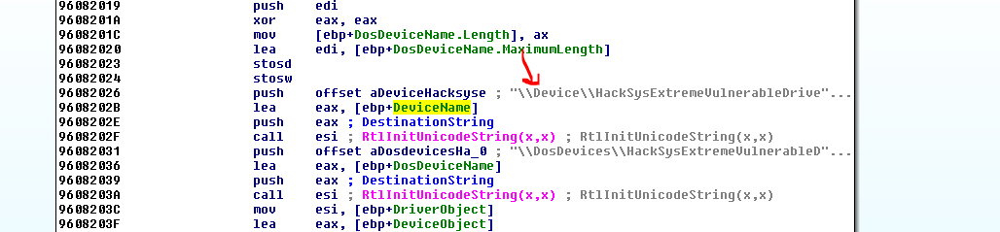

Без особых проблем, конечно, если я заменяю имя старого драйвера драйвером новым.

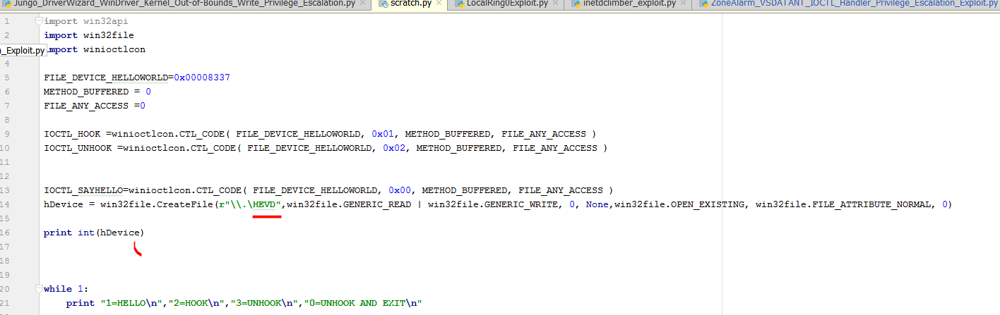

Мы можем скопировать его на целевую машину и посмотреть, не даст ли он мне ошибку или даст действительный дескриптор, но я буду продолжать смотреть.

Этот драйвер запущен, и я запускаю скрипт.

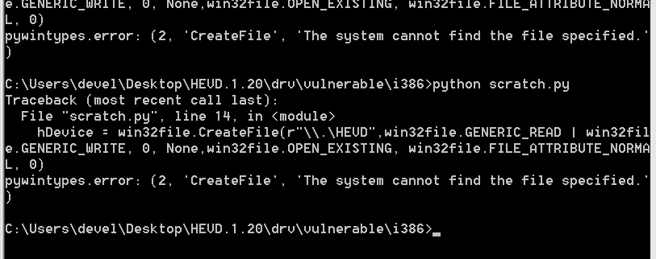

Поскольку **SYMBOLICLINK** идет отсюда, имеет смысл использовать это имя.

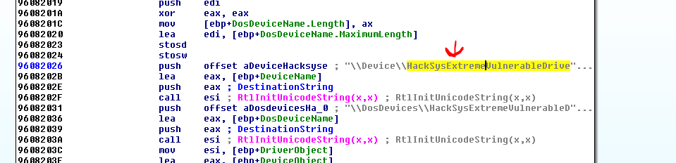

Давайте попробуем так.

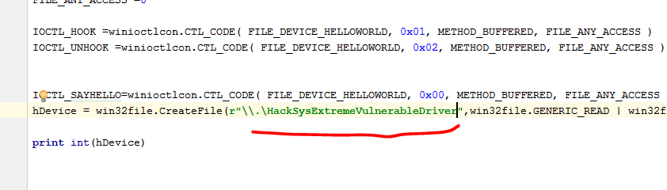

Мы видим, что всё работает.

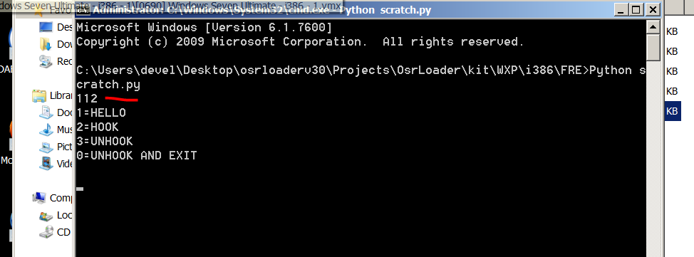

Мне вернулось положительное значение, которое является дескриптором драйвера. Остальное меня не интересует, поэтому я закрываю его.

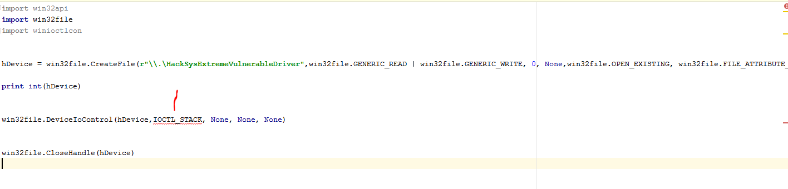

На данный момент, мы удаляем **WHILE** и все остальное, что нас не интересует. Следующая вещь заключается в том, чтобы увидеть, какой именно **IOCTL** переносит нас в блок переполнение стека, чтобы отправить его.

Вопрос состоит в том, как добраться туда.

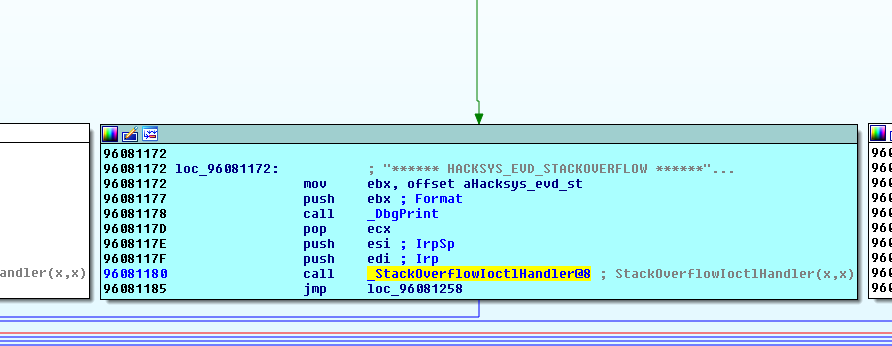

Мы видим, что драйвер идёт отсюда.

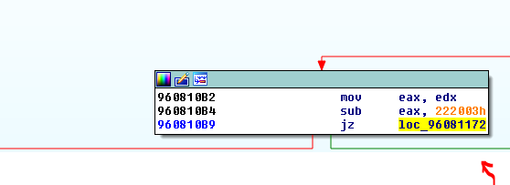

Регистр **EDX** имеет код **IOCTL**, который получается отсюда.

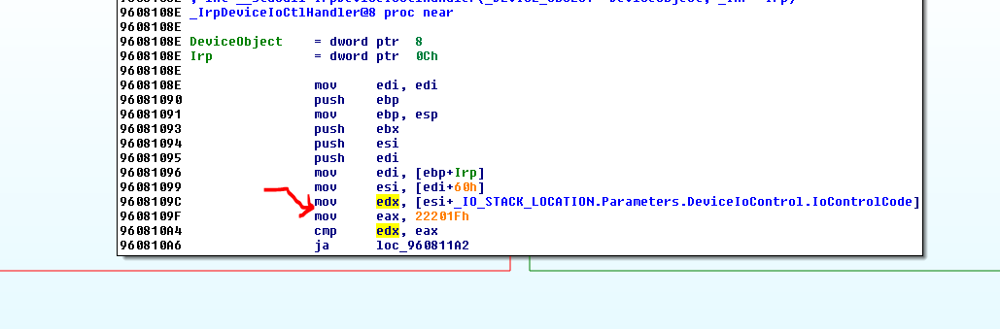

Программа сделает вычитание из регистра значения **0x222003**, и если результатом будет нуль, мы перейдем к той части, которая нам нужна.

Давайте посмотрим, достигнет ли программа блока, где мы хотим присоединить **IDA** и устанавливаем **BP**.

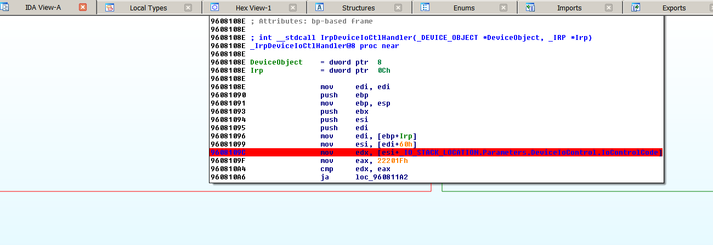

Я запускаю драйвер на целевой машине и попадаю в **BP**.

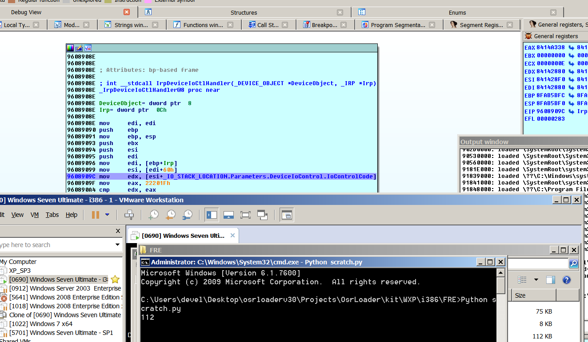

Мы видим, что в регистр **EDX** драйвер считывает **IOCTL** код, который он передает.

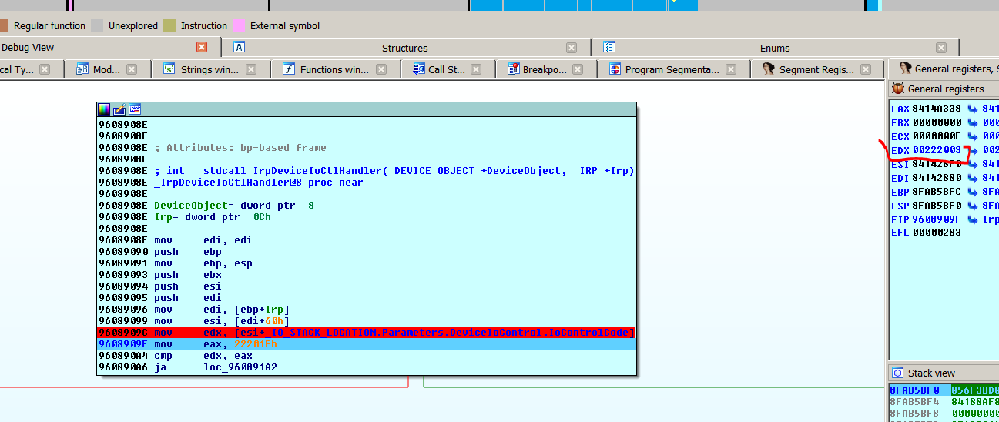

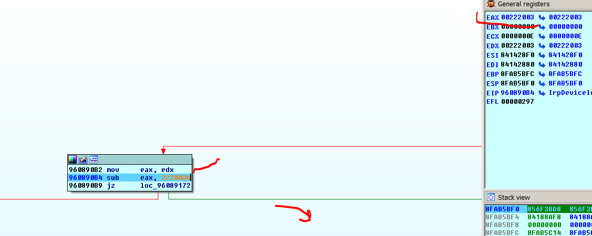

Программа помещает результат в регистр **EAX**, вычитает из него значение **0x222003** и поскольку результатом будет нуль, драйвер переходит в уязвимый блок.

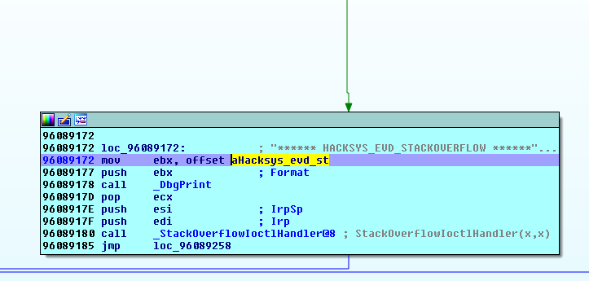

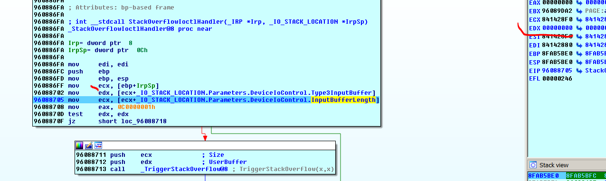

Программа читает длину, которая является нулем, так как я не передал ей аргументы за исключением **IOCTL**.

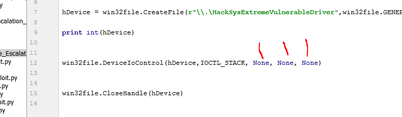

Поскольку аргумент равен нулю, программа пропускает функцию, в которой происходит переполнение стека.


Поскольку **API** функция, вызывается из **WIN32FILE** в **PYTHON**, она имеет меньше аргументов, чем исходная функция, которая имеет больше.

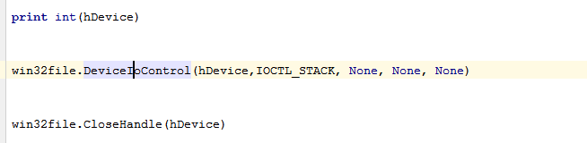

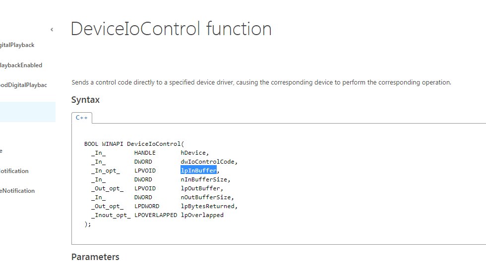

Здесь находится определение **WIN32FILE PYTHON**.


Мы увидим, что если мы достигли этого места, нам нужно сделать буфер, чтобы передать его на вход, так как поскольку нам нужен указатель на него, мы можем сделать это с помощью функции **ALLOCATEREADBUFFER**, которая выделяет нам в куче количество памяти, которое нам нужно передать входному буферу. \(Другая опция **WIN32FILE** не дает нам\).

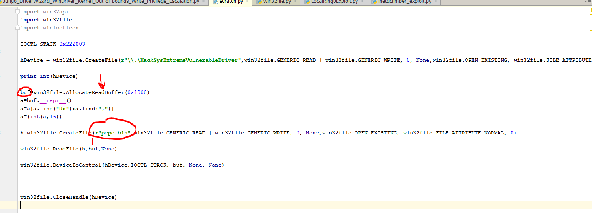

Поскольку библиотека **WIN32FILE** не имеет доступа ко всем **API**, она не позволяет копировать непосредственно в буфер как функция **MEMCPY** или что-то вроде этого, поэтому мы можем копировать его только с помощью функции **READFILE**, поэтому мы делаем файл **PEPE.BIN**, заполняя его **0x1000** буквами **A**. Мы передаем файл в функцию **CREATEFILE**, чтобы она открывала его и вернула нам дескриптор, и мы передали его в функцию **READFILE** с аргументом **BUF** буфера, который мы выделяем и копировать содержимое файла туда.

Очевидно, что если мы сделаем это на **C, C++** или языке, в котором мы можем использовать функцию **VIRTUALALLOC** и легко копировать с помощью функции **MEMCPY** или той которую мы хотим. Но здесь у нас есть определенные ограничения, и мы должны приспосабливаться к этому.

Нам нужно дополнительно знать, какую длину мы должны отправить. Давайте посмотрим на буфер назначения в **IDA**.

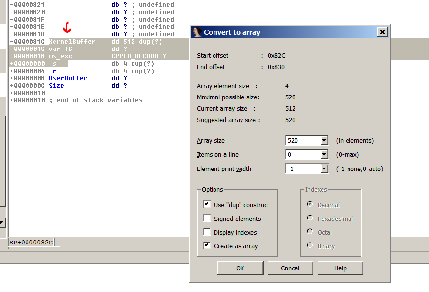

Мы замечаем, что с начала буфера до адреса возврата получается **520** десятичных байт \* **4** размер элемента.

Поэтому

```python
hex(520*4) = '0x820'
```

Поэтому мы должны отправить **0x820** + **RET**.

Сейчас, поскольку мы знаем в **PYTHON** адрес буфера, который мы создаем, чтобы передавать его, мы будем использовать грязный трюк - **REPR**.

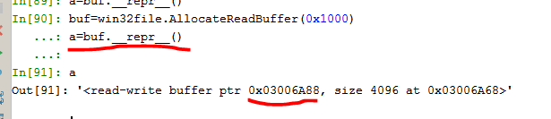

Мы видим, что функция возвращает адрес, в который я могу писать. В одной строке. Поэтому я ищу сначала **0x**, затем ищу запятую в этой строке, и я могу разбить адрес.

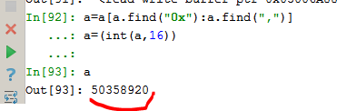

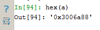

Здесь cуществует адрес, который мы можем передать с помощью **STRUCT.PACK** после **0x820 A**. Досадно, что мы должны записать их в файл, который читается.

Следовательно, как только у меня есть адрес буфер.

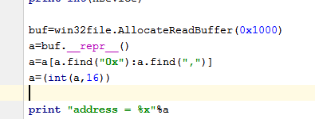

Я пишу в файл **ФРУКТЫ**, которые хочу отправить.

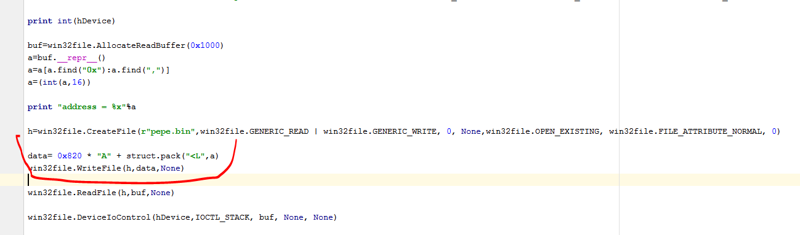

Перед функцией **READFILE** скопируем их в буфер.

Давайте посмотрим, заработает ли это. В этом случае нет необходимости иметь файл, потому что он будет создан и заполнен, поэтому мы удалили предыдущий.


Для этого мы изменили аргумент на **CREATE ALWAYS**.

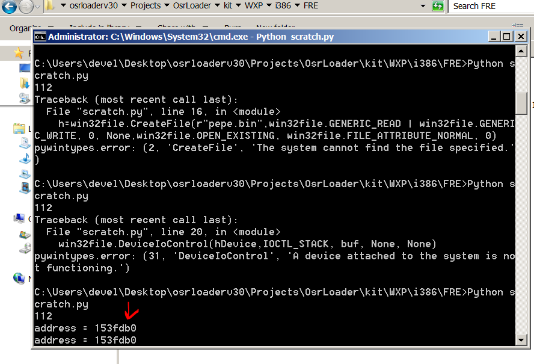

Хорошо. Предположительно здесь - наш буфер с буквами **A**. **IDA** остановлена. Давайте посмотрим, что я передаю.

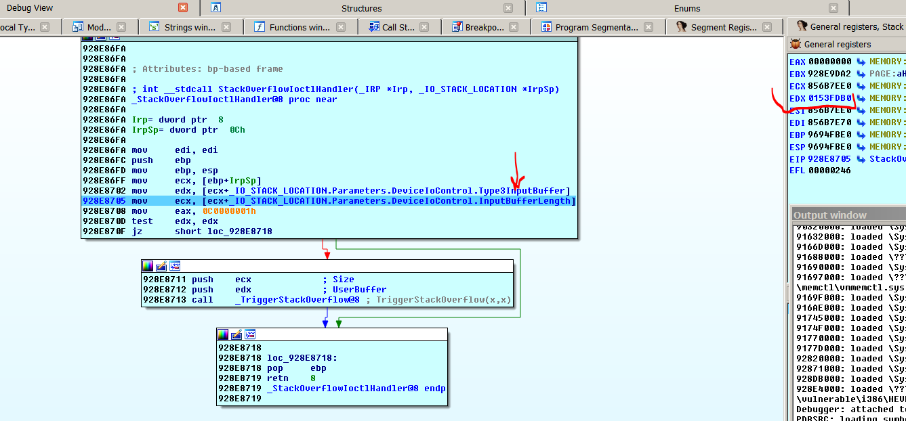

Мы видим, что входной буфер, который передается в регистр **EDX**, показывает нам то же самое значение. Давайте посмотрим, есть ли там **A**.

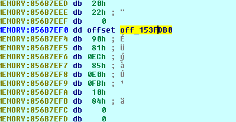

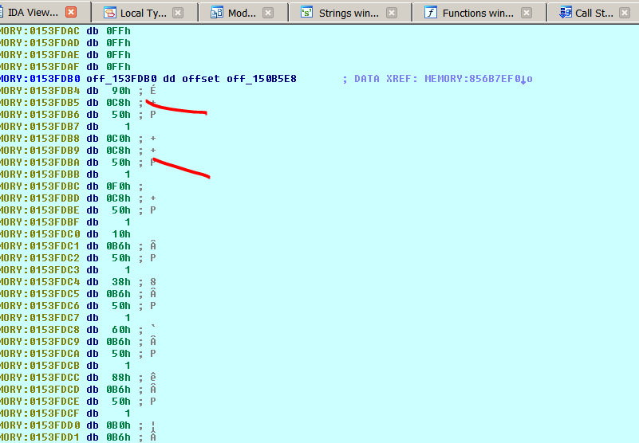

Он не заполнился буквами A. Давайте пропустим эксплуатацию и давайте исправим скрипт.

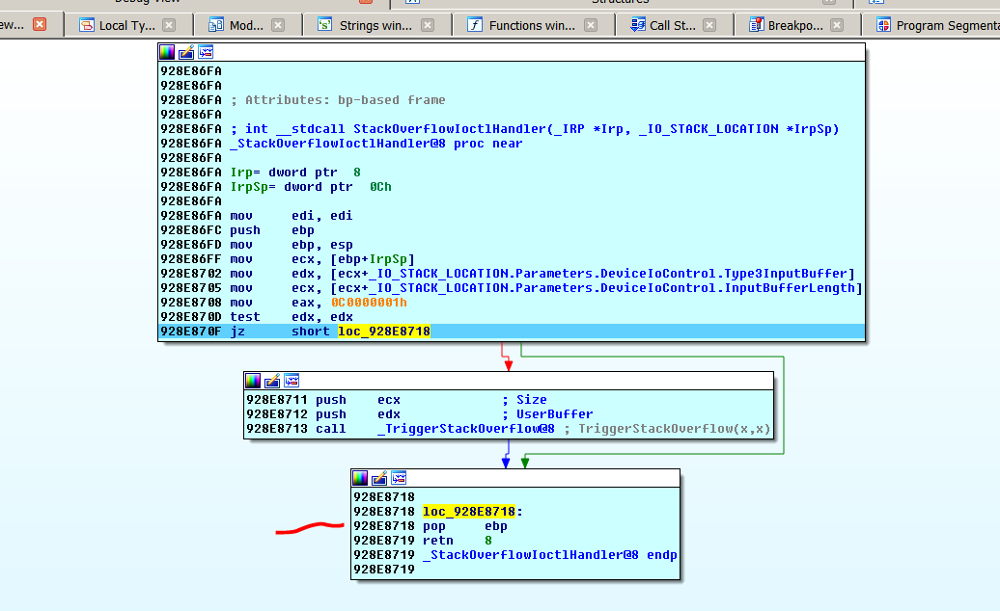

Я меняю **EIP** здесь с помощью правой кнопки и **SET IP** и нажимаю **RUN**.

Я думаю, что проблема в том, что размер буфера должен соответствовать размеру файла.

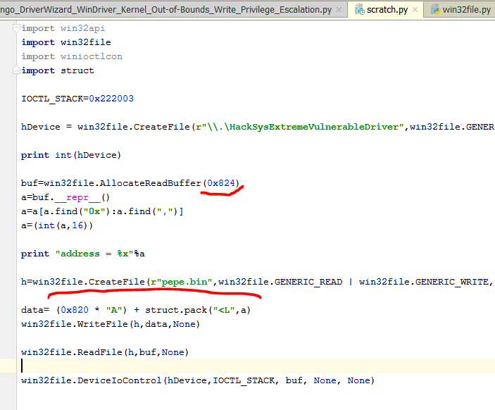

Давайте сделаем так.

Ах, уже упал.


Скрипту не хватало установки указателя файла в начале файла. Он читал файл с конца, где я оставил **WRITEFILE**, поэтому я не читал **A**. Теперь всё работает.


Я трассирую до **MEMCPY**.

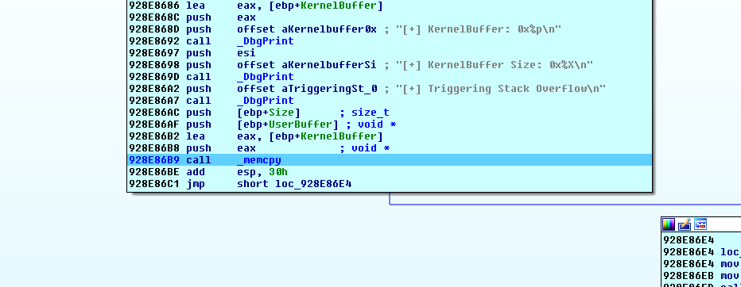

Я добираюсь до **RET**.

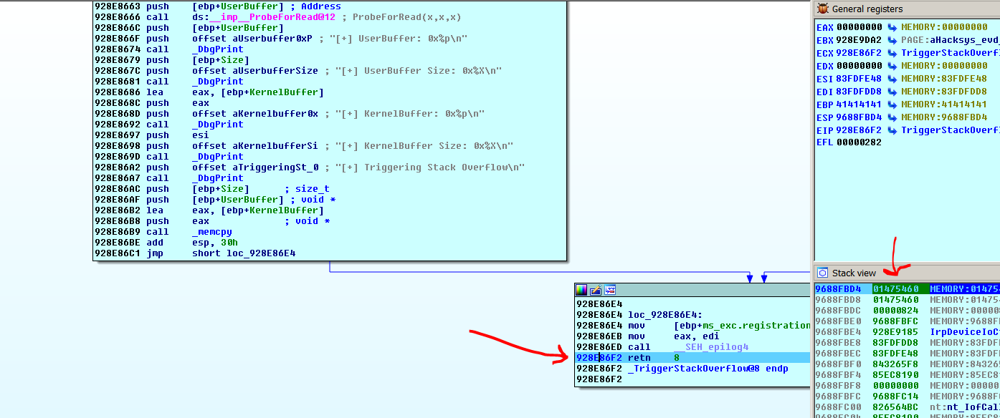

Я продолжаю с помощью **F7**.

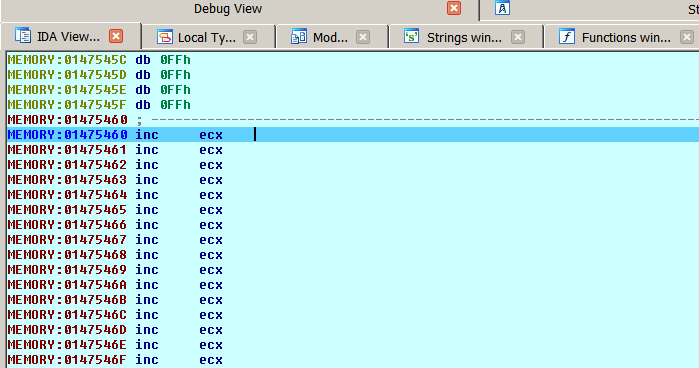

Я вижу, что я попал в буфер. Проблема состоит в том, что, поскольку я не выделил его с помощью **VIRTUALALLOC**, а выделяю его с помощью **API ALLOCATEREADBUFFER**, **WIN32FILE** у него нет прав на выполнение. Поэтому мне придется найти способ выделить исполняемый код другим способом.

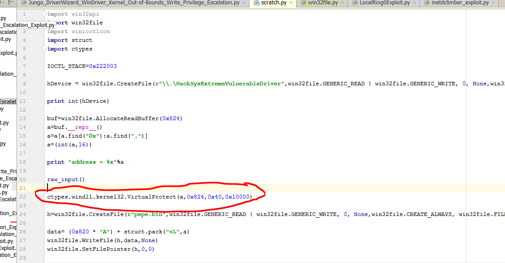

Я добавил библиотеку **CTYPES**, и у неё есть функция **VIRTUALPROTECT**, поэтому я дал ей права на выполнение, и теперь у нас нет проблем.

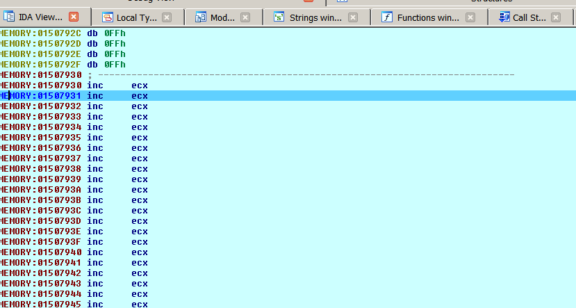

Программа переходит и выполняет без проблем. Я действительно вижу, что **CTYPES** более продвинутая, чем **WIN32API**, поэтому вы можете делать все, вызывает прямо функцию **VIRTUALALLOC**непосредственно из **CTYPES**.

Версия c **CTYPES** – это так

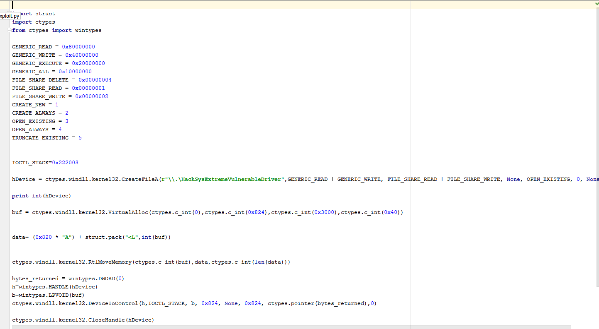

Библиотека использует напрямую функции **CREATEFILE**, **VIRTUALALLOC**, **RTLMOVENEMORY** и **DEVICEIOCONTROL**. Вам просто нужно быть осторожным с одним из типов, но она работает хорошо.

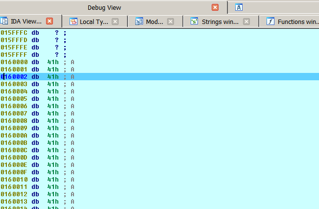

Здесь всё работает. Вопрос сейчас состоит в том, что мы выполняем код. Нам осталось бы делать шеллкод, потому что так у нас будет только красивый синий экран.

Мы проанализируем шеллкод и создадим его в следующей части.

* * *

Автор оригинального текста — Рикардо Нарваха.

Перевод и адаптация на русский язык — Яша Яшечкин.

Перевод специально для форума системного и низкоуровневого программирования - WASM.IN

03.11.2018

Источник:

[**http://ricardonarvaja.info/WEB/INTRODUCCION%20AL%20REVERSING%20CON%20IDA%20PRO%20DESDE%20CERO/57-INTRODUCCION%20AL%20REVERSING%20CON%20IDA%20PRO%20DESDE%20CERO%20PARTE%2057.7z**](http://ricardonarvaja.info/WEB/INTRODUCCION%20AL%20REVERSING%20CON%20IDA%20PRO%20DESDE%20CERO/57-INTRODUCCION%20AL%20REVERSING%20CON%20IDA%20PRO%20DESDE%20CERO%20PARTE%2057.7z)
