# Часть 58

[\[Используемые материалы\]](.gitbook/assets/files/58.zip)

Хорошо. Нам осталось добавить сам шеллкод. Это типичный шеллкод, который крадет токен процесса **SYSTEM** и копирует его в наш процесс. Он очень короткий. Но стоит его хорошо проанализировать.

```python
shellcode="\x53\x56\x57\x60\x33\xC0\x64\x8B\x80\x24\x01\x00\x00\x8B\x40\x50\x8B\xC8\xBA\x04\x00\x00\x00\x8B\x80\xB8\x00\x00\x00\x2D\xB8\x00\x00\x00\x39\x90\xB4\x00\x00\x00\x75\xED\x8B\x90\xF8\x00\x00\x00\x89\x91\xF8\x00\x00\x00\x61\x33\xC0\x83\xC4\x0C\x5D\xC2\x08\x00"
```

Шеллкод - довольно общий. То, что нужно знать про шеллкод, состоит в том, что когда он завершается, он возвращается к процедуре откуда он был вызван. Для этого нужно внимательно посмотреть. Последняя инструкция **RETN** должна быть **RETN 4** или больше, чтобы вернуться туда куда нужно. Если бы мы не перезаписали **RET** случилось бы переполнение и программа продолжила работу. Иначе будет **BSOD** и чао-какао.

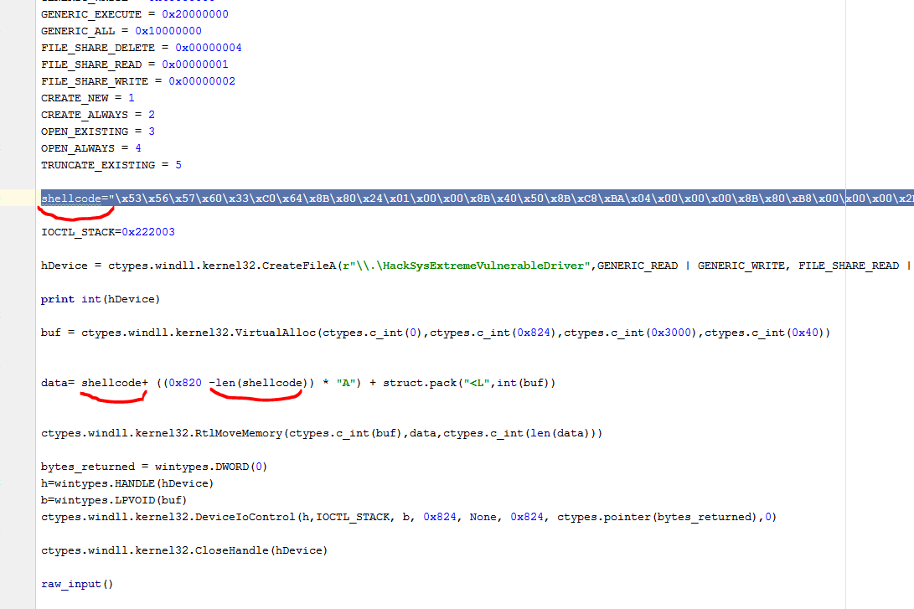

Здесь мы видим, как я разместил шеллкод. В начале данных, которые я пересылаю, я размещаю шеллкод и затем вычитаю **820** байт из длины этого же самого шеллкода для того, чтобы он не изменил положение значения, которым я перезаписываю адрес возврата в дальнейшем и сохраняю его правильным.

Если бы я запустил скрипт, прежде чем объяснять вам всё это, мы бы увидели, что я поместил вызов **RAW\_INPUT** в конец скрипта, чтобы остановить его до того, как он закроется, и посмотрим, смогу ли я повысить системные привилегии. Вы также можете запустить другой процесс и увидеть, есть ли у этого процесса системные привилегии, что может произойти только в том случае, если один системный процесс запускается другим.

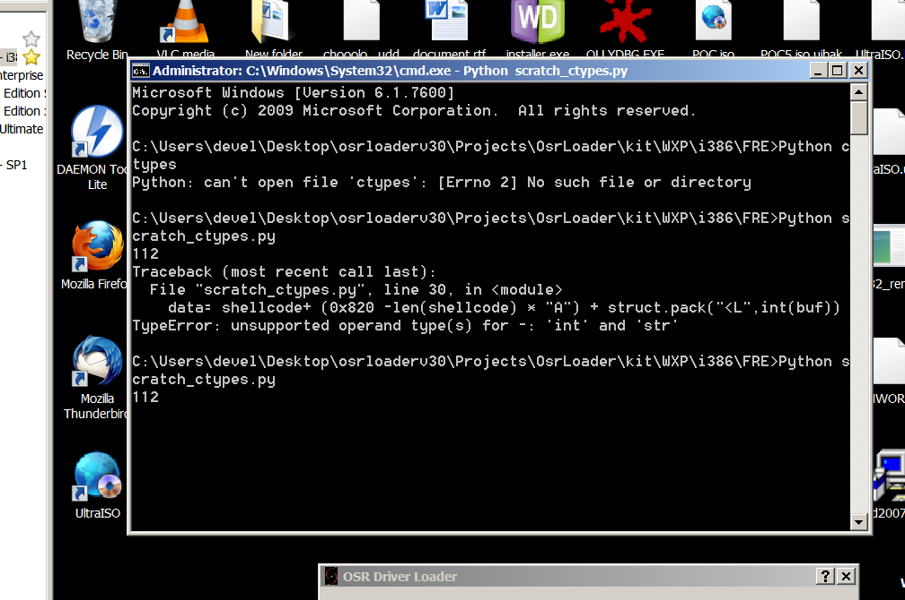

Здесь я запустил скрипт. Я вижу, что скрипт остановился на вызове **RAW\_INPUT**. Давайте посмотрим в **PROCESS EXPLORER**. Добавим столбец, который показывает текущего пользователя, который говорит нам следующее

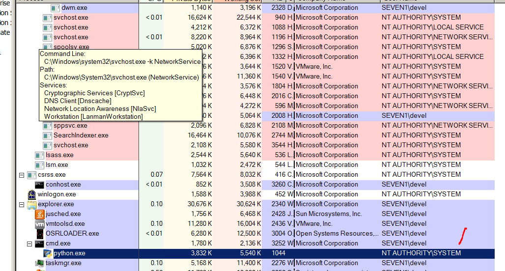

Мы работали над преобразованием процесса с привилегиями обычного пользователя в **SYSTEM**. Давайте посмотрим, как мы это сделали. Присоединим **IDA** и остановимся на инструкции **RET** перед выполнением шеллкода.

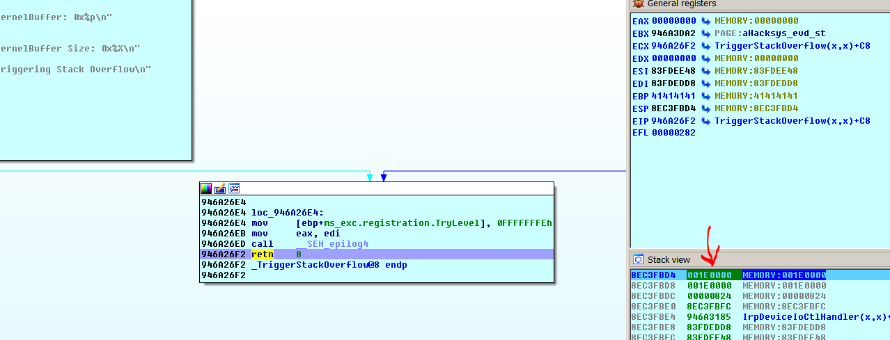

Здесь код остановился у инструкции **RET**. Мы трассируем один раз с помощью **F7**.

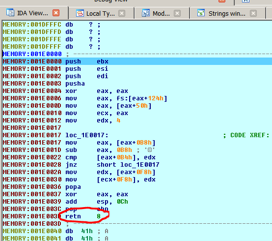

Здесь находится шеллкод. Он очень маленький и мы видим, что он заканчивается на инструкции **RETN 8**. Это значение должно быть хорошо отрегулировано, потому что под адресом возврата, который мы перезаписываем в стеке, чтобы выполнять наш шеллкод, находится адрес возврата в родительскую функцию, и это то, что мы действительно должны достичь с помощью этого **RET**, чтобы вернуться в программу так как родительская функция сделала бы это.

С помощью **P** мы можем создать функцию **CREATE FUNCTION** и преобразить её в графическую форму с помощью пробела.

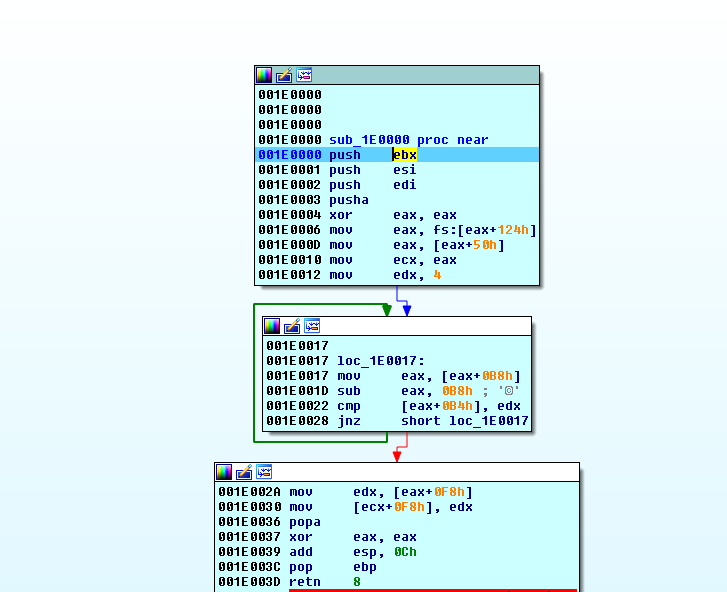

После инструкции **PUSHA**, которая сохраняет регистры в стеке, мы видим, что, поскольку **EAX** равно **0** из-за инструкции **XOR** и программа заканчивает чтение значения регистра **FS:\[124\]**

Хорошо. Каждый процесс имеет **TEB** или **TIB**.

[https://es.wikipedia.org/wiki/Win32\_Thread\_Information\_Block](https://es.wikipedia.org/wiki/Win32_Thread_Information_Block)

В вычислительной технике, **WIN32 THREAD INFORMATION BLOCK \(TIB\)** эта структура данных в системах **WIN32**, особенно в архитектуре **X86**, которая хранит информацию о потоке, который выполняется. Также она известна как **THREAD ENVIRONMENT BLOCK \(TEB\)**.

Хорошо. Эта структура имеет поля, к которым обращается через регистр **FS:\[x\]**. Здесь в таблице мы видим, например, **FS:\[124\]**

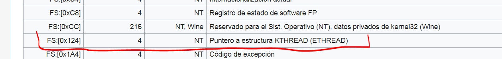

Также, широко используется указатель на **PEB**, что расшифровывается как **PROCESS ENVIRONMENT BLOCK**, который находится в **FS:\[30\]**

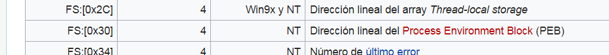

В **WINDBG** вы можете увидеть эту структуру.

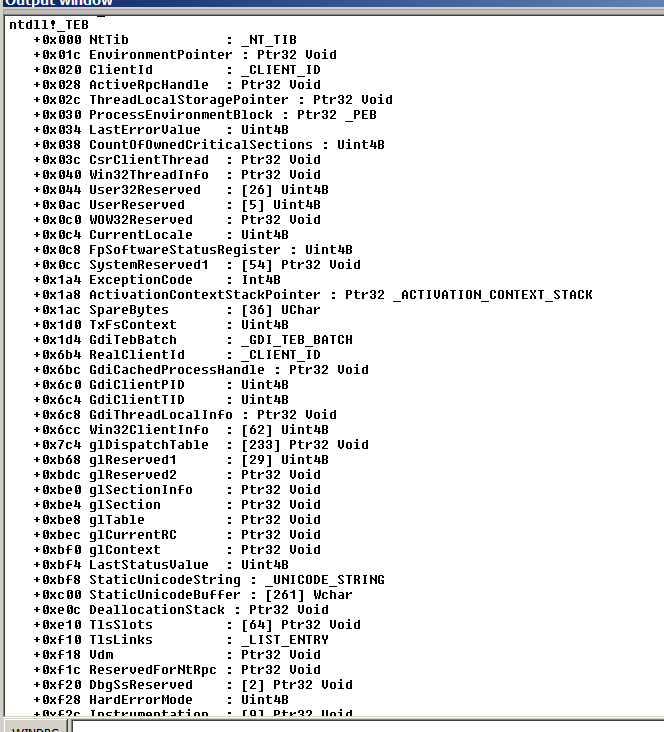

Хотя смещение **0x124** не показывается нам даже если мы придадим структуре большую глубину. Как мы видели, это структура **ETHREAD**.

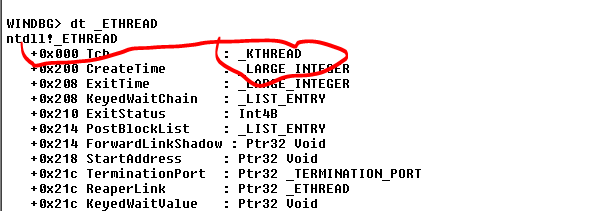

Как и в позиции **0,** это структура **KTHREAD** или **KERNEL THREAD**. Это означает, что поле **50**, которое программа ищет дальше внутри структуры **ETHREAD**, будет находиться внутри **KTHREAD**, потому что последняя имеет размер **0x200**.

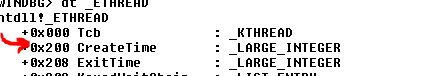

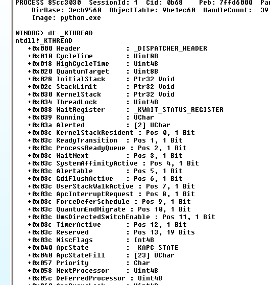

Мы видим, что поле **0x50** не показывается нам. Оно находится внутри структуры **\_KAPC\_STATE** которая находится по смещению **0x40**.

Посмотрим её. По смещению **0x10** это **\_KPROCESS**.

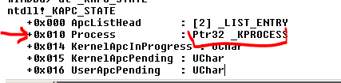

Если мы читаем это значение, и передаем его в регистр **EAX**, мы видим, что это знаменитый **EPROCESS** или **KPROCESS** - то же самое? Нет, но почти.

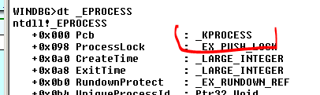

Мы видим, что **KPROCESS** находится в поле **0 EPROCESS**, так что всё нормально, адрес совпадает. Если начиная с этого значения, сумма смещения меньше чем **0x98**, это будет **KPROCESS** и находится внутри этого. Если сумма больше **0x98**, это будет в оставшейся части структуры **EPROCESS**.

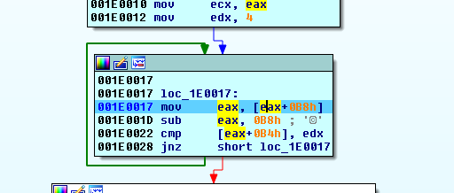

Мы видим, что программа читает поле **0xB8**, поэтому мы уже вышли из структуры **KPROCESS** и находимся внутри **EPROCESS**.

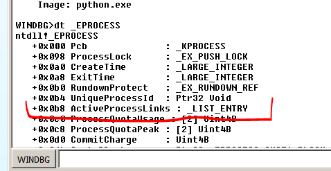

Программа читает знаменитую **ACTIVEPROCESSLINKS**.

Как и в предыдущем упражнении, я собрал структуру **EPROCESS**, которая была неполной, но она работает.

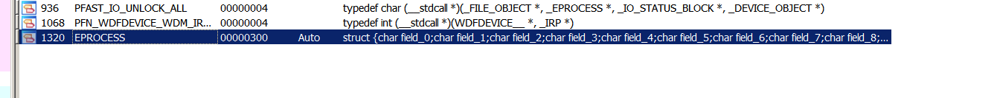

Через меню **FILE → LOAD FILE → PARSE C HEADER FILE** я ищу структуру и добавляю её.

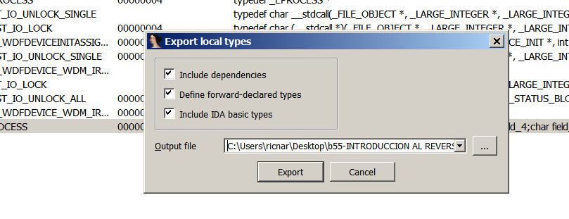

Я помечаю её через **LOCAL TYPES** и экспортирую её в файл **C HEADER**

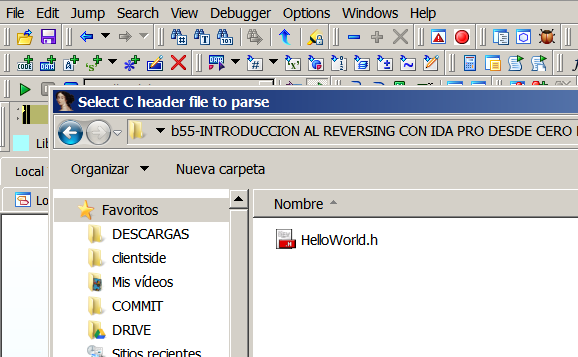

Теперь происходит синхронизация.

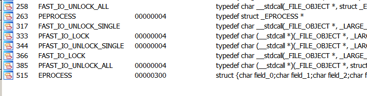

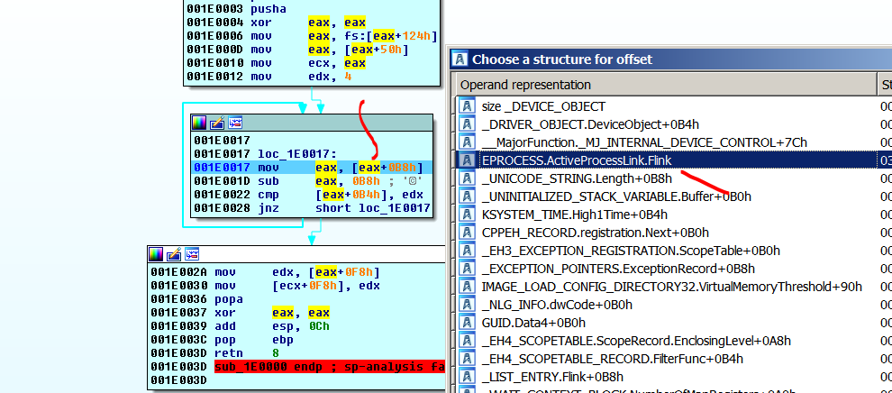

Я нажимаю **T** и ищу структуру. И это наш **FLINK**. Другими словами, он указывает на **ACTIVEPROCESSLINK** следующего процесса, так как он находится по смещению **0xB8**. Программа вычитает эту константу, чтобы найти **EPROCESS** следующего процесса.

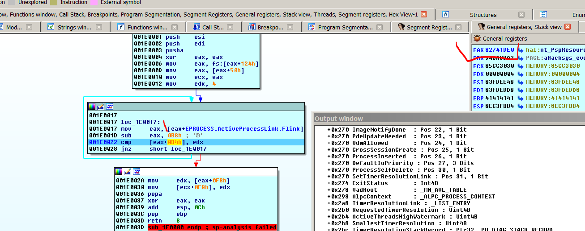

В регистре **EAX** должен быть указатель на **EPROCESS** следующего процесса.

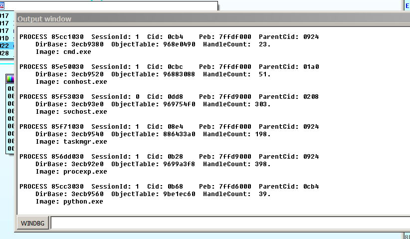

Поскольку больше ничего нет, я думаю, вы должны указать на начало таблицы, чтобы заново начать ходить по ней. Давайте посмотрим.

Мы видим, что программа сравнивает значение поля **0xB4** этого **EPROCESS** со значением **4**. Давайте посмотрим, что это смещение **0xB4**. Поэтому мы добавляем его в нашу структуру.

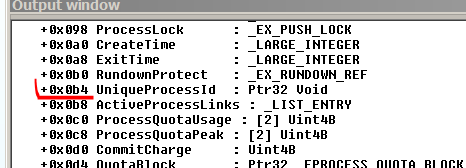

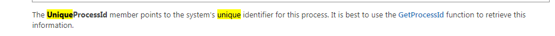

То есть, программа замечает, что если **PID** равен **4**, это соответствует процессу **SYSTEM**.

Я добавлю поле в мою структуру. Программа не позволяет редактировать структуру, потому что я импортирую её, поэтому я добавил поле в **.H** файл, который я экспортировал.

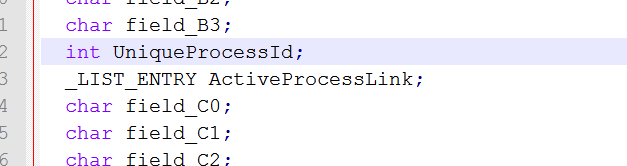

Я повторно импортирую файл, не удаляя предыдущий, и добавляется недостающее поле.

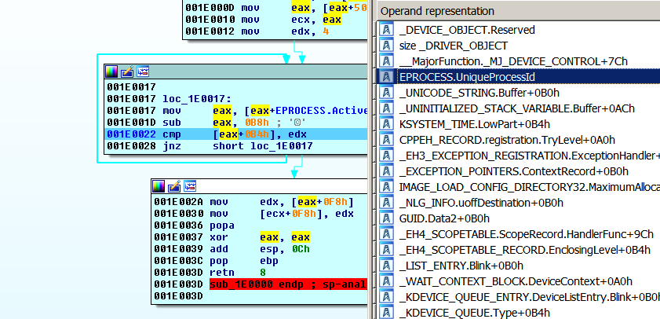

Я нахожусь здесь.

Мы видим, что значение не равно **4**, поэтому мы продолжаем трассировать. Конечно, всё начнется снова с первого процесса. Давайте посмотрим.

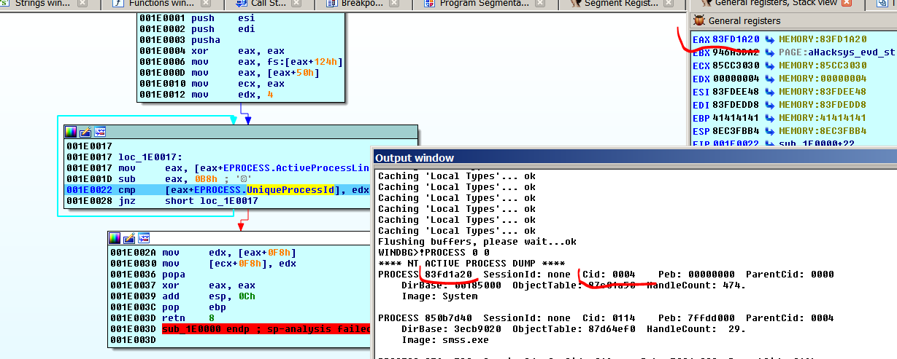

Здесь программа начинается с начала. В этом случае **PID** или **CID** равен **4** и соответствует процессу **SYSTEM**.

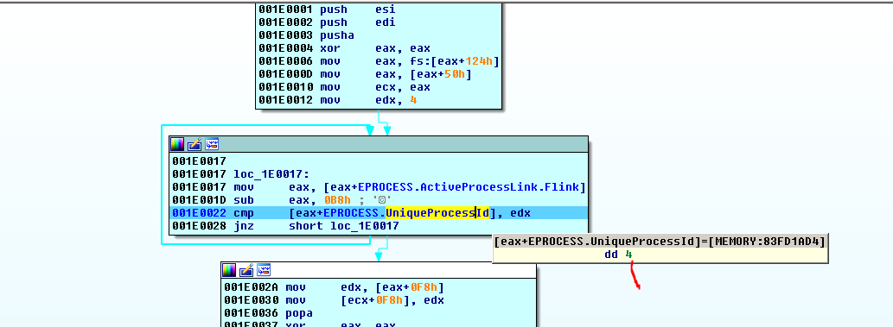

Теперь если программа найдет **EPROCESS** процесса **SYSTEM**, она выйдет из цикла.

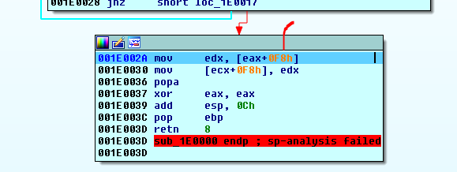

Мы видим, что программа читает поле **0xF8 EPROCESS** процесса **SYSTEM**. Давайте посмотрим, что там есть.

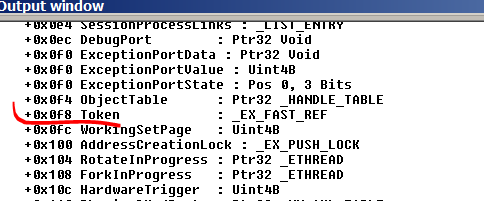

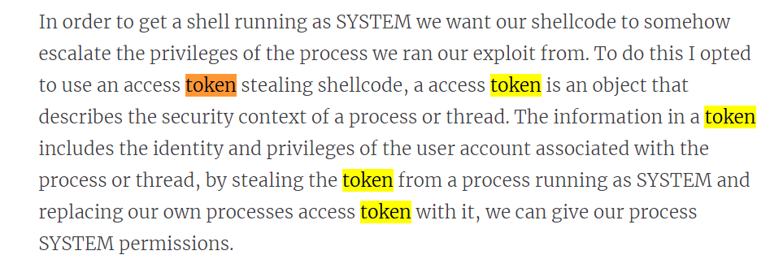

Хорошо. Программа копирует токен системы в наш **EPROCESS**. Он будет иметь привилегии **SYSTEM**, и вот что программа там делает. Читает токен **SYSTEM**.

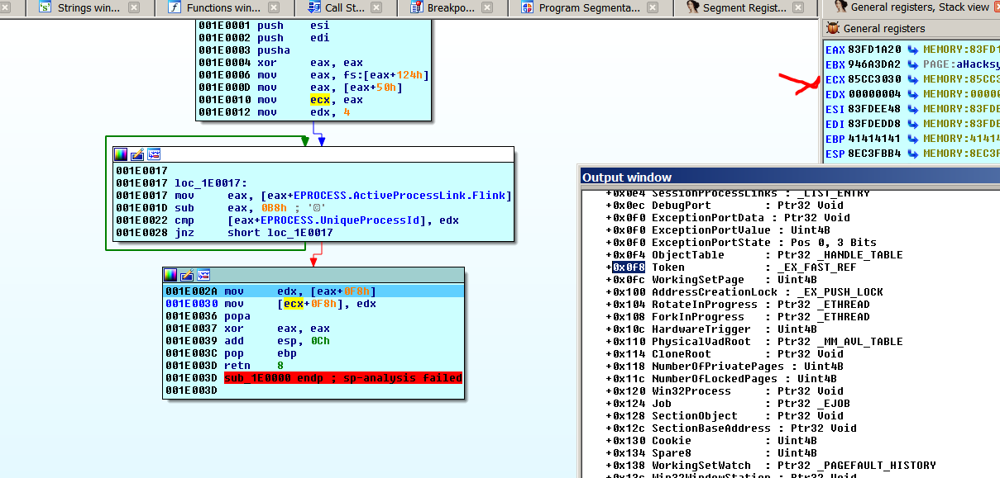

И поскольку регистр **ECX** имел наш **EPROCESS**, к нему добавляется значение **0xF8**, чтобы сохранить токен **SYSTEM** в нашем процессе.

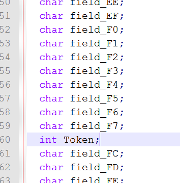

Я могу добавить недостающее поле в **.H** файл и импортировать его снова. Нет необходимости удалять предыдущий.

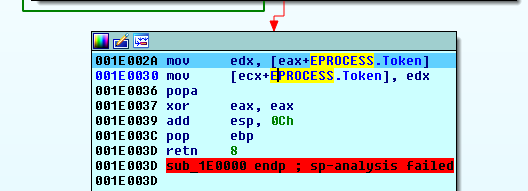

Помните, что значения являются токенами разных процессов. Регистр **EAX** указывает на **EPROCESS SYSTEM,** а **ECX** на наш **EPROCESS** из **PYTHON.EXE**.

С этим уже все работает как нужно. Давайте посмотрим, сможем ли мы с этим **RET** нормально вернутся обратно в программу и продолжить работу с драйвером.

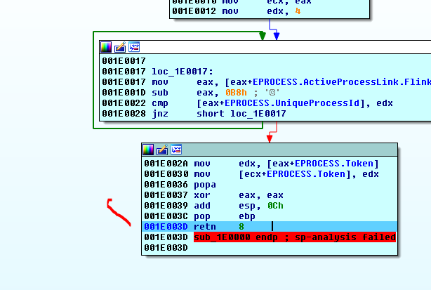

Программа вернулась в ту же самую точку, куда она должна была вернуться, если бы вместо того, чтобы выполнить наш шеллкод, она возвратилась к уязвимой функции. Со стеком в той же самой позиции. Нужно убедиться в этом, иначе снова будет **BSOD**.

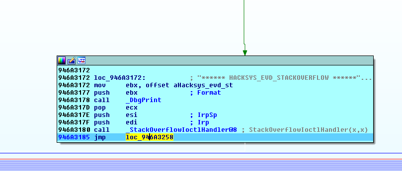

Я нажимаю **RUN** и остаюсь в ожидании функции **RAW\_INPUT**.

У меня сейчас нет **PROCESS EXPLORER**. Я закрыл его, чтобы он обновился.

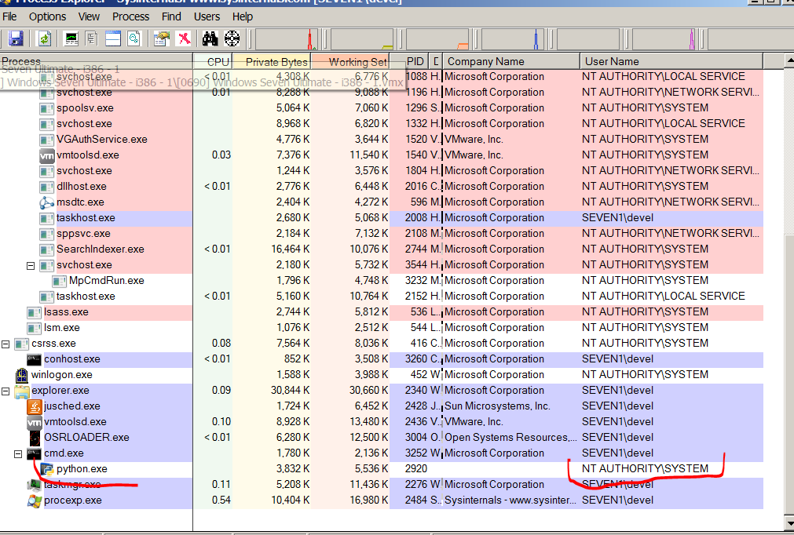

И у нас есть готовые права **SYSTEM**.

Я могу запустить калькулятор с правами **SYSTEM**.

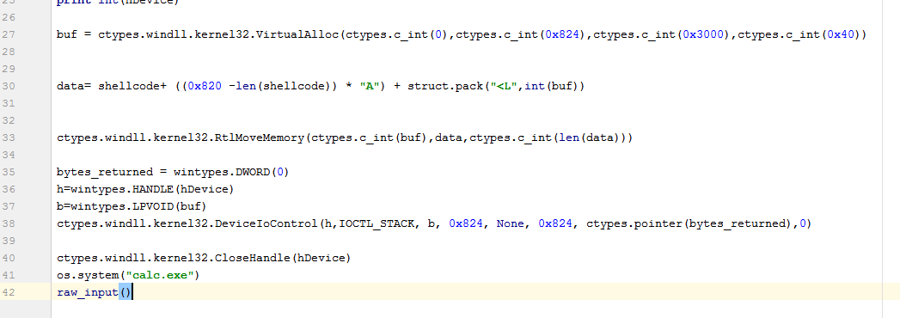

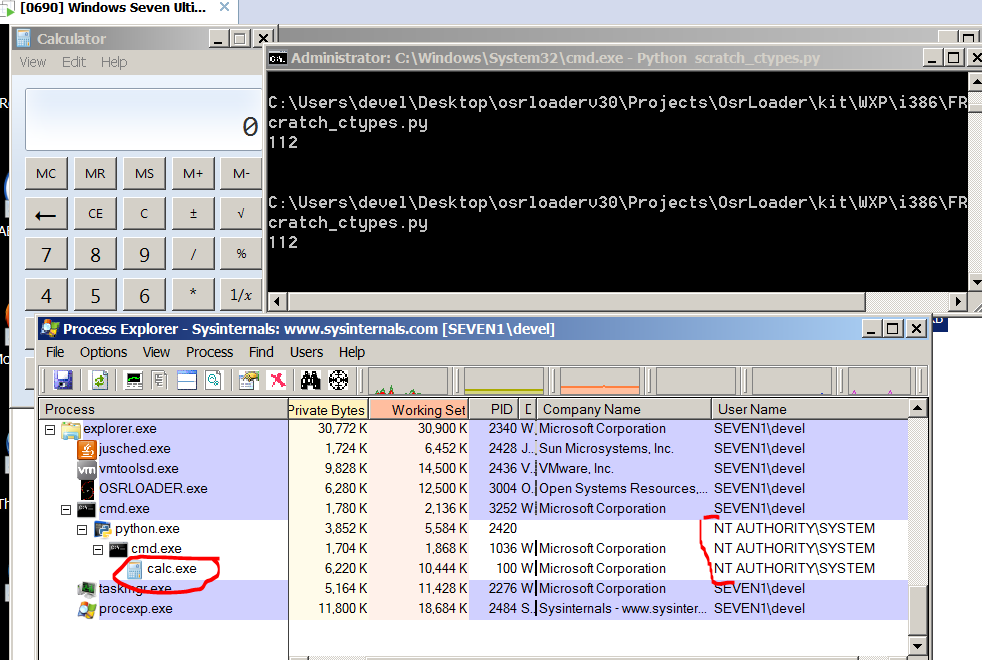

Готово. Мы достигли цели.

* * *

Автор оригинального текста — Рикардо Нарваха.

Перевод и адаптация на русский язык — Яша Яшечкин.

Перевод специально для форума системного и низкоуровневого программирования - WASM.IN

01.12.2018

[**Источник: ricardonarvaja.info**](http://ricardonarvaja.info/WEB/IDA%20DESDE%20CERO/CURSO%20DE%20IDA%20TUTES/58-INTRODUCCION%20AL%20REVERSING%20CON%20IDA%20PRO%20DESDE%20CERO.docx)
