# Часть 59

[\[Используемые материалы\]](.gitbook/assets/files/59.zip)

Давайте рассмотрим **ARBITRARY OVERWRITE** \(записать то, что мы хотим туда куда мы хотим\) того же самого уязвимого драйвера. Конечно, я хочу уточнить, что это старый метод, который работает только на **WINDOWS XP** и **WINDOWS 7**, и в этом случае только для машин **x86**. **НА МАШИНАХ С WINDOWS 7 64 БИТ ЭТО НЕ БУДЕТ РАБОТАТЬ**. По крайней мере если не адаптировать немного эксплоит. Мы должны хорошо проверить некоторые значения которые не равны.

Наша цель - это **32-х** битная **WINDOWS 7**.

Но всё равно это нам понадобиться для того, чтобы свыкнуться с **CTYPES**, которые являются немного сложными и чтобы продвигаться вперед понемногу.


В диспетчере, который обрабатывает различные **IOCTL** коды. Мы видим, что есть один, который помечен как **ARBITRARY OVERWRITE**, поэтому мы отмечаем его. Давайте сначала посмотрим, что значение **IOCTL** приносит нас сюда.

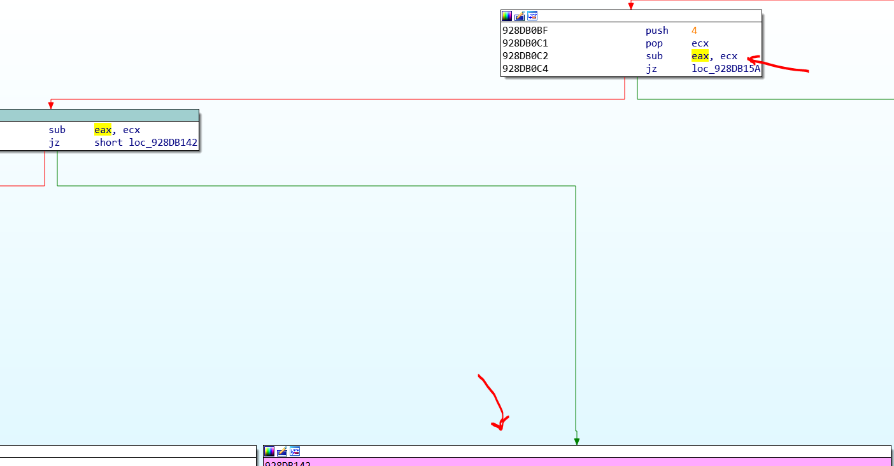

Мы видим, что программа вычитает из **EAX** константу **4** дважды и до того, как она вычитает значение **0x222003**.

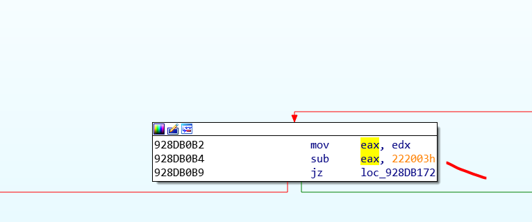

```console
Python>hex(0x222003 + 8)
0x22200B
```

Поэтому с этим **IOCTL** программа приходит к блоку, который нам нужен из этой уязвимости, потому что:

```console
0x22200B – 0x222003 – 4 – 4 = 0
```

И если результат равен нулю, программа переходит в этот блок.

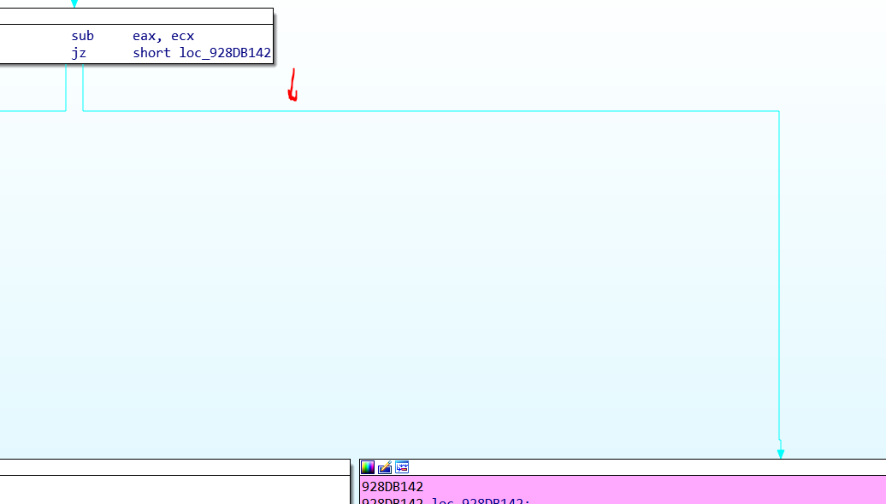

Хорошо. Мы здесь. Давайте посмотрим на уязвимость.

Напомним, что в **IRP** + **0x60** находится указатель на структуру **\_IO\_STACK\_LOCATION**, это было **0x40** из **TAIL** в структуре **IRP**, а внутри **TAIL** по смещению **0x20** есть указатель на **CURENTSTACKLOCATION**.

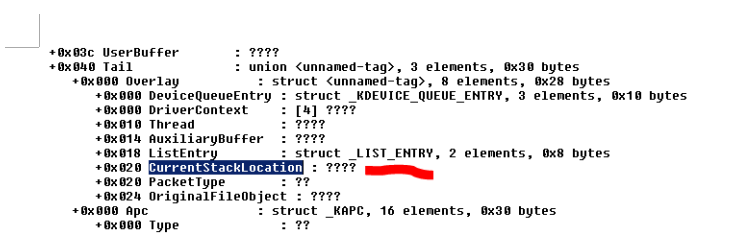

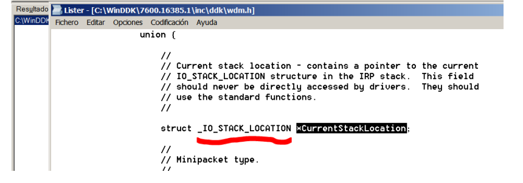

Поэтому, **0x60** является смещением **CURENTSTACKLOCATION**, которое имеет тип **\_IO\_STACK\_LOCATION**.

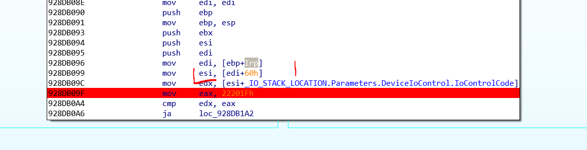

Я нажимаю **T**. Я вижу поле и оттуда программа читает **IOCTL** код.

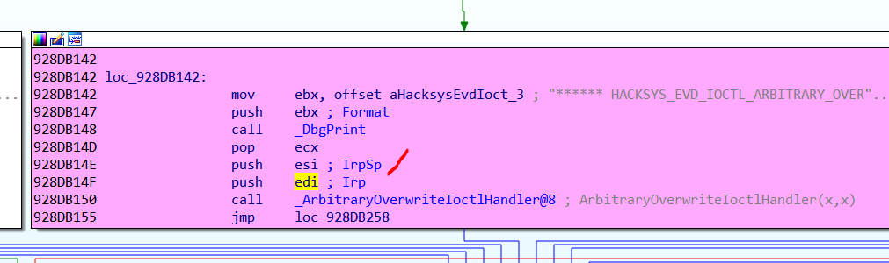

Программа передаёт два аргумента. Указатель на **IRP** в регистре **EDI** как первый и указатель на структуру **\_IO\_STACK\_LOCATION**.

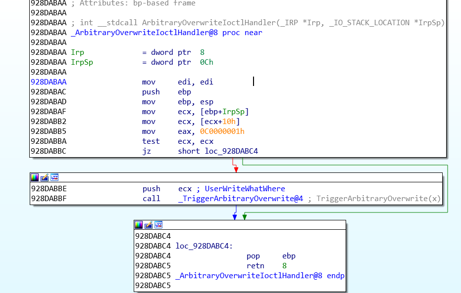

Здесь в регистр **ECX** помещается указатель на **\_IO\_STACK\_LOCATION**.

```console
dt -r4 _IO_STACK_LOCATION

nt!_IO_STACK_LOCATION
+0x000 MajorFunction : UChar
+0x001 MinorFunction : UChar
+0x002 Flags : UChar
+0x003 Control : UChar
+0x004 Parameters : <unnamed-tag>
```

Мы уже видели, что **PARAMETERS** менялись в зависимости от случая, поскольку, когда вызывается **DEVICEIOCONTROL**, это

```console
+0x000 DeviceIoControl : <unnamed-tag>
+0x000 OutputBufferLength : Uint4B
+0x004 InputBufferLength : Uint4B
+0x008 IoControlCode : Uint4B
+0x00c Type3InputBuffer : Ptr32 Void
```

По смещению **0x10** от начала \(помните, что вам нужно добавить **0x4** к **PARAMETERS**\) для случая **DEVICEIOCONTROL** - это поле **TYPE3INPUTBUFFER**.

Здесь появляются четыре аргумента, которые передаются в функцию **DEVICEIOCONTROL**.

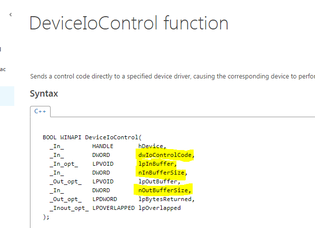

```console
+0x000 DeviceIoControl
+0x000 OutputBufferLength es nOutBufferSize
+0x004 InputBufferLength es nInBufferSize
+0x008 IoControlCode es dwIoControlCode
+0x00c Type3InputBuffer es lpInBuffer
```

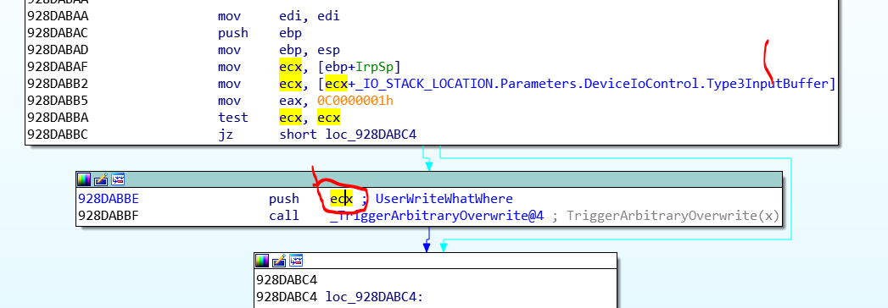

Поэтому, это наш входной буфер, который мы передали в функцию **DEVICEIOCONTROL**.

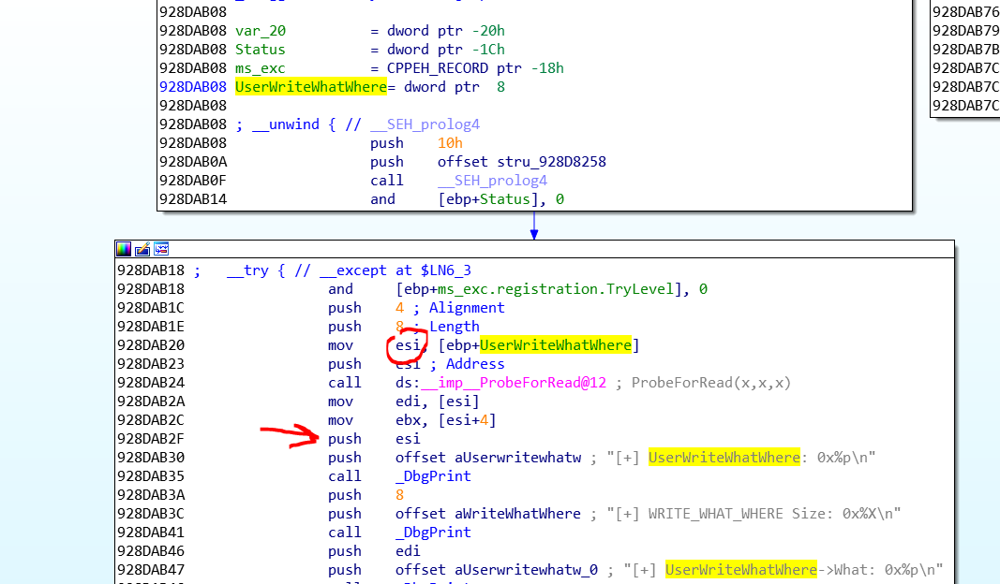

Мы видим, что в регистр **ESI** помещается адрес нашего буфера, который здесь называется **USERWRITEWHATWHERE** и печатается его адрес.

Затем мы видим, что программа читает содержимое **ESI** и из **ESI** + **4** и печатает свои адреса, что заставляет нас думать, что это структура из двух указателей. Здесь нам говорится, что её размер равен **8**.

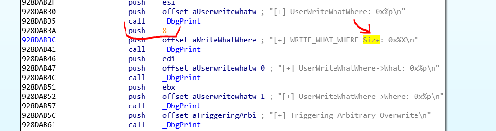

Поэтому, мы будем создавать структуру из **8** байтов. Мы видим, что есть два поля: **WHAT** и **WHERE**, и которые оба являются указателями, поэтому в **32** битных системах они будут по **4** байта каждый.

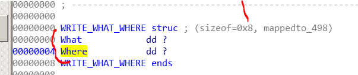

Поэтому здесь программа печатает значения **WHAT** и **WHERE**.

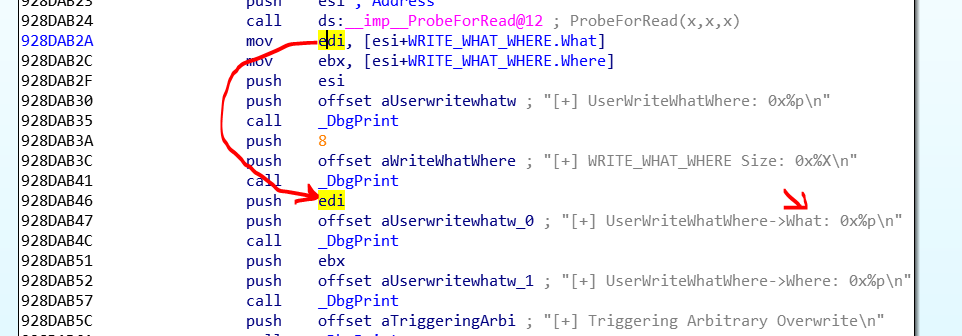

Здесь мы видим уязвимую часть драйвера.

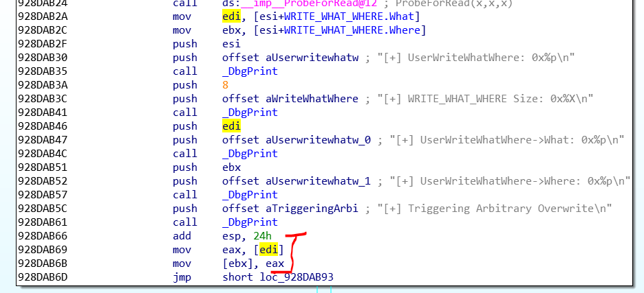

Регистр **EDI** - это **WHAT**, поэтому он должен быть указателем, поскольку он ищет содержимое \[**EDI**\] и записывает его в содержимое **WHERE** в \[**EBX**\].

Поэтому **WHAT** должен быть указателем на указатель на наш код и в **WHERE**, мы должны искать таблицу для записи \(возможно, непосредственный **CALL**, чтобы мы записали указатель на наш код и в конечном итоге перешли на него, чтобы выполнить его.\)

Мы будем использовать старый метод таблицы **HAL**. \(Он не работает в системах с защитой **INTEL SMEP**, поэтому в **WINDOWS XP** и **7** он по-прежнему работает\)

Intel CPU feature: Supervisor Mode Execution Protection \(SMEP\). This feature is enabled by toggling a bit in the cr4 register, and the result is the CPU will generate a fault whenever ring0 attempts to execute code from a page marked with the user bit.

Другими словами, если вы переходите из ядра, чтобы выполнить страницу, помеченную как принадлежащую режиму **USER**, это дает исключение. Я избегаю выполнения, как в методе, который мы сейчас увидим.

Также мы можем писать в **KERNEL** куда захотим. Вы можете отключить удачно навыками и чем-то еще эти защиты. Пока мы сконцентрируемся на старом способе эксплуатации, который работает для **WINDOWS XP** и **WINDOWS 7** для **32х** битных систем, и также может работать в процессорах, которые не имеют **SMEP** в других системах.

[http://poppopret.blogspot.com.ar/2011/07/windows-kernel-exploitation-basics-part.html](http://poppopret.blogspot.com.ar/2011/07/windows-kernel-exploitation-basics-part.html)

Этот метод основывается на таблице **HAL DISPATCH**.

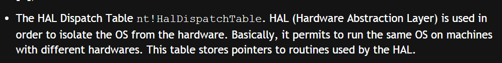

Хорошо. Существует функция, импортированная из **NTDLL** под названием **NTQUERYINTERVALPROFILE**. Eсли я открою в другой **IDA NTDLL.DLL 32** бита, я увижу функции, которые экспортируются, которые есть здесь.

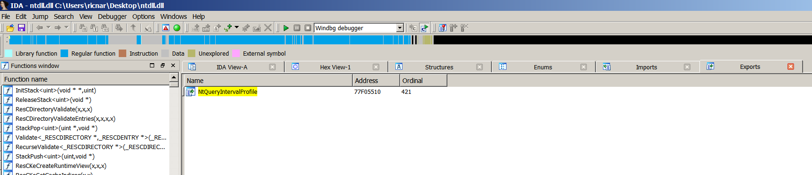

Эта функция, которая может быть вызвана из пользовательского режима, поступает в ядро.

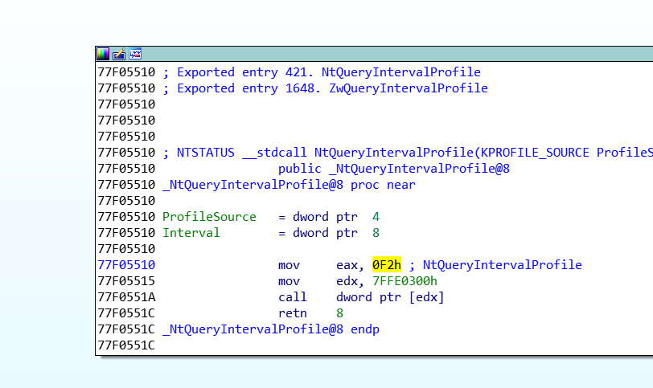

К функции **NT!KEQUERYINTERVALPROFILE**

```console
nt!KeQueryIntervalProfile:
82911891 8bff mov edi,edi
82911893 55 push ebp
82911894 8bec mov ebp,esp
82911896 83ec10 sub esp,10h
82911899 83f801 cmp eax,1
8291189c 7507 jne nt!KeQueryIntervalProfile+0x14 (829118a5)
8291189e a188ca7a82 mov eax,dword ptr [nt!KiProfileAlignmentFixupInterval (827aca88)]
829118a3 c9 leave
```

Затем следуйте сюда.

```console
829118a4 c3 ret
829118a5 8945f0 mov dword ptr [ebp-10h],eax
829118a8 8d45fc lea eax,[ebp-4]
829118ab 50 push eax
829118ac 8d45f0 lea eax,[ebp-10h]
829118af 50 push eax
829118b0 6a0c push 0Ch
829118b2 6a01 push 1
kd> u
nt!KeQueryIntervalProfile+0x23:
829118b4 ff15bc237782 call dword ptr [nt!HalDispatchTable+0x4 (827723bc)]
829118ba 85c0 test eax,eax
829118bc 7c0b jl nt!KeQueryIntervalProfile+0x38 (829118c9)
829118be 807df400 cmp byte ptr [ebp-0Ch],0
829118c2 7405 je nt!KeQueryIntervalProfile+0x38 (829118c9)
829118c4 8b45f8 mov eax,dword ptr [ebp-8]
829118c7 c9 leave
829118c8 c3 ret
```

И программа переходит на адрес **KERNEL**, который находится в таблице **HAL DISPATCH** + **4**.

Метод заключается в том, что, поскольку из режима пользователя мы не можем записать эту таблицу. Уязвимость в ядре позволяет нам писать туда, куда мы хотим, чтобы адрес для записи был содержимым **NT!HALDISPATCHTABLE** + **0x4**, и мы должны сделать это с указателем на буфер с нашим кодом.

После этого мы можем сделать вызов когда хотим, так функция может вызваться от из режима пользователя, поэтому, сделав вызов, как правило, из нашего скрипта, в конце кода, программа придет сюда.

```console
829118b4 ff15bc237782 call dword ptr [nt!HalDispatchTable+0x4 (827723bc)]
```

И программа будет переходить на код в отсутствие **SMEP**, поскольку не проверяется, что страница, на которую переходит программа, не является ядром, а помечена как страница пользовательского режима.

Если **SMEP** был активирован, генерируется исключение, и программа не будет переходить на наш код.

Я прикрепляю скрипт, для тех, кто хочет его попробовать. Он довольно длинный. Поэтому мы объясним его в следующей части. Помните, что он работает только в **32**-битной целевой машине **WINDOWS 7**.

* * *

Автор оригинального текста — Рикардо Нарваха.

Перевод и адаптация на русский язык — Яша Яшечкин.

Перевод специально для форума системного и низкоуровневого программирования - WASM.IN

05.12.2018

Источник:

[**http://ricardonarvaja.info/WEB/INTRODUCCION%20AL%20REVERSING%20CON%20IDA%20PRO%20DESDE%20CERO/59-INTRODUCCION%20AL%20REVERSING%20CON%20IDA%20PRO%20DESDE%20CERO%20PARTE%2059.7z**](http://ricardonarvaja.info/WEB/INTRODUCCION%20AL%20REVERSING%20CON%20IDA%20PRO%20DESDE%20CERO/59-INTRODUCCION%20AL%20REVERSING%20CON%20IDA%20PRO%20DESDE%20CERO%20PARTE%2059.7z)
