# Часть 63

**СЕГМЕНТАЦИЯ И ПЭЙДЖИНГ ПАМЯТИ ДЛЯ АРХИТЕКТУРЫ X86**

В этой части туториала мы попытаемся увидеть управление памятью для архитектуры **X86**, а позже попытаемся актуализировать знания для **X64**.

Это серьёзная тема. Она включает в себя таблицы, которые вы должны понять и научиться находить, поэтому мы будем идти медленно и верно.

Давайте посмотрим, некоторые понятия полученные из Интернета.

**РЕАЛЬНАЯ ПАМЯТЬ ТАКЖЕ НАЗЫВАЕМАЯ ФИЗИЧЕСКАЯ ИЛИ ПАМЯТЬ RAM**

Эта память используется для хранения инструкций и выполнения процессов на нашем компьютере. Емкость этой памяти - это реальная емкость, которая необходима нашей машине для выполнения наших программ.

**ВИРТУАЛЬНАЯ ПАМЯТЬ**

Виртуальная память больше, чем физическая память как таковая. Она является техникой, используемой в вычислительной техники для симуляции того, что у вас есть больше емкости физической памяти. Техника состоит в том, чтобы хранить определенное количество файлов на жестком диск для их мгновенного хранения. Как только данные потребуются, они отправляются обратно в физическую память для исполнения.

Применяя эту технику, вы можете получить большую емкость для выполнения инструкций, однако, это также имеет свои недостатки, такие как тот факт, что приложения, выполняемые в виртуальной памятью, могут работать медленнее, потому что время, необходимое системе для доступа к данным, намного больше, чем время, необходимое для доступа к данным, хранящимся в физической памяти.

Когда используется вся **RAM**, то используется виртуальная память, которая использует пространство диска для имитации большего количества реальной памяти, чем у нас есть.

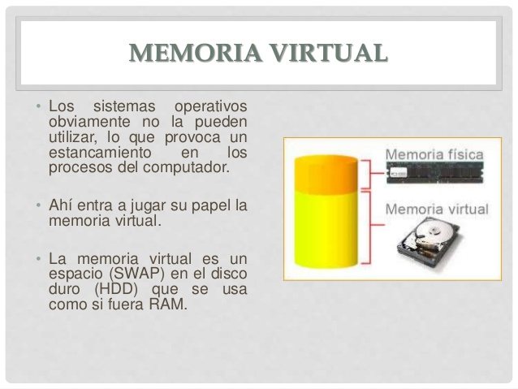

На рисунке мы видим, что операционная система использует физическую память, которую она имеет, плюс виртуальную память \(**SWAP\),** и в **x86** система создает для каждого процесса виртуальное адресное пространство, то есть адреса, которые мы видим в нашем отладчике, когда мы работаем с ним.

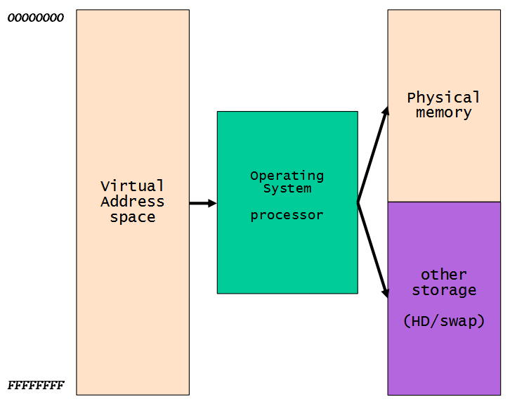

Эти виртуальные адреса для каждого процесса начинаются с адреса **0** и заканчиваются на **0xFFFFFFFF**, а в **WINDOWS** нижняя половина, т.е. от **0x0** до **0x7FFFFFFF** соответствует части уровня пользователя, где находятся исполняемые файлы и модули программы. Часть от **0x7FFFFFFF** до **0xFFFFFFFF** соответствует ядру.

Таким образом, мы видим, что, каждый процесс имеет своё пространство памяти с теми же адресами. Проблема в том, что процесс работает с виртуальными адресами, т.е. в моем процессе, например, **0x401000** имеет определенный код, а в другом процессе тот же виртуальный адрес **0x401000** имеет другой код или что-то еще, и то, что оба соответствуют различным физическим или реальным адресам в памяти.

**ФИЗИЧЕСКИЕ** **АДРЕСА** И **ВИРТУАЛЬНЫЕ** **АДРЕСА**

Виртуальный адрес - это то, что видит приложение или то, что мы видим при отладке. Физический или реальный адрес - это то, что видит реальное оборудование и операционная система.

**РЕАЛЬНЫЙ РЕЖИМ**

**INTEL**, для поддержки совместимость с предыдущими версиями в своих процессорах \(кроме **IA**-**64**\), в начальном состоянии \(после перезапуска\) процессор запускается в режиме, называемом реальным режимом. Во время запуска операционной системы процессор переключается в защищенный режим.

Сегментация используется в реальном режиме, который является старым методом управления памятью, где каждый логический адрес указывает непосредственно на физическую память.

Давайте посмотрим несколько примеров \(из эпохи **286**-**386**\):

Архитектура **286** представляла **4** сегмента: **CS** \(сегмент кода\), **DS** \(сегмент данных\), **SS** \(сегмент стека\), **ES** \(дополнительный сегмент\).

Физический\_адрес := сегмент × 16 + смещение

Если у меня есть адрес

**06EFH:1234H**

То, чтобы рассчитать физический адрес, умножьте часть сегмента на **16** \(**0x10**\) и добавьте смещение.

**0x6EF \* 0x10 + 0x1234**

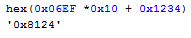

И я получаю адрес **0x8124**, который является физическим адресом. Мы не будем больше углубляться в реальный режим, потому что он больше не используется, за исключением проблем совместимости.

**ЗАЩИЩЕННЫЙ РЕЖИМ**

В защищенном режиме сегментная часть заменяется **16**-битным селектором, хотя трансляция на физический адрес немного сложнее.

Существуют так называемые управляющие регистры, которые мы рассматривали выше в предыдущих частях, например такой который отключение **SMEP** - **CR4**, но в данном случае нам важен **CR3**.

**CR3**

Регистр используется, когда включена виртуальная адресация, следовательно, когда бит **PG** установлен в **CR0**. **CR3** позволяет процессору преобразовывать линейные адреса в физические адреса, находя каталог страниц и таблицы страниц для текущей задачи.

Хорошо. Мы видим, что регистр используется для преобразования виртуальных адресов в физические, поэтому мы попытаемся выяснить, как его использовать. Очевидно, из процесса в пользовательском режиме мы не можем иметь привилегии для доступа к нему, поэтому мы должны отлаживать ядро, как мы видели в предыдущих частях.

Давайте перейдем к практической части, которая мне нравится больше всего.

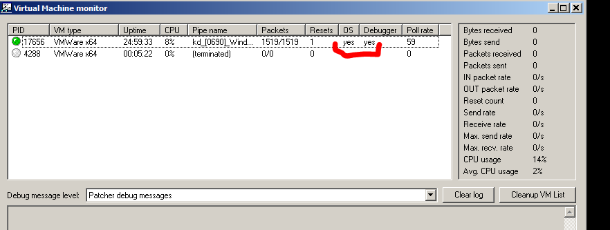

Вот где запускается операционная система, и я сейчас отлаживаю с помощью **WINDBG**.

Я собираюсь запустить калькулятор, который будет процессом, на котором я собираюсь экспериментировать.

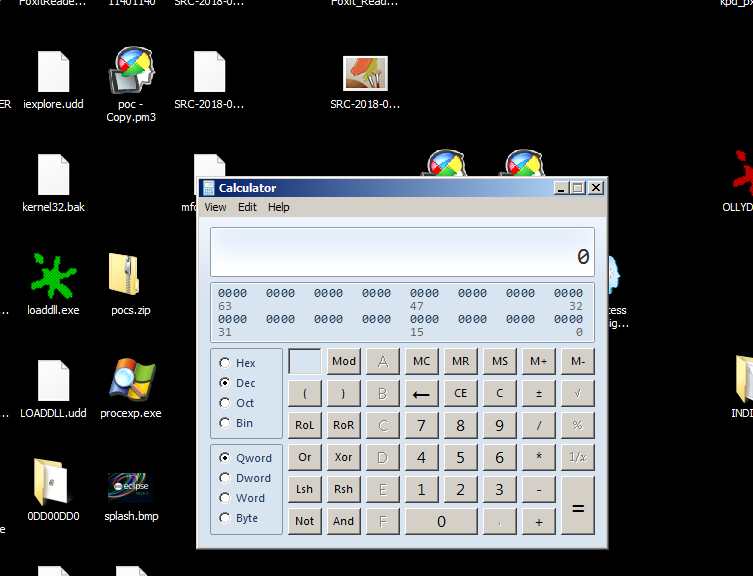

Теперь в **WINDBG** я делаю **BREAK**, чтобы остановить отладчик.

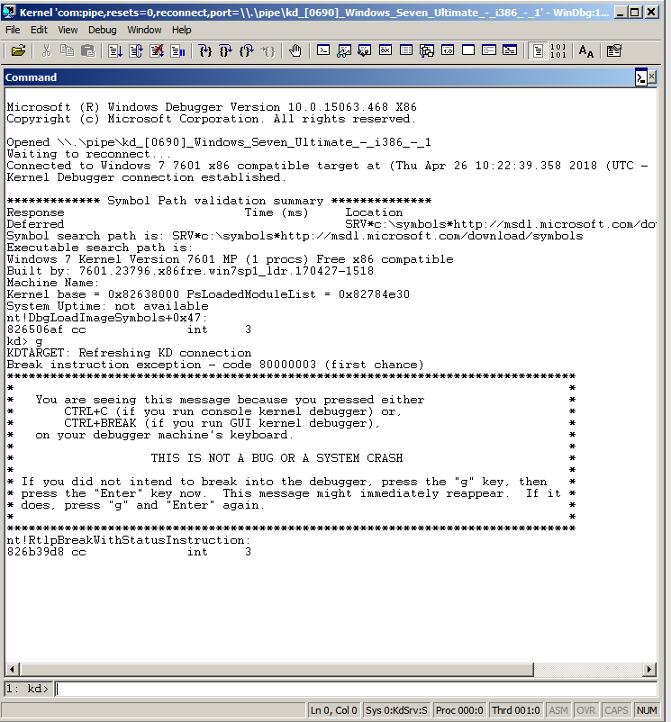

Давайте изменим контекст процесса на процесс **CALC**.

**!PROCESS 0 0**

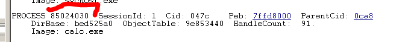

**.PROCESS /I 85024030**

И затем нажимаем **G.**

Чтобы узнать текущий процесс нужна следующая команда.

**!PROCESS -1 0**

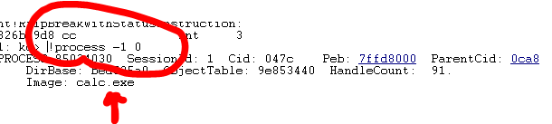

Мы уже находимся в процессе **CALC**.

Давайте посмотрим значение регистра **CR3** с помощью команды

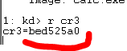

Помните, что эта команда работает только во время отладки ядра. В пользовательском режиме она не работает.

Хорошо. **CR3** содержит физический адрес **PAGE** **DIRECTORY** **TABLE** \(мы увидим, что в нем есть агрегация, если **PAE** включен\)

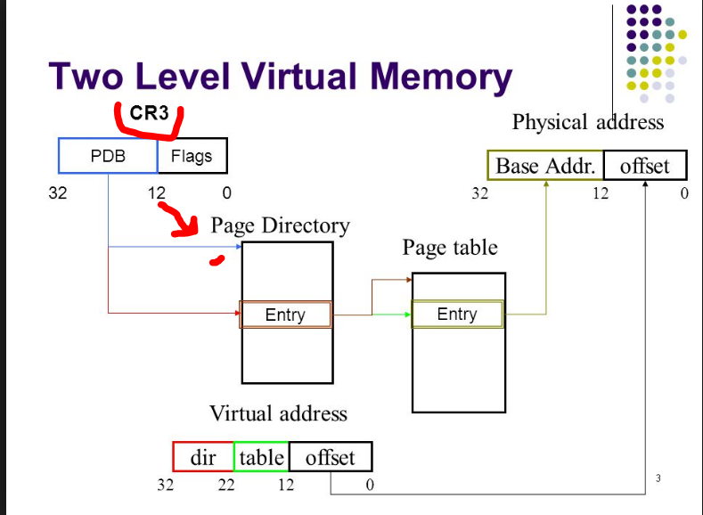

Мы находимся в начальной части рисунка. Идея в том, что **CR3** указывает нам на физический адрес таблицы **PAGE** **DIRECTORY** **TABLE** \(**PDT**\), что является первым шагом. Это таблица с записями, каждая из которых называется **PAGE** **DIRECTORY** **ENTRY** \(**PDE**\) ,

Мы видим, что команда **!PROCESS** в **DIRBASE** показывает нам ту же информацию, т.е. то же значение **CR3**.

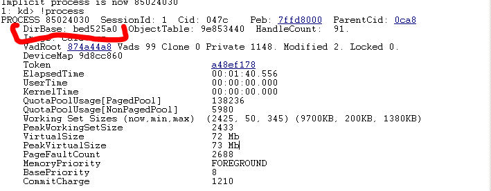

Это также можно увидеть через **EPROCESS.**

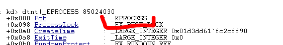

Так как он находится в **KPROCESS** и имеет тот же адрес, то мы дампим **KPROCESS.**

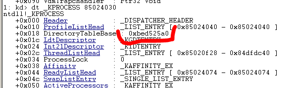

И здесь отладчик говорит нам, что физический адрес **0xBED525A0** такой же.

Если я использую команду **DD**, чтобы посмотреть этот адрес памяти.

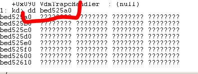

Здесь нет ничего, что должно быть таблицей. Проблема в том, что команда **DD** служит только для отображения виртуальных адресов, а не физических. Для этого используется команда **!DD**используется с восклицательным знаком.

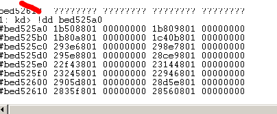

Теперь у нас все верно.

Мы собираемся предположить, что **PAE** включен. Это можно проверить вот так.

[https://es.wikipedia.org/wiki/Extensión\_de\_dirección\_física](https://es.wikipedia.org/wiki/Extensi%C3%B3n_de_direcci%C3%B3n_f%C3%ADsica)

Это проверяется, так.

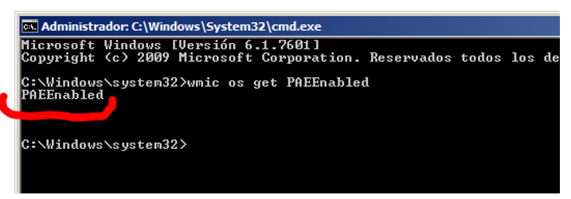

Есть еще одна таблица \(когда включен **PAE**\), которая не показывается здесь, которая является таблицей **PDPT**, которая является таблицей, каждая запись которой указывает на **PAGE** **DIRECTORY**, подобна промежуточной таблице между **CR3** и **PAGE** **DIRECTORY**, и это ничего не меняет.

Смотря таблицу **PAGE** **DIRECTORY** и просматривая записи, там видно, что каждая запись указывает на другую таблицу с именем **PAGE** **TABLE**.

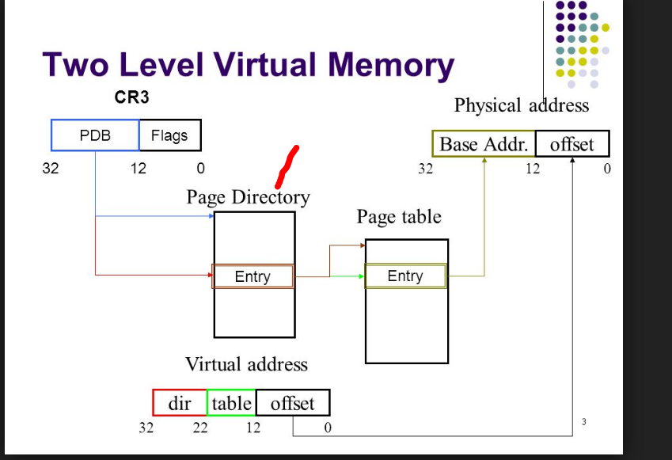

Таким образом, каждая **PAGE** **DIRECTORY** содержит **1024** записи, каждая из которых \(называемая **PDE**\) указывает на **PAGE** **TABLE** \(**PT\)**

Если я использую команду **!DQ** со значением **CR3**, я увижу промежуточную таблицу **PDPT**, в которой есть **4** записи, и каждая запись состоит из **8** байтов, а содержимое указывает на **PDT**. \(Хотя это зависит от упущенной детали, которую я объясню чуть позже. В этом случае берется первая из **4** записей **PDPT**, и поэтому мы следуем за туториалом, чтобы найти содержимое этой первой записи, и это содержимое является базой **PDT**, но **PDPT** имеет четыре записи, и вы можете использовать другие записи. Позже я объясню, в каком случае\)

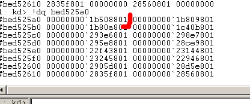

Так как уже первая запись **PDPT** имеет значение на моей машине **0x1B508801**, с помощью которого мы указываем на базу **PT** \(мы должны обнулить младшие **12** бит этого адреса\), после этого у нас есть базовый физический адрес **PT**.\)

Мне показывается двоичный код.

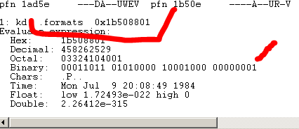

00011011 01010000 1000 – **1000 00000001**

Поскольку **12** нижних байт являются смещением, я заменяю их нулями, чтобы они могли дать мне базу.

00011011010100001000**000000000000**

Переводим это значение в **HEX** и получаем значение **0x1B508000**, что будет являться базой **PDT.**

Теперь, когда мы получили физический адрес базы **PDT** мы делаем **.RELOAD/F**, чтобы отладчик загрузил все модули.

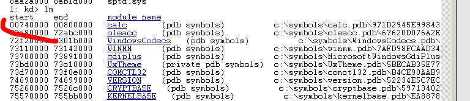

Затем с помощью **LM** я вижу, что база исполняемого файла **CALC** равна **0x740000**, поэтому это будет заголовок исполняемого файла. Давайте посмотрим.

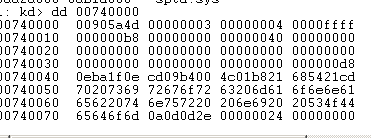

Это типичный заголовок с **MZ** и т.д.

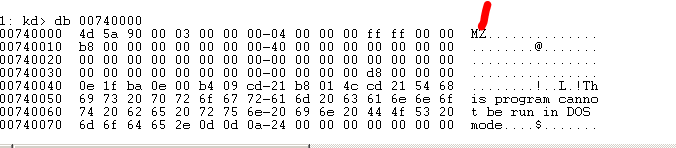

Давайте возьмем этот адрес **0x740000.** Мы попытаемся найти физический адрес.

Виртуальный адрес, такой как **0x740000**, можно разделить на.

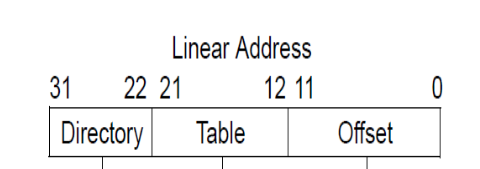

Итак, мы перевели его в двоичный вид.

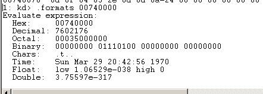

00000000011101000000**000000000000**

Отделим последние **12** байтов, затем две части по **9** и одна из **2.** Это дает нам **12** + **9** + **9** + **2** = **32** бита
00-000000011- 101000000 – **000000000000**

Хорошо. **12** младших битов - это **12** младших бит физического адреса или **BYTE** **INDEX** \(**000000000000**\)

Следующие **9** являются индексом для **PAGE** **TABLE** или **PAGE** **TABLE** **INDEX** \(**101000000**\)

Следующие **9** являются индексом для **PAGE** **DIRECTORY** или **PAGE** **DIRECTORY** **INDEX** \(**000000011**\)

Здесь необходимо было добавить, что эти два старших байта отмечают, что будет использоваться номер записи из четырех, которые есть в **PDPT**. В этом случае эти два байта равны нулю, поэтому используется первая запись **PDPT,** поэтому не возникла проблема,

* **PDPT** **INDEX** = **0x0**
* **Page** **DIRECTORY** **Index** = 000000011 = **0x3**
* **PAGE TABLE INDEX** = 101000000 = **0x140**
* **BYTE INDEX** = **000000000000** = **0x0**

Мы помним, что **0x1B508000** была базой **PDT**, поскольку каждая запись имеет **8** байтов. Если я хочу найти адрес третьей записи, поскольку индекс равен **0x3,** я делаю так.

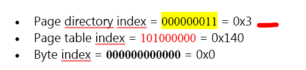

**HEX\(0x1B508000 + 0x3 \* 8\)**

Я получаю физический адрес третьей записи.

**0x1B508018**

Это **PTE.** Мы знаем, что его содержимое указывает на **PT.** Давайте посмотрим содержимое.

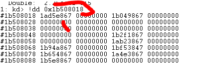

По этому адресу мы должны удалить младшие **12** бит и дополнить его нулями, чтобы удалить базу.

**1AD5E867**

00011010 11010101 1110**1000 01100111**

База будет равна.

00011010 11010101 1110**0000 00000000**

Если мы соединим значения.

00011010110101011110**000000000000**

Поэтому база **PT** моего адреса равна.

**0x1AD5E000**

Я делаю так же, как и в другой таблице. Я ищу индекс **PT**, который в моем случае был равен **0x140**, так как каждая запись имеет длину **8** байт, умноженную на **8**, и я добавляю базу.

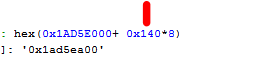

Это дает мне значение **0x1AD5EA00**, что является **PTE.** Это содержимое является базовым адресом.

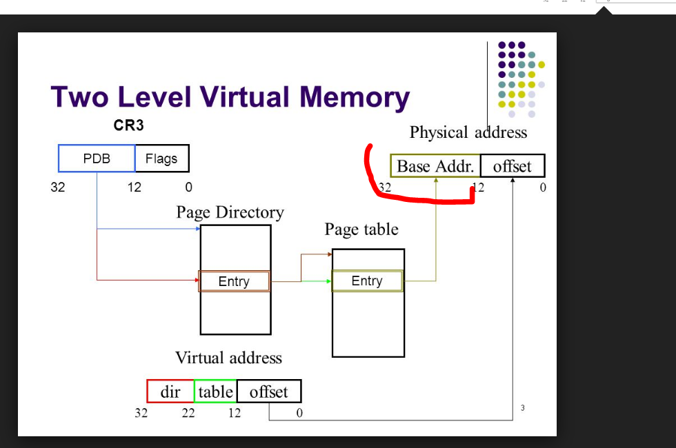

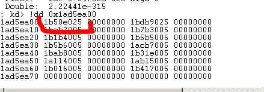

Здесь мы видим в поле, что физический адрес состоит из базового адреса + смещения.

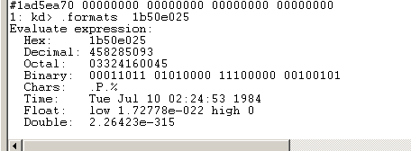

Теперь мы должны заменить младшие **12** байтов байтовым индексом искомого адреса.

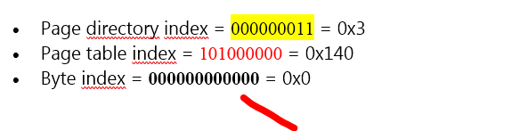

00011011 01010000 1110**0000 00100101**

Получаем

00011011010100001110**0000 00000000**

Что является

**0x1B50E000,** что равно физическому или реальному адресу, соответствующему виртуальному адресу **0x740000.**

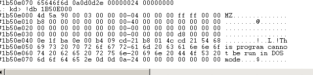

Если я сравню с содержанием виртуального адреса

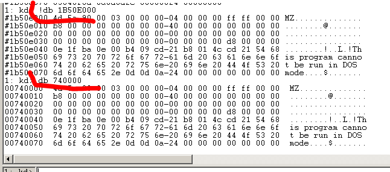

Мы видим, что байты похожи.

Теперь есть более простой способ получить физический адрес по виртуальному адресу. Это можно сделать в **WINDBG** с помощью команды **!PTE**.

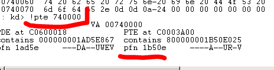

Это число **PFN**, которое нужно умножить на **0x1000.**

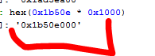

****
К этому я должен добавить байтовый индекс, т.е. последние **12** бит моего адреса. В моем случае это **0**.

Поэтому я уже получил физический адрес таким же образом, как и раньше. Но идея состояла в том, чтобы знать таблицы, потому что для работы в ядре вы должны знать все.

Хорошо. Проглотите горькую пилюлю.

**=======================================================
Автор текста: Рикардо Нарваха** - **Ricardo** **Narvaja** \(**@ricnar456**\)
Перевод на русский с испанского: **Яша\_Добрый\_Хакер\(Ростовский фанат Нарвахи\).**
Перевод специально для форума системного и низкоуровневого программирования — **WASM.IN
06.01.2018
Версия 1.0**
