# Часть 64

Реверсинг задачи по SCADA

В группе телеграмм мы поставили перед собой задачу, которая относится к реверсингу следующего **CVE**, чтобы практиковаться с реальным программным обеспечением.

**CVE-2013-0657**

[https://ics-cert.us-cert.gov/advisories/ICSA-13-018-01](https://ics-cert.us-cert.gov/advisories/ICSA-13-018-01)

Здесь есть ссылка. Все версии и **9** и **10** являются уязвимыми, за исключением тех версий, к которым был применен патч.

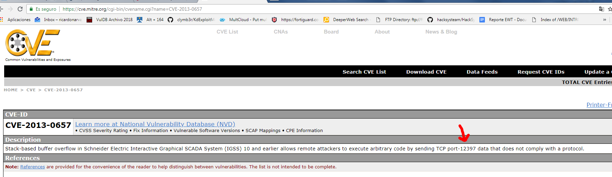

Уязвимую версию **9** можно загрузить отсюда:

[**HTTPS://DRIVE.GOOGLE.COM/OPEN?ID=1V4DAVXWD6FYSMVK4UKRG-SHCJNXI55XN**](https://drive.google.com/OPEN?ID=1V4DAVXWD6FYSMVK4UKRG-SHCJNXI55XN)

А патч отсюда:

[**HTTP://IGSS.SCHNEIDER-ELECTRIC.COM/IGSS/IGSSUPDATES/V90/PROGUPDATESV90.ZIP**](http://igss.schneider-electric.com/IGSS/IGSSUPDATES/V90/PROGUPDATESV90.ZIP)

Это исполняемый файл, который прослушивает порт **TCP 12397**. Если мы установим программу, мы увидим, какой исполняемый файл прослушивает этот порт.

Когда я устанавливаю программу, я сначала выбираю опцию **DEMO**, а затем **FREE FOR 50**. С этими настройками я могу запустить программу нормально. И когда я нажимаю на кнопку **START**, программа начинает работать. Если она не запускается, то можно удалить и создать новый проект с меньшим количеством элементов, так как программа даёт до **50** бесплатных элементов. Но здесь я её запускаю.

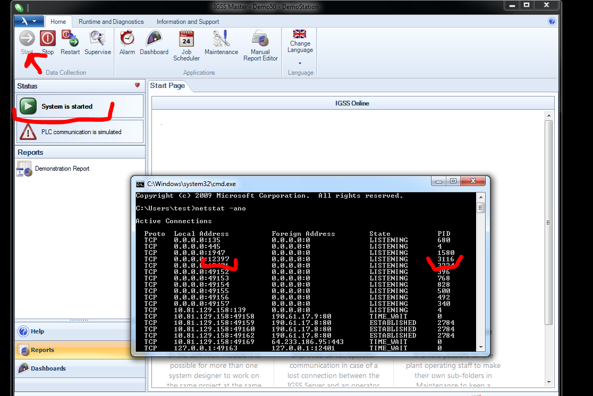

Мы видим, что процесс на моей машине имеет **PID** равный **3116**.

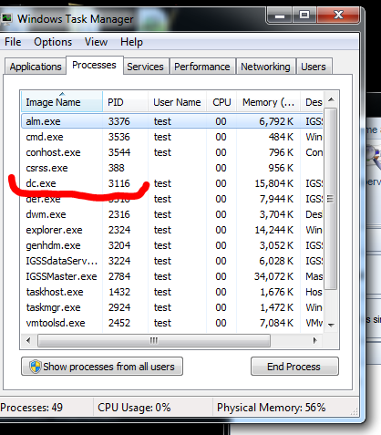

Для того, чтобы все хорошо работало нужно перейти на **DESIGN AND SETUP**, удалить старый проект и создать новый с **50** элементами или меньше и запустить программу. С этими настройками будет то, что нужно.

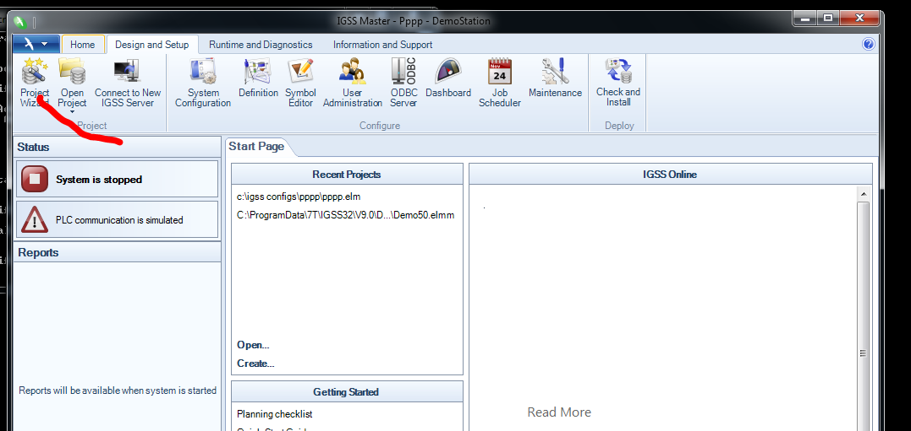

Мы уже примерно понимаем, что происходит. Давайте сделаем **DIFF** между двумя **DC.EXE**. Оригинальный в моем случае это версия:

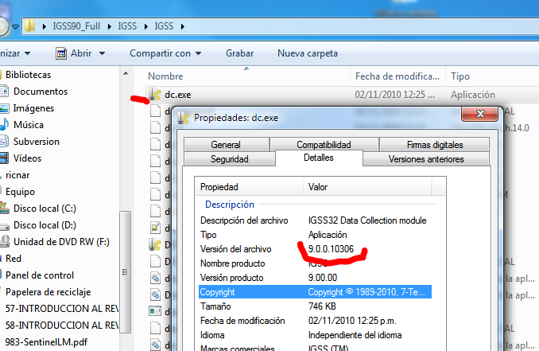

И та версия, к которой применен патч:

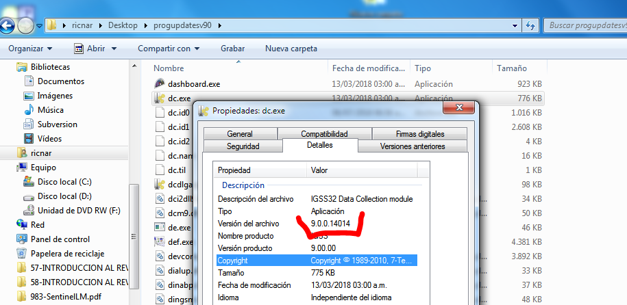

При терпеливом осмотре видно, что в **DC.EXE** есть много измененных функций. Я не собираюсь анализировать их одну за другой, но здесь есть переполнение стека. Стрелка указывает на патч.

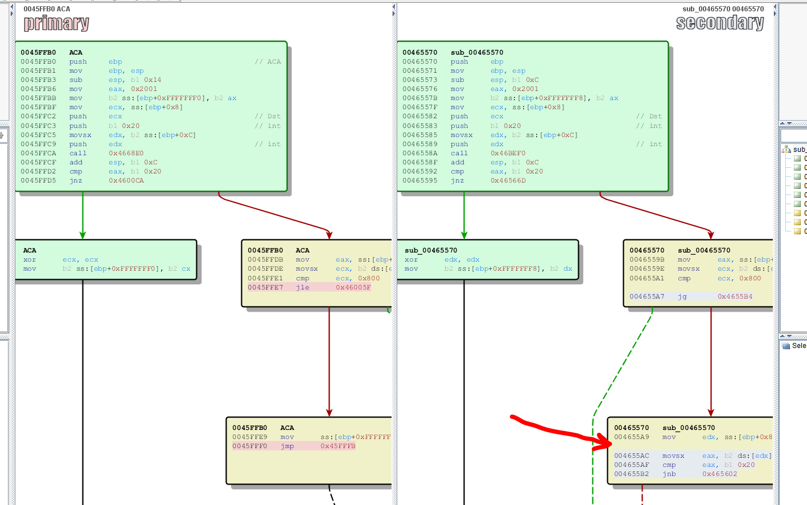

Я ищу среди импортируемых функций **RECV**. Мы видим, что она находится здесь, и видно, что она вызывается из одного места.

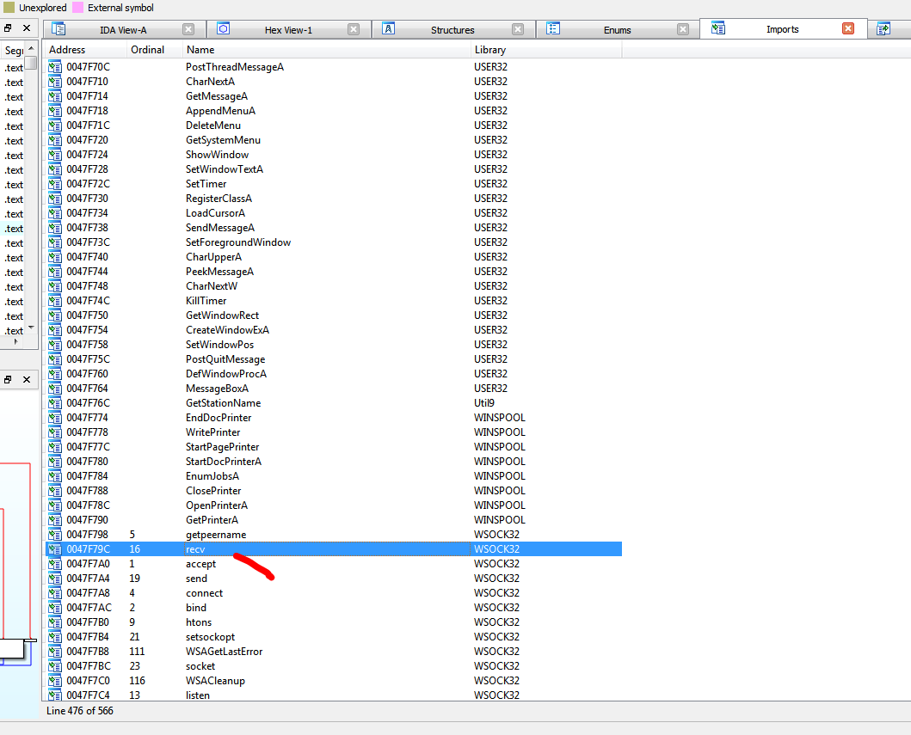

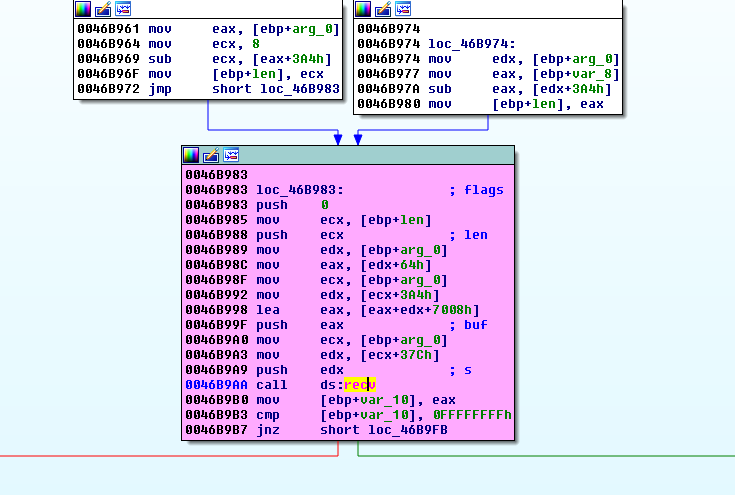

Я ищу **32**-х битный удаленный сервер **IDA** и копирую его на машину, на которую я установил программу, и запускаю его как администратор.

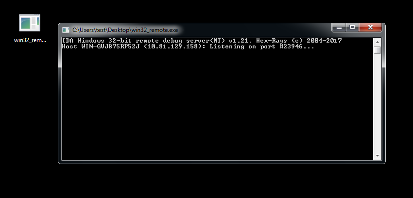

В **IDA** я меняю отладчик на **REMOTE WINDOWS DEBUGGER**.

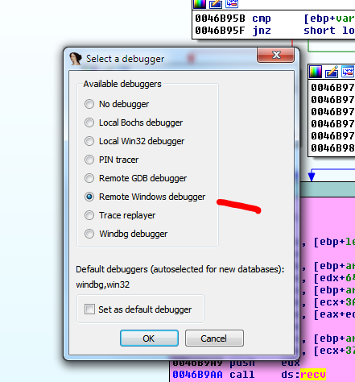

И настраиваю опции процесса \(**PROCESS OPTIONS**\) указывая **IP** адрес машины и её порт.

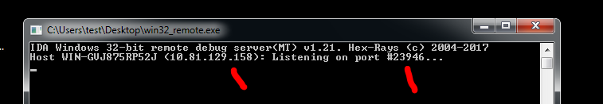

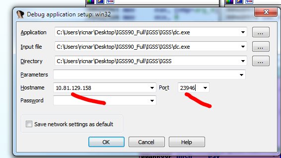

Когда мы идем в **ATTACH PROCESS**, мы получаем список процессов на целевой машине если соединение между ними возможно \(нет брандмауэров или блокировок и т.д.\).

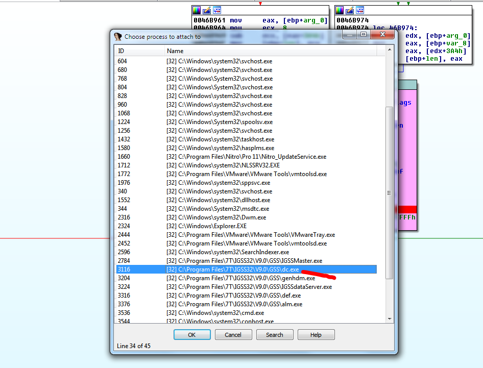

Здесь находится **DC.EXE**. Мы выбираем его и присоединяемся к нему.
Чтобы проверить, что это действительно функция **RECV**, которую мы нашли, я поставил на эту функцию **BP**.

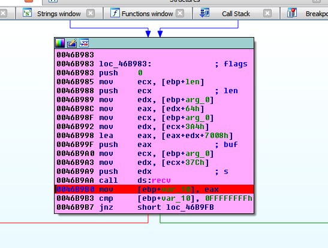

Я создаю скрипт **PYTHON**, который отправляет данные на порт **12397**, который прослушивает **DC.EXE**. Я отправляю в порт вручную **300** букв **A** просто для проверки, проверить произойдет ли остановка.

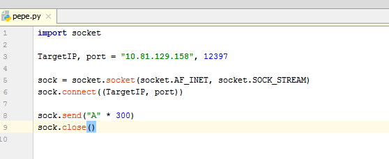

Мы видим, что отладчик останавливается.

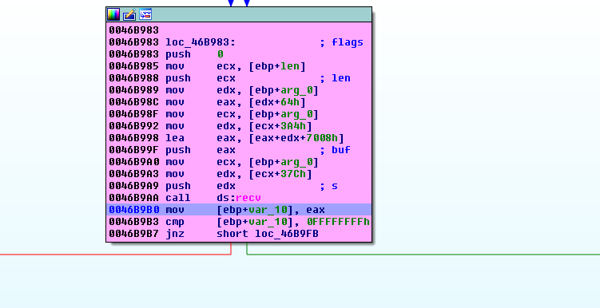

Мы видим, что в первый раз, отладчик останавливается. Программа получает только восемь байтов, поэтому очевидно, что будет ещё остановка на функции.

Если я нажимаю **RUN** без реверсинга много раз, я вижу, что пакет доходит до уязвимой функции.

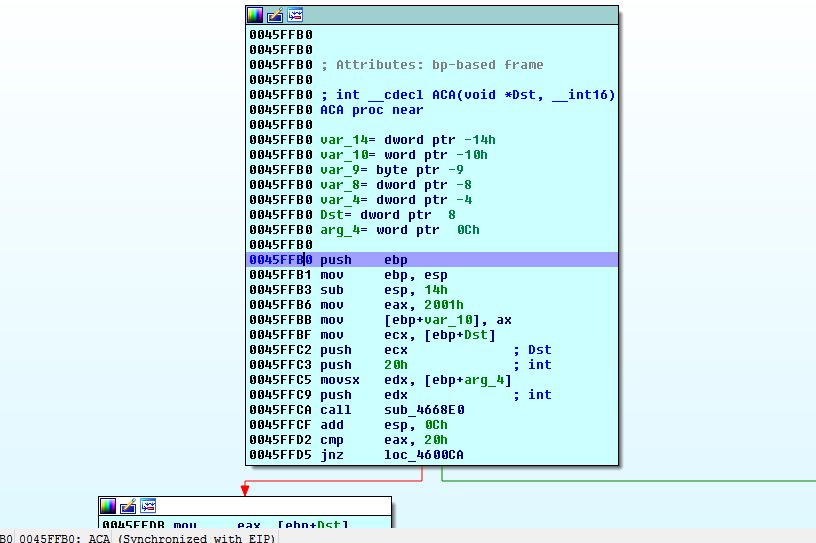

Возможно только с этим программа не будет проходить по уязвимому пути. Программа постоянно останавливается на уязвимой функции. Это место нужно хорошо проанализировать.

У нас нет символом. У нас нет ничего. Посмотрим куда мы сможем с этим добраться.

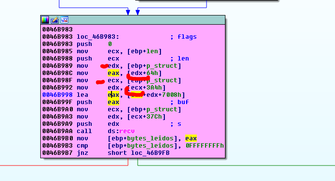

Мы видим, что есть указатель на структуру в этой переменной, которая называется **P\_STRUCT**.
Каждый раз, когда значение читается, поле в структуре всегда доступно путем добавления смещения к этому адресу.

Мы видим, что программа имеет большое смещение. Мы видим значения **0x64**, **0x3A4**, **0x37C**. Поэтому мы создадим структуру длиной **0x500** байт. Если нам понадобится размер больше, то мы увеличим ее. Если она меньше, то ничего страшного.

Я создаю структуру с одним **DWORD** и расширяю её до **0x500**.

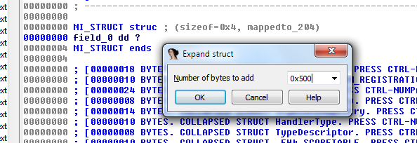

Это выглядит так. Поскольку уже было **4** байта плюс **0x500** в общей сложности мы получим **0x504** байт.

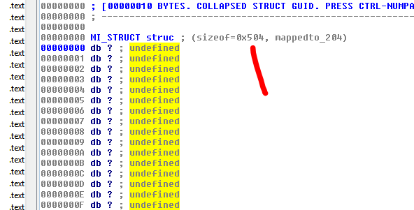

Я переименую структуру, чтобы получилось такое имя.

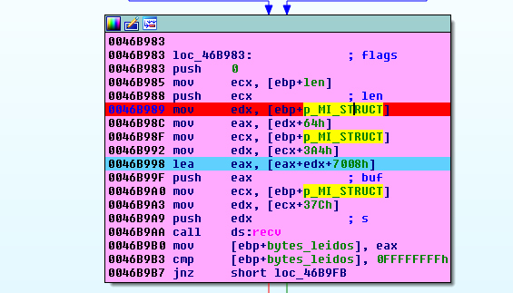

Мы видим, что **VAR\_4** это флаг, который может быть **0** или **1**. Есть место, где в это значение помещается значение **1**.

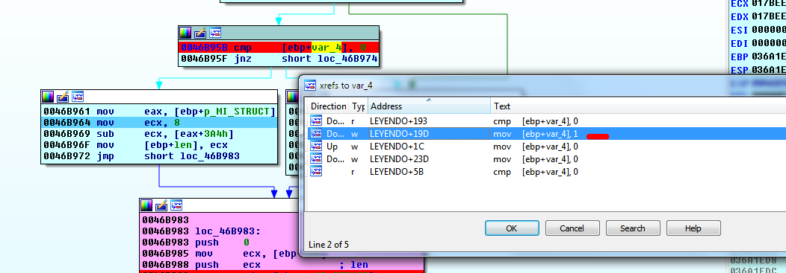

И в зависимости от **0** или **1** прежде чем вызвать **RECV** программа идет на правый блок или на левый.

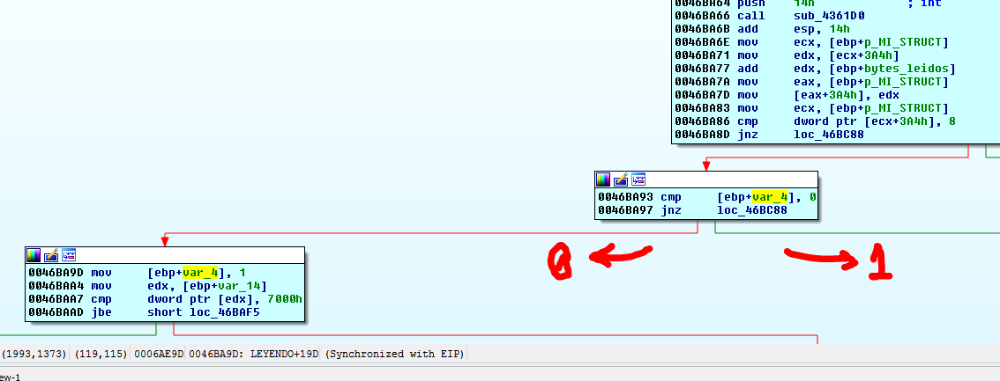

Мы видим, что программа сравнивает значение с **0**. Если значение равно нулю, программа изменяет его на **1**, и в следующий раз программа проходит по пути **1**. Поэтому мы предполагаем, что начальное состояние флага равно **0**, и программа проходит через блок и устанавливается флаг в **1**.

Таким образом, при первом пакете программа пройдет здесь. Перед **RECV**. Она поместит в регистр **ECX** значение **8**, что равно длине. Перед этим вычитается значение поля **0x3A4** из структуры, которое в начале равно **0**, так как мы уже увидели, что длина первого пакета должна быть **8**.

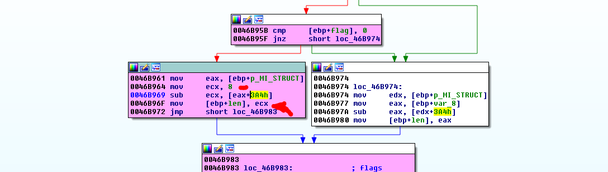

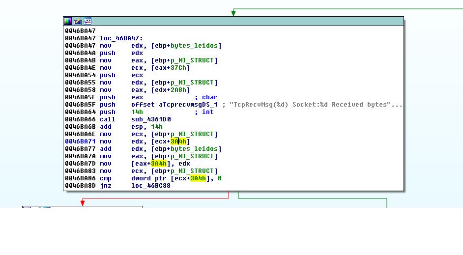

Если я поищу константу **0x3A4**, я вижу, что здесь сохраняется сумма байтов, поэтому я переименую её.

Я иду по структурам до смещения **0x3A4** той структуры которую я создал и нажимаю **D** до тех пор пока не появится **DWORD** и переименовываю поле.

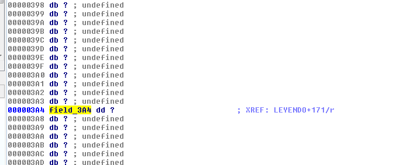

Я могу искать смещение.

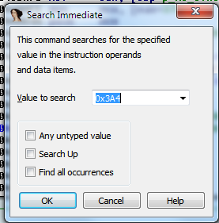

И затем с помощью **CTRL**+**I** я ищу все вхождения этого смещения и переименовываю в то же самое имя.

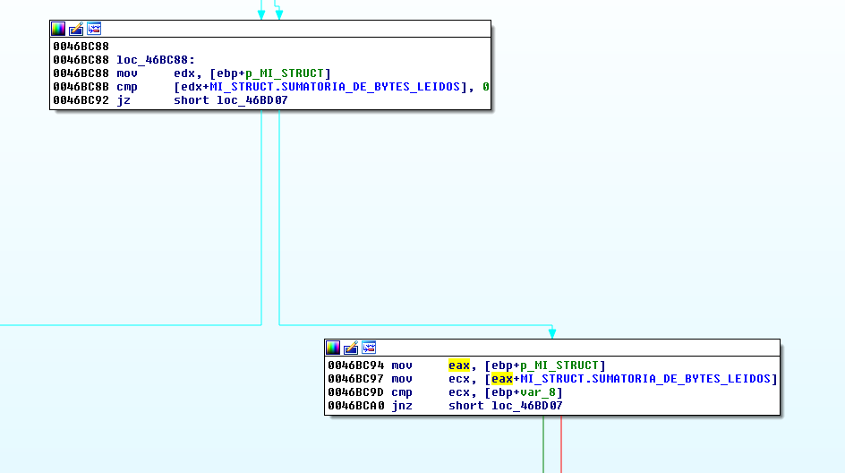

Я могу начать заново с начала функции.

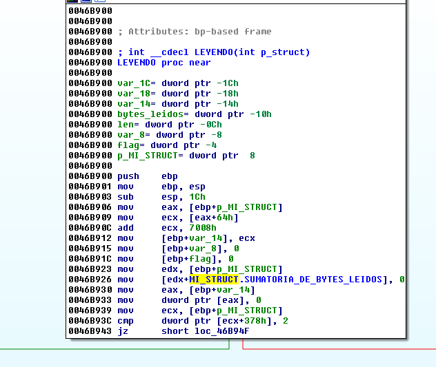

Теперь выглядит лучше. По крайней мере, в той области функции, над которой я работаю.

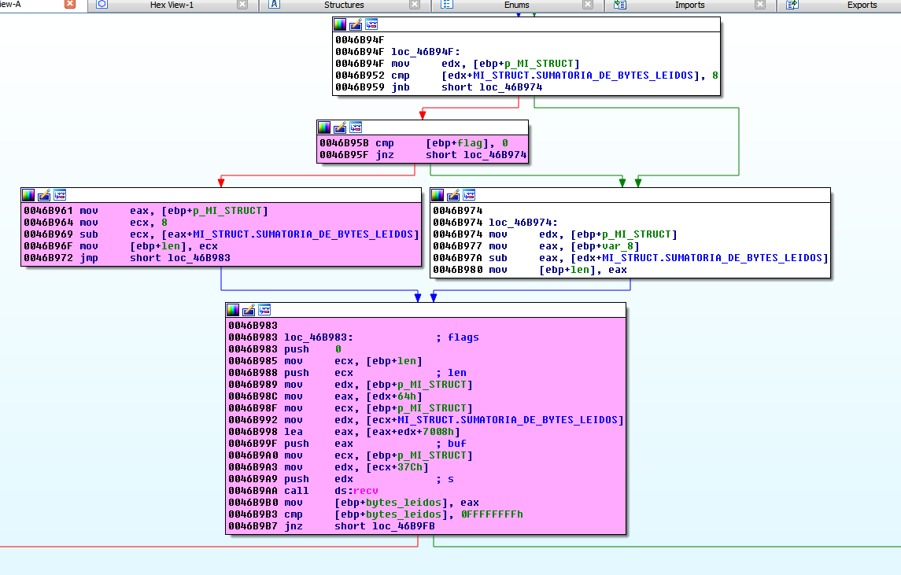

Также мы видим, что во второй раз, когда программа пройдет через первый блок предыдущего изображения, уже прочитано **8** байт и программа пойдет по правому пути.

Мы видим также, что в поле **0x64** есть указатель на вторую структуру, которая имеет буфер внутри со смещением **0x7008** и который отчитывается от **EDX**, который на данный момент равен нулю, поскольку это сумма прочитанных байтов. В начале она равна нулю.

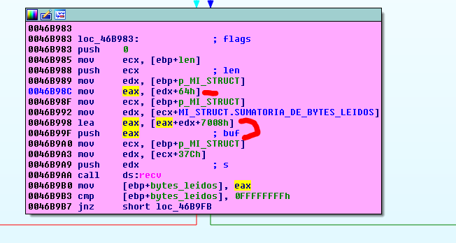

Я создам следующую структуру как минимум **0x10000** байт. Не важно если будет больше.

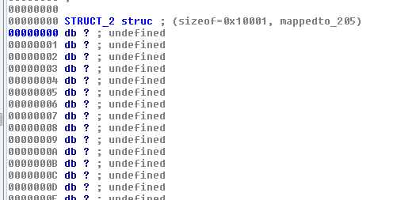

По смещению **0x64** структуры **MI\_STRUCT** есть указатель на **STRUCT\_2**, поэтому я иду туда. Я нажимаю **D** до тех пор, пока не будет создан **DWORD**, а затем делаю смещение на структуру.

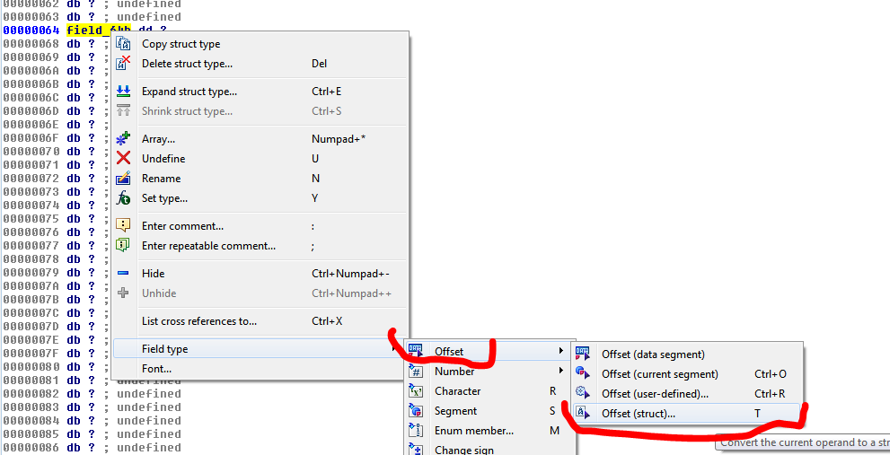

Я выбираю **STRUCT\_2** и оставляю всё так.

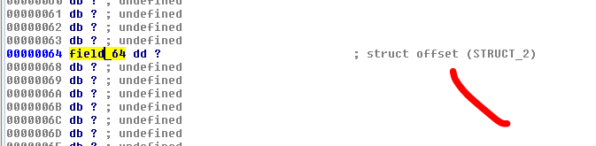

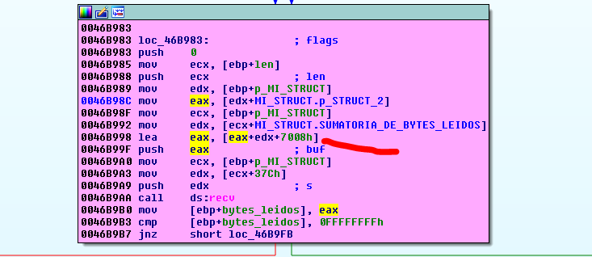

По смещению **0x7008** начинается буфер, где программа будет хранить данные **RECV**. Поскольку это инструкция **LEA**, это не указатель на буфер, но он находится внутри той же самой структуры **STRUCT\_2**.

В структурах я иду по адресу **0x7008** структуры **STRUCT\_2** и создаю буфер.

Я предварительно создам **0x1000** байт.

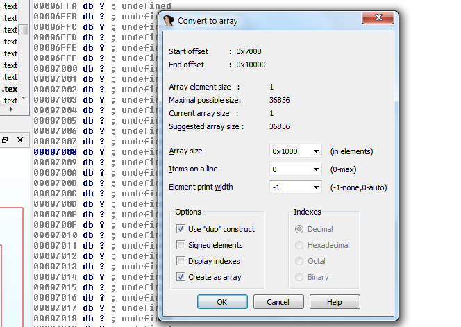

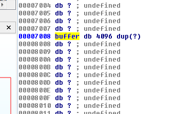

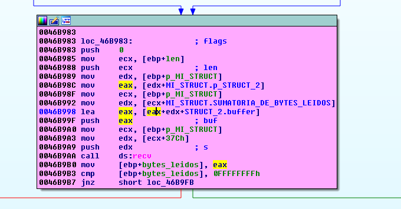

Сейчас смотрится лучше.

Если мы сделаем **SEARCH FOR INMEDIATE VALUE** со значением **0x7008** по всей программе.

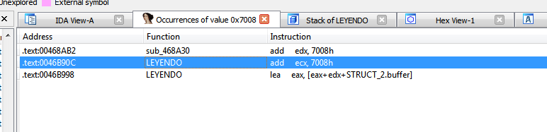

Мы видим, что есть больше двух мест, где программа использует это смещение. Давайте посмотрим.

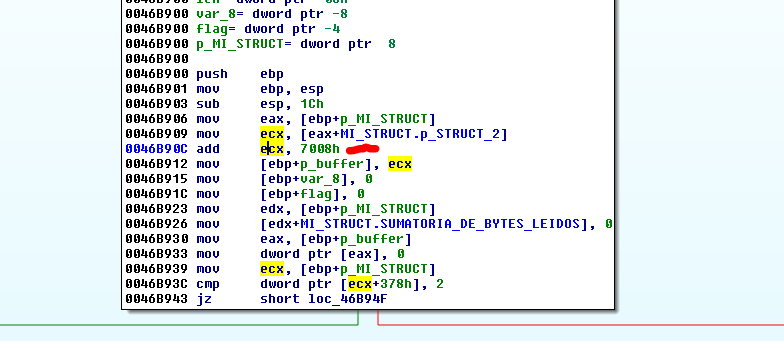

Первое вхождение находится в начале той же функции, которая читает, указатель на **STRUCT\_2** и добавляет **0x7008**, и это дает указатель на буфер, в котором программа сохраняет байты, поэтому я переименую переменную, в которой программа сохраняет, в **P\_BUFFER**.

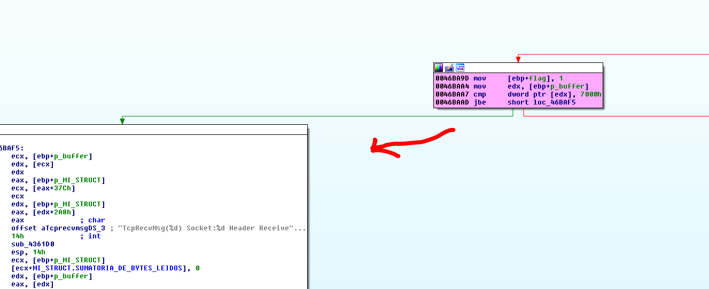

Здесь мы видим, как программа ищет содержимое **P\_BUFFER**, т.е. первый **DWORD** его и это значение должно быть меньше **0x7000**. Мы можем проверить это, поставив **BP** на сравнении.

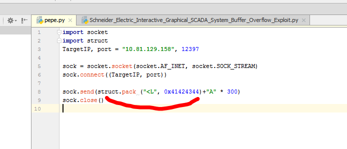

Я изменяю пакет, который я отправляю чтобы первые **4** байта были разными. В этом случае у меня получается значение **0x41424344**.

Таким образом, из **8** байтов, которые программа читает, она проверяет, если первые **4** байта меньше чем **0x7000**.

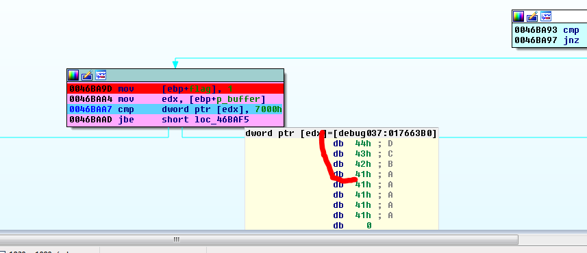

Я поменяю значение в скрипте на **0x2000**.

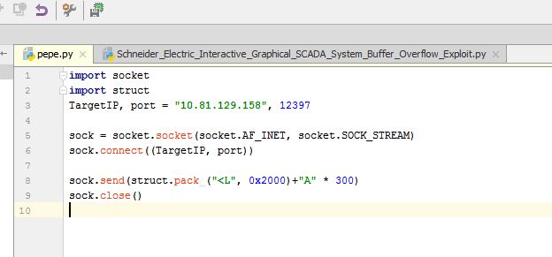

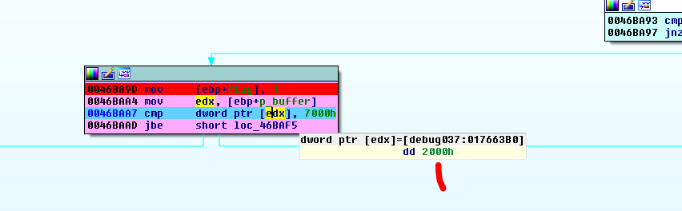

Сейчас то что нужно.

Поэтому мы продолжаем здесь.

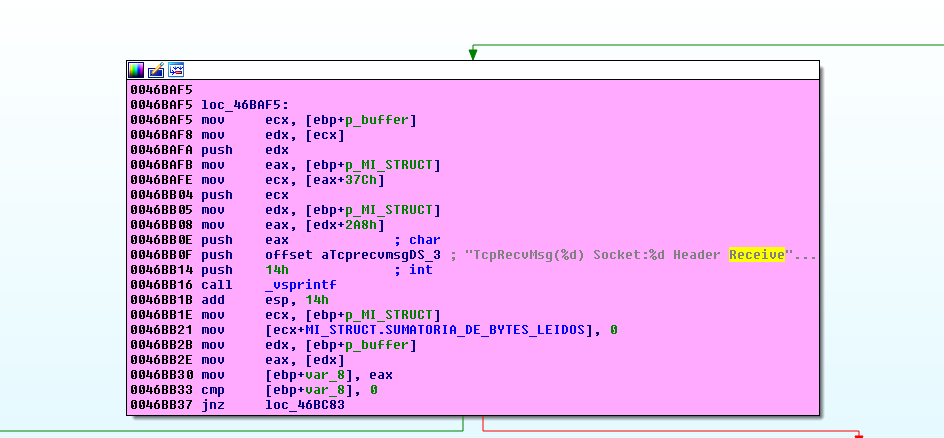

Содержимое P\_BUFFER это 0x2000.

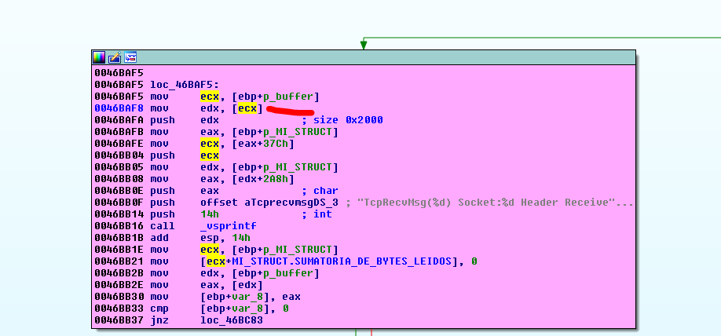

В PRINTF это помогает нам увидеть, что есть три значения, которые будут напечатаны LENGHT, SOCKET и TCPRECVMSG, поэтому мы можем видеть, можем ли мы что-то переименовать с этими именами.

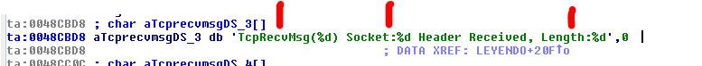

Давайте напомним, что в поле MI\_STRUCT 0X37C находится сокет. Мы переименуем поле.

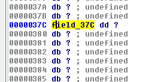

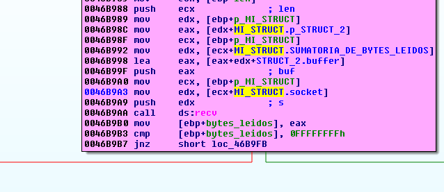

И здесь где я реверсил.

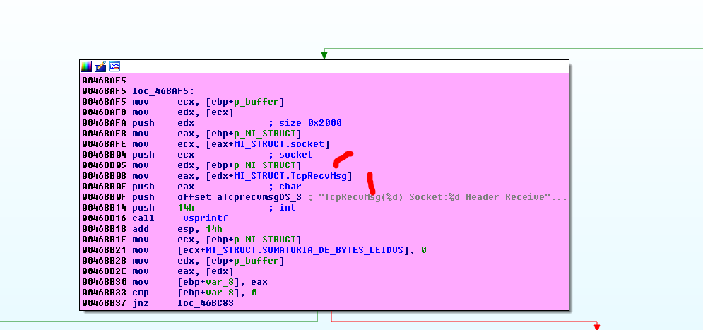

В другое поле я поместил TCPRECVMSG как мне говорил PRINTF. Я ещё не знаю для чего оно используется, но я его идентифицирую.

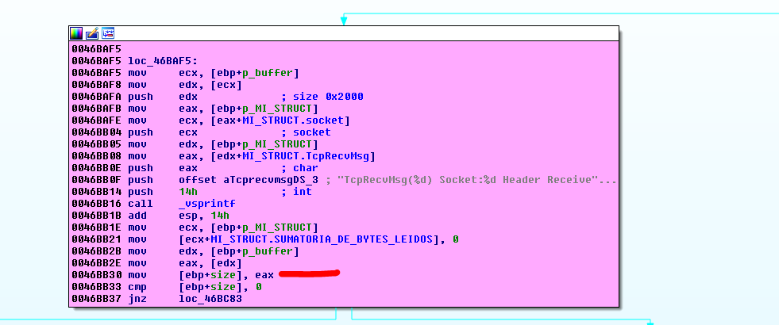

Последнее что делается в этом блоке это читается размер и сохраняется в переменную.

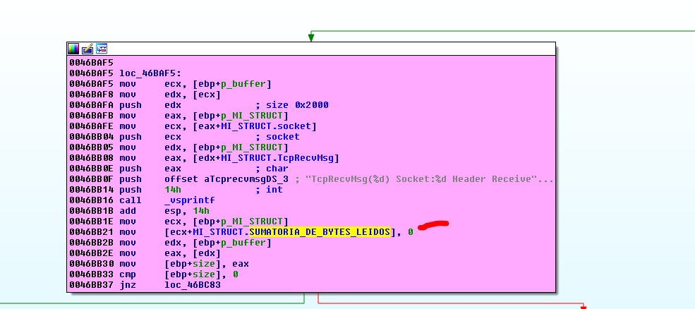

И программа очищает сумму прочитанных байтов и повторяет цикл, возвращаясь назад с размером 0x2000.

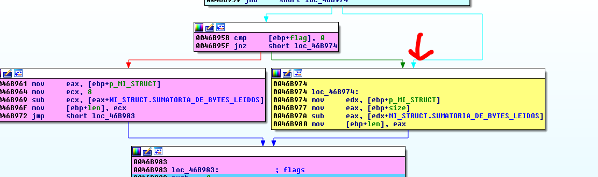

В конце концов программа читает размер 0x2000 и не вычитает ничего поскольку сумма равна нулю, поэтому программа сохраняет 0x2000 в LEN и вызывает заново RECV.

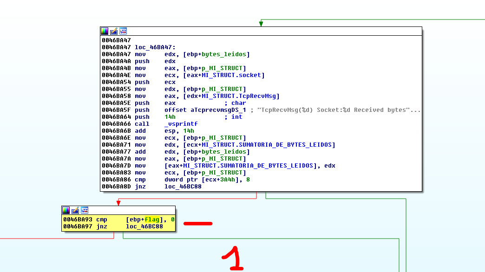

Затем программа приходит к сравнению флага, который сейчас равен 1.

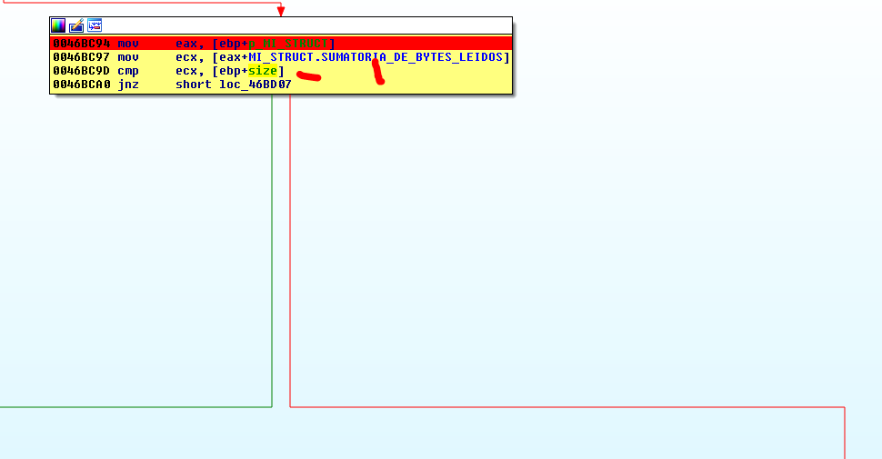

Если программа прочитает 0x2000 байт, которые я ей прислал, поскольку пакет сейчас находится здесь.

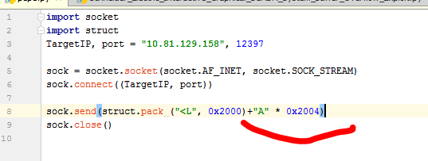

Для того, чтобы программа смогла прочитать спокойно 0x2000 байт во втором вызове RECV.

Если программа прочитала нормально, она выходит из функции LEYENDO. В EAX помещается 0. Если всё в порядке.

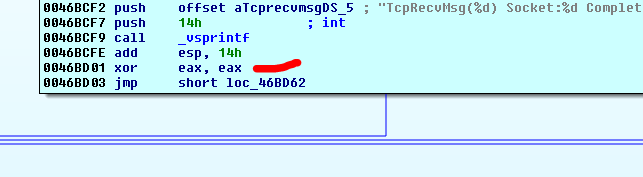

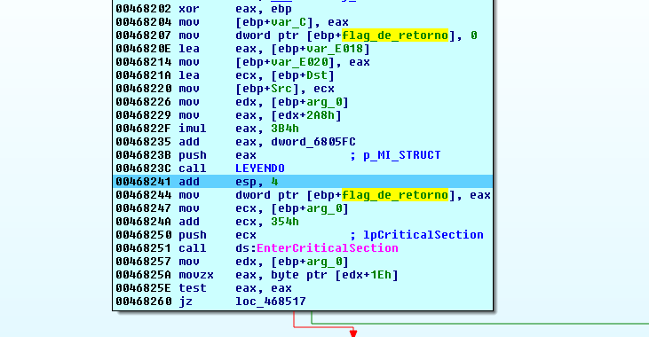

Это другая функция, где читается буфер. Я переименую её в COPY. Я вижу, что программа вызывает её прямо под тем местом где я нахожусь.

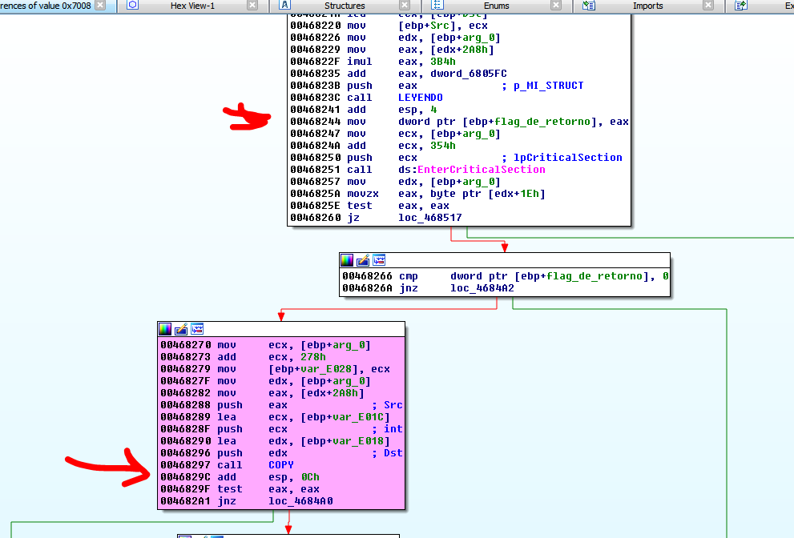

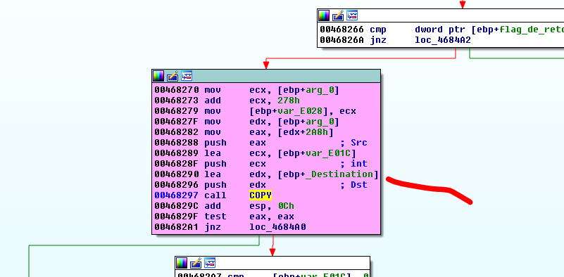

Я вижу, что DESTINATION функции MEMCPY внутри COPY это буфер который я переименую как \_DESTINATION. Туда скопируются мои данные.

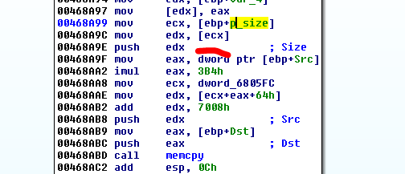

Также мы видим, что здесь это P\_SIZE который передаётся в MEMCPY.

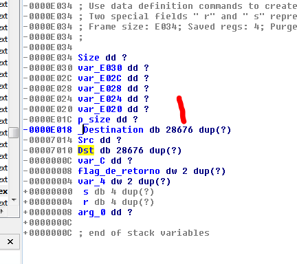

И что буфер \_DESTINATION состоит из 0x7004 байт, поэтому здесь не будет переполнения, потому что если при сравнении размер был меньше чем 0x7000, а если бы он был больше программа шла бы по другому пути где читается только 0x7000 как максимум.

Также мы видим, что есть указатель на \_DESTINATION который сохраняется в другую переменную. Я переименовываю.

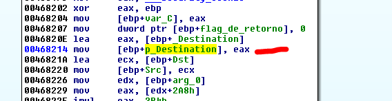

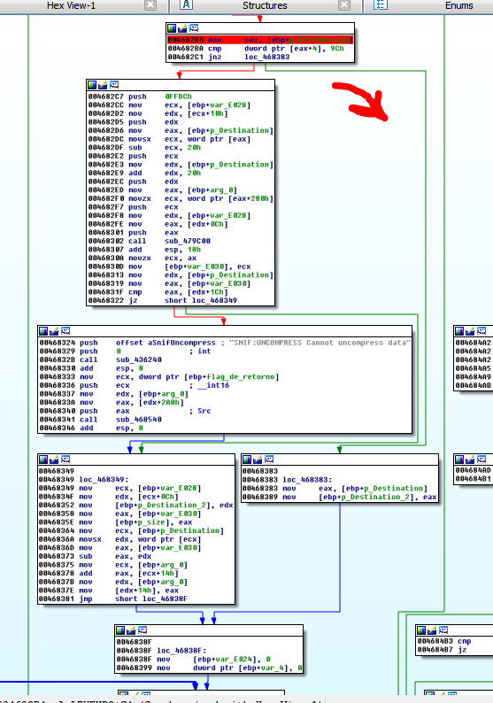

Здесь программа сравнивает один из 0x2000 байт, которые я прислал ей со значением 0x9C, но похоже, что путь слева, связанный с разжатием данных, указанных в строке. Другой путь, похоже, не выбрасывает вас, поэтому я могу подумать, что если байт равен 0x9C, это флаг сжатия, а пока давайте не будем туда заходить и пойдет по правой стороне.

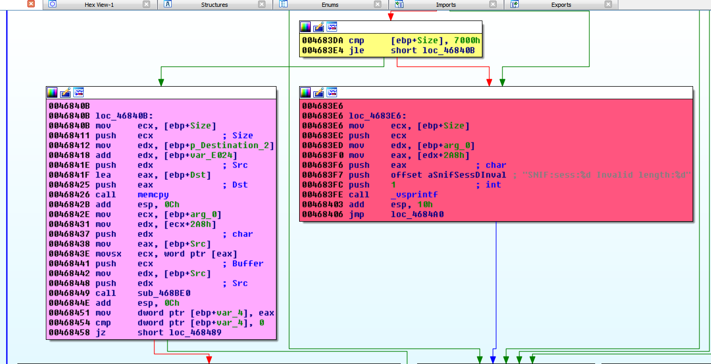

Здесь снова программа сравнивает размер с 0x7000. Нет проблемы со знаком, несмотря на то, что используется JLE, потому что это зависит от количества прочитанных байтов и не может прочитаться столько, для того чтобы там было отрицательное значение, так что там ничего нет.

Мы видим что копируется мой буфер \_DESTINATION в другой, которая вызывает DST, который также по длине равен 0x7004.

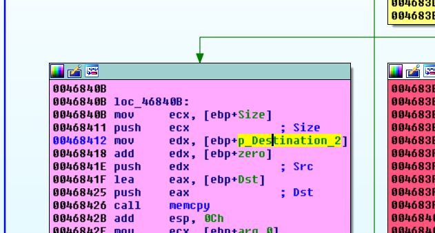

Мы видим, что-то, что называет SRC, на самом деле является указателем на DST, который является местом куда я копирую свои фрукты.

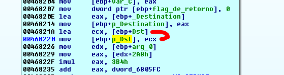

Также здесь есть структура.

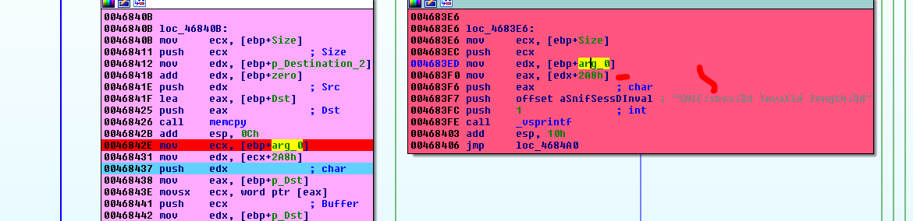

Её поле 0x2A8, по-видимому, является номером сеанса. Поэтому я создам третью структуру и в неё добавлю поле SESIÓN\_NUMBER.

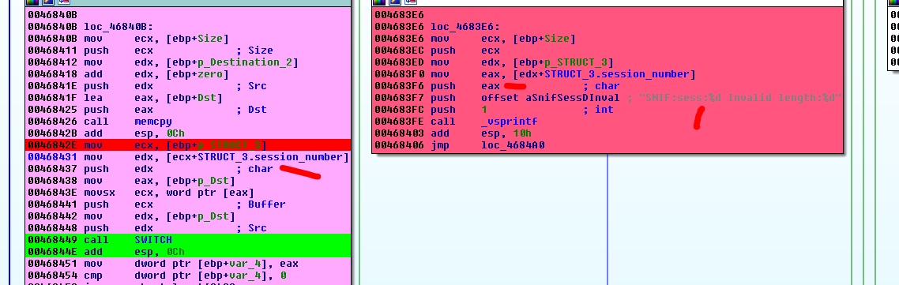

Прежде чем мы продолжим, нужно объяснить одну вещь. Эта задача трудна не только потому, что у нас нет символов, но также и потому, что не существует верного пути между точкой RECV, куда приходит наша информация и уязвимой функцией.

Если я помещу BP на уязвимую функцию, я увижу, что программа постоянно каждые несколько секунд останавливается на ней. По-видимому, как если бы это был поток, отличный от RECV, и нам нужно посмотреть, как вы можете добраться до него, несмотря на это, поэтому без символов и с этим трудом нам придется выжать все возможности статического реверсинга и, наконец динамическое тоже, чтобы помочь нам в том, что на войне и в реверсинге все годится. Мы увидим, как это сделать.

Итак, мы добрались до SWITCH. Затем здесь есть несколько путей. Чтобы посмотреть, какой из них приведет нас к уязвимой функции, давайте немного разберем ее, чтобы попытаться выяснить, откуда взялась эта величина и можем ли мы на нее повлиять.

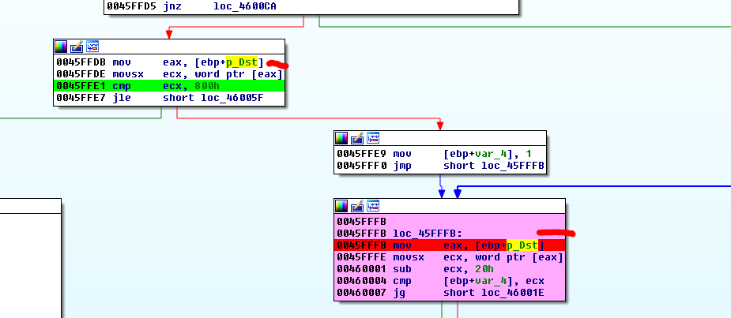

Мы видим, что есть буфер. Я пометил его как P\_DST. Его первый WORD - это значение, которое фильтруется. Мы видели это в патче, если это значение меньше 20, программа вас выбрасываете.

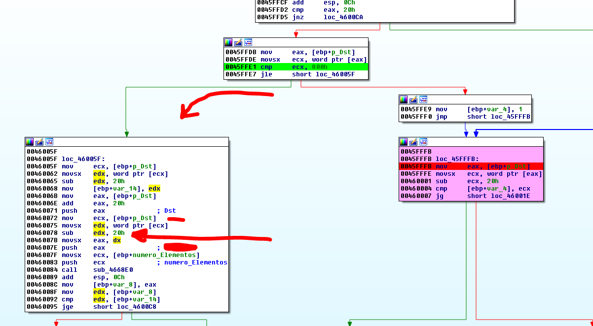

Таким образом, программа оценивает, если значение меньше 0x800, например 0x10, программа идет вправо, затем перечитывает значение и вычитает 0x20, сохраняя результат и используя этот отрицательный размер в качестве размера MEMCPY для стека, который переполняет его.

Чтобы избежать этого, в патче проверяют перед вычитанием, чтобы значение было больше 0x20 перед переходом к процедуре.

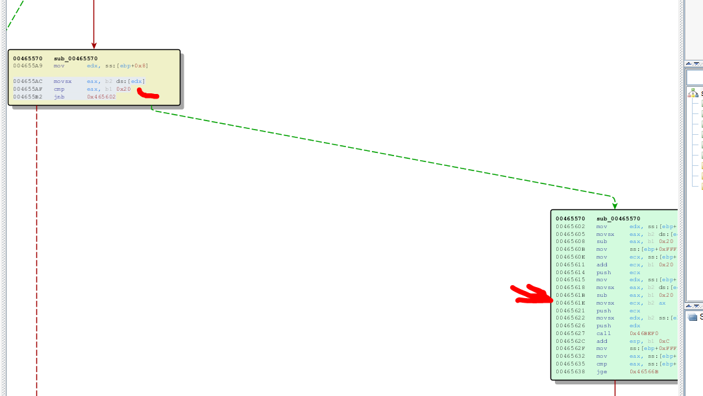

Здесь в пропатченной функции, если она не ниже JNB программа переходит в зону вычитания с 0x20, чтобы она не была отрицательной.

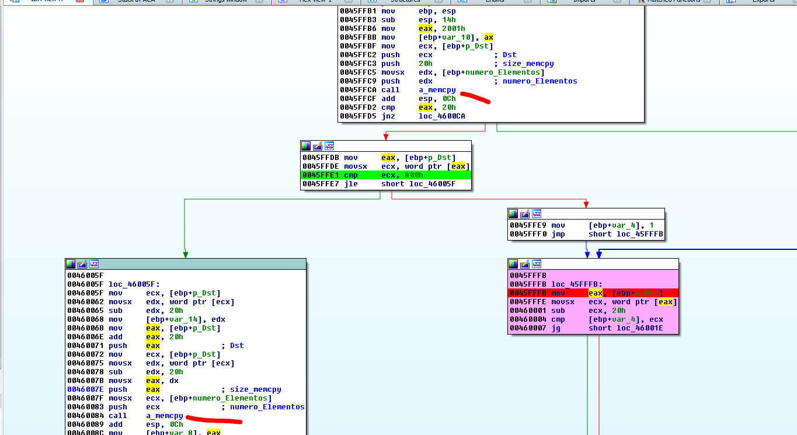

Проблема здесь заключается в том, что в первом вызове MEMCPY функция DESTINATION является P\_DEST, откуда она получает значение, возможно, наше, с размером 0x20, но здесь не ясно, кто является источником MEMCPY, кажется, что программа вычисляет его в той же функции, поэтому нам придется немного проанализировать её, чтобы увидеть, откуда исходит SRC и, конечно, наше значение, которое будет в первом WORD этого буфера, как SRC, так и DESTINATION, так как программа копирует в другие первые 0x20 байтов.

Я уже реверсировал этот блок, так что вы увидите некоторые имена, которые уже установлены, но я объясню немного, что внутри в функции A\_MEMCPY есть еще одна, которая, наконец, переходит к функции MEMCPY.

Здесь это CALL который копирует данные.

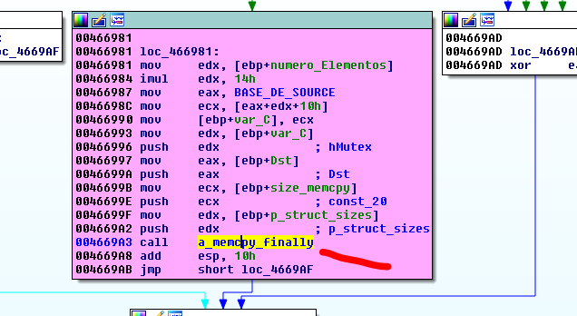

Внутри этой функции.

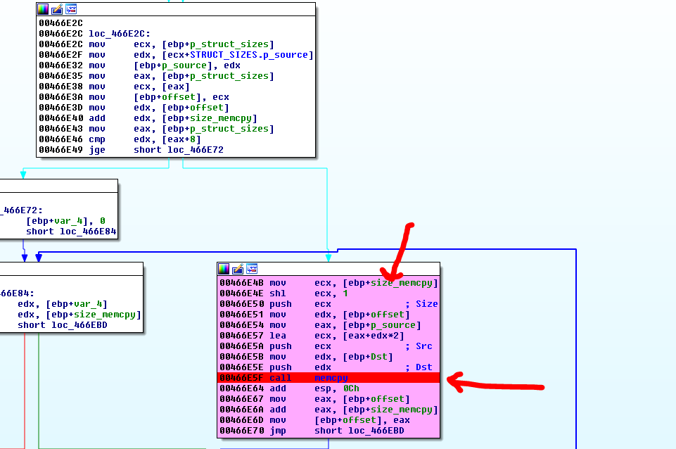

Это было бы предполагаемое место для падения. Если мы передадим значение меньше 0x20, которое будет вычитаться из 0x20 и будет отрицательного размера.

Переименуйте DST как P\_DST, так как это указатель, который указывает на буфер стека, который здесь не виден, но если вы проследуете по ссылкам, чтобы увидеть, откуда он взялся.

Мы видим, что это аргумент этой функции. Если я посмотрю на ссылку.

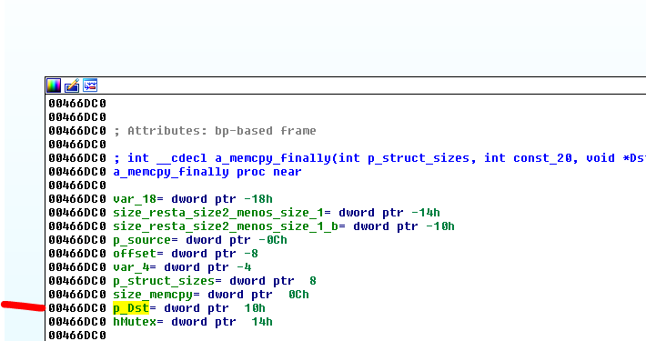

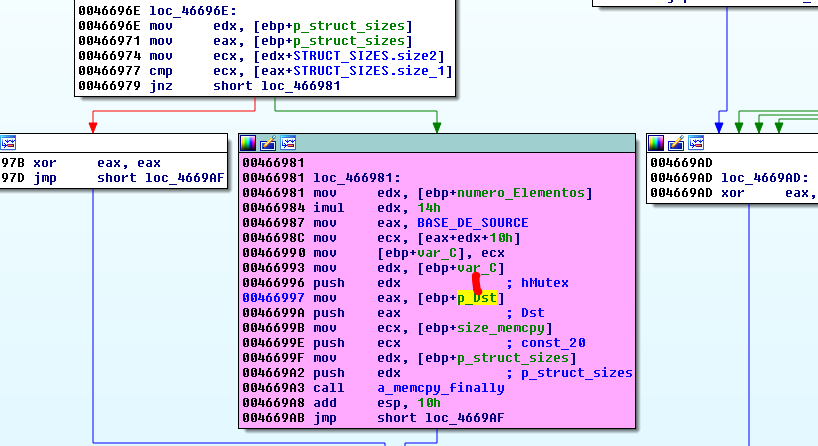

Также это аргумент типа указатель.

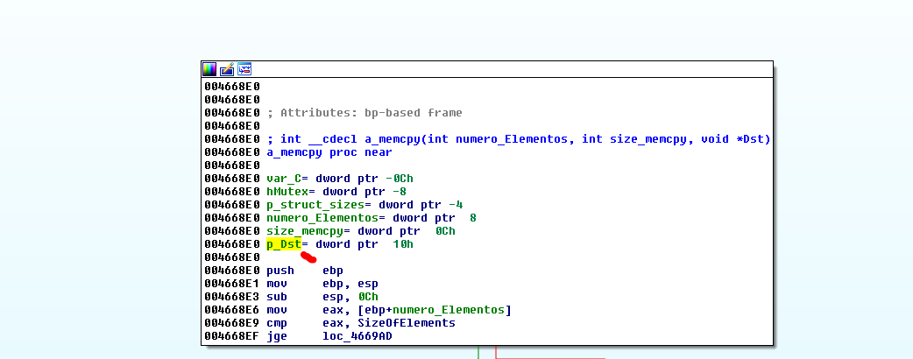

И в ссылке которая является уязвимой функцией также это аргумент типа указатель.

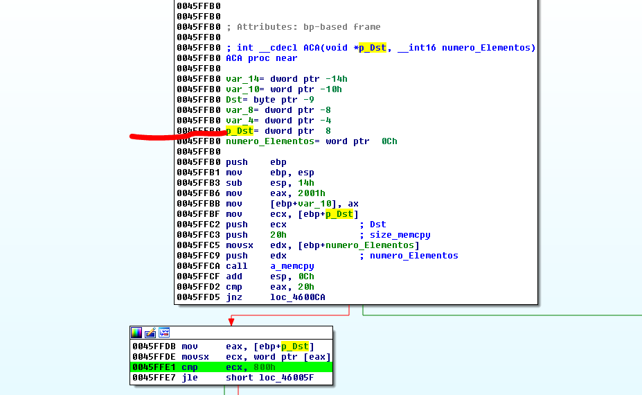

И в этой ссылке, это переменная типа указатель также которая называется SRC. Давайте посмотрим откуда она идет.

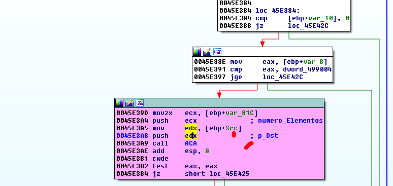

Мы видим, что это буфер в стеке откуда берется адрес и сохраняется в переменную указатель SRC.

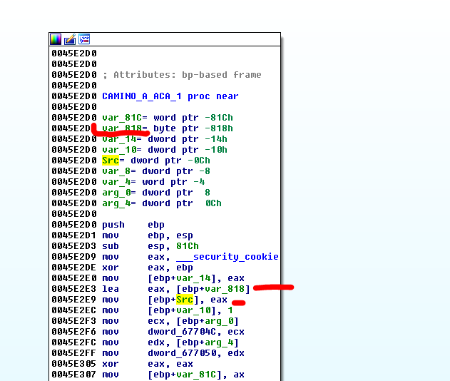

Давайте посмотрим длину буфера.

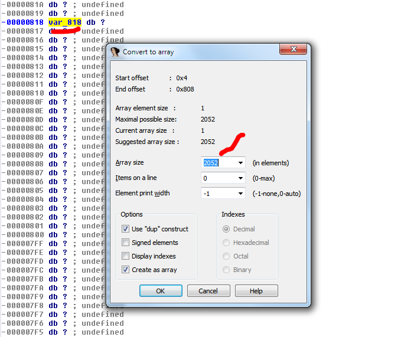

Он равен 2052, т.е. 0x804

Python&gt;HEX\(2052\)

0x804

Поэтому если мы сможем скопировать чуть больше 0x804 произойдет переполнение. Мы уже видели, что можно создать с помощью вычитания отрицательный размер, поэтому мы можем переписать весь стек, включая SEH, если у него есть COOKIE.

Мы видим, что перед возвратом из этой функции, которая имеет буфер есть проверка COOKIE.

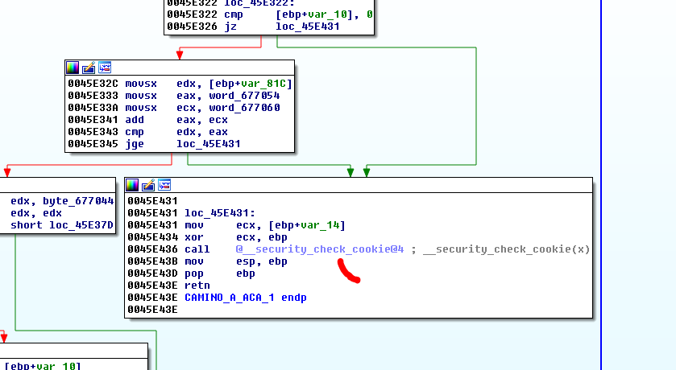

Мы также можем избежать этого перезаписав SEH, так что давайте продолжим.

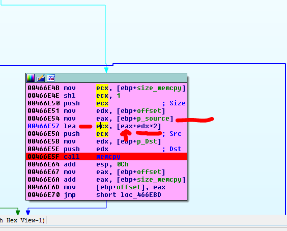

В последнем вызове MEMCPY, чтобы увидеть, откуда берутся данные которые будут копироваться здесь, мы видим, что есть инструкция LEA, результатом которой является указатель на SRC, есть вызов EDX \* 2 внутри инструкции LEA, поэтому я предполагаю, что регистр EDX будет смещением, так как указатель не умножается, и если смещение, а регистр EAX будет базовым указателем буфера SRC, поэтому я поставил P\_SOURCE, возможно, регистр EDX равен 0 в начале и в конце копирует из начала буфера, указанного P\_SOURCE.

Хорошо. P\_SOURCE это переменная типа указатель. Давайте вернемся назад, и посмотрим откуда она взялась.

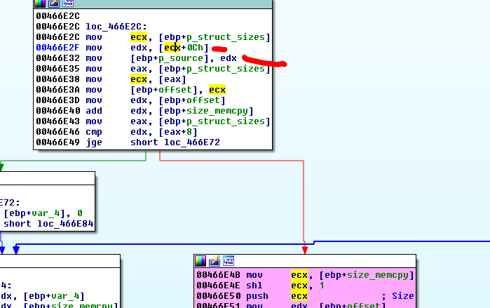

Мы видим, что здесь программа сохраняет его и что оставляет поле 0xC структуры, и поскольку я понятия не имею что это, я назвал его как STRUCT\_SIZES. Вы увидите почему это так дальше. Но может подойти и любое имя.

Так я создал маленькую структуру из 4 байт и назвал её так.

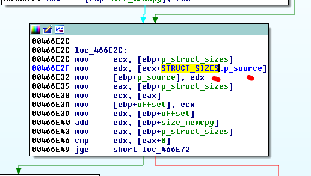

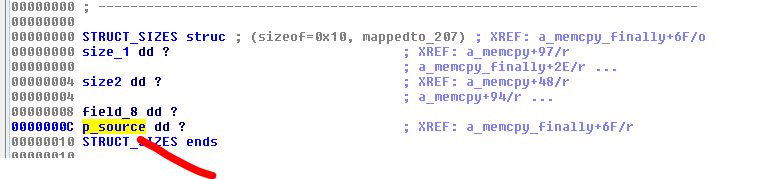

Мы смотрим выше, потому что на данный момент это не имеет большого значения, что SIZE\_MEMCPY сравнивается с вычитанием первыми двумя DWORDS структуры, которые я назвал SIZE1 и SIZE2, и если SIZE\_MEMCPY меньше, чем вычитание обоих, программа будет использовать это, если не другой.

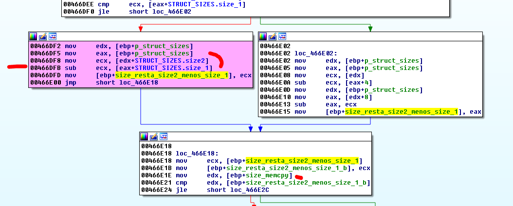

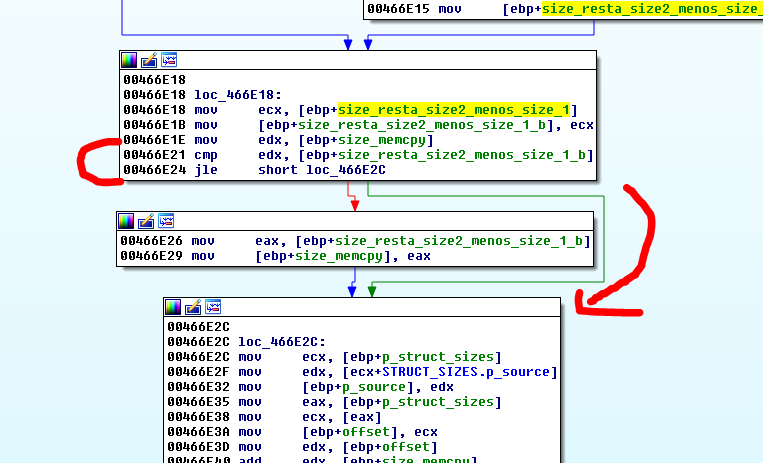

Мы видим также, что P\_SOURCE структуры STRUCT\_SIZES используется раньше и что он не сохраняется в этой функции, поскольку при просмотре всех мест, которые использует P\_STRUCT\_SIZES, нет ни одного, который бы сохранял указатель в этом поле.

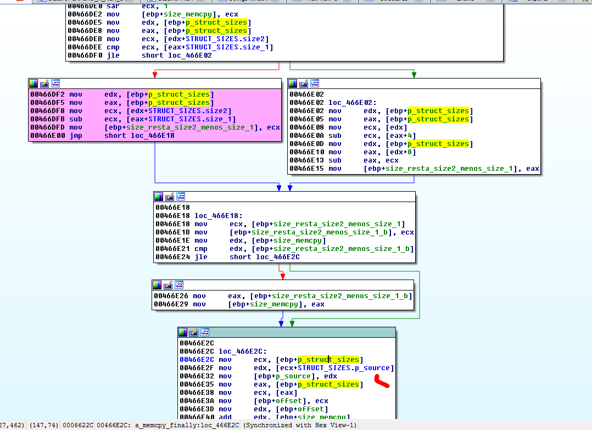

Всего лишь читаем здесь. Давайте посмотрим на ссылку.

Мы видим, что указатель на структуру генерируется и сохраняется здесь, поэтому создание указателя P\_SOURCE должно быть позже этого.

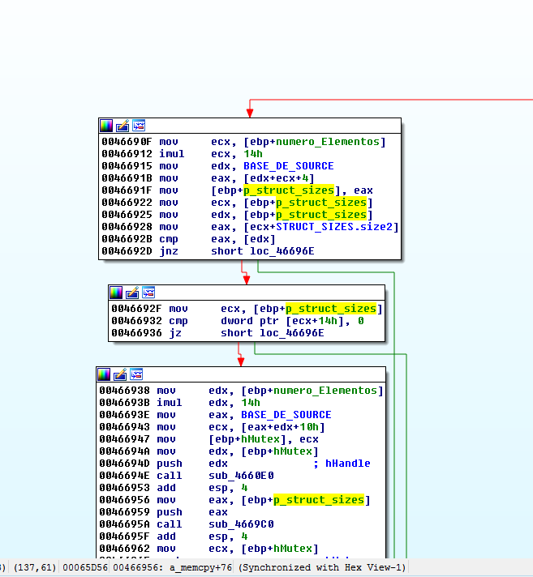

Давайте проанализируем здесь формулу как рассчитывается указатель на структуру P\_STRUCT\_SIZES.

Мы видим, что есть глобальная переменная, которую я назвал ее BASE\_DE\_SOURCE, содержимое которой является указателем, который является базой всего.

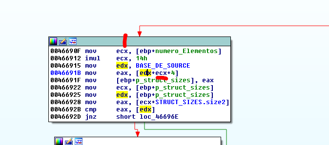

В регистр ECX помещается NUMERO\_ELEMENTOS. Возможно это смещение и затем идет добавление числа 4, другими словами из фиксированной глобальной переменной. Я могу найти её содержимое, добавив 4 b получить указатель на структуру в которой 4-тый DWORD будет иметь указатель на источник.

Важно видеть, что SRC происходит из глобальной переменной, потому что, поскольку информация передается между потоками. Очень вероятно, что будет использоваться эта переменная для сохранения в потоке RECV и затем поднимать ее в другом потоке.

Если мы запустим отладчик, мы увидим, что в глобальной переменной BASE\_DE\_SOURCE есть указатель. В моем случае он равен 0x1EBEBBB8.

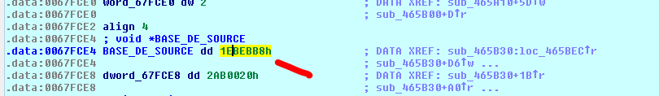

Как мы помним, что к этому значению программа добавляет 4 и находит содержимое, которое является указателем на P\_STRUCT\_SIZES.

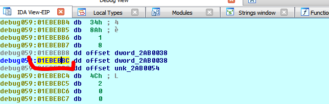

К содержимому BASE\_DE\_SOURCE я добавляю 4 и это содержимое - это P\_STRUCT\_SIZES. В моем случае это равно 0x2AB0038. Если я пойду туда и нажму T.

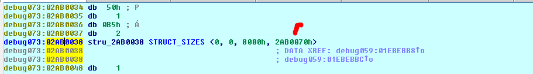

Поле 4 \(0xC\) является указателем на источник. Проще всего было бы перейти туда, где пусто, и поместить BPM, чтобы посмотреть, скопирую ли я туда свои фрукты и где это происходит.

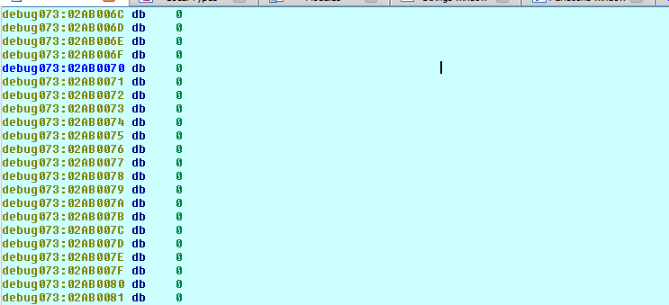

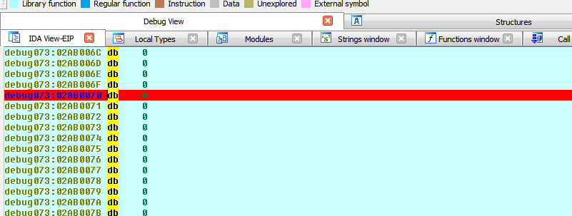

Мы видим, что отладчик остановился здесь.

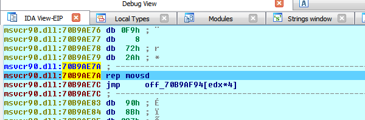

И мы видим, что копируются мои фрукты.

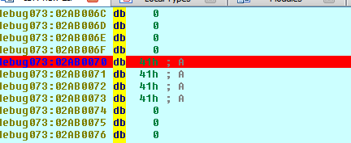

Если мы посмотрим на CALL STACK.

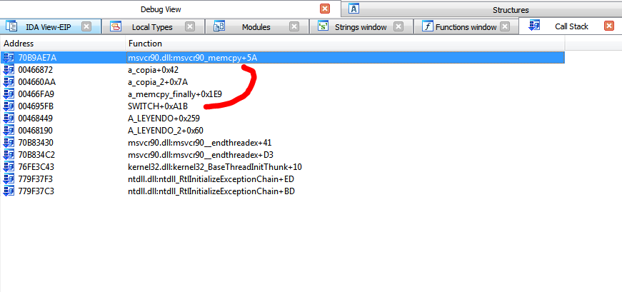

Мы видим, что есть путь от LEYENDO, который проходит через SWITCH и который пишет там, и мы можем продолжить туда, где программа копирует данные.

Мы видим, что второй раз копируется знаменитый 0x3E, который многие нашли в цикле, вместо нашего значения, поэтому мы знаем, куда идти и возможный путь. Теперь, когда нам ясно, мы должны продолжать смотреть на SWITCH.

Также если мы посмотрим немного на способы получить эту копию из SWITCH.

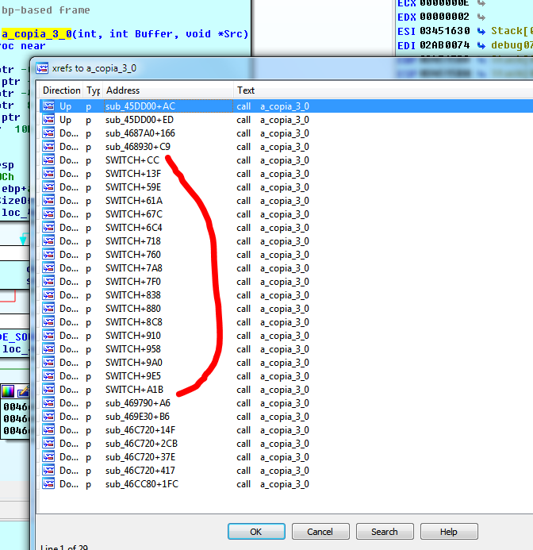

Мы видим, что есть много способов попасть туда и мы прибываем не в то место, так как есть много действительных опкодов, которые приходят от COPIA, и мы бросаем что-нибудь, не обращаем внимания, что это действительный код операции.

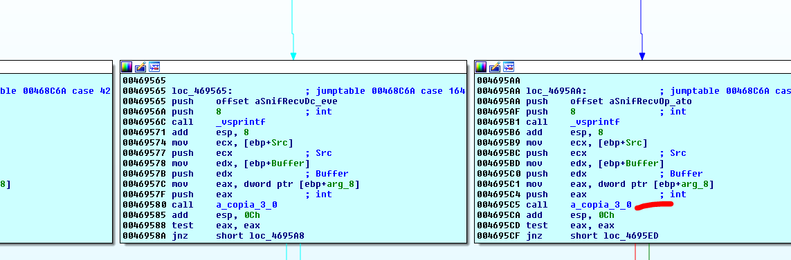

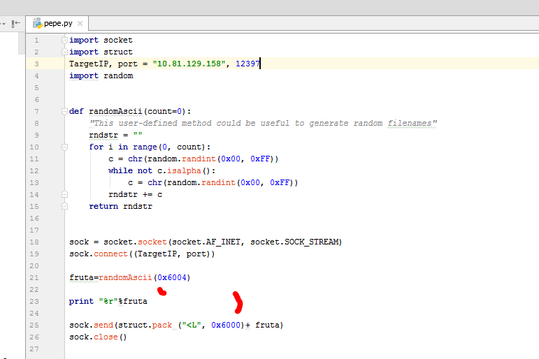

Я создам случайную строку и напечатаю ее, чтобы увидеть, какая позиция достигает OPCODE, чтобы исправить его.

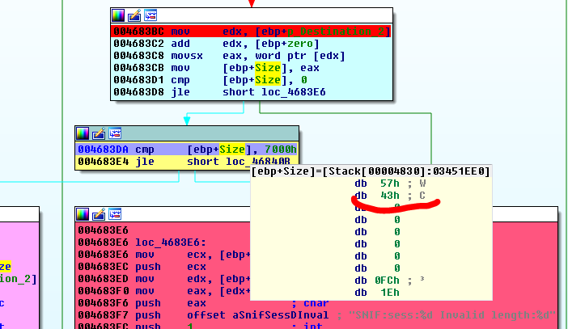

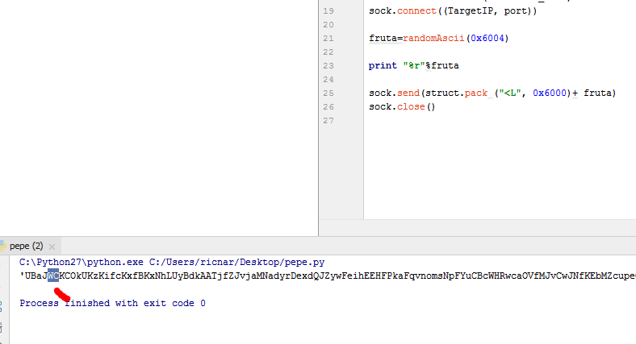

Мы исправляем пакет, который нам нужно передать.

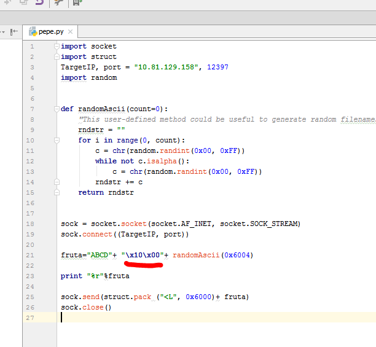

Я поместил пакету размер 0x10, чтобы увидеть, что после установки правильных опкодов я дойду до уязвимой функции.

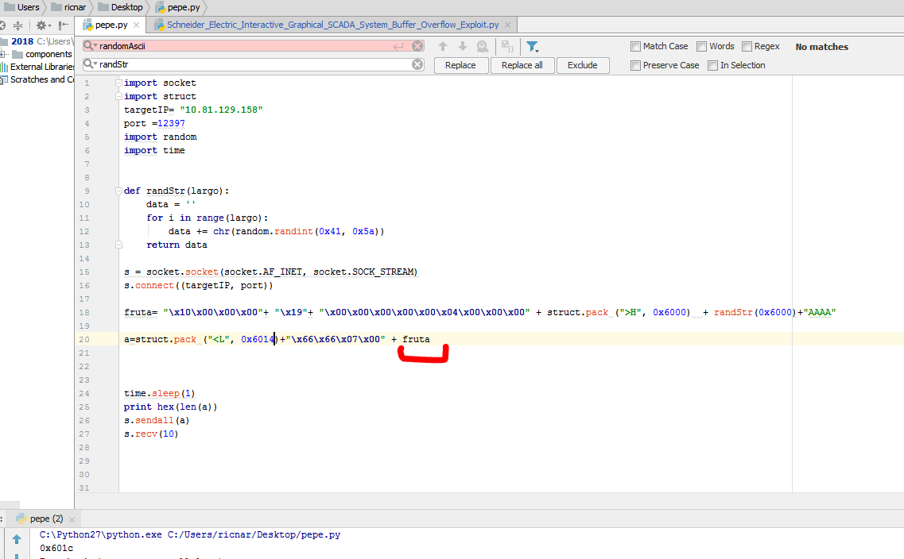

Я вижу, что отправляя программе 0x19 всегда и до тех пор, пока я выполняю RECV в конце после отправки, и соблюдаю длину пакета равную 0x6014, что является первыми двумя байтами размера, без проблем завершилась мной в MEMCPY.

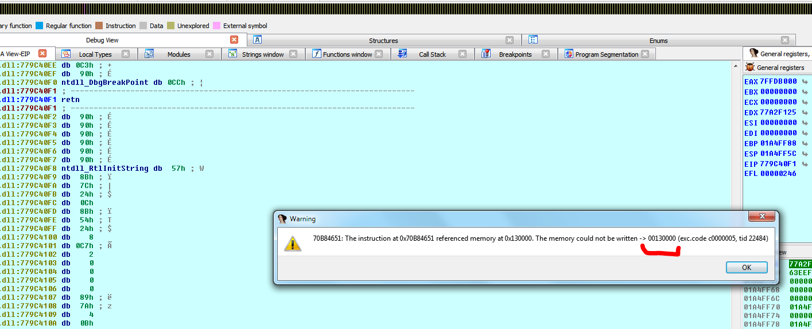

Здесь программа падает. Я копирую весь стек.

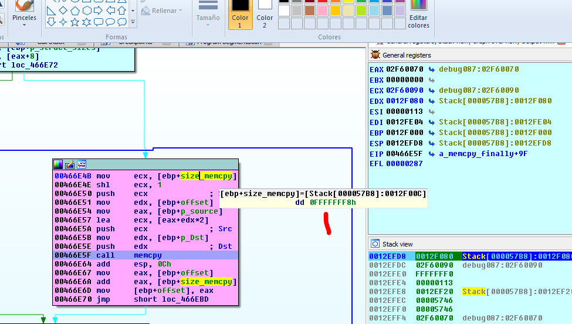

Если кто-то не поместит recv, программа скопирует 0x3E в буфер, т.е. 0x3E это длина этого пакета, который создаётся, когда завершается соединение. Если мы увидим, что пакет имеет длину строки 0x3E.

"SESSION TERMINATED"

Если мы ищем эту строку, это будет здесь.

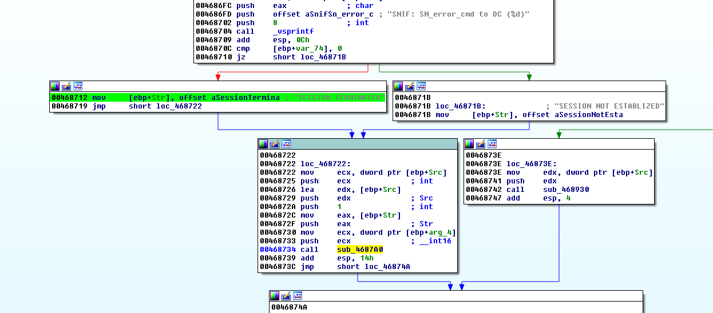

Указатель на эту вторую строку передается как второй аргумент.

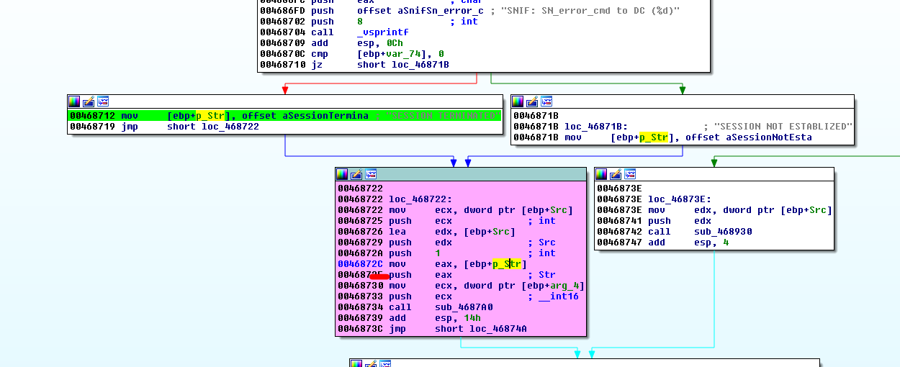

Мы видим, что затем программа переходит к функции STRCPY, где она копирует строку в позицию 0x24 буфера, указатель которого находится в переменной VAR\_8.

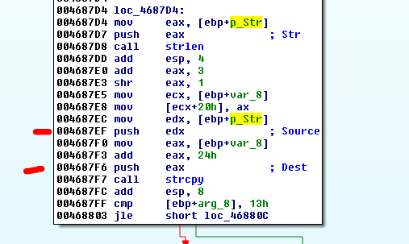

Если VAR\_8 мы переименуем P\_DESTI то нужно посмотреть откуда он происходит.

Мы видим, что это буфер в стеке, адрес которого хранится в переменной указателя P\_DESTI.

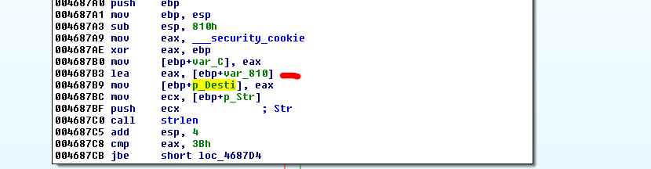

И в начале того же самого буфера должно сохраниться значение 0x3E. Оно происходит отсюда. Есть аргумент, который я назвал CONSTANTE.

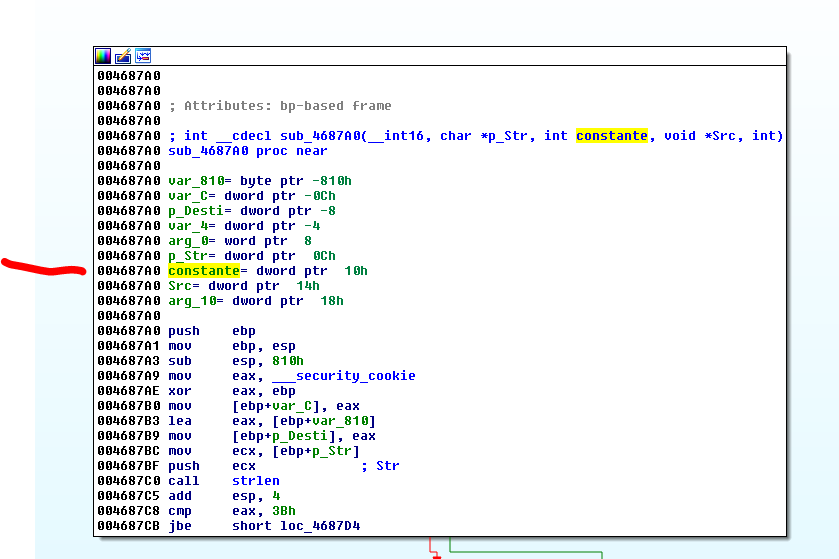

На ссылке увидим, что это 1.

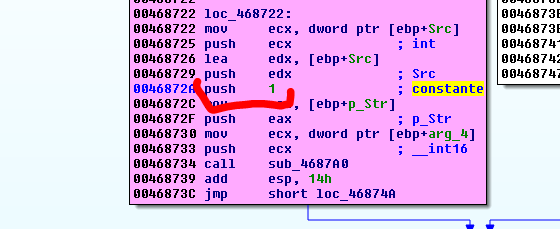

Мы видим, что программа сравнивает значение с 0x13.

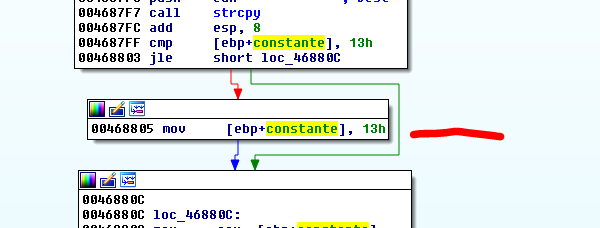

Если оно меньше или равно, то всё хорошо, а если равно 1, то ничего не случиться.

Мы видим, что к ECX прибавляется 1 y сохраняется значение 0x2 в EDX+0x22.

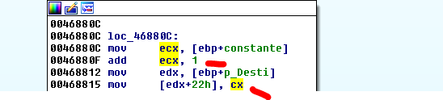

Есть также еще одна константа, которая выходит из длины строки SESSION TERMINATED.

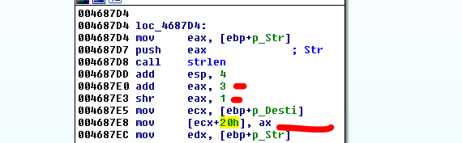

К этой длине 0x12 программа добавляет 3 и выполняет SHR, 1

shr eax, 1 ;Signed division by 2

Т.е.

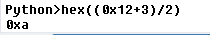

Что даёт нам значение 0xA.

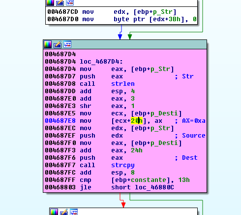

Значит в позиции 0x22 есть 2, а в позиции 0x20 0xA.

Программа складывает два значения здесь.

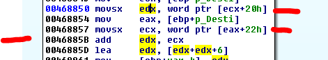

И затем к результату прибавляется сам результат и число 6.

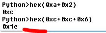

Затем.

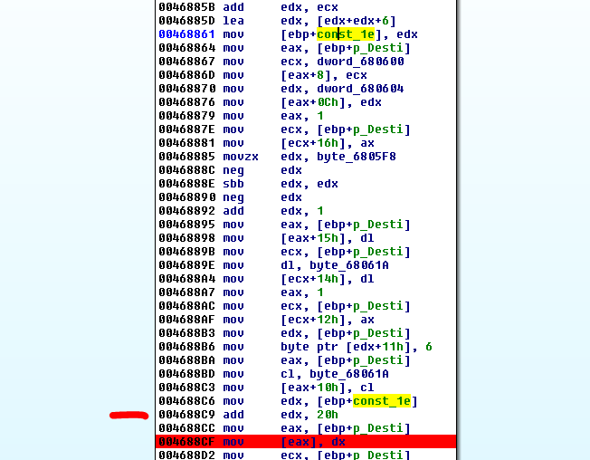

Программа добавляет значение 0x20, преобразуя его в значение 0x3E, которое переносит нас в конец сеанса, и сохраняет его в первом месте того буфера, который затем копирует.

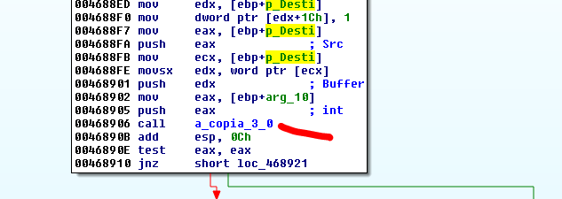

Здесь внутри мы знаем, что программа скопировала его в наш буфер, из которого выходит значение, которое проходит через уязвимую функцию.

А сейчас, почему если мы не поставим RECV, программа проходит здесь и все рушит? Вы можете сделать сравнение с и без RECV. Когда мы его убираем RECV программа проходит здесь. Если у программы есть RECV она не проходит и поскольку строка говорит, что сессия завершена, мы можем предположить, что recv поддерживает сессию открытой, и во время сбоя любой......?, Если кто захочет, может проверить это, если это так, используя WIRESHARK, просматривая, если соединение рвется, программа идет сюда, чтобы скопировать 0x3E, а если всё нормально, то она упадет.

Чтобы вы не думали что я вру.

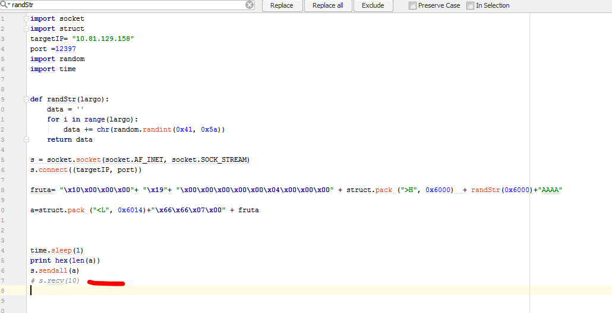

Я удаляю RECV и запускаю.

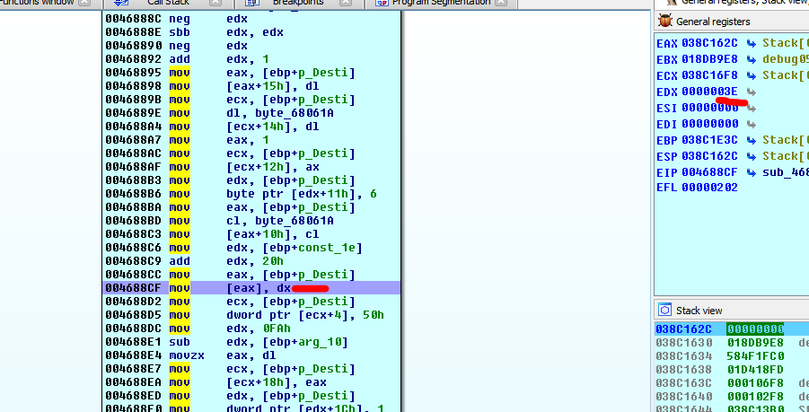

Мы видим, что программа сохраняет здесь 0x3E.

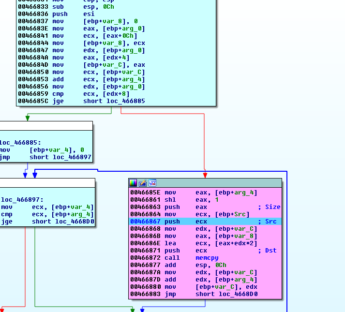

Мы видим, что я трассирую до функции MEMCPY.

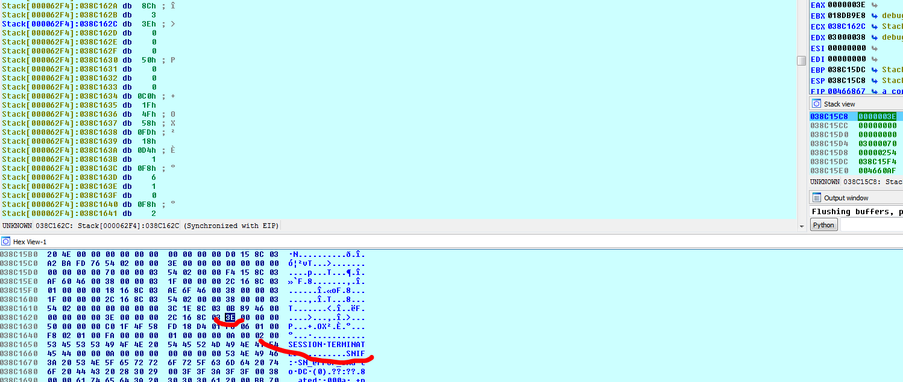

Мы видим, что 0x3E со строкой SESIÓN TERMINATED.

Мы видим, что на DESTINATION у которого есть наши фрукты, будут перезаписаны, а 0x10 будет перезаписан 0x3E.

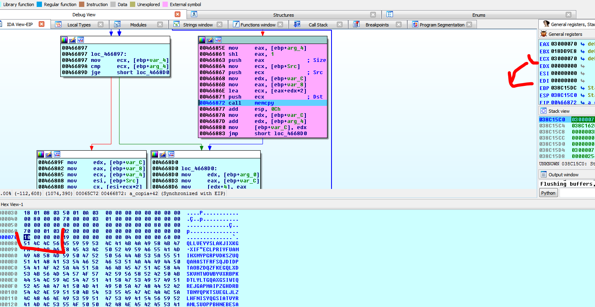

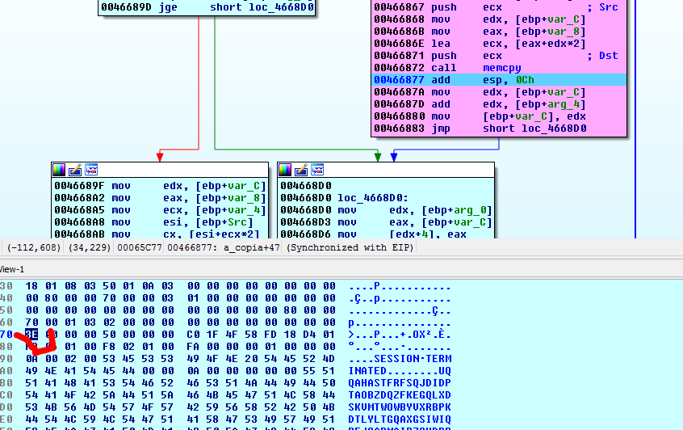

Если я помещу BPA и помещу BP на уязвимую функцию, программа прочитает это значение.

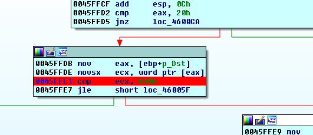

Я нажимаю на RUN.

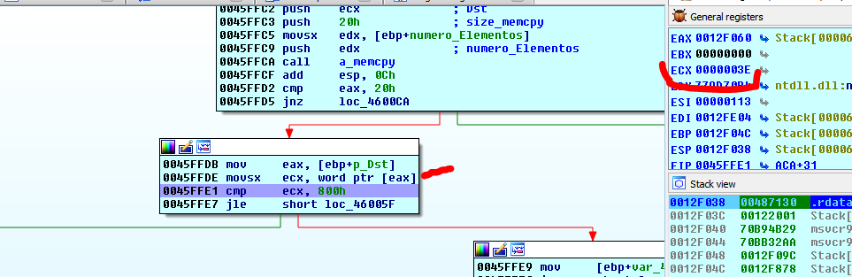

И здесь все передается, т.е. Мы можем закончить наш пример.

В качестве последнего вопроса меня спросили, есть ли какой-либо способ увидеть с помощью IDA, есть ли какой-либо путь к глобальной переменной, чтобы получить место, где программа копирует данные.

Мы пойдем на функцию откуда было копирование.

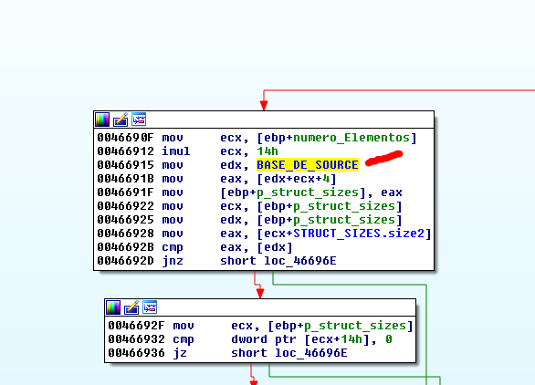

Делая двойной клик на глобальной переменной.

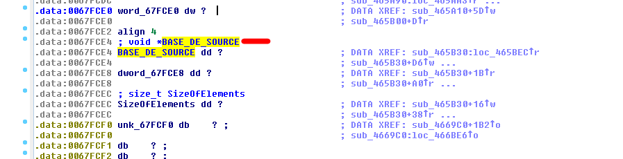

Я нажимаю на клавишу минус.

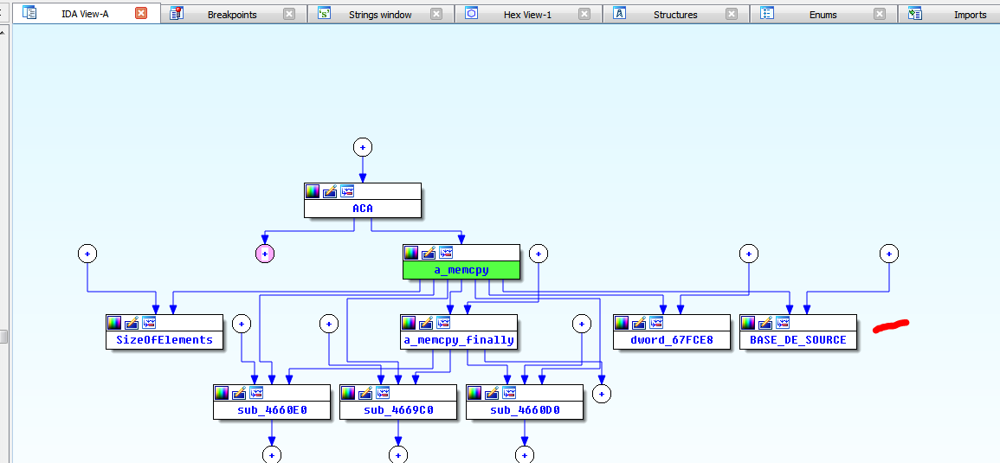

Затем делаю клик в пустой части и выбираю ADD NODE BY NAME.

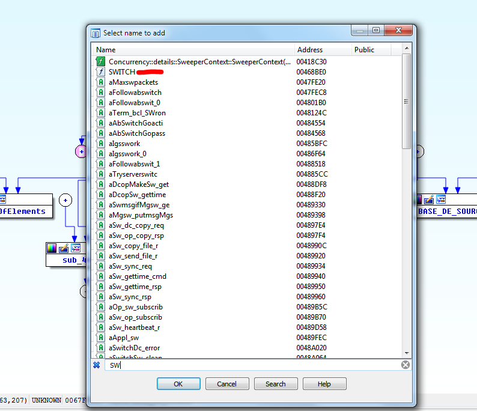

Я выбираю SWITCH.

Мы видим, что она осталась там свободной.

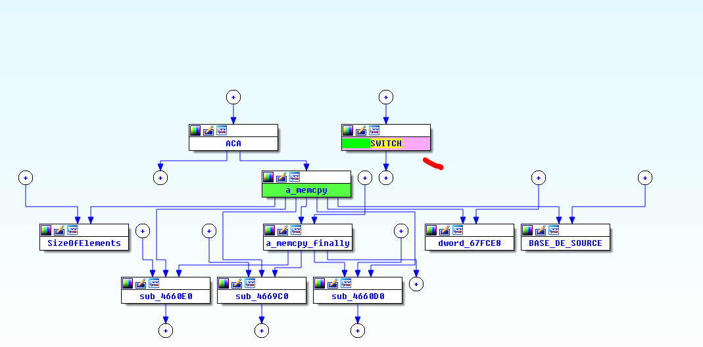

Давайте посмотрим есть ли пути между ними. Их конечно будет много.

Если мы сделаем клик на SWITCH и выберем FIND PATH как BASE DE SOURCE это не функция и она не появляется в списке назначений, но если сделаем наоборот и выберем FIND PATH в BASE DE SOURCE.

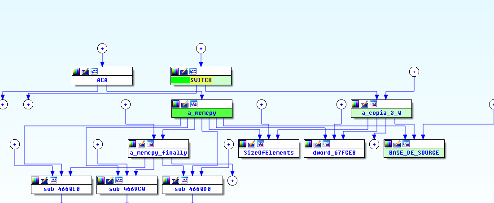

Этот блок мы можем покрасить через SWITCH→ PATHS.

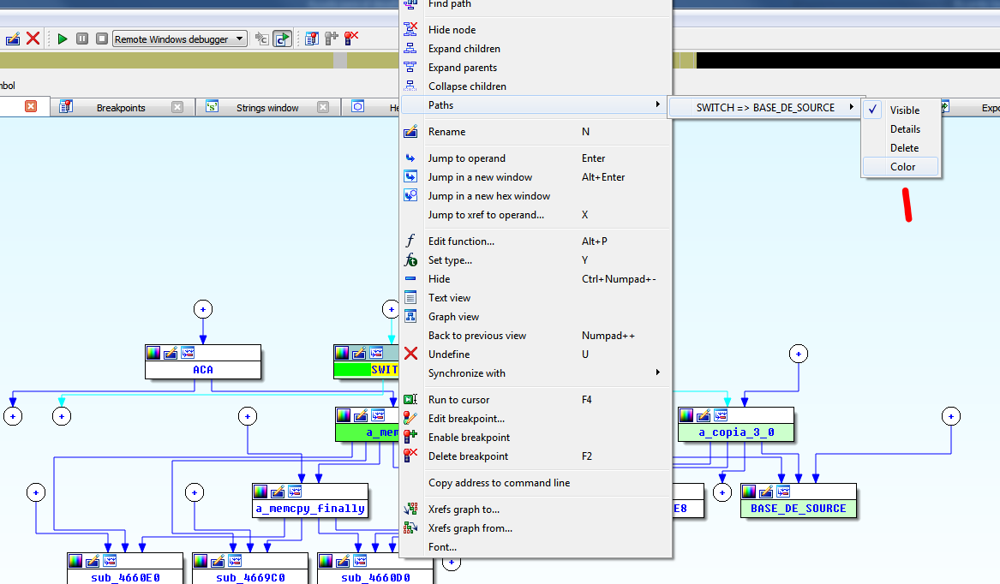

Сейчас смотрится лучше.

Мы хотим получить список.

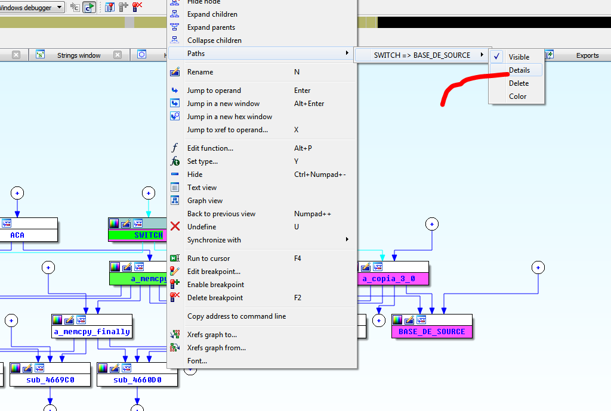

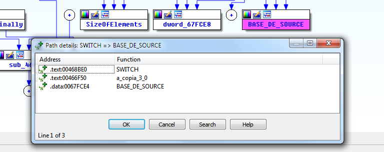

Здесь есть путь от SWITCH к любым опкодам, которые приведут вас к функции A\_COPIA\_3\_0, и приведут вас к доступу к глобальной переменной, которую мы должны увидеть.

Ну вот и всё. Это был серьзный соперник для нас, но, поскольку это настоящее программное обеспечение, у него есть свои заморочки, но чтобы победить его, вам нужно больше практиковаться, чтобы иметь больше навыков в статическом реверсинге.

**=======================================================
Автор текста: Рикардо Нарваха** - **Ricardo** **Narvaja** \(**@ricnar456**\)
Перевод на русский с испанского: **Яша\_Добрый\_Хакер\(Ростовский фанат Нарвахи\).**
Перевод специально для форума системного и низкоуровневого программирования — **WASM.IN
18.04.2019
Версия 1.0**
